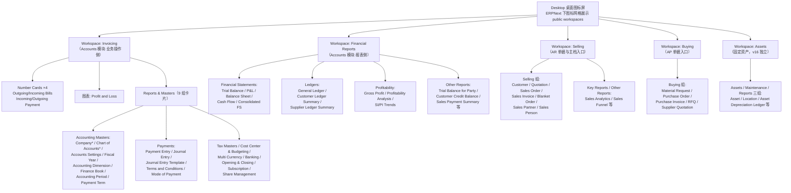
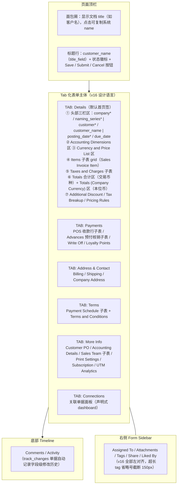
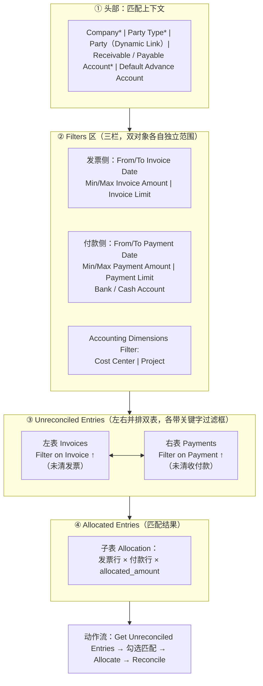

# 第 1 章 模块地图与页面设计

> 本套文档是对 ERPNext v16 财务会计（FI）与应收账款（AR）领域的深度调研，面向正在自研财务系统（应收、对账、开票报表）的全栈工程师，目标是把 ERPNext 沉淀十余年的产品设计认知转化为可复核、可迁移的技术知识。全套共五章：第 1 章模块地图与页面设计、第 2 章业务流程、第 3 章数据模型、第 4 章架构、第 5 章自研映射。
>
> 调研方法：以 Frappe/ERPNext 官方 v16.0.0 Release Notes、官方特性页与迁移 Wiki 定版本事实，以 GitHub `version-16` 分支的 Workspace JSON、DocType JSON 与前端 JS 源码定机制事实（访问日期 2026-07-28，当时补丁线约 v16.28–v16.29）；docs.frappe.io 用户手册多数页面仍停留在 v15 时代，仅作概念补充并显式标注。所有结论均给出可复核的源码路径或官方原文。
>
> 本章是全套文档的"地图层"：先讲清 v16 导航体系发生了什么结构性变化、应收链路在全景中的位置，再解剖 Frappe Desk 的三种页面形态（List / Form / Report），最后逐个拆解 AR 链路上的五个关键页面，并在章末提炼页面与导航层面可直接迁移到 React 自研系统的设计模式。读完本章，你应当能在脑中重建 ERPNext v16 的应收工作台面，并知道每个设计决策的证据在哪里。

## 1.1 v16 导航体系与 Accounting 模块地图

### 1.1.1 v16 Workspace 框架与 Accounting 拆分（Invoicing + Financial Reports 双工作区）

理解 ERPNext v16 的模块地图，必须先理解它的导航框架，因为 v16 对 Desk（ERPNext 的管理后台界面）做了一次彻底重构，入口位置与 v15 完全不同。

v16 的导航是三层结构。**第一层是 Desktop（桌面图标屏）**：v16 重新引入了桌面屏，以图标网格展示所有 public workspace，官方原文为 "In version 16, we also introduce the desktop screen. This shows icons for the all the public workspaces."，官方博客称之为"标志性桌面视图回归"（"The iconic desktop view returns"）[^1^][^2^][^3^]。**第二层是 Workspace Sidebar（工作区侧栏）**：每个 workspace 打开后带一个持久化左侧栏，由新的 `Workspace Sidebar` DocType 驱动，"keeps related items neatly grouped"，图标可排序、可搜索[^2^][^3^]。**第三层是页面本身**（List / Form / Report，见 1.2）。配套的路由变化是：Desk 前端路由从 `/app` 改为 `/desk`，`/apps` 页废弃；全局搜索 Awesome Bar 移入侧栏，以 `cmd + k` 命令面板形式唤起[^3^]。一个需要注意的破坏性变更：用户对标准 workspace（如 Buying、Selling）做过的自定义修改在升级到 v16 后会丢失[^3^]。

第二层还有一个对自研系统极有参考价值的细节：Workspace Sidebar Item 的设置里新增了 Filters 区域，侧栏链接可以预置过滤条件，点击后直接打开"已应用这些过滤器的目标列表"——即"导航项 = 一个预过滤的列表视图"[^4^]。这把导航从"静态目录"变成了"任务入口"。

在这个框架之上，Accounting 模块的 workspace 组织发生了 v16 最重要的结构性变化——拆分：

| 维度 | v15 | v16 |
|---|---|---|
| Accounts 模块 workspace | 单一 **Accounting** workspace | 拆为 **Invoicing** + **Financial Reports** 两个 workspace；旧 `accounting` workspace 已删除（`version-16` 分支该路径返回 404）[^5^][^6^][^10^] |
| 单据入口 | Accounting workspace 顶部 shortcuts：Chart of Accounts、Sales Invoice、Purchase Invoice、Journal Entry、Payment Entry、Accounts Receivable、General Ledger、Trial Balance 等[^10^] | Invoicing workspace **shortcuts 数组为空**；Sales Invoice、Customer 入口归入 **Selling** workspace，Purchase Invoice 归入 **Buying** workspace[^5^][^7^][^8^] |
| 报表入口 | 报表混在 Accounting workspace 的 "Reports & Masters" 卡片中[^10^] | 财务报表统一收敛到 **Financial Reports** workspace（Trial Balance、P&L、Balance Sheet、Cash Flow、General Ledger 等）[^6^] |
| 首屏数据 | 4 张 Number Card + Profit and Loss 图表[^10^] | Invoicing 保留 4 张 Number Card（Outgoing Bills / Incoming Bills / Incoming Payment / Outgoing Payment）与 Profit and Loss 图表，下方为 9 个 "Reports & Masters" 卡片[^5^] |

这次拆分的产品语义值得停下来理解：它不是简单的"目录太长了分一下"，而是把同一批会计数据**按角色任务重新分桶**——开票、收款是业务人员的日常操作（跟着 Selling/Buying/Invoicing 走），账簿与报表是财务人员的视角（收敛到 Financial Reports）。ERP 的用户不是"管表的人"，而是开票的、收款的、对账的、出报表的；v16 的导航重组正是把"按数据归属组织"换成了"按角色任务组织"。

⚠️ 待验证项：v16 运行态下 Invoicing workspace 的实际侧栏是否包含 Sales Invoice / Purchase Invoice 入口。标准 workspace JSON 中 shortcuts 为空已确认[^5^]，但 v16 侧栏由 `Workspace Sidebar` 机制自动生成[^3^]，自动生成的侧栏内容可能与 JSON 中声明的卡片链接不完全一致；目前未找到 v16 标准 Workspace Sidebar 记录文件佐证，此处以 workspace JSON 为准。

### 1.1.2 FI 完整模块地图树状清单与 AR 的位置

下面用一张图给出 v16 标准配置下与 FI/AR 相关的完整模块地图。所有分支均可与 `version-16` 分支的 workspace JSON 逐一核对[^5^][^6^][^7^][^8^][^9^]。



图 1-1 解读：注意 **Sales Invoice 与 Customer 不在 Accounts 模块名下，而在 Selling workspace**；Payment Entry、Journal Entry 在 Invoicing workspace 的 Payments 组；而账龄类报表（Accounts Receivable）在这张地图里**根本没有出现**——这一点下文详述。标 `*` 的 Company 与 Chart of Accounts 是 workspace JSON 中标记 `onboard: 1` 的初始化引导项[^5^]。

AR 在 ERPNext 里不是一个独立模块，而是一条跨模块链路。把链路上的每个环节映射到它在 v16 的"栖息地"，会得到下面这张表——它比模块树更能说明 ERPNext 的组织逻辑：

| AR 环节 | 载体（DocType / Page / Report） | v16 所在 workspace | 证据 |
|---|---|---|---|
| 主档 | Customer | Selling → Selling 组 | [^7^] |
| 应收确认 | Sales Invoice | Selling → Selling 组 | [^7^] |
| 收款 | Payment Entry（Payment Type = Receive） | Invoicing → Payments 组 | [^5^] |
| 核销 | Payment Reconciliation（Page 型工具） | **不在任何 workspace**，从 Sales Invoice / Payment Entry 表单或全局搜索进入 | ⚠️ 标准 workspace JSON 全量检索未见；入口依赖表单内按钮与搜索 |
| 账龄报表 | Accounts Receivable（账龄明细/汇总） | **不在任何标准 workspace**（v15 曾是 Accounting 的 shortcut[^10^]）；v16 从 Customer 表单 View 按钮穿透进入（见 1.3.1） | [^11^] |
| 余额汇总 | Customer Ledger Summary | Financial Reports → Ledgers 组 | [^6^] |
| 对账单输出 | Process Statement of Accounts | 不在 workspace，工具型 DocType | [^12^] |
| 催收 | Dunning（付款催告） | 不在 workspace，从 Sales Invoice 的 Create 下拉派生 | [^13^] |

表 1-1 解读：ERPNext 的组织逻辑可以概括为三句话——**主档与单据跟着业务流走**（Customer / Sales Invoice 归 Selling），**资金与账簿跟着会计走**（Payment Entry / Journal Entry 归 Invoicing），**报表独立成区**（Financial Reports）。而工具型页面（核销工作台、对账单生成器）和账龄报表则**干脆不进导航树**，靠"单据页内穿透"抵达。对功能体量较小的自研系统，可以把前三类合并为一个"应收管理"分组，但"工具页与账龄表靠穿透而非目录"的思路值得保留——它避免了导航树无限膨胀。

这里要特别写清一个反直觉发现，因为它是 v16 的一个真实产品决策，也容易让按 v15 经验找入口的用户困惑：**Accounts Receivable 账龄报表在 v16 全部标准 workspace JSON 中均未出现**（调研时对 `version-16` 分支所有 workspace JSON 做了全量检索）。v15 时代它是 Accounting workspace 的 shortcut[^10^]；v16 把"单据操作"与"报表"在导航上分离、报表统一收敛到 Financial Reports 的同时，**AR/AP 账龄表反而未被 Financial Reports 收录**。v16 标准配置下进入 AR 账龄表的官方路径是：打开某个 Customer 表单，点击 **View → Accounts Receivable** 按钮，系统携带 `party_type` / `party` 过滤参数自动跳转到报表[^11^]；或使用全局搜索。⚠️ 待验证：是否存在某个标准 `Workspace Sidebar` 记录（而非 workspace JSON）提供了 AR 报表直达入口——sidecar 式的 sidebar 记录文件未逐一排查，目前结论是"标准 workspace JSON 中确认缺席，穿透路径确认存在"。

⚠️ 另一个需要说明的版本归属问题：docs.frappe.io 的 ERPNext 用户手册（如 Accounts Receivable and Payable 一节[^14^]）的截图与操作描述停留在 v15 时代，与本章描述的 v16 导航存在明显差异。本章所有布局与入口论断均以 `version-16` 分支源码与 v16 官方 release 材料为准，手册仅用于概念背景。

## 1.2 页面形态三套路

Frappe Desk 的全部业务页面由三种元数据驱动的视图构成：List（列表）、Form（表单）、Report（报表）。对自研中后台而言，这相当于三套可复用的页面模板——ERPNext 数百个业务页面几乎不脱离这三种形态，本节逐个解剖，最后补一节打印体系。

### 1.2.1 List 视图解剖（过滤器、状态色标语义）

**过滤器体系（v16 有重要改版）**。v16 移除了 List 视图右侧的 sidebar（官方原文："Another major update in the List View is the removal of the right sidebar. Again this was done to make better use of screen real estate."），Saved Filters（收藏的过滤方案）上移到列表顶部；Quick Filters 改为**用户级自定义**——以前加快捷过滤要改 DocType 定义，现在用户可在列表页自行选择，且互不影响其他用户[^3^]。配合 1.1.1 提到的"侧栏导航项可预置过滤条件"[^4^]，v16 的列表过滤形成了一个完整闭环：导航带过滤 → 顶部保存过滤 → 行内快捷过滤。另有两个细节：Link 字段的过滤操作符用自然语言显示（"is after"、"not equals"、"is enabled"，替代 `>`、`!=` 符号）[^4^]；v16 列表支持任意多列并横向滚动（"Scrollable List View — ... add as many columns as you want, scroll horizontally"）[^1^]。

**状态色标（indicator）语义**是列表页最值得逐字抄走的设计。它分两层：框架级默认逻辑与单据级自定义映射。

框架级逻辑在 `frappe/public/js/frappe/model/indicator.js`，按优先级判定每行记录的状态徽标颜色[^15^]：

| 状态 | 颜色 | 判定来源（源码摘录） |
|---|---|---|
| Not Saved（未保存） | orange | `return [__("Not Saved", null, doctype), "orange"]` |
| Draft（docstatus = 0，草稿） | **red** | `return [__("Draft", ...), "red", "docstatus,=,0"]` |
| Submitted（docstatus = 1，已提交） | **blue** | `return [__("Submitted", ...), "blue", "docstatus,=,1"]` |
| Cancelled（docstatus = 2，已取消） | **red** | `return [__("Cancelled", ...), "red", "docstatus,=,2"]` |
| Enabled / Disabled（非提交型主档） | blue / grey | 同文件尾部分支 |
| Workflow State（工作流状态，若有） | Success→green，Warning→orange，Danger→red，Primary→blue，Inverse→black，Info→light-blue | 同文件 workflow 分支 |

表 1-2 解读：判定优先级为 Workflow State > Draft/Cancelled > DocType 自定义 `get_indicator` > Submitted > status 字段猜色 > enabled/disabled[^15^]。注意 `docstatus` 是 Frappe 单据生命周期字段（0=草稿、1=已提交、2=已取消），框架默认把"草稿/取消"都标红——即**红色 = 需要人处理的异常态**，而不是"删除/错误"。

业务单据通常用 DocType 自带的 `get_indicator` 覆盖默认色。以 Sales Invoice 列表（`sales_invoice_list.js`）为例，其自定义映射逐字摘录如下[^16^]：

```js
const status_colors = {
    Draft: "red",
    Unpaid: "orange",
    Paid: "green",
    Return: "gray",
    "Credit Note Issued": "gray",
    "Unpaid and Discounted": "orange",
    "Partly Paid and Discounted": "yellow",
    "Overdue and Discounted": "red",
    Overdue: "red",
    "Partly Paid": "yellow",
    "Internal Transfer": "darkgrey",
};
return [__(doc.status), status_colors[doc.status], "status,=," + doc.status];
```

对应的语义表：

| SI 状态 | 颜色 | 语义 |
|---|---|---|
| Paid | green | 钱已清 |
| Partly Paid（含折扣变体） | yellow | 部分清 |
| Unpaid（含折扣变体） | orange | 未清 |
| Overdue（含折扣变体） | red | 异常：逾期未收 |
| Draft | red | 异常：草稿待提交 |
| Return / Credit Note Issued | gray | 已闭环的旁支（退货/红冲） |
| Internal Transfer | darkgrey | 内部往来，不参与催收语义 |

表 1-3 解读：这套配色构成一套完整的"收款健康度色盲友好语言"——绿=已清、黄=部分清、橙=未清、红=需处理（草稿/逾期/取消）、灰=闭环旁支。还有一个极易被忽略的机制：`get_indicator` 返回值的第三段 `"status,=," + doc.status` 是一个过滤表达式，意味着**点击状态徽标本身就会按该状态过滤列表**——状态徽标同时是过滤入口[^16^]。此外 SI 列表用 `right_column: "grand_total"` 把总金额列固定在列表右侧，横向滚动时始终可见[^16^]。

**批量操作**：列表勾选多行后出现 Actions 菜单。SI 列表注册了 "Delivery Note" 与 "Payment" 两个批量派生动作，走 `erpnext.bulk_transaction_processing` 批量生成下游单据[^16^]；v16 起网格行的批量按钮会显示选中数量（如 "Delete 3 rows"），选中行时隐藏 "Add row"[^4^]。

### 1.2.2 Form 视图解剖（头部字段区 / 子表 grid / 合计区 / 按钮区 / Dashboard 关联面板 / Activity）

Frappe 表单是元数据驱动的：DocType JSON 的 `field_order` 与字段定义决定整个页面结构，布局原语只有四种——**Tab Break（页签）、Section Break（分区卡片）、Column Break（分栏）、Table（子表 grid）**。下图以 v16 Sales Invoice 为标本做整体解剖[^17^]：



图 1-2 解读：表单的信息流是"凭证头（谁-谁-何时）→ 明细行 → 税 → 合计 → 折扣与税基分解"自顶向下逐层汇总；低频关注点（地址、条款、杂项）被 Tab Break 折叠到后续页签。⚠️ 待验证：v16 Sales Invoice 第一个 Tab Break 之前字段自动归入的默认首页签，其在 UI 上的显示名推测为 "Details"（与 Customer 一致，依据二手论坛截图[^18^]），DocType JSON 中并无首 Tab 的显式定义。

逐个区域拆解设计要点：

**1. 头部主字段区 = Section/Column 布局规则。** 第一个 Tab Break 之前的所有字段构成默认首页签；每个 Section Break 渲染为一个卡片式分区，Column Break 把分区内字段切成多栏。SI 头部为三栏——左栏 `company*` / `naming_series*`，中栏 `customer*` / `customer_name`，右栏 `posting_date*` / `due_date*`——即"谁的公司-哪个客户-什么日期"的凭证头范式；必填字段（`reqd`）集中在头部，保证不滚动即可完成最低录入[^17^]。

**2. 子表 grid（v16 重大增强）。** 官方特性页原文："Scrollable Child Tables with Sticky Columns — Child tables on desktop used to be restrictive. You could only see about 10 columns... Framework v16 adds scrollable child tables and sticky columns. You can now scroll left and right to view every column in the table while keeping selected fields pinned in place."[^1^] 子表行可展开为行内表单编辑；v16.9 修复了行级 depends-on 条件在删行/调序后不刷新的问题[^19^]。对自研系统的直接启示：财务明细行天然列多（商品、数量、单价、税率、折扣、科目、维度……），"横向滚动 + 关键列冻结"比"强行塞进一屏"更诚实。

**3. 税额与合计区独立成段。** 顺序为：Taxes and Charges 子表（税种行）→ Totals（交易币种合计：`grand_total`、`rounded_total`、`outstanding_amount` 等）→ Totals (Company Currency)（本位币合计）→ Additional Discount → Tax Breakup（Item Wise Tax Detail 子表）[^17^]。**双币种合计分区并列**是跨国财务表单的标准做法——交易币种给客户看，本位币给账簿看，两者在同一页上各自成区、互不干扰。

**4. 按钮区与 Create 下拉派生单据。** 这是 ERPNext 单据流的核心交互：单据提交（`docstatus = 1`）后出现 Create 下拉，并把整个下拉设为 primary（主色）按钮。Sales Invoice 源码（`sales_invoice.js`）逐字摘录[^13^]：

```js
if (doc.docstatus == 1 && doc.outstanding_amount != 0 && frappe.model.can_create("Payment Entry")) {
    this.frm.add_custom_button(__("Payment"), () => this.make_payment_entry(), __("Create"));
    this.frm.page.set_inner_btn_group_as_primary(__("Create"));
}
```

Create 菜单的每一项都按业务条件**动态挂载**：Payment（有未清余额才出现）、Return / Credit Note、Delivery Note（有未发货行）、Payment Request、Invoice Discounting、Dunning（存在逾期付款计划行才出现）、Inter Company Purchase Invoice（内部客户时）等[^13^]。Save / Submit / Cancel / Amend 为框架内置：可提交单据（`is_submittable: 1`）保存后可 Submit，Cancel 后允许 Amend（复制生成 `原名-N` 新单据做红冲式修正）[^17^]。这套"条件按钮 + 默认下一步"的设计，本质是把流程引擎的"当前状态下可做什么"直接渲染成 UI。

**5. Connections 页签（关联单据面板）。** v15 及以前它是表单右侧的 "Connections" 面板；v16 表单全面 Tab 化后，Connections 成为最后一个页签[^17^][^20^]。其内容完全由 `*_dashboard.py` 声明式定义，Sales Invoice 的定义（`sales_invoice_dashboard.py`）逐字摘录[^21^]：

```python
"transactions": [
    {"label": _("Payment"), "items": ["Payment Entry", "Payment Request",
        "Journal Entry", "Invoice Discounting", "Dunning"]},
    {"label": _("Reference"), "items": ["Timesheet", "Delivery Note", "Sales Order"]},
    {"label": _("Returns"), "items": ["Sales Invoice"]},
    {"label": _("Subscription"), "items": ["Auto Repeat"]},
    {"label": _("Internal Transfers"), "items": ["Purchase Invoice"]},
]
```

每组关联显示计数徽标，可直接跳转或新建；`non_standard_fieldnames` 声明非标准外键（例如 Payment Entry 通过其 `reference_name` 字段而非约定外键关联到发票）[^21^]。这相当于自研系统里的"关联记录聚合页签"：声明式分组配置 + 自动 count + 一键穿透，用 Prisma 的关系字段加一份分组 JSON 即可复刻。

**6. 右侧 Form Sidebar 与底部 Timeline。** 侧栏自上而下为 Assigned To（指派）/ Attachments / Tags / Share / Liked By，v16 全部左对齐，超长 tag 以省略号截断（150px）；表单可显示上一条/下一条导航按钮（v16 默认关闭，User 设置中可开启）[^4^]。底部 Timeline 承载 Comments 与 Activity：对 `track_changes: 1` 的单据，框架自动记录字段级修改历史，构成轻量审计轨迹[^17^]。v16 还修复了表单头部缺失状态徽标的问题（"Fixes missing status indicators on forms, so the colored cues now appear again"），移动端顶栏同样显示彩色状态点[^4^]——状态色标贯穿 List 与 Form 两种视图，语义一致。

### 1.2.3 Report 视图与 Print Format（过滤器栏、穿透、v16 对账单自定义打印）

以 Accounts Receivable（Query/Script Report，即由 Python 服务端脚本 + JS 前端配置定义的报表）为标本（`accounts_receivable.js`）[^22^]。

**过滤器栏位于报表顶部，由一个声明式 JS 数组定义，字段类型即控件类型**：

| 过滤器字段类型 | 实例 | 行为要点 |
|---|---|---|
| `Link` | `company`（reqd，默认取用户默认公司） | 远程搜索选择 |
| `Date` | `report_date`（默认今天） | 账龄基准日 |
| `MultiSelectList` | `cost_center` / `project` / `party` / `customer_group` | 带 `get_data` 远程搜索与联动过滤 |
| `Autocomplete` | `party_type` | `on_change` 时清空 `party` 并条件显隐 `customer_group`（`toggle_filter_display`） |
| `Select` | `ageing_based_on`（Posting Date / Due Date）、`calculate_ageing_with`（Report Date / Today Date） | 账龄起算口径 |
| `Data` | Ageing Range（默认 `"30, 60, 90, 120"`，可被系统级 `default_ageing_range` 覆盖） | 自由文本分桶 |
| `Check` | `group_by_party`、`based_on_payment_terms`、`show_future_payments`、`show_sales_person`、`in_party_currency`（v16 新增）等 | 布尔开关 |

表 1-4 解读：过滤器的声明式 schema 使"加过滤项"变成纯配置工作。两个 v16 细节值得注意：其一，过滤器数组末尾调用 `erpnext.utils.add_dimensions("Accounts Receivable", 9)` **动态注入 9 个会计维度过滤器**，且 v16 起 AR/AP/Trial Balance 的维度过滤改为多选、drill-down 到财务报表时保留所选维度[^22^][^23^]；其二，`in_party_currency`（按客户/供应商币种看余额）是 v16 新增开关[^23^]。

**数据表与穿透。** 服务端 Python 返回 columns + data；前端用 `formatter` 做行级样式（合计行通过 `data.bold` 加粗）[^22^]。穿透分两种：报表**内**链接单元格跳到对应单据的 Form 视图；报表**间**跳转通过页内 inner button——AR 报表内嵌 "Accounts Receivable Summary" 按钮，携带当前过滤值跳转到汇总报表，形成"明细↔汇总"双视图配对[^22^]。反向地，Customer 表单的 View → Accounts Receivable 会把 `party_type` / `party` 作为 route options 注入报表过滤器，实现"主档 → 报表"的上下文穿透[^11^]。性能侧注：v16.28 起 General Ledger / Trial Balance / Balance Sheet / Profit and Loss 换用了更快的数据源（DuckDB 快照报表，详见第 3 章 3.4.4 节与第 4 章 4.4.2 节），**但 AR/AP 账龄报表未被此次提速覆盖**，仍基于 Payment Ledger Entry 实时聚合[^19^]。

**Print Format（打印格式）**。单据打印格式分标准与自定义（Jinja HTML）；v16 新增了默认 Sales Invoice 打印格式（带公司 letterhead 与详细税额分解，无 logo 时隐藏 logo 区）[^23^]。v16 打印体系有三个重要变化：

- **PDF 引擎切换**："In v16, PDFs are generated using Chrome, so layouts like flexbox render perfectly, and generation is noticeably faster. Users can now select their preferred PDF generator."——Print Settings 新增 PDF Generator 下拉（Chrome / wkhtmltopdf）[^1^][^4^]。对自研系统的含义很直接：现代 CSS 布局（flexbox）终于可以放心用在打印模板里。
- **报表也可以自定义打印格式**："Custom Print Formats for Reports — Previously, print formats could only be used for DocTypes... Now, you can create print formats for reports directly through the interface, end to end."[^1^] 报表打印的取列对话框还支持 `Child:field` 形式引用子表列[^4^]。
- **Process Statement of Accounts（客户对账单，PSoA）的自定义打印**：v16 为 PSoA 增加 `print_format`（Link → Print Format）、Letter Head 与 PDF Name 字段，官方说明其"now accepts custom print layouts for General Ledger and Accounts Receivable reports, so the generated PDFs and emails use your chosen design"，并支持自定义 HTML 格式与 Show Future Payments 过滤[^12^][^23^]。PSoA 同时是自动邮件工具（Enable Auto Email + Subject/Body 模板 + PDF 附件）[^12^]；v16.29 起其邮件模板被限制只能使用标准占位符以防注入[^19^]。

另一个与财务页面直接相关的 v16 安全特性是 **Role-based field masking（按角色字段掩码）**：敏感字段（电话、邮箱、银行账号）对无权限角色显示 "xxxx" 占位——官方描述为 "The field is visibly present; the value is not"[^1^]。字段在版面上保留、值被遮蔽，比"整字段隐藏"更能维持单据版式稳定，对自研系统的银行账号展示设计有直接参考价值。

## 1.3 AR 关键页面逐个拆解

本节沿 AR 链路（主档 → 开票 → 收款 → 核销 → 账龄）逐个拆解五个关键页面。每个页面按"DocType 属性 → 布局 → 关键操作"的顺序展开，操作路径写到按钮级。

### 1.3.1 Customer 主档（View 按钮穿透至 AR 报表的 v16 路径）

**DocType 属性**：非提交型主档（无 docstatus 生命周期），`track_changes: 1`；状态徽标走框架级 Enabled / Disabled（blue / grey）规则[^20^][^15^]。

**布局（v16 已全面 Tab 化）**，Tab 顺序为：Details（默认）→ Address & Contact → Accounting → Tax → Settings → Sales Team → Portal Users → More Info → Connections[^20^]：

| Tab | 核心内容 | 财务相关要点 |
|---|---|---|
| Details | basic_info（`customer_name*`、`customer_type*`、alias、customer_group、territory、image）+ Defaults（default_currency、default_bank_account、default_price_list、payment_terms）+ Loyalty Points | 默认付款条款、默认币种在此维护 |
| Address & Contact | Address and Contact 区 + Primary Address and Contact | 地址/联系人是独立 DocType，表单内嵌动态渲染（`frappe.contacts.render_address_and_contact`） |
| Accounting | Default Accounts 子表（Party Account）+ Credit Limit 子表（Customer Credit Limit）+ Internal Customer Accounting | **按公司分别设置默认应收科目与信用额度**——多公司下同一客户可有不同挂账科目 |
| Tax / Settings / Sales Team / Portal Users | 税号、信用控制开关、销售团队分成、门户账号 | — |
| More Info | References、v16 新增 Supplier Numbers 子表 | Supplier Numbers 记录"对方给我方的编号"，用于对账时匹配对方系统单号[^23^] |
| Connections | dashboard 定义 7 组关联：Pre Sales（Opportunity/Quotation）、Orders（SO/DN/SI）、Payments（Payment Entry/Bank Account/Dunning）、Support、Projects、Pricing、Subscriptions | 主档即枢纽，应收相关单据计数一览[^24^] |

表 1-5 解读：Customer 主档的 Accounting 页签是 AR 自动记账的配置源头——开票提交时借方科目正是从这里按公司取出的 Party Account（机制详见第 2、3 章）。

**关键操作按钮**（`customer.js` 逐字摘录）[^11^]：

```js
frm.add_custom_button(__("Accounts Receivable"), function () {
    frappe.set_route("query-report", "Accounts Receivable", {
        party_type: "Customer", party: frm.doc.name });
}, __("View"));
frm.add_custom_button(__("Accounting Ledger"), function () {
    frappe.set_route("query-report", "General Ledger", {
        party_type: "Customer", party: frm.doc.name, ... });
}, __("View"));
```

按钮分三组：**View 组**——Accounts Receivable（穿透 AR 账龄表，自动带 `party_type` / `party` 过滤）、Accounting Ledger（穿透 General Ledger）；**Create 组**——Quotation、Sales Order 等（v16 还在表单内加了直达的 Sales Order / Quotation 按钮，打开即预填客户[^23^]）；**Actions 组**——Get Customer Group Details、Link with Supplier（开启 Common Party Accounting 时）[^11^]。

回到 1.1.2 的反直觉发现：正因为 AR 账龄表不在 v16 任何标准 workspace 中，Customer 表单的 **View → Accounts Receivable** 按钮就是 v16 官方给出的账龄表入口——**主档页即报表入口**，用单据页内的上下文穿透弥补了导航树的刻意留白。操作路径为：Desk → Selling workspace → Customer → 打开任一客户 → 右上角 **View** 下拉 → **Accounts Receivable**[^7^][^11^]。

此外，表单头部还以数字徽标显示该客户的年度开票额、未清余额等关键指标（`set_party_dashboard_indicators`）；v16.26 起 Customer / Supplier dashboard 的预收预付改标为 "Total Advance Paid / Received" 且不再显示负号[^11^][^19^]。

### 1.3.2 Sales Invoice（v16 Tab 化表单）

**DocType 属性**：`is_submittable: 1`；`title_field: customer_name`——列表与面包屑显示客户名而非单号；`search_fields` 含 `posting_date, due_date, customer, base_grand_total, outstanding_amount`，全局搜索可按金额与到期日命中发票[^17^]。v16 起面包屑直接显示文档 title、点击可复制系统 name[^4^]。

**布局**已在 1.2.2 整体解剖（图 1-2），此处只保留三个 AR 视角的设计观察：

- **头部三栏 = 凭证头范式**：左 `company` / `naming_series`，中 `customer` / `tax_id`，右 `posting_date` / `due_date` / `is_pos`——"谁-谁-何时"在任何应收单据上都不应妥协[^17^]。
- **Items 子表是页面中心**，随后 Taxes → Totals → Discount → Tax Breakup 形成"金额自顶向下逐层汇总"的视觉流；**Payments 页签独立**，把预收核销（Advances 子表）、Write Off、忠诚度积分与发票主数据分离——收款行为不污染开票数据[^17^]。
- v16 对 POS Invoice 做了同样的 Tab 化重组（Payments / Address & Contact / Terms / More Info），说明"长表单按关注点拆 Tab"是 v16 的统一设计语言[^23^]。

**状态机与色标**已在 1.2.1 给出（表 1-3）：Draft(red) → 提交后按收款进度流转 Unpaid(orange) / Partly Paid(yellow) / Paid(green) / Overdue(red)，旁支 Return 与 Credit Note Issued 为灰色。操作路径示例：Selling workspace → Sales Invoice（列表）→ 打开单据 → Submit → 右上角 **Create → Payment** 一键生成收款单[^7^][^13^]。

**关键操作**：Create 下拉（Payment 置顶且为 primary；Return/Credit Note；Delivery Note；Payment Request；Invoice Discounting；Dunning 仅在出现逾期付款计划行时挂载）[^13^]；表单内嵌 **Ledger Preview**——提交前预览本单将产生的会计分录（`show_accounting_ledger_preview`），把"过账结果"从黑盒变成提交前可见[^13^]；列表侧支持批量生成 Delivery Note / Payment（见 1.2.1）[^16^]。

### 1.3.3 Payment Entry（Get Outstanding 拉取 + references 子表）

**DocType 属性**：`is_submittable: 1`。与 SI 的 Tab 化相反，Payment Entry **不使用 Tab Break**，是传统的单页多 Section 长表单——这本身就是一条设计信号：中等长度、强顺序感的表单不必强行 Tab 化，分区的垂直流更符合"从上到下填完一张凭证"的心智[^25^]。

**布局 Section 流**（按字段顺序）[^25^]：

1. **Type of Payment**：`payment_type*`（Receive / Pay / Internal Transfer）、`posting_date*`、`company*`、`mode_of_payment`。
2. **Payment From / To**：`party_type`、`party`（Dynamic Link——随 `party_type` 变化指向不同 DocType 的链接字段）、`party_name`。
3. **Accounts**：付款/收款科目 + Bank 账户。
4. **Amount**：`paid_amount` / `received_amount`——**双金额设计**，跨币种收付时两者不同（付的是外币、收的是本位币），差额即汇兑损益的素材。
5. **Reference → Payment References 子表（核销核心）**：每行引用一张未清发票（`reference_doctype` / `reference_name` / `allocated_amount`），由 **"Get Outstanding Invoices"** 按钮按当前 party 拉取全部未清单据填充。
6. **Writeoff / Deductions or Loss 子表**：差额处理的两条路——尾差核销（write off）与费用化（deductions）。
7. 其余：Taxes and Charges（预扣税）、Transaction ID（支票/参考号）、Accounting Dimensions、More Information、Auto Repeat。

**关键操作**：提交后 **View → Ledger** 按钮携带 `voucher_no` / `from_date` / `company` 穿透 General Ledger，即"从单据看账"[^26^]；存在汇兑差额时 Actions 组出现 "View Exchange Gain/Loss Journals"；**Unreconcile Payment** 按钮执行反核销（机制见第 2、3 章）[^26^]。对自研系统的要点：`paid_amount` / `received_amount` 双金额 + references 子表（单据引用 + 分配金额）这两个结构，是收款单不可省略的最小模型。

### 1.3.4 Payment Reconciliation（过滤器 + 双表并排 + 分配结果三段式工作台）

**形态**：Payment Reconciliation 是非单据型"工具页"（非 submittable、无 track_changes），本质是**一个带过滤器的双表匹配工作台**——它是自研"对账/核销"页面最直接的参照[^27^]。

**布局（逐字段顺序）**[^27^]：



图 1-3 解读：整个页面的信息架构是一条垂直流水线——先锁定"谁与哪个科目"（头部），再分别圈定两侧候选集的范围（过滤区），然后左右双表并排呈现待匹配项（各自带关键字过滤框），最后匹配结果沉入底部 Allocation 表。匹配动作的数据流是"左/右表 → 底部结果表"，方向感极强。v16.27 起，匹配时允许微小尾差（"allow small rounding differences when matching amounts"）[^19^]。

⚠️ 待验证：工作流三个动作按钮的精确文案（"Get Unreconciled Entries" / "Allocate" / "Reconcile"）依据 v15 文档与工具页惯例描述[^14^]，本次未抓取 `payment_reconciliation.js` 逐字验证；布局字段顺序则以 DocType JSON 一手为准[^27^]。

**对自研对账页的启示**（页面层面）：过滤区（双对象各自的日期/金额范围/上限）→ 双表并排 + 各自关键字过滤框 → 底部"已分配"结果表，三个区域垂直堆叠即可复刻这套工作台；不要把匹配结果做成弹窗，它会打断"扫描-勾选-确认"的节奏。

### 1.3.5 Accounts Receivable 账龄报表

报表的通用结构（过滤器栏 / 穿透 / 导出）已在 1.2.3 拆解，这里聚焦账龄报表的专属设计点[^22^][^23^]：

| 账龄设计要素 | 过滤器 | 取值与默认 |
|---|---|---|
| 起算字段 | Ageing Based On | Posting Date vs **Due Date（默认）**——按发票日还是按到期日起算逾期 |
| 基准日 | Calculate Ageing With + report_date | Report Date vs Today Date |
| 分桶 | Ageing Range（Data 自由文本） | 默认 `"30, 60, 90, 120"`，逗号分隔自定义；系统级可用 `default_ageing_range` 预置 |
| 汇总维度 | Group By Customer | 勾选后按客户聚合 |
| 付款计划粒度 | Based On Payment Terms | 按 Payment Schedule 行拆分账龄（部分到期才逾期） |
| 未到期收款 | Show Future Payments | 含未到期收款行 |
| 币种 | In Party Currency（v16 新增） | 按客户币种看余额，而非一律本位币 |
| 维度过滤 | 动态注入 9 个会计维度（v16 起多选） | `erpnext.utils.add_dimensions("Accounts Receivable", 9)` |

表 1-6 解读：账龄报表的"账龄四要素"——基准日、起算字段、分桶区间、币种——全部暴露为过滤器，没有任何一个写死在代码里。分桶用自由文本而非固定档位（30/60/90 硬编码），是因为不同行业（月结 30 天 vs 工程项目按里程碑）的账龄档位本就不同。报表内嵌 "Accounts Receivable Summary" 按钮，与汇总报表互跳时携带当前过滤上下文（明细↔汇总双视图配对）[^22^]。入口路径再强调一次：v16 标准配置下为 Customer 表单 → View → Accounts Receivable，或全局搜索 "Accounts Receivable"[^11^]。

## 1.4 v16 UI 变化速查与自研可迁移模式

### 1.4.1 v16 UI 变化速查表（全部标注版本归属）

| 变化 | 版本归属 | 证据 |
|---|---|---|
| 桌面图标屏回归 + workspace 持久 sidebar（`Workspace Sidebar` DocType） | v16 新增 | [^1^][^2^][^3^] |
| Desk 路由 `/app` → `/desk`，`/apps` 废弃；Awesome Bar 移入 sidebar（cmd+k 命令面板） | v16 新增 | [^3^] |
| 标准 workspace 的用户自定义升级后丢失 | v16 破坏性变更 | [^3^] |
| Accounting workspace 拆分为 Invoicing + Financial Reports；Sales Invoice / Customer 入口归 Selling，Purchase Invoice 归 Buying | v16 结构变化（v15 为单 Accounting workspace） | [^5^][^6^][^7^][^8^][^10^] |
| AR 账龄报表移出全部标准 workspace，靠 Customer 表单 View 按钮穿透 | v16 结构变化（v15 为 Accounting shortcut） | [^10^][^11^] |
| 表单全面 Tab 化（SI / Customer / POS Invoice）；Connections 从右侧面板变为最末 Tab | v16 结构变化 | [^17^][^20^][^23^] |
| 可横向滚动 List 视图（任意列数）；可滚动子表 + sticky 列 | v16 新增 | [^1^] |
| List 右侧 sidebar 移除；Saved Filters 上移；Quick Filters 用户级自定义 | v16 改版 | [^3^] |
| Sidebar item 可预置列表过滤（导航项 = 预过滤列表） | v16 新增 | [^4^] |
| 面包屑显示文档 title、点击复制 name；自然语言过滤操作符 | v16 新增 | [^4^] |
| 网格批量按钮带选中数量（"Delete 3 rows"） | v16 新增 | [^4^] |
| 报表自定义打印格式；PSoA 支持自定义打印布局 + 自动邮件 | v16 新增 | [^1^][^12^][^23^] |
| PDF 引擎默认 Chrome（可选 wkhtmltopdf） | v16 切换 | [^1^][^4^] |
| Role-based 字段掩码（敏感字段显示 "xxxx"） | v16 新增 | [^1^] |
| AR/AP 报表维度过滤多选化 + `in_party_currency` | v16 新增 | [^22^][^23^] |
| 核心财报换更快数据源（DuckDB 快照，v16.28 backport）；AR/AP 未覆盖 | v16.28 | [^19^][^23^] |
| Tab-based URL（`#tab_x` 深链表单页签） | ⚠️ 待验证：仅二手来源提及，未见一手 release 条目 | [^28^]（二手） |

### 1.4.2 自研可迁移模式（页面 / 导航层）

以下四条只提炼页面与导航层面的模式，数据模型与架构层的深度映射留给第 5 章。

**模式一：导航按"角色任务"组织，导航项可携带过滤上下文。** v16 把同一批会计数据拆成业务操作（Selling / Invoicing）与财务视角（Financial Reports）两组入口，并且侧栏项可以预置过滤条件，使"导航项 = 预过滤列表"[^4^][^5^]。自研系统的应收模块可对应为："应收操作"（客户、发票、收款）与"应收报表"（账龄、余额）两个分组，并把"逾期未收发票"做成一个直达预过滤列表的导航项，而不是让用户进列表再手动筛选。

**模式二：状态色语义学 + 徽标即过滤。** 框架级默认（Draft/Cancelled 红、Submitted 蓝[^15^]）加单据级覆盖（SI 的 Paid 绿 / Partly Paid 黄 / Unpaid 橙 / Overdue 红[^16^]），构成一套全系统一致的收款健康度语言；且徽标点击即过滤。自研实现只需一张 `status → color` 映射表加一个"点击徽标注入 query 参数"的列表组件，成本极低、收益极高。

**模式三：Create 下拉 = 条件化的"下一步动作"渲染。** 下游操作按业务条件动态挂载（有余额才出现 Payment，有逾期才出现 Dunning），并把整个下拉设为 primary 按钮[^13^]。这把"当前状态下该干什么"从用户脑中的流程知识变成了 UI 上的默认动作。React 侧可抽象为 `actions: (doc) => ActionItem[]` 的条件动作注册表。

**模式四：主档页即报表入口，工具页不进导航树。** AR 账龄表不在 v16 任何 workspace 中，靠 Customer 表单 View 按钮携带 `party` 过滤穿透进入[^11^]；核销工作台、对账单生成器也不占导航位。启示：报表目录不必收录一切——带强上下文的报表（某客户的账龄）从主档穿透，全局报表（全公司账龄）从报表区进入，导航树因此保持浅而窄。

## 本章要点回顾

1. v16 Desk 导航重构为三层：Desktop 图标屏 → Workspace Sidebar（可预置过滤条件）→ 页面；路由 `/app` → `/desk`，标准 workspace 自定义升级后丢失[^1^][^3^][^4^]。
2. Accounting 模块在 v16 拆分为 **Invoicing**（业务操作）与 **Financial Reports**（报表）双 workspace；Sales Invoice / Customer 入口归 Selling——导航组织原则从"数据归属"变为"角色任务"[^5^][^6^][^7^]。
3. **Accounts Receivable 账龄表不在 v16 任何标准 workspace 中**，官方入口是 Customer 表单 View → Accounts Receivable（自动携带 party 过滤穿透），这是 v16 的反直觉产品决策[^11^]。
4. 页面形态三套路均由元数据驱动：List（声明式过滤器 + indicator 色标 + 批量操作）、Form（Tab/Section/Column/Table 四级布局原语 + 条件按钮 + Connections 声明式关联面板）、Report（filter schema + 服务端 columns/data + formatter + 穿透）[^16^][^17^][^22^]。
5. 状态色标分两层：框架级（`indicator.js`：Draft/Cancelled=红、Submitted=蓝）与单据级覆盖（SI：Paid=绿、Partly Paid=黄、Unpaid=橙、Overdue=红），且徽标点击即过滤[^15^][^16^]。
6. Payment Entry 以 `paid_amount`/`received_amount` 双金额 + Payment References 子表承载核销；Payment Reconciliation 是"过滤区 → 双表并排 → 分配结果"三段式工作台，为自研对账页的直接参照[^25^][^27^]。
7. 账龄报表四要素（基准日、起算字段、自定义分桶、币种）全部暴露为过滤器；明细↔汇总报表成对互跳并携带过滤上下文[^22^]。
8. v16 打印体系三变化：Chrome PDF 引擎、报表可自定义打印格式、PSoA 对账单支持自定义布局与自动邮件；另有 Role-based 字段掩码保护银行账号等敏感字段[^1^][^12^]。

## 本章来源

[^1^]: Frappe Framework Version 16 – Features & Updates（官方特性页） — https://frappe.io/framework/version-16（v16，访问 2026-07-28）
[^2^]: Announcing Version 16（Frappe 官方博客，2026-01-12） — https://frappe.io/blog/engineering/announcing-version-16（v16，访问 2026-07-28）
[^3^]: Migrating to version 16（frappe/frappe GitHub Wiki） — https://github.com/frappe/frappe/wiki/Migrating-to-version-16（v16，访问 2026-07-28）
[^4^]: Release v16.0.0 · frappe/frappe（GitHub Releases） — https://github.com/frappe/frappe/releases/tag/v16.0.0（v16.0.0，访问 2026-07-28）
[^5^]: erpnext/accounts/workspace/invoicing/invoicing.json — https://raw.githubusercontent.com/frappe/erpnext/version-16/erpnext/accounts/workspace/invoicing/invoicing.json（version-16 分支，访问 2026-07-28）
[^6^]: erpnext/accounts/workspace/financial_reports/financial_reports.json — https://raw.githubusercontent.com/frappe/erpnext/version-16/erpnext/accounts/workspace/financial_reports/financial_reports.json（version-16 分支，访问 2026-07-28）
[^7^]: erpnext/selling/workspace/selling/selling.json — https://raw.githubusercontent.com/frappe/erpnext/version-16/erpnext/selling/workspace/selling/selling.json（version-16 分支，访问 2026-07-28）
[^8^]: erpnext/buying/workspace/buying/buying.json — https://raw.githubusercontent.com/frappe/erpnext/version-16/erpnext/buying/workspace/buying/buying.json（version-16 分支，访问 2026-07-28）
[^9^]: erpnext/assets/workspace/assets/assets.json — https://raw.githubusercontent.com/frappe/erpnext/version-16/erpnext/assets/workspace/assets/assets.json（version-16 分支，访问 2026-07-28）
[^10^]: erpnext/accounts/workspace/accounting/accounting.json（v15 对照） — https://raw.githubusercontent.com/frappe/erpnext/version-15/erpnext/accounts/workspace/accounting/accounting.json（version-15 分支，访问 2026-07-28）
[^11^]: customer.js（View / Create / Actions 按钮与报表穿透） — https://raw.githubusercontent.com/frappe/erpnext/version-16/erpnext/selling/doctype/customer/customer.js（version-16 分支，访问 2026-07-28）
[^12^]: Process Statement Of Accounts DocType JSON — https://raw.githubusercontent.com/frappe/erpnext/version-16/erpnext/accounts/doctype/process_statement_of_accounts/process_statement_of_accounts.json（version-16 分支，访问 2026-07-28）
[^13^]: sales_invoice.js（Create 下拉 / Ledger Preview） — https://raw.githubusercontent.com/frappe/erpnext/version-16/erpnext/accounts/doctype/sales_invoice/sales_invoice.js（version-16 分支，访问 2026-07-28）
[^14^]: ERPNext 用户手册：Accounts Receivable and Payable — https://docs.frappe.io/erpnext/user/manual/en/accounts-receivable（文档站，v15 时代内容，仅作概念参考，访问 2026-07-28）
[^15^]: frappe/public/js/frappe/model/indicator.js（框架级状态色逻辑） — https://raw.githubusercontent.com/frappe/frappe/version-16/frappe/public/js/frappe/model/indicator.js（version-16 分支，访问 2026-07-28）
[^16^]: sales_invoice_list.js（列表状态色 / 批量操作 / right column） — https://raw.githubusercontent.com/frappe/erpnext/version-16/erpnext/accounts/doctype/sales_invoice/sales_invoice_list.js（version-16 分支，访问 2026-07-28）
[^17^]: Sales Invoice DocType JSON — https://raw.githubusercontent.com/frappe/erpnext/version-16/erpnext/accounts/doctype/sales_invoice/sales_invoice.json（version-16 分支，访问 2026-07-28）
[^18^]: Frappe 论坛《Where is "Is Internal Customer" in ERPNext v16?》（Customer v16 Tab 清单佐证，二手） — https://discuss.frappe.io/t/where-is-is-internal-customer-in-erpnext-v16/162210（二手，访问 2026-07-28）
[^19^]: frappe/erpnext Releases 页（v16.26–v16.29 补丁说明） — https://github.com/frappe/erpnext/releases（v16.x，访问 2026-07-28）
[^20^]: Customer DocType JSON — https://raw.githubusercontent.com/frappe/erpnext/version-16/erpnext/selling/doctype/customer/customer.json（version-16 分支，访问 2026-07-28）
[^21^]: sales_invoice_dashboard.py（Connections 声明式定义） — https://raw.githubusercontent.com/frappe/erpnext/version-16/erpnext/accounts/doctype/sales_invoice/sales_invoice_dashboard.py（version-16 分支，访问 2026-07-28）
[^22^]: accounts_receivable.js（AR 报表过滤器 / 穿透 / 汇总跳转） — https://raw.githubusercontent.com/frappe/erpnext/version-16/erpnext/accounts/report/accounts_receivable/accounts_receivable.js（version-16 分支，访问 2026-07-28）
[^23^]: Release v16.0.0 · frappe/erpnext（GitHub Releases） — https://github.com/frappe/erpnext/releases/tag/v16.0.0（v16.0.0，访问 2026-07-28）
[^24^]: customer_dashboard.py — https://raw.githubusercontent.com/frappe/erpnext/version-16/erpnext/selling/doctype/customer/customer_dashboard.py（version-16 分支，访问 2026-07-28）
[^25^]: Payment Entry DocType JSON — https://raw.githubusercontent.com/frappe/erpnext/version-16/erpnext/accounts/doctype/payment_entry/payment_entry.json（version-16 分支，访问 2026-07-28）
[^26^]: payment_entry.js（Ledger / Exchange Gain-Loss / Unreconcile 按钮） — https://raw.githubusercontent.com/frappe/erpnext/version-16/erpnext/accounts/doctype/payment_entry/payment_entry.js（version-16 分支，访问 2026-07-28）
[^27^]: Payment Reconciliation DocType JSON — https://raw.githubusercontent.com/frappe/erpnext/version-16/erpnext/accounts/doctype/payment_reconciliation/payment_reconciliation.json（version-16 分支，访问 2026-07-28）
[^28^]: Indictrans《Frappe v16 Beta: What's New》（tab-based URL 唯一出处，二手） — https://www.indictranstech.com/frappe-v16-beta-whats-new-for-erpnext-in-2026/（二手，访问 2026-07-28）
