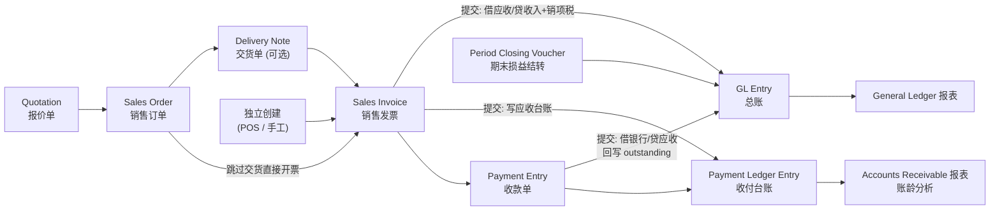
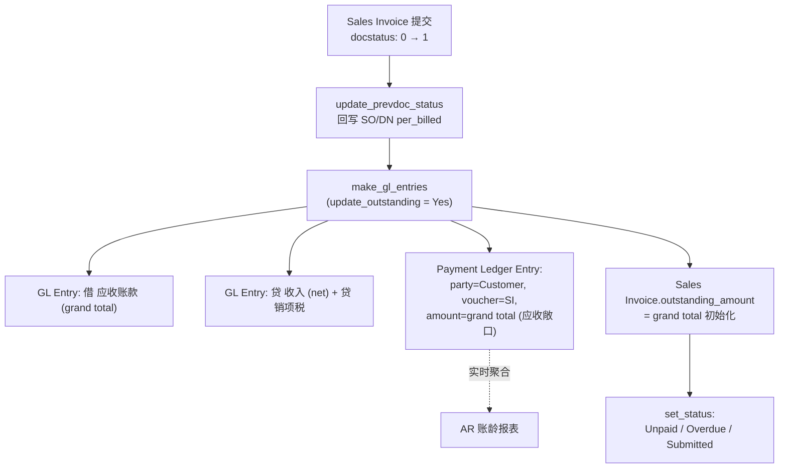
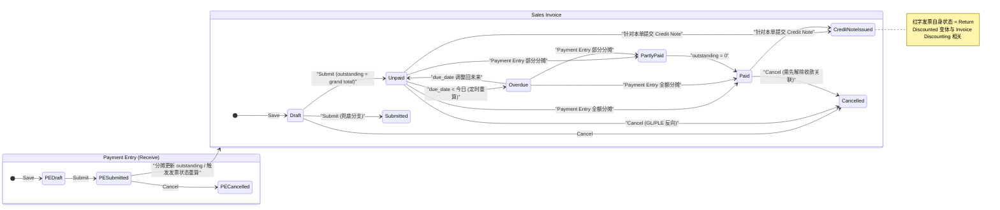
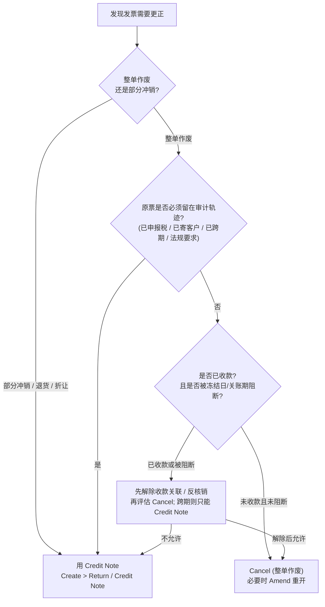

# 第 2 章 业务流程（主线 + 支线）

> 版本基准：ERPNext v16 / Frappe Framework v16（`version-16` 分支，2026-01 发布）。所有字段名、状态名均以 `version-16` 分支源码为准；操作入口按 v16 workspace 结构给出（第 1 章已用 workspace JSON 一手核定）。docs.frappe.io 官方手册多数页面仍停留在 v15 布局，其菜单路径（`Home > Accounting > …`）在 v16 已失效，本章仅将其用作流程概念依据，凡引用处显式标注；与旧版有差异处（如冻结日期位置、关账后台化）显式标注版本归属。

第 1 章解决了"页面在哪、长什么样"；本章解决"照着能不能跑完整个应收闭环"。组织方式是：先讲五项前置配置如何决定后续每个环节的默认值（2.1），再按四要素——【操作入口】【关键字段】【系统行为（分录/台账）】【单据状态】——逐步走完 Order-to-Cash 主线（2.2），然后给出 Sales Invoice 与 Payment Entry 的完整状态机（2.3），最后覆盖八条"非理想路径"支线（2.4）。本章只描述系统行为，GL Entry、Payment Ledger Entry、outstanding_amount 的字段级结构留到第 3 章展开；凡涉及账本不可变性、重记机制的深层原理，指向第 4 章。

## 2.1 前置配置

应收流程的每一步都依赖主数据提供默认值：发票的应收科目来自 Company 或 Customer，收款的资金科目来自 Mode of Payment 或 Company，到期日来自 Payment Terms，过账日期必须落在某个 Fiscal Year 内。把配置做在交易之前，是 ERPNext"默认值链"设计的第一课——交易单据上能自动带出的字段，绝不让用户手填。

### 2.1.1 五项配置的入口与流程影响

| # | 配置项 | 操作入口 | 对 AR 主线的流程影响 |
|---|---|---|---|
| 1 | Company（公司）+ Chart of Accounts（科目表） | `Invoicing workspace → Accounting Masters → Company`；同组 `Chart of Accounts`（v16 口径，见第 1 章 1.1.2；手册 v15 布局路径为 `Home > Accounting > …`，已失效） | 提供全套默认科目（应收、收入、银行/现金、Write Off、汇兑损益）；应收科目的 Account Type 必须为 `Receivable` 才能被交易单据选中 [^1^][^2^] |
| 2 | Fiscal Year（会计年度） | `Invoicing workspace → Accounting Masters → Fiscal Year` | 所有单据的 Posting Date 必须落在某个 Fiscal Year 内；当前年度结束前 3 天系统自动创建下一年度 [^3^] |
| 3 | Customer（客户主数据） | `Selling workspace → Customer` | 携带 Payment Terms Template（付款条件模板）、按公司的默认应收科目（Party Account 子表）、Credit Limit（信用额度）；决定开票默认值与超授信阻断行为 [^4^] |
| 4 | Mode of Payment（收付款方式） | `Invoicing workspace → Payments 组 → Mode of Payment` | 类型为 Cash / Bank / General，可按公司绑定默认科目，收款时自动带进 Payment Entry 的资金科目 [^5^] |
| 5 | Accounts Settings（账务设置） | `Invoicing workspace → Accounting Masters → Accounts Settings` | 全局开关：取消发票时是否解除收款关联、是否自动从订单继承付款条件、信用控制角色、半自动核销开关等 [^6^] |

**Company 与科目表**是配置的地基。每个 Company 独立维护一套树形科目表（Group / Ledger 两级语义），新建公司时可选 Standard Chart of Accounts 模板或从已有公司复制，系统同步创建默认 Cost Center [^1^]。创建科目时必须指定 Account Type——应收类科目选 `Receivable`，官方手册强调这一步的重要性："Selecting this is important as some fields allow selecting only specific type of accounts"，即交易单据的科目选择器按 Account Type 过滤 [^2^]。销项税科目建在 Current Liabilities 下（如 VAT / Sales Tax），再由 Sales Taxes and Charges Template 引用，发票的 Taxes 子表按模板自动带出 [^2^]。

Company 主数据上集中配置的默认科目，决定了主线每一步分录的落点：

| Company 默认字段 | 在主线中的作用环节 |
|---|---|
| Default Receivable Account（默认应收科目，如 Debtors） | Sales Invoice 的 Debit To 默认值；Payment Entry 的 Account Paid From 默认值 |
| Default Income Account（默认收入科目） | 发票 Items 子表 Income Account 的最终兜底来源 |
| Default Bank Account / Default Cash Account | Payment Entry 的 Account Paid To 取值优先级第 1 位 |
| Write Off Account（尾差核销科目） | 收款尾差 Make Difference Entry 的默认费用科目（见 2.4.6） |
| Round Off Account（舍入科目） | 发票舍入差额的分录落点 |
| Exchange Gain / Loss Account（汇兑损益科目） | 多币种收款 Set Exchange Gain/Loss 的 deduction 科目（见 2.4.7） |
| Default Payment Terms Template | 新交易默认套用的付款条件 |
| Credit Limit | 客户级信用额度的公司级兜底 |

以上字段清单来自官方手册 Company 页的逐项列举 [^1^]。一个值得记住的设计判断：客户应收默认全部过账到公司级 Debtors 科目，"A company-specific account is an exception, not a prerequisite"——不为每个客户建独立科目，靠 PLE 的 party 维度区分客户敞口 [^4^]。这对自研系统的启示直接：应收总账科目一个就够，客户维度是台账字段而非科目树分支。

**Fiscal Year** 的行为简单但不可缺：任何过账（posting date）必须落在已存在的会计年度内，可设默认年度、多公司共用；系统在当前年度结束前三天自动检查并创建下一年度 [^3^]。

**Customer** 主数据携带四类影响流程的字段 [^4^]：

| 字段 | 流程影响 |
|---|---|
| Payment Terms Template | 新订单/发票默认套用的付款条件，驱动 Payment Schedule 拆分与到期日（见 2.4.2） |
| Party Account 子表（按公司一行，指定应收科目） | 该客户的应收过账到指定科目，覆盖公司默认应收科目 |
| Credit Limit（按公司一行） | 提交类交易的累计敞口超限即阻断；持 Credit Controller 角色者可放行（角色在 Accounts Settings 配置） [^6^] |
| Billing Currency / Price List / Territory / Customer Group | 交易币种、价格表默认值与分组统计口径 |

**Mode of Payment** 记录收付款媒介（Cash / Bank / General），可按公司设默认科目；Payment Entry 中默认资金科目的取值优先级为一手原文确认的四级链条 [^5^]：

1. Company 表单的默认银行科目
2. Mode of Payment 的默认科目
3. Customer/Supplier 的默认银行账户
4. 在 Payment Entry 手工选择

**Accounts Settings** 中影响应收流程的开关包括 [^6^]：Unlink Payment on Cancellation of Invoice（取消发票时是否解除与收款的关联）、Automatically Fetch Payment Terms from Order（发票自动继承订单付款计划并按发票过账日重算到期日）、Credit Controller（允许超授信提交的角色）、Enable Auto Reconcile Payments（半自动核销总开关，见 2.2.4），以及 Enable Common Party Accounting、Allow multi-currency invoices against single party account、Enable Discount Accounting 等。

⚠️ **版本差异警示（v16 重要变更）**：账务冻结日期（Accounts Frozen Till Date）与放行角色在 v15 及官方手册旧页面中位于 Accounts Settings，但 v16 已将两者迁移到 **Company** 单据（逐公司配置）：`accounts_frozen_till_date` 与 `role_allowed_for_frozen_entries`，由 v16 升级 patch `migrate_account_freezing_settings_to_company.py` 完成数据迁移；运行时代码 `check_freezing_date` 读的是 Company 字段 [^7^][^8^]。官方文档页截图仍是旧位置，属文档滞后于代码 [^26^]。本章 2.2.6 按 v16 实际位置（Company）描述。

## 2.2 应收主线闭环 Order-to-Cash

官方手册给出的标准链路是一句话："The standard order-to-cash flow is Quotation → Sales Order → Delivery Note → Sales Invoice → Payment Entry" [^9^]。主线闭环的会计实质是：**Sales Invoice 提交即确认应收与收入（权责发生制），Payment Entry 提交即核销应收，outstanding 归零即闭环**。下图给出全流程及单据与账本的关系：



这张图的分层值得细看：上面一排是**单据层**（可保存、提交、取消的业务凭证），中间是**台账层**（GL Entry 与 Payment Ledger Entry，只增不改的会计事实），最下面是**报表投影**。Delivery Note 只影响库存台账、不产生应收，所以在会计视角它是虚线级的可选环节；真正驱动应收生命周期的只有 Sales Invoice 与 Payment Entry 两张单据。下文逐步展开。

### 2.2.1 SO→DN→SI 流转与跳步直接开票

【操作入口】Sales Order：`Selling` workspace；Delivery Note：从 Selling / Stock 域入口或全局搜索进入（手册 v15 布局路径为 `Home > Stock > Stock Transactions > Delivery Note`）；Sales Invoice：`Selling workspace → Sales Invoice`（v16 口径，见第 1 章 1.1.2；手册 v15 布局路径 `Home > Accounting > Accounts Receivable > Sales Invoice` 已失效）[^9^][^10^][^11^]。

【流转关系】标准链是 Quotation → Sales Order → Delivery Note → Sales Invoice → Payment Entry；但 Delivery Note 是可选步骤——"The Delivery Note is an optional step and a Sales Invoice can be created directly from a Sales Order" [^10^]。跳步方式有三种 [^11^]：

1. 从已提交的 Sales Order 直接用 Create 按钮生成 Sales Invoice（无需交货交易时）；
2. 完全独立创建发票（如 POS 场景："However, you can also create a Sales Invoice directly, for example, a POS invoice."）；
3. 在发票内用 **Get Items from** 按钮从 Sales Order / Delivery Note / Quotation 拉取明细行。

若跳过 Delivery Note 但货物实际发出，在发票上勾选 **Update Stock**，提交时直接更新 Stock Ledger，等效于把交货环节折叠进发票 [^11^]。

【强制约束与豁免】是否允许跳步由 Selling Settings 控制（默认不强制）[^12^]：Is Sales Order required to create Sales Invoice or Delivery Note? 与 Is Delivery Note required to create Sales Invoice? 两个开关可分别强制前置单据；即使全局强制，Customer 主数据层仍可对单个客户豁免（"A Customer can allow Sales Invoice creation without a Sales Order as an exception"）[^12^]。这是典型的"全局收紧 + 主数据例外"双层控制，自研系统做流程合规开关时可直接复刻。

【单据状态】Sales Order 的状态链为 Draft → To Deliver and Bill →（To Deliver / To Bill）→ Completed，另有 On Hold / Closed / Cancelled；列表页用 percentage delivered 与 percentage billed 两个进度列跟踪交付与开票进度 [^9^]。这两个百分比是"上游单据被下游单据消耗了多少"的投影——开票动作发生时（见 2.2.2 的 `update_prevdoc_status`）回写订单，而非订单自己记账。Delivery Note 提交只写库存台账（Stock Ledger Entry），不产生应收、不写 GL 应收科目：这是"物流确认"与"债权确认"的刻意分离——货发了不代表有权收钱（可能还没到开票里程碑），应收的唯一起点是发票提交。理解了这一点，就理解了为什么应收生命周期必须从 Sales Invoice 讲起。

【为什么允许跳步】从领域建模看，SO→DN→SI 是"一份合同事实的三次确认"：订单确认价格与数量合意，交货确认履约，发票确认收款权。ERPNext 允许跳过 DN（甚至跳过 SO）的本质，是承认不同行业的确认粒度不同：零售（POS）一手交钱一手交货，三次确认压缩成一张发票；项目制销售则可能拆出里程碑开票。约束是否收紧交给 Selling Settings（2.2.1 上文）而非写死在流程里——自研系统也应把"必须走几步"做成租户级配置，而非代码分支。

### 2.2.2 Sales Invoice 提交：分录与 outstanding 初始化

【操作入口】`Selling workspace → Sales Invoice` → New（或从 SO/DN 用 Create 生成）→ Save → Submit [^11^]。

【关键字段】

| 字段 | 位置 | 作用 |
|---|---|---|
| Debit To | More Info > Accounting Details | "The account against which receivable will be booked for this Customer"，默认取 Company 默认应收科目或 Customer Party Account [^11^] |
| Posting Date | 主表头 | "The date on which the Sales Invoice will affect your books of accounts i.e. your General Ledger"，必须落在某 Fiscal Year 内 [^11^] |
| Due Date / Payment Terms | 主表 | 到期日，Overdue 判定基准；可由模板拆分为 Payment Schedule 子表（见 2.4.2） |
| Items 子表 Income Account | 明细行 | 每行收入的贷方科目，默认来自 Item / Item Group / Company 三级兜底 [^11^] |
| Taxes 子表 | 税费区 | 引用销项税科目（Current Liabilities 下） [^11^] |
| Is Return (Credit Note) | 主表 | 红字发票开关，见 2.4.3 |

【系统行为：提交后生成分录】提交 Sales Invoice 后，系统按权责发生制生成标准 GL Entry（官方手册原文）[^11^]：

```
借 (Debit):  Customer 应收账款        grand total（含税总额）
贷 (Credit): Income 主营业务收入       net total（净额，逐行扣税）
贷 (Credit): Taxes  应交税费-销项税     （对政府的负债）
```

提交后在单据上点 **View Ledger** 即可查看该单的 GL；官方手册的 General Ledger 截图示例显示 `Debtors` 借 200、`Sales` 贷 200，Voucher Type = Sales Invoice [^11^]。

除 GL Entry 外，系统同步写入 **Payment Ledger Entry**（PLE，收付台账）——这是 v14 引入的独立台账 DocType（DocType 创建时间 2022-05-09；注意不是 v13），专门回答"哪个 party 的哪张单被哪笔收付核销了多少"，驱动 outstanding 计算与账龄报表 [^13^]。经 `version-16` DocType JSON 核实的核心字段包括：`posting_date, account_type, account, party_type, party, voucher_type, voucher_no, against_voucher_type, against_voucher_no, amount, account_currency, amount_in_account_currency, delinked, company, cost_center, due_date` [^13^]。字段级结构（含无借贷方向、带符号 amount 的设计）见第 3 章。

代码层面（`version-16` 分支 `sales_invoice.py`），`on_submit` 先 `update_prevdoc_status` 回写上游 SO/DN 的 per_billed 进度，再经 `make_gl_entries(..., update_outstanding="Yes", merge_entries=False)` 过账并同步更新发票 outstanding [^14^]：

```python
# make_gl_entries: update_outstanding = "No" if (POS/write-off/loyalty) else "Yes"
if self.docstatus == 1:
    make_gl_entries(gl_entries, update_outstanding=update_outstanding, merge_entries=False, ...)
```

【outstanding 初始化】提交时 outstanding_amount = grand total："For an unpaid invoice, outstanding amount = grand total. When creating Payment Entries, the value in the outstanding amount will reduce." [^15^] 该字段（currency 类型，按 party 科目币种计）在 DocType 上标注 `no_copy: 1`，即 Amend 复制时不带旧值 [^13^]。可以把 outstanding_amount 理解为发票头上的"未清余额冗余投影"——真实数据源是 PLE，字段值由过账与核销事件驱动回写（第 3 章展开其一致性机制）。

【单据状态】提交后 docstatus=1，status 由 `set_status` 依金额与到期日自动重算：未过到期日且未清 → Unpaid，已过到期日 → Overdue，付清 → Paid；Submitted 仅为不落入上述分支时的兜底态。完整状态集合与推导逻辑见 2.3。

提交后的分录流向可总结为下图：



图中每一步都发生在同一个提交事务内：先回写上游进度，再写总账与收付台账，最后初始化 outstanding 并重算单据状态。注意 GL 与 PLE 是**一次提交、两本台账**——GL 回答"科目余额"，PLE 回答"单据敞口"，二者服务不同报表，这正是报表分层（2.2.5）的数据基础。

### 2.2.3 Payment Entry 收款：拉取未清→分摊→分录→状态重算

【操作入口】两条路径 [^15^]：

1. **从发票发起**：打开已提交的 Sales Invoice → **Create > Payment**，Party、金额、关联发票自动带出——标准收款路径，提交即完成分摊；
2. **手工新建**：`Invoicing workspace → Payments 组 → Payment Entry` → New，不挂任何发票——先收款后核销（预收款场景见 2.4.1），事后用核销工作台（2.2.4）挂接。

【关键字段】

| 字段 | 说明 |
|---|---|
| Payment Type | `Receive / Pay / Internal Transfer`（`version-16` DocType JSON 核实）；收款选 `Receive` [^16^] |
| Party Type / Party | `Customer` + 具体客户 |
| Account Paid From | 收款方向下 = 客户应收科目（钱从这里"扣"） |
| Account Paid To | 收款方向下 = 银行/现金科目（钱进这里），默认值按 2.1.1 的四级优先级带出 [^5^] |
| Paid Amount | 实收金额 |
| Mode of Payment / Reference No / Reference Date | 收付款媒介与银行流水号（Cheque No & Date），供后续银行对账 |
| References 子表（Payment References） | Type（Sales Order / Sales Invoice / Journal Entry）、Name、Total Amount、Outstanding、**Allocated**（本单分摊到该票的金额） [^15^] |

【拉取未清与分摊】填完 Paid Amount 后点 **Get Outstanding Invoices**（或 Get Outstanding Orders），系统拉取该 party 的全部未清发票/未结订单："all the outstanding Invoices and open Orders respectively will be fetched for the party" [^15^]。分摊规则：

- 全额收款：系统自动把 Allocated 填满，多票可合并收款；
- 部分付款：手工把实际金额填入该行 Allocated；
- 收款大于已分摊总额时，差额进入 **Unallocated Amount**，挂在客户科目上成为未分配款，可供未来发票使用——未挂发票的收款即预收款（2.4.1）[^15^]。

【提交硬校验】**Difference Amount 必须为 0 才能提交**。代码层 `on_submit` 首行即 `if self.difference_amount: frappe.throw(_("Difference Amount must be zero"))` [^17^]；尾差用 **Make Difference Entry** 按钮显式计入 Write Off 科目（见 2.4.6）。这条校验的含义是：系统宁可阻断提交，也不允许产生解释不了的残差。

【系统行为：提交后】收款分录（官方手册原文）[^15^]：

```
借 (Debit):  Bank or Cash Account  银行/现金      paid amount
贷 (Credit): Customer (Debtor)      应收账款       paid amount
```

`version-16` 分支 `payment_entry.py` 的 `on_submit` 顺序 [^17^]：

```python
def on_submit(self):
    if self.difference_amount: frappe.throw(...)
    self.update_payment_requests()
    self.update_payment_schedule()      # 回写付款计划
    self.make_gl_entries()              # 生成 GL Entry（借银行/贷应收）+ Payment Ledger Entry
    self.update_outstanding_amounts()   # 回写被关联发票的 outstanding_amount
    self.set_status()
```

官方手册确认最终效果："On submission, outstanding will be updated in the Invoices." [^15^] 发票侧 outstanding_amount 按 Allocated 扣减，状态由 `set_status` 重算：全额分摊 → **Paid**，部分分摊 → **Partly Paid**，逾期未清 → **Overdue**（推导代码见 2.3）。若收款针对的是 Sales Order 而非发票（预收），订单上的 Advance Paid 字段被更新；之后对该订单开票时用 Get Advances Received 把预收分摊进发票 [^15^][^11^]。

【单据状态】Payment Entry 状态仅三态：`Draft / Submitted / Cancelled`（`version-16` DocType JSON + 代码双重核实），`set_status` 由 docstatus 直接推导 [^16^][^17^]。**核销进度不体现在收款单自身状态上**——它体现在被核销发票的 outstanding/状态与 PLE 的关联行上。这个设计把"钱收到了没有"与"钱挂到哪张票上"拆成两个正交的问题：前者是收款单状态，后者是核销关系。

### 2.2.4 Payment Reconciliation 核销工作台

【操作入口】Payment Reconciliation 不在 v16 任何标准 workspace 中，从 Sales Invoice / Payment Entry 表单按钮或全局搜索进入（见第 1 章 1.1.2 表 1-1；手册 v15 布局路径为 `Home > Accounting > Accounts Receivable > Payment Reconciliation`）[^18^]。

【什么场景需要它】官方手册给出的场景定义 [^18^]：

> "In complex scenarios, especially in the capital goods industry, sometimes there is no direct link between payments and invoices. For example... the customer sends you block payments or payments based on some schedule that is not linked to your invoices. In such cases, you can match Payments with Invoices using Payment Reconciliation."

即：**2.2.3 路径 2（手工收款未挂发票）或客户整块付款（block payment）场景**需要事后核销；从发票 Create > Payment 的标准路径在提交时已建立分摊，无需再走核销台。

【手动核销步骤（按钮级）】选 Company → Party Type / Party（应收科目自动带出）→ 选 Bank/Cash 科目 → 可按日期/金额过滤 → **Get Unreconciled Entries** 拉取未关联的发票与收款 → 勾选行（或全选）→ **Allocate** 生成分摊（支持 FIFO）→ **Reconcile** 提交核销 [^18^]。

【核销时的系统行为】核销对象不同，系统动作不同（一手原文）[^18^]：

| 核销对象 | 系统行为 | 原因 |
|---|---|---|
| Payment Entry | 不新建 Journal Entry | 收款单本身已通过 References 子表与交易关联，核销只是建立/调整分配关系 |
| Credit / Debit Note | 自动创建一张 Journal Entry | 红字票与发票之间没有天然的分配链路，需要一张调账凭证把贷项/借项对冲到目标发票 |

【半自动核销（Semi-Auto / Process Payment Reconciliation）】前置：Accounts Settings 开启 **Enable Auto Reconcile Payments**（2.1.1）。然后创建 **Process Payment Reconciliation** 单据（选 Company / Party / 应收科目）→ Submit 后进入 Queued → **每 15 分钟的后台作业**批量拾取 Queued 单据执行核销 → 生成 **Process Payment Reconciliation Log** 记录分配总数与成功/失败明细 [^19^]。另外系统提供 **Unreconcile Payment** 支持反向解除核销（见 2.4.8）。

设计观察：核销工作台与半自动核销解决的是同一个问题（收款与发票失联），手动台是"人找关系"，Process 版是"规则找关系"。两者在代码层互斥使用（同一 party/科目组合不应同时跑手动与自动核销，避免分配冲突）。自研对账模块可对照实现两档：运营手工核销界面 + 定时任务按 FIFO/规则自动核销并留日志；且无论哪一档，核销结果都应落成独立的分配记录（ERPNext 的 PLE 关联行），而非直接改发票或收款单上的字段。

还有一个容易忽略的分工：Payment Entry 的 References 子表是**创建时**的分摊声明，Payment Reconciliation 是**事后**的分摊修正，Unreconcile Payment（2.4.8）是分摊的**撤销**。三者操作的是同一组核销关系，分别对应其生命周期的建立、调整、解除——CRUD 里唯独没有"原地改"，调整 = 解除 + 重建。

### 2.2.5 报表闭环

收款与核销完成后，"客户还欠多少、欠了多久"由报表层回答。应收相关报表清单：

| 报表 / 工具 | 入口 | 回答的问题 | 数据源 |
|---|---|---|---|
| Accounts Receivable（账龄报表） | 不在 v16 任何标准 workspace 中：Customer 表单 → View → Accounts Receivable（自动带 party 过滤），或全局搜索（见第 1 章 1.1.2 / 1.3.1） | 各客户 outstanding 总额与账龄分布（默认 30/60/90/120 桶，按 Due Date 或 Posting Date） [^20^] | Payment Ledger Entry 实时聚合 [^22^] |
| Customer Ledger Summary | `Financial Reports workspace → Ledgers 组`（Script Report，ref_doctype = Sales Invoice） | 按客户汇总期初、开票、收款、期末余额 [^23^] | GL/PLE（Script Report 自定义 SQL） |
| General Ledger | `Financial Reports workspace → Ledgers 组` | 科目级借贷流水与期初/期末余额，可按 Account / Party / Cost Center / Period 过滤 [^20^] | GL Entry 表 |
| Process Statement Of Accounts | 不在 workspace 的工具型 DocType，全局搜索进入（见第 1 章 1.1.2 表 1-1） | 批量生成客户对账单（GL 报告 + 账龄 PDF）并邮件发送，可周期自动 [^21^] | 上两者的封装输出 |

【Accounts Receivable】官方定义："These reports help you to track the outstanding amount of Customers and Suppliers. It also provides ageing analysis i.e. a break-up of outstanding amount based on the period for which the amount is outstanding." [^20^] 账龄桶默认 30/60/90/120 天，可选基准日（Due Date 或 Posting Date）[^21^]。勾选 **Based On Payment Terms** 后按付款条件拆出每个 term 的 Invoiced / Paid / Outstanding，分摊按 FIFO [^20^]。数据源为 Payment Ledger Entry 实时聚合——这一点由 `version-16` 报表源码（`accounts_receivable.py` 的 PLE 查询与 ageing 计算）直接证实 [^22^]；⚠️ 官方手册没有对该架构的逐字说明页（AR 报表 slug 仅为概念概述页），论断锚定在源码上。另需说清一个边界：v16.28 的 DuckDB 财报提速**未覆盖** AR/AP 报表，单据级敞口报表仍走 PLE 实时聚合，仅取数层有调优——这正体现"科目级余额可快照、单据级敞口必须实时"的报表分层原则（详见第 4 章 4.4.2 节与第 5 章 5.5 节）。

【Customer Ledger Summary】`version-16` 分支存在 `erpnext/accounts/report/customer_ledger_summary`（Script Report，report_name = "Customer Ledger Summary"）[^23^]。⚠️ 新文档站无该报表的独立说明页（旧 slug 跳转后无正文），字段细节以报表代码为准。

【General Ledger】"The report is based on the table GL Entry and can be filtered by many pre-defined filters like Account, Cost Centers, Party, Project and Period etc."，按 Account / Voucher / Party 分组并给期初期末余额 [^20^]。单据级快捷方式：发票提交后直接点 **View Ledger** 查看该单分录 [^11^]。

【Process Statement Of Accounts】把 General Ledger 报告与 Accounts Receivable Summary 账龄打包成 PDF，按 Customer Group / Territory / Sales Partner / Sales Person 批量 Fetch Customers 后邮件群发，可 Enable Auto Email 周期自动发送 [^21^]。前置条件：Customer 联系人需勾选 Is Billing Contact 并填 Billing Email，且配置了外发 Email Account [^21^]。这就是面向客户的"对账单自动化"，自研系统的客户对账功能可直接对标此工具。

报表层的整体分工呼应了 2.2.2 的"一次提交、两本台账"：科目级问题（这个月收入多少、应收科目余额多少）问 GL Entry，单据级问题（哪张票还欠多少、欠了多久）问 Payment Ledger Entry，客户沟通问题（把账发给客户看）由 Process Statement Of Accounts 封装前两者。自研系统的报表设计也应先按"问题类型"选数据源，而不是所有报表都扫同一张大表。

### 2.2.6 期末：PCV 损益结转与账务冻结

【Period Closing Voucher（期间关账单，损益结转）】入口：`Invoicing workspace → Opening & Closing 组 → Period Closing Voucher`（手册 v15 布局路径为 `Home > Accounting > Opening and Closing > Period Closing Voucher`）。官方手册的定位："In ERPNext after making all the special entries via Journal Entry for the current fiscal year, you should set all your Income and Expense accounts to zero via a Period Closing Voucher." [^24^]

操作（按钮级）：New → 设 Posting Date（财年末日）→ 选 Closing Fiscal Year → 选结转科目（通常 Reserves and Surplus）→ Save & Submit [^24^]。提交后系统行为："The Period Closing Voucher will make accounting entries (GL Entry). This will make all your Income and Expense Accounts zero and transfer Profit/Loss balance to the Closing Account." [^24^] 两条注意：

- PCV 提交后若又在该财年补录分录，需**再建一张 PCV** 结转剩余损益余额 [^24^]；
- PCV 只结转损益类科目；应收账款等资产负债表科目余额自动滚入下年，无需手工 Opening Entry [^24^]。

⚠️ **v16 关账后台化**：v16 新增 **Process Period Closing Voucher** DocType（2025 年新建），把关账拆成后台分批作业，状态机为 Queued / Running / Paused / Completed / Cancelled，并携带 `bs_closing_balance` / `p_l_closing_balance` JSON 快照与明细子表；Accounts Settings 相应新增 `pcv_job_timeout`（每个后台作业的超时秒数）与 `use_legacy_controller_for_pcv`（回退旧同步控制器的开关）[^25^]。官方手册页面仍描述同步式 PCV 操作，后台化细节以 `version-16` 源码为准。对自研系统的含义：期末结算是天然的长事务，"提交即返回、台账分批追平"的最终一致设计（机制展开见第 4 章 4.3 节）比同步大事务更适合大数据量场景。

【账务冻结（三级时间闸门）】关账之后要防止历史期间被改动，ERPNext 提供三道闸门：

1. **账簿级冻结日期**（v16 在 **Company** 上）：`accounts_frozen_till_date` + `role_allowed_for_frozen_entries`；过账日 ≤ 冻结日的凭证，除指定角色外任何人（含 Administrator）不可新增/修改，运行时代码 `check_freezing_date` 强制校验："You are not authorized to add or update entries before {date}" [^7^][^8^][^26^]。（v15 及旧文档中该设置在 Accounts Settings，见 2.1.1 的版本警示。）
2. **科目级冻结**：`Account.freeze_account = Yes` 时该科目仅放行持冻结放行角色者 [^26^]。
3. **已关闭会计年度**：对已关账期间的补录/背日凭证，由 Repost Accounting Ledger 等异步机制"先反向后重记"追平台账，而非直接放行写入（机制见第 4 章）。

这三道闸门共同构成"业务时间锚点"：锚点之前的真相不可触碰，锚点之后的变更通过新分录与队列追平——财务系统用时间锚点换掉了全局锁，这是高并发 ERP 的关键取舍。

**主线四要素速查。** 把 2.2.1–2.2.6 压缩成一张对照表，作为实操时的检查清单：

| 步骤 | 操作入口 | 关键字段 | 系统行为（分录/台账） | 单据状态 |
|---|---|---|---|---|
| 开票 Sales Invoice | Selling workspace → Sales Invoice（或从 SO/DN Create） | Debit To / Posting Date / Due Date / Items.Income Account | 借应收 / 贷收入+销项税；写 GL+PLE；outstanding=grand total | Draft → Unpaid（或 Submitted） |
| 收款 Payment Entry | 发票 Create > Payment 或 Invoicing workspace 手工新建 | Payment Type=Receive / Paid From=应收 / Paid To=银行 / References.Allocated | 借银行 / 贷应收；写 GL+PLE；回写发票 outstanding | Draft → Submitted；发票转 Paid/Partly Paid |
| 事后核销 | Payment Reconciliation（表单按钮或全局搜索，不在 workspace） | Company/Party/应收科目 → Get Unreconciled Entries → Allocate → Reconcile | 对 PE 核销不新建凭证；对红/蓝字票核销自动建 Journal Entry | 发票状态重算 |
| 报表验证 | Accounts Receivable / General Ledger / Customer Ledger Summary | 账龄基准日 / Based On Payment Terms | PLE 实时聚合（AR）/ GL Entry 查询（GL） | — |
| 期末结转 | Invoicing workspace → Opening & Closing 组 → Period Closing Voucher | Posting Date=财年末 / Closing Fiscal Year / 结转科目 | 损益类科目清零，差额转 Closing Account（v16 后台分批作业） | Queued→Running→Completed（Process PCV） |
| 账务冻结 | Company 表单（v16） | accounts_frozen_till_date / role_allowed_for_frozen_entries | 冻结日前凭证禁止新增/修改（指定角色除外） | — |

## 2.3 状态机

应收单据的状态不是自由文本，而是由 `version-16` DocType JSON 的 `status` 字段 options 与代码中 `set_status` 推导逻辑共同约束的封闭集合。

### 2.3.1 Sales Invoice 全状态清单

`version-16` 分支 `sales_invoice.json` 的 status options 完整清单（共 13 项）[^27^]：

```
Draft / Submitted / Paid / Partly Paid / Unpaid / Overdue /
Return / Credit Note Issued / Unpaid and Discounted /
Partly Paid and Discounted / Overdue and Discounted / Cancelled /
Internal Transfer
```

官方手册的状态语义 [^11^]：

| 状态 | 语义（手册原文要点） | 触发条件 |
|---|---|---|
| Draft | 已保存未提交 | Save |
| Submitted | 已提交、总账已更新；`set_status` 的兜底分支（docstatus=1 且不落入 Unpaid / Overdue / Partly Paid / Paid 等任何分支时） | Submit |
| Unpaid | 有未清余额但未过到期日 | 提交后 outstanding>0 且 due_date ≥ 今日 |
| Overdue | 有未清余额且已过到期日 | due_date < 今日且 outstanding>0 |
| Partly Paid | 部分收款 | 0 < outstanding < 总额 |
| Paid | 客户已付清且 Payment Entry 已提交 | outstanding = 0 |
| Credit Note Issued | 本票被红字发票冲红（状态赋给**原发票**） | 存在针对本单的已提交 Credit Note |
| Return | 本票是红字发票（状态赋给**红字票自身**，is_return=1） | 提交 Credit Note |
| Unpaid/Partly Paid/Overdue and Discounted | 与 Invoice Discounting（应收贴现）联动的变体 | 贴现交易 |
| Internal Transfer | 内部转移场景专用（集团内公司间转移），主线不展开 | 内部转移交易 |
| Cancelled | 已取消，账务与库存影响被撤销 | Cancel |

状态推导代码（`version-16` `sales_invoice.py` `set_status`，节选）[^14^]：

```python
if self.docstatus == 2: status = "Cancelled"
elif self.docstatus == 1:
    if is_overdue(self, total): self.status = "Overdue"
    elif 0 < outstanding_amount < total: self.status = "Partly Paid"
    elif outstanding_amount > 0 and getdate(self.due_date) >= getdate(): self.status = "Unpaid"
    elif self.is_return == 0 and <存在针对本单的已提交 Credit Note>: self.status = "Credit Note Issued"
    # （节选）其后还有 Return / Paid 分支；以上条件均不匹配时 else 兜底 → "Submitted"
```

注意 `Return` 与 `Credit Note Issued` 是一对：红冲发生时，红字票自己拿 `Return`，被冲红的原票拿 `Credit Note Issued` [^11^]。Discounted 系列三个变体（Unpaid / Partly Paid / Overdue and Discounted）对应 Invoice Discounting（应收账款贴现融资）场景，状态语义 = 基础状态 + "该票已质押贴现"标记，不影响主线收款逻辑 [^11^]。

从实现角度看，这份状态清单有三类来源完全不同的成员：docstatus 镜像（Draft / Submitted / Cancelled）、金额推导（Unpaid / Partly Paid / Paid）、时间与跨单据关系推导（Overdue / Return / Credit Note Issued / Discounted 变体）。自研系统定义状态枚举时，建议按这个三分法归类并分别实现推导函数，而不是写一个巨型 if-else。

### 2.3.2 状态迁移图



解读这张图的三条要点：第一，**Unpaid ↔ Overdue 不是用户操作**，而是由到期日驱动的重算——手册与 `set_status` 代码确认 `is_overdue` 判定逻辑，⚠️ 但每日定时重算的具体调度代码（hooks/scheduler）未逐行核实，Confidence: medium。第二，**所有迁移的驱动力只有两个**：提交/取消（docstatus 变更）与收款分摊（outstanding 变更）；发票状态本质上是 `docstatus + outstanding + due_date` 三个变量的纯函数，不存独立的"状态字段被谁改过"的历史。第三，Payment Entry 自己的状态机极简（Draft → Submitted → Cancelled），它对发票的影响是跨单据的副作用——收款单提交后回写发票 outstanding 并触发发票 `set_status` 重算。

### 2.3.3 Payment Entry 状态

Payment Entry 仅三态：`Draft → Submitted → Cancelled`，`set_status` 由 docstatus 直接推导（0→Draft，1→Submitted，2→Cancelled）[^16^][^17^]。如 2.2.3 所述，核销进度不在收款单状态上体现，而体现在发票的 outstanding/状态与 PLE 关联行上。对自研系统的建模启示：**单据状态机只承载单据自身的生命周期，跨单据的业务进度用台账聚合推导，不要复制状态**——否则两份状态必然出现不一致窗口。

## 2.4 支线流程

主线假设"开对票、收对钱、一次清"。现实业务里的八条支线覆盖一切偏离理想路径的场景。贯穿所有支线的设计哲学只有一句话：**账务系统没有 UPDATE，一切变更都是新事实**——核销关系的解除不是删除分配行而是置 `delinked`，取消不是擦除分录而是追加借贷互换的反向分录，修改不是原地编辑而是 Cancel 后 Amend 出新版本单据。不可变性不是洁癖，而是审计、幂等、并发安全三者的共同解：审计要求每个状态都能由事实序列重放出来；幂等要求同一操作重试不产生二次影响（追加反向行天然幂等，原地 UPDATE 则不然）；并发安全要求写操作不依赖读到旧值（只增模型没有写-写冲突）。状态机的每次迁移都对应台账上的新增事实而非改写，这是主线（2.2）与全部支线共享的底层范式。每条支线按四要素展开：业务场景 / 操作路径 / 系统行为 / 设计意图。

| # | 支线 | 核心单据/机制 | 节 |
|---|---|---|---|
| 1 | 预收款 | Payment Entry（unallocated）+ Sales Invoice Advances 子表 | 2.4.1 |
| 2 | 付款条件/分期 | Payment Term / Payment Terms Template → Payment Schedule 子表 | 2.4.2 |
| 3 | 红字发票 | Sales Invoice `is_return` + `return_against`（Credit Note） | 2.4.3 |
| 4 | 取消与修改 | docstatus 状态机 + 反向 GL + Amend 命名后缀 | 2.4.4 |
| 5 | 催款 | Dunning / Dunning Type | 2.4.5 |
| 6 | 尾差/坏账 | Payment Entry Write Off / Deductions or Loss | 2.4.6 |
| 7 | 多币种应收 | Party Currency + Exchange Gain/Loss + Exchange Rate Revaluation | 2.4.7 |
| 8 | 反核销 | Unreconcile Payment（PLE delink） | 2.4.8 |

### 2.4.1 预收款三条核销路径

【业务场景】客户先打款后开票（高价值订单常见，如定制家具先收 40% 定金）。此时没有发票可挂，收款必须"挂账"到客户头上，后续开票再核销。

【操作路径】预收的产生与主线一致——Payment Entry（Payment Type = `Receive`）不填任何发票引用，Save & Submit；关键判定规则是"**任何未关联发票的收款即视为预收**"："If payment is not linked to an invoice, it is considered as an advance payment. The advance payments are reflected in the Accounts Receivable and Payable reports." [^28^] 核销有三条路径：

| 路径 | 操作 | 适用场景 |
|---|---|---|
| A. 开票时手动挂接 | Sales Invoice 的 Advance Payments 区块点 **Get Advances Received** 拉取该客户预收款，填 Allocated Amount [^28^] | 标准流程：开票时已知有预收 |
| B. 自动 FIFO | 勾选 **Allocate Advances Automatically (FIFO)**，提交时按先进先出自动核销 [^28^] | 半自动：预收笔数多、顺序无争议 |
| C. 事后核销台 | 开票后才发现预收未核销，用 Payment Reconciliation（2.2.4）匹配 unlinked payment 与 invoice [^18^] | 事后补救 |

【系统行为】预收时 GL 仍是标准收款分录（借银行/现金、贷客户应收），即**应收科目出现贷方余额（负数应收）**——"it will be recorded as a credit entry against the Customer's Receivable account" [^28^]：

```
预收时:    借: 银行/现金        贷: 客户应收 (Debtors)   ← 应收科目贷方余额 = 预收
核销时:    不再动银行科目；Sales Invoice Advances 子表建立分配关系，
           PLE 写 against_voucher 关联行，发票 outstanding 即时扣减
```

官方确认核销效果："The allocation will reduce the Outstanding Amount for that invoice right-away." [^28^] 若预收是针对 Sales Order 的，订单 Advance Paid 字段同步更新 [^15^]。⚠️ 补充配置：ERPNext 另有 **Book Advance Payments in Separate Account**（把预收记入负债类"预收账款"科目，经独立台账跟踪）的可选开关；v16 官方手册该选项细节未逐字核实，证据来自 v15 测试代码与 release notes [^29^]，默认关闭。

【设计意图】用"应收科目贷方余额"表达预收，避免引入独立的预收单证类型——**预收 = 未分配的 Payment Entry，核销 = 建立分配关系而非新分录**，对账模型极简。三条核销路径对应"标准 / 半自动 / 补救"三层，与 2.2.4 的手动台 + Process 版是同一设计语汇。自研系统常见的错误是专为预收建一张"预收单"及其状态机，结果预收与收款两套模型永远需要对齐；ERPNext 的答案是让预收复用收款单、只靠"是否挂票"这一个布尔区分，模型成本几乎为零。

### 2.4.2 Payment Terms 分期与 Payment Schedule

【业务场景】赊销 30 天账期；合同款分两期（发货 50% + 到货 50%）；早付款折扣（10 天内付清减 10%）。

【操作路径】主数据：`Invoicing workspace → Accounting Masters → Payment Term` 定义单个条件（Invoice Portion %、Due Date Based On、Credit Days、可选 Discount Settings），组合进 **Payment Terms Template**；交易侧在 Sales Order / Sales Invoice 选模板，系统自动生成 **Payment Schedule 子表**（每期 Due Date + Invoice Portion + Payment Amount）[^30^]。Accounts Settings 的 Automatically Fetch Payment Terms from Order 开启后，发票自动继承订单付款计划并按发票过账日重算到期日与金额 [^6^]。

【系统行为】Due Date 三种算法 [^30^]：`Day(s) after invoice date`（开票日 + N 天）、`Day(s) after the end of the invoice month`（月末 + N 天）、`Month(s) after the end of the invoice month`（月末 + N 月）。分期示例：$35,000 发票按 50-50 模板生成两行 Payment Schedule（04-18 / 05-18 各 $17,500）[^30^]。两条关键机制结论：

- **Payment Schedule 不产生额外 GL**——发票提交仍是一笔全额应收；Payment Schedule 是"应收的到期结构"元数据。它对报表的影响：Accounts Receivable 报表勾选 Based On Payment Terms 后，账龄按各期 Due Date 分桶并可按模板过滤 [^20^]。
- 逾期判定与状态机联动：`Unpaid`（未过 due date）→ `Overdue`（"Payment is pending beyond the payment due date"）[^11^]；Overdue 是 Dunning 的前提（2.4.5）。⚠️ 主表 due_date 与 Payment Schedule 各期的联动优先级（是否总取最早一期）手册未逐字说明，需实现时以代码为准。

早付折扣：Payment Term 可配 Discount（Percentage/Amount + Discount Validity），但**折扣只在"从单张发票直接创建的 Payment Entry"上自动生效**——"Independently made Payment Entries ... will not have any early payment discount applied." [^30^]

【设计意图】把"到期结构"与"会计确认"解耦——GL 只记一次应收，到期/账龄/催收全部挂在 Payment Schedule 子表上衍生。这是典型 ERP 的"单行确认、多维展开"：发票主表记确认事实，payment_schedule 子表记到期计划，账龄报表读子表而非重扫 GL。自研系统可直接照搬这一表结构分层。

### 2.4.3 红字发票 vs Cancel 决策规则

【业务场景】客户退货、价格/税率开错需要折让、部分退货。中国财务语境的"红字发票"在 ERPNext 中 = 一张 `is_return=1` 的 Sales Invoice（Credit Note，贷记凭证）。

【操作路径】打开原已提交 Sales Invoice → **Create > Return / Credit Note** → 系统自动勾选 **Is Return (Credit Note)**、填 **Return Against**（原发票号）、明细行数量自动为负 → 部分退货时删行并把负数量改成实际退货量 → 仅在货物实际回库时勾 **Update Stock** → Submit [^31^]。v15 起 Credit Note 也可**独立创建**（不关联原票）——v15 重构说明 "cr/dr note should be standalone even when created from another invoice" [^29^]（版本归属：v15+）。

【系统行为】数量与金额均为负（"The Item quantity and Payment amount will be negative since it's a return." [^32^]）；GL 全量反向——"The submitted Credit Note reverses the applicable receivable, income, and tax amounts. When Update Stock is enabled, it also receives the returned Items and creates the corresponding stock movement." [^31^]：

```
正常发票:  借: 应收 (含税总额)   贷: 收入 (净额) + 销项税
红字发票:  借: 收入 (净额) + 销项税   贷: 应收 (含税总额)   ← 全量反向
```

状态联动：原发票 → **Credit Note Issued**，红字票自身 → **Return**（2.3.1）。红冲后客户贷项（负应收）的三种去向：分摊到其他未清发票、留抵未来销售、或通过外向 Payment Entry 退款 [^31^]；用 Journal Entry 手工对冲时须填 Reference Type = Sales Invoice 才能联动 outstanding [^32^]。

【与 Cancel 的本质区别】这是面试级重点。官方手册直接给出决策规则 [^31^]：

> "Cancel the original Sales Invoice only when the entire transaction should be reversed, ERPNext permits cancellation, and your statutory and audit rules allow it. Use a Credit Note when the original invoice must remain in the audit trail or only part of the sale is being returned."
> "If local law requires a Credit Note, do not cancel the original invoice merely because it is unpaid."

| 维度 | Cancel（取消） | Credit Note（红字发票） |
|---|---|---|
| 语义 | 整张作废，视同该交易不应存在 | 部分或全部冲销，原交易承认存在但被更正 |
| 原票去留 | docstatus=2，原票退出有效集（Cancelled） | 原票保持 Submitted 并转 Credit Note Issued，**留在审计轨迹中** [^31^] |
| 产生的新凭证 | 不产生新业务凭证，只有借贷互换的反向 GL/PLE 行 | 一张独立的、可打印、可寄给客户的法定凭证 |
| 部分冲销 | 不支持（整单取消） | 支持（删行/改负数量即部分退货） |
| 跨期冲销 | 受冻结日/已关账期阻断（2.2.6） | 红字票以自身 Posting Date 入账，天然支持跨期 |
| 税务/审计合规 | 仅在法规与审计允许作废时可用 | 法规要求留痕（已申报税、已交付客户、已跨期）时必须用 |
| 前置条件 | 未收款或先解除收款关联 | 无前置，原票已收款也可红冲 |
| 典型场景 | 开票即发现整单开错（客户/金额全错）、未跨期 | 退货、折让、部分冲销、已跨期更正 |

决策树如下：



【设计意图】红冲模型把"更正"显式化为一等业务对象——负数行项目 + `return_against` 关联，既保留审计链（原票不动），又支持部分冲销与跨期冲销。自研系统若用"作废重开"替代红冲，会直接丢失这三项能力；尤其在中国税务语境下，"红字发票"本身是法定凭证形态，Cancel 路线基本不可选。

### 2.4.4 Cancel & Amend

【业务场景】发票开错客户/金额，尚未收款、未跨期、法规允许作废 → Cancel 后 Amend 重开。

【操作路径】已提交单据（docstatus=1）→ **Cancel**（docstatus=2）→ 出现 **Amend** 按钮 → 生成 docstatus=0 的草稿副本 → 修改后重新 Submit。权限模型把 Submit / Cancel / Amend 拆成三个独立权限点（DocType Permissions 表），可分别授给不同角色 [^33^]。少数标注 `allow_on_submit` 的字段（如 Letter Head、Print Heading）可在提交后直接修改，属例外。

【系统行为：取消时的总账处理】`version-16` 源码 `general_ledger.py::make_reverse_gl_entries`（check_freezing_date 也在此文件）[^34^]：

- **不可变账本开启（v13 起引入，由 Accounts Settings 的 `enable_immutable_ledger` 开关控制）**：原 GL Entry 保留不动（不置 is_cancelled），按"交换借贷"生成新反向分录，`posting_date` 取取消当日，remarks 记 `"On cancellation of <voucher_no>"`；同步 `create_payment_ledger_entry(..., cancel=1)` 生成 PLE 反向行。源码注释原文："Get original gl entries of the voucher and make reverse gl entries by swapping debit and credit" [^34^]。
- **不可变账本关闭**：原分录置 `is_cancelled=1`，反向分录同样置 is_cancelled=1（历史兼容模式）。

不可变账本的引入说明（v13 起）："From version-13 onwards we have introduced immutable ledger which changes the rules for cancellation of stock entries and posting backdated stock transactions in ERPNext." [^34^]

```
原分录 (保留不动):        借: 应收 1000   贷: 收入 1000
取消反向分录 (新增):      借: 收入 1000   贷: 应收 1000   ← posting_date=取消当日
```

【系统行为：Amend 命名】新单名 = 原单名 + `-N` 版本号（`ACC-SINV-2026-00009` → `ACC-SINV-2026-00009-1`，再改一次得 `-2`），由 `frappe/model/naming.py::_set_amended_name` 实现 [^35^]；v16 新增 **Amended Document Naming Settings**（`Document Naming Settings.default_amend_naming`），选 "Default Naming" 时改用普通命名序列（如 `ACC-SINV-2026-00010`），否则用后缀模式 [^35^]。Amend 副本通过 `amended_from` 字段指回被修订单，框架校验 `amended_from` 必须指向 docstatus=2 的单据 [^35^]。

【设计意图】docstatus 三态机（0=Draft / 1=Submitted / 2=Cancelled）+ 反向分录 + 版本号命名，构成 ERP 通用的"不可变单据 + 显式冲销链"。为什么不允许直接改已提交单据？因为提交即产生 GL/PLE/库存台账等下游事实，原地修改会让账本与单据脱节、破坏审计轨迹。`-N` 后缀把修订历史编码进单号——审计人员凭单号即知该票被改过一次。这套设计是自研财务系统最值得整条搬走的部分：单据表加 docstatus，台账表只增不改，更正走反向行。

### 2.4.5 Dunning 催款

【业务场景】客户发票过了 due date 未付，需要分级催收（第一次提醒免费、第二次收催款费+利息），并保留催款函书面记录。

【操作路径】主数据：**Dunning Type** 预设 Dunning Fee、Rate of Interest (% Yearly)、多语言催款函 Body/Closing Text（如 "First Notice" 无费，"Second Notice" 带费带息）。催款单两种生成方式 [^36^]：

1. Dunning 列表新建 → 选 Customer → **Fetch Overdue Payments** 拉逾期发票；
2. 打开逾期的 Sales Invoice → **Create > Dunning**——"This will fetch all overdue payments from the invoice's payment schedule table into a new Dunning." [^36^]

收款：打开未解决的 Dunning → **Create > Payment**。

【系统行为】前提约束："A Dunning can only be created against an overdue Sales Invoice." [^36^]（逾期由 Payment Schedule 的 Due Date 驱动，见 2.4.2）。明细为 Overdue Payments 子表：每行记录 Sales Invoice、Dunning Level（催款级次）、Overdue Days、Outstanding、Interest；合计 Total Interest + Dunning Fee = Dunning Amount [^36^]。状态机：**Draft → Unresolved → Resolved / Cancelled** [^36^]。收款落账方式：从 Dunning 创建 Payment Entry 时，利息与费用记入 Payment Entry 的 **Deductions or Loss** 子表（可预设收入科目与 Cost Center）——"This will create a Payment Entry against the outstanding scheduled payments and record the interest and fees as 'Payment Deductions or Loss'. The Payment Entry will automatically set the Dunning's status to resolved." [^36^] ⚠️ 利息的精确计算公式（年利率 × 逾期天数 / 365 还是 360）手册未给原文，需精确实现时查 `dunning.py`。

【设计意图】Dunning 是"催收函件 + 利息/费用计算"的业务凭证，但**本身不产生 GL**——收入确认推迟到实际收款时通过 Payment Entry deductions 落账。这是典型的收付实现制处理：避免对可能收不回的利息提前确认收入。自研催收模块应同样把"催款函生成"与"利息收入确认"拆成两个事件。

### 2.4.6 Write-off 尾差/坏账

【业务场景】发票 1,000.50，客户只付 1,000，0.50 尾差不值得追；或汇率/四舍五入造成的微小差额。长期累积会污染应收账龄。

【操作路径】两条路径：

- **路径 A（收款时）**：Payment Entry 实际 Paid Amount 小于分配金额 → 出现 Difference Amount → 点 **Make Difference Entry** 按钮，差额记入 Write Off 科目 → Difference Amount 归零才能提交 [^15^]；
- **路径 B（发票上）**：Sales Invoice 直接填 Write Off Amount / Write Off Account（"Write off happens when the Customer pays an amount less than the invoice amount. This may be a small difference like 0.50." [^11^]）。

默认科目来自 Company 主数据的 Write Off Account（2.1.1）[^1^]。更大额度的差异走 **Deductions or Loss** 子表（银行手续费、卡组织通道费等，每行独立科目 + Cost Center）[^15^]。

【系统行为】Write Off 本质是收款分录的第三腿，使发票 outstanding 清零：

```
借: 银行 (实收 1,000)
借: Write Off 费用科目 (尾差 0.50)
   贷: 客户应收 (全额 1,000.50)
```

官方定义："Write off happens when the paid amount is less than the allocated amount. I.e. the remaining amount is considered as lost in miscellaneous charges or that amount isn't going to be paid. This is considered as loss." [^15^] 配合 2.2.3 的提交硬校验（Difference Amount 必须为 0）[^17^]，差额必须显式处理，不允许静默挂账。

【设计意图】强制"差额显式化"——系统宁可阻断提交也不产生解释不了的 unallocated 残差；Write Off 走费用科目而非直接减应收，保证应收科目始终能按发票全额对账。⚠️ 自研实现注意：未分配金额的正确口径应为 `Unallocated = Paid - Allocated - Deductions`；历史上曾出现过该公式方向性错误导致 Unallocated 误算的 bug，实现时需以当前版本 `payment_entry.py` 的实际公式为准逐行核对。

### 2.4.7 多币种应收与汇兑损益（适度）

【业务场景】海外客户以其本币（如 EUR）开票收款，公司本位币为 USD/CNY。

【关键机制】三层金额口径：

1. **科目层**：Chart of Accounts 可为应收科目指定 Currency（如 "Debtors EUR"）；Customer 设 Billing Currency 与默认应收科目。若 party 科目币种与公司币不同，交易币种必须与 party 科目币种一致，且 "accounting entries (GL Entries) will always be in Party Account Currency" [^37^]。
2. **发票层**：开票时记录 conversion rate；"Outstanding Amount and Advance Amount will always be calculated and shown in Customer's Account Currency." [^37^]
3. **收款与期末**：分两条通道确认汇兑损益——

| 通道 | 时点 | 机制 | 损益性质 |
|---|---|---|---|
| 收款时 | Payment Entry | 抓取当前汇率（可手改），点 **Set Exchange Gain/Loss** 自动生成一行 deduction（`is_exchange_gain_loss=1`，科目取 Company 的 exchange_gain_loss_account），核销开票汇率与收款汇率之差 [^15^][^17^] | 已实现损益（即时确认） |
| 期末重估 | Exchange Rate Revaluation 工具 | 抓取外币科目余额按新汇率算 Gain/Loss，提交后 Create > Journal Entry 生成 Entry Type = "Exchange Rate Revaluation" 的日记账，差额挂 Company 的 Unrealized Exchange Gain/Loss Account；可配 Auto Create Exchange Rate Revaluation（Frequency=Daily）[^38^] | 未实现损益（递延确认） |

v14 起 Exchange Rate Revaluation 支持单边余额为 0 的外币科目（版本归属：v14+）[^38^]。

【设计意图】已实现/未实现损益分两条通道——收款时内嵌在收款凭证里即时确认，期末用重估工具统一递延确认；科目币种 + party 币种 + 本位币三层金额字段保证任意口径可对账。自研多币种模块的最小可用形态：单据存交易币种金额 + 汇率 + 本币金额三个字段，收款时算已实现损益，期末跑重估批处理。

### 2.4.8 Unreconcile 反核销

【业务场景】财务把收款核错了发票（客户两张票、钱挂错了），需要解除核销关系再重新分配——但不能取消原始收款单（可能已银行对账、已跨期）。

【操作路径】发票或付款单上 **Unreconcile** 按钮（v15 起移入下拉菜单 [^29^]）→ 系统创建 **Unreconcile Payment** 单据 → `add_references()` 拉取该凭证的全部核销明细 → 可删除部分行（只反核销指定发票）→ Submit [^39^]。⚠️ v16 官方用户手册**没有 Unreconcile Payment 专页**（docs 对应 slug 返回 404，已验证）；以上操作路径依据 `version-16` 源码与 v15 release notes 推断，用户侧细节 Confidence: medium。

【系统行为】（`version-16` 源码 `unreconcile_payment.py`）[^39^]：

- 仅支持 `Payment Entry` 与 `Journal Entry` 两类凭证（supported_types 白名单）；
- 提交时逐条：从 Payment Entry 的 references 子表移除该行 → 取消核销时产生的汇兑损益 Journal（`cancel_exchange_gain_loss_journal`）→ `update_voucher_outstanding` 回写发票 outstanding → 该核销行标记 `unlinked=True`；
- **底层不删 GL/PLE**：PLE 行置 `delinked=1` 软删除，核销历史保留；
- 粒度：支持只反核销一张发票而保留其余（测试用例佐证：260 元收款拆 150/110 两笔核销，反核销 110 后 references 剩 1 行、unallocated_amount 变回 110）[^39^]。

【设计意图】把"反核销"也做成一张可提交单据（而不是付款单上的一个动作），使核销关系的解除同样有审计轨迹；PLE 用 `delinked` 软删除而非物理删除，与不可变账本哲学一致。对自研系统的直接启示：**核销关系表（allocation）应设计软删除/反向记录字段，而非物理 DELETE 分配行**——否则错账补救只能靠反写 SQL，审计无从谈起。

## 本章要点回顾

1. **主线闭环三步**：Sales Invoice 提交即确认应收与收入（借应收 / 贷收入+销项税，outstanding 初始化为含税总额）→ Payment Entry 提交核销（借银行 / 贷应收，回写发票 outstanding 并重算状态）→ 报表层基于 PLE 实时聚合回答账龄。Delivery Note 是可选环节，只影响库存。
2. **一次提交、两本台账**：GL Entry 回答"科目余额"，Payment Ledger Entry（v14 引入）回答"单据敞口"；outstanding_amount 是 PLE 聚合的事件驱动冗余投影。字段级结构见第 3 章。
3. **发票状态是纯函数**：Sales Invoice 的 13 个状态由 `docstatus + outstanding_amount + due_date` 推导，不存独立状态历史；Payment Entry 只有 Draft / Submitted / Cancelled 三态，核销进度体现在发票与 PLE 上而非收款单自身。
4. **红字 vs Cancel 决策规则**：整单作废 + 法规/审计允许 + 未跨期 → Cancel；部分冲销、原票须留痕、已跨期 → Credit Note（`is_return` + 负数行 + `return_against`，GL 全量反向，原票转 Credit Note Issued）。
5. **账务系统没有 UPDATE**：取消追加借贷互换的反向分录（不可变账本下原分录保留），Amend 生成 `原名-N` 新版本，反核销置 PLE `delinked=1` 软删除——一切变更都是新事实。
6. **三级时间闸门**：v16 冻结日期在 **Company**（`accounts_frozen_till_date`，旧版在 Accounts Settings，文档滞后）+ 科目级冻结 + PCV 关账；v16 关账已后台化（Process Period Closing Voucher 状态机 + 分批作业）。
7. **差额显式化**：Payment Entry 的 Difference Amount 必须为 0 才能提交，尾差走 Write Off 费用科目、汇兑损益走 Set Exchange Gain/Loss deduction 行——系统宁可阻断提交也不允许静默残差。
8. **预收 = 未分配收款**：任何未挂发票的 Payment Entry 即预收款（应收科目贷方余额），核销有开票挂接 / FIFO 自动 / 核销台补救三条路径，核销是建立分配关系而非新分录。

## 本章来源

[^1^]: Company — ERPNext Manual — https://docs.frappe.io/erpnext/user/manual/en/company（v16 docs，访问 2026-07-28）
[^2^]: Chart of Accounts — ERPNext Manual — https://docs.frappe.io/erpnext/user/manual/en/chart-of-accounts（v16 docs，访问 2026-07-28）
[^3^]: Fiscal Year — ERPNext Manual — https://docs.frappe.io/erpnext/user/manual/en/fiscal-year（v16 docs，访问 2026-07-28）
[^4^]: Customer — ERPNext Manual — https://docs.frappe.io/erpnext/user/manual/en/customer（v16 docs，访问 2026-07-28）
[^5^]: Mode of Payment — ERPNext Manual — https://docs.frappe.io/erpnext/user/manual/en/mode-of-payment（v16 docs，访问 2026-07-28）
[^6^]: Accounts Settings — ERPNext Manual — https://docs.frappe.io/erpnext/user/manual/en/accounts-settings（v16 docs，访问 2026-07-28）
[^7^]: Company DocType JSON（`accounts_frozen_till_date` / `role_allowed_for_frozen_entries`）— https://raw.githubusercontent.com/frappe/erpnext/version-16/erpnext/setup/doctype/company/company.json（version-16 分支，访问 2026-07-28）
[^8^]: patch migrate_account_freezing_settings_to_company.py — https://github.com/frappe/erpnext/blob/version-16/erpnext/patches/v16_0/migrate_account_freezing_settings_to_company.py（version-16 分支，访问 2026-07-28）
[^9^]: Sales Order — ERPNext Manual — https://docs.frappe.io/erpnext/user/manual/en/sales-order（v16 docs，访问 2026-07-28）
[^10^]: Delivery Note — ERPNext Manual — https://docs.frappe.io/erpnext/user/manual/en/delivery-note（v16 docs，访问 2026-07-28）
[^11^]: Sales Invoice — ERPNext Manual — https://docs.frappe.io/erpnext/user/manual/en/sales-invoice（v16 docs，访问 2026-07-28）
[^12^]: Selling Settings — ERPNext Manual — https://docs.frappe.io/erpnext/user/manual/en/selling-settings（v16 docs，访问 2026-07-28）
[^13^]: payment_ledger_entry.json — https://github.com/frappe/erpnext/blob/version-16/erpnext/accounts/doctype/payment_ledger_entry/payment_ledger_entry.json（version-16 分支，访问 2026-07-28）
[^14^]: sales_invoice.py（on_submit / set_status）— https://github.com/frappe/erpnext/blob/version-16/erpnext/accounts/doctype/sales_invoice/sales_invoice.py（version-16 分支，访问 2026-07-28）
[^15^]: Payment Entry — ERPNext Manual — https://docs.frappe.io/erpnext/user/manual/en/payment-entry（v16 docs，访问 2026-07-28）
[^16^]: payment_entry.json — https://github.com/frappe/erpnext/blob/version-16/erpnext/accounts/doctype/payment_entry/payment_entry.json（version-16 分支，访问 2026-07-28）
[^17^]: payment_entry.py（on_submit / set_exchange_gain_loss）— https://github.com/frappe/erpnext/blob/version-16/erpnext/accounts/doctype/payment_entry/payment_entry.py（version-16 分支，访问 2026-07-28）
[^18^]: Payment Reconciliation — ERPNext Manual — https://docs.frappe.io/erpnext/user/manual/en/payment-reconciliation（v16 docs，访问 2026-07-28）
[^19^]: Semi-Auto Payment Reconciliation — ERPNext Manual — https://docs.frappe.io/erpnext/user/manual/en/semi-auto-payment-reconciliation（v16 docs，访问 2026-07-28）
[^20^]: Accounting Reports — ERPNext Manual — https://docs.frappe.io/erpnext/user/manual/en/accounting-reports（v16 docs，访问 2026-07-28）
[^21^]: Process Statement Of Accounts — ERPNext Manual — https://docs.frappe.io/erpnext/user/manual/en/process-statement-of-accounts（v16 docs，访问 2026-07-28）
[^22^]: accounts_receivable.py（PLE 查询与 ageing 计算）— https://github.com/frappe/erpnext/blob/version-16/erpnext/accounts/report/accounts_receivable/accounts_receivable.py（version-16 分支，访问 2026-07-28）
[^23^]: customer_ledger_summary report — https://github.com/frappe/erpnext/tree/version-16/erpnext/accounts/report/customer_ledger_summary（version-16 分支，访问 2026-07-28）
[^24^]: Period Closing Voucher — ERPNext Manual — https://docs.frappe.io/erpnext/user/manual/en/period-closing-voucher（v16 docs，访问 2026-07-28）
[^25^]: process_period_closing_voucher.py — https://github.com/frappe/erpnext/blob/version-16/erpnext/accounts/doctype/process_period_closing_voucher/process_period_closing_voucher.py（version-16 分支，访问 2026-07-28）
[^26^]: Freeze Accounting Entries — ERPNext Docs — https://docs.frappe.io/erpnext/freeze-accounting-entries（⚠️ 截图为 v15 布局，文档滞后于 v16 代码，访问 2026-07-28）
[^27^]: sales_invoice.json（status options）— https://github.com/frappe/erpnext/blob/version-16/erpnext/accounts/doctype/sales_invoice/sales_invoice.json（version-16 分支，访问 2026-07-28）
[^28^]: Advance Payment Entry — ERPNext Manual — https://docs.frappe.io/erpnext/user/manual/en/advance-payment-entry（v16 docs，访问 2026-07-28）
[^29^]: ERPNext Release v15.0.0 notes — https://github.com/frappe/erpnext/releases/tag/v15.0.0（版本归属 v15，仅用于标注 v15 引入项，访问 2026-07-28）
[^30^]: Payment Terms — ERPNext Manual — https://docs.frappe.io/erpnext/user/manual/en/payment-terms（v16 docs，访问 2026-07-28）
[^31^]: Sales Return — ERPNext Manual — https://docs.frappe.io/erpnext/user/manual/en/sales-return（v16 docs，访问 2026-07-28）
[^32^]: Credit Note — ERPNext Docs — https://docs.frappe.io/erpnext/credit-note（v16 docs，访问 2026-07-28）
[^33^]: Users and Permissions — Frappe Framework Docs — https://docs.frappe.io/framework/user/en/basics/users-and-permissions（framework v16 docs，访问 2026-07-28）
[^34^]: general_ledger.py（make_reverse_gl_entries / check_freezing_date）— https://github.com/frappe/erpnext/blob/version-16/erpnext/accounts/general_ledger.py（version-16 分支，访问 2026-07-28）
[^35^]: naming.py（_set_amended_name / validate_amended_from）— https://github.com/frappe/frappe/blob/version-16/frappe/model/naming.py（frappe version-16 分支，访问 2026-07-28）
[^36^]: Sales Interest / Dunning — ERPNext Manual — https://docs.frappe.io/erpnext/user/manual/en/dunning（v16 docs，访问 2026-07-28）
[^37^]: Multi Currency Accounting — ERPNext Manual — https://docs.frappe.io/erpnext/user/manual/en/multi-currency-accounting（v16 docs，访问 2026-07-28）
[^38^]: Exchange Rate Revaluation — ERPNext Manual — https://docs.frappe.io/erpnext/user/manual/en/exchange-rate-revaluation（v16 docs，访问 2026-07-28）
[^39^]: unreconcile_payment.py — https://github.com/frappe/erpnext/blob/version-16/erpnext/accounts/doctype/unreconcile_payment/unreconcile_payment.py（version-16 分支；⚠️ v16 官方手册无对应文档页，访问 2026-07-28）
