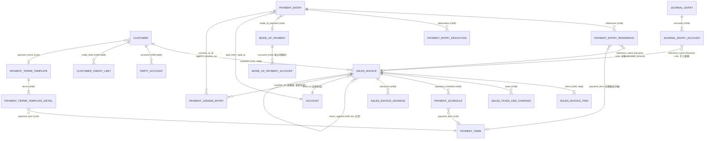
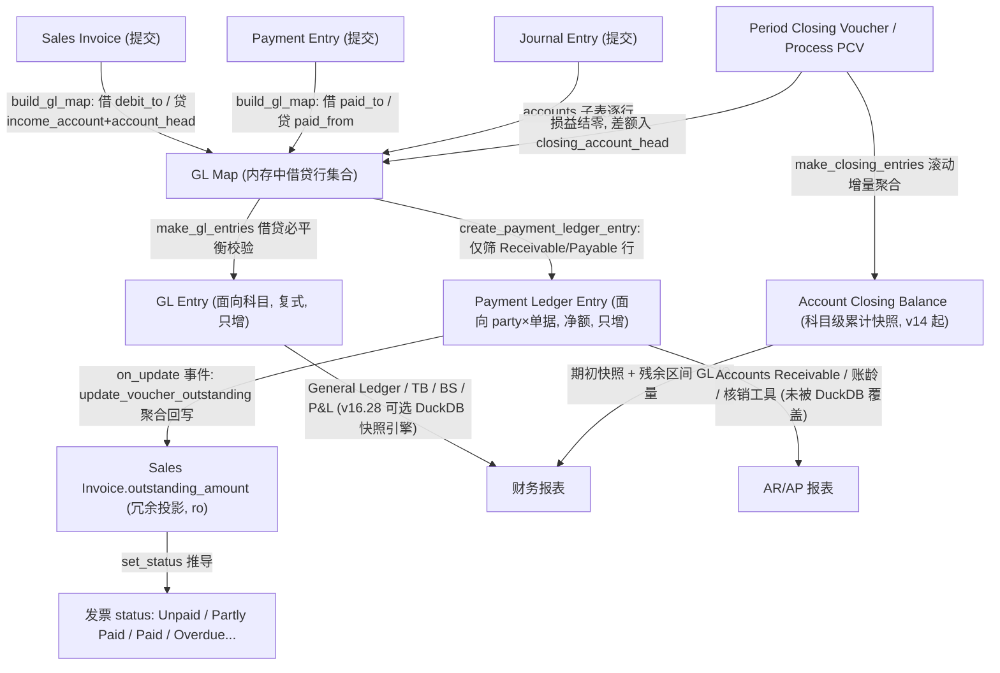

# 第 3 章 数据模型（单据层 + 台账层）

第 2 章回答了"业务流程中这些单据如何被使用"，本章回答一个更底层的问题：**它们到底长什么样，以及为什么长成这样**。答案是字段级的：每一张 DocType 的 JSON 定义文件都是一手证据，字段名、字段类型、必填标记（`reqd`）、只读标记（`read_only`）都可以在 ERPNext `version-16` 分支的仓库中逐一复核。

本章把应收域的数据模型切成两层来拆：**单据层**（Sales Invoice、Payment Entry、Journal Entry、Customer 等业务对象，用户可创建、提交、取消）与**台账层**（GL Entry、Payment Ledger Entry、Account Closing Balance 等系统生成的账簿记录，用户只读不可写）。随后在第 3.4 节解释连接两层的四个核心机制——双层台账的职责边界、`outstanding_amount` 的口径、核销的重建语义、AR 账龄报表的取数口径与 v16 提速的边界。第 3.5 节用"问题 → 证据 → 推断"三段式回答三个设计问题。

版本口径：除显式标注外，所有字段结构均来自 ERPNext / Frappe `version-16` 分支（访问日期 2026-07-28）。涉及 v13/v14/v15 的历史归属（如 Payment Ledger Entry 引入版本、不可变台账引入版本）均单独标注。

## 3.1 通用语义：docstatus、naming_series、is_submittable、Link / Dynamic Link

在逐个拆 DocType 之前，必须先建立四个框架级概念，否则后面的字段表会出现大量无法解读的标记。

### 3.1.1 docstatus：单据生命周期的三态整数

Frappe 框架中每张单据都有一个 `docstatus` 整数字段，语义由框架源码 `frappe/model/docstatus.py` 定义[^3^]：

| 值 | 常量 | 中文含义 | 说明 |
|---|---|---|---|
| 0 | `DocStatus.DRAFT` | 草稿 | 可自由编辑、可删除，不产生任何台账记录 |
| 1 | `DocStatus.SUBMITTED` | 已提交 | 字段锁定，过账（生成 GL/PLE），不可直接修改 |
| 2 | `DocStatus.CANCELLED` | 已取消 | 台账被冲销/脱链，单据本体保留 |

这套语义对自研者有一个重要启示：**取消（Cancel）不是删除**。`docstatus=2` 的单据仍然存在于数据库中，只是台账层用反向分录或脱链标记抵消了它的影响（详见 3.4.3 与第 3.3 节）。与之配套的修订机制是 Amend：对已取消的单据执行 Amend 会复制一张新单据，`amended_from` 字段指回原单据，命名在原编号后追加 `-1`、`-2` 序号。

### 3.1.2 is_submittable：是否拥有完整生命周期

并非所有 DocType 都有提交/取消生命周期。JSON 元数据中的 `is_submittable: 1` 是开关：Sales Invoice、Payment Entry、Journal Entry、Period Closing Voucher 均为 `is_submittable: 1`；而 Customer、Payment Term、Mode of Payment 等主数据没有该属性，`docstatus` 恒为 0。台账层的 GL Entry、Payment Ledger Entry 更进一步——它们不仅没有提交按钮，权限矩阵中所有角色都没有 create/write/delete 权限，只能由系统在过账时写入[^16^][^18^]。这条元数据线是"单据层可写、台账层只增"的分界线。

### 3.1.3 naming_series：编号即审计线索

可提交单据普遍采用 `naming_series` 命名规则（`autoname: "naming_series:"`）：单据头有一个 Select 类型的 `naming_series` 字段，选项是带年份占位符的前缀模板，例如 Sales Invoice 的 `ACC-SINV-.YYYY.-`（正常发票）与 `ACC-SINV-RET-.YYYY.-`（退货/贷记凭证专用系列）[^1^]，Payment Entry 的 `ACC-PAY-.YYYY.-`[^6^]，Journal Entry 的 `ACC-JV-.YYYY.-`[^10^]。提交时框架把占位符替换为年份和递增序号。编号前缀直接编码了单据性质——审计时看到 `ACC-SINV-RET-2026-00017` 就知道这是一张红字发票，无需打开单据。子表行（`istable: 1`）则没有编号系列，通常以随机 hash 命名（`autoname: "hash"`，`naming_rule: "Random"`），因为子行的身份依附于父单据。

### 3.1.4 Link / Dynamic Link：关联字段的两种形态

ERPNext 字段表中最常出现的两类关系字段值得对照理解：

| 形态 | JSON 定义 | 语义 | 应收域实例 |
|---|---|---|---|
| Link | `"fieldtype": "Link", "options": "Customer"` | 固定指向某一种 DocType 的外键 | Sales Invoice 的 `customer`（Link→Customer）[^1^] |
| Dynamic Link | `"fieldtype": "Dynamic Link", "options": "party_type"` | 多态外键，目标 DocType 由同行另一个 Link→DocType 字段决定 | Payment Entry 的 `party`（Dynamic Link→`party_type`）[^6^] |

Dynamic Link 是"字段级多态"：一行记录里，`party_type` 存目标表名（Customer / Supplier / Employee…），`party` 存目标表的主键值。核销引用子表 Payment Entry Reference 用同样的配对——`reference_doctype` + `reference_name`——让同一张子表可以指向 Sales Invoice、Journal Entry 等不同被核销单据[^7^]。对 TS 栈读者，这等价于 Prisma 中无法直接表达、需要 `(target_type, target_id)` 两列手工实现的多态关联；ERPNext 把它做成了框架级字段类型，并在 UI 层自动提供按 `party_type` 过滤的联动下拉。

---

## 3.2 单据层 DocType 逐个拆解

本节按"应收主线单据 → 收款与核销单据 → 主数据 → 手工凭证 → 付款条件体系"的顺序拆解。每个 DocType 给出元数据属性、关键字段表与一段设计解读。字段表口径：主数据 Link、金额/税额、状态、日期、子表关系等关键字段一个不漏；打印格式、营销追踪等次要字段不抄。`reqd=1` 表示必填，`ro=1` 表示只读（由代码计算回填）。

### 3.2.1 Sales Invoice（销售发票）——应收源头单据

Sales Invoice 位于 `erpnext/accounts/doctype/sales_invoice/`，是应收模块的源头单据：它的提交触发应收账款挂账，它的 `outstanding_amount` 是整个应收管理的中心变量。

**元数据属性**

| 属性 | 值 |
|---|---|
| `is_submittable` | `1`（可提交） |
| `istable` | 无（顶层单据） |
| `track_changes` | `1`（变更留痕） |
| `autoname` / `naming_rule` | `naming_series:` / `By "Naming Series" field` |
| 数据字段总数 | 155 个（不含 Section Break 等布局字段） |

命名系列 `naming_series`（reqd=1）的选项为 `ACC-SINV-.YYYY.-` 与 `ACC-SINV-RET-.YYYY.-`，后者专用于退货/贷记凭证[^1^]。

**关键字段表**[^1^]

| fieldname | fieldtype | reqd | options / 说明 |
|---|---|---|---|
| `naming_series` | Select | 1 | `ACC-SINV-.YYYY.-` / `ACC-SINV-RET-.YYYY.-`，单据编号系列 |
| `customer` | Link→Customer | 1 | 客户，应收主体 |
| `company` | Link→Company | 1 | 核算主体（法人） |
| `posting_date` | Date | 1 | 过账日期，default=Today |
| `due_date` | Date | 0 | Payment Due Date（到期日，账龄判定输入） |
| `is_return` | Check | 0 | "Is Return (Credit Note)"，退货/红字发票标记 |
| `is_debit_note` | Check | 0 | "Is Rate Adjustment Entry (Debit Note)"，价差调整标记 |
| `return_against` | Link→Sales Invoice | 0 | 红字发票指向原发票（自引用） |
| `is_pos` | Check | 0 | "Include Payment (POS)"，即时收款 |
| `debit_to` | Link→Account | 1 | **应收账款科目**，GL 借方落点 |
| `party_account_currency` | Link→Currency | 0 | 应收科目币种（ro=1） |
| `currency` | Link→Currency | 1 | 交易币种 |
| `items` | Table→Sales Invoice Item | 1 | 行项目子表（至少一行） |
| `taxes` | Table→Sales Taxes and Charges | 0 | 税费子表 |
| `taxes_and_charges` | Link→Sales Taxes and Charges Template | 0 | 税费模板（带出 taxes 行） |
| `payment_schedule` | Table→Payment Schedule | 0 | 分期付款计划子表 |
| `payment_terms_template` | Link→Payment Terms Template | 0 | 付款条件模板 |
| `advances` | Table→Sales Invoice Advance | 0 | 预收款抵用子表 |
| `payments` | Table→Sales Invoice Payment | 0 | POS 即时收款明细 |
| `net_total` / `base_net_total` | Currency | 0/1 | 净额（交易币 / 公司币，ro=1） |
| `total_taxes_and_charges` / `base_total_taxes_and_charges` | Currency | 0 | 税费合计（ro=1） |
| `grand_total` / `base_grand_total` | Currency | 1 | 价税合计总额（ro=1） |
| `rounded_total` / `rounding_adjustment` | Currency | 0 | 舍入总额与舍入调整 |
| `total_advance` | Currency | 0 | 预收抵用合计（ro=1，币种=`party_account_currency`） |
| `paid_amount` / `base_paid_amount` | Currency | 0 | 已付金额（POS 场景，ro=1） |
| `outstanding_amount` | Currency | 0 | **未清余额（ro=1）**，应收管理核心字段，币种=`party_account_currency` |
| `write_off_amount` / `write_off_account` | Currency / Link→Account | 0 | 尾差/坏账核销金额与科目 |
| `status` | Select | 0 | 见下表（ro=1，由代码计算） |
| `is_opening` | Select | 0 | `No` / `Yes`，期初余额导入标记 |
| `amended_from` | Link→Sales Invoice | 0 | 修订来源单据（ro=1） |

**`status` 的 13 个取值**（JSON 中 Select options 原文，ro=1）[^1^]：

| 状态值 | 触发条件（`set_status()` 逻辑要点） |
|---|---|
| Draft | `docstatus=0` |
| Submitted | 兜底分支：`docstatus=1` 且 Unpaid / Overdue / Partly Paid / Paid / Return 等条件均不匹配时 |
| Unpaid | `outstanding_amount > 0` 且 `due_date ≥ today` |
| Overdue | `outstanding_amount > 0` 且 `due_date < today` |
| Partly Paid | `0 < outstanding_amount < total` |
| Paid | `outstanding_amount ≤ 0` |
| Credit Note Issued | 原发票被红字发票（`is_return` 单据）全额冲回 |
| Return | 该单据本身是红字发票 |
| Unpaid and Discounted / Partly Paid and Discounted / Overdue and Discounted | 由 Invoice Discounting（应收账款贴现融资）驱动：基础状态 + "该票已贴现"标记，与 Payment Term 的早付折扣是两个不同功能（见第 2 章 2.3.1 节） |
| Cancelled | `docstatus=2` |
| Internal Transfer | 内部转移场景 |

该字段为只读，取值由控制器 `set_status()`（`sales_invoice.py`，v16 第 2265 行起）根据 `docstatus` + `outstanding_amount` + `due_date` 计算，而非用户选择[^2^]。源码中的判定链为：`docstatus == 2 → "Cancelled"`；`is_overdue（outstanding > 0 且 due_date 已过）→ "Overdue"`；`0 < outstanding_amount < total → "Partly Paid"`；`outstanding_amount > 0 且 due_date 未过 → "Unpaid"`；其后依次为 Credit Note Issued（被已提交红字票冲回）、Return（`is_return=1`）、`outstanding_amount ≤ 0 → "Paid"`；以上条件均不匹配时 else 兜底 → "Submitted"（内部转移交易则在最前单独判为 "Internal Transfer"）。

**设计解读**：Sales Invoice 的字段结构暴露了三个设计决策。第一，**会计落点放在单据头上**：`debit_to`（应收科目）是单据级必填字段，而收入科目在行项目级（见 3.2.2 的 `income_account`），税额科目在税费行级（见 3.2.2 的 `account_head`）——提交时系统不需要任何"过账规则配置表"，直接从单据自身字段拼出整张 GL map。第二，**金额字段全面双币种冗余**：几乎每个 Currency 字段都有对应的 `base_` 前缀公司币版本，交易币面向客户沟通，公司币面向账簿与报表，两者在保存时一次性算定并持久化，避免报表时再换算。第三，**`outstanding_amount` 是派生冗余而非录入项**：JSON 中它是 `read_only: 1` 的 Currency 字段[^1^]，真值由台账层（PLE）实时聚合、事件驱动回写（机制见 3.4.2），`set_status()` 再以它为输入推导状态。红字发票（Credit Note）不走单独的 DocType，而是同一张 Sales Invoice 加 `is_return` 标记 + `return_against` 自引用——数量取负、金额取负，复用全部校验与过账逻辑。

### 3.2.2 Sales Invoice Item 与 Sales Taxes and Charges

发票的两个核心子表分别承载"卖了什么"与"加了多少税"，它们共同决定 GL 的贷方结构。

**Sales Invoice Item（行项目子表）**[^4^]

元数据：`istable: 1`；`autoname: "hash"`（子行随机命名）；`editable_grid: 1`。

| fieldname | fieldtype | reqd | options / 说明 |
|---|---|---|---|
| `item_code` | Link→Item | 0 | 物料/服务编码（label "Item"） |
| `qty` | Float | 0 | Quantity |
| `uom` | Link→UOM | 1 | 计量单位 |
| `conversion_factor` | Float | 1 | UOM 换算系数 |
| `stock_qty` | Float | 0 | 库存单位数量（ro=1） |
| `price_list_rate` / `base_price_list_rate` | Currency | 0 | 价格表单价（ro=1） |
| `margin_type` / `discount_percentage` / `discount_amount` | Select / Percent / Currency | 0 | 加价与折扣（`Percentage` / `Amount`） |
| `rate` / `amount` | Currency | 1 | 单价与行金额（`amount` ro=1） |
| `base_rate` / `base_amount` | Currency | 1 | 公司币单价与金额（ro=1） |
| `net_rate` / `net_amount`（及 `base_` 对） | Currency | 0 | 摊销整单折扣后的净价/净额（ro=1） |
| `income_account` | Link→Account | 1 | **收入科目**（GL 贷方落点） |
| `expense_account` | Link→Account | 0 | 费用科目（退货冲减用） |
| `deferred_revenue_account` | Link→Account | 0 | 递延收入科目 |
| `item_tax_template` | Link→Item Tax Template | 0 | 行级税模板 |
| `cost_center` | Link→Cost Center | 1 | 成本中心 |
| `warehouse` / `target_warehouse` | Link→Warehouse | 0 | 仓库（`update_stock` 场景） |
| `sales_order` / `delivery_note` | Link | 0 | 源单据回溯（ro=1） |
| `serial_and_batch_bundle` / `batch_no` | Link | 0 | 序列号/批次 |
| `incoming_rate` | Currency | 0 | 成本价（公司币） |

**设计解读**：行级 `income_account` 必填说明 ERPNext 的收入科目粒度在行项目——同一张发票的不同行可以落不同收入科目（如"产品收入"与"服务收入"混开），GL 贷方按行拆分生成。金额字段同样成对出现（交易币 + `base_` 公司币），并在 `rate/amount` 之外再叠一层 `net_rate/net_amount` 承载整单折扣的摊销结果——折扣不是独立的负行，而是被摊回每行的净额，这保证了"按行算收入"在任何折扣场景下都成立。

**Sales Taxes and Charges（销售税费子表）**[^5^]

元数据：`istable: 1`；`editable_grid: 1`。

| fieldname | fieldtype | reqd | options / 说明 |
|---|---|---|---|
| `charge_type` | Select | 1 | **计征方式**：`Actual` / `On Net Total` / `On Previous Row Amount` / `On Previous Row Total` / `On Item Quantity` |
| `row_id` | Data | 0 | Reference Row #（配合 On Previous Row 两种计征方式） |
| `account_head` | Link→Account | 1 | 税费科目（GL 落点） |
| `cost_center` | Link→Cost Center | 0 | 成本中心 |
| `description` | Small Text | 1 | 税费行描述 |
| `rate` | Float | 0 | Tax Rate（税率 %） |
| `tax_amount` / `base_tax_amount` | Currency | 0 | 税额（交易币 / 公司币，base ro=1） |
| `total` / `base_total` | Currency | 0 | 累计至本行的合计（running total，ro=1） |
| `tax_amount_after_discount_amount` | Currency | 0 | 整单折扣后的税额（ro=1） |
| `included_in_print_rate` | Check | 0 | "Is this Tax included in Basic Rate?"（价内税） |
| `included_in_paid_amount` | Check | 0 | "Considered In Paid Amount" |
| `account_currency` | Link→Currency | 0 | 科目币种（ro=1） |
| `is_tax_withholding_account` | Check | 0 | 预扣税科目标记（ro=1） |

**设计解读**：税费被建模为多行子表而非单据头上的单字段，这是为了表达**一行一税目**与**级联计税**两件事。`charge_type` 的五个选项中，`On Previous Row Amount` / `On Previous Row Total` 允许"在上一行税额之上再计税"（如印度 GST 之上再征 cess），`row_id` 指明参照哪一行；`total` 字段逐行累计（running total），是税额计算的执行载体——每一行的 `tax_amount` 基于前面行的 `total` 算出，最后一张税费行的 `total` 就是 `grand_total`。对自研者的启示：如果你的税场景只有单一税率，一行一税目仍然值得保留，因为"税率变更历史"与"多税目叠加"几乎是必然会来的需求。

### 3.2.3 Payment Entry + Payment Entry Reference + Deduction

收款侧由一张主单据和两张子表构成，三者合起来回答"收了谁的钱、冲了哪些单、差额去了哪"。

**Payment Entry（收付款单）**[^6^]

元数据：`is_submittable: 1`；`track_changes: 1`；命名系列 `ACC-PAY-.YYYY.-`。

| fieldname | fieldtype | reqd | options / 说明 |
|---|---|---|---|
| `naming_series` | Select | 1 | `ACC-PAY-.YYYY.-` |
| `payment_type` | Select | 1 | `Receive` / `Pay` / `Internal Transfer`——收款、付款、内部转账三类 |
| `posting_date` | Date | 1 | 过账日期 |
| `company` | Link→Company | 1 | 核算主体 |
| `mode_of_payment` | Link→Mode of Payment | 0 | 收付款方式（现金/银行…） |
| `party_type` | Link→DocType | 0 | 往来方类型（Customer / Supplier / Employee…） |
| `party` | **Dynamic Link**→`party_type` | 0 | 往来方（多态关联） |
| `paid_from` | Link→Account | 1 | 付款方科目（收款时=应收/客户科目） |
| `paid_to` | Link→Account | 1 | 收款方科目（收款时=银行/现金科目） |
| `paid_from_account_currency` / `paid_to_account_currency` | Link→Currency | 1 | 两侧科目币种（ro=1） |
| `paid_amount` / `base_paid_amount` | Currency | 1 | 付款侧金额（币种=`paid_from_account_currency`） |
| `received_amount` / `base_received_amount` | Currency | 1 | 收款侧金额（支持多币种收付差额） |
| `references` | Table→Payment Entry Reference | 0 | **核销引用子表（多对多分摊核心）** |
| `total_allocated_amount` / `base_total_allocated_amount` | Currency | 0 | 已分摊合计（ro=1） |
| `unallocated_amount` | Currency | 0 | 未分摊金额（预收/待核销部分） |
| `difference_amount` | Currency | 0 | 差额（公司币，ro=1） |
| `deductions` | Table→Payment Entry Deduction | 0 | 扣减/尾差子表 |
| `reference_no` / `reference_date` | Data / Date | 0 | 支票号/银行参考号与日期 |
| `clearance_date` | Date | 0 | 银行清算日（ro=1） |
| `bank_account` / `party_bank_account` | Link→Bank Account | 0 | 公司与往来方银行账户 |
| `status` | Select | 0 | `Draft` / `Submitted` / `Cancelled`（ro=1，仅三态） |
| `is_opening` | Select | 0 | `No` / `Yes` |

**设计解读**：三个字段决策值得注意。其一，`party` 是 Dynamic Link，意味着 Payment Entry 不专属于应收——同一 DocType 服务收款（Customer）与付款（Supplier），用 `payment_type` 区分方向；这避免了 AR/AP 两套收款单据的重复建模。其二，`paid_from` / `paid_to` 把复式记账的两条腿直接做成单据头字段：收款单提交时借 `paid_to`（银行）、贷 `paid_from`（应收），付款单方向相反——与 Sales Invoice 的 `debit_to` 同一思路，过账规则内嵌在字段里。其三，`status` 只有 Draft/Submitted/Cancelled 三态，**核销进度不在 Payment Entry 自身的 status 上表达**，而是通过 `unallocated_amount`（自己还剩多少没分摊）与被核销发票的 `outstanding_amount`（对方还剩多少没收）双向表达——核销状态是关系的属性，不是任何一方单据的属性。

**Payment Entry Reference（核销引用子表）——多对多分摊模型核心**[^7^]

元数据：`istable: 1`；`track_changes: 1`；`editable_grid: 1`。

| fieldname | fieldtype | reqd | options / 说明 |
|---|---|---|---|
| `reference_doctype` | Link→DocType | 1 | **被核销单据类型**（Sales Invoice / Purchase Invoice / Journal Entry 等） |
| `reference_name` | **Dynamic Link**→`reference_doctype` | 1 | **被核销单据编号** |
| `due_date` | Date | 0 | 该单据到期日（ro=1，带出） |
| `bill_no` | Data | 0 | 供应商发票号（ro=1） |
| `total_amount` | Currency | 0 | Grand Total——被核销单据总额（ro=1，快照） |
| `outstanding_amount` | Currency | 0 | Outstanding——**核销时刻**的未清余额（ro=1，快照） |
| `allocated_amount` | Currency | 0 | **本次分摊金额**（用户录入/自动分配，核销关系的"权重"） |
| `exchange_rate` | Float | 0 | 该单据汇率（ro=1） |
| `payment_term` | Link→Payment Term | 0 | 指定分摊到哪个付款条件分期 |
| `exchange_gain_loss` | Currency | 0 | 该笔分摊产生的汇兑损益（公司币，ro=1） |
| `account` | Link→Account | 0 | 该被核销单据的往来科目（带出） |
| `account_type` | Data | 0 | Receivable / Payable（带出） |
| `payment_type` | Data | 0 | 带出信息 |
| `payment_request` | Link→Payment Request | 0 | 来源付款请求 |
| `payment_term_outstanding` / `payment_request_outstanding` | Float | 0 | 分期/请求维度余额（ro=1） |
| `reconcile_effect_on` | Date | 0 | 核销生效日（ro=1） |
| `advance_voucher_type` / `advance_voucher_no` | Link / Dynamic Link | 0 | 该引用行由哪张预收/预付单冲抵（ro=1） |

**设计解读**：一行 = "一张 Payment Entry 对一张业务单据的一笔分摊"，这就是核销关系的全部事实源。`reference_doctype + reference_name` 的多态设计使同一子表可核销发票、日记账凭证等不同单据；`allocated_amount` 支持部分核销（小于该行 `outstanding_amount` 快照即为部分）；`payment_term` 字段把核销粒度细化到"发票的某一期"（配合 3.2.6 的 Payment Schedule）；`exchange_gain_loss` 挂在分摊行而非单据头，说明**汇兑损益按分摊笔核算**——一笔收款同时核销两张不同币种的发票时，损益可以逐笔归因、取消时逐笔冲回。`total_amount` / `outstanding_amount` 两个快照字段记录"核销时刻"的对方状态，即使日后对方单据变化，这张收款单的历史语义仍自洽。

**Payment Entry Deduction（扣减/尾差子表）**[^8^]

元数据：`istable: 1`；`editable_grid: 1`。

| fieldname | fieldtype | reqd | options / 说明 |
|---|---|---|---|
| `account` | Link→Account | 1 | 扣减入账科目（如汇兑损失、尾差、银行手续费科目） |
| `cost_center` | Link→Cost Center | 1 | 成本中心 |
| `amount` | Currency | 1 | 扣减金额（公司币） |
| `description` | Small Text | 0 | 说明 |
| `is_exchange_gain_loss` | Check | 0 | 是否汇兑损益（ro=1，由系统标记） |

**设计解读**：实收金额与核销分摊金额之间的差额（单据头 `difference_amount`）不能凭空消失，本子表是它的结构化处理通道——"实收 999.97 vs 发票 1000"的尾差、银行手续费、汇兑差额都通过这里逐笔落到损益科目，保证 Payment Entry 提交时借贷仍然平衡。这回答了一个自研系统常见的漏洞：尾差如果没有显式的科目出口，要么账做不平，要么被静默塞进应收余额里污染账龄。

### 3.2.4 Customer（客户主数据）

Customer 位于 `selling/doctype/customer/`——注意它属销售域而非财务域，这从 DocType 的目录归属即可确认[^9^]。元数据：非子表、不可提交（无 `is_submittable`）；`track_changes: 1`；`autoname: "naming_series:"`（`CUST-.YYYY.-`，亦可通过 Selling Settings 改为按客户名命名）。

**关键字段表**[^9^]

| fieldname | fieldtype | reqd | options / 说明 |
|---|---|---|---|
| `naming_series` | Select | 0 | `CUST-.YYYY.-` |
| `customer_name` | Data | 1 | 客户名称 |
| `customer_type` | Select | 1 | `Company` / `Individual` / `Partnership` |
| `customer_group` | Link→Customer Group | 0 | 客户组（定价/报表维度） |
| `territory` | Link→Territory | 0 | 区域 |
| `disabled` / `is_frozen` | Check | 0 | 停用 / 冻结（冻结比停用更轻：停用禁止新交易，冻结仅限制部分场景） |
| `is_internal_customer` | Check | 0 | 内部客户（集团内交易） |
| `represents_company` | Link→Company | 0 | 对应的集团内公司 |
| `default_currency` | Link→Currency | 0 | Billing Currency |
| `default_price_list` | Link→Price List | 0 | 默认价格表 |
| `accounts` | Table→Party Account | 0 | **按公司维度的默认应收科目**（多公司下一个客户可挂多个应收科目） |
| `payment_terms` | Link→Payment Terms Template | 0 | 默认付款条件模板（被发票继承） |
| `credit_limits` | Table→Customer Credit Limit | 0 | 按公司维度的信用额度子表 |
| `default_bank_account` | Link→Bank Account | 0 | 客户银行账户 |
| `account_manager` | Link→User | 0 | 客户经理 |
| `tax_category` / `tax_withholding_category` | Link | 0 | 税类 / 预扣税类 |
| `lead_name` / `opportunity_name` / `prospect_name` | Link | 0 | CRM 溯源（ro=1） |
| `sales_team` | Table→Sales Team | 0 | 销售团队分成 |
| `loyalty_program` | Link→Loyalty Program | 0 | 会员计划 |
| `companies` | Table→Allowed To Transact With | 0 | 内部客户允许交易的公司 |

**设计解读**：Customer 字段结构中最重要的事实是**它不存任何应收余额**——整份 JSON 里没有 balance 类字段。余额完全由台账层（GL/PLE）实时聚合得出（3.4.2），这与"单据层不冗余余额、余额是台账投影"的全局设计一致。第二个事实是多公司架构的落法：同一客户在不同法人下的应收科目、信用额度分别放在 `accounts`（Party Account 子表，每行 = company + account）与 `credit_limits` 子表里，而不是在单据头上平铺 `company_1_account` 之类的字段——子表让"公司"这个维度开放扩展。第三个事实是 `payment_terms` 的继承链：Customer 上配默认模板 → 开票时带到 Sales Invoice → 实例化为 Payment Schedule 行（3.2.6），付款条件从主数据到单据是一次"模板实例化"而非引用。

### 3.2.5 Journal Entry（手工日记账凭证）

Journal Entry 是财务域的"万能凭证"，坏账核销、借抵贷、期初录入、汇兑重估都通过它完成。它由单据头和分录子表组成。

**Journal Entry（单据头）**[^10^]

元数据：`is_submittable: 1`；`track_changes: 1`；命名系列 `ACC-JV-.YYYY.-`。

| fieldname | fieldtype | reqd | options / 说明 |
|---|---|---|---|
| `voucher_type` | Select | 1 | 凭证类型，共 18 种：`Journal Entry` / `Inter Company Journal Entry` / `Bank Entry` / `Cash Entry` / `Credit Card Entry` / `Debit Note` / `Credit Note` / `Contra Entry` / `Excise Entry` / `Write Off Entry` / `Opening Entry` / `Depreciation Entry` / `Asset Disposal` / `Periodic Accounting Entry` / `Exchange Rate Revaluation` / `Exchange Gain Or Loss` / `Deferred Revenue` / `Deferred Expense` |
| `posting_date` | Date | 1 | 过账日期 |
| `company` | Link→Company | 1 | 核算主体 |
| `accounts` | Table→Journal Entry Account | 1 | 分录子表 |
| `total_debit` / `total_credit` / `difference` | Currency | 0 | 借贷合计与差额（ro=1，`difference` 须为 0 才可提交） |
| `multi_currency` | Check | 0 | 多币种凭证 |
| `write_off_based_on` / `write_off_amount` | Select / Currency | 0 | 坏账核销向导（`Accounts Receivable` / `Accounts Payable`） |
| `reversal_of` | Link→Journal Entry | 0 | 冲销原凭证 |
| `mode_of_payment` | Link→Mode of Payment | 0 | 收付款方式（现金/银行类凭证） |
| `is_opening` | Select | 0 | `No` / `Yes`，期初录入标记 |

**Journal Entry Account（分录子表）**[^11^]

元数据：`istable: 1`；`autoname: "hash"`；`editable_grid: 1`。

| fieldname | fieldtype | reqd | options / 说明 |
|---|---|---|---|
| `account` | Link→Account | 1 | 科目 |
| `party_type` / `party` | Link→DocType / Dynamic Link | 0 | 往来方（应收应付科目必填） |
| `cost_center` | Link→Cost Center | 0 | 成本中心 |
| `debit` / `credit` | Currency | 0 | 借 / 贷（公司币，ro=1） |
| `debit_in_account_currency` / `credit_in_account_currency` | Currency | 0 | 借 / 贷（科目币） |
| `account_currency` / `exchange_rate` | Link / Float | 0 | 科目币种与汇率 |
| `reference_type` | Select | 0 | 被关联单据类型：`Sales Invoice` / `Payment Entry` / `Journal Entry` 等 16 种 |
| `reference_name` | Dynamic Link→`reference_type` | 0 | 被关联单据号（**JE 直接挂账核销发票的通道**） |
| `reference_due_date` | Date | 0 | 关联到期日 |
| `is_advance` | Select | 0 | `No` / `Yes`，预收/预付标记 |
| `against_account` | Text | 0 | 对方科目（展示用） |
| `advance_voucher_type` / `advance_voucher_no` | Link / Dynamic Link | 0 | 预收冲抵来源（ro=1） |

**设计解读**：Journal Entry 的结构是"最小复式记账机"——单据头只管过账日、公司、凭证类型，所有会计内容都在分录行里，提交校验只有一条铁律（`total_debit = total_credit`）。与应收最相关的是分录行的 `reference_type + reference_name`：这对多态字段让手工凭证可以直接指向一张 Sales Invoice，构成 Payment Entry 之外的**第二条核销通道**（坏账核销、借抵贷场景）。注意 `party_type/party` 的约束是分录行级的：只有科目是 Receivable/Payable 类型时才要求填往来方——这条约束在台账层会被再次强制（PLE 的 `account_type` 校验，见 3.3.2），单据层与台账层各校验一次，是纵深防御。`voucher_type` 的 18 个枚举值则说明 ERPNext 没有为每种特殊业务各建一张 DocType，而是用凭证类型标签复用同一骨架，差异只在控制器逻辑。

### 3.2.6 Payment Term 体系与 Payment Schedule

付款条件体系由三层对象构成：Payment Term（单个条件的定义）→ Payment Terms Template（条件组合模板）→ Payment Schedule（模板在单据上的实例化结果）。另外 Mode of Payment 作为收付款方式主数据一并在此交代。

**Payment Term（付款条件主数据）**[^12^]

元数据：非子表；`autoname: "field:payment_term_name"`（主键即名称）；`track_changes: 1`。

| fieldname | fieldtype | reqd | options / 说明 |
|---|---|---|---|
| `payment_term_name` | Data | 0 | 条件名称（即主键） |
| `invoice_portion` | Float | 0 | Invoice Portion (%)——该期占发票金额比例 |
| `due_date_based_on` | Select | 0 | `Day(s) after invoice date` / `Day(s) after the end of the invoice month` / `Month(s) after the end of the invoice month` |
| `credit_days` / `credit_months` | Int | 0 | 信用天数 / 月数 |
| `mode_of_payment` | Link→Mode of Payment | 0 | 约定收付款方式 |
| `discount_type` / `discount` | Select / Float | 0 | 早付折扣（`Percentage` / `Amount`） |
| `discount_validity_based_on` / `discount_validity` | Select / Int | 0 | 折扣有效期基准与天数 |

**Payment Terms Template（付款条件模板）**[^13^]

元数据：`autoname: "field:template_name"`；`track_changes: 1`。

| fieldname | fieldtype | reqd | options / 说明 |
|---|---|---|---|
| `template_name` | Data | 0 | 模板名（主键） |
| `terms` | Table→Payment Terms Template Detail | 1 | 模板内的付款条件行 |
| `allocate_payment_based_on_payment_terms` | Check | 0 | "Allocate Payment Based On Payment Terms"——收款按分期顺序分摊的开关 |

**Payment Schedule（发票上的分期计划子表）**[^14^]

元数据：`istable: 1`；`track_changes: 1`。该子表被 Sales Invoice / Purchase Invoice / Sales Order 等共用，是**模板实例化到单据上的结果**。

| fieldname | fieldtype | reqd | options / 说明 |
|---|---|---|---|
| `payment_term` | Link→Payment Term | 0 | 来源付款条件 |
| `due_date` | Date | 1 | 该期到期日 |
| `invoice_portion` | Percent | 0 | 占比 % |
| `payment_amount` / `base_payment_amount` | Currency | 1 | 该期应收金额 |
| `paid_amount` / `base_paid_amount` | Currency | 0 | **该期已收金额**（ro=1） |
| `outstanding` / `base_outstanding` | Currency | 0 | **该期未清余额**（ro=1） |
| `discount_date` / `discount_type` / `discount` / `discounted_amount` | Date / Select / Float / Currency | 0 | 早付折扣实例 |
| `mode_of_payment` | Link→Mode of Payment | 0 | 约定方式 |
| `due_date_based_on` / `credit_days` / `credit_months` | Select / Int | 0 | 计算痕迹（ro=1） |

**Mode of Payment（收付款方式主数据）**[^15^]

元数据：`autoname: "field:mode_of_payment"`（主键即名称）。

| fieldname | fieldtype | reqd | options / 说明 |
|---|---|---|---|
| `mode_of_payment` | Data | 1 | 方式名称（如 Cash、Wire Transfer） |
| `type` | Select | 0 | `Cash` / `Bank` / `General` / `Phone` |
| `enabled` | Check | 0 | 启用标记 |
| `accounts` | Table→Mode of Payment Account | 0 | **按公司映射默认科目**（不同公司同一方式可落不同银行/现金科目） |

**设计解读**：Payment Schedule 行带有独立的 `paid_amount` / `outstanding`，且 Payment Entry Reference 行有 `payment_term` 字段（3.2.3）——**核销粒度可以细化到"发票的某一期"**，发票头的 `outstanding_amount` 是其下各期 `outstanding` 的汇总。这一结构支撑了两类高级场景：分期收款下的按期账龄（AR 报表可按 Payment Term 拆行，见 3.4.4）与早付折扣场景（注意：Sales Invoice 状态里的 "…and Discounted" 三态由 Invoice Discounting 应收贴现驱动，与 Payment Term 的早付折扣是两个不同功能，见 3.2.1 与第 2 章 2.3.1 节）。`due_date_based_on` 的三种算法（发票日后 N 天 / 发票月末后 N 天 / 发票月末后 N 月）覆盖了"月结 30 天"这类商务条款的常见表达。Mode of Payment 的 `accounts` 子表则与 Customer 的 `accounts` 子表同构——又一个"按公司维度差异化配置"的子表模式实例。

### 3.2.7 单据层关系总览

下图汇总本节全部 DocType 的关联关系（依据上述各 DocType JSON 一手定义绘制）。实体名为大写下划线形式的 DocType 名；关系标签标注字段名与关系性质。

读这张图时注意三种边的语义差异：实线近端带 `||--|{` 的是**父子表**（子表行随父单据存亡，如 `SALES_INVOICE ||--|{ SALES_INVOICE_ITEM`）；`}o--||` 与 `}o--o|` 是**Link 外键**（目标独立存在，如发票指向科目、客户指向付款条件模板）；而 `PAYMENT_ENTRY_REFERENCE` 与 `SALES_INVOICE` 之间的边本质是 Dynamic Link 多态关联——图中画的是应收主线上的实例（指向 Sales Invoice），实际还可指向 Journal Entry 等其它单据。最底部的两条边跨越了单据层与台账层：`PAYMENT_LEDGER_ENTRY` 不属于任何单据的子表，它是系统在过账时生成的独立台账记录，这正引出下一节。

---

## 3.3 台账层

单据层的每一次提交，最终都要在台账层留下痕迹。台账层由三类对象组成：**GL Entry**（总账分录，复式记账的最终落点）、**Payment Ledger Entry**（收付台账，核销追踪层，v14 引入）、**Account Closing Balance**（结账余额快照，v14 引入）及其生产者 Period Closing Voucher / Process Period Closing Voucher。三者的共同特征是**用户不可写**：GL Entry 与 PLE 的权限矩阵中所有角色仅有 read/report/export，没有 create/write/delete/submit/cancel 任何权限[^16^][^18^]——台账只能由系统在过账路径上写入。

### 3.3.1 GL Entry（总账分录）——复式记账最终落点

GL Entry 位于 `accounts/doctype/gl_entry/`，是"面向科目（account-centric）"的台账：一行 = 一个科目一侧的借贷，一张单据提交产生若干行且借贷必平衡。

**关键字段表**（`version-16`，JSON modified 2025-08-22）[^16^]

| fieldname | fieldtype | 说明 |
|---|---|---|
| `posting_date` | Date（search_index） | 过账日期，报表分期主键 |
| `account` | Link→Account（search_index） | 会计科目 |
| `party_type` / `party` | Link→DocType / Dynamic Link | 往来单位类型/单位（Customer / Supplier / Employee…） |
| `debit` / `credit` | Currency | 公司本位币借贷金额 |
| `debit_in_account_currency` / `credit_in_account_currency` | Currency | 科目币别金额（多币种核算核心） |
| `debit_in_transaction_currency` / `credit_in_transaction_currency` + `transaction_exchange_rate` | Currency + Float | 交易币别金额（v15+ 三层币种） |
| `debit_in_reporting_currency` / `credit_in_reporting_currency` + `reporting_currency_exchange_rate` | Currency + Float | 集团报告币金额（**v16 新增**，配合 Company.`reporting_currency`） |
| `voucher_type` / `voucher_no` / `voucher_detail_no` | Link / Dynamic Link / Data | 来源单据（Sales Invoice、Payment Entry…），均带 search_index |
| `against_voucher_type` / `against_voucher` | Link / Dynamic Link | 核销目标单据 |
| `against` | Text | 对方科目汇总（冗余展示字段） |
| `cost_center` / `project` / `finance_book` | Link | 会计维度 |
| `is_opening` / `is_advance` / `is_cancelled` | Select / Check | 期初 / 预收付 / 已冲销标记 |
| `due_date` | Date | 到期日（账龄用） |
| `fiscal_year` / `company` | Link | 财年与法人 |

数据库索引（由 `gl_entry.py` 的 `on_doctype_update` 建立）：`(voucher_type, voucher_no)`、`(posting_date, company)`、`(party_type, party)`[^17^]。

**设计解读**：GL Entry 字段结构里最值得注意的是**四层币种冗余**：公司币（`debit/credit`）、科目币（`_in_account_currency`）、交易币（`_in_transaction_currency`，v15 起）、集团报告币（`_in_reporting_currency`，v16 新增）。每一层都在过账时算定并持久化，报表按需要哪层就聚合哪层，永远不做运行时换算——这是用存储空间换报表路径确定性的典型取舍。其次，GL Entry 虽然有 `against_voucher` 字段表达核销指向，但它**不直接回答"某张发票还剩多少未收"**：要从 GL 算未清，需要按 `against_voucher` 聚合借贷差额（v13 及更早版本正是这么做的，兼容函数 `update_outstanding_amt` 至今仍存在于 `gl_entry.py`[^17^]），这个职责在 v14 被移交给了 PLE。

### 3.3.2 Payment Ledger Entry（收付台账，PLE）——核销追踪层

**版本归属：PLE 自 v14 引入**（DocType JSON 的 `creation` 时间为 2022-05-09，属 v14 开发周期；二手来源亦称其为 v14 引入的架构变更[^42^]；⚠️ 精确到 v14.x 的 minor 版本未做 git blame 定位，为低优先级待验证项）。注意与 v13 引入的 **Immutable Ledger**（不可变台账，见 3.4.3）区分，两者常被混淆[^35^]。

PLE 的元数据与 GL Entry 同构：所有角色只读，不可写、不可提交——它是纯系统表[^18^]。

**关键字段表**（`version-16`，JSON modified 2024-03-27）[^18^]

| fieldname | fieldtype | 说明 |
|---|---|---|
| `posting_date` | Date（search_index） | 过账日期 |
| `account_type` | Select：**Receivable / Payable** | 只服务应收应付两类科目 |
| `account` | Link→Account（search_index） | 应收/应付科目 |
| `party_type` / `party` | Dynamic Link | 往来单位（面向 party 追踪的必填语义） |
| `voucher_type` / `voucher_no` | Link / Dynamic Link | 产生该行的单据 |
| `against_voucher_type` / `against_voucher_no` | Link / Dynamic Link | **被核销的单据**——核销关系的一手表达 |
| `amount` | Currency | 公司币金额（带正负：借正贷负的净额语义） |
| `amount_in_account_currency` + `account_currency` | Currency | 科目币金额 |
| `delinked` | Check（in_list_view） | 取消时"脱链"标记（取消的行保留但 `delinked=1`，见 3.4.3） |
| `due_date` | Date | 账龄计算输入 |
| `cost_center` / `project` / `finance_book` / `company` | Link | 维度与法人 |
| `voucher_detail_no` | Data | 行级核销（PE/JV 明细行粒度） |
| `remarks` | Small Text | 备注 |

数据库索引：`(against_voucher_no, against_voucher_type)`、`(voucher_no, voucher_type)`[^19^]。

**设计解读**：PLE 与 GL Entry 的职责差异直接写在字段上：PLE **没有借贷方向字段**，只有一个带符号的 `amount`——它不追求双边平衡（不是复式），只回答"哪个 party 的哪张单，被哪笔收付核销了多少"。`(voucher, against_voucher, amount)` 三元组就是核销二分图的一条边。同时 PLE 不是"另起炉灶"：它不是独立过账产生的，而是**从 GL map 派生**——`make_gl_entries` 内部调用 `create_payment_ledger_entry(gl_entries, …)`，`get_payment_ledger_entries` 只筛出 `account_type` 为 Receivable/Payable 的 GL 行生成 PLE[^20^]——`account_type` 是 Account 主数据上的语义标签（Select，约 30 项，其中 Receivable/Payable 两项就是 PLE 生成的开关）[^21^]；校验逻辑也复用 GL 层（`validate_account` 强制 `account.account_type == self.account_type`，`validate_frozen_account`、`validate_balance_type` 均来自 `gl_entry.py`[^19^]）。可以把它理解为 GL 的一张"可独立重建的物化视图"：事实源仍是 GL，PLE 只是按核销视角重新切分。索引设计也暴露了查询模式——`against_voucher_no` 索引服务"这张发票被哪些收款冲过"，`voucher_no` 索引服务"这笔收款冲了哪些单"，正是核销二分图的两个方向。

### 3.3.3 Account Closing Balance 与 Process PCV

第三类台账对象服务于期末关账与报表提速。生产者侧是 Period Closing Voucher（PCV，期末关账凭证），产物侧是 Account Closing Balance（ACB，结账余额快照）。

**Period Closing Voucher（期末关账凭证）**[^22^]

| fieldname | fieldtype | 说明 |
|---|---|---|
| `fiscal_year` / `company` | Link（reqd） | 关闭的财年与法人 |
| `period_start_date` / `period_end_date` | Date（reqd） | 关账区间（v16 支持年内多段关账） |
| `closing_account_head` | Link→Account（reqd） | 损益结转科目；"The account head under Liability or Equity, in which Profit/Loss will be booked" |
| `gle_processing_status` | Select：In Progress / Completed / Failed（ro） | **v16 异步化**：关账 GL 生成改为后台作业 |
| `error_message` | Text（ro） | 失败原因 |
| `amended_from` | Link | 支持 amend |

PCV 的会计动作是：把所有损益类（Income/Expense）科目结零，差额转入 `closing_account_head` 指定的负债/权益类科目（如 Reserves and Surplus）[^34^]。关账后该区间成为不可触碰的硬边界——`general_ledger.py` 的 `validate_against_pcv` 在过账路径上拦截：过账日 ≤ 已关闭期末的新增/取消一律拒绝（"Books have been closed till the period ending on {0}…"）[^28^]。

**v16 新增：Process Period Closing Voucher**。v16 把关账从同步长事务拆成后台分批作业，引入 Process Period Closing Voucher DocType（2025 年新建），带 Queued / Running / Paused / Completed / Cancelled 状态机与 `bs_closing_balance` / `p_l_closing_balance` JSON 快照及明细子表；Accounts Settings 同步新增 `pcv_job_timeout`（每个后台作业的超时秒数）与 `use_legacy_controller_for_pcv` 回退开关[^25^][^40^]。

**Account Closing Balance（结账余额快照）**[^23^]

**版本归属：ACB 自 v14 引入**（v13 分支同路径文件 404，v14 分支存在[^43^]；JSON `creation: 2023-02-21`）。它不是 v16 的新事物，更不是 v16.28 报表提速的原因——这一点在 3.4.4 展开。

每条 ACB = `(closing_date, account, cost_center, project, company, finance_book)` 维度下**截至结账日的累计借/贷净额快照**：

| fieldname | fieldtype | 说明 |
|---|---|---|
| `closing_date` | Date（search_index） | 结账日 |
| `account` | Link→Account | 科目 |
| `debit` / `credit`（及 `_in_account_currency`、`_in_reporting_currency` 两套） | Currency | 截至结账日的累计金额 |
| `cost_center` / `project` / `company` / `finance_book` | Link | 快照维度 |
| `period_closing_voucher` | Link→PCV | 由哪张 PCV 生成 |
| `is_period_closing_voucher_entry` | Check | 是否 PCV 损益结转行 |

生成逻辑 `make_closing_entries` 是**增量聚合**：取上次 closing entries 与本次新增合并后按维度聚合再插入（`aggregate_with_last_account_closing_balance`），即每次关账产出一张"滚动累计"的快照表[^24^]。用途：财务报表（Trial Balance 等）以最近一次 PCV 的快照充当期初余额，只扫描其后的 GL 明细，避免每次出报表都从建账第一天重算历史[^24^]。回退开关是 Accounts Settings 的 `ignore_account_closing_balance`（"Financial reports will be generated using GL Entry doctypes (should be enabled if Period Closing Voucher is not posted for all years sequentially or missing)"）[^25^]。

**Accounts Settings 与冻结设置的 v16 迁移（附带交代）**：账套级开关 Single 单据 Accounts Settings 中与台账直接相关的字段包括 `enable_immutable_ledger`（不可变台账开关）、`delete_linked_ledger_entries`（删单据时是否物理清台账，默认关）、`unlink_payment_on_cancellation_of_invoice`、`auto_reconcile_payments` 及后台核销调优参数、`ignore_account_closing_balance`、`receivable_payable_fetch_method`（AR/AP 取数方式，见 3.4.4）等[^25^]。**⚠️ v16 变更**：v15 及官方文档页[^33^]中的 `acc_frozen_upto` 与 `frozen_accounts_modifier` 在 v16 的 Accounts Settings 中**已不存在**，v16 patch `migrate_account_freezing_settings_to_company.py` 把两者迁移到 **Company** 单据（逐公司）：`accounts_frozen_till_date` + `role_allowed_for_frozen_entries`[^26^][^27^]；运行时 `check_freezing_date` 读 Company 字段确认迁移已生效[^28^]。官方文档页截图仍为旧位置，文档滞后于 v16 代码[^33^]。

### 3.3.4 台账层数据流向总览

下图汇总"单据提交 → 台账写入 → 投影消费"的完整数据流：

这张图的分层正是整个数据模型的骨架：左列是**单据层**（可提交、可取消的业务对象），中列是**台账层**（GL/PLE/ACB，系统只增写入），右列是**投影层**（`outstanding_amount` 冗余字段、`status` 派生状态、各类报表）。写路径自上而下用事务保证一致，读路径按代价分级——字段冗余毫秒级直读、PLE 窄表实时聚合秒级可回、ACB 快照把历史聚合摊到关账时刻。注意两条标注了版本归属的边：ACB 自 v14 起承担财报期初快照；v16.28 的 DuckDB 只替换了财报的 GL 扫描引擎，AR/AP 报表的取数边仍直连 PLE（3.4.4 详述）。

---

## 3.4 核心机制

字段是静态的，机制是字段之间的时间关系。本节解释四个把单据层与台账层缝在一起的机制。

### 3.4.1 双层台账职责边界

**事实链**：GL Entry 由每张可过账单据的 `build_gl_map` 生成，借贷必平衡，字段以 `account` / `debit` / `credit` 为核心[^16^][^20^]。PLE 不是独立过账，而是从 GL map 派生：`create_payment_ledger_entry(gl_entries, cancel, adv_adj, update_outstanding, …)` 在 `make_gl_entries` 内被调用，只筛出 `account_type` 为 Receivable/Payable 的 GL 行生成 PLE[^20^]。PLE 独有 `against_voucher_type` / `against_voucher_no`（核销目标）与 `delinked`（脱链）语义，无借贷字段——它是"party × 科目 × 单据"三维的净额流水[^18^]。

**为什么需要两层**（推断链）：复式记账的均衡约束（每张凭证 Σdebit = Σcredit）与核销追踪的需求（"PE-00123 的 8 万元分别冲掉 INV-A 五万、INV-B 三万"）是两种不同拓扑：前者是**科目图**（科目节点 + 借贷边），后者是**单据二分图**（payment ↔ invoice 的多对多带权边）。若塞进单层 GL，核销关系只能靠 `against_voucher` 字段在借贷行上冗余表达——v13 之前正是如此，outstanding 直接聚合 GL（兼容函数 `update_outstanding_amt` 至今仍存[^17^]）。单层表达的代价是：跨行配对、部分核销、脱链重挂都要重写历史借贷行，与不可变台账（3.4.3）直接冲突。拆出 PLE 后职责清晰：GL 保持会计恒等式与财务报表事实源；PLE 承担应收应付的"谁欠谁、还了多少、挂账指向"，且可独立重建（Repost Payment Ledger）而不触碰 GL。两层共享同一次提交事务，一致性由写路径保证，而非由双写对账保证。

对自研者的映射：如果你的系统里"应收账款表"既承担报表汇总又承担核销明细，那么你已经遇到了 ERPNext 在 v13→v14 解决的问题。拆表的标准是拓扑差异而非数据量差异：余额按科目聚合是 GL 的事，敞口按单据配对是 PLE 的事。落到 Prisma/PostgreSQL 的技术栈上，这大致对应两张表：一张 `journal_lines`（account_id、debit、credit、voucher 外键、posting_date，复合索引服务于科目×期间汇总），一张 `payment_ledger`（voucher 对 against_voucher、带符号 amount、delinked 标记，索引同时覆盖两个方向的查询）。前者保证复式恒等式可校验、财报可汇总；后者让"这笔收款冲了哪几张发票、各冲多少"成为一次索引扫描而非递归关联。两表由同一事务写入，不需要双写对账作业——ERPNext 用 `make_gl_entries` 内部一次派生证明了这条路线的可行性。

另一个容易被忽略的边界是"谁可以写台账"。GL Entry 与 PLE 在权限矩阵中对所有角色（包括 Accounts Manager 与 Administrator）都只读[^16^][^18^]，写入只能发生在单据提交/取消/核销的受控代码路径上。这意味着台账的正确性不依赖运维纪律（"大家不要直接改表"），而是由框架权限层强制——自研系统即便不做完整的 RBAC，也应当把台账表的写入口收敛到领域服务层，并对数据库账号收回手工 UPDATE/DELETE 权限。

### 3.4.2 outstanding 口径：PLE 实时聚合 + 事件驱动回写

**机制级结论**：发票上的 `outstanding_amount` 是**冗余字段（物化投影）**，真值由 PLE 实时聚合，事件驱动回写。

证据链（代码级）：

1. **触发点**：PLE 的 `on_update` 钩子中，若 `against_voucher_type` 属于 OUTSTANDING_DOCTYPES 且 `self.flags.update_outstanding == "Yes"`，调用 `update_voucher_outstanding(against_voucher_type, against_voucher_no, account, party_type, party)`[^19^]。
2. **聚合与回写**：`update_voucher_outstanding`（`accounts/utils.py`）用 `QueryPaymentLedger().get_voucher_outstandings(vouchers, common_filter=[party_type, party, account])` 对 PLE 做 `SUM(amount)` 级别的聚合得出 `outstanding_in_account_currency`，然后 `frappe.db.set_value(voucher_type, voucher_no, "outstanding_amount", outstanding_amount)` 直写数据库——代码注释明言 "Didn't use db_set for optimisation purpose"（绕过 ORM 钩子以提速），随后调 `ref_doc.set_status(update=True)` 重算状态[^20^]。
3. **消费点**：发票状态完全由该字段推导（`set_status` 判定链见 3.2.1）[^2^]；列表页、API、打印格式直接读冗余字段，不实时算。
4. **兼容路径**：旧的 GL 聚合函数 `update_outstanding_amt`（`SELECT SUM(debit_in_account_currency) - SUM(credit_in_account_currency) FROM tabGL Entry WHERE against_voucher_type=%s …`）仍存在于 `gl_entry.py`，用于预收/费用类等特定场景[^17^]。

即：**写路径** = PLE 插入/取消事件 → PLE 聚合 → 冗余回写发票字段 → `set_status`；**读路径** = 直读冗余字段。这是一个教科书式的事件驱动物化视图：真值在窄台账表，投影在单据字段，同步由写入事件保证，不依赖定时任务。分期粒度同理——Payment Schedule 行的 `outstanding` 也是同一路径按 `payment_term` 维度聚合回写的投影[^14^]。

这套口径有三个工程细节值得自研者照抄。第一，聚合的过滤维度是 `(party_type, party, account)` 三元组而非仅单据号——同一客户在同一应收科目下的聚合上下文被显式限定，避免跨科目、跨往来方的金额串扰。第二，回写刻意绕过 ORM（`frappe.db.set_value` 而非 `doc.db_set`），因为回写发生在过账事务的热路径上，触发单据层的 validate 钩子既无必要又有死循环风险（状态重算已在下一行显式调用）。第三，投影字段带币种语义：`outstanding_amount` 的币种是 `party_account_currency`（应收科目币）而非交易币[^1^]，这意味着多币种发票的未清余额口径与账簿科目一致，报表间不会因币种换算路径不同而对不上。冗余投影最常见的翻车点——"投影与真值口径不一致"——在这里被字段级的币种绑定提前消解。

### 3.4.3 核销即重建：Cancel → split → resubmit

核销（Payment Reconciliation）的官方定义是 "used to link payments with invoices"，分摊表按 FIFO 或手工选择填充，`allocated_amount` 支持部分核销[^31^]。其落账实现体现了整个系统最重要的一条设计哲学：**账务系统没有 UPDATE，一切变更都是新事实**。

代码级证据：`reconcile()` → `reconcile_allocations()` → `reconcile_against_document(args)`，后者 docstring 明言策略——"**Cancel PE or JV, Update against document, split if required and resubmit**"[^20^]。即核销不是 UPDATE 既有台账行，而是：删除旧 PLE（`_delete_pl_entries`）→ 按新 allocation 重建 GL map → `create_payment_ledger_entry(gl_map, update_outstanding="No", cancel=0, adv_adj=1)` 重插。对 Credit/Debit Note 的核销会自动生成一张 Journal Entry（"A journal entry is auto-created to allocate a credit/debit note to an invoice"）；对 Payment Entry 的核销不生成新凭证，因为其借贷已在总账中[^30^][^31^]。

自动核销（Auto Reconcile）走的也是同一条重建路径：总开关为 Accounts Settings 的 `auto_reconcile_payments`，半自动形态是 Process Payment Reconciliation DocType——后台作业每 15 分钟拾取 Queued 单据执行核销并产出 Log[^32^]；v16 在 Accounts Settings 暴露 `auto_reconciliation_job_trigger`（1–59 分钟）与 `reconciliation_queue_size`（5–100）两个调优参数，手动 `reconcile()` 与运行中的自动作业互斥[^25^][^30^]。

这一"重建代替更新"与台账层的取消语义同构。ERPNext 自 **v13** 引入不可变台账（Immutable Ledger，官方文档："From version-13 onwards we have introduced immutable ledger"[^35^]），开关为 Accounts Settings 的 `enable_immutable_ledger`[^25^]。取消的实现为 `make_reverse_gl_entries`（docstring："make reverse gl entries by swapping debit and credit"[^28^]），不可变 ON / OFF 两种模式的完整机制对比（原 GL 行处理、反向分录 `posting_date`、报表口径、PLE 侧对应）见第 4 章 4.3.2 节的对比表；数据模型视角只需记住字段语义：取消不删行——ON 时原 GL 行不动、新增借贷互换的反向行且 `posting_date` 取取消当日；OFF（传统）时原行与反向行均打 `is_cancelled = 1` 标记、反向行 `remarks` 记 "On cancellation of …"，报表默认过滤 cancelled 行。两种模式都是"只增不改"的变体。

PLE 侧对应：`create_payment_ledger_entry(cancel=1)` 时，OFF 模式调 `delink_original_entry` 把原 PLE 行 `delinked=1`（脱链但保留行）；ON 模式则插入新 PLE 行且 `posting_date` 取当日[^20^]。最后，删除通道几乎被封死：GL/PLE/ACB 三个 DocType 的权限矩阵全角色无写权限[^16^][^18^][^23^]；唯一例外是 Accounts Settings 的 `delete_linked_ledger_entries` 开启后，删除**草稿/已取消**单据时才物理清理其台账行——已提交单据本身不可删除，故该开关只影响取消后的编号回收，不改变"提交后不可改"的原则[^25^][^40^]。

### 3.4.4 AR 账龄口径与 v16 提速边界

本节把两条容易混淆的线索分开陈述：v16.28 的财报提速与 AR 报表无关，两者的数据基础与提速机制必须分开说清。

**AR 报表的数据源与账龄口径**：Accounts Receivable 报表源码头注释第 10 条明言 "This report is based on **Payment Ledger Entries**"[^29^]。账龄分桶（`get_ageing_data`）：`row.age = (age_as_on - entry_date).days`，按配置的区间（默认 0-30 / 30-60 / 60-90 / 90-120 / 120-above，注释 `# [0-30, 30-60, 60-90, 90-120, 120-above]`）把 `outstanding` 落入对应桶；`age_as_on` 由过滤器 `calculate_ageing_with`（Today Date / Report Date）决定[^29^]。**账龄基准可选**：`set_ageing` 中 `ageing_based_on == "Due Date"` 时 `entry_date = row.due_date or row.posting_date`（注释说明 fallback 是为日记账/收付款单挂入的预收，它们没有 due_date），默认按 `posting_date`[^29^]。取数过滤默认 `ple.posting_date <= report_date`；勾选 show_future_payments 时额外纳入同单自指行（`voucher_no == against_voucher_no` 且 creation ≤ report_date）展示未来收款[^29^]。付款条件拆行则由 Payment Schedule 的期级 `outstanding` 支撑（3.2.6）。

**v16.28 财报提速的真实机制**：v16.28.0 release notes 称 "The 'General Ledger', 'Trial Balance', 'Balance Sheet', and 'Profit and Loss' reports now use a **faster data source** on supported sites (#57098)"[^36^]。GitHub PR 一手证据表明：#57098 即 PR #56304 "faster (synced) financial statements using duckdb" 的 v16 backport（2026-07-13 合入 `version-16-hotfix`）——**提速 = 四张报表的 GL Entry 扫描引擎从 MariaDB 切换为 DuckDB 快照文件**（上游框架能力为 frappe#40177 "DuckDB integration"）[^37^][^38^][^39^]。与数据模型直接相关的关键细节：DuckDB 路径只替换了 GL Entry 的扫描引擎，**ACB 期初快照仍从 MariaDB 读取并被沿用**（ACB 表未同步进 DuckDB；Trial Balance 的 DuckDB 路径注释明写 "Account Closing Balance fetched via frappe (not GL Entry)"）[^38^]。即两套机制**叠加共存**：ACB（自 v14 存在，见 3.3.3）减少要扫的历史行数，DuckDB（v16.28 新增）更换执行扫描的引擎；未开启 Snapshot Report 时走原 MariaDB + ACB 老路径。PR 链细节、开关路径（System Settings 的 Enable Snapshot Report）与完整取数流程图收敛到第 4 章 4.4.2 节，本节不再复述。

**AR/AP 报表未被覆盖**：release note 只列四张报表属实。PR #56304 对 `accounts_receivable.json` / `accounts_payable.json` 仅**预置了同步配置**（`doctype_to_sync: Payment Ledger Entry`，`synced_report: 0`），**未给 AR/AP 的 Python 代码新增 `execute_synced_report`**；截至 2026-07-28，develop 分支 `accounts_receivable.py` 中 grep `execute_synced_report` / `duckdb` 无任何命中（核查过程与框架分发逻辑见第 4 章 4.4.2 节）[^38^][^41^]。因此 AR/AP 报表在 v16 的口径是：**仍走 PLE 实时聚合**，仅有的提速是取数层调优——Accounts Settings【Accounts Receivable / Payable Tuning】区的 `receivable_payable_fetch_method`（Buffered / UnBuffered Cursor）与 remarks 截断长度配置[^25^]。⚠️ "AR/AP 未来将基于 PLE 的 DuckDB 快照提速"只是依据 JSON 预置配置的**推断**（medium confidence），官方未发布声明，不得当作既定路线图引用。

**为什么提速刻意绕开 AR**：账龄需要**单据级未清明细**（每张发票的余额落在哪个桶），而 ACB 是科目级余额快照——粒度丢失，快照不可用。是否预聚合取决于报表粒度：科目级余额可快照（TB/BS/P&L），单据级敞口必须实时（AR 账龄）。这也是"窄台账表 + 索引 + 取数调优"作为对账类报表正道的依据。

---

## 3.5 三个设计问题解答

以下三问保留调研的推断链结构，按"问题 → 证据 → 推断"三段式展开。推断性质声明：字段结构证据均为一手来源（v16 分支 JSON/源码），设计意图的归纳为本报告分析，非官方设计文档的直接表述。

### Q1：为什么是双层台账而不是单层？

**问题**：既然 GL Entry 已有 `against_voucher` 字段，为什么还要单建 Payment Ledger Entry？

**证据**：GL 的字段核心是 `account` / `debit` / `credit`，每 voucher 借贷平衡，索引按 `(voucher_type, voucher_no)`、`(posting_date, company)`、`(party_type, party)` 建立[^16^][^17^]；PLE 无借贷字段，只有带符号 `amount` + `against_voucher_no` + `delinked`，索引建在 `(against_voucher_no, against_voucher_type)` 与 `(voucher_no, voucher_type)` 上[^18^][^19^]。v13 之前 outstanding 直接 `SUM(GL)`，`update_outstanding_amt` 至今保留为兼容路径[^17^]；v14 拆出 PLE 后，AR 报表头注释写明 "based on Payment Ledger Entries"[^29^]，而 GL/TB/BS/P&L 报表走 GL/ACB[^24^]。

**推断**：两套索引方向就是两类查询的物化——GL 回答"某科目某期间发生额多少"（科目×时间），PLE 回答"这张单被哪些收付冲过、这笔收付冲了哪些单"（单据×单据）。单层模型要同时服务两种拓扑，必然在一侧用冗余字段硬撑并频繁改写历史行；双层模型让 GL 保持复式恒等式的纯粹，PLE 作为可重建的物化视图承接核销语义。关注点分离之外还获得运维红利：PLE 损坏可全量重建（Repost Payment Ledger）而不触碰 GL。

### Q2：为什么台账只增不改、用冲销代替删除？

**问题**：取消一张凭证时直接删掉或反向 UPDATE 它的台账行，实现上更简单，为什么 ERPNext 坚持"只增不改"？

**证据**：`make_reverse_gl_entries` 的 docstring 写明取消 = 生成借贷互换的反向行[^28^]；不可变模式 ON 时反向行落在取消当日且原行不动[^25^][^28^]；OFF 时原行仅打 `is_cancelled=1` 标记、反向行备注 "On cancellation of …"[^28^]。核销层同构：`reconcile_against_document` 的 "Cancel … split if required and resubmit" 与 `_delete_pl_entries` 后重插[^20^]。GL/PLE/ACB 权限矩阵全角色只读[^16^][^18^][^23^]；唯一物理删除通道 `delete_linked_ledger_entries` 默认关闭且只作用于取消后的清理[^25^]。官方对 v13 引入不可变台账的表述[^35^]指向审计完整性动机。

**推断**：三条理由相互咬合。其一，审计与税务完整性：已申报税期的数据若可事后改写，申报记录与账簿会失真，冲销保留了"原行 + 反向行 + remarks"的完整轨迹。其二，技术成本：倒签改账要求对受影响时点之后的所有余额做倒序重算，对 FIFO 库存估值等派生物是破坏性的；只增不改让任意时点余额 = 截至该时点的行聚合，无重写。其三，幂等与并发安全：状态机的每次迁移都对应台账上的新增事实而非改写，重试、并发、崩溃恢复都不需要处理"半改状态"。核销的"重建"与取消的"冲销"是同一哲学在不同层的投影。

### Q3：账龄/未清为什么可以实时算而不需预聚合？v16.28 又为何给财报引入快照加速？

**问题**：同样是"从台账算数"，为什么 AR 账龄实时聚合 PLE 就够，而 TB/BS/P&L 需要 ACB + DuckDB 两级加速？

**证据**：PLE 是窄表（约 20 个字段、无子表），`against_voucher_no` / `voucher_no` / `party` 均有索引[^18^][^19^]；发票 `outstanding_amount` 平时直读，仅在 PLE 变更时事件驱动重算回写[^20^]。财报侧，TB 等报表的"期初余额 + 本期发生"语义要求从建账第一天聚合 GL；ACB 把最近 PCV 时点的科目×维度累计额快照下来（`make_closing_entries` 滚动增量聚合[^24^]），v16.28 再把 GL 扫描引擎换成 DuckDB 快照[^36^][^38^]；AR/AP 仅预置 PLE 同步配置、未重写代码，未被覆盖[^38^][^41^]。

**推断**：差异不在数据量而在**报表粒度与聚合的增长特性**。AR 账龄是 `SUM(amount) GROUP BY voucher` 级别的聚合，输入行数随应收业务量增长，且有过滤条件（company/party/日期）与索引裁剪，百万行内秒级可回；加上 `outstanding_amount` 冗余字段兜底，高频读根本触不到聚合。而财报的期初余额是一个**随公司年龄单调递增的历史常数**——每次出报表都在重算同一个只会变大的数，这正是预聚合的经典场景：PCV 提供业务上天然的时间锚点（"某日前损益已结平"），ACB 把锚点余额快照化，DuckDB 再把锚点后的增量扫描卸载到 OLAP 引擎。AR 报表用不上 ACB 是因为科目级快照丢失单据粒度——账龄需要"每张发票剩多少落在哪个桶"，快照无法回答。结论：**是否预聚合取决于报表粒度，科目级余额可快照，单据级敞口必须实时**。自研对账/未清类报表的正确姿势是窄台账表 + 针对性索引 + 取数层调优（如 Buffered Cursor），而不是物化视图。

---

## 本章要点回顾

1. **三态生命周期是一切的前提**：`docstatus` 0/1/2（草稿/已提交/已取消）由框架定义[^3^]，仅 `is_submittable: 1` 的单据拥有完整生命周期；取消不是删除，已提交单据永远留在库里。
2. **会计落点内嵌在字段里**：Sales Invoice 头 `debit_to`（应收）、行 `income_account`（收入）、税费行 `account_head`、Payment Entry 头 `paid_from`/`paid_to`——提交时无需过账规则配置表，GL map 直接从单据字段拼出。
3. **核销是"子表 + 分摊金额"的多对多模型**：Payment Entry Reference 以 `reference_doctype + reference_name`（Dynamic Link 多态）+ `allocated_amount` 表达配对关系，`payment_term` 细化到分期粒度，`exchange_gain_loss` 按分摊笔核算[^7^]；Journal Entry 的 `reference_type + reference_name` 构成第二条核销通道[^11^]。
4. **余额不进主数据**：Customer 不存应收余额，发票 `outstanding_amount` 是 PLE 实时聚合 + 事件驱动回写的只读投影[^20^]；读路径直读冗余字段，写路径由 PLE `on_update` 触发重算。
5. **双层台账职责分离**：GL 面向科目、复式平衡、服务财务报表；PLE（**v14 引入**）面向 party×单据、带符号净额、服务核销与 AR 报表，从 GL map 派生、可独立重建[^18^][^20^]。
6. **账务系统没有 UPDATE**：取消 = 借贷互换反向行（v13 起不可变台账），核销 = Cancel→split→resubmit 重建 PLE，脱链 = `delinked=1` 软删除[^28^][^20^]。
7. **v16.28 提速边界必须说清**：财报提速 = GL/TB/BS/P&L 四张报表切换 DuckDB 快照引擎（#57098 = #56304 backport）[^36^][^37^]，ACB 期初快照自 **v14** 存在且与 DuckDB 叠加共存[^43^][^38^]；**AR/AP 未被覆盖，仍走 PLE 实时聚合 + Buffered Cursor 取数调优**[^25^][^41^]。
8. **粒度决定预聚合可行性**：科目级余额可快照（ACB/DuckDB），单据级敞口必须实时（PLE）——这是自研对账/未清报表选型的核心判据。

## 本章来源

[^1^]: Sales Invoice DocType JSON — https://raw.githubusercontent.com/frappe/erpnext/version-16/erpnext/accounts/doctype/sales_invoice/sales_invoice.json（version-16 分支，访问 2026-07-28）
[^2^]: sales_invoice.py（`set_status` 控制器逻辑，v16 第 2265 行起） — https://raw.githubusercontent.com/frappe/erpnext/version-16/erpnext/accounts/doctype/sales_invoice/sales_invoice.py（version-16 分支，访问 2026-07-28）
[^3^]: frappe/model/docstatus.py（`DocStatus.DRAFT/SUBMITTED/CANCELLED = 0/1/2`） — https://raw.githubusercontent.com/frappe/frappe/version-16/frappe/model/docstatus.py（version-16 分支，访问 2026-07-28）
[^4^]: Sales Invoice Item DocType JSON — https://raw.githubusercontent.com/frappe/erpnext/version-16/erpnext/accounts/doctype/sales_invoice_item/sales_invoice_item.json（version-16 分支，访问 2026-07-28）
[^5^]: Sales Taxes and Charges DocType JSON — https://raw.githubusercontent.com/frappe/erpnext/version-16/erpnext/accounts/doctype/sales_taxes_and_charges/sales_taxes_and_charges.json（version-16 分支，访问 2026-07-28）
[^6^]: Payment Entry DocType JSON — https://raw.githubusercontent.com/frappe/erpnext/version-16/erpnext/accounts/doctype/payment_entry/payment_entry.json（version-16 分支，访问 2026-07-28）
[^7^]: Payment Entry Reference DocType JSON — https://raw.githubusercontent.com/frappe/erpnext/version-16/erpnext/accounts/doctype/payment_entry_reference/payment_entry_reference.json（version-16 分支，访问 2026-07-28）
[^8^]: Payment Entry Deduction DocType JSON — https://raw.githubusercontent.com/frappe/erpnext/version-16/erpnext/accounts/doctype/payment_entry_deduction/payment_entry_deduction.json（version-16 分支，访问 2026-07-28）
[^9^]: Customer DocType JSON — https://raw.githubusercontent.com/frappe/erpnext/version-16/erpnext/selling/doctype/customer/customer.json（version-16 分支，访问 2026-07-28）
[^10^]: Journal Entry DocType JSON — https://raw.githubusercontent.com/frappe/erpnext/version-16/erpnext/accounts/doctype/journal_entry/journal_entry.json（version-16 分支，访问 2026-07-28）
[^11^]: Journal Entry Account DocType JSON — https://raw.githubusercontent.com/frappe/erpnext/version-16/erpnext/accounts/doctype/journal_entry_account/journal_entry_account.json（version-16 分支，访问 2026-07-28）
[^12^]: Payment Term DocType JSON — https://raw.githubusercontent.com/frappe/erpnext/version-16/erpnext/accounts/doctype/payment_term/payment_term.json（version-16 分支，访问 2026-07-28）
[^13^]: Payment Terms Template DocType JSON — https://raw.githubusercontent.com/frappe/erpnext/version-16/erpnext/accounts/doctype/payment_terms_template/payment_terms_template.json（version-16 分支，访问 2026-07-28）
[^14^]: Payment Schedule DocType JSON — https://raw.githubusercontent.com/frappe/erpnext/version-16/erpnext/accounts/doctype/payment_schedule/payment_schedule.json（version-16 分支，访问 2026-07-28）
[^15^]: Mode of Payment DocType JSON — https://raw.githubusercontent.com/frappe/erpnext/version-16/erpnext/accounts/doctype/mode_of_payment/mode_of_payment.json（version-16 分支，访问 2026-07-28）
[^16^]: GL Entry DocType JSON — https://raw.githubusercontent.com/frappe/erpnext/version-16/erpnext/accounts/doctype/gl_entry/gl_entry.json（version-16 分支，访问 2026-07-28）
[^17^]: gl_entry.py（`update_outstanding_amt` / `validate_frozen_account` / `on_doctype_update` 索引） — https://github.com/frappe/erpnext/blob/version-16/erpnext/accounts/doctype/gl_entry/gl_entry.py（version-16 分支，访问 2026-07-28）
[^18^]: Payment Ledger Entry DocType JSON — https://raw.githubusercontent.com/frappe/erpnext/version-16/erpnext/accounts/doctype/payment_ledger_entry/payment_ledger_entry.json（version-16 分支，访问 2026-07-28）
[^19^]: payment_ledger_entry.py（`on_update` / `on_doctype_update` 索引） — https://github.com/frappe/erpnext/blob/version-16/erpnext/accounts/doctype/payment_ledger_entry/payment_ledger_entry.py（version-16 分支，访问 2026-07-28）
[^20^]: accounts/utils.py（`create_payment_ledger_entry` / `delink_original_entry` / `update_voucher_outstanding` / `QueryPaymentLedger` / `reconcile_against_document`） — https://github.com/frappe/erpnext/blob/version-16/erpnext/accounts/utils.py（version-16 分支，访问 2026-07-28）
[^21^]: Account DocType JSON（`account_type` 含 Receivable/Payable 语义标签） — https://raw.githubusercontent.com/frappe/erpnext/version-16/erpnext/accounts/doctype/account/account.json（version-16 分支，访问 2026-07-28）
[^22^]: Period Closing Voucher DocType JSON — https://raw.githubusercontent.com/frappe/erpnext/version-16/erpnext/accounts/doctype/period_closing_voucher/period_closing_voucher.json（version-16 分支，访问 2026-07-28）
[^23^]: Account Closing Balance DocType JSON — https://raw.githubusercontent.com/frappe/erpnext/version-16/erpnext/accounts/doctype/account_closing_balance/account_closing_balance.json（version-16 分支，访问 2026-07-28）
[^24^]: account_closing_balance.py（`make_closing_entries` 滚动增量聚合）与 financial_statements.py / trial_balance.py（ACB 期初化） — https://github.com/frappe/erpnext/blob/version-16/erpnext/accounts/doctype/account_closing_balance/account_closing_balance.py ; https://github.com/frappe/erpnext/blob/version-16/erpnext/accounts/report/financial_statements.py（version-16 分支，访问 2026-07-28）
[^25^]: Accounts Settings DocType JSON — https://raw.githubusercontent.com/frappe/erpnext/version-16/erpnext/accounts/doctype/accounts_settings/accounts_settings.json（version-16 分支，访问 2026-07-28）
[^26^]: Company DocType JSON（`accounts_frozen_till_date` / `role_allowed_for_frozen_entries`） — https://raw.githubusercontent.com/frappe/erpnext/version-16/erpnext/setup/doctype/company/company.json（version-16 分支，访问 2026-07-28）
[^27^]: patch migrate_account_freezing_settings_to_company.py — https://github.com/frappe/erpnext/blob/version-16/erpnext/patches/v16_0/migrate_account_freezing_settings_to_company.py（version-16 分支，访问 2026-07-28）
[^28^]: general_ledger.py（`make_reverse_gl_entries` / `check_freezing_date` / `validate_against_pcv`） — https://github.com/frappe/erpnext/blob/version-16/erpnext/accounts/general_ledger.py（version-16 分支，访问 2026-07-28）
[^29^]: accounts_receivable.py（报表头注释 "based on Payment Ledger Entries" / `set_ageing` / `get_ageing_data`） — https://github.com/frappe/erpnext/blob/version-16/erpnext/accounts/report/accounts_receivable/accounts_receivable.py（version-16 分支，访问 2026-07-28）
[^30^]: payment_reconciliation.py（`reconcile` / `get_difference_amount` / 自动核销互斥） — https://github.com/frappe/erpnext/blob/version-16/erpnext/accounts/doctype/payment_reconciliation/payment_reconciliation.py（version-16 分支，访问 2026-07-28）
[^31^]: Payment Reconciliation（官方文档："used to link payments with invoices"） — https://docs.frappe.io/erpnext/payment-reconciliation（官方文档，访问 2026-07-28）
[^32^]: Semi-Auto Payment Reconciliation（官方文档，Process Payment Reconciliation 后台作业） — https://docs.frappe.io/erpnext/semi-auto-payment-reconciliation（官方文档，访问 2026-07-28）
[^33^]: Freeze Accounting Entries（官方文档，⚠️ 截图为 v15 的 Accounts Settings 旧布局，滞后于 v16 代码） — https://docs.frappe.io/erpnext/freeze-accounting-entries（官方文档，访问 2026-07-28）
[^34^]: Period Closing Voucher（官方文档：损益结零并转入 Closing Account） — https://docs.frappe.io/erpnext/period-closing-voucher（官方文档，访问 2026-07-28）
[^35^]: Journal Entry（官方文档："From version-13 onwards we have introduced immutable ledger"） — https://docs.frappe.io/erpnext/journal-entry（官方文档，访问 2026-07-28）
[^36^]: ERPNext Release v16.28.0（"faster data source"，#57098） — https://api.github.com/repos/frappe/erpnext/releases/tags/v16.28.0（v16.28.0，发布 2026-07-15，访问 2026-07-28）
[^37^]: PR frappe/erpnext#57098 "faster (synced) financial statements using duckdb (backport #56304)" — https://api.github.com/repos/frappe/erpnext/pulls/57098（base version-16-hotfix，合并 2026-07-13，访问 2026-07-28）
[^38^]: PR frappe/erpnext#56304 及 files patch（trial_balance.py / balance_sheet.py DuckDB 路径；AR/AP 仅 JSON 预置 `doctype_to_sync: Payment Ledger Entry`） — https://api.github.com/repos/frappe/erpnext/pulls/56304/files（base develop，合并 2026-06-25，访问 2026-07-28）
[^39^]: PR frappe/frappe#40177 "Duckdb integration"（经 #40795 backport 至 version-16-hotfix） — https://api.github.com/repos/frappe/frappe/pulls/40177（base develop，合并 2026-06-25，访问 2026-07-28）
[^40^]: accounts_controller.py（`on_trash` / `delete_linked_ledger_entries`）与 process_period_closing_voucher.py — https://github.com/frappe/erpnext/blob/version-16/erpnext/controllers/accounts_controller.py ; https://github.com/frappe/erpnext/blob/version-16/erpnext/accounts/doctype/process_period_closing_voucher/process_period_closing_voucher.py（version-16 分支，访问 2026-07-28）
[^41^]: accounts_receivable.py，develop 分支（grep `execute_synced_report` / `duckdb` 无命中） — https://raw.githubusercontent.com/frappe/erpnext/develop/erpnext/accounts/report/accounts_receivable/accounts_receivable.py（develop 分支，访问 2026-07-28）
[^42^]: Ksolves: ERPNext Payment Reconciliation Process（称 PLE 为 v14 引入）（二手） — https://www.ksolves.com/blog/erpnext/erpnext-payment-reconciliation-process（二手，访问 2026-07-28）
[^43^]: Account Closing Balance DocType JSON，version-13（404）vs version-14（200）存在性比对 — https://raw.githubusercontent.com/frappe/erpnext/version-14/erpnext/accounts/doctype/account_closing_balance/account_closing_balance.json（version-13 / version-14 分支，访问 2026-07-28）
