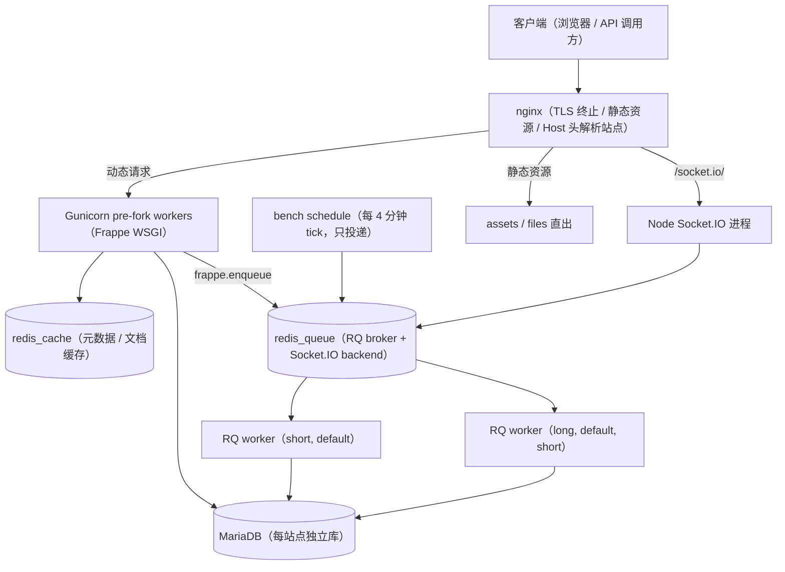
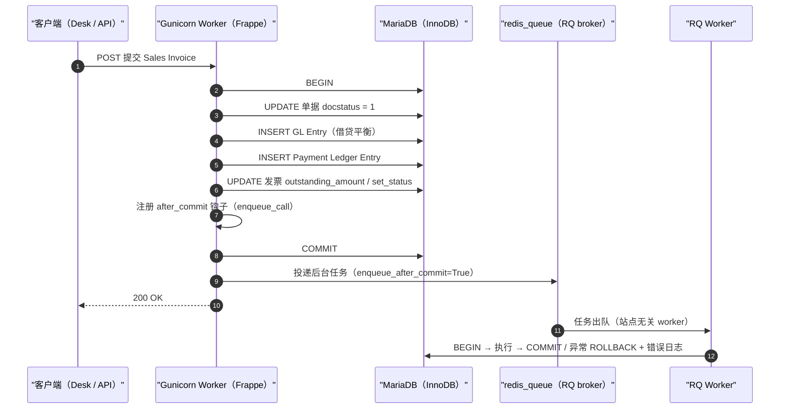
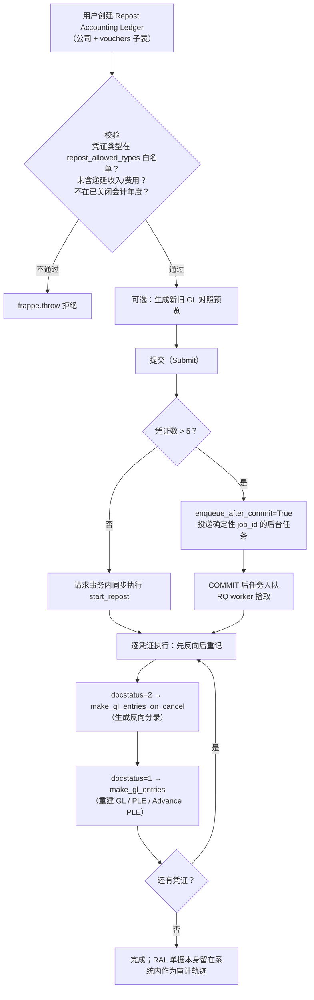
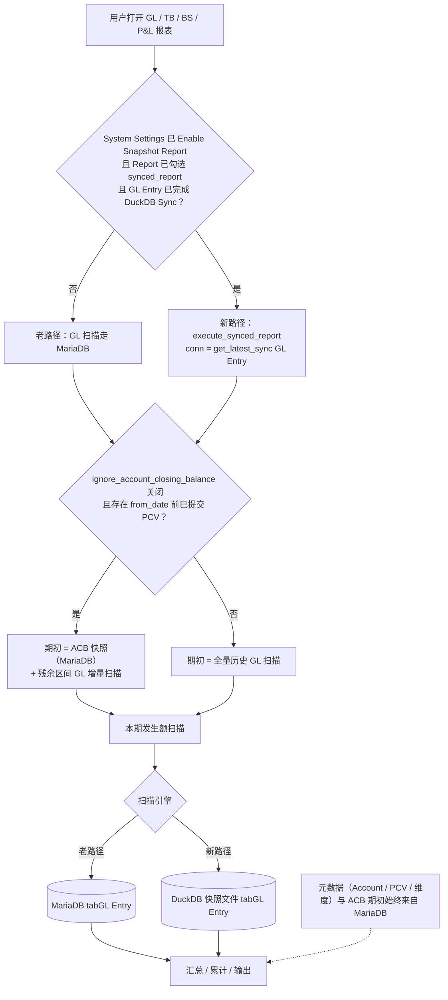

# 第 4 章 架构与高可用设计（宏观）

第 3 章回答了"ERPNext 的财务数据长什么样"——GL Entry、Payment Ledger Entry（PLE）、Account Closing Balance（ACB）三张台账表的字段结构。本章回答紧随其后的问题：**这些结构运行在一个什么样的系统里，又被哪些机制保护着不被写坏、不被重复、不被拖垮**。读者是 NestJS/Prisma 背景的全栈工程师，因此本章不做 Python 源码精读，所有机制均以"字段 + 流程图 + 伪代码级描述"表达；每个机制只写"是什么 → 为什么这样设计"，是否值得搬进自研系统的判断统一留给第 5 章。

调研基准：ERPNext v16 / Frappe Framework v16（2026-01-12 正式发布，调研时补丁版本约 v16.28），GitHub 引用分支 `version-16`，访问日期 2026-07-28。凡官方文档页与 v16 代码不一致处，以代码为准并显式标注。

## 4.1 运行时架构

### 4.1.1 请求生命周期：nginx → Gunicorn → MariaDB

Frappe 是一个同步 WSGI Python Web 应用。生产环境的标准拓扑是：nginx 做反向代理——负责 TLS 终止、静态资源直出、把 `/socket.io/` 路径转发给独立的 Node 进程、按 Host 头解析站点并注入站点名请求头；其余请求转发给 Gunicorn（pre-fork worker 模型）托管的 Frappe WSGI 应用。开发环境则用 Werkzeug 自带服务器（`bench start` / `bench serve`），官方文档明确"生产环境由 Bench 自动配置 Gunicorn"[^1^][^2^]。

请求进入应用后的生命周期是固定的：初始化站点上下文并建立数据库连接、开启事务 → 会话校验（失败则降级为 Guest）→ 按路径分流（`/api/` 走 REST handler，`/private/files/` 走下载，其余走 Page Renderer 体系，由 Path Resolver 做路由解析后逐个渲染器询问 `can_render`）→ 响应阶段收尾事务：无异常则提交，有异常则回滚[^3^][^4^]。这个"请求边界即事务边界"的模型是 4.3.1 节财务一致性的地基，此处先记住结论：**Web 写请求有写入则在请求成功结束时统一 COMMIT，任何未捕获异常触发整体 ROLLBACK，GET 请求不隐式提交**[^4^]。

为什么这样设计。同步 WSGI + pre-fork 多进程与"单请求单数据库事务"天然匹配：每个 worker 进程持有独立连接，不需要异步运行时即可靠加 worker 水平扩展。nginx 前置把 TLS、静态文件、WebSocket 这些 IO 密集型工作从 Python 进程剥离；而站点解析前置到 nginx 层（Host 头 → 站点名），是"一套代码托管多站点"这一多租户模型（见 4.1.5）的前提。

### 4.1.2 Redis 的三个角色

一个 bench 通常配置两个 Redis 端点：`redis_cache` 与 `redis_queue`[^5^]。Redis 在这套架构里一份三用：

| 角色 | 端点 | 承载内容 | 丢失后果 |
|---|---|---|---|
| 缓存 | `redis_cache` | 站点配置、文档、DocType 元数据缓存（v16 已换 lock-free 实现） | 可重建，仅性能回退 |
| 任务队列 broker | `redis_queue` | RQ（Redis Queue）任务：`frappe.enqueue` 把函数签名与参数序列化进 Redis | 丢失即丢任务 |
| 实时通道后端 | 同 `redis_queue` | Socket.IO 的 pub/sub backend | 实时推送中断 |

实时通道一项需要展开：Socket.IO 服务器是一个与主 Web 服务器并行的独立 Node 进程（`node apps/frappe/socketio.js`），因为同步 WSGI 栈不适合长连接[^6^]。自 v15 起，原先独立的 `redis_socketio` 实例与 `redis_queue` 合并，队列 Redis 同时充当 Socket.IO backend；frappe_docker 的 configurator 至今仍把 `redis_socketio` 指向 `REDIS_QUEUE` 以保持向后兼容[^7^][^5^]。

为什么这样设计。把缓存、队列、实时消息收敛到一种中间件，降低了小型部署的运维单元数；同时又按端点拆成两个实例做故障隔离——缓存可丢、队列不可丢，二者可用性等级不同。实时通道交给 Node 而非 Python，是典型的"用对的工具做 IO 模型不同的工作"。

### 4.1.3 后台任务体系：RQ 队列与 worker

Frappe 基于 Python RQ 实现后台任务。开发者用 `frappe.enqueue(method, queue=..., timeout=..., enqueue_after_commit=..., job_id=..., deduplicate=..., **kwargs)` 投递任务，`method` 可以是可调用对象或点分模块路径字符串[^8^]。框架内置三条队列：

| 队列 | 默认超时 | 典型任务 |
|---|---|---|
| `short` | 300 秒 | 邮件、通知、轻量回调 |
| `default` | 300 秒 | 常规后台任务 |
| `long` | 1500 秒 | 报表生成、数据导入、重过账 |

自定义队列及其 worker 数可在 `common_site_config.json` 的 `workers` 配置中声明[^8^]。Worker 是站点无关的长驻进程：从 Redis 取到任务后初始化站点上下文 → 建连开事务 → 执行 → 成功提交、异常回滚并写错误日志[^2^]。大单据的提交动作本身也可以队列化：`doc.queue_action('submit'|'save'|'cancel')` 把保存/提交/取消搬进后台执行[^9^]。

为什么这样设计。三条队列按任务时长分级，是单 broker 下最便宜的 QoS——防止长任务（报表、导入、重过账）饿死短任务（邮件、通知）。"调度器只投递、worker 执行"（见下节）与"worker 站点无关"两条合在一起，意味着一份 worker 池服务 bench 上所有站点的所有任务类型，多租户下资源利用率最大化。`enqueue_after_commit` 参数解决的是经典的"事务内发消息"问题，因其直接构成财务一致性的一环，放到 4.3.1 节详述。

### 4.1.4 调度器：只投递、不执行

调度由两层组成。第一层是一个长驻 scheduler 进程（`bench schedule`）：v16 起每 4 分钟唤醒一次（v15 及以前是 1 分钟，降频是为了减少空转；任务触发时间同时对齐到整分钟刻度），遍历 bench 上所有站点，把到期的定时任务投递进 RQ 队列[^10^][^11^]。第二层是站点数据库中的 Scheduled Job Type 文档：每个任务的频率（hourly/daily/weekly/monthly 及其 `_long` 变体）或 croniter 可解析的 cron 表达式以文档形式存储，app 在 `hooks.py` 的 `scheduler_events` 中声明方法[^12^]。多站点间的调度协调使用文件锁（`sites/<site>/locks`）[^2^]。

为什么这样设计。"调度器只投递、worker 执行"意味着定时任务与即时任务共享同一执行池、同一套事务与重试语义，不需要第二套运行时。把调度定义存成数据库文档而非纯配置文件，则让 Desk 用户可以启停任务、查看上次运行状态——调度本身也成了元数据驱动的一部分（见 4.2）。财务侧的多个重活都挂在这套调度上：重过账任务处理、自动核销作业（默认每 15 分钟拾取队列中文档）、v16 新增的每周自动重过账错误估值分录，全部是 Scheduled Job 的实例。

### 4.1.5 bench / site 多租户模型

Frappe 的部署单元是 **bench**：一个目录 + 一个 Python virtualenv + 一套 apps 代码 + 自己的 web/redis/node 进程[^13^]。一个 bench 可托管多个 **site**，每个 site 是独立租户——官方定义："Frappe is a multitenant platform and each tenant is called a site. A site has its own database."[^14^] 每个 site 拥有独立数据库、独立 `site_config.json`、独立公私文件目录与备份；所有 site 共享 bench 级的 apps 代码与 `common_site_config.json`。多站点路由有两种模式：端口多租户（每站一个端口）与 DNS 多租户（按 Host 头自动分发，nginx 配置由 bench 生成）[^15^]。

为什么这样设计。"代码共享、数据隔离"是 SaaS 化 ERP 的最简形态：升级一次代码，`bench migrate` 逐站执行 schema migration 即可滚动全部租户；而库级隔离让备份、恢复、删除、导出、迁移租户都是数据库级原语操作，不存在行级租户过滤的一致性风险。代价是每个租户一套全量表（数百张），库数量随租户线性增长。这个模型同时解释了 4.1.2 中 worker 为何要做成站点无关——这是多租户资源复用的必然结果。

综合 4.1.1–4.1.5，生产环境的完整运行时拓扑如下：



这张图有两个值得读者停留的结构特征。其一，**有状态组件只有三个**：MariaDB、两个 Redis 端点，再加一个共享文件卷（站点文件/私有文件/日志）；web、worker、scheduler、socketio 全部无状态，可独立扩缩——4.5.1 节的容器拓扑正是这张图的一比一投影。其二，**所有写路径最终都收敛到 MariaDB**：Web 请求与后台 worker 共用同一个数据库、同一套事务语义，Redis 只承载"易失"的协调状态（缓存、队列、pub/sub），从不承载财务事实。这一"事实唯一落点"的拓扑选择，是 4.3 节所有一致性机制能够成立的基础设施前提。

## 4.2 元数据驱动架构

### 4.2.1 DocType：一份元数据同时是 Model 和 View

Frappe 的核心抽象是 **DocType**：一份元数据（JSON 声明 + 数据库中的 Meta 记录）同时描述数据模型与视图。官方文档的表述是："A DocType … describes the Model and the View of your data"，且"Meta-data is a first class citizen in Frappe"[^16^][^17^]。创建一份 DocType，框架自动生成以下全套产物：

| 产物 | 生成物 | 对应 TS 栈中的手写部分 |
|---|---|---|
| 数据库表 | `tab<DocType>` 表及字段索引 | Prisma schema + migration |
| ORM 模型 | Document 基类 + controller hooks（validate / on_submit / on_cancel…） | NestJS entity + service |
| Desk 视图 | 列表视图、表单视图、打印格式骨架 | React 列表页 + 表单页 |
| 权限矩阵 | 按角色 × 操作（read/write/submit/cancel…）的声明式权限 | CASL / guard 代码 |
| API | 开箱即用的 REST（`/api/resource/:doctype`）与 RPC | controller + DTO |

更关键的是"DocType is also a DocType"——元数据本身以文档形式存在数据库里、可运行时修改[^17^]。这支撑了三层运行时定制：Custom Field（加字段）、Property Setter（改字段属性）、Customize Form（改表单布局），全部不改代码、随站点数据迁移；在此之上还有 Web Form、Report、Workflow 等二级元数据。所有 DocType 自动获得 REST API[^18^]。

### 4.2.2 官方的设计动机与结构性后果

官方对"为什么"的回答非常直接："The core philosophy at Frappe is write as less code as possible. We prefer configuration over code."[^19^] 这句话需要放在 ERP 品类的核心矛盾里读：**标准化流程 vs 每个客户都要改**。科目表、税则、单据字段、审批流、打印格式、本地化报表，千家千面。元数据驱动把这些差异从"代码分支"降级为"数据配置"：实施顾问在 Desk 里加字段、改权限、配工作流即可交付，定制以数据形式存在，升级代码时不会被 patch 冲突反噬。

这就是"对千企 ERP 的意义"所在：ERPNext 能以一个小团队维护数千个功能、并支撑印度 GST 这类强本地化需求，靠的不是工程师数量，而是把"每家企业都不一样"这件事的边际成本压到接近零——定制不再是研发活动，而是实施活动。第 3 章看到的财务对象本身就是这套机制的极端示例：GL Entry 的权限矩阵中所有角色只有 read/report/export，没有任何 write/delete 权限，"台账只能由系统过账写入"这条铁律不是写在业务代码里的约定，而是写在元数据里的强制约束；冻结日期、重过账白名单、账龄分桶等财务配置，也全部是 Accounts Settings / Company 这类 Single 或 DocType 文档上的字段。

代价同样结构性：类型安全与编译期检查让位于运行时灵活性（没有 TypeScript 式的静态保证，错误在运行时暴露）；框架复杂度集中在 Meta 解析与 migration 层；每次请求都要解析 Meta、加载表单定义、做权限检查，CPU 热点正是由这份灵活性换来的——4.4.1 节会看到，v16 的性能工作几乎全部围绕这条 Meta 加载路径展开。元数据驱动架构是理解 ERPNext 其余所有设计（缓存分层、性能优化、部署形态）的原点。

## 4.3 财务一致性机制

这一节是本章的核心。ERPNext 的财务一致性不是靠某一个"大锁"或某一个"强一致中间件"实现的，而是由五层机制叠加：事务边界（什么操作是原子的）、不可变台账（历史怎么改）、异步重过账（不得不改历史时怎么办）、时间闸门（哪些时段禁止触碰）、幂等防线（重复与并发怎么挡）。逐层展开。

### 4.3.1 提交事务边界与 `enqueue_after_commit`

**是什么。** Frappe 的事务模型是"执行上下文 = 事务边界"：Web 写请求（POST/PUT，含 `frappe.call` 的 AJAX）若有数据库写入，在请求成功结束时统一 COMMIT；任何未捕获异常触发整体 ROLLBACK；GET 不隐式提交。后台任务与定时任务同样"成功提交、异常回滚"，patch 亦然[^4^]。由此得到一个对财务至关重要的推论：一次单据 submit——单据 `docstatus` 置 1、GL Entry 写入、PLE 写入、关联单据 `outstanding_amount` 回写——天然落在同一个 MariaDB/InnoDB 事务里，要么全部可见，要么全部回滚。业务代码无需显式管理事务。

v15 起框架提供事务钩子 `frappe.db.before_commit / after_commit / before_rollback / after_rollback`，用于协调事务外副作用[^4^]。后台任务投递正是其头号用户：`frappe.enqueue(..., enqueue_after_commit=True)` 会把"投递"动作注册进 `after_commit` 钩子，待事务真正提交后才把任务推入 Redis[^20^]。v16 源码中的实现即一行钩子注册：`if enqueue_after_commit: frappe.db.after_commit.add(enqueue_call)`[^20^]。

**为什么这样设计。** 财务系统的第一性要求是"单据与其台账原子一致"——不能出现发票已提交但 GL 没写、或 GL 写了但发票还是草稿的中间态。把事务边界绑定到请求/job 边界，让正确性成为默认路径而非开发者自觉。`enqueue_after_commit` 解决的是经典的"事务内发消息"问题：若在提交前把任务推入队列，worker 可能在数据可见前就消费它（读到幻影），或事务回滚后任务仍在队列里执行不存在的数据；推迟到 after_commit 投递，保证"先落库、后通知"。代价是单请求内的工作必须足够快，重型操作被迫拆到后台 job——这反过来塑造了整个系统"重操作一律队列化"的架构惯性，4.3.3 的 RAL 和 4.4 节的关账后台化都是这一惯性的产物。

一次发票提交及其后台副作用的完整时序如下：



图中步骤 6–8 是整条链路的关键：通知队列的动作被严格钉在 COMMIT 之后、响应返回之前。注意 worker 侧（步骤 10–11）是一个**全新的独立事务**——后台任务与原始请求之间没有事务连续性，一致性靠"任务一定在数据提交后才存在"来保证，而不是靠分布式事务。这正是最终一致性在 ERPNext 里的标准形态。

### 4.3.2 不可变台账与 Cancel 反向分录

**是什么。** 单据生命周期由 **docstatus** 状态机约束：0=Draft、1=Submitted、2=Cancelled；Submitted 与 Cancelled 状态不可编辑（个别字段可用 Allow on Submit 放行）[^21^]。v13 起 ERPNext 引入 **Immutable Ledger**（不可变台账）：取消单据时不再删除 GL Entry，而是在取消日期写入**反向分录**（reverse entries，借贷互换）冲销原分录；已提交/已取消单据及其台账永不可删除[^22^]。GL Entry / PLE / Account Closing Balance 三个台账 DocType 的权限矩阵中没有任何角色拥有 create/write/delete/submit/cancel 权限，从元数据层面封死手工改台账的通道。

不可变模式由 Accounts Settings 的 `enable_immutable_ledger` 控制，两种取消模式的行为差异如下[^23^][^24^]：

| 维度 | 不可变模式 ON | 不可变模式 OFF（传统） |
|---|---|---|
| 原 GL 行 | 不动（不设 `is_cancelled`） | 打标 `is_cancelled = 1` |
| 反向分录 `posting_date` | **取消当日**（"cancellation entries will be posted on the actual cancellation date"） | 沿用原过账日，remarks 标注 "On cancellation of …" |
| 报表口径 | 正反两行都计入，净效果为零，历史不动 | 默认过滤 cancelled 行 |
| PLE 侧对应 | 插入新 PLE 行（posting_date 取当日） | 原 PLE 行 `delinked = 1` 脱链但保留 |

官方给出的三条不可变理由值得原文引用：重过账未来分录计算昂贵；库存 FIFO 估值序列被改写会扰动后续期间的估值与利润；已申报税期的税额可能事后变化[^22^]。此外 Accounts Settings 留有 `delete_linked_ledger_entries` 开关，开启后删除**已取消**单据时可物理清理其台账——该开关默认关闭且不影响已提交单据，属于"回收单据编号"的实用主义例外，不动摇"提交后不可改"的原则[^24^]。

**为什么这样设计。** 删除式取消破坏审计轨迹，且背日改写会让"已对外披露的报表"变成移动靶。反向分录把"纠错"变成新的记账事实，台账由此成为 append-only 的事件流——这等价于会计领域的 event sourcing：任何时点的余额都是分录序列的折叠，历史不可篡改。对读者更重要的一层是：不可变性不是洁癖，而是审计、幂等、并发安全的共同解——任何时点的余额 = 截至该时点的行聚合，无需加锁重写后续行。

### 4.3.3 Repost Accounting Ledger：背日补单的异步重过账

**这是本章的招牌机制。** 不可变台账解决"不能改"，但业务上仍存在"必须修正已提交单据的台账"的场景：科目配错、核算维度配错、背日补录单据导致后续台账口径失真。ERPNext 的答案是 **Repost Accounting Ledger（RAL，重过账会计台账）**——一个可提交的 DocType，核心思想是：**修正以"新的事实"形式追加，由后台 worker 异步重算受影响台账，且重过账动作本身留下审计单据**。

**触发与使用方式。** 用户在 RAL 中选择公司 + 一组凭证（voucher 子表），凭证类型受 Accounts Settings 的 `repost_allowed_types` 白名单约束；提交前可生成新旧 GL 对照预览[^25^]。库存侧有同构机制 Repost Item Valuation（RIV）：背日库存交易保存时系统自动创建 RIV 文档，由定时任务后台重算 Stock Ledger 的 running balance 与估值；v16 还新增了每周自动重过账错误估值分录的选项（Stock Reposting Settings，基于 Stock Ledger Variance 与 Stock and Account Value Comparison 两张对账报表发现差异）[^26^][^27^]。

**阈值与执行语义。** v16 源码 `repost_accounting_ledger.py` 的 `on_submit` 写得非常直白：凭证数 **> 5** 时以 `enqueue_after_commit=True` 投递后台任务（`start_repost`），否则同步执行[^25^]。单张凭证的重过账逻辑是"先反向、后重记"：

```text
对每张凭证：
  if not delete_cancelled_entries:
      doc.docstatus = 2
      doc.make_gl_entries_on_cancel(from_repost=True)   # 先生成反向分录
      doc.docstatus = 1
  else:
      直接删除旧分录
  doc.make_gl_entries()                                  # 重新生成 GL / PLE / Advance PLE
```

**禁区。** RAL 有硬校验：禁止重过账**已关闭会计年度**（Period Closing Voucher 之后）的凭证——源码中比对最新 PCV 与凭证日期，越界即 `frappe.throw("Cannot Resubmit Ledger entries for vouchers in Closed fiscal year.")`[^25^]；同时禁止含递延收入/费用的发票走 RAL。库存侧另有并发保护：存在 In Progress/Queued 的重过账任务时，相关单据禁止取消。



这张图把 RAL 的三个设计决策可视化了。第一，**5 张凭证的阈值**是 4.3.1 节"请求事务不能太重"的直接推论：重过账每张凭证都要重写台账，同步执行打爆请求事务，所以超过阈值就走队列——且投递用 `enqueue_after_commit`，保证 worker 不会在 RAL 单据本身尚未提交时开始干活。第二，**"先反向后重记"而非"原地 UPDATE"** 与 4.3.2 的不可变原则同构：旧分录以反向分录冲销（或可选删除），新分录重新生成，台账上留下完整的"纠错事实"。第三，**已关闭年度是禁区**：RAL 把一致性边界划在 PCV 上，已结账历史只允许通过新凭证调整，不允许重算——这与下一节的时间闸门互为表里。

**为什么这样设计。** RAL 承认两个现实：其一，台账重算是 O（受影响分录数） 的重活，必须队列化；其二，修正不应伪装成"什么都没发生过"——RAL 本身是可审计的提交单据。它把"最终一致性"显式产品化：提交时系统先保证单据层正确，台账层通过后台 job 收敛到正确状态，并配套对账报表作为收敛验证工具。用一句话概括其一致性哲学：**业务时间锚点（已关账期）之前的真相不可触碰，锚点之后的偏差允许"先提交、队列追平"**。这是高并发 ERP 拆掉长事务的关键取舍。

### 4.3.4 三级时间闸门：会计期间 / PCV / 冻结日期

ERPNext 用三道口径不同的时间闸门，把"哪些时段的账不许动"做成递进式防线。三级均为 GL 层硬阻断，在 `make_gl_entries` / `make_reverse_gl_entries` 路径上执行[^23^]：

| 闸门 | 配置位置（v16） | 阻断语义 | 业务场景 |
|---|---|---|---|
| 会计期间（Accounting Period） | Accounting Period 文档（公司 + 起止日期） | closed period 内不能创建或取消任何会计分录 | 月中/季中临时封账，粒度最灵活 |
| PCV 关闭（Period Closing Voucher） | PCV 提交即生效（`period_end_date`） | `posting_date ≤ 已关闭期末` 的新增/修改一律拒绝："Books have been closed till the period ending on …"；且 Opening Entry 永久禁用；RAL 同步禁入 | 年末结账，损益已结转，最硬的一级 |
| 冻结日期（Freezing Date） | **Company 文档** `accounts_frozen_till_date` + `role_allowed_for_frozen_entries` | 过账日 ≤ 冻结日时，仅持指定角色的用户可建/改分录；Administrator 也不放行 | 报税/审计期间的软性封账，留有特权通道 |

三级之外还有一道**科目级冻结**作补充：`Account.freeze_account = Yes` 时，仅持 `role_allowed_for_frozen_entries` 角色者可对该科目记账[^28^]。

**⚠️ v16 重大变更（文档滞后）**：冻结日期设置在 v15 及官方文档页中位于 Accounts Settings（`acc_frozen_upto` / `frozen_accounts_modifier`）；v16 已迁移到 **Company** 单据（逐公司配置），迁移由 patch `migrate_account_freezing_settings_to_company.py` 完成，运行时代码 `check_freezing_date` 读 Company 字段确认已生效[^29^][^30^]。官方 Freeze Accounting Entries 文档页截图仍为旧位置[^31^]，读者按 v16 实操时应到 **设置 > Company > 对应公司** 下配置。

**为什么这样设计。** 三级闸门粒度递进：Accounting Period 是"任意区间的临时封条"，PCV 是"年度级的永久封条"，冻结日期是"带特权通道的半封条"。财务结账的现实节奏——先冻结日常录入让报表稳定下来、审计调整走特权角色、最后 PCV 一锤定音——被直接建模成了三级机制而非一个布尔开关。同时它们共同构成 4.3.3 节所说的"业务时间锚点"：RAL 重过账、背日补单、取消单据，全部以这些闸门为边界。

### 4.3.5 幂等防线：docstatus / 命名 / job_id

财务写入的重复成本远高于一般业务数据，ERPNext 把防重下沉到框架基元，形成五道防线：

| 防线 | 机制 | 挡住的故障 |
|---|---|---|
| 状态机 | docstatus 三态迁移：已提交单据不可再提交、不可编辑 | 重复提交、提交后篡改 |
| 命名唯一性 | 主键 `name` 全局唯一；财务单据用 Naming Series（如 `ACC-SINV-2026-00001`），序列计数在库内维护，重试不产生重号 | 网络重试产生重复单据 |
| 业务唯一性 | Accounts Settings 供应商发票号唯一检查等 | 业务层面的重复录入 |
| 队列去重 | `enqueue(job_id=..., deduplicate=True)`，job 键为 `{site}\|\|{job_id}`；RAL 等重活用确定性 job_id（`repost_accounting_ledger_<docname>`） | 队列"至少一次投递"语义下的重复执行 |
| 并发重算互斥 | 存在 In Progress/Queued 重过账任务时禁止取消相关库存单据 | 重算与取消的竞态 |

两处细节值得读者注意。其一，命名方式共 9 种（手工、自增、字段、Naming Series、表达式、随机、UUID、脚本等），其中 `Autoincrement` 官方明确"not gap-safe"——删除的编号不会回填[^32^]；财务单据因此用 Naming Series 而非裸自增，序列本身成为审计线索。其二，队列去重的本质是把分布式队列"至少一次投递"的语义补偿为"逻辑上一次执行"：确定性 job_id 让同一重过账请求重复投递时自然幂等[^20^]。

**为什么这样设计。** 防重没有依赖业务模块自觉，而是压进框架基元（状态机、主键命名、队列 job_id）。状态机 + 唯一命名把"重复提交"从运行时错误变为结构上不可能；队列层确定性 job_id 则兜底了异步侧。五道防线与 4.3.1 的事务边界合起来，构成"同步侧原子、异步侧幂等"的完整防重体系。

## 4.4 性能与规模

### 4.4.1 v16 性能架构（社区称 "Caffeine" ⚠️待验证一手出处）

**是什么。** 官方对 v16 性能的总口径是"多数负载最高约 2x 提速"[^33^]。这一代性能工作在技术社区与多发布渠道常被称为 "Caffeine"，⚠️但该代号未在官方博客正文中找到一手出处，仅见于二手报道，本章正文仅作背景说明、不作版本归属依据。具体技术项均出自 v16.0.0-beta.1 官方 release notes[^10^]：

| 优化项 | 机制 | 官方口径（PR 号） |
|---|---|---|
| lock-free 内部缓存 | 替换框架内部缓存实现 | "reduces occasional freezes and time-outs when the site is busy"（#32082） |
| 元数据/表单加载瘦身 | 准备 DocType 信息时跳过缓存数据与未用元数据 | 表单打开时间内部测试降约 70%（#33045） |
| 文档加载查询简化 | 更简单的数据库查询 | 记录打开最快 75%（#28789） |
| 更短 UUID | 记录名支持更短唯一 ID | 减少库存储、加快批量创建（#25730） |
| 调度降频 | scheduler tick 1 分钟 → 4 分钟，任务对齐整分钟 | 减少空转（#26657） |
| worker 开销 | 控制消息检查间隔 0.2s → 2s；可选同进程执行免 fork | #28957 / #31283 |
| RQ 升级 | 后台任务引擎升级 RQ 2.x | #31141 |
| 列表/报表 | 记录数 >1000 时缓存计数 30 分钟；"Load More" 只取增量 | #29871 / #25081 |

**为什么这样设计。** v16 的性能工作几乎全部围绕元数据驱动架构的固有成本展开——4.2 节换来灵活性的机制（每请求解析 Meta、加载表单、权限检查）正是 CPU 热点。优化手法可归三类：把可缓存的移出热路径（更多层级缓存、lock-free 消除并发瓶颈）、削减每请求重复计算（Meta 瘦身、查询简化）、降低后台空转（调度/worker 降频）。短 UUID 则是用存储与索引体积换插入与 join 速度。对读者的关键认知是：**元数据驱动的灵活性是有账单的，v16 这份性能清单就是账单明细**。

### 4.4.2 财报提速：DuckDB 快照 + ACB 期初快照叠加

本节按核实后的统一口径陈述：**v16.28 的财报提速 = DuckDB 快照报表（新路径）+ ACB 期初快照（v14 起既有机制），两者叠加共存，不是二选一**。

**DuckDB 快照报表（本次提速的真实来源）。** ERPNext v16.28.0 的 release note 写道：General Ledger、Trial Balance、Balance Sheet、Profit and Loss 四张报表"now use a faster data source on supported sites"[^27^]。该条目对应的 PR #57098 是 PR #56304「faster (synced) financial statements using duckdb」的 v16 自动 backport（2026-07-13 合入 `version-16-hotfix`）[^36^][^34^]。机制分两层：

- **框架层**（frappe/frappe#40177，同日经 #40795 backport 到 v16）：框架获得 DuckDB（嵌入式 OLAP 引擎）读写能力；每个 DocType 同步为独立的 DuckDB 文件；连接按需显式打开；Report 主档勾选 `synced_report` 后，执行分发到报表模块的 `execute_synced_report`，否则走原 MariaDB 路径[^35^]。
- **ERPNext 层**（#56304）：四张报表新增 `execute_synced_report` 实现，以 `get_latest_sync("GL Entry")` 取得最近一次 DuckDB Sync 的连接，GL Entry 明细/发生额改从 DuckDB 快照读取；四张报表的 Report JSON 均配置 `doctype_to_sync: GL Entry`，默认关闭[^34^][^39^]。

启用路径（按钮级）：**System Settings → Advanced 打开 "Enable Snapshot Report"** → 在具体报表的 Report 主档上启用 "Snapshot Report" 并指定要同步的 DocType → 完成 DuckDB Sync 后报表页出现 banner，标识当前是 synced（快照）还是 normal（实时）模式[^35^]。

**ACB 期初快照（v14 起的既有机制，非本次提速原因）。** Account Closing Balance 把每次 Period Closing Voucher 结账时点的"科目 × 维度"累计借贷快照下来（增量滚动聚合），报表以最近一次已提交 PCV 的 ACB 快照充当期初余额，只扫描 PCV 结束日之后的增量 GL。证据链：ACB 的 DocType 文件在 v13 分支不存在、v14 分支存在，即自 v14 引入[^37^]；v15 分支的 `financial_statements.py` 与 `trial_balance.py` 已含与 v16 相同的 ACB 期初逻辑与 `ignore_account_closing_balance` 回退开关（PCV 未逐年齐全时需打开该开关，回退为全量 GL 扫描）[^38^]。

**叠加方式（关键细节）。** DuckDB 只替换 GL Entry 的**扫描引擎**（MariaDB → DuckDB 快照文件），并没有把 ACB 同步进 DuckDB：新路径下**期初仍从 MariaDB 读 ACB 快照**，PCV 结束日至 `from_date` 的残余区间再扫 DuckDB 的 GL Entry；Account、PCV、维度等元数据始终来自 MariaDB[^39^]：



用一句话读这张图：**ACB 减少的是"要扫多少历史行"，DuckDB 更换的是"用什么引擎扫"**——前者是数据量维度的优化，后者是执行引擎维度的优化，两者正交，在同一查询中叠加生效。

**AR/AP 报表未被覆盖。** release note 只列四张报表属实。PR #56304 顺带修改了 AR/AP 的 Report JSON——预置了 `doctype_to_sync: Payment Ledger Entry`——但**没有**给 AR/AP 的 Python 代码新增 `execute_synced_report`；按框架分发逻辑（模块缺该方法则返回空结果），AR/AP 即使勾选也不会得到提速结果。截至 2026-07-28，develop 分支 `accounts_receivable.py` 中无任何 `execute_synced_report`/`duckdb` 字样[^40^]。AR/AP 报表仍基于 PLE 实时聚合，v16 仅有取数层调优（Accounts Settings 的 `receivable_payable_fetch_method`：Buffered/UnBuffered Cursor 等）。⚠️待验证：JSON 预置 PLE 同步配置暗示官方路线图中 AR/AP 将基于 PLE 快照提速，但无官方声明佐证，本章不作定论。

**为什么这样设计。** MariaDB 是行存 OLTP，GL Entry 千万行级的多维聚合（科目 × 维度 × 期间 × 公司）天然吃力；DuckDB 列存向量化执行正是为即席聚合设计。"按 DocType 同步到独立 DuckDB 文件"相当于在应用内部维护了一个近实时 OLAP 投影（CQRS 读侧），OLTP 写入路径零改动；一致性上以快照/实时 banner 显式告知用户数据新鲜度，把最终一致性做成可见的产品语义。而 AR/AP 被刻意绕开的原因在粒度层面更清晰：账龄需要**单据级未清明细**（每张发票落在哪个账龄桶），科目级余额快照丢失单据粒度——**报表粒度决定预聚合可行性**，科目级余额可快照，单据级敞口必须实时。

### 4.4.3 GL 大数据量组合策略

台账 append-only 意味着表只涨不缩。ERPNext 应对 GL/PLE 膨胀的手段是"索引 + 预聚合 + OLAP 卸载 + 归档清理"的组合拳，没有任何单一银弹：

| 层 | 手段 | 机制 | 服务的读路径 |
|---|---|---|---|
| 索引 | GL Entry 多字段 search_index | `posting_date`、`account`、`party_type`/`party`、`cost_center`、`against_voucher`、`voucher_no`、`company` 等建索引[^42^] | 报表过滤、单据追溯 |
| 预聚合（小台账） | Payment Ledger Entry | 应收应付从 GL 拆出独立窄表，AR/AP 报表与对账只扫 PLE[^41^] | 账龄、未清、核销 |
| 预聚合（余额快照） | Account Closing Balance | PCV 结账时滚动累计快照（v14 起）[^37^] | TB/BS/P&L 期初 |
| OLAP 卸载 | DuckDB 快照报表 | GL Entry 按 DocType 同步为独立 DuckDB 文件（v16.28）[^34^] | GL/TB/BS/P&L 即席分析 |
| 归档/清理 | `bench trim-tables` / `transform-database` | 清理日志类大表；切换存储引擎/ROW_FORMAT（如高写低读日志表转 MyISAM）[^43^] | 运维侧控体积 |

⚠️待验证：官方是否对 GL Entry 使用 MariaDB 分区（PARTITION BY）——未在官方文档与源码中找到证据，结论倾向"官方策略是索引 + 预聚合 + 快照，而非分区"。

**为什么这样设计。** 这是用"多个专用读模型"替代"一个全能大表"的典型 CQRS 思路：面向操作的查询（对账、催收）走小台账 PLE；面向期间的报表走期末余额快照 ACB；面向即席分析的重报表卸载到列存引擎。把 4.3 节与 4.4 节合起来看，会发现二者互为表里：**写路径用事务与不可变台账保证一致，读路径按代价分级——字段冗余（`outstanding_amount`，毫秒）→ 窄表实时聚合（PLE，秒级）→ 快照预聚合（ACB，常数）→ OLAP 卸载（DuckDB，大数据）**。单据层 → 台账层 → 投影层，三层形态构成了这套 ERP 账务系统的普适骨架。

## 4.5 部署形态

### 4.5.1 frappe_docker 容器拓扑

官方 frappe_docker 的基准 `compose.yaml` 把一个 ERPNext 部署拆为 7 个服务（数据库与 Redis 为外部服务，以 `DB_HOST` / `REDIS_CACHE` / `REDIS_QUEUE` 环境变量注入）[^5^]：

| 服务 | 角色 | 命令/要点 |
|---|---|---|
| `configurator` | 一次性初始化：生成 `sites/apps.txt`、写入全局配置 | bash，执行完退出 |
| `backend` | Gunicorn WSGI | `GUNICORN_WORKERS` 默认 2、threads 4、timeout 120s |
| `frontend` | nginx | 反代 `backend:8000` 与 `websocket:9000`，直出静态资源，按 `$$host` 头解析站点 |
| `websocket` | Node Socket.IO | `node apps/frappe/socketio.js` |
| `queue-short` | RQ worker | `bench worker --queue short,default` |
| `queue-long` | RQ worker | `bench worker --queue long,default,short` |
| `scheduler` | 定时任务投递 | `bench schedule` |

`sites` 卷在 backend/worker/scheduler/frontend 间共享（站点文件、私有文件、日志）；`backend`、`queue-*`、`scheduler` 均可用 compose/K8s 副本数独立水平扩展。该拓扑把 4.1 节的进程模型一比一容器化：无状态层随意扩缩，状态收敛到外部 MariaDB、两个 Redis 端点与共享卷。`queue-short` 与 `queue-long` 分容器，正是队列分级在部署层的投影——长任务（如 RAL 重过账、关账后台作业）扩容不影响短任务延迟。

### 4.5.2 读副本与读写分离

Frappe 原生支持读副本：在 `site_config.json` 配置 `read_from_replica`、`replica_host`、`replica_db_name` 等键后，读操作走副本、写操作走主库（前提是已搭好 MariaDB 主从）[^44^]。为什么这样设计：ERP 负载读多写少，读写分离用最小代码侵入把最重的读流量挪走，且按站点（租户）粒度配置，与多租户模型正交。但要注意张力：GL 报表要求读到刚提交的分录，副本延迟可能造成"提交了却查不到"；v16 的 DuckDB 快照报表可视为这一方向上的进一步卸载——与其让报表去打读副本，不如给报表一个专用的列存投影。

### 4.5.3 Frappe Cloud：Press + Agent 控制面

Frappe Cloud 由 **Press**（控制面）+ **Agent**（每台服务器上的 Flask agent，向 Press 暴露 CLI 接口以远程管理 bench/site）+ Docker + Ansible 构成；典型集群把应用服务器、数据库服务器分开，更复杂形态为每类服务器加冗余与网络集群；站点可在服务器间迁移[^45^]。为什么这样设计：Press/Agent 把 bench/site 模型变成了可编排的资源对象——bench 是版本化的运行时单元，site 是可迁移的数据单元，控制面负责调度与生命周期。对读者的意义在于，这套模型能成立的前提正是 4.1.5 的"库级隔离 + 无共享状态"：站点即数据库，迁移站点即迁移数据库，不需要应用层处理行级租户数据搬迁。

## 本章要点回顾

1. **运行时拓扑**：nginx → Gunicorn（同步 WSGI）→ MariaDB，Redis 一份三用（缓存 / RQ broker / Socket.IO 后端，v15 起后两者合并为一个实例），worker 站点无关，scheduler 只投递不执行（v16 tick 降为 4 分钟）；有状态组件只有 MariaDB、Redis 与共享卷。
2. **元数据驱动**：DocType 一份元数据生成表/ORM/视图/权限/REST API 全套，把"千企千面"的定制从代码分支降级为数据配置——这是 ERPNext 小团队服务千企的结构性答案，其成本（每请求 Meta 解析）则构成 v16 性能工作的主要靶子。
3. **事务边界**：执行上下文 = 事务边界，单据提交与其 GL/PLE 落账天然同事务；`enqueue_after_commit` 用 `after_commit` 钩子把队列投递钉在 COMMIT 之后，保证异步任务永远读不到未提交数据。
4. **不可变台账**：v13 起取消单据写反向分录而非删除，GL/PLE/ACB 权限矩阵无任何写权限；台账 append-only，任何时点余额 = 分录序列的折叠。
5. **RAL 重过账**：修正已提交单据台账的招牌机制——白名单约束凭证类型、>5 张凭证异步（`enqueue_after_commit`）、执行语义"先反向后重记"、已关闭会计年度为禁区；把最终一致性显式产品化。
6. **三级时间闸门 + 五道幂等防线**：Accounting Period / PCV / 冻结日期（v16 已迁至 Company，⚠️官方文档页滞后）构成递进封账；docstatus 状态机、Naming Series 唯一命名、业务唯一性校验、确定性 job_id 队列去重、重算互斥共同防重。
7. **财报提速口径**：v16.28 = DuckDB 快照（#56304 的 backport #57098，框架能力 frappe#40177）+ ACB 期初快照（v14 起）叠加——ACB 减行数、DuckDB 换引擎；AR/AP 未被覆盖，仍走 PLE 实时聚合。
8. **规模哲学**：写路径事务一致、读路径按代价分级（字段冗余 → PLE 窄表 → ACB 快照 → DuckDB OLAP）；单据层 → 台账层 → 投影层的三层形态贯穿全章。

## 本章来源

[^1^]: Background Services — Frappe Framework Docs — https://docs.frappe.io/framework/user/en/bench/resources/background-services（访问 2026-07-28）
[^2^]: How does the Frappe Framework work? — Gavin D'Souza（二手，作者为前 Frappe 工程师）— https://gavv.in/blog/how-does-frappe-work/（访问 2026-07-28）
[^3^]: Request Lifecycle (Routing and Rendering) — Frappe Framework Docs — https://docs.frappe.io/framework/user/en/python-api/routing-and-rendering（访问 2026-07-28）
[^4^]: Database API — Frappe Framework Docs — https://docs.frappe.io/framework/user/en/api/database（访问 2026-07-28）
[^5^]: frappe_docker README 与 compose.yaml — github.com/frappe/frappe_docker，main 分支 — https://github.com/frappe/frappe_docker（访问 2026-07-28）
[^6^]: Realtime (socket.io) — Frappe Framework Docs — https://docs.frappe.io/framework/user/en/api/realtime（访问 2026-07-28）
[^7^]: Migrating to version 15 — frappe/frappe Wiki — https://github.com/frappe/frappe/wiki/Migrating-to-version-15（访问 2026-07-28）
[^8^]: Background Jobs — Frappe Framework Docs — https://docs.frappe.io/framework/user/en/api/background_jobs（访问 2026-07-28）
[^9^]: Running Background Jobs — Frappe Framework Docs — https://docs.frappe.io/framework/user/en/guides/app-development/running-background-jobs（访问 2026-07-28）
[^10^]: Frappe Framework v16.0.0-beta.1 Release Notes — https://github.com/frappe/frappe/releases/tag/v16.0.0-beta.1（访问 2026-07-28）
[^11^]: frappe/utils/scheduler.py — frappe/frappe，分支 version-16 — https://raw.githubusercontent.com/frappe/frappe/version-16/frappe/utils/scheduler.py（访问 2026-07-28）
[^12^]: Hooks — Frappe Framework Docs — https://docs.frappe.io/framework/user/en/python-api/hooks（访问 2026-07-28）
[^13^]: Architecture — Frappe Framework Docs — https://docs.frappe.io/framework/user/en/architecture（访问 2026-07-28）
[^14^]: Sites — Frappe Framework Docs — https://docs.frappe.io/framework/user/en/basics/sites（访问 2026-07-28）
[^15^]: Setup Multitenancy — Frappe Framework Docs — https://docs.frappe.io/framework/user/en/bench/guides/setup-multitenancy（访问 2026-07-28）
[^16^]: What is Frappe Framework? — Frappe Framework Docs — https://docs.frappe.io/framework/user/en/basics（访问 2026-07-28）
[^17^]: Understanding DocTypes — Frappe Framework Docs — https://docs.frappe.io/framework/user/en/basics/doctypes（访问 2026-07-28）
[^18^]: REST API — Frappe Framework Docs — https://docs.frappe.io/framework/user/en/api/rest（访问 2026-07-28）
[^19^]: Why Frappe Framework? — Frappe Framework Docs — https://docs.frappe.io/framework/user/en/basics/why（访问 2026-07-28）
[^20^]: frappe/utils/background_jobs.py — frappe/frappe，分支 version-16 — https://raw.githubusercontent.com/frappe/frappe/version-16/frappe/utils/background_jobs.py（访问 2026-07-28）
[^21^]: Docstatus or Document Status — Frappe Framework Docs — https://docs.frappe.io/framework/doctypes/docstatus（访问 2026-07-28）
[^22^]: Immutable Ledger in ERPNext — ERPNext Docs — https://docs.frappe.io/erpnext/user/manual/en/immutable-ledger-in-erpnext（访问 2026-07-28）
[^23^]: erpnext/accounts/general_ledger.py（make_reverse_gl_entries / validate_against_pcv / check_freezing_date）— frappe/erpnext，分支 version-16 — https://github.com/frappe/erpnext/blob/version-16/erpnext/accounts/general_ledger.py（访问 2026-07-28）
[^24^]: accounts_settings.json — frappe/erpnext，分支 version-16 — https://raw.githubusercontent.com/frappe/erpnext/version-16/erpnext/accounts/doctype/accounts_settings/accounts_settings.json（访问 2026-07-28）
[^25^]: repost_accounting_ledger.py — frappe/erpnext，分支 version-16 — https://raw.githubusercontent.com/frappe/erpnext/version-16/erpnext/accounts/doctype/repost_accounting_ledger/repost_accounting_ledger.py（访问 2026-07-28）
[^26^]: Repost Item Valuation — ERPNext Docs — https://docs.frappe.io/erpnext/repost-item-valuation（访问 2026-07-28）
[^27^]: ERPNext Releases（v16.28.0 / v15.117.0；release notes 为 LLM 辅助生成，条目已回溯 PR 核实）— https://github.com/frappe/erpnext/releases（访问 2026-07-28）
[^28^]: account.json — frappe/erpnext，分支 version-16 — https://raw.githubusercontent.com/frappe/erpnext/version-16/erpnext/accounts/doctype/account/account.json（访问 2026-07-28）
[^29^]: company.json（accounts_frozen_till_date / role_allowed_for_frozen_entries）— frappe/erpnext，分支 version-16 — https://raw.githubusercontent.com/frappe/erpnext/version-16/erpnext/setup/doctype/company/company.json（访问 2026-07-28）
[^30^]: patch migrate_account_freezing_settings_to_company.py — frappe/erpnext，分支 version-16 — https://github.com/frappe/erpnext/blob/version-16/erpnext/patches/v16_0/migrate_account_freezing_settings_to_company.py（访问 2026-07-28）
[^31^]: Freeze Accounting Entries — ERPNext Docs（⚠️截图为 v15 旧布局，滞后于 v16 代码）— https://docs.frappe.io/erpnext/freeze-accounting-entries（访问 2026-07-28）
[^32^]: Naming — Frappe Framework Docs — https://docs.frappe.io/framework/user/en/basics/doctypes/naming（访问 2026-07-28）
[^33^]: Announcing Version 16 — Frappe Blog — https://frappe.io/blog/engineering/announcing-version-16（访问 2026-07-28）
[^34^]: PR frappe/erpnext#56304 "feat: faster (synced) financial statements using duckdb" — https://github.com/frappe/erpnext/pull/56304（访问 2026-07-28）
[^35^]: PR frappe/frappe#40177 "feat: Duckdb integration" — https://github.com/frappe/frappe/pull/40177（访问 2026-07-28）
[^36^]: PR frappe/erpnext#57098 "…(backport #56304)"，base version-16-hotfix，merged 2026-07-13 — https://api.github.com/repos/frappe/erpnext/pulls/57098（访问 2026-07-28）
[^37^]: account_closing_balance.json，version-13 分支 404 vs version-14 分支 200 — https://raw.githubusercontent.com/frappe/erpnext/version-14/erpnext/accounts/doctype/account_closing_balance/account_closing_balance.json（访问 2026-07-28）
[^38^]: financial_statements.py 与 trial_balance.py，version-15 分支（ACB 期初逻辑与 v16 一致）— https://raw.githubusercontent.com/frappe/erpnext/version-15/erpnext/accounts/report/financial_statements.py（访问 2026-07-28）
[^39^]: erpnext#56304 files patch（trial_balance.py / general_ledger.py / balance_sheet.py / profit_and_loss_statement.py 的 DuckDB 路径）— https://api.github.com/repos/frappe/erpnext/pulls/56304/files（访问 2026-07-28）
[^40^]: accounts_receivable.py，develop 分支（grep 无 execute_synced_report/duckdb）— https://raw.githubusercontent.com/frappe/erpnext/develop/erpnext/accounts/report/accounts_receivable/accounts_receivable.py（访问 2026-07-28）
[^41^]: Payment Ledger — ERPNext Docs — https://docs.frappe.io/erpnext/user/manual/en/payment_ledger（访问 2026-07-28）
[^42^]: gl_entry.json — frappe/erpnext，分支 version-16 — https://raw.githubusercontent.com/frappe/erpnext/version-16/erpnext/accounts/doctype/gl_entry/gl_entry.json（访问 2026-07-28）
[^43^]: bench transform-database — Frappe Framework Docs — https://docs.frappe.io/framework/user/en/bench/reference/transform-database（访问 2026-07-28）
[^44^]: Setup read operations from slave/secondary mysql system — Frappe Framework Docs — https://docs.frappe.io/framework/user/en/guides/database-settings/setup-read-from-secondary-db（访问 2026-07-28）
[^45^]: Architecture — Frappe Cloud Docs — https://docs.frappe.io/cloud/faq/architecture（访问 2026-07-28）
