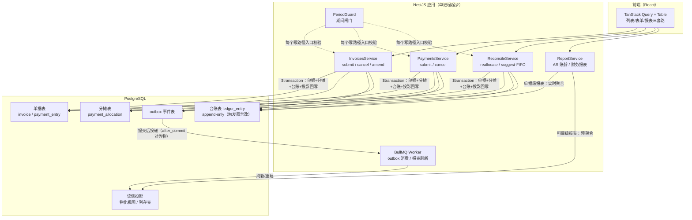

# 第 5 章 对自研系统的映射（NestJS/Prisma/PostgreSQL/React/TanStack）

前四章把 ERPNext v16 应收侧的页面、流程、数据模型与架构机制拆开看了个遍。本章做最后一步翻译：把这些认知落到你的技术栈上——NestJS + Prisma + PostgreSQL 后端，React + TanStack（Table/Query）+ Tailwind/Shadcn 前端。每节遵循同一段式：**ERPNext 怎么做（一句话 + 指向章节）→ 你的系统建议怎么做 → 为什么差异是合理的**。

一个总纲先立在这里：ERPNext 是服务千企的通用 ERP，它的相当一部分复杂度（DocType 元数据引擎、多租户 bench/site、Dynamic Link 多态、三层币种）是"通用性税"。单业务自研系统不该缴这笔税。你要抄的是它的**账务骨架**——三层形态（单据/台账/投影）、不可变台账、分摊式核销、时间闸门——而不是它的形态。

---

## 5.1 数据模型映射：单据/台账/核销分摊/派生投影 → Prisma schema 设计要点

**ERPNext 怎么做**：三层模型——单据层（Sales Invoice / Payment Entry 可提交、可取消）、台账层（GL Entry / Payment Ledger Entry 不可变、只增）、投影层（`outstanding_amount` 冗余回写、Account Closing Balance 快照）（详见第 3 章 3.3、3.4 节）。核销关系用 Payment Entry Reference 子表承载：一行 = 一张收款单对一张被核销单据的一笔分摊，字段为 `reference_doctype + reference_name + allocated_amount`，还挂 `payment_term`（分期粒度）与 `exchange_gain_loss`（按分摊笔核算汇兑损益）[^1^]。

**你的系统建议怎么做**：直接映射为四张核心表——`Invoice`、`PaymentEntry`、`PaymentAllocation`、`LedgerEntry`。前三张是单据层与核销层，`LedgerEntry` 是不可变台账。由于你的业务只有一种被核销单据（发票），ERPNext 的 `reference_doctype + reference_name` 多态 Dynamic Link 退化为一个普通外键 `invoiceId`——这正是"通用性税"可以退掉的部分。

ERPNext DocType → Prisma model 对照表：

| ERPNext（v16） | 层 | 自研 Prisma model | 映射说明 |
|---|---|---|---|
| Sales Invoice | 单据层 | `Invoice` | 保留 `docstatus` 三态 + 业务 `status`；`outstandingAmount` 作为只读投影字段 |
| Sales Invoice Item | 单据子表 | `InvoiceLine` | 普通一对多；单业务下 `incomeAccount` 可简化为单科目或枚举 |
| Payment Entry | 单据层 | `PaymentEntry` | `paymentType` 可裁剪为 Receive 单类（只做应收）或保留枚举以兼容未来付款 |
| Payment Entry Reference | 核销子表 | `PaymentAllocation` | **提升为顶层表**而非嵌套子表（关系型建模的自然形态），承载分摊金额与快照 |
| Payment Entry Deduction | 尾差子表 | `PaymentDeduction` | 实收与分摊差额（尾差/折扣/坏账）的结构化通道，一期可并入 `PaymentAllocation` 的 `writeOffAmount` 字段 |
| Payment Ledger Entry | 台账层 | `LedgerEntry` | append-only；字段裁剪为 `voucherType/voucherId/againstVoucherId/amount/delinked/postingDate` |
| GL Entry | 台账层 | 视需要 | 若 v1 不做科目级总账，可只建应收维度的 `LedgerEntry`（等价 PLE），GL 留待后续 |
| Payment Schedule | 分期子表 | `InvoiceInstallment`（可选） | 有分期收款场景才建；分摊行加 `installmentId` 即对应 ERPNext 的 `payment_term` 粒度 |
| Account Closing Balance | 投影层 | `ClosingBalance`（可选） | 只在财务报表慢到不能接受时才引入（见 5.5） |

Prisma schema 片段（核心四表，省略客户/科目等主数据）：

```prisma
// ============ 单据层：可提交、可取消 ============
model Invoice {
  id                String          @id @default(cuid())
  number            String          @unique        // 命名系列：INV-2026-00001，见 5.3
  customerId        String
  postingDate       DateTime       @db.Date
  dueDate           DateTime?      @db.Date
  grandTotal        Decimal        @db.Decimal(18, 6)
  outstandingAmount Decimal        @db.Decimal(18, 6) // 投影：由 LedgerEntry 聚合回写，禁止业务代码直接改
  docstatus         Int            @default(0)   // 0=Draft 1=Submitted 2=Cancelled，对齐 Frappe docstatus
  status            InvoiceStatus  @default(DRAFT) // UNPAID/PARTLY_PAID/PAID/OVERDUE…，由规则计算
  returnAgainstId   String?        // 红字发票指回原票（对应 return_against）
  amendedFromId     String?        // 修订链（对应 amended_from，命名 原名-N）
  version           Int            @default(0)   // 乐观锁
  lines             InvoiceLine[]
  allocations       PaymentAllocation[]
  ledgerEntries     LedgerEntry[]  @relation("VoucherEntries")
  createdAt         DateTime       @default(now())

  @@index([customerId, docstatus, postingDate])
  @@index([docstatus, outstandingAmount]) // 未清列表/催收视图
}

model InvoiceLine {
  id        String  @id @default(cuid())
  invoiceId String
  invoice   Invoice @relation(fields: [invoiceId], references: [id])
  itemCode  String?
  qty       Decimal @db.Decimal(18, 6)
  rate      Decimal @db.Decimal(18, 6)
  amount    Decimal @db.Decimal(18, 6)
}

model PaymentEntry {
  id               String   @id @default(cuid())
  number           String   @unique
  customerId       String
  postingDate      DateTime @db.Date
  receivedAmount   Decimal  @db.Decimal(18, 6)   // 实收
  allocatedAmount  Decimal  @default(0) @db.Decimal(18, 6) // 已分摊合计（投影）
  unallocatedAmount Decimal @db.Decimal(18, 6)   // 未分摊=预收/待核销（投影）
  docstatus        Int      @default(0)
  version          Int      @default(0)
  allocations      PaymentAllocation[]
  ledgerEntries    LedgerEntry[] @relation("VoucherEntries")
  createdAt        DateTime @default(now())

  @@index([customerId, docstatus, postingDate])
}

// ============ 核销层：多对多分摊（对应 Payment Entry Reference）============
model PaymentAllocation {
  id                    String       @id @default(cuid())
  paymentEntryId        String
  paymentEntry          PaymentEntry @relation(fields: [paymentEntryId], references: [id])
  invoiceId             String
  invoice               Invoice      @relation(fields: [invoiceId], references: [id])
  allocatedAmount       Decimal      @db.Decimal(18, 6) // 本次分摊金额——核销关系的"权重"
  invoiceOutstandingAtBooking Decimal @db.Decimal(18, 6) // 核销时刻余额快照（审计用）
  installmentId         String?      // 分期粒度分摊（对应 payment_term）
  writeOffAmount        Decimal      @default(0) @db.Decimal(18, 6) // 尾差/折扣核销
  createdAt             DateTime     @default(now())

  @@unique([paymentEntryId, invoiceId, installmentId])
  @@index([invoiceId])
}

// ============ 台账层：不可变、只增（对应 Payment Ledger Entry）============
model LedgerEntry {
  id              String   @id @default(cuid())
  postingDate     DateTime @db.Date
  voucherType     String   // "Invoice" | "PaymentEntry" —— 单据类型枚举而非多态 Link
  voucherId       String
  againstVoucherId String? // 被核销单据：一行表达"PE-x 冲 INV-y 若干"
  customerId      String
  amount          Decimal  @db.Decimal(18, 6) // 带符号净额：发票挂账为正，收款核销为负
  delinked        Boolean  @default(false)    // 取消时脱链标记，行保留不删
  isReversal      Boolean  @default(false)    // 反向冲销行
  remarks         String?
  createdAt       DateTime @default(now())

  invoiceVoucher  Invoice?       @relation("VoucherEntries", fields: [voucherId], references: [id], map: "fk_ledger_invoice")
  paymentVoucher  PaymentEntry?  @relation("VoucherEntries", fields: [voucherId], references: [id], map: "fk_ledger_payment")

  @@index([againstVoucherId, delinked])
  @@index([customerId, postingDate])
  @@index([voucherType, voucherId])
}
```

**为什么核销要用分摊表而不是发票上的"已付金额"冗余字段**——这是本章最值得照搬的一条设计判断，ERPNext 用字段结构给出了答案[^1^][^3^]：

1. **核销是多对多，标量字段表达不了**。一张收款单可以核销 N 张发票，一张发票也可被多笔收款分摊。"哪一笔收款抵了这张发票的多少钱"这个配对信息必须一行一存；发票上一个 `paidAmount` 累加字段连一对多都表达不了，更无法在取消某笔收款时精确回滚。
2. **分摊行承载了属于"这次分摊"而非"发票整体"的上下文**：分摊金额、核销时刻余额快照、分期归属、尾差金额。ERPNext 把汇兑损益（`exchange_gain_loss`）挂在分摊行上而非单据头，正因为这类损益必须按分摊笔核算、按笔冲回[^1^]。
3. **可逆性与审计**：取消收款时，分摊行随父单整体失效、台账行 `delinked` 脱链但保留[^3^]——任何时候都能回答"何时、由哪笔收款、核销了多少"。直接改发票字段是破坏性更新，这条审计链就断了。
4. **发票字段不是不冗余，而是只做投影**。ERPNext 的 `outstanding_amount` 在 JSON 里是 `read_only: 1` 的派生字段，真值由 PLE 实时聚合、事件驱动回写[^2^][^5^]；发票状态（Paid/Partly Paid/Overdue）再由该字段推导[^4^]。你的 schema 里 `outstandingAmount` 应遵守同一契约：**业务代码只读不写，唯一的写入点是核销/取消服务在事务内重算回写**（见 5.2）。

一个工程化加固建议：Prisma 无法表达"本表禁止 UPDATE/DELETE"，可以在 migration 里用 PostgreSQL 触发器给 `LedgerEntry` 加 `BEFORE UPDATE OR DELETE … RAISE EXCEPTION`（只允许翻转 `delinked` 的专用安全路径可豁免，或干脆取消时也只插反向行），把不可变性从团队约定升级为数据库级约束。这是对 ERPNext"GL Entry 权限矩阵全员只读"[^3^]在 PG 栈的对等实现。

---

## 5.2 流程与状态机映射：提交/取消/红冲/关账 → NestJS 服务与事务边界

**ERPNext 怎么做**：Frappe 的事务模型是"请求边界 = 事务边界"——一次 submit 把单据状态翻转、GL/PLE 写入、`outstanding` 回写全部放进一个 InnoDB 事务，异常整体回滚[^12^]；取消时写借贷互换的反向分录而非删除（不可变台账）[^14^]；背日补单触发的台账重建由 Repost Accounting Ledger 走后台队列异步"先反向后重记"，且禁止重过账已关闭年度[^8^]；关账/冻结日期/会计期间构成三级时间闸门（见第 4 章 4.3 节）。

**你的系统建议怎么做**：NestJS 里把每个状态机迁移收敛为一个服务方法 + 一个 Prisma 交互式事务（`prisma.$transaction(async (tx) => …)`），事务边界严格对齐 ERPNext 的单请求单事务。动作级对照表：

| ERPNext 动作（机制） | NestJS 服务方法 | 事务边界与要点 |
|---|---|---|
| Sales Invoice Submit（建 GL/PLE + 初始化 outstanding）[^2^] | `InvoicesService.submit(id)` | 单事务：`docstatus 0→1`（条件更新防重）→ 插 `LedgerEntry`（挂账正额）→ 初始化 `outstandingAmount = grandTotal` → 重算 `status` |
| Payment Entry Submit + 分摊（PLE 核销行 + 回写发票 outstanding）[^5^] | `PaymentsService.submit(id)` | 单事务：写 `PaymentAllocation` 行 → 插 `LedgerEntry`（每行分摊一笔负额，`againstVoucherId` 指向发票）→ 按发票聚合台账回写 `outstandingAmount` → 重算发票与收款单状态 |
| Cancel（借贷互换反向分录，原行不动）[^6^][^14^] | `*.cancel(id)` | 单事务：校验未关账 → 插反向 `LedgerEntry`（`isReversal=true`，金额为原行取反）→ 原行 `delinked=true`（或不动，取决于你选不可变模式）→ 重算受影响发票投影 |
| 核销重分摊（Cancel → split → resubmit 重建 PLE）[^5^] | `ReconcileService.reallocate()` | 单事务内"反向旧分摊 + 插入新分摊"，不 UPDATE 台账；单据层 `PaymentAllocation` 可删可插（它是单据而非台账） |
| Amend（取消 + 复制新版本 `原名-N`）（见第 2 章 2.4.4 节） | `InvoicesService.amend(id)` | 取消原单与创建新单放**同一事务**：ERPNext 是两步操作，单业务自研合并为一个原子操作更不容易留中间态 |
| 关账闸门（PCV 之后禁止过账，`validate_against_pcv`）[^7^] | `PeriodGuard.assertOpen(postingDate)` | 每个写路径入口调用的纯查询守卫：存在 `periodEndDate >= postingDate` 的已关闭期间即抛 409；不需要 ERPNext 的三级闸门，一级"期间锁"够用 |
| Repost Accounting Ledger（>5 凭证异步重过账）[^8^] | 一期不做；预留 `LedgerRebuildService` | 见 5.3"简化抄"档 |
| 后台作业投递（`enqueue_after_commit`）[^13^] | Outbox 表 + BullMQ | 见下文 |

自研目标架构图（写路径 + 读路径分层）：



这张图把前四章的三层形态直接落成你的部署形态：写路径全部收口到单事务（单据 + 分摊 + 台账 + 投影回写），对应 ERPNext"请求边界 = 事务边界"[^12^]；`outbox` 表是 `enqueue_after_commit` 的对等物——事务内插事件行、提交后由轮询器投递到 BullMQ，保证异步任务永远不会读到未提交或已回滚的数据[^13^]；读路径按粒度分流，单据级敞口（AR 账龄）实时聚合窄台账，科目级报表走预聚合投影，对应第 4 章 4.4 节的结论。

两个 TS 栈特有的落点：(1) **防重**——ERPNext 靠 docstatus 状态机 + 命名唯一性防重复提交（见第 4 章 4.3.5 节），你用 `UPDATE … SET docstatus=1 WHERE id=? AND docstatus=0` 的条件更新（`updateMany` 返回 count 为 0 即抛冲突）+ `version` 乐观锁即可，效果等价且不依赖框架魔法。(2) **金额类型**——Prisma `Decimal` 在 JS 侧是 `Decimal.js` 对象，所有台账运算在应用层用 decimal.js 完成、禁止转 `number`，这是 PG 栈下保住复式记账精度的最低成本做法。

---

## 5.3 一致性机制取舍：不可变台账/重过账队列/冻结闸门——抄什么、简化什么

ERPNext 的一致性机制清单（不可变台账、RAL 重过账、三级时间闸门、命名系列、队列幂等，见第 4 章 4.3 节）是在"千企共用 + 多年数据 + 审计合规"约束下长出来的。你的系统按三档取舍：

| 档位 | 机制（ERPNext 原型） | 自研决策与理由 |
|---|---|---|
| **直接抄** | 不可变台账：取消写反向分录，台账只增不改[^14^] | 这是审计、幂等、并发安全的共同解，成本极低（多写几行而已），收益是任何时点余额 = 截至该时点的行折叠。用 PG 触发器把"禁 UPDATE/DELETE"做成数据库约束 |
| **直接抄** | 分摊表核销模型（Payment Entry Reference → `PaymentAllocation`）[^1^] | 见 5.1 的四点论证；这是应收系统的地基，没有简化空间 |
| **直接抄** | outstanding 投影：真值实时聚合 + 事件驱动同事务回写[^5^] | 列表页/状态判定直读投影字段（毫秒级），台账聚合只在核销事件内发生——CQRS 读侧最便宜的一层，必须抄 |
| **直接抄** | docstatus 状态机 + 编号系列（Naming Series） | 三态整数 + 条件更新防重 + `INV-2026-00001` 式编号（PG sequence 按年度生成，接受跳号不重用）；编号即审计线索[^15^] |
| **直接抄** | 关账闸门：关闭期间之后禁止过账/取消[^7^] | 这是"业务时间锚点"的最小实现，一张 `AccountingPeriod` 表 + 写路径守卫函数即可 |
| **简化抄** | 三级时间闸门（会计期间/PCV/冻结日期）[^7^] | 合并为一级"期间锁"。三级闸门服务的是"多角色分阶段收尾"的大企业流程；小团队一次月结到位，一锁足矣。冻结日期的角色豁免通道（v16 在 Company 上配置[^7^]）可留一个 `allowedRoles` 字段备用 |
| **简化抄** | Repost Accounting Ledger：可提交单据 + >5 凭证异步队列 + 新旧 GL 预览[^8^] | 简化为 admin 专用的 `LedgerRebuildService`：从单据层全量重建台账与投影，跑在 BullMQ 任务里并带进度日志。不做"新旧对照预览"单据、不做白名单配置——它是运维工具不是业务流程 |
| **简化抄** | 自动核销（Process Payment Reconciliation，15 分钟批作业） | 一期做"手动核销 + FIFO 自动建议分摊"（后端给建议、人确认提交）；自动批作业等有真实量级再上 |
| **简化抄** | `enqueue_after_commit`[^13^] | outbox 表 + 定时轮询投递 BullMQ，约 100 行代码；不引入事务消息中间件 |
| **不要抄** | DocType 元数据引擎（JSON 生成表/表单/权限/API）[^16^] | 见 5.6——这是"服务千企"的答案，单业务自研是过度设计 |
| **不要抄** | Dynamic Link 多态关联（`reference_doctype + reference_name`）[^1^] | 你只有一种被核销单据，普通外键即可；多态 Link 是 ERP 通用性的代价，在 Prisma 里还会丢类型安全 |
| **不要抄** | 三层币种金额字段（交易币/公司币/集团报告币，v16 新增 reporting currency 列） | 单币种业务只留一套 `Decimal`；真有外币收款时再加 `currency + exchangeRate + baseAmount` 一套就够 |
| **不要抄** | 双台账（GL Entry + PLE 两层）[^3^] | v1 若只做应收侧、不出三大报表，一层 `LedgerEntry`（等价 PLE）即可；要做科目级总账时再补 GL 层。ERPNext 拆两层是因为财务报表与核销追踪都要服务[^3^]，你的读负载还没分裂到那个程度 |
| **不要抄** | 多租户 bench/site（每租户独立数据库） | 单业务单库；多租户是 SaaS 产品的运维架构，不是财务正确性的一部分 |
| **不要抄** | DuckDB 快照报表（v16.28 财报提速）[^10^][^11^] | 见 5.5：你的数据量级用 PG 物化视图即可覆盖，引入第二个引擎是运维负债 |

一句话总结取舍原则：**账务正确性机制全抄（它们便宜），通用性与规模化机制按量级裁剪（它们昂贵）**。

---

## 5.4 页面与导航映射：角色任务导向导航、List/Form/Report 三套路 → React/TanStack 落地

**ERPNext 怎么做**：v16 把 Accounting 拆为 Invoicing（业务操作）+ Financial Reports（财务视角）两个 workspace，Sales Invoice/Customer 入口归 Selling 域——导航按"角色任务"而非"数据归属"组织（见第 1 章 1.1 节）；全部业务页面收敛为 List / Form / Report 三套元数据驱动视图；状态徽标有统一配色语义（Draft 红、Submitted 蓝、Paid 绿、Overdue 红）且徽标点击即过滤[^17^]。

**你的系统建议怎么做**：三个模块（发票、对账、财务报表）规模虽小，但"角色任务分桶"原则直接适用。建议导航结构：**应收工作台**（发票列表、收款列表、客户主档——开票/收款岗的日常）→ **对账中心**（核销工作台、未清明细——财务岗）→ **报表中心**（AR 账龄、应收汇总、财务报表——管理岗）。这正是 v16 "Invoicing vs Financial Reports"拆分的微缩版；同时抄 v16 的另一个决策——报表不做满导航树，而是支持从单据页穿透（如客户详情页"查看应收账龄"按钮带过滤参数跳转，对应 v16 Customer 表单 View → Accounts Receivable 路径，见第 1 章 1.3.1 节）。

页面原语对照表：

| Frappe 页面原语（v16） | React/TanStack 落地 | 说明 |
|---|---|---|
| List 视图（过滤器 + Saved Filters + 状态徽标） | TanStack Table 服务端分页/排序/过滤 + URL search params 存过滤态 | 过滤态进 URL 即等价 Frappe 的"sidebar item 预置过滤直达列表"（见第 1 章 1.2.1 节）；TanStack Query 缓存列表查询 |
| 状态徽标（indicator，点击即过滤）[^17^] | `<StatusBadge>` 组件 + 全局 `STATUS_BADGE_MAP` 配置 | 配色语义照抄：Draft 红（框架级默认，见第 1 章 1.2.1；自研若想让草稿更中性可微调为灰，但须全局统一）、Submitted 蓝、Paid 绿、Partly Paid 黄、Overdue 红；点击徽标 = 设置列表过滤，一个交互两个功能 |
| Form 视图（Tab/Section/Column 布局） | Shadcn Form + react-hook-form；分区用 `Card`，多栏用 grid | 布局按"头部主字段区 → 明细子表 → 合计区"组织（见第 1 章 1.2.2 节的 Sales Invoice 解剖）；双币种合计分区这类国际化包袱你没有，可省 |
| 子表 grid（行内编辑 + 展开表单） | TanStack Table 行内编辑，或受控字段数组（`useFieldArray`） | 发票行项目用行内编辑；核销分摊行建议用"勾选未清发票 + 填分摊金额"的双表交互（对应 Payment Reconciliation 工作台，见第 1 章 1.3.4 节） |
| Create 下拉派生单据（提交后出现） | 表单页 Action 菜单，按 `docstatus` 条件渲染 | "发票 → 收款 / 红字发票"派生入口照抄；这是单据流的导航核心 |
| Dashboard 关联面板（Connections Tab） | 单据详情页"关联单据"Tab，后端一次查询返回 | 从发票看到所有收款分摊与台账行——因为你有 `PaymentAllocation` 与 `LedgerEntry` 两个明确外键，一个 join 就能出，比 Frappe 的通用关联解析简单得多 |
| Report 视图（过滤器栏 + 穿透） | 报表页 = 过滤器表单 + TanStack Table；行点击跳单据页 | 过滤器即查询参数，报表结果可分享链接；穿透靠路由参数 |
| Awesome Bar 全局搜索（cmd+k） | cmdk 命令面板（Shadcn 生态现成组件） | 按编号/客户名搜单据，低成本高回报 |

---

## 5.5 报表策略映射：单据级实时 vs 科目级预聚合；400 万明细场景

**ERPNext 怎么做**：报表策略按粒度分流——AR 账龄报表基于 PLE **实时聚合**（窄表 + 索引，账龄需要单据级未清明细，科目快照丢失粒度），v16 仅有取数层调优（Buffered Cursor）；General Ledger/TB/BS/P&L 四张科目级报表走 ACB 期初快照 + v16.28 的 DuckDB 快照报表提速[^9^][^10^][^11^]（口径见第 4 章 4.4.2 节：DuckDB 快照 + ACB 叠加，AR/AP 未被覆盖）。

**你的 400 万明细场景套用这条边界**：先分清慢的是哪一类报表。

| 报表 | 粒度 | ERPNext 策略 | 你的 PG 落地（400 万行级） |
|---|---|---|---|
| AR 账龄 / 对账明细 | 单据级敞口 | PLE 窄表实时聚合 + 索引[^9^] | **实时聚合，不要物化**。`LedgerEntry` 是窄表（~12 列），400 万行在 `(customerId, postingDate)`、`(againstVoucherId) WHERE NOT delinked` 覆盖索引下 `SUM(amount) GROUP BY voucher` 为秒级；账龄分桶用 SQL `CASE` 在查询时算 |
| 发票/收款列表页 | 单据列表 | 冗余投影字段直读[^5^] | `outstandingAmount` 投影直读（毫秒级），绝不 `JOIN SUM` 出列表——这是投影层存在的意义 |
| 客户应收汇总 | party 级余额 | Customer Ledger Summary（PLE 聚合） | 实时聚合可扛；变慢则加**常规物化视图** `mv_customer_balance`，核销事件后 `REFRESH MATERIALIZED VIEW CONCURRENTLY`（读旧刷新新不锁读） |
| 财务报表（TB/BS/P&L 类） | 科目级余额 | ACB 期初快照 + DuckDB 列存快照[^10^] | **可以预聚合**：月结后生成 `ClosingBalance` 快照行（等价 ACB），报表 = 最近快照 + 增量聚合；这是预聚合的经典场景——"全历史余额"是单调递增的历史常数，不该每次重算（见第 3 章 Q3） |
| 即席多维分析（如有） | 任意切片 | DuckDB OLAP 卸载[^10^] | v1 不做；见下方对等物讨论 |

关键判断——**对账/未清类报表别指望物化视图**。原因与 ERPNext 相同：账龄要求"每张发票的未清余额落在 0-30/30-60/60-90/90+ 哪个桶"，物化视图若存到单据粒度，刷新成本等于重算全表且数据即旧；若只存科目粒度则丢了单据明细。正确姿势是把实时聚合做到极致：

1. 台账表保持窄表，不在上面挂大字段（remarks 截断、不放 JSONB 负载）；
2. 为账龄查询建部分索引（partial index）：`CREATE INDEX … ON ledger_entry (against_voucher_id) WHERE NOT delinked AND NOT is_reversal`，把无效行挡在索引外；
3. 账龄计算下推 SQL：`SUM(amount) FILTER (WHERE posting_date <= :date) GROUP BY against_voucher_id`，配合 `CASE WHEN age <= 30 …` 分桶，一次查询出全量；
4. 列表/催收场景一律走投影字段，把聚合查询留给真正的报表页。

**DuckDB 思路在 PG 栈的对等物**（以下为建议性推断，非 ERPNext 事实，标注 ⚠️）：DuckDB 快照报表的本质是"OLTP 行存之外挂一个列存 OLAP 投影，写入路径零改动，以可见的数据新鲜度换聚合速度"[^10^]。PostgreSQL 生态内不引入第二引擎的对等选项按侵入度递增为：(a) **物化视图 + 定时/事件刷新**——覆盖科目级预聚合，零新组件；(b) **逻辑读副本 + 报表流量分流**——把重聚合从写库挪走，等价 Frappe 的 `read_from_replica` 读写分离；(c) **列存扩展**——TimescaleDB 的列存压缩（hypercore）或 Citus 的 columnar 存储，可在同一 PG 实例内获得列式聚合能力。对你的 400 万行量级，(a) + 索引调优大概率已够；(b)(c) 是千万行以后的事，届时再评估，不要提前缴运维税。⚠️ 这一档属于架构建议，ERPNext 的 DuckDB 选型证据不能自动外推为你的选型结论。

工程化锁定（呼应你的 CI 门禁路线）：把"核销后 `outstandingAmount` = 台账聚合值"写成 property-based 测试（随机生成发票/收款/取消序列，断言投影恒等）；把"台账表触发器禁止 UPDATE/DELETE"写成 migration 冒烟测试。这两条是账务系统的地基不变量，值得用 CI 锁死。

---

## 5.6 元数据驱动的取舍：抄思想不抄形态

**ERPNext 怎么做**：Frappe 的核心抽象 DocType 用一份 JSON 元数据同时生成数据库表、ORM、表单、权限矩阵与 REST API——"元数据是一等公民"[^16^]。官方动机很明确：小团队维护数千功能、千企定制以配置而非代码交付（见第 4 章 4.2 节）。

**你的系统建议怎么做**：**明确不建 DocType 引擎**。理由有三：(1) 元数据驱动的收益与"要服务的业务变体数"成正比，你只有一个业务、一套科目逻辑，引擎本身（Meta 解析、运行时 schema 迁移、动态表单渲染、动态权限求值）的复杂度远超收益；(2) 你会失去 TS 栈最大的资产——编译期类型安全：Prisma schema 即单一事实源，类型从数据库一路推导到前端（tRPC 或生成的 DTO），这是 DocType 运行时元数据永远给不了的；(3) ERPNext 自己也在为元数据驱动缴性能税——v16 的大量性能工作（Meta 瘦身、lock-free 缓存、表单加载提速约 70%）本质是在优化元数据热路径（见第 4 章 4.4.1 节），你绕开引擎就绕开了这整个问题域。

但元数据驱动的**思想层**有一批东西值得以"少量配置"形态落地：

| 可配置化的点 | ERPNext 原型 | 自研落地形态（代码内配置，非运行时引擎） |
|---|---|---|
| 状态徽标语义 | indicator.js 框架级配色 + 单据级覆盖[^17^] | 一份 `STATUS_BADGE_MAP: Record<Status, {label, color, filter}>` 常量，列表/表单/报表共用 |
| 表单分区/分栏 | DocType JSON 的 Section/Column Break | 每类单据一个表单配置对象（分区标题 + 字段数组 + 栏数），渲染器固定；改布局=改代码+发版 |
| 字段级权限 | DocType Perm Level + 角色矩阵 | 一期：角色守卫到路由/按钮级（NestJS Guard + 前端条件渲染）；真有字段级需求再做一张 `field_permissions` 表，不要上通用权限 DSL |
| 列表预过滤导航 | Workspace Sidebar Item 预置过滤 | 导航项声明式携带默认查询参数（如"逾期发票"= `status=overdue`），前端路由天然支持 |
| 报表过滤器与保存视图 | Report 的 Saved Filters / Report master | 过滤器 schema 定义为 TS 对象（字段、控件类型、默认值），渲染器固定；"保存的视图"存用户级 JSON 记录即可 |
| 单据编号规则 | Naming Series 配置 | `numbering_rules` 表：前缀 + 年度序列，对应 Frappe Naming Series 但仅实现你用的那一种模式[^15^] |

判据一句话：**配置解决"同一业务内的差异"（状态配色、布局、角色可见性），代码解决"业务规则本身"（核销逻辑、状态机、分录生成）**。ERPNext 把后者也配置化是因为它要卖一千次；你只卖一次，显式代码 + 测试锁定就是最低总成本。

---

## 本章要点回顾

1. **三层骨架全抄**：单据层（可提交/取消）→ 台账层（不可变只增）→ 投影层（冗余回写）是账务系统的普适骨架，四张 Prisma 表（`Invoice` / `PaymentEntry` / `PaymentAllocation` / `LedgerEntry`）即可承载 ERPNext 应收侧的核心结构。
2. **核销必须走分摊表**：多对多配对、分摊级上下文（分期/尾差/快照）、可逆审计，三点决定"发票冗余已付字段"方案结构性不成立；发票 `outstandingAmount` 只能做只读投影，唯一写入点是核销事务内的聚合回写[^1^][^5^]。
3. **事务边界对齐状态机**：每个状态迁移 = 一个 NestJS 服务方法 + 一个交互式事务（单据 + 分摊 + 台账 + 投影回写四合一），等价 Frappe 的"请求边界 = 事务边界"[^12^]；异步副作用走 outbox + BullMQ，等价 `enqueue_after_commit`[^13^]。
4. **一致性机制三档取舍**：账务正确性机制（不可变台账、分摊核销、投影回写、状态机防重、期间闸门）直接抄且便宜；规模化机制（重过账队列、三级闸门、自动核销）简化抄；通用性机制（DocType 引擎、Dynamic Link、多租户、三层币种、双台账）不要抄。
5. **报表按粒度分流**：400 万明细下，AR 账龄/对账走窄台账实时聚合 + 部分索引（别指望物化视图），列表页走投影字段，科目级财务报表才做 ClosingBalance 快照式预聚合——与 ERPNext"PLE 实时 vs ACB/DuckDB 快照"的分流逻辑同构[^9^][^10^]。
6. **DuckDB 思路的 PG 对等物**（⚠️建议性推断）：物化视图 → 读副本 → 列存扩展（TimescaleDB/Citus columnar）按侵入度递进；400 万行量级大概率物化视图 + 索引即够。
7. **导航按角色任务组织**：应收工作台 / 对账中心 / 报表中心三桶 + 单据页穿透报表，是 v16 "Invoicing vs Financial Reports"拆分的微缩版；List/Form/Report 三套路分别由 TanStack Table、react-hook-form + 分区配置、过滤器 + 穿透链接落地。
8. **不建 DocType 引擎，抄思想不抄形态**：状态徽标、表单分区、字段权限、预过滤导航以"代码内配置"形态落地；业务规则一律显式代码 + 测试锁定，保住 TS 编译期类型安全这条最大资产。

## 本章来源

[^1^]: Payment Entry Reference DocType JSON — https://raw.githubusercontent.com/frappe/erpnext/version-16/erpnext/accounts/doctype/payment_entry_reference/payment_entry_reference.json（version-16 分支，访问 2026-07-28）
[^2^]: Sales Invoice DocType JSON — https://raw.githubusercontent.com/frappe/erpnext/version-16/erpnext/accounts/doctype/sales_invoice/sales_invoice.json（version-16 分支，访问 2026-07-28）
[^3^]: Payment Ledger Entry DocType JSON — https://raw.githubusercontent.com/frappe/erpnext/version-16/erpnext/accounts/doctype/payment_ledger_entry/payment_ledger_entry.json（version-16 分支，访问 2026-07-28）
[^4^]: sales_invoice.py（set_status 控制器逻辑）— https://github.com/frappe/erpnext/blob/version-16/erpnext/accounts/doctype/sales_invoice/sales_invoice.py（version-16 分支，访问 2026-07-28）
[^5^]: utils.py（create_payment_ledger_entry / update_voucher_outstanding / reconcile_against_document）— https://github.com/frappe/erpnext/blob/version-16/erpnext/accounts/utils.py（version-16 分支，访问 2026-07-28）
[^6^]: general_ledger.py（make_reverse_gl_entries / check_freezing_date / validate_against_pcv）— https://github.com/frappe/erpnext/blob/version-16/erpnext/accounts/general_ledger.py（version-16 分支，访问 2026-07-28）
[^7^]: Accounts Settings DocType JSON 与 Company DocType JSON（冻结日期 v16 迁至 Company）— https://raw.githubusercontent.com/frappe/erpnext/version-16/erpnext/accounts/doctype/accounts_settings/accounts_settings.json ; https://raw.githubusercontent.com/frappe/erpnext/version-16/erpnext/setup/doctype/company/company.json（version-16 分支，访问 2026-07-28）
[^8^]: repost_accounting_ledger.py（>5 凭证 enqueue_after_commit 异步重过账、禁改已关闭年度）— https://raw.githubusercontent.com/frappe/erpnext/version-16/erpnext/accounts/doctype/repost_accounting_ledger/repost_accounting_ledger.py（version-16 分支，访问 2026-07-28）
[^9^]: accounts_receivable.py（报表基于 PLE 实时聚合、账龄分桶口径）— https://github.com/frappe/erpnext/blob/version-16/erpnext/accounts/report/accounts_receivable/accounts_receivable.py（version-16 分支，访问 2026-07-28）
[^10^]: PR frappe/erpnext#56304 "faster (synced) financial statements using duckdb" 与 PR frappe/frappe#40177 "DuckDB integration" — https://github.com/frappe/erpnext/pull/56304 ; https://github.com/frappe/frappe/pull/40177（访问 2026-07-28）
[^11^]: ERPNext Releases（v16.28.0，#57098 faster data source）— https://github.com/frappe/erpnext/releases（访问 2026-07-28）
[^12^]: Database API（请求成功提交、异常回滚的事务模型）— https://docs.frappe.io/framework/user/en/api/database（访问 2026-07-28）
[^13^]: background_jobs.py（enqueue_after_commit 经 after_commit 钩子延迟投递）— https://raw.githubusercontent.com/frappe/frappe/version-16/frappe/utils/background_jobs.py（version-16 分支，访问 2026-07-28）
[^14^]: Immutable Ledger in ERPNext — https://docs.frappe.io/erpnext/user/manual/en/immutable-ledger-in-erpnext（访问 2026-07-28）
[^15^]: Naming — Frappe Framework Docs — https://docs.frappe.io/framework/user/en/basics/doctypes/naming（访问 2026-07-28）
[^16^]: Understanding DocTypes — Frappe Framework Docs — https://docs.frappe.io/framework/user/en/basics/doctypes（访问 2026-07-28）
[^17^]: indicator.js（框架级状态色语义）— https://raw.githubusercontent.com/frappe/frappe/version-16/frappe/public/js/frappe/model/indicator.js（version-16 分支，访问 2026-07-28）
