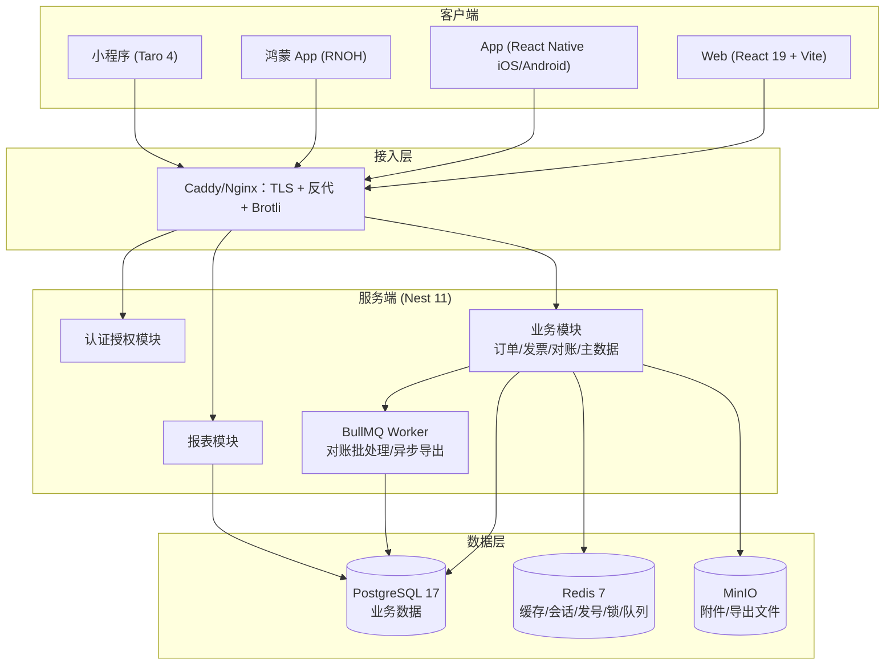
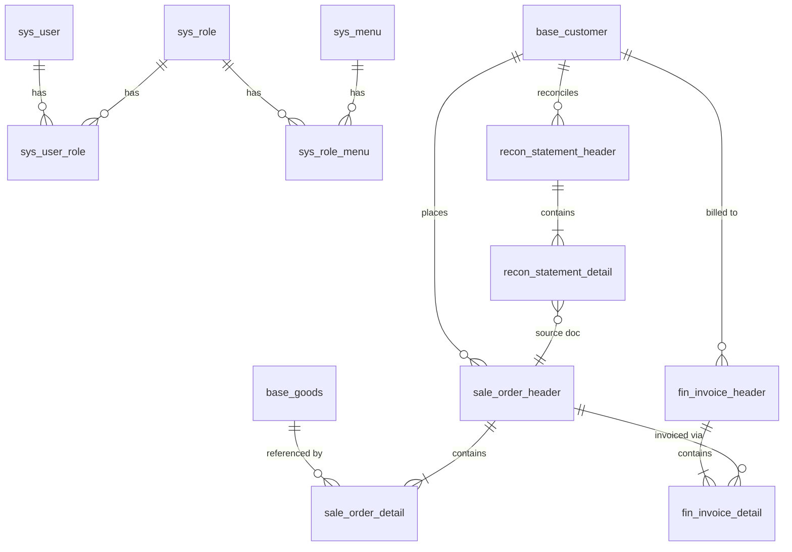

# 财务系统详细设计文档

> 版本：v1.0 ｜ 日期：2026-07-17 ｜ 定位：承接此前的"低码财务平台蓝图"，进入可落地的详细设计阶段
> 读者：独立开发者（全栈一个人），目标 6 个月内做出可写进简历的完整作品

---

## 1. 文档范围与设计原则

### 1.1 范围

| 端 | 技术栈 | 定位 |
|---|---|---|
| Web 端 | React 19.2 + Vite + Tailwind v4 + shadcn/ui + TanStack 全家桶 | **全量功能**，财务后台主体 |
| 移动端 | React Native（iOS/Android）+ RNOH（鸿蒙）+ Taro 4（小程序） | **轻量功能**：审批、看板、查询、扫码，**不做 Web 的复刻** |
| 后端 | Nest 11 + Prisma 7 | REST API + OpenAPI 契约 |
| 数据层 | PostgreSQL 17（主）+ Redis 7（缓存/队列/发号/锁），MongoDB 可选（一期不上） | — |

### 1.2 设计原则

1. **契约先行**：数据库 schema（Prisma）与 API 契约（OpenAPI/zod）是唯一事实源，前后端类型自动生成/共享，杜绝手写类型漂移。
2. **财务红线**：金额一律 `numeric(19,4)` 存储、字符串传输、`decimal.js` 计算，**任何环节禁止浮点数**；单据一律软删除 + 审计字段 + 乐观锁。
3. **单据即状态机**：订单/发票/对账单都有明确状态机，状态流转只能走 service 层的显式方法，不允许裸 update status。
4. **Web 全量、移动轻量**：移动端功能列表先砍后做，只做"出门在外 3 分钟能办完的事"。
5. **能跑优先，过度设计后置**：多租户、工作流引擎、低代码表单渲染器均为二期扩展点，一期只预留接口位置。

---

## 2. 总体架构

### 2.1 架构图



### 2.2 Monorepo 结构（pnpm workspaces + Turborepo）

```
fin-suite/
├── apps/
│   ├── web/            # React 19.2 + Vite 7，财务后台全量功能
│   ├── server/         # Nest 11 + Prisma 7，REST API
│   ├── mobile/         # RN 0.77.x（iOS/Android），harmony/ 目录为 RNOH 工程
│   └── mp/             # Taro 4 + React，微信/支付宝小程序
├── packages/
│   ├── types/          # 共享 TS 类型 + zod schema + 单据状态机定义（四端复用）
│   ├── api-client/     # 基于 fetch 的 API SDK（由 OpenAPI 生成 + 手写封装，四端复用）
│   ├── utils/          # decimal 金额计算、格式化、常量、权限码常量
│   └── config/         # eslint flat config / tsconfig base / tailwind preset
├── docs/               # 本文档及后续 API/部署文档
├── turbo.json
└── pnpm-workspace.yaml
```

**关键决策说明：**

- **移动端不用 Expo**：Expo SDK 与 RNOH（鸿蒙适配层）兼容性差，RNOH 基于裸 RN 工程。采用 RN CLI 裸工程 + `harmony/` 目录，一码三端（iOS/Android/HarmonyOS）。
- **RN 版本锁定 0.77.x 而非最新**：RNOH 当前稳定适配 RN 0.72.5 / 0.77.1，0.82 适配中、0.84 计划 2026 Q2。RN 版本跟着 RNOH 走，**锁版本不升级**，这是鸿蒙路线最大的约束，写进 CI 检查。[^1^][^2^]
- **小程序独立用 Taro 4**：小程序不是 RN 生态，无法复用 RN 组件；但可复用 `packages/types`、`packages/api-client`、`packages/utils`，UI 层按小程序范式单独写。
- **Prisma 用 7.x**：2025-11 发布的 Prisma 7 改为纯 TypeScript 客户端（去 Rust 引擎），查询快约 3 倍、bundle 小约 90%，当前最新 7.8.0。[^3^][^4^]

### 2.3 技术选型总表

| 层 | 选型 | 版本基线 | 理由 |
|---|---|---|---|
| Web 框架 | React | ^19.2 | 用户指定；Activity/useEffectEvent 可用于页签缓存与副作用治理 |
| 构建 | Vite | ^7 | 事实标准，配合 `@vitejs/plugin-react` |
| 样式 | Tailwind CSS | ^4 | 用户指定；v4 用 `@theme` 声明 token，CSS 变量天然支持主题切换 |
| 组件库 | shadcn/ui（Radix 基底） | latest | 用户指定；源码即组件，方便二次封装 |
| 路由 | TanStack Router | ^1 | 类型安全路由，search params 校验，适合"列表页查询条件可分享"的 B 端场景 |
| 服务端状态 | TanStack Query | ^5 | 缓存/失效/乐观更新，Web 与 RN 同一套心智 |
| 表格 | TanStack Table | ^8 | 无头表格，配 shadcn 样式自绘，财务报表的复杂列/合计行都能做 |
| 表单 | react-hook-form + zod | ^7 / ^4 | TanStack Form 仍年轻，RHF+zod 生态最稳；zod schema 放 packages/types 四端复用 |
| 客户端状态 | zustand | ^5 | 只放真正的全局客户端状态（用户偏好、页签），服务端数据一律归 Query |
| 图表 | ECharts | ^6 | 财务报表（趋势/占比/账龄）比 Recharts 上限高 |
| 金额 | decimal.js | ^10 | 财务红线 |
| 虚拟滚动 | TanStack Virtual | ^3 | 万级明细行 |
| 请求封装 | ky（Web）/ 原生 fetch 封装（RN） | — | 统一拦截器：token 刷新、错误规范化、traceId |
| API 生成 | orval（OpenAPI → TS client） | ^7 | server 的 Swagger 文档 → packages/api-client |
| 后端框架 | Nest | ^11 | 用户指定 |
| ORM | Prisma | ^7 | 用户指定；纯 TS 客户端 |
| 数据库 | PostgreSQL | ^17 | 用户指定 |
| 缓存/队列 | Redis + BullMQ | ^7 / ^5 | 会话、字典缓存、发号、分布式锁、异步任务 |
| 认证 | @nestjs/jwt + argon2 | — | access + refresh，refresh 存 Redis 可吊销 |
| 权限 | 自研 RBAC Guard（权限码） | — | 不用 CASL，B 端权限码模型更直白，简历好讲 |
| 日志 | pino（nestjs-pino） | — | 结构化日志 + traceId |
| 文件 | MinIO（S3 协议） | — | 附件、异步导出文件 |
| 校验 | zod + nestjs-zod | — | 与前端共享 schema |
| 测试 | Vitest + Testing Library + Playwright（Web）；Jest（server e2e） | — | — |
| 规范 | ESLint 9 flat + Prettier + husky + lint-staged + commitlint | — | — |
| 包管理 | pnpm + Turborepo | — | monorepo |

---

## 3. 数据模型与表设计

### 3.1 命名与通用约定

| 约定 | 规则 |
|---|---|
| 表名 | snake_case 复数，业务前缀：`sys_`（系统）、`base_`（主数据）、`sale_`（销售）、`fin_`（财务）、`recon_`（对账） |
| 主键 | `id BIGSERIAL`，对外接口不暴露 id，暴露业务编号（如 `order_no`） |
| 业务编号 | `单据前缀 + 日期 + 序列`，如 `SO20260717-00001`，Redis 发号 + 数据库唯一索引兜底 |
| 金额 | `numeric(19,4)`；数量 `numeric(18,3)`；税率 `numeric(5,2)`（如 13.00 表示 13%） |
| 审计字段 | 所有表：`created_at / created_by / updated_at / updated_by / deleted_at`（软删，null 表示未删） |
| 乐观锁 | 单据头表带 `version int default 0`，更新时 `where id = ? and version = ?` |
| 枚举 | 用 varchar + 应用层 zod/TS 枚举约束（不用 PG enum，方便扩展与迁移） |
| 快照原则 | 单据明细冗余商品/客户的**名称、编码、规格**快照字段，源头档案改名不影响历史单据 |

### 3.2 ER 图



### 3.3 Prisma Schema（核心全量）

> 说明：以下为**一期核心表**。按要求包含 user、role、order_header/detail、goods、invoice_header/detail，并补齐财务闭环必需的 customer、对账单（statement）、权限菜单、字典、审计日志、发号表。

```prisma
// apps/server/prisma/schema.prisma
generator client {
  provider = "prisma-client-js"
}

datasource db {
  provider = "postgresql"
  url      = env("DATABASE_URL")
}

// ───────────────────────── 系统域 ─────────────────────────

model SysUser {
  id           BigInt   @id @default(autoincrement())
  username     String   @unique @db.VarChar(32)
  passwordHash String   @map("password_hash") @db.VarChar(128)
  realName     String   @map("real_name") @db.VarChar(32)
  email        String?  @db.VarChar(64)
  phone        String?  @db.VarChar(20)
  avatar       String?  @db.VarChar(255)
  status       String   @default("ENABLED") @db.VarChar(16) // ENABLED / DISABLED / LOCKED
  lastLoginAt  DateTime? @map("last_login_at")
  roles        SysUserRole[]
  createdAt    DateTime @default(now()) @map("created_at")
  createdBy    BigInt?  @map("created_by")
  updatedAt    DateTime @updatedAt @map("updated_at")
  updatedBy    BigInt?  @map("updated_by")
  deletedAt    DateTime? @map("deleted_at")

  @@map("sys_user")
}

model SysRole {
  id          BigInt   @id @default(autoincrement())
  code        String   @unique @db.VarChar(32)   // ADMIN / FINANCE / SALES
  name        String   @db.VarChar(32)
  description String?  @db.VarChar(255)
  dataScope   String   @default("ALL") @map("data_scope") @db.VarChar(16) // ALL / DEPT / SELF
  status      String   @default("ENABLED") @db.VarChar(16)
  users       SysUserRole[]
  menus       SysRoleMenu[]
  createdAt   DateTime @default(now()) @map("created_at")
  createdBy   BigInt?  @map("created_by")
  updatedAt   DateTime @updatedAt @map("updated_at")
  updatedBy   BigInt?  @map("updated_by")
  deletedAt   DateTime? @map("deleted_at")

  @@map("sys_role")
}

model SysUserRole {
  userId BigInt @map("user_id")
  roleId BigInt @map("role_id")
  user   SysUser @relation(fields: [userId], references: [id])
  role   SysRole @relation(fields: [roleId], references: [id])

  @@id([userId, roleId])
  @@map("sys_user_role")
}

// 菜单与按钮权限：type = DIR / MENU / BUTTON
model SysMenu {
  id        BigInt   @id @default(autoincrement())
  parentId  BigInt?  @map("parent_id")
  type      String   @db.VarChar(8)      // DIR / MENU / BUTTON
  name      String   @db.VarChar(32)
  code      String   @unique @db.VarChar(64) // 权限码，如 sale:order:approve
  path      String?  @db.VarChar(128)    // 前端路由
  icon      String?  @db.VarChar(64)
  sort      Int      @default(0)
  status    String   @default("ENABLED") @db.VarChar(16)
  roles     SysRoleMenu[]
  createdAt DateTime @default(now()) @map("created_at")
  updatedAt DateTime @updatedAt @map("updated_at")
  deletedAt DateTime? @map("deleted_at")

  @@index([parentId])
  @@map("sys_menu")
}

model SysRoleMenu {
  roleId BigInt @map("role_id")
  menuId BigInt @map("menu_id")
  role   SysRole @relation(fields: [roleId], references: [id])
  menu   SysMenu @relation(fields: [menuId], references: [id])

  @@id([roleId, menuId])
  @@map("sys_role_menu")
}

// 单据发号（数据库兜底，主通道是 Redis INCR）
model SysSequence {
  id        BigInt @id @default(autoincrement())
  bizType   String @map("biz_type") @db.VarChar(16)  // SO / INV / STM
  bizDate   String @map("biz_date") @db.VarChar(8)   // 20260717
  currentNo Int    @default(0) @map("current_no")

  @@unique([bizType, bizDate])
  @@map("sys_sequence")
}

// 字典
model SysDictType {
  id     BigInt @id @default(autoincrement())
  code   String @unique @db.VarChar(64)  // invoice_type / currency
  name   String @db.VarChar(64)
  items  SysDictItem[]
  @@map("sys_dict_type")
}

model SysDictItem {
  id       BigInt @id @default(autoincrement())
  typeId   BigInt @map("type_id")
  type     SysDictType @relation(fields: [typeId], references: [id])
  value    String @db.VarChar(64)
  label    String @db.VarChar(64)
  sort     Int    @default(0)
  status   String @default("ENABLED") @db.VarChar(16)

  @@index([typeId])
  @@map("sys_dict_item")
}

// 审计日志（一期 PG 存，量大后按月分区；这是 Mongo 的候选迁移对象）
model SysAuditLog {
  id         BigInt  @id @default(autoincrement())
  userId     BigInt? @map("user_id")
  username   String? @db.VarChar(32)
  module     String  @db.VarChar(32)     // sale / invoice / system
  action     String  @db.VarChar(64)     // order.approve
  targetType String? @map("target_type") @db.VarChar(32)
  targetId   String? @map("target_id") @db.VarChar(64)
  detail     Json?                        // 变更前后 diff
  ip         String? @db.VarChar(45)
  createdAt  DateTime @default(now()) @map("created_at")

  @@index([module, createdAt])
  @@index([userId, createdAt])
  @@map("sys_audit_log")
}

// ───────────────────────── 主数据域 ─────────────────────────

model BaseGoodsCategory {
  id       BigInt  @id @default(autoincrement())
  parentId BigInt? @map("parent_id")
  name     String  @db.VarChar(64)
  sort     Int     @default(0)
  goods    BaseGoods[]
  deletedAt DateTime? @map("deleted_at")

  @@map("base_goods_category")
}

model BaseGoods {
  id          BigInt  @id @default(autoincrement())
  sku         String  @unique @db.VarChar(64)
  barcode     String? @db.VarChar(64)
  name        String  @db.VarChar(128)
  categoryId  BigInt? @map("category_id")
  category    BaseGoodsCategory? @relation(fields: [categoryId], references: [id])
  spec        String? @db.VarChar(128)   // 规格型号
  unit        String  @db.VarChar(16)    // 件/箱/台
  salePrice   Decimal @db.Decimal(19, 4) @map("sale_price")
  costPrice   Decimal @db.Decimal(19, 4) @map("cost_price")
  taxRate     Decimal @default(13.00) @db.Decimal(5, 2) @map("tax_rate")
  status      String  @default("ENABLED") @db.VarChar(16)
  remark      String? @db.VarChar(500)
  orderDetails  SaleOrderDetail[]
  invoiceDetails FinInvoiceDetail[]
  createdAt   DateTime @default(now()) @map("created_at")
  createdBy   BigInt?  @map("created_by")
  updatedAt   DateTime @updatedAt @map("updated_at")
  updatedBy   BigInt?  @map("updated_by")
  deletedAt   DateTime? @map("deleted_at")

  @@index([categoryId])
  @@index([name])                         // 模糊检索走 pg_trgm（见 3.5）
  @@map("base_goods")
}

model BaseCustomer {
  id        BigInt  @id @default(autoincrement())
  code      String  @unique @db.VarChar(32)
  name      String  @db.VarChar(128)
  shortName String? @map("short_name") @db.VarChar(64)
  taxNo     String? @map("tax_no") @db.VarChar(32)      // 纳税人识别号，开票必需
  contact   String? @db.VarChar(32)
  phone     String? @db.VarChar(32)
  address   String? @db.VarChar(255)
  bankName  String? @map("bank_name") @db.VarChar(128)
  bankAccount String? @map("bank_account") @db.VarChar(64)
  creditLimit Decimal @default(0) @db.Decimal(19, 4) @map("credit_limit") // 信用额度
  status    String  @default("ENABLED") @db.VarChar(16)
  orders    SaleOrderHeader[]
  invoices  FinInvoiceHeader[]
  statements ReconStatementHeader[]
  createdAt DateTime @default(now()) @map("created_at")
  createdBy BigInt?  @map("created_by")
  updatedAt DateTime @updatedAt @map("updated_at")
  updatedBy BigInt?  @map("updated_by")
  deletedAt DateTime? @map("deleted_at")

  @@map("base_customer")
}
```

（schema 下半部分：订单、发票、对账，见下一节）

```prisma
// ───────────────────────── 销售域 ─────────────────────────

// 订单状态机：DRAFT → PENDING(提交待审) → APPROVED → PARTIAL_INVOICED → INVOICED → CLOSED
//             DRAFT/PENDING → CANCELLED
model SaleOrderHeader {
  id            BigInt  @id @default(autoincrement())
  orderNo       String  @unique @map("order_no") @db.VarChar(32)
  customerId    BigInt  @map("customer_id")
  customer      BaseCustomer @relation(fields: [customerId], references: [id])
  customerName  String  @map("customer_name") @db.VarChar(128) // 快照
  orderDate     DateTime @map("order_date") @db.Date
  currency      String  @default("CNY") @db.VarChar(8)
  totalQty      Decimal @default(0) @db.Decimal(18, 3) @map("total_qty")
  totalAmount   Decimal @default(0) @db.Decimal(19, 4) @map("total_amount") // 含税总额
  taxAmount     Decimal @default(0) @db.Decimal(19, 4) @map("tax_amount")
  invoicedAmount Decimal @default(0) @db.Decimal(19, 4) @map("invoiced_amount") // 已开票金额（开票回写）
  status        String  @default("DRAFT") @db.VarChar(24)
  version       Int     @default(0)
  remark        String? @db.VarChar(500)
  auditBy       BigInt? @map("audit_by")
  auditAt       DateTime? @map("audit_at")
  details       SaleOrderDetail[]
  invoiceDetails FinInvoiceDetail[]
  statementDetails ReconStatementDetail[]
  createdAt     DateTime @default(now()) @map("created_at")
  createdBy     BigInt?  @map("created_by")
  updatedAt     DateTime @updatedAt @map("updated_at")
  updatedBy     BigInt?  @map("updated_by")
  deletedAt     DateTime? @map("deleted_at")

  @@index([customerId, orderDate])
  @@index([status, orderDate])
  @@map("sale_order_header")
}

model SaleOrderDetail {
  id          BigInt  @id @default(autoincrement())
  orderId     BigInt  @map("order_id")
  order       SaleOrderHeader @relation(fields: [orderId], references: [id])
  lineNo      Int     @map("line_no")              // 行号 10/20/30 留缝便于插入
  goodsId     BigInt  @map("goods_id")
  goods       BaseGoods @relation(fields: [goodsId], references: [id])
  goodsSku    String  @map("goods_sku") @db.VarChar(64)   // 快照
  goodsName   String  @map("goods_name") @db.VarChar(128) // 快照
  spec        String? @db.VarChar(128)
  unit        String  @db.VarChar(16)
  qty         Decimal @db.Decimal(18, 3)
  price       Decimal @db.Decimal(19, 4)           // 含税单价
  discountRate Decimal @default(100.00) @db.Decimal(5, 2) @map("discount_rate") // 折扣率 %
  amount      Decimal @db.Decimal(19, 4)           // 行含税金额 = qty*price*discount
  taxRate     Decimal @db.Decimal(5, 2) @map("tax_rate")
  taxAmount   Decimal @db.Decimal(19, 4) @map("tax_amount")
  invoicedQty Decimal @default(0) @db.Decimal(18, 3) @map("invoiced_qty") // 已开票数量（分次开票）
  remark      String? @db.VarChar(500)
  createdAt   DateTime @default(now()) @map("created_at")
  updatedAt   DateTime @updatedAt @map("updated_at")
  deletedAt   DateTime? @map("deleted_at")

  @@unique([orderId, lineNo])
  @@index([goodsId])
  @@map("sale_order_detail")
}

// ───────────────────────── 财务域 ─────────────────────────

// 发票状态机：NORMAL → RED_FLUSHED（已红冲） / VOID（作废）
model FinInvoiceHeader {
  id           BigInt  @id @default(autoincrement())
  invoiceNo    String  @unique @map("invoice_no") @db.VarChar(32)   // 内部单号 INV2026xxxx
  invoiceCode  String? @map("invoice_code") @db.VarChar(16)          // 税务机关发票代码
  invoiceNum   String? @map("invoice_num") @db.VarChar(16)           // 发票号码（真票）
  type         String  @db.VarChar(16)        // SPECIAL 专票 / NORMAL 普票 / ELECTRONIC 电票
  customerId   BigInt  @map("customer_id")
  customer     BaseCustomer @relation(fields: [customerId], references: [id])
  buyerName    String  @map("buyer_name") @db.VarChar(128)           // 购方抬头（快照）
  buyerTaxNo   String? @map("buyer_tax_no") @db.VarChar(32)
  invoiceDate  DateTime @map("invoice_date") @db.Date
  totalAmount  Decimal @default(0) @db.Decimal(19, 4) @map("total_amount")
  taxAmount    Decimal @default(0) @db.Decimal(19, 4) @map("tax_amount")
  netAmount    Decimal @default(0) @db.Decimal(19, 4) @map("net_amount") // 不含税
  status       String  @default("NORMAL") @db.VarChar(16)
  redFlushOf   BigInt? @map("red_flush_of")   // 红字发票指向原蓝字发票
  version      Int     @default(0)
  remark       String? @db.VarChar(500)
  details      FinInvoiceDetail[]
  statementDetails ReconStatementDetail[]
  createdAt    DateTime @default(now()) @map("created_at")
  createdBy    BigInt?  @map("created_by")
  updatedAt    DateTime @updatedAt @map("updated_at")
  updatedBy    BigInt?  @map("updated_by")
  deletedAt    DateTime? @map("deleted_at")

  @@index([customerId, invoiceDate])
  @@index([status])
  @@map("fin_invoice_header")
}

model FinInvoiceDetail {
  id          BigInt  @id @default(autoincrement())
  invoiceId   BigInt  @map("invoice_id")
  invoice     FinInvoiceHeader @relation(fields: [invoiceId], references: [id])
  lineNo      Int     @map("line_no")
  orderId     BigInt? @map("order_id")            // 溯源：哪张订单
  order       SaleOrderHeader? @relation(fields: [orderId], references: [id])
  orderDetailId BigInt? @map("order_detail_id")   // 溯源：哪一行
  goodsId     BigInt? @map("goods_id")
  goods       BaseGoods? @relation(fields: [goodsId], references: [id])
  goodsName   String  @map("goods_name") @db.VarChar(128) // 快照
  spec        String? @db.VarChar(128)
  unit        String  @db.VarChar(16)
  qty         Decimal @db.Decimal(18, 3)
  price       Decimal @db.Decimal(19, 4)
  amount      Decimal @db.Decimal(19, 4)
  taxRate     Decimal @db.Decimal(5, 2) @map("tax_rate")
  taxAmount   Decimal @db.Decimal(19, 4) @map("tax_amount")
  createdAt   DateTime @default(now()) @map("created_at")
  deletedAt   DateTime? @map("deleted_at")

  @@unique([invoiceId, lineNo])
  @@index([orderId])
  @@map("fin_invoice_detail")
}

// ───────────────────────── 对账域 ─────────────────────────

// 对账单状态机：GENERATED → CONFIRMING（客户确认中）→ CONFIRMED / DISPUTED → SETTLED
model ReconStatementHeader {
  id           BigInt  @id @default(autoincrement())
  statementNo  String  @unique @map("statement_no") @db.VarChar(32)
  customerId   BigInt  @map("customer_id")
  customer     BaseCustomer @relation(fields: [customerId], references: [id])
  periodStart  DateTime @map("period_start") @db.Date
  periodEnd    DateTime @map("period_end") @db.Date
  openingBalance Decimal @default(0) @db.Decimal(19, 4) @map("opening_balance") // 期初
  totalOrderAmount Decimal @default(0) @db.Decimal(19, 4) @map("total_order_amount")
  totalInvoiceAmount Decimal @default(0) @db.Decimal(19, 4) @map("total_invoice_amount")
  closingBalance Decimal @default(0) @db.Decimal(19, 4) @map("closing_balance") // 期末应收
  status       String  @default("GENERATED") @db.VarChar(16)
  generatedBy  String  @map("generated_by") @db.VarChar(16) // MANUAL / JOB
  version      Int     @default(0)
  remark       String? @db.VarChar(500)
  details      ReconStatementDetail[]
  createdAt    DateTime @default(now()) @map("created_at")
  createdBy    BigInt?  @map("created_by")
  updatedAt    DateTime @updatedAt @map("updated_at")
  updatedBy    BigInt?  @map("updated_by")
  deletedAt    DateTime? @map("deleted_at")

  @@unique([customerId, periodStart, periodEnd])  // 同客户同账期唯一，天然幂等
  @@index([status])
  @@map("recon_statement_header")
}

// 对账明细 = 单据快照 + 差异标记，source 回溯源单据
model ReconStatementDetail {
  id          BigInt  @id @default(autoincrement())
  statementId BigInt  @map("statement_id")
  statement   ReconStatementHeader @relation(fields: [statementId], references: [id])
  lineNo      Int     @map("line_no")
  sourceType  String  @map("source_type") @db.VarChar(16) // ORDER / INVOICE
  sourceId    BigInt  @map("source_id")
  sourceNo    String  @map("source_no") @db.VarChar(32)
  bizDate     DateTime @map("biz_date") @db.Date
  summary     String? @db.VarChar(255)         // 摘要：商品名汇总
  amount      Decimal @db.Decimal(19, 4)
  diffFlag    String  @default("NONE") @map("diff_flag") @db.VarChar(16) // NONE / AMOUNT_DIFF / MISSING
  diffRemark  String? @map("diff_remark") @db.VarChar(500)
  createdAt   DateTime @default(now()) @map("created_at")

  @@unique([statementId, lineNo])
  @@index([sourceType, sourceId])
  @@map("recon_statement_detail")
}
```

### 3.4 索引与查询性能策略

这一节直接回应你之前"月度对账单 200–2000 条明细查 10 秒"的痛点——问题本质不是数据量大，而是**报表 SQL 实时做多表 JOIN + 聚合 + 排序**。设计对策：

1. **列表查询只查头表 + 覆盖索引**：订单列表不 JOIN 明细，行数/合计在头表冗余（`total_qty/total_amount`），写库时由 service 层事务内重算。
2. **报表走预聚合汇总表**：新增 `rpt_daily_sales_summary`（日期 × 客户 × 商品 的日汇总），由 BullMQ 每日凌晨增量聚合。报表查询只扫汇总表，毫秒级返回；明细钻取才查明细表并带上索引条件。
3. **关键索引**（已在 schema 中体现）：
   - `sale_order_header(customer_id, order_date)` —— 对账按客户+账期聚合的必经之路
   - `sale_order_detail(order_id, line_no)` 唯一 —— 主从加载
   - `recon_statement_detail(source_type, source_id)` —— 溯源反查
4. **模糊搜索用 pg_trgm**：商品名/客户名的 `LIKE '%xx%'` 开启 `pg_trgm` 扩展 + GIN 索引，避免全表扫描。
5. **N+1 防护**：Prisma 查询一律 `include` 显式声明，或 service 层 `in: ids` 批量取数后在内存组装；Code Review 清单里加一条"禁止在循环里 await prisma"。
6. **慢查询观测**：PG 开 `log_min_duration_statement = 500ms`，每周看一次慢日志。

### 3.5 Redis 的使用边界（用得上才用）

| 场景 | Key 设计 | TTL | 说明 |
|---|---|---|---|
| Refresh Token | `auth:rt:{userId}:{jti}` | 14 天 | 可吊销；登出/改密即删 |
| 权限码缓存 | `auth:perms:{userId}` | 30 分钟，角色变更主动失效 | 登录态高频校验不走 PG |
| 字典缓存 | `dict:{typeCode}` | 1 小时 | 字典变更通过消息或主动 del 失效 |
| 单据发号 | `seq:{bizType}:{yyyyMMdd}` | 48 小时 | `INCR` 原子发号；`sys_sequence` 表做崩溃兜底 |
| 幂等锁 | `idem:{bizType}:{key}` | 10 分钟 | `SET NX PX`，防重复提交 |
| 分布式锁 | `lock:statement:{customerId}:{period}` | 任务时长 | 对账单生成防并发 |
| BullMQ | `bull:*` | — | 对账批处理、异步导出、日汇总 |
| 限流 | `rl:{ip}:{route}` | 窗口 | 登录等敏感接口 |

**明确不用 Redis 做的**：不做业务数据的长期缓存层（B 端数据强一致优先，缓存收益低风险高）、不做分布式 session（JWT 无状态 + Redis 吊销名单足够）。

### 3.6 MongoDB 的取舍：一期不上

候选场景只有两个：①审计日志/单据变更快照（document 天然契合）；②低代码表单渲染器的动态 schema 存储。一期的判断：

- 审计日志量（单人项目 + 演示数据）PG 完全够，且 `SysAuditLog.detail` 已经是 JSONB，按月分区即可；
- 低代码是二期，届时若动态表单数据真的落地，再评估 Mongo。

**结论：一期不引入 MongoDB**，在架构图上标注为二期可选扩展点，避免为了用而用。这条"会拒绝技术"的判断本身也是面试加分项。

---

## 4. 后端详细设计（Nest 11 + Prisma 7）

### 4.1 模块划分

```
apps/server/src/
├── main.ts                    # 引导：全局管道/过滤器/拦截器/Swagger
├── app.module.ts
├── config/                    # 环境变量校验（zod）、配置命名空间
├── infra/                     # 基础设施（与业务无关）
│   ├── prisma/                # PrismaModule + PrismaService（全局）
│   ├── redis/                 # RedisModule（ioredis 封装）
│   ├── queue/                 # BullMQ 注册中心
│   ├── logger/                # nestjs-pino，traceId 注入
│   ├── minio/                 # S3 客户端封装
│   └── common/                # 过滤器、拦截器、装饰器、基类
├── modules/
│   ├── auth/                  # 登录、刷新、登出、改密、验证码（可选）
│   ├── system/                # user / role / menu / dict / sequence / audit-log
│   ├── base-data/             # goods / goods-category / customer
│   ├── sales/                 # order（CRUD + 状态机 + 审批）
│   ├── invoice/               # invoice（开票、红冲、作废、从订单开票）
│   ├── recon/                 # statement（生成、核对、确认、导出）
│   ├── report/                # 只读聚合查询 + 异步导出
│   └── file/                  # 附件上传下载（预签名 URL）
└── jobs/                      # BullMQ processor：对账生成、日汇总、导出
```

**分层纪律**（每个模块内）：

```
controller  → 只做协议：参数接收、权限装饰器、Swagger 注解
service     → 业务规则、状态机、事务边界（this.prisma.$transaction）
repository  → 仅在查询复杂时单独抽层；简单 CRUD 直接在 service 用 prisma
dto/        → create/update/query DTO（nestjs-zod 定义，即 zod schema）
```

### 4.2 认证与授权

```
登录:  POST /api/v1/auth/login       {username, password}
       → 校验 argon2id 哈希 → 发 access(2h, JWT) + refresh(14d, Redis)
刷新:  POST /api/v1/auth/refresh     {refreshToken}   → 旋转（旧 jti 作废）
登出:  POST /api/v1/auth/logout      → 删 Redis jti
权限:  GET  /api/v1/auth/profile     → 用户信息 + 权限码数组 + 菜单树
```

- **权限模型**：`sys_menu.code` 即权限码（如 `sale:order:approve`），角色挂菜单/按钮，用户挂角色。
- **接口鉴权**：`@RequirePerms('sale:order:approve')` 装饰器 + 全局 `PermissionGuard`，从 Redis 缓存读权限码集合。
- **数据权限**（一期简化版）：角色 `data_scope = ALL / SELF`，SELF 在查询条件注入 `created_by = 当前用户`；DEPT 等组织维度留扩展点。
- **前端权限**：菜单树驱动路由与侧边栏；按钮级用 `<Auth code="sale:order:approve">` 组件包裹。
- **安全措施**：登录失败 5 次锁 15 分钟（Redis 计数）；密码 argon2id；所有接口 HTTPS；限流走 `@nestjs/throttler` + Redis 存储。

### 4.3 单据核心机制

**① 事务与主从写入**——订单保存是典型的事务场景：

```ts
// sales/order.service.ts 伪代码
async saveOrder(dto: SaveOrderDto, userId: bigint) {
  return this.prisma.$transaction(async (tx) => {
    // 1. 服务端重算金额（不信任前端）：decimal 计算行金额/税额/合计
    const calc = calcOrderAmounts(dto.details);
    // 2. 乐观锁校验（编辑时）
    if (dto.id) await assertVersion(tx, dto.id, dto.version);
    // 3. upsert 头 + 全量替换明细（明细无主键语义，按行号重建）
    const header = await upsertHeaderWithDetails(tx, dto, calc);
    // 4. 写审计日志（同事务）
    await writeAudit(tx, 'sale', 'order.save', header, dto);
    return header;
  });
}
```

要点：**金额一律服务端重算**；明细采用"全量替换"策略（行号有序重建），比 diff 更新简单且幂等；单号在事务内通过 Redis `INCR` 获取，冲突时降级查 `sys_sequence` 表。

**② 状态机集中在 packages/types**：

```ts
// packages/types/src/state-machine/order.ts（前后端共用）
export const ORDER_TRANSITIONS: Record<OrderStatus, OrderStatus[]> = {
  DRAFT:             ['PENDING', 'CANCELLED'],
  PENDING:           ['APPROVED', 'CANCELLED'],
  APPROVED:          ['PARTIAL_INVOICED', 'INVOICED'],
  PARTIAL_INVOICED:  ['INVOICED'],
  INVOICED:          ['CLOSED'],
  CLOSED: [], CANCELLED: [],
};
```

后端流转方法（`submit/approve/cancel/close`）校验转移合法性；前端用同一份定义渲染可用操作按钮——**状态机一处定义，四端一致**。

**③ 幂等设计**：

| 入口 | 幂等手段 |
|---|---|
| 单据提交 | 前端生成 `Idempotency-Key` 请求头 → Redis `SET NX PX`；重复请求直接返回首次结果 |
| 对账单生成 | `recon_statement_header(customer_id, period_start, period_end)` 唯一约束，重复生成命中冲突即返回已存在单 |
| 开票回写订单 | `fin_invoice_detail.order_detail_id` + 订单行 `invoiced_qty` 累加放在同一事务，超开校验 `invoiced_qty + qty <= detail.qty` |
| BullMQ 任务 | jobId = 业务键（如 `statement:{customerId}:{period}`），队列天然去重 |

**④ 分次开票**（财务真实场景）：订单审核通过后可多次开票，发票明细回溯源订单行，累加 `invoiced_qty`；行全部开满 → 订单 `INVOICED`，部分 → `PARTIAL_INVOICED`。红冲：生成红字发票（`red_flush_of` 指向蓝票），同事务回退 `invoiced_qty`。

### 4.4 对账引擎（批处理）

```
触发:  手动 POST /recon/statements/generate  或  BullMQ 定时（每月 1 日 02:00）
       ↓
锁:    Redis lock:statement:{customerId}:{period}（防同一客户同账期并发生成）
       ↓
聚合:  SELECT ... FROM sale_order_header WHERE customer_id=? AND order_date BETWEEN ? AND ?
       AND status IN ('APPROVED','PARTIAL_INVOICED','INVOICED','CLOSED')
       → 分批（每客户一个 job，job 内分页 500 行/批）
       ↓
写入:  statement_header + details（同事务），状态 GENERATED
       ↓
比对:  （可选）客户提供的对账文件上传 → 按 source_no 匹配，金额容差 ±0.01
       → diff_flag 标记 AMOUNT_DIFF / MISSING
       ↓
确认:  状态流转 GENERATED → CONFIRMING → CONFIRMED / DISPUTED → SETTLED
```

- 大客户的 job 进度写 Redis（`job:progress:{jobId}`），前端轮询/SSE 展示进度条；
- 生成过程任何失败 → 事务回滚 + job 重试 3 次（指数退避）+ 审计日志。

### 4.5 API 设计规范

| 项 | 规范 |
|---|---|
| 路径 | `/api/v1/{模块}/{资源}`，kebab-case |
| 统一响应 | `{ code: 0, data: ..., message: "ok", traceId }`，业务错误 `code != 0` |
| 分页 | `GET ?page=1&pageSize=20` → `{ list, total, page, pageSize }`；明细长列表支持游标 `?cursor=` |
| 金额 | JSON 中一律**字符串**（`"1234.5600"`），前端 decimal.js 解析 |
| BigInt | 序列化层统一转字符串 |
| 错误码 | 5 位：`1xxxx` 系统/参数，`2xxxx` 认证权限，`3xxxx` 销售域，`4xxxx` 财务域，`5xxxx` 对账域 |
| 文档 | `@nestjs/swagger` 自动生成 OpenAPI 3.1 → orval 生成前端 client 到 `packages/api-client` |
| 版本 | URL 带 v1；破坏性变更升 v2 |

### 4.6 测试策略

- **单元测试**（Vitest/Jest）：金额计算、状态机、权限 Guard——这三类是纯逻辑，覆盖率要求 90%+；
- **集成测试**：Prisma + Testcontainers（PG），覆盖订单保存事务、分次开票回写、对账生成的金额正确性；
- **e2e**：`supertest` 跑 auth → 下单 → 审批 → 开票 → 对账 的黄金链路；
- CI 上 `pnpm test` 全绿才允许合并。

---

## 5. Web 端详细设计（React 19.2 + Tailwind v4 + shadcn + TanStack）

### 5.1 目录结构（feature-first）

```
apps/web/src/
├── main.tsx / router.tsx          # TanStack Router 实例
├── app/                           # 应用壳
│   ├── layouts/                   # AdminLayout（侧边栏+页签+头部）、AuthLayout
│   └── providers/                 # QueryClient、主题、全局错误边界
├── components/
│   ├── ui/                        # shadcn 原子组件（button/input/dialog/...）
│   └── biz/                       # 业务封装组件（见 5.4）
├── features/                      # 业务特性（页面）
│   ├── auth/                      # 登录
│   ├── dashboard/                 # 工作台
│   ├── sales/                     # 订单列表/新建/详情
│   ├── invoice/                   # 发票
│   ├── recon/                     # 对账中心
│   ├── report/                    # 报表中心
│   ├── base-data/                 # 商品/客户
│   └── system/                    # 用户/角色/菜单/字典/审计
├── hooks/                         # use-debounce、use-dict、use-perms...
├── lib/                           # request 封装、格式化、导出工具
├── stores/                        # zustand：用户偏好、多页签
└── styles/                        # globals.css + @theme tokens
```

规则：`features/*` 之间禁止互相 import，共享的东西必须下沉到 `components/biz`、`hooks`、`lib` 或 `packages/*`。

### 5.2 设计 Token（Tailwind v4 `@theme` + CSS 变量）

你之前说"没有数值概念、写个表单都内耗"——这套 token 就是把所有数值决策提前做完，开发时**只准从表里取值，不准现场发明数字**。

**① 色彩（oklch，语义化命名，亮/暗双主题）**

```css
/* styles/globals.css */
@theme inline {
  --color-background:  var(--background);
  --color-foreground:  var(--foreground);
  --color-card:        var(--card);
  --color-primary:     var(--primary);
  --color-primary-fg:  var(--primary-foreground);
  --color-muted:       var(--muted);
  --color-muted-fg:    var(--muted-foreground);
  --color-border:      var(--border);
  --color-success:     var(--success);
  --color-warning:     var(--warning);
  --color-danger:      var(--danger);
  --color-info:        var(--info);
}

:root {
  /* 主色：财务系统用沉稳的蓝，hue 250 附近 */
  --primary: oklch(0.51 0.19 262);
  --primary-foreground: oklch(0.98 0 0);
  --background: oklch(0.99 0.002 250);   /* 页面底色：近白带一丝冷 */
  --foreground: oklch(0.21 0.02 260);    /* 正文：近黑 */
  --card: oklch(1 0 0);
  --muted: oklch(0.965 0.005 250);       /* 表头底/斑马纹 */
  --muted-foreground: oklch(0.52 0.02 255); /* 辅助文字 */
  --border: oklch(0.91 0.008 250);
  --success: oklch(0.62 0.15 155);
  --warning: oklch(0.72 0.15 75);
  --danger:  oklch(0.58 0.20 27);
  --info:    oklch(0.62 0.12 220);
}
.dark { /* 对应暗色映射，略 */ }
```

使用纪律：**组件里只允许出现语义色**（`bg-card text-muted-foreground border-border`），禁止裸写 `bg-blue-500 text-gray-600`——主题切换和统一改色才有意义。状态徽标配色映射也固定：DRAFT→muted、PENDING→warning、APPROVED→info、INVOICED→success、CANCELLED/红冲→danger。

**② 数值体系（背下来，别现场发明）**

| 类别 | 取值（px） | 用在哪 |
|---|---|---|
| 间距基准 | 4 / 8 / 12 / 16 / 24 / 32 / 48 | 一切 margin/padding/gap 只能从这里取 |
| 页面左右边距 | 24 | 内容区 |
| 卡片间距 | 16 | 卡片之间 gap |
| 卡片内边距 | 24（头）/ 16（小卡片） | — |
| 表单栅格 | label 宽 96，控件间距 16，一行两栏 | 标准查询区/表单 |
| 控件高度 | 28（小/表格内）/ **32（默认）** / 40（登录页） | Input/Select/Button |
| 表格行高 | 40（默认）/ 32（紧凑，报表用） | 行高 + 密度切换 |
| 字号 | 12 辅助 / **14 正文** / 16 小标题 / 20 卡片标题 / 24 页面标题 | — |
| 圆角 | 6（控件）/ 8（卡片）/ 12（弹窗） | — |
| 阴影 | 仅弹窗/下拉用 md，卡片用 1px border 不用阴影 | B 端克制 |
| z-index | 下拉 50 / 抽屉 60 / Dialog 70 / Toast 80 | 不许出现 9999 |

```css
@theme {
  --spacing-page: 24px;
  --text-xs: 12px; --text-sm: 14px; --text-base: 16px; --text-lg: 20px; --text-xl: 24px;
  --radius-sm: 6px; --radius-md: 8px; --radius-lg: 12px;
  --z-dropdown: 50; --z-drawer: 60; --z-dialog: 70; --z-toast: 80;
}
```

**③ 字体**：中文 PingFang/Microsoft YaHei + 西文 Inter；**数字统一 `font-variant-numeric: tabular-nums`**（报表金额对齐的生命线，必须全局开）。

### 5.3 组件分层

```
components/ui/    shadcn 原子件：button, input, select, dialog, table(皮肤), sonner...
components/biz/   业务封装（本项目的护城河）：
  ├─ ProTable          # TanStack Table + 查询区 + 分页 + 列设置 + 密度 + 导出
  ├─ SearchForm        # 配置化查询区（字段数组 → RHF 表单，支持收起/展开）
  ├─ FormDialog / DrawerForm
  ├─ AmountText        # 金额渲染：千分位、负数红、币种符号、tabular-nums
  ├─ StatusBadge       # 单据状态徽标（颜色映射见 5.2）
  ├─ DictSelect / DictTag  # 字典下拉/回显（走 Redis 缓存的字典接口 + Query 缓存）
  ├─ CustomerSelect / GoodsSelect  # 远程搜索选择器（防抖 + 分页）
  ├─ MasterDetailEditor # 主从表编辑器（订单/发票新建的核心，见 5.5）
  ├─ Auth              # 按钮级权限：<Auth code="sale:order:approve">
  └─ ExportButton      # 触发异步导出 → 下载中心通知
```

`ProTable` 的 props 设计直接决定所有列表页的开发效率，目标：**一个标准列表页 80 行代码内搞定**（列定义 + 查询字段 + API 函数）。

```tsx
<ProTable
  columns={orderColumns}                       // TanStack Table 列定义
  searchFields={orderSearchFields}             // 配置化查询区
  fetcher={orderApi.page}                      // (params) => Promise<PageResult>
  toolbar={<Auth code="sale:order:create"><Button>新建订单</Button></Auth>}
  rowActions={renderRowActions}                // 按状态机渲染可用操作
/>
```

### 5.4 状态与数据流纪律

| 数据类型 | 归属 | 说明 |
|---|---|---|
| 服务端数据 | TanStack Query | queryKey 规范：`['order','list',params]`、`['order','detail',id]`；写操作后精确 `invalidateQueries` |
| 全局客户端状态 | zustand | 当前用户/权限码、侧边栏折叠、多页签、表格密度——**只放这些** |
| 表单状态 | RHF | 不进 Query/zustand |
| URL 状态 | TanStack Router search | 列表页查询条件、分页、排序全部进 URL，刷新/分享不丢 |

React 19.2 的两个新能力正好用上：`<Activity>` 做**多页签保活**（隐藏而非卸载已打开的页签，B 端高频诉求）；`useEffectEvent` 治理事件订阅类副作用。

### 5.5 核心页面模式

**① 单据详情页（读模式）**：头信息 Descriptions + 明细只读 ProTable + 底部操作条（按状态机渲染）+ 右侧时间线（创建→提交→审批→开票记录，来自审计日志接口）。

**② 主从表编辑页（写模式，全项目最难的组件）**：

- 头部 RHF 表单；明细是**内嵌可编辑表格**（行内编辑：商品远程搜索选择 → 自动带出价/税率/单位快照，输入数量 → 行金额实时 decimal.js 重算）；
- 底部合计条：总数量/总金额/税额实时汇总（useMemo + decimal）；
- 行操作：增行（行号 +10）、插行（利用行号留缝）、删行、复制行；
- 提交前 zod 校验全表单；提交按钮携带 `Idempotency-Key` 防重复；
- 编辑模式带 `version`，后端乐观锁冲突时提示"数据已被他人修改，请刷新"。

**③ 对账中心**：左树（客户）+ 右侧上下结构（对账单头列表 / 选中单的明细 + 差异筛选 Tab：全部/仅差异）。生成对账单走异步 job，进度条展示。

**④ 报表中心**：筛选区 + ECharts 图（趋势/占比）+ 明细表 + 异步导出。图表与表格共用一份 Query 数据。

### 5.6 页面清单（一期全量）

| 模块 | 页面 | 关键点 |
|---|---|---|
| 认证 | 登录、忘记密码 | 登录失败次数提示 |
| 工作台 | Dashboard | KPI 卡片（本月订单额/待审批/待对账）、趋势图、待办列表 |
| 销售 | 订单列表 / 新建·编辑 / 详情 | 主从编辑、状态机操作、审批 |
| 发票 | 开票（从订单选行）/ 发票列表 / 详情 | 分次开票、红冲、作废 |
| 主数据 | 商品列表·编辑、商品分类、客户列表·编辑 | sku 唯一校验、远程搜索 |
| 对账 | 对账单列表 / 详情（差异处理） | 异步生成、差异标记 |
| 报表 | 销售汇总、开票统计、应收账龄 | 预聚合数据源、异步导出 |
| 系统 | 用户、角色（菜单树勾选+数据范围）、菜单、字典、审计日志、登录日志 | 角色-菜单树是权限模型的演示窗口 |

### 5.7 性能预算与手段

- 首屏：路由级代码分割 + 骨架屏，目标 LCP < 2.5s（本地演示环境）；
- 列表页：分页 20/50/100；明细弹窗超 200 行启用 TanStack Virtual；
- 导出：超过 5000 行一律走后端异步导出 + 下载中心，前端不卡页面；
- ECharts 按需引入（`echarts/core`）；字典数据 Query 缓存 5 分钟起步；
- 包体积预算：首屏 gzip < 350KB（不含图表路由）。

---

## 6. 移动端详细设计（RN + 鸿蒙 + 小程序）

### 6.1 端策略总览

| 端 | 方案 | 版本基线 | 说明 |
|---|---|---|---|
| iOS / Android | RN CLI 裸工程 | **RN 0.77.x（锁定）** | 不追新：版本由 RNOH 决定 |
| 鸿蒙 HarmonyOS NEXT | RNOH（React Native for OpenHarmony），工程内 `harmony/` 目录 | RNOH 稳定版（适配 RN 0.77.1） | 与 RN 同一套 JS 代码；RNOH 0.82 适配中，升级另行评估[^1^][^2^] |
| 微信/支付宝小程序 | Taro 4 + React | Taro ^4 | 独立 UI，复用 packages 的 types/api-client/utils |

**风险预案（重要）**：RNOH 第三方库已适配约 205/368 个[^5^]，选型前必须查[三方库适配清单]；本项目移动端刻意只依赖成熟库（Query、zustand、MMKV、react-navigation、FlashList、VisionCamera 扫码），都在已适配范围内。若鸿蒙端某个能力真卡住，降级策略是"鸿蒙先上 H5 套壳/小程序侧"，不阻塞主线。

### 6.2 功能裁剪矩阵（移动端的灵魂：做减法）

| 功能 | Web | RN/鸿蒙 | 小程序 | 移动端交互改造 |
|---|---|---|---|---|
| 登录 | ✅ | ✅（+指纹/面容） | ✅（微信一键登录） | 生物识别快速解锁 |
| 工作台看板 | ✅ 全图表 | ✅ **仅 4 张 KPI 卡 + 1 张趋势图** | ✅ 同 RN | 数字优先，图表简化 |
| 待办审批 | ✅ | ✅ **核心场景**：通过/驳回+意见 | ✅ | 卡片流，左滑快捷通过 |
| 订单查询/详情 | ✅ 全操作 | ✅ 只读 + 审批 | ✅ 只读 | 筛选仅 3 个高频条件 |
| 发票查询 | ✅ | ✅ 只读 | ✅ 只读 | — |
| 对账单确认 | ✅ 全流程 | ✅ 查看 + 确认/异议 | ✅ 查看 | 确认操作强提醒 |
| 商品/客户查询 | ✅ | ✅ 只读 + **扫码查商品** | ❌（裁剪） | 扫码（VisionCamera） |
| 消息通知 | ✅ | ✅ 审批结果/对账完成推送 | ✅ 订阅消息 | APNs/厂商通道/鸿蒙推送 |
| 主从表新建/编辑 | ✅ | ❌ **明确不做** | ❌ | 复杂录入是桌面场景，不硬搬 |
| 报表中心 | ✅ | ❌（看板已覆盖核心指标） | ❌ | — |
| 系统管理 | ✅ | ❌ | ❌ | — |
| 异步导出/下载中心 | ✅ | ❌ | ❌ | — |

裁剪逻辑一句话：**移动端 = "审批 + 看数 + 查证"**，任何需要双手打字的复杂录入都回 Web。

### 6.3 RN 工程结构与技术要点

```
apps/mobile/
├── src/
│   ├── app/                 # react-navigation 导航树（按断点切换，见 6.4）
│   ├── screens/             # dashboard / todo / order / invoice / statement / scan / msg / me
│   ├── components/          # KpiCard / TodoCard / StatusChip / AmountText / SearchBar...
│   ├── hooks/               # useBreakpoint、useOnlineManager、useBiometric
│   ├── lib/                 # request（复用 packages/api-client）、mmkv、推送注册
│   └── theme/               # 与 Web 同源的设计 token（色值/间距/字号 TS 常量）
├── harmony/                 # RNOH 鸿蒙工程（DevEco Studio 打开构建）
├── ios/ android/
```

- **样式**：RN 不能用 Tailwind，但 token 同源——`packages/types` 导出一份 `tokens.ts`（色值/间距/字号常量），Web 的 `@theme` 与 RN 的 theme 对象从同一份 JSON 生成，保证两端视觉一致；
- **数据层**：TanStack Query + `packages/api-client`，与 Web 完全同一套接口与缓存心智；
- **本地存储**：react-native-mmkv（token、草稿、Query 持久化），敏感 token 放 Keychain/Keystore（react-native-keychain）；
- **导航**：react-navigation v7——手机底 Tab（工作台/待办/消息/我的）；鸿蒙侧同构。

### 6.4 平板（iPad 比例）适配

适配策略是**一套代码两套布局**，断点驱动而非设备判断：

```ts
// hooks/useBreakpoint.ts
export function useBreakpoint() {
  const { width } = useWindowDimensions();
  return width >= 768 ? 'tablet' : 'phone';   // 768dp ≈ iPad 竖屏宽度
}
```

| 场景 | phone（<768dp） | tablet（≥768dp，iPad 4:3 / 10.9"） |
|---|---|---|
| 导航 | 底部 Tab | 左侧固定 Sidebar（宽度 240），右侧内容区 |
| 列表 → 详情 | 跳页（Stack push） | **Master-Detail 双栏**：左列表（宽 320）右详情，选中高亮 |
| 看板 | KPI 2 列 | KPI 4 列一行，图表更高 |
| 审批卡片 | 单列卡片流 | 双列瀑布或左列表右审批表单 |

实现要点：导航层根据断点返回不同 Navigator（Tab vs Drawer-permanent + 双栏容器）；列表/详情拆成可组合组件，双栏模式下详情从"路由页面"变为"受选中态驱动的右侧视图"。横竖屏旋转不锁方向，双栏比例用 flex 自适应。**模拟器验收清单：iPad 10.9 竖/横、iPad 12.9 横、华为 MatePad（鸿蒙模拟器）。**

### 6.5 弱网优化（ checklist 级）

**请求层**
- Query 全局配置：`retry: 2`（指数退避 1s/3s）、`networkMode: 'offlineFirst'`、超时 10s；
- `onlineManager` 监听 NetInfo，断网时全局 Toast + 待办卡片置灰提交按钮；
- 列表分页用游标 `cursor` 而非页码（弱网重试不会页码错位）；默认页大小 20；
- 接口支持 `?fields=` 字段裁剪，移动端列表只取卡片需要的 8 个字段；
- 相同 queryKey 请求自动去重（Query 自带），切页取消挂起请求（AbortController）。

**缓存与离线**
- `persistQueryClient` + MMKV persister：看板、待办、字典、商品搜索结果持久化，**断网可浏览上次数据**（卡片左上角"数据更新于 xx:xx"角标）；
- staleTime：看板 5min、单据详情 30s、字典 1h；
- **审批离线队列**：断网时点"通过"→ mutation 入本地队列（MMKV）+ 乐观标记"待同步"，网络恢复自动重放；冲突时以服务端状态机校验结果为准并通知；
- **草稿箱**：审批意见输入自动本地保存，杀进程不丢。

**资源与体感**
- 图片/头像走 CDN 缩略图参数；附件预览先压缩图后原图；
- 骨架屏优先于 loading 转圈；审批操作乐观更新（先变状态，失败回滚+提示）；
- 接口返回 gzip/brotli；RN 侧启用 Hermes（RNOH 新架构下默认）；
- 埋点：请求耗时 P50/P95 上报（自建简易收集接口），用数据持续调优。

### 6.6 小程序（Taro 4）差异点

- 登录：微信 `code` 换 session → 绑定系统账号；消息走订阅消息模板（审批结果通知）；
- 功能进一步裁剪（见矩阵）：只做审批 + 看板 + 单据查询，扫码用 `wx.scanCode`；
- 弱网策略同 RN，持久化用 `Taro.setStorage` 封装同一套 persister 接口；
- 包体积：主包 < 2MB，单据查询走分包。

---

## 7. 安全、部署与工程化

### 7.1 安全清单

| 层 | 措施 |
|---|---|
| 传输 | 全站 TLS（Caddy 自动证书）；HSTS |
| 认证 | argon2id 哈希；access 2h + refresh 14d（Redis 可吊销、旋转）；登录失败锁定 |
| 授权 | 接口级权限码 Guard；数据范围（ALL/SELF）注入查询条件 |
| 注入/XSS | Prisma 参数化杜绝 SQL 注入；React 默认转义 + 富文本场景 DOMPurify（一期无富文本输入） |
| CSRF | JWT 走 Authorization 头（非 Cookie），天然免疫 |
| 限流 | 登录 5 次/分钟/IP；全局 300 次/分钟/IP（Redis 计数） |
| 审计 | 所有写操作 + 登录登出 → `sys_audit_log`（操作人/IP/变更前后 diff） |
| 敏感数据 | 客户银行账号界面脱敏（`****1234`），导出文件含水印页脚 |
| 依赖 | `pnpm audit` + Renovate 周更；CI 阻断高危漏洞 |

### 7.2 部署（对接你的个人服务器：Ubuntu VM / 6 核 32G / 1T）

```yaml
# deploy/docker-compose.yml（单机全量，演示环境绰绰有余）
services:
  postgres:   # postgres:17，挂载数据卷，限制 4G 内存
  redis:      # redis:7，appendonly yes
  minio:      # 附件 + 导出文件
  server:     # Nest 构建产物，2 实例或单实例均可
  caddy:      # 反代 + 自动 HTTPS（你有域名的话）/ 或 Nginx + 自签
```

- 资源配置：PG 4G、Redis 512M、server 1G，剩余留给宿主机与虚拟机的其他环境，互不影响；
- 备份：cron 每日 `pg_dump` + MinIO 目录打包，保留 14 天，异地一份（rsync 到主系统盘）；
- CI/CD：GitHub Actions——`lint → test → build → 构建镜像 → SSH 到服务器 docker compose pull && up -d`；
- 对外演示：路由器端口映射或 Cloudflare Tunnel（推荐，免公网 IP、自带 TLS），给朋友演示时直接发链接。

### 7.3 六个月的落地路线图（对齐跳槽节点，按周末+晚间、每周约 12–16h）

| 里程碑 | 周 | 交付物 | 简历素材点 |
|---|---|---|---|
| M0 基建 | W1–W2 | monorepo、ESLint/TS 配置、CI、Prisma schema + 迁移、设计 token、登录页 | "从 0 搭建 pnpm+Turbo monorepo，统一四端契约" |
| M1 系统域 | W3–W5 | 认证（JWT+Redis 吊销）、用户/角色/菜单/字典、Web 管理页 | "RBAC 权限码模型 + 按钮级权限" |
| M2 主数据+订单 | W6–W9 | 商品/客户、ProTable 封装、订单主从 CRUD + 服务端金额重算 | "可复用 ProTable，列表页 80 行落地" |
| M3 状态机+发票 | W10–W13 | 订单审批流、分次开票、红冲作废、幂等/乐观锁/发号 | "单据状态机四端共享；分次开票事务设计" |
| M4 对账+报表 | W14–W17 | 对账生成引擎（BullMQ）、差异标记、报表预聚合、异步导出 | "把 10 秒报表优化到亚秒：预聚合+异步导出" |
| M5 打磨+部署 | W18–W20 | 审计日志、暗色主题、性能预算达标、部署上服务器、演示账号 | "单机 docker compose 全栈交付 + CI/CD" |
| M6 移动端 | W21–W24 | RN 三端（iOS/Android/鸿蒙）、平板双栏、弱网离线、小程序 | "一码三端 + Taro 小程序的跨端架构与取舍" |

缓冲原则：M1–M5 是简历主线，**任何延期先砍 M6 的小程序，再砍鸿蒙，Web 主线不动**。

### 7.4 验收标准（Definition of Done）

- 黄金链路 e2e 全绿：登录 → 建客户/商品 → 下单 → 审批 → 部分开票 → 红冲 → 生成对账单 → 确认 → 报表可见 → 异步导出下载；
- 金额链路测试：含折扣/多税率混行的订单，前端展示与后端重算、发票回写、对账汇总四方一致，分毫不差；
- 重复提交/并发审批/乐观锁冲突均有明确提示且不产生脏数据；
- Web Lighthouse 性能 ≥ 85；移动端断网可看缓存、恢复自动同步；
- 权限矩阵抽查：无 `sale:order:approve` 权限的用户，按钮不可见、直接调接口返回 403。

### 7.5 风险登记册

| 风险 | 概率 | 影响 | 对策 |
|---|---|---|---|
| RNOH 版本/三方库适配卡壳 | 中 | 高 | 锁 RN 0.77.x；只用已适配库；鸿蒙降级为 H5 套壳预案；M6 才启动，不阻塞主线[^5^] |
| 范围蔓延（低代码/工作流/多租户诱惑） | 高 | 高 | 本文档即范围合同；新想法一律记"二期清单"，每周日复盘一次 |
| 一人开发测试覆盖不足 | 中 | 中 | 金额/状态机/权限三块强制 90% 覆盖率；e2e 黄金链路进 CI |
| 财务规则理解偏差（红冲/账期/核销） | 中 | 中 | 用真实业务语义建模（本文档已体现）；开发前先把状态机画给懂财务的人看 |
| 小程序审核/资质 | 低 | 低 | 以企业测试号演示，不上架；演示用体验版 |
| 兼职开发节奏失控 | 中 | 高 | 里程碑表 + 每周日晚 1h 复盘；延期按 7.3 缓冲原则砍范围 |

---

## 8. 二期扩展点（明确不做，但留好位置）

1. **低代码表单渲染器**：`SearchForm`/`FormDialog` 已配置化，二期升级为 schema 驱动的动态表单 + 设计器；届时动态数据可评估引入 MongoDB；
2. **工作流引擎**：审批目前是单级状态机，二期可接 flowable/自研 DAG；
3. **收付款与核销**：`fin_receipt` 域，对账单 SETTLED 状态已预留；
4. **多租户**：所有表预留加 `tenant_id` 的迁移路径（一期单租户）；
5. **AI 辅助**：MCP + 自然语言查报表（你之前评估过风险——一期不做，二期限只读视图 + 白名单指标）。

---

## 9. 内控审计设计（答疑补充）

> 内控的核心假设：**人会犯错、也可能舞弊**，系统要把"防错、防舞弊、可追溯"做成机制而不是靠人自觉。

### 9.1 职责分离（SoD）

- **互斥权限组**：系统内置互斥权限码组配置（如 `sale:order:create` ⊗ `sale:order:approve`、`fin:invoice:create` ⊗ `fin:invoice:void`），角色分配时校验冲突并拒绝保存——内控第一道闸；
- **制审分离**：审批 Guard 强制 `audit_by != created_by`（四眼原则）；
- **审批意见必填**：驳回必须填意见，随审计日志留痕。

### 9.2 金额与额度控制

- **多级审批（一期简化版）**：订单金额 ≥ 阈值（字典配置，如 10 万）需财务角色二级审批，状态机扩展 `APPROVING_L2` 节点；
- **信用额度**：审批通过时校验 `客户未结算应收 + 本单金额 ≤ credit_limit`，超额阻断或转特批（`base_customer.credit_limit` 已预留）。

### 9.3 单据不可篡改

- 已审核单据**没有 update 入口**，纠错只能走红冲/作废/冲销等反向单据，反向单据与原单建立引用（`red_flush_of` 已预留）；
- 审计日志 **append-only**：应用层只 insert，DB 层审计表使用独立只写账号，按月分区；
- **编号连续性**：单据号连续可审计，每日断号检查 job（核对序列连续性，断号告警）——发票场景刚需。

### 9.4 系统内控自检（勾稽校验 job）

每日凌晨自动核对以下不变量，产出"内控自检报告"，差异触发告警：

1. **头=明细**：订单头 `total_amount = Σ 明细 amount`（抽样 + 全量轮换）
2. **订单≥开票**：每行 `invoiced_qty ≤ qty`，头 `invoiced_amount ≤ total_amount`
3. **对账平衡**：对账单 `opening + Σ发生额 = closing`
4. **红冲闭环**：红字发票金额 = 蓝字发票金额（绝对值相等）

---

## 10. 可观测性与运维（答疑补充）

### 10.1 三层建设（单机务实版）

- **Logs**：pino JSON + traceId 贯穿（已有）；docker 本地文件轮转；可选 Loki；
- **Metrics**：`@willsoto/nestjs-prometheus` 暴露 `/metrics`，配 node/postgres/redis exporter → Grafana：
  - 技术指标：HTTP QPS / 延迟直方图 / 错误率、PG 连接池、慢查询数、Redis 内存；
  - **业务指标**：订单创建速率、审批平均耗时、对账 job 成功率与耗时、导出队列深度——业务指标是财务系统的运维灵魂；
- **Traces**：一期靠 traceId 串联日志足够；二期可选 OpenTelemetry + Tempo。

### 10.2 面板与告警

- **bull-board**：BullMQ 队列可视化面板（重试/死信一目了然）；
- **uptime-kuma**：可用性监控（HTTP 探活 + 证书到期提醒），轻量、界面漂亮，演示加分；
- **告警通道**：Grafana Alert 或 cron 脚本 → 企业微信机器人/邮件；规则：job 连续失败、磁盘 >80%、容器退出、`/health` 异常。

### 10.3 健康检查与备份验证

- `GET /health`（Terminus）：db/redis/minio 探针，docker healthcheck + `restart: unless-stopped`；
- **备份必须验证**：每日 `pg_dump` + MinIO 打包保留 14 天（已有），**每月一次恢复到临时库做恢复演练并记录**——没验证过的备份等于没备份；
- **Runbook**：`docs/runbook.md` 记录常见故障处理（队列堆积、连接池打满、磁盘满、证书续期）。

---

## 附：参考来源

[^1^]: [如何在 HarmonyOS 上适配 React Native 已有工程 — 华为开发者官网](https://developer.huawei.com/consumer/cn/blog/topic/03199553454795106)
[^2^]: [React Native 鸿蒙 2026 路线发布](https://juejin.cn/post/7621107967534301203)
[^3^]: [Prisma Changelog — v7.0.0 Rust-free Client](https://www.prisma.io/changelog)
[^4^]: [Prisma — npm（latest 7.8.0）](https://www.npmjs.com/package/prisma)
[^5^]: [移动应用跨端框架选型 AI 研究报告 — 华为开发者官网](https://developer.huawei.com/consumer/cn/blog/topic/03205669850018077)
[^6^]: [React Native 版本发布计划](https://reactnative.dev/versions)
