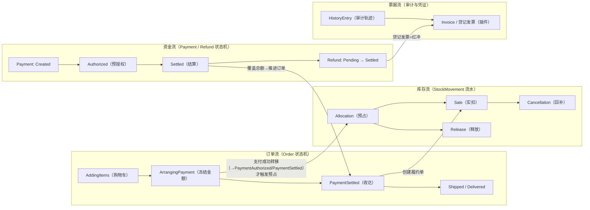
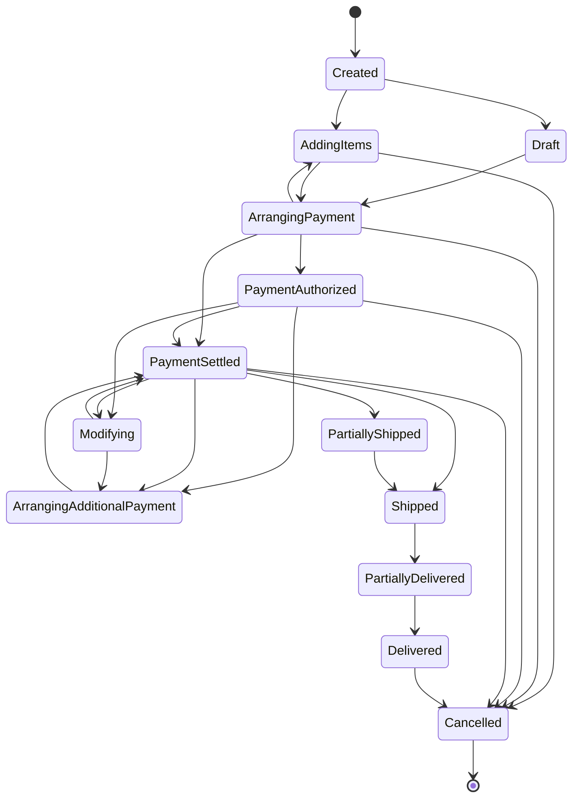
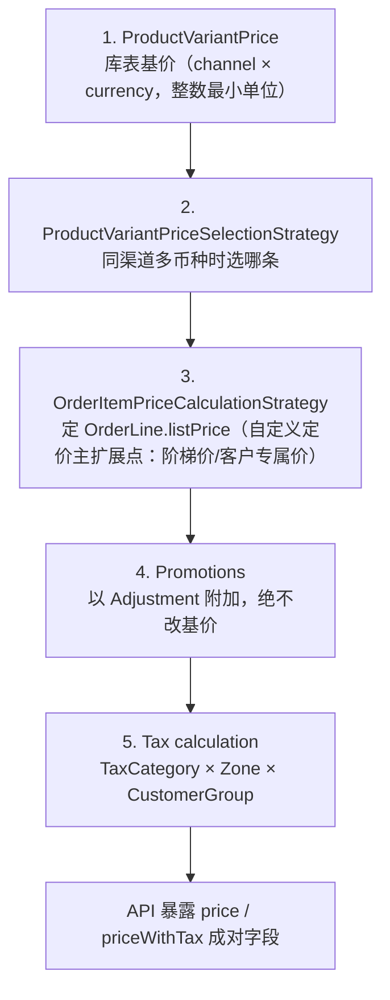

# Vendure 业务模型与流程闭环深度解析

> 版本基准：Vendure v3.7.1（2026-07 调研时点），仓库 `vendurehq/vendure`（旧 org `vendure-ecommerce` 的链接会重定向）。文中源码路径均相对 monorepo 根目录。
> 阅读前提：你做过财务系统（对账/核销/红冲），熟悉 TS/Nest，但没系统建过电商的心智模型。本文的全部类比都朝这个方向用力。
> 版本纪律：v3.0 起许可证由 MIT 改为 GPLv3 + 商业双许可（v3.0 与 v2.3 功能相同，仅许可变更）[^6^]；管理端为 React Dashboard（v3.5 转 stable，Angular Admin UI 已废弃）；支付类插件自 v3.6.0 起迁至 `@vendure-community/*`（API 不变）[^50^]；实体模型以 v3.7.1 为准，履约/退款/改单均通过 `FulfillmentLine`/`RefundLine`/`OrderModificationLine`（同属 `OrderLineReference` 族，记录 orderLineId + quantity）按**数量**引用 OrderLine。

---

## 1. 开篇：电商系统的本质是"四流合一"

### 1.1 订单流、库存流、资金流、票据流的统一视图

做财务系统出身的人第一次看电商，容易被名词淹没：购物车、履约、优惠、预授权……但剥到底，电商系统和你熟悉的制造业财务系统处理的是同一组商业事实，只是四条"流"在同一套数据上并行流动、互相勾稽：

- **订单流**：一笔交易从意向到完结的生命周期。Vendure 的载体是 `Order` 实体及其状态机（`packages/core/src/config/order/default-order-process.ts`），13 个默认状态从 `AddingItems` 一路走到 `Delivered`[^1^][^2^]。
- **资金流**：钱的收与退。载体是 `Payment` 与 `Refund` 两条**独立**状态机，挂在订单之下但不被订单状态机直接改写[^3^]。
- **库存流**：货的占与扣。载体是 `StockLevel`（物化当前值）与 `StockMovement`（流水）两张账，预占、实扣、释放、回补各有专门的流水类型[^4^]。
- **票据流**：交易的对内审计轨迹与对外凭证。Vendure 核心用 `HistoryEntry` 记录一切状态变更（审计轨迹），但刻意不含发票实体，发票由插件生态补齐（详见 §4.5）[^5^]。

四条流在少数几个关键节点交汇，而这些交汇点就是系统正确性的全部所在：



读这张图时盯住三条交汇边：**订单流在支付成功转移（ArrangingPayment→PaymentAuthorized/PaymentSettled）时触发库存预占——进入 ArrangingPayment 本身并不占库存，加购与结账过程也都不占（详见 §5.3）；资金流收讫时反向推进订单状态；履约动作把预占转为实扣**。第四条边——退款触发贷记发票——揭示了票据流是资金流的镜像。你在月度对账模块里维护的"收款流水 ↔ 发票 ↔ 红字发票"勾稽关系，在这里一一对应。后文五章，本质上就是把这张图逐块放大。

还有一个结构性观察值得放在开头：**四条流之间是"勾稽"而非"耦合"**。订单、支付、履约各自有独立状态机，任何一条都不直接改写另一条的字段——它们只在自己状态机的转移钩子里读取对方的事实（支付净额是否覆盖总额、履约是否全覆盖），再决定是否推进自己。这正是财务系统里"销售、收款、仓库三本账各自记、月末靠勾稽关系对平"的同构设计。好处是任何一条流都能独立演化（换支付网关、换 WMS、加审批节点）而不震塌其他流；代价是"一致性"不来自字段级强关联，而来自守卫（guard）与事件——这也正是对账机制在电商系统里仍然是一等工作的原因。

### 1.2 与制造业财务系统的映射表

| 财务系统概念 | Vendure 对应物 | 关键机制 |
|---|---|---|
| 销售订单（含订单行） | Order / OrderLine | 无独立购物车，未下单的订单即购物车[^24^] |
| 存货锁定/预留 | Allocation（StockMovement 子类） | `stockOnHand` 不动、`stockAllocated` 增加[^4^] |
| 收款流水单 | Payment | `transactionId` 为对账键[^41^] |
| 红冲/冲正 | Refund（挂在原 Payment 下） | 可退余额 = 原收款 − 累计已退[^43^][^48^] |
| 错账更正（补充凭证） | OrderModification + 补款/退款配平 | `priceChange` 必须被支付或退款覆盖才算核销[^34^] |
| 费用分摊 | 整单优惠按权重分摊到行（prorate） | 最大余数法保证分摊守恒[^73^] |
| 报表分组/保存的查询视图 | Collection（规则驱动动态分组） | `CollectionFilter` 运行时计算成员[^17^] |
| 辅助核算维度 | Facet / FacetValue | 可设 private，仅内部逻辑消费[^16^] |
| 多账簿/多法人 | Channel | 13+ 实体 ChannelAware，token 请求头路由[^15^] |
| 合并报表 vs 总分账 | Aggregate Order / Seller Order | marketplace 下单即拆单[^38^] |

这张表不是修辞，而是全文的阅读地图：后面每一章都在展开其中若干行。要特别强调的是映射中"形相似而神有别"的地方——财务系统里红冲通常由会计手工发起、直接影响总账；Vendure 里退款由状态机驱动、只影响支付净额而**不直接动库存**，因为"货"和"款"是两条平行明细账，各自闭环、勾稽而不耦合。再比如 Vendure 的"凭证"从不被涂改：下单时刻的价格、数量、地址都以快照字段封存，之后的任何变更都是另起新凭证（`OrderModification`）而不是改原始记录——与会计"错账更正用红冲不用橡皮"完全同构。理解这种"解耦但有守卫、改动必留痕"的设计哲学，比记住任何单个 API 都重要。

---

## 2. 商品与目录：可卖的"物"如何建模

### 2.1 四分体：为什么 Product 不挂价格

Vendure 目录的核心是四个实体：`Product`、`ProductVariant`、`ProductOptionGroup`、`ProductOption`（源码均在 `packages/core/src/entity/` 下）。其中最重要的设计决断是文档反复强调的一句："A product *does not* have a price, sku, or stock level"[^7^]——`Product`（`product/product.entity.ts`）只是变体的容器，承载名称、slug、描述、图集（`featuredAsset`/`assets`），其实现 `Translatable, HasCustomFields, ChannelAware, SoftDeletable` 四个接口；`name`/`slug`/`description` 甚至没有 `@Column()`，实体列落在翻译表（§2.4）[^8^]。

真正被加进购物车、被定价、被计税、被管库存的是 **`ProductVariant`**（`product-variant/product-variant.entity.ts`）——一个具体 SKU："When one adds items to their cart, they are adding ProductVariants, not Products"[^9^]。`ProductOptionGroup`（如"尺码"）与 `ProductOption`（如 S/M/L）是变体的生成器：一个产品挂多个选项组，各组选项的笛卡尔积决定变体集合（官方例子：3 尺码 × 2 颜色 = 最多 6 个变体）[^10^]。没有规格的单品就是 1 Product + 1 Variant 的退化形式——一个 Product **至少有一个**变体。

为什么价格不能挂在 Product 上？三层理由，层层递进：

1. **交易发生在 SKU 粒度。** Product 是面向浏览的聚合维度，而 SKU、税类（`taxCategory`）、缺货阈值（`outOfStockThreshold`）、是否跟踪库存（`trackInventory`）都天然附着在变体上[^9^]。用财务语言说：Product 是科目体系（展示与归类），ProductVariant 才是核算对象（凭证行上的承载者）——顾客买的永远是一个 SKU，不是一个 SPU。
2. **一个变体也不止一个价格。** `ProductVariant` 与 `ProductVariantPrice` 是 OneToMany，每条价格记录按 **(channelId, currencyCode)** 二维作用域[^12^]。同一变体在美国渠道 $30、英国渠道 £25，甚至同渠道内多币种多价——这正是财务系统里"同一物料按销售组织 × 币别的价目表"的关系型实现，而不是像很多 B2C 平台那样靠促销规则绕出来。
3. **运行时价格是一条管线而非一个字段。** `ProductVariant.price`/`priceWithTax` 根本不是数据库列，而是带 `@Calculated` 装饰器的 getter：`listPrice` 由 `ProductVariantPriceSelectionStrategy` 从价格集合中运行时选出，再经 `taxRateApplied` 拆税、`roundMoney()` 取整[^11^]。数据库只存基价，应用层的一切价格都是计算结果——与"凭证金额由引擎计算、不允许手填"同构。

### 2.2 价格的二维性与金额的整数纪律

`ProductVariantPrice` 的实体结构极简：`@Money() price`、`channelId`、`currencyCode`、回指 variant[^12^]。但两个细节值得财务背景读者玩味：

- **金额一律以最小货币单位的整数存储**（USD 下 `100` = $1.00），彻底规避浮点误差；GraphQL 用自定义 `Money` scalar 绕开 Int32 上限；存储与舍入策略由 `MoneyStrategy` 控制，`BigIntMoneyStrategy` 可存 bigint，`precision = 3` 可支持 B2B 大宗商品的三位小数单价[^14^]。这是每个财务系统都该有的纪律，Vendure 把它下沉到了框架层。
- **价格同步默认关闭**：某渠道改价不影响其他渠道，是否联动由 `ProductVariantPriceUpdateStrategy` 控制，`DefaultProductVariantPriceUpdateStrategy({ syncPricesAcrossChannels: true })` 才开启跨渠道同币种同步。坑：在子渠道新建的商品总会同时落到默认渠道并复制价格数值，两个渠道币种不同时需手工修正默认渠道价格，否则默认渠道的门店会显示错误币种的价格[^15^]。

把这两节合起来看，可以提炼一条贯穿全书的纪律：**任何金额字段都要先回答"它是存储事实还是派生视图"**。在 Vendure 里，存储事实只有 `ProductVariantPrice.price`（整数、按渠道与币种分行）；`price`、`priceWithTax`、`subTotal`、`total` 这些出现在 API 里的数字，全部是 `@Calculated` 运行时计算结果。这与财务系统"凭证是存储、报表是计算"的世界观完全一致——对账不平的经典成因，正是有人把派生视图当成存储事实又写回了一次。Vendure 用实体层的技术手段（`@Calculated` getter 不是数据库列）从结构上杜绝了这类错误，这是"金额正确性靠建模而非靠约定"的范例。

### 2.3 Collection vs Facet：两种组织商品的方式

| 维度 | Facet / FacetValue | Collection |
|---|---|---|
| 本质 | 商品上的结构化元数据/标签（品牌、颜色、"清仓"） | 变体的规则驱动分组（导航树、专题位） |
| 成员判定 | 人工/导入时打标，可挂 Product 或单个 Variant | 运行时由 `CollectionFilter` 动态计算 |
| 财务类比 | 辅助核算维度（部门/项目/客户） | 保存好的动态报表分组 |
| 面向顾客 | public/private 可选（private 如 "profit margin" 仅内部）[^16^] | public/private 可选，含 `position` 排序与任意层级嵌套[^17^] |

一句话分工：**Facet 回答"这个商品是什么属性"，Collection 回答"这批商品要以什么名义出现"**。Collection 的成员不是静态登记表：内置四个过滤器（`facetValueCollectionFilter`、`variantNameCollectionFilter`、`variantIdCollectionFilter`、`productIdCollectionFilter`，源码 `default-collection-filters.ts`）把每个集合变成一条保存的查询，商品打标后自动归集；子集合可通过 `inheritFilters` 继承父集合的过滤器形成子集（v2.0 引入），自定义过滤器只需继承 `CollectionFilter` 并在 `apply(qb, args)` 里向 TypeORM 查询构造器追加条件[^17^][^18^]。经验法则：可筛选属性用 Facet，目录树用 Collection（配合 facet 过滤器保持自动更新），纯内部逻辑（毛利率分层、清仓标记）用 private Facet 而非 Collection——因为 Facet 能被促销条件、运费规则、搜索聚合、报表分组同时消费，而自定义字段（§2.4）默认进不了搜索索引。官方给的 private facet 例子正是"profit margin: high/low"这种财务向内部标签[^16^]，这个细节足以说明两套机制的定位差异。

### 2.4 i18n 翻译表模式与 CustomFields 扩展

Vendure 的 i18n 是一种数据库范式选择，而非资源文件方案：实现 `Translatable` 的实体把可翻译字段声明为 `LocaleString` 类型且**不加 `@Column()`**——主表根本没有这一列；真实值落在 `xxx_translation` 子表（`languageCode` + 回指 `base` 的外键，eager 加载）[^19^]。运行时 `TranslatorService.translate()` 按 `RequestContext` 的语言把对应译行"水合"进字段，缺失即回退 Channel 的 `defaultLanguageCode`；API 消费者拿到的始终是拍平对象，看不到 translations 数组[^20^]。商品域内 Product、ProductVariant、OptionGroup、Option、Collection、Facet、FacetValue 全部可翻译，**连 slug 都按语言本地化**（利于多语言 SEO）[^8^]。类比：一套多语言科目表——科目代码语言中立，科目名称按语言分行存储。

CustomFields 则是"配置驱动的垂直扩展"：在 `vendure-config.ts` 的 `customFields` 里声明（如 `Product: [{ name: 'isbn', type: 'string' }]`），启动时四层联动——数据库加列（**必须跑 migration**，schema 变更即 DDL 变更）、GraphQL 双 API 注入字段与列表 filter/sort、Dashboard 自动生成表单控件、TypeScript 靠声明合并获得类型安全[^21^]。代价清单必须记住：list 型原语只能 `simple-json` 存储（不能参与 SQL 级过滤排序）；内置搜索插件索引不到自定义字段；TS 类型对导入顺序敏感[^21^]。经验法则：**要筛选/搜索/报表的属性用 Facet，要结构化存储的私有属性用 custom field，要参与业务关系的用自定义实体 + relation**。

**v3.6 的 OptionGroup 共享化**是一次教科书级的主数据范式迁移：v3.5 及以前 `ProductOptionGroup` 经 `productId` 外键私属于单个产品（十个产品各建一套"尺码"组，无法复用）；v3.6.0 起改为跨产品共享资源（`@ManyToMany products`）且 channel-aware，`productId` 列被 join 表取代，升级必须运行数据迁移助手 `migrateProductOptionGroupData`，否则自动生成的 DDL 会丢数据[^22^][^23^]。其动机与财务系统"把科目表从公司私有改为集团共享"完全相同：消除重复主数据，让"尺码"这类行业通用维度只维护一份。

---

## 3. 订单生命周期：无购物车实体，一切皆状态

### 3.1 十三个默认状态：购物车只是一个状态

Vendure 的第一个设计决断是**不建 Cart 实体**：购物车就是一个处于 `AddingItems` 状态、`active=true` 的 `Order`——同一张表、同一套状态机，从顾客加第一件商品一直管到签收[^1^][^24^]。每个会话（匿名或登录）至多一个 active order，Shop API 的 `addItemToOrder`/`activeOrder` 等购物车类 mutation 无需传 orderId，由会话上下文（`Session.activeOrderId`）经 `ActiveOrderStrategy` 解析——"匿名购物车"就是挂在匿名会话上的一张 `AddingItems` 订单[^24^][^40^]。

状态集合本身不是枚举，而是 TypeScript 声明合并（declaration merging）：`OrderState` 的基础类型只有 `Created/Draft/AddingItems/Cancelled`，其余 9 个状态由 `defaultOrderProcess` 通过接口合并注入，业务方可以用同样方式注入自己的状态并获得编译期类型安全[^2^][^25^]。默认流程的全量转移表（源码 `default-order-process.ts` 的 `transitions`，逐行核对未经简化）[^2^]：

| 当前状态 | 允许的下一状态 |
|---|---|
| Created | AddingItems, Draft |
| Draft | Cancelled, ArrangingPayment |
| AddingItems | ArrangingPayment, Cancelled |
| ArrangingPayment | PaymentAuthorized, PaymentSettled, AddingItems, Cancelled |
| PaymentAuthorized | PaymentSettled, Cancelled, Modifying, ArrangingAdditionalPayment |
| PaymentSettled | PartiallyShipped, Shipped, PartiallyDelivered, Delivered, Cancelled, Modifying, ArrangingAdditionalPayment |
| PartiallyShipped | Shipped, PartiallyDelivered, Cancelled, Modifying |
| Shipped | PartiallyDelivered, Delivered, Cancelled, Modifying |
| PartiallyDelivered | Delivered, Cancelled, Modifying |
| Delivered | Cancelled |
| Modifying | PaymentAuthorized, PaymentSettled, PartiallyShipped, Shipped, PartiallyDelivered, ArrangingAdditionalPayment |
| ArrangingAdditionalPayment | PaymentAuthorized, PaymentSettled, PartiallyShipped, Shipped, PartiallyDelivered, Cancelled |
| Cancelled | （唯一终态，无出口） |



这张表有三个官方简化图不会告诉你的细节。第一，`Delivered` 不是终态——`Delivered → Cancelled` 是合法转移（售后整单取消场景），`Cancelled` 才是唯一无出口状态；文档把 Delivered 称为 "final state" 是简化表述，以源码为准[^2^]。第二，`ArrangingPayment` 是**冻结闸口**：进入后不允许再改订单内容，保证发给支付网关的金额等于顾客下单时看到的金额，如需改单可合法退回 `AddingItems`[^1^]。第三，`Modifying` 与 `ArrangingAdditionalPayment` 是为售后改单准备的"旁路"，只允许从已付款/发货中的状态进入——状态机把"哪些事在什么时候可以做"写成了可校验的结构，而不是散落在 if-else 里的口头约定。其余关键语义：`Draft` 是管理员代客下单的草稿单（`active=false`，转 `ArrangingPayment` 时钩子把它置回 `true`，标准流程接管）；`PaymentAuthorized` 表示预授权（冻结额度未请款），`PaymentSettled` 表示资金实收，只有到此状态才能创建履约单；`PartiallyShipped`/`PartiallyDelivered` 只有存在多个 Fulfillment 时才可能出现[^1^][^2^]。

**"下单"时点由策略决定。** `Order.active` 与 `orderPlacedAt` 归 `OrderPlacedStrategy` 管辖，默认实现在 `ArrangingPayment → PaymentAuthorized | PaymentSettled` 这一转移上判定订单成立[^29^]。随后 `defaultOrderProcess.onTransitionEnd` 在同一事务内执行一串动作：置 `active=false`、写 `orderPlacedAt`、把每行 `quantity` 快照进 `orderPlacedQuantity`、发布 `OrderPlacedEvent`、调用 `OrderSplitter.createSellerOrders`（多卖家拆单，见 §3.4）[^2^]。`orderPlacedQuantity` 这个快照字段财务意义重大：之后改单会改 `quantity`，但快照保留，折扣与退款按比例分摊时以 `Math.max(orderPlacedQuantity, quantity)` 为除数[^31^]。连同 `initialListPrice`（加购时价格，用于展示"加购后涨价"）、`shippingAddress`（simple-json 快照而非外键）、`Order.code`（对外唯一凭证号，默认 16 位随机串），共同构成"下单时刻封存包"——之后的任何变更都是**另起新凭证而不是涂改原凭证**[^30^]。

购物车如何找到主人，是这条状态机的入口问题，链路为：`Session`（TypeORM 单表继承，匿名/登录两种子类型）上有 `activeOrderId` 字段，`DefaultActiveOrderStrategy` 按"会话上的 activeOrderId → 校验 Channel 与 active 标志 → 已登录则回退查该用户的 active 订单 → 都没有就新建"的顺序解析，最后经 `sessionService.setActiveOrder` 回写绑定[^24^][^40^]。游客不注册也能结账：`setCustomerForOrder` 经 `GuestCheckoutStrategy` 给订单挂上 Customer 记录（无登录态 User），`arrangingPaymentRequiresCustomer` 守卫只要求有 Customer 即可通过；默认不允许已注册邮箱走游客通道，防止覆盖账户资料[^40^]。这套设计让"匿名加购 → 登录 → 合并购物车（§3.4）→ 下单"成为一条无断点的流水线，而全部状态都装在同一对 `(Order.state, Order.active)` 字段里。

### 3.2 OrderProcess 状态机的三层架构与自定义配方

状态机机制分三层，每层职责单一：

1. **配置层 `OrderProcess[]`**：普通对象，声明 `transitions` 转移表与三个钩子（`onTransitionStart`/`onTransitionEnd`/`onTransitionError`），可多个叠加[^32^]。
2. **装配层 `OrderStateMachine`**（`packages/core/src/service/helpers/order-state-machine/order-state-machine.ts`）：启动时合并所有 process 的转移表（目标状态默认 concat 追加；声明 `mergeStrategy: 'replace'` 则整体替换），并校验合法性（如所有状态须可从初态到达，非法配置直接拒绝启动）；运行时 `onTransitionStart` 按序短路（任一返回 `false` 或字符串即中止），`onTransitionEnd` 全量按序执行[^27^]。
3. **通用引擎 `FSM`**（`packages/core/src/common/finite-state-machine/finite-state-machine.ts`）：Order/Payment/Fulfillment/Refund 四个状态机共用。其核心设计是**两阶段提交**：`transitionTo()` 先跑 `onTransitionStart`（返回 `false` 静默取消；返回字符串作为错误消息走 `onError`，最终抛 `IllegalOperationError`），然后在内存中改状态并**返回一个 `finalize` 回调**，把 `onTransitionEnd` 的副作用延迟到调用方决定的时机执行[^26^]。

为什么要拆成两阶段？看 `OrderService.transitionToState()`（`packages/core/src/service/services/order.service.ts` L1283–1314）就明白了：整个转移被包在 `withTransaction` 里——内存态变更、第一次保存、发布 `OrderStateTransitionEvent`、`finalize()` 执行 `onTransitionEnd`（库存分配、历史条目、`OrderPlacedStrategy` 写入、拆单）、第二次保存，**全部同生共死**[^28^]。源码注释明确引用 issue #4686：不这样做，抛错的钩子会把订单留在"状态已变但 active/orderPlacedAt 未写"的半提交态。用财务语言说，这就是"凭证、明细、总账在同一过账事务里落账"——电商系统不出现"订单显示已付款但总账没记"，靠的不是运气而是这个事务边界。

自定义状态机的标准配方三步走（以"下单前校验 EU 税号"为例）[^1^]：

```ts
// 1) 声明合并注入新状态
declare module '@vendure/core' { interface OrderStates { ValidatingCustomer: never; } }
// 2) 定义 process：把 AddingItems → ArrangingPayment 改道为 AddingItems → ValidatingCustomer → ArrangingPayment
export const customerValidationProcess: OrderProcess<'ValidatingCustomer'> = {
  transitions: {
    AddingItems: { to: ['ValidatingCustomer'], mergeStrategy: 'replace' },
    ValidatingCustomer: { to: ['ArrangingPayment', 'AddingItems'] },
  },
  async onTransitionStart(fromState, toState, data) {
    if (fromState === 'ValidatingCustomer' && toState === 'ArrangingPayment') {
      const isValid = await taxIdService.verifyTaxId(data.order.customer);
      if (!isValid) return `The tax ID is not valid`; // 返回字符串 = 拒绝转移
    }
  },
};
// 3) 注册：orderOptions.process 必须同时包含 defaultOrderProcess，否则默认状态全丢
```

第三步是最大的踩坑点（社区 Discussion #1933 即有案例[^97^]）：v2.0 把硬编码状态机抽取为默认 process 对象之后，自定义时必须显式把 `defaultOrderProcess` 放进 `orderOptions.process` 数组[^33^]。另外两个实用技巧：只想关掉某道默认守卫，不必重写 process，用 `configureDefaultOrderProcess({ arrangingPaymentRequiresShipping: false, ... })` 即可；在 `onTransitionEnd` 里要改订单**必须直接 mutate 传入的 `order` 对象**（它随后会被持久化），调用 service 方法拿到的返回值不赋值回去，改动会在最终保存时丢失——官方文档专门以 Surcharge 为例给出正误两例[^1^]。

默认守卫共 10 条，全部可通过 `configureDefaultOrderProcess` 开关，本质是**10 条可配置内控规则**[^2^][^32^]：

| 守卫选项 | 拦截点与语义 |
|---|---|
| `arrangingPaymentRequiresContents` / `…Customer` / `…Shipping` / `…Stock` | 进 `ArrangingPayment` 需有行、有 Customer、有配送方式、逐行可售库存充足 |
| `checkAllVariantsExist` | 离开 `AddingItems` 时校验所有变体/产品未被软删（转 `Cancelled` 除外——取消购物车不该被已删商品卡住） |
| `checkPaymentsCoverTotal` | 进 `PaymentAuthorized`/`PaymentSettled` 前，对应状态的支付净额须覆盖 `totalWithTax` |
| `checkAdditionalPaymentsAmount` | 离开 `ArrangingAdditionalPayment` 前重算缺口，未收齐不放行（转 `Cancelled` 豁免——补不齐款的订单仍可取消） |
| `checkModificationPayments` | 离开 `Modifying` 前，所有修改单必须 `isSettled` |
| `checkAllItemsBeforeCancel` | 除 `AddingItems`/`ArrangingPayment` 两个阶段外，转 `Cancelled` 需全部 OrderLine 已取消 |
| `checkFulfillmentStates` | 转发货/送达类状态需存在对应状态的 Fulfillment（外部 WMS 接管时可关） |

这张表值得逐行读一遍，因为它是"内控规则代码化"的完整样本：`checkPaymentsCoverTotal` 把"收款必须覆盖应收"做成转移前置条件，是**事前控制（preventive control）**而非事后对账纠错；`checkModificationPayments` 把"修改单未核销不得关账"做成状态机不变量；四条 `arrangingPaymentRequires*` 则界定了"一张合法订单的最低构成要件"。更值得注意的是关闭它们的场景——`checkFulfillmentStates: false` 用于外部 WMS、`arrangingPaymentRequiresShipping: false` 用于纯数字商品——每条开关背后都是一种业务形态，框架把"默认严格、按业务放宽"的决策权留给了你。财务直觉里"审批流的拦截点"，在这里全部代码化、可测试、可配置。

### 3.3 订单修改与手工支付配平：平台级的"红冲凭证"

售后改单是订单域财务浓度最高的环节，流程四步[^28^][^35^]：

1. 管理员把订单转入 `Modifying`（只允许从已付款/发货中状态进入）；
2. 调 `modifyOrder` mutation → `OrderModifier.modifyOrder`（`packages/core/src/service/helpers/order-modifier/order-modifier.ts`）：非 `Modifying` 状态直接报 `OrderModificationStateError`；支持增行（`addItems`，受可售库存约束）、改量（减量内部走取消逻辑释放库存）、加减 Surcharge、改地址；每个变更落一条 `OrderModificationLine`（数量可为负），汇总为一个 `OrderModification`；`dryRun: true` 可试算不落账；
3. **差额配平**：`OrderModification.priceChange`（`@Money`，可正可负）记录本次修改引起的总价变化。金额为正 → 订单转 `ArrangingAdditionalPayment`，管理员在网关收款后用 `addManualPaymentToOrder` 登记——该方法硬校验**未结清修改单的 priceChange 合计必须等于待收差额**，不等直接抛 `InternalServerError`；金额为负 → 创建 Refund 并挂到 `modification.refund`；
4. 修改单结清后（`isSettled`：`priceChange === 0` 或已关联 payment/refund），守卫 `checkModificationPayments` 才放行订单离开 `Modifying`[^34^][^2^]。

这就是"修改单—补款单—退款单"的勾稽关系被做成了平台级强制：`isSettled` 对应财务的"核销"标志，`checkModificationPayments` 守卫对应"未核销不得关账"。你在对账模块里手工维护的勾稽校验，Vendure 把它下沉为状态机的不变量——这是"业务概念 ↔ 财务概念"映射中最工整的一处。再补一个记账视角：修改单只是差额凭证，原始订单行的价格、数量快照（§3.1）始终不动；`Order.modifications` 数组就是这张订单的"补充凭证序时账"，按时间顺序完整记录了售后每一次调整的金额、责任行与结清方式，配合 `ORDER_MODIFIED` 历史条目即可还原任何时点的订单面貌。

### 3.4 Surcharge、订单合并与拆分

`Surcharge`（`entity/surcharge/surcharge.entity.ts`）是对订单总额的任意调整——既不是商品行也不是促销折扣，典型用途是支付手续费、礼品包装费、人工议价（可为负值=折扣）。实体上有独立的 `sku`、`listPrice`、`taxLines`（独立计税），可回指产生它的 `OrderModification`；增删后统一走 `applyPriceAdjustments` 全量重算税、促销与运费[^36^]。

**合并**发生在顾客带着匿名购物车登录时：`SessionService.createNewAuthenticatedSession` 同时取出匿名车的 order 与该用户既有 active order，交给 `OrderService.mergeOrders`[^40^]。实现上有三个工程细节值得学：事务内对既有订单加 `pessimistic_write` 悲观锁防并发合并（issue #4481）；合并算法由 `OrderMergeStrategy` 决定，内置四个实现（默认 `MergeOrdersStrategy`：同 variant 的行用 guest 数量覆盖 existing；另有 `UseGuestStrategy`/`UseExistingStrategy`/`UseGuestIfExistingEmptyStrategy` 三式）[^39^]；guest 单删除若触发外键冲突则**降级为取消该单并留 note 历史**——订单宁可取消也不丢审计轨迹，且合并失败整体 catch 后照常完成登录，不让边缘故障阻断主流程[^28^]。

**拆分**服务于多卖家市场（v2.0 引入）：下单转移的 `onTransitionEnd` 里，`OrderSplitter.createSellerOrders` 按 `OrderSellerStrategy.splitOrder()` 把行与运费按卖家 Channel 分组，父单置 `type = Aggregate`，每个卖家生成一张 `type = Seller` 的子单——复制订单行/运费快照（含价格、税、customFields）、独立 `code`、共享 customer、挂到卖家 Channel[^37^]。`afterSellerOrdersCreated` 钩子用来给卖家单挂平台佣金（一个 Surcharge）。聚合单与卖家单各有状态机，需自定义 OrderProcess 保持同步（如聚合单须所有卖家单都 Shipped 才能 Shipped）[^38^]。这正是"合并报表 vs 总分账"的技术形态：一套业务事实，两个记账口径，各自闭环。

---

## 4. 资金流：支付、退款与财务核销

### 4.1 Payment / PaymentMethod / Refund：一单多笔支付与覆盖核算公式

三个实体，三种角色（源码均在 `packages/core/src/entity/` 下）：

- **`Payment`**（`payment/payment.entity.ts`）= 一次与网关交互的收款流水：`method`（网关 code）、`amount`（`@Money` 整数最小货币单位）、`state`、`transactionId`（网关流水号，**与网关对账单核对的唯一对账键**）、`metadata`（simple-json，其中 `public` 子树对 Shop API 可见，用于外跳收银台 URL 等场景）[^41^]。
- **`PaymentMethod`**（`payment-method/payment-method.entity.ts`）= handler（行为定义，代码侧注册进 `paymentOptions.paymentMethodHandlers`）+ checker（资格检查器）+ args 参数实例（apiKey 等以 `ConfigurableOperation` 存库）+ Channel 绑定——不同渠道可配不同支付方式与密钥[^42^]。
- **`Refund`**（`refund/refund.entity.ts`）= 一笔红冲：`total`（v2.2 起唯一权威金额，`items`/`shipping`/`adjustment` 三字段已 deprecated）、`reason`、独立状态机（`Pending/Settled/Failed`）、以及关键的 `paymentId`——**退款挂在某一笔 Payment 下，而不是直接挂 Order**[^43^]。

"退款必须指向原收款凭证"这一设计，在一单多笔支付时显出价值。Vendure 官方支持 split tender（拆分支付/部分支付后补款）：`addPaymentToOrder` 每次计算的应付额是 `amountToPay = order.totalWithTax - totalCoveredByPayments(order)`，即剩余未覆盖金额[^28^][^45^]。覆盖判定函数在 `packages/core/src/service/helpers/utils/order-utils.ts`：

```ts
totalCoveredByPayments = Σ( payment.amount − |Σ 该笔 state==='Settled' 的 Refund.total| )
orderTotalIsCovered  = totalCoveredByPayments ≥ order.totalWithTax
```

[^44^]

这个公式既是订单状态推进的依据（`defaultPaymentProcess` 的 `onTransitionEnd` 据此自动把订单转到 `PaymentAuthorized`/`PaymentSettled`），也是"订单是否收讫"的财务判定式[^51^]。注意它扣的是**已 Settled 的退款**——Pending/Failed 的红冲不影响实收净额，与财务"未核销的红字凭证不影响余额"完全一致。另一个容易漏读的维度是 **Payment 状态过滤**：函数签名是 `totalCoveredByPayments(order, state?)`，只累计指定状态的 Payment，`state` 缺省时排除 `Error`/`Declined`/`Cancelled` 三类失败支付——`defaultPaymentProcess` 正是靠这个参数区分两档判定：净额被 `['Authorized','Settled']` 覆盖进 `PaymentAuthorized`，被 `Settled` 全额覆盖才进 `PaymentSettled`[^44^]。该设计可追溯到 2018 年的架构 issue #36："A Payment represents an amount paid towards the Order total… might not [equal it] in the case that multiple payments are made for a single Order"[^46^]。

Payment 自身的状态机同样由 `defaultPaymentProcess` 定义：`Created → Authorized | Settled | Declined | Error | Cancelled`，其中 `Authorized → Settled | Error | Cancelled`，`Cancelled` 是唯一终态[^51^]。语义细节：`Declined` 是业务性失败（拒付），`Error` 是技术性异常，两者在 Shop API 分别映射为 `PaymentDeclinedError`/`PaymentFailedError` 返回给前台；每次迁移写 `ORDER_PAYMENT_TRANSITION` 订单历史并发布 `PaymentStateTransitionEvent`——后者正是财务系统订阅资金流的最佳挂点。与订单状态机一样，Payment 的状态集合也是声明合并可扩展的（官方示例加了 `Validating` 态），四条状态机共享同一个 `FSM` 引擎——§3.2 学到的全部机制在这里原样复用。

### 4.2 PaymentHandler 生命周期：四个函数与一次"危险"的网络调用

支付集成点收敛为一个接口 `PaymentMethodHandler`（`packages/core/src/config/payment/payment-method-handler.ts`，继承 `ConfigurableOperationDef`）[^47^]：

| 函数 | 触发时机 | 语义要点 |
|---|---|---|
| `createPayment`（必选） | `addPaymentToOrder` mutation | 返回 `state: 'Settled'`=单步（即时扣款）；`'Authorized'`=两步（先预授权）；`Declined`/`Error`=失败 |
| `settlePayment`（必选） | Admin `settlePayment` | **签名没有 amount 参数**——核心不建模部分结算金额 |
| `cancelPayment`（可选，v1.7+） | Admin `cancelPayment` | 网关侧作废未完成的 intent / 释放预授权；handler 未实现则视为成功直接转 `Cancelled` |
| `createRefund`（可选） | `refundOrder` | 未实现则 Refund 停留 `Pending`，管理员在网关后台手工退款后用 `settleRefund` 核销登记 |

这张表是 Vendure 支付集成的全部知识地图。`SettlePaymentFn` 无 amount 参数意味着"少收"的正规路径只有两条：先改单把 `totalWithTax` 降下来再结算，或结算后退款；多笔 Payment 拆分收款才是核心提供的"部分支付"模型[^47^]。`createRefund` 可省略这一点，则把"退款申请单/退款核销单"两单制做成了一等公民：Refund 的 `Pending` 态就是"指令已发、待网关或线下完成"，`settleRefund` 登记 `transactionId` 后转 `Settled` 才算核销，`Failed` 不计入已退额、可重新发起[^43^][^48^]。

`PaymentService.createPayment()` 里藏着整个支付体系最危险的一段代码：handler 的网关调用**刻意放在数据库事务外**（网络调用不能长占事务），随后才在 `withTransaction` 内建 Payment、迁移状态、关联订单、发事件、finalize 联动订单状态。源码注释直言：若网关扣款成功但后续 DB 写失败，会产生**孤儿扣款（orphaned charge），"must be reconciled at a higher level"**[^48^]。这正是对账模块该补位的地方——订阅 `PaymentStateTransitionEvent`，按 `transactionId` 与网关流水核对，孤儿扣款无所遁形。

官方插件给出了两种范式（v3.6.0 起迁至 `@vendure-community/*`，API 不变[^50^]）：**Stripe** 是 webhook 驱动的单步流——`createStripePaymentIntent` 用幂等键 `${order.code}_${amount}` 防重复 Intent，支付成功后 Stripe 回调验签、以 admin 上下文调 `addPaymentToOrder`，handler 直接返回 `state: 'Settled'` 与 `transactionId: paymentIntent.id`[^49^]；**Mollie** 支持两步流（Klarna 等 pay-later 先 `Authorized`，发货后 `settlePayment` 调 capture API 并轮询确认）。托管收银台类网关的通用模式是自建 Controller 接收回跳、验签后透传 metadata，handler 几乎不做逻辑[^3^]。

### 4.3 授权 vs 结算：收入确认时点的系统表达

官方定义干净利落：Authorization 联系发卡行确认交易可用、**此时不发生资金划转**（仅冻结额度）；Settlement（capture）才是资金真正从买家账户划转给商户[^3^]。财务映射几乎一对一：`Authorized` ≈ 预授权冻结（不应确认实收），`Settled` ≈ 现金流入确认点。Vendure 把后续履约锚定在 `PaymentSettled` 之后（此时才能创建 Fulfillment），等于把"收款确认先于发货"做成了默认内控。这套两阶段语义对非卡支付同样成立——货到付款就是"下单=授权、签收=结算"。

订单级的 `PaymentAuthorized`/`PaymentSettled` 是**聚合状态**而非单笔 Payment 状态的复制：多笔 Payment 可混合 Authorized/Settled，只有净额全部被 Settled 覆盖后订单才进 `PaymentSettled`（`default-payment-process.ts` 的 `onTransitionEnd` 逐次重算 `orderTotalIsCovered`）[^51^]。配套守卫在订单侧：`checkPaymentsCoverTotal` 拦截未覆盖时的状态推进，`checkAdditionalPaymentsAmount` 在补款场景重算缺口（`totalWithTax − totalCoveredByPayments`）[^2^]。

三个边界情况必须在设计时就想清楚：

1. **预授权没有内置过期**。`defaultPaymentProcess` 的全部迁移都是事件驱动，`Authorized` 可无限期停留，直到人工/集成触发 `settlePayment` 或 `cancelPayment`；过期窗口由网关侧决定（卡组织通常约 7 天），过期后 capture 失败、Payment 落 `Error` 并记 `errorMessage`。结论：把"Authorized 超龄未结算"做成自建巡检（定时任务扫状态 + 事件告警），Vendure 不代办[^51^][^47^]。
2. **孤儿扣款与 webhook 延迟**是支付事实与系统事实之间的两类缝隙：前者靠对账任务弥补，后者靠插件提供的 `sync*` 兜底（如 Mollie 的 `syncMolliePaymentStatus`）[^48^]。
3. **并发防护**在支付入口：`addPaymentToOrder` 内对所有优惠券重校验并给 Promotion 行加悲观写锁，串行化并发结账，`usageLimit: 1` 的券不可能被两单同时用掉；若券在支付窗口期失效且总额变高，返回 `CouponRemovedDuringCheckoutError`（含前后两个总额）而不是按新价多收钱[^28^][^53^]。源码注释还坦诚记录了数据库差异：Postgres（READ COMMITTED）下并发抢券是 last-wins，MySQL（REPEATABLE READ）下是 zero-winners[^28^]。
4. **`ArrangingAdditionalPayment` 悬挂**：托管收银台场景下，顾客可能在支付页未关闭时另开标签页加购，订单金额变化后落入补款状态并卡住。前端确认页必须检测该状态并引导再次支付——这是"订单冻结闸口"与"多标签页现实"之间不可避免的张力，官方 Mollie 文档专门提示了这一边界[^96^]。

### 4.4 退款校验链：跨 Payment 拆分红冲，资金与库存解耦

`OrderService.refundOrder` 的校验链（`packages/core/src/service/services/order.service.ts`）按序拦截：无行无金额 → `NothingToRefundError`；行跨订单 → `MultipleOrderError`；payment 与行不属于同一订单 → `PaymentOrderMismatchError`；**订单处于 `AddingItems`/`ArrangingPayment`/`PaymentAuthorized` → `RefundOrderStateError`**——只有钱真的扣了（Settled 之后）才谈得上退款，之前只能取消[^28^]。

金额侧的默认规则（`PaymentService.createRefund`，`packages/core/src/service/services/payment.service.ts`）[^48^]：

- **单笔可退上限**：`refundableAmount = payment.amount − Σ(非 Failed 的 refunds.total)`，超出返回 `RefundAmountError`（附 `maximumRefundable`）——"红冲总额不得超原收款单"；
- **跨凭证拆分**：指定 Payment 余额不足时，do/while 循环自动把差额摊到订单内其他仍有可退余额的 Payment 上，逐笔创建 Refund——"一张收款单多次红冲、不够就冲下一张"的自动化；
- **金额来源**：v2.2 起推荐直接传 `RefundOrderInput.amount`（核心只认这个数）；按行→金额的换算（数量 × 分摊后含税单价 `proratedUnitPriceWithTax`）是调用方的职责——财务集成时应自行从 OrderLine 的分摊价算退款额再传入，口径由你掌控；
- 每笔 Refund 创建时调对应 handler 的 `createRefund` 真实向网关发起退款；未实现则停留 `Pending` 走手工核销路径（§4.2）。

**退款 ≠ 退货**。退款是纯资金操作，不动任何库存；库存回补只发生在取消流程（`OrderModifier.cancelOrderByOrderLines` 对已履约行建 `Cancellation`、对已预占未履约行建 `Release`，见 §5.2）。官方用户指南原话："Cancellations and refunds are often done together, but do not have to be. For example, you may refund a faulty item without requiring the customer to return it."[^52^] 货与款两条平行明细账，各自闭环、勾稽而不耦合——财务建模时不要假设退款必然伴随入库。

### 4.5 发票缺位与社区方案：贷记发票 = 红冲

Vendure 核心**刻意不含发票模型**：实体目录无 Invoice，官方文档无核心发票概念，只提供 Order/Payment/Refund/OrderModification 与事件总线，把票据流留给插件生态。主流方案是 Pinelab 发票插件（`@pinelab/pinelab-invoice-plugin`），其设计对中国财务读者近乎"母语"[^5^]：

- 下单时自动生成 PDF 发票（Handlebars 模板），增量发票号可自定义规则；
- **贷记发票（credit invoice）= 红冲**：重开发票时默认先生成贷记发票——金额取反（$100 → −$100）、携带 `originalInvoiceNumber` 引用原票、`isCreditInvoice` 标志位，正是多数辖区红冲的合规要件；
- `InvoiceCreatedEvent`（含 `previousInvoice`/`creditInvoice`/`newInvoice`）可挂邮件与外部账务推送；
- 内置 `XeroUKExportStrategy`：可为运费/销售分别指定科目代码、按 Channel 限定导出范围，贷记票自动生成 credit note 引用。

不自建插件时的通用抓手：订阅 EventBus 的 `PaymentStateTransitionEvent`、`RefundStateTransitionEvent`、`RefundEvent('created')`，把支付/退款流水映射为应收与核销凭证；订单历史（`ORDER_PAYMENT_TRANSITION`/`ORDER_REFUND_TRANSITION`/`ORDER_MODIFIED`）天然就是审计轨迹[^28^]。

---

## 5. 履约与库存：实物流的建模

### 5.1 Fulfillment 状态机与一单多履约

`Fulfillment` 是"订单商品实际交付给客户"的记录，与 `ShippingMethod` 相关但分离：后者在结账时决定"怎么送、收多少钱"（checker 资格 + calculator 运费 + fulfillmentHandlerCode 三件套），前者是下单付款之后的实际交付记录；数字商品（下载链接、许可证密钥）同样用 Fulfillment 建模[^54^]。实体极简：`state`、`trackingCode`、`method`、`handlerCode`、`lines: FulfillmentLine[]`，以及与 Order 的 ManyToMany（v2 起一张 fulfillment 可跨多张拆分子单，服务 marketplace 场景）。

ShippingMethod 一侧有一个值得借鉴的性能设计：`ShippingEligibilityChecker`（`config/shipping-method/shipping-eligibility-checker.ts`）可选实现 `shouldRunCheck()`——因为 ShippingMethod 一旦指派到订单，**订单每次变动都会重跑资格检查**，而 checker 可能调用第三方运费 API；`shouldRunCheck` 返回的 JSON 经 sha1 哈希后由 `CacheService` 缓存（TTL 5 小时），结果未变就跳过昂贵的 `check()`[^54^]。这是"规则引擎 + 内容寻址缓存"的组合，你在对账系统里给外部接口做去重调用时可以直接照搬。

默认状态机（`default-fulfillment-process.ts`）：`Created → Pending → Shipped → Delivered`，各非终态可转 `Cancelled`；可用 `customFulfillmentProcess` 插入自定义状态（如在 Pending 与 Shipped 之间加 Packed）[^55^]。`FulfillmentHandler` 是集成点：`createFulfillment()` 可调用承运商 API 出面单；`onFulfillmentTransition()` 钩子在每次状态变化前执行——返回 `false` 或字符串可**否决**迁移（先问集成方再落账）[^54^][^55^]。

框架自带的默认处理器是 `manualFulfillmentHandler`：它不做任何外部调用，仅登记 `trackingCode` 与 `method`——语义是"仓库人员线下拣货打包后，在 Dashboard 手工建履约单、填快递单号"。默认实现的存在本身就是框架立场：**Fulfillment 首先是一笔事实登记账，集成只是可选增强**——手工履约与接承运商的高级流程走同一状态机与订单联动，账目形态完全一致。创建入口 `FulfillmentService.create()` 按 ShippingMethod 上的 `fulfillmentHandlerCode` 到 `shippingOptions.fulfillmentHandlers` 注册表查找处理器，找不到直接返回 `InvalidFulfillmentHandlerError`——`handlerCode` 是"结账时选配送方式"与"发货时找处理器"之间的唯一纽带，配错码要到履约创建时才暴露[^98^]。接承运商时，自定义 handler 在 `createFulfillment()` 里调 API 出面单、把单号写回 `trackingCode`，在 `onFulfillmentTransition()` 里发邮件或触发 webhook 通知顾客；数字商品的"发货"（下载链接、许可证密钥）也收敛在同一接口内[^54^]。每次迁移还会发布 `FulfillmentStateTransitionEvent`——物流跟踪回写、发货通知都挂在事件总线上，而不是塞进 handler 内部[^98^]。对没有开放 API 的小型承运商，`manualFulfillmentHandler` 就是终态而非过渡方案：状态机、历史条目与订单联动一样不少，缺的只是面单自动化。

一单多履约是常态而非特例：每个 Fulfillment 用 `FulfillmentLine { orderLineId, quantity }` 精确记录覆盖哪些行、各多少件，多仓发货、部分缺货分次发都靠它。防重复履约由 `OrderService.createFulfillment()` 中的 `requestedFulfillmentQuantityExceedsLineQuantity()` 保证——汇总该行所有非 Cancelled fulfillment 的数量，超出未履约余量即返回 `ItemsAlreadyFulfilledError`[^28^]。

**订单状态是履约状态的函数**。`defaultFulfillmentProcess.onTransitionEnd` 在 fulfillment 转 `Shipped` 后重新加载订单全部 fulfillments：所有行都已发 → 订单转 `Shipped`，否则 → `PartiallyShipped`；`Delivered`/`PartiallyDelivered` 同理。且 `transitionOrderIfStateAvailable` 只在目标状态存在于订单当前 nextStates 时才转移——**状态机合法性优先于业务推导**[^55^]。反向地，订单侧 `checkFulfillmentStates` 守卫禁止"没有对应 Fulfillment 就硬转 Shipped"；外部 WMS（如 Picqer 插件）接管履约时，官方要求把它关掉[^66^]。另记住一个时点：库存实扣流水 `Sale` 发生在 Fulfillment `Created → Pending` 的转移钩子里（§5.3）。

### 5.2 库存双账：onHand vs allocated，流水与当前值分离

Vendure 库存是经典的"流水账 + 物化当前值"双结构，与你熟悉的存货核算同构：

- **`StockLevel`**（`entity/stock-level/stock-level.entity.ts`）：`(productVariantId, stockLocationId)` 唯一索引，只有两个数值列——`stockOnHand`（现存量）与 `stockAllocated`（已预占量）[^56^]；
- **`StockMovement`**（`entity/stock-movement/`）：抽象基类 + TypeORM 单表继承（discriminator 列区分类型），五个子类各司其职，每次变动发布 `StockMovementEvent`[^57^]。

| 流水类型 | 触发时点 | 账务影响 | 财务类比 |
|---|---|---|---|
| Allocation | 下单（支付授权/结算） | `stockAllocated` ↑ | 存货锁定/预留 |
| Sale | Fulfillment Created→Pending | `stockAllocated` ↓ 且 `stockOnHand` ↓（quantity 存负值） | 出库结转 |
| Release | 取消已预占未履约的行 | `stockAllocated` ↓ | 解锁预留 |
| Cancellation | 取消已履约的行（退货） | `stockOnHand` ↑ | 退库红字 |
| StockAdjustment | 人工调整 | `stockOnHand` ± | 盘盈盘亏 |

这套双账的精妙在于**"已售未发"被显式建模**：可售量公式 `saleable = stockOnHand − stockAllocated − outOfStockThreshold`（`ProductVariantService.getSaleableStockLevel()`，`service/services/product-variant.service.ts` L323–341）[^58^]。取消订单时因此可以精确区分两种回补——`OrderModifier.cancelOrderByOrderLines` 按每行的库存流水净额判定：`ΣAllocation + ΣSale(负) − ΣRelease > 0` 的部分走 Release（只释放预占），已履约净额 > 0 的部分走 Cancellation（回补现货），绝不重复回补[^35^]。Fulfillment 整体取消时则先建 Cancellation 再建等量 Allocation——货没发出去但订单仍有效，库存回到"已预占待发"态[^55^]。`trackInventory` 可在全局（Channel 级）或变体级（`GlobalFlag` 三态：INHERIT/TRUE/FALSE）关闭，关闭后 saleable 直接返回 `Number.MAX_SAFE_INTEGER`，即完全不校验[^58^]。

### 5.3 预占 vs 实扣：两个可替换的时点策略

两个关键时点都由策略钩子控制，这是被低估的设计空间：

- **预占时点**：`StockAllocationStrategy.shouldAllocateStock(ctx, fromState, toState, order)`，订单每次状态迁移都会询问；默认实现只在 `ArrangingPayment → PaymentAuthorized | PaymentSettled` 时返回 true——**支付成功才占库存，加购/结账过程不占**[^59^]。想做成"加入购物车即占"（票务系统式座位预留，需配过期释放）只需自定义这个策略，框架把决策点完整留给业务方。
- **实扣时点**：`defaultFulfillmentProcess.onTransitionEnd` 在 Fulfillment `Created → Pending` 时调 `createSalesForOrder`，Allocation 转 Sale，`stockOnHand` 才真正减少[^55^]。

默认选择的理由很现实：购物车占库存会被恶意锁货（还得配 TTL/释放机制），而"支付成功才占"把资源冲突窗口压缩到支付回调瞬间。另一个可调旋钮是 `outOfStockThreshold`：设为**负数**时 saleable 恒为正余量，物理无货也能继续卖——这就是 backorder；配套闸门是履约时 `ensureSufficientStockForFulfillment()` 要求 `stockOnHand` 充足，货不补齐发不了货——"可卖不可发"的半开状态。同一个库存模型同时服务严格现货与超卖预售两种商业模式，区别仅在闸门口径（saleable vs onHand）[^4^][^28^]。

### 5.4 超卖三道软闸门与 #3508 的真相

防超卖链条按环节排布：店面展示层（`StockDisplayStrategy` 只暴露 IN_STOCK/OUT_OF_STOCK/LOW_STOCK 三态，不泄露精确库存）→ 加购/改数量层（`OrderModifier.constrainQuantityToSaleable` 按 saleable 向下修正，修正为 0 抛 `InsufficientStockError`）→ 支付完成层（Allocation 把已售未发量从可售池扣掉，**这是主机制**）→ 履约层（`ensureSufficientStockForFulfillment` 闸住现货不足的发货，返回 `InsufficientStockOnHandError`）[^4^][^35^][^28^]。

但必须直面真相：**Vendure 核心的库存读写不是并发安全的**。`StockLevelService.updateStockOnHandForLocation`（`service/services/stock-level.service.ts` L86–137）是先 `findOne` 读出当前值、再 `update(id, { stockOnHand: 旧值 + change })` 的 read-modify-write——两条 SQL、无行锁、无版本号；加购校验与预占发生在不同请求（校验在 addItemToOrder，预占在支付回调），中间隔着整个支付窗口期（典型 TOCTOU 竞态）；而 `createAllocationsForOrderLines` 只做 `stockAllocated` 自增、不再复核可用量[^60^]。GitHub Issue **#3508**（v3.2.2 + Postgres）实测复现：库存 1 件时两个并发 checkout 均成功、库存变负，报告原话 "There is no queueing or locking mechanism to prevent concurrent checkouts from overselling"[^61^]。

这不是疏忽而是取舍：Vendure 在队列抢占、订单合并处用了悲观锁，却在库存扣减处留白——高并发商城宁可超卖后补偿，不愿全链路串行化。框架给的兜底工具是：`@Transaction()` 装饰器支持显式隔离级别（含 `SERIALIZABLE`，v2.0 起）[^62^]；可自定义 `StockLocationStrategy.forAllocation` 内加 `pessimistic_write` 锁后复核；或干脆关闭 `trackInventory`、以外部 WMS 为准（Picqer 模式）。工程教训可以直接迁移到你的系统：**校验必须紧贴资源占有点**（如原子表达式 `UPDATE ... SET allocated = allocated + n WHERE on_hand - allocated >= n` 并检查 affected rows），跨请求的长流程不能指望单事务隔离兜底——把最终闸口设在状态机迁移点，Vendure 的履约前校验正是这个思路。

### 5.5 多仓 StockLocation 与选仓策略

v2.0 重构库存模型引入 `StockLocation`（仓库/门店，ChannelAware）+ `StockLevel` + 策略 API；v3.1 起默认策略换为 `MultiChannelStockLocationStrategy`——只对关联到当前 Channel 的仓计算可用量与预占，旧行为可用 `DefaultStockLocationStrategy`（假设单仓）找回[^64^][^65^]。回看版本沿革更能理解这套抽象的必然性：v1 的库存只是 ProductVariant 上的一个数字，多仓无从谈起；v2.0 拆成"变体 × 位置"的二维模型后才有了选仓问题。`MultiChannelStockLocationStrategy` 在渠道过滤之外还尊重变体级 `trackInventory` 与 `outOfStockThreshold`，且一个渠道的秒杀不会吃掉另一渠道的账面库存——这对"自营商城 + Amazon 店共用一套主数据"的多渠道商家是硬需求[^65^]。`StockLocationStrategy`（`config/catalog/stock-location-strategy.ts`）把"选仓"做成**五个动词而非一个查询**：`getAvailableStock`、`forAllocation`、`forRelease`、`forSale`、`forCancellation`——预占、实扣、释放、回补各自可选不同的仓（如预占选最近仓、取消回补选原仓），`forAllocation` 返回 `LocationWithQuantity[]`，支持一单从多仓分拆预占[^63^]。五个动词里最容易被低估的是 `getAvailableStock(ctx, productVariantId, stockLevels)`：它把各仓 `StockLevel` 汇总成 `{ stockOnHand, stockAllocated }`，正是 §5.2 saleable 公式的上游——改它就能改变"可卖量"的口径。`StockLocationService.getAllocationLocations` 等服务方法本身不做决策，取出候选仓后全部委托给策略，典型自定义逻辑是就近发货、最大库存仓优先、运费最优[^63^]。外部 WMS 场景（Picqer 模式）则以 WMS 为库存真源、忽略 Vendure 内部 allocated，同样靠自定义策略控制可用量口径[^66^]。记账层面同样完备：每条 StockMovement 流水都带 `stockLocation` 外键，一单从多仓分拆预占后，实扣、释放、回补都按仓逐笔落流水——分仓对账不需要另建维度表，流水表本身就是分仓明细账[^57^]。多仓系统的难点不在"分仓存数"，而在每条库存变动路径都要回答"动哪个仓"——策略接口覆盖全部变动类型的完备性，比选仓算法本身更重要。

---

## 6. 促销与定价管线：优惠为什么是财务难题

### 6.1 Promotion = conditions + actions

官方定义一句话："A Promotion consists of conditions and actions"——conditions 决定促销是否应用，actions 决定促销如何修改订单[^67^]。外层还有三类约束：排期窗口（`startsAt`/`endsAt`）、券码（`couponCode`，需经 Shop API `applyCouponCode` 激活）、用量上限（全局 `usageLimit` 与每客 `perCustomerUsageLimit` 两条线）。硬性校验：促销必须至少有 1 个券码或 1 个 condition（否则 `PromotionService` 返回 `MissingConditionsError`），且至少有一个 action[^67^][^69^]。

`conditions`/`actions` 在数据库里是 `simple-json` 列存的 `ConfigurableOperation[]`（`{code, args}` 结构）——**运行时可配置的代码块引用**，管理员在 Dashboard 改参数不用发版。这正是 ConfigurableOperationDef 通用语言（与 PaymentHandler、ShippingCalculator、CollectionFilter 同一套机制）的又一次复用[^68^]。`PromotionCondition` 类（`config/promotion/promotion-condition.ts`）的核心是 `check(ctx, order, args, promotion)`，可返回 boolean 或状态对象[^71^]。`Promotion.test()` 的评估语义：过期/未开始 → false；券码不匹配（大小写不敏感，v3.7.0 起正式统一）→ false；逐个跑 condition 的 `check()`，任一失败 → false；condition 返回的状态对象收集为 `PromotionState`，传给依赖它的 action——内置范例是买 X 赠 Y：condition 算出 `{ freeItemsPerLine }`（按单价升序，优先免费送便宜的那行），action 直接消费[^68^]。

Action 有四种类型，对应四个作用层级（`config/promotion/promotion-action.ts`）[^70^]：`PromotionItemAction`（行内按件，返回每件负折扣，框架 `roundMoney(amount, quantity)` 乘数量取整）、`PromotionLineAction`（行内按行，与数量无关）、`PromotionOrderAction`（整单，之后被分摊到各行，见 §6.3）、`PromotionShippingAction`（运费）。内置 7 个 action、5 个 condition；自定义就是 new 一个实例挂到 `promotionOptions`（与 defaults 合并），需要访问数据库/其他 provider 时实现 `init(injector)` 钩子[^67^]。

券码本身不打折，它只是 `Promotion.test()` 的一道闸门。`applyCouponCode` 的完整链路（`OrderService.applyCouponCode()`）是：幂等检查（已在 `order.couponCodes` 中直接返回）→ `PromotionService.validateCouponCode()` 做大小写不敏感的库表查找（v3.7.0 起正式不敏感），失败按序返回 `CouponCodeInvalidError`（不存在/未启用/不在本渠道）、`CouponCodeExpiredError`、`CouponCodeLimitError`（触达每客或全局用量上限，按历史订单数统计）→ 通过后把**规范大小写**的码存入订单、写历史、发 `CouponCodeEvent`、全量重算价格[^69^][^28^]。注意"贴码"与"生效"是两步：贴码只让促销进入候选集，是否生效仍由 conditions 决定——这为"一张订单贴多张券、系统自动选可用的组合"留出了空间。

多促销叠加有两个规则必须刻进脑子。其一，**没有排他标志**——默认所有满足条件的促销全部叠加。其二，**顺序敏感且由 `priorityScore` 控制**：score = 该促销所有 conditions/actions 的 `priorityValue` 之和，升序应用。官方实体 JSDoc 给出的动机例子是"买一送一"与"满 $50 打 9 折"——若 9 折先评估，即使赠品随后把金额拉到 $50 以下，折扣也已触发；所以内置 `minimumOrderAmount` condition 特意声明 `priorityValue: 10`，把金额门槛判断推到序列尾部[^82^][^83^]。执行层面，`OrderCalculator` 做的是**串行的 test→apply→重算总额→再 test** 管线：行级促销逐行逐促销重新 `test()`（前面的促销可能已改变订单使后面的不再适用），整单促销每应用一个就 `calculateOrderTotals()` 再测下一个[^72^]。财务含义：报表上的"折扣总额"不是一组独立折扣之和，而是顺序管线的输出；审计归因靠 `Adjustment.adjustmentSource`（如 `PROMOTION:42`）逐条追溯到活动。

### 6.2 价格计算五阶段管线

Vendure 不存"最终价"，价格是一条多级管线（官方 Pricing 文档明列五阶段）[^13^]：



订单侧的执行入口是 `OrderService.applyPriceAdjustments()`（`service/services/order.service.ts`）→ `OrderCalculator.applyPriceAdjustments()`（`service/helpers/order-calculator/order-calculator.ts`），其内部顺序比五阶段更细：确定税区（`TaxZoneStrategy`）→ 对更新的行算税（税基 = 分摊后单价）→ 算总额 → **应用促销（先行级再整单级）→ 若促销改变了 subTotal 则全行重算一遍税**（源码注释：promotions may have altered the unit prices, which in turn will alter the tax payable）→ 应用运费与运费促销 → 最终 `calculateOrderTotals()`[^72^]。"先算税、打完折再重算税"这个看似低效的回路，正是 issue #573 确立的税务原则：**折扣作用于税前净价，税在最后按折后价计征**[^76^]。每次改单（加行、改量、贴券、改运费）都会全量重跑这条管线；进入 `ArrangingPayment` 后订单冻结，保证发给网关的金额与顾客看到的一致——促销重算只发生在购物车阶段与管理员改单时[^1^]。

对账读者还需知道一个版本细节：v3.1 把 `DefaultMoneyStrategy.round()` 从 `Math.round(value) * quantity` 改为 `Math.round(value * quantity)`——先取整再乘数量与先乘数量再取整，在多件商品下结果可能差 1 分钱，官方将其标记为技术性 breaking change[^95^]。这提醒你：做电商侧与财务侧对账时，**四舍五入的口径（按件取整还是按行取整）必须双方对齐**，否则月末总有几分钱对不平——这不是 bug，是口径。

### 6.3 优惠分摊：最大余数法守恒与部分退款的陷阱

整单（Order-level）优惠必须分摊到行，才能回答三个财务问题：退一件商品退多少钱、每行的税基是多少、发票行项目怎么开。`OrderCalculator.applyOrderPromotions()` 的算法[^72^]：

1. **定权重**：默认策略 `DefaultOrderLineDiscountDistributionStrategy.getWeight()` 返回 `line.proratedLinePriceWithTax`（已扣行内优惠的含税行价），数量为 0 的已取消行权重为 0——按各行折后金额占比分摊，贵的行多摊[^77^]；
2. **行间分摊**：`prorate(weights, amount)` 把整单折扣额按权重拆到各行，落为 `Adjustment`（`type: DISTRIBUTED_ORDER_PROMOTION`，与行内促销的 `PROMOTION` 类型区分）；
3. **行内搭件分摊**：行内再按 `unitPrice` 等权做二次 `prorate`，结果存进 adjustment 的 `data.itemDistribution`；
4. **取整守恒**：`prorate()`（`service/helpers/order-calculator/prorate.ts`）先对每份 `Math.floor`，再按误差从大到小逐个 +1（**最大余数法**），直到 `Σrounded == amount`——分摊之和精确等于整单优惠总额，不多一分不少一分；代价是 1 分钱级尾差确定性地落在"误差最大"的那一行[^73^]。

这与你做费用分摊时"尾差挂最大项"的规则异曲同工，但 Vendure 把它做成了确定性算法——**尾差落在哪一行必须有确定规则，否则两次计算结果不一致，对账会打架**。分摊结果沉淀为 OrderLine 的价格梯度族[^31^][^74^]：

| 字段 | 含义 | 用途 |
|---|---|---|
| `unitPrice(WithTax)` | 单价，不含任何折扣 | 挂牌价展示 |
| `discountedUnitPrice` / `discountedLinePrice(WithTax)` | 含行内折扣、不含整单分摊 | "展示给客户看的价格" |
| `proratedUnitPrice` / `proratedLinePrice(WithTax)` | 行内折扣 + 整单分摊全扣 | **税基与退款计算的"真实经济价值"** |

源码注释给 `proratedUnitPrice` 的定位是 "the true economic value of the OrderLine, and is used in tax and refund calculations"[^31^]。它向下锚定了两个关键计算：**税基**——`DefaultTaxLineCalculationStrategy.calculate()` 直接返回 `applicableTaxRate.apply(orderLine.proratedUnitPrice)`，税随分摊走，分摊口径错则税额系统性出错[^75^]；**退款**——`PaymentService.getRefundAmount()` 的按行算法是 `quantity × proratedUnitPriceWithTax`（payment.service.ts L511），客户退掉一行，退的是"标价 − 行内折扣 − 该行摊到的整单折扣"，整单优惠中摊到这一行的那部分，退款时拿不回来[^48^]。反面案例值得讲给每个做电商的人听：若按标价退，一张"满 1000 减 200"的订单，客户退掉大部分商品等于白拿整单优惠——这是退款欺诈的经典漏洞。另有负价格保护：`OrderLine.addAdjustment()` 会把折扣钳制在不使单价为负[^31^]。

最后是这个领域最真实的工程-财务冲突：**促销在每次订单变更时全量重估**（`order.promotions = []` 后重跑全部促销）。某行被取消后权重归 0，它原来承担的整单折扣份额会**重新分配给留存行**——对无门槛整单优惠，这意味着部分退款让订单总额减少得比退款额还多（issue #4811 的实质；#3098 记录了 10% 整单折扣在改量后重分摊与直觉不符的案例）[^77^][^79^]。财务后果：贷记单与原发票对不上。为此 v3.7.0 把分摊权重抽成可替换策略 `OrderLineDiscountDistributionStrategy`（PR #4818）——需要"分摊对退款不可变"的商家，应按下单时原始数量（`orderPlacedQuantity`）加权自定义策略，冻结分摊结果[^78^][^80^]。

### 6.4 改价 vs 打折的账务分界

Vendure 把"定价"与"促销"在数据模型上切成两层，官方给出明确取舍标准[^81^]：

| | OrderItemPriceCalculationStrategy（改价） | Promotions（打折） |
|---|---|---|
| 作用方式 | 直接改写 `OrderLine.listPrice`（价格定义本身） | 产生独立负 `Adjustment`，`listPrice` 不变 |
| 适用场景 | 永久性定价规则：B2B 合同价、客户组价、阶梯价（v2.0 起 `calculate()` 带 `quantity` 参数，官方定位就是 tiered/bulk pricing） | 临时性活动：满减、百分比折扣、买赠，需 Dashboard 配置、依赖动态因素 |
| 账务口径 | 净额法确认收入，报表上看不到"折扣" | 销售折让/营销费用的候选口径，可按 `adjustmentSource` 归因到活动 |

选错通道的代价是营销 KPI 失真：折扣率、促销 ROI 只能从 Adjustment 侧统计；把长期协议价做成促销，则每次改价都要进 Dashboard 人工维护。两层是串联而非互斥——客户专属价在第 3 阶段改写 `listPrice`，促销在第 4 阶段以它为基数再打折，"会员价上再叠满减"天然支持，促销引擎不知道（也不关心）`listPrice` 是不是特殊价[^81^][^13^]。一个已知缺口：核心只有 cart 级促销，没有目录级划线价（catalog price rule），社区 Discussion #3895 记录了这个长期需求，划线价需自行用自定义字段或自定义策略扩展[^94^]。

---

## 7. 渠道、税与 B2B：多主体的统一抽象

### 7.1 Channel 与 ChannelAware：电商版的"多账簿"

`Channel` 是 Vendure 多租户/多渠道/多供应商的统一抽象：一套系统一个数据库，每个 Channel 有独立的默认币种、可用币种、默认语言、默认税区、默认配送区、`pricesIncludeTax` 标志与 `trackInventory` 开关，并绑定唯一一个 Seller[^15^]。物理实现是一组多对多中间表——`entity/channel/channel.entity.ts` 里 Product、ProductVariant、Collection、Facet、FacetValue、Promotion、PaymentMethod、ShippingMethod、Customer、Role、StockLocation 等 13+ 实体全部 `@ManyToMany` 到 Channel[^84^]，官方称之为 ChannelAware。系统永远有一个包含全部实体的**默认 Channel**，子 Channel 各持子集——对应"集团总账套含全部科目，各法人账套各取所需"。

请求级路由极轻：storefront 用 `vendure-token` 请求头指定 Channel，服务端解析后注入 `RequestContext`（携带 `channel`、`languageCode`、`currencyCode`、`session` 等），此后全链路隐式携带——**多租户 = 入口路由 + 实体关系标记 + 查询构造器强制过滤**三件套[^15^]。官方列举的四大用途正好覆盖"多主体"的全部语义：多租户（一台服务器跑多个独立店，≈ 多法人各自核算）、多供应商（每个 Channel 一个 Seller，组合成 marketplace，见 §3.4 拆单）、区域站点（欧洲站/北美站各自语言币种税率）、分销渠道（自营商城 + Amazon 店共用一套主数据）[^15^]。官方多租户实践（CEO 撰文，"一个数据库一个后端跑 300+ 店"）给出三条必须记住的边界：**税、Zone、国家是全局实体**（非 ChannelAware，所有租户共享，租户管理员只应只读）；**一张订单只能含同一 Channel 的商品**；**Customer 半全局**——同一邮箱在多个 Channel 下过单则共享同一 Customer 实体，他在 channel-3 改名，channel-1 里也会变，这对"多法人各自拥有客户主数据"的制造业场景是硬限制[^85^]。

### 7.2 TaxRate = TaxCategory × Zone × CustomerGroup

税模型三要素：`TaxCategory`（商品维度，每个变体属一个税类，对应"商品类型决定税率"的税制）、`Zone`（地理维度，一组 Region 成员，一国可属多 Zone）、`CustomerGroup`（客户维度，`TaxRate` 可绑定客户组——B2B 免税/差别税的原生钩子）；`TaxRate` 就是这三者的乘积关系[^86^][^88^]。Channel 的 `pricesIncludeTax` 决定挂牌价是含税价还是不含税价；适用 Zone 由 `TaxZoneStrategy` 决定——默认用 Channel 默认税区（保证顾客未填地址前，列表页也能展示含税价），v3.1 起内置 `AddressBasedTaxZoneStrategy` 按收货地址定税区，跨境业务基本必配[^87^][^89^]。算税挂在 §6.2 的管线里：API 上一切应税价格拆成 `price`/`priceWithTax` 成对字段——B2B 站通常展示不含税价，B2C 站展示含税价[^87^]。要接第三方税引擎（Avalara/TaxJar 类异步查询）就实现 `TaxLineCalculationStrategy`。一个跨境电商常用的进阶技巧（Pinelab 社区实践）：若希望"€121 含税价对所有国家不变、净价随目的国税率浮动"（荷 21%、德 19%），可实现自定义 `ProductVariantPriceCalculationStrategy`，返回 `priceIncludesTax: ctx.channel.pricesIncludeTax`——终端价不变、毛利随税率浮动，把税差变成定价策略而非顾客体验问题[^90^]。官方同时声明：不提供"开箱即合规"的税务方案，且税区成员变更只对新订单生效、不回溯历史订单[^87^]。

### 7.3 B2B 落地三件套

| 诉求 | 机制组合 | 要点 |
|---|---|---|
| 客户专属价格 | `ProductVariantPriceCalculationStrategy` + CustomerGroup（客户多、一户一价）；或"Channel 即价格等级"（分层少、零代码）；阶梯价走 `OrderItemPriceCalculationStrategy` 的 quantity 参数 | Pinelab 范式：按 `ctx.activeUserId` 查客户组、从价格表（ERP/Sheet）取价、CacheService 缓存[^90^] |
| 账期挂账 | `isCustomerInGroupPaymentChecker`（仅指定客户组可见该支付方式）+ `settleWithoutPaymentHandler`（直接置 Settled 不实际收款） | 订单先成交、货先发，线下按 Net-30 开票收账；额度管控用 Customer 自定义字段 + v3.1 的 `OrderInterceptor` 下单拦截[^91^][^92^] |
| 审批流 | 开源 Core：自定义 OrderProcess 插入 `AwaitingApproval` 态 + 自定义 Permission 决定谁能放行 | 多级/金额阈值/客户侧审批人属商业版 Vendure Platform 能力（官方宣称：policy 即数据、级间串行级内并行、ANY/ALL 语义）[^93^] |

三件套的公共内核是 **CustomerGroup**：它同时被促销（VIP 专享）、税（客户组级 TaxRate）、支付方式（组级 checker）三个子系统消费——先把客户分组建对，价格、税、账期三个 B2B 核心诉求就都挂上了钩子。制造业读者请把这张表读成"价格政策 / 信用政策 / 销售订单评审"的电商翻译：电商侧只负责"放行与记账依据"，账龄与催收仍归 ERP。另外两条选型提示：客户分层少（经销商 ABC 三级）用"Channel 即价格等级"零代码方案，客户多且一户一价才上策略化取价；审批流在 Core 自建单级可行，"正经采购审批"（多级、超时升级、客户侧审批人）应评估商业版而非硬写状态机。

---

## 本章自测

1. 一位运营在后台给一张已 `PaymentSettled` 的订单新增了一行商品，随后尝试直接把订单转回 `PaymentSettled`，被状态机拒绝。请用 `OrderModification.isSettled`、`checkModificationPayments` 与 `ArrangingAdditionalPayment` 三个概念解释状态机为什么拦他，并说明 `addManualPaymentToOrder` 的"配平"硬校验在防什么。
2. 某 SKU 库存 1 件，两个顾客同时结账都成功了（issue #3508 场景）。请指出默认流程中"库存校验"与"库存预占"各自发生在哪个时点、由哪个类执行，并给出两种不改核心代码的加固方案（提示：预占时点策略、选仓策略内加锁、事务隔离级别各是一种思路）。
3. 一张订单用了"整单减 100"的无门槛促销（含两行商品），顾客退掉其中一行。默认分摊策略下，为什么订单总额的下降会**超过**退款额？v3.7.0 引入的哪个策略可以冻结分摊结果，应如何加权？
4. 财务要求"退款必须指明从哪笔收款里退，且累计退款不得超过原收款"。Vendure 用哪三个机制保证了这一点？（提示：Refund 的外键指向、`refundableAmount` 的计算、`Failed` 状态的处理。）
5. 你的公司要为经销商 A/B/C 三个等级各设一套价格，并允许协议客户"先货后款、月结 30 天"。请分别给出零代码方案与策略化方案，并说明 CustomerGroup 在其中扮演的角色。

**参考答案要点**：1—改单产生 `priceChange > 0`，`isSettled=false`，守卫拦截；补款时硬校验"未结修改单合计 = 待收差额"，防改单金额与实收脱节。2—校验在 `addItemToOrder` 的 `constrainQuantityToSaleable`，预占在支付回调的 `DefaultStockAllocationStrategy`，中间是 TOCTOU 窗口；方案：自定义预占策略提前占用、`forAllocation` 内加 `pessimistic_write` 锁复核、`@Transaction('SERIALIZABLE')` + 重试、或外部 WMS 为准。3—取消行权重归 0，其折扣份额再分配给留存行；`OrderLineDiscountDistributionStrategy`，按 `orderPlacedQuantity` 加权。4—`Refund.paymentId` 指向原 Payment；`refundableAmount = amount − Σ非Failed退款`；`Failed` 不计入已退额可重试。5—零代码：三个 Channel 各设价 + `isCustomerInGroupPaymentChecker` + `settleWithoutPaymentHandler`；策略化：`ProductVariantPriceCalculationStrategy` 按组取价；CustomerGroup 同时驱动价格、税与支付资格。

---

## 参考来源

[^1^]: Vendure Docs — Orders (core concept). https://docs.vendure.io/guides/core-concepts/orders/
[^2^]: GitHub — packages/core/src/config/order/default-order-process.ts. https://github.com/vendure-ecommerce/vendure/blob/master/packages/core/src/config/order/default-order-process.ts
[^3^]: Vendure Docs — Core Concepts · Payment. https://docs.vendure.io/guides/core-concepts/payment/
[^4^]: Vendure Docs — Stock control concept & StockMovement reference. https://docs.vendure.io/current/core/core-concepts/stock-control
[^5^]: Pinelab — Invoice Plugin 文档（贷记发票与 Xero 导出）. https://plugins.pinelab.studio/plugin/pinelab-invoice-plugin/
[^6^]: Vendure Blog — Announcing Vendure v2.3 & v3.0（GPLv3 变更）. https://vendure.io/blog/2024/07/announcing-vendure-v2-3-v3-0
[^7^]: Vendure Docs — User Guide: Products. https://docs.vendure.io/current/core/user-guide/catalog/products
[^8^]: GitHub — packages/core/src/entity/product/product.entity.ts. https://raw.githubusercontent.com/vendurehq/vendure/master/packages/core/src/entity/product/product.entity.ts
[^9^]: Vendure Docs — TypeScript API: ProductVariant entity. https://docs.vendure.io/current/core/reference/typescript-api/entities/product-variant
[^10^]: Vendure Docs — Core Concepts: Products, Variants, and Facets. https://docs.vendure.io/current/core/core-concepts/products
[^11^]: GitHub — packages/core/src/entity/product-variant/product-variant.entity.ts. https://raw.githubusercontent.com/vendurehq/vendure/master/packages/core/src/entity/product-variant/product-variant.entity.ts
[^12^]: Vendure Docs — TypeScript API: ProductVariantPrice entity. https://docs.vendure.io/reference/typescript-api/entities/product-variant-price
[^13^]: Vendure Docs — Core Concepts: Pricing. https://docs.vendure.io/current/core/core-concepts/pricing
[^14^]: Vendure Docs — Core Concepts: Money & Currency. https://docs.vendure.io/current/core/core-concepts/money
[^15^]: Vendure Docs — Core Concepts: Channels. https://docs.vendure.io/current/core/core-concepts/channels
[^16^]: Vendure Docs — Core Concepts: Facets & Filters. https://docs.vendure.io/current/core/core-concepts/facets-filters
[^17^]: Vendure Docs — Core Concepts: Collections. https://docs.vendure.io/current/core/core-concepts/collections
[^18^]: Vendure Docs — Developer Guide: Strategies & Configurable Operations. https://docs.vendure.io/guides/developer-guide/strategies-configurable-operations/
[^19^]: Vendure Docs — Developer Guide: Translations. https://docs.vendure.io/current/core/developer-guide/translations
[^20^]: Vendure Docs — Core Concepts: Language & Translations. https://docs.vendure.io/current/core/core-concepts/language
[^21^]: Vendure Docs — Developer Guide: Custom Fields. https://docs.vendure.io/current/core/developer-guide/custom-fields
[^22^]: GitHub — vendurehq/vendure Releases（v3.6.0/v3.6.1 Release Notes）. https://github.com/vendurehq/vendure/releases
[^23^]: Vendure Docs — TypeScript API: ProductOptionGroup entity（current，v3.6+ 共享版）. https://docs.vendure.io/current/core/reference/typescript-api/entities/product-option-group
[^24^]: Vendure Docs — Cart and Active Order Concepts. https://docs.vendure.io/current/core/core-concepts/cart
[^25^]: GitHub — packages/core/src/service/helpers/order-state-machine/order-state.ts. https://github.com/vendure-ecommerce/vendure/blob/master/packages/core/src/service/helpers/order-state-machine/order-state.ts
[^26^]: GitHub — packages/core/src/common/finite-state-machine/finite-state-machine.ts. https://github.com/vendure-ecommerce/vendure/blob/master/packages/core/src/common/finite-state-machine/finite-state-machine.ts
[^27^]: GitHub — packages/core/src/service/helpers/order-state-machine/order-state-machine.ts. https://github.com/vendure-ecommerce/vendure/blob/master/packages/core/src/service/helpers/order-state-machine/order-state-machine.ts
[^28^]: GitHub — packages/core/src/service/services/order.service.ts. https://github.com/vendure-ecommerce/vendure/blob/master/packages/core/src/service/services/order.service.ts
[^29^]: GitHub — packages/core/src/config/order/default-order-placed-strategy.ts. https://github.com/vendure-ecommerce/vendure/blob/master/packages/core/src/config/order/default-order-placed-strategy.ts
[^30^]: GitHub — packages/core/src/entity/order/order.entity.ts. https://github.com/vendure-ecommerce/vendure/blob/master/packages/core/src/entity/order/order.entity.ts
[^31^]: GitHub — packages/core/src/entity/order-line/order-line.entity.ts. https://github.com/vendure-ecommerce/vendure/blob/master/packages/core/src/entity/order-line/order-line.entity.ts
[^32^]: Vendure Docs — TypeScript API: OrderProcess. https://docs.vendure.io/current/core/reference/typescript-api/orders/order-process
[^33^]: GitHub Discussion #1991 — Migrating to Vendure v2.0. https://github.com/vendure-ecommerce/vendure/discussions/1991
[^34^]: GitHub — packages/core/src/entity/order-modification/order-modification.entity.ts. https://github.com/vendure-ecommerce/vendure/blob/master/packages/core/src/entity/order-modification/order-modification.entity.ts
[^35^]: GitHub — packages/core/src/service/helpers/order-modifier/order-modifier.ts. https://github.com/vendure-ecommerce/vendure/blob/master/packages/core/src/service/helpers/order-modifier/order-modifier.ts
[^36^]: GitHub — packages/core/src/entity/surcharge/surcharge.entity.ts. https://github.com/vendure-ecommerce/vendure/blob/master/packages/core/src/entity/surcharge/surcharge.entity.ts
[^37^]: GitHub — packages/core/src/service/helpers/order-splitter/order-splitter.ts. https://github.com/vendure-ecommerce/vendure/blob/master/packages/core/src/service/helpers/order-splitter/order-splitter.ts
[^38^]: Vendure Docs — Multi-vendor Marketplaces guide. https://docs.vendure.io/guides/how-to/multi-vendor-marketplaces/
[^39^]: Vendure Docs — Merge Strategies reference. https://docs.vendure.io/reference/typescript-api/orders/merge-strategies
[^40^]: GitHub — packages/core/src/service/services/session.service.ts. https://github.com/vendure-ecommerce/vendure/blob/master/packages/core/src/service/services/session.service.ts
[^41^]: GitHub — packages/core/src/entity/payment/payment.entity.ts. https://github.com/vendure-ecommerce/vendure/blob/master/packages/core/src/entity/payment/payment.entity.ts
[^42^]: GitHub — packages/core/src/entity/payment-method/payment-method.entity.ts. https://github.com/vendure-ecommerce/vendure/blob/master/packages/core/src/entity/payment-method/payment-method.entity.ts
[^43^]: GitHub — packages/core/src/entity/refund/refund.entity.ts. https://github.com/vendure-ecommerce/vendure/blob/master/packages/core/src/entity/refund/refund.entity.ts
[^44^]: GitHub — packages/core/src/service/helpers/utils/order-utils.ts. https://github.com/vendure-ecommerce/vendure/blob/master/packages/core/src/service/helpers/utils/order-utils.ts
[^45^]: Vendure Docs — Payment Method Types（CreatePaymentResult.amount 注释）. https://docs.vendure.io/reference/typescript-api/payment/payment-method-types
[^46^]: GitHub Issue #36 — Payment（2018 架构设计）. https://github.com/vendure-ecommerce/vendure/issues/36
[^47^]: GitHub — packages/core/src/config/payment/payment-method-handler.ts. https://github.com/vendure-ecommerce/vendure/blob/master/packages/core/src/config/payment/payment-method-handler.ts
[^48^]: GitHub — packages/core/src/service/services/payment.service.ts. https://github.com/vendure-ecommerce/vendure/blob/master/packages/core/src/service/services/payment.service.ts
[^49^]: GitHub — packages/payments-plugin/src/stripe/stripe.handler.ts @v3.5.3. https://github.com/vendure-ecommerce/vendure/blob/v3.5.3/packages/payments-plugin/src/stripe/stripe.handler.ts
[^50^]: Vendure v3.6.0 Release Notes（支付插件迁出 monorepo）. https://newreleases.io/project/github/vendurehq/vendure/release/v3.6.0
[^51^]: GitHub — packages/core/src/config/payment/default-payment-process.ts. https://github.com/vendure-ecommerce/vendure/blob/master/packages/core/src/config/payment/default-payment-process.ts
[^52^]: Vendure Docs — User Guide: Orders（取消与退款可分离）. https://docs.vendure.io/user-guide/orders/
[^53^]: Vendure Docs — Storefront Checkout Flow（CouponRemovedDuringCheckoutError）. https://docs.vendure.io/current/core/storefront/checkout-flow
[^54^]: Vendure Docs — Core Concepts: Fulfillments and Delivery Tracking. https://docs.vendure.io/current/core/core-concepts/fulfillment
[^55^]: GitHub — packages/core/src/config/fulfillment/default-fulfillment-process.ts. https://github.com/vendure-ecommerce/vendure/blob/master/packages/core/src/config/fulfillment/default-fulfillment-process.ts
[^56^]: GitHub — packages/core/src/entity/stock-level/stock-level.entity.ts. https://github.com/vendure-ecommerce/vendure/blob/master/packages/core/src/entity/stock-level/stock-level.entity.ts
[^57^]: GitHub — packages/core/src/entity/stock-movement/stock-movement.entity.ts. https://github.com/vendure-ecommerce/vendure/blob/master/packages/core/src/entity/stock-movement/stock-movement.entity.ts
[^58^]: GitHub — packages/core/src/service/services/product-variant.service.ts. https://github.com/vendure-ecommerce/vendure/blob/master/packages/core/src/service/services/product-variant.service.ts
[^59^]: GitHub — packages/core/src/config/order/default-stock-allocation-strategy.ts. https://github.com/vendure-ecommerce/vendure/blob/master/packages/core/src/config/order/default-stock-allocation-strategy.ts
[^60^]: GitHub — packages/core/src/service/services/stock-level.service.ts. https://github.com/vendure-ecommerce/vendure/blob/master/packages/core/src/service/services/stock-level.service.ts
[^61^]: GitHub Issue #3508 — 并发 checkout 超卖复现报告. https://github.com/vendurehq/vendure/issues/3508
[^62^]: GitHub — packages/core/src/api/decorators/transaction.decorator.ts. https://github.com/vendure-ecommerce/vendure/blob/master/packages/core/src/api/decorators/transaction.decorator.ts
[^63^]: GitHub — packages/core/src/config/catalog/stock-location-strategy.ts. https://github.com/vendure-ecommerce/vendure/blob/master/packages/core/src/config/catalog/stock-location-strategy.ts
[^64^]: Vendure Blog — Announcing Vendure 2（多库存位置与 StockLocationStrategy）. https://vendure.io/blog/announcing-vendure-2
[^65^]: Vendure Docs — MultiChannelStockLocationStrategy（v3.1 起默认）. https://docs.vendure.io/current/core/reference/typescript-api/products-stock/multi-channel-stock-location-strategy
[^66^]: Vendure Docs — Picqer Fulfillment 插件（checkFulfillmentStates:false 用例）. https://docs.vendure.io/plugins/picqer-fulfillment
[^67^]: Vendure Docs — Core Concepts: Promotions. https://docs.vendure.io/current/core/core-concepts/promotions
[^68^]: GitHub — packages/core/src/entity/promotion/promotion.entity.ts. https://github.com/vendure-ecommerce/vendure/blob/master/packages/core/src/entity/promotion/promotion.entity.ts
[^69^]: GitHub — packages/core/src/service/services/promotion.service.ts. https://github.com/vendure-ecommerce/vendure/blob/master/packages/core/src/service/services/promotion.service.ts
[^70^]: GitHub — packages/core/src/config/promotion/promotion-action.ts. https://github.com/vendure-ecommerce/vendure/blob/master/packages/core/src/config/promotion/promotion-action.ts
[^71^]: GitHub — packages/core/src/config/promotion/promotion-condition.ts. https://github.com/vendure-ecommerce/vendure/blob/master/packages/core/src/config/promotion/promotion-condition.ts
[^72^]: GitHub — packages/core/src/service/helpers/order-calculator/order-calculator.ts. https://github.com/vendure-ecommerce/vendure/blob/master/packages/core/src/service/helpers/order-calculator/order-calculator.ts
[^73^]: GitHub — packages/core/src/service/helpers/order-calculator/prorate.ts. https://github.com/vendure-ecommerce/vendure/blob/master/packages/core/src/service/helpers/order-calculator/prorate.ts
[^74^]: Vendure Docs — TypeScript API: OrderLine entity. https://docs.vendure.io/current/core/reference/typescript-api/entities/order-line
[^75^]: GitHub — packages/core/src/config/tax/default-tax-line-calculation-strategy.ts. https://github.com/vendure-ecommerce/vendure/blob/master/packages/core/src/config/tax/default-tax-line-calculation-strategy.ts
[^76^]: GitHub Issue #573 — Improve discount & taxes interaction. https://github.com/vendure-ecommerce/vendure/issues/573
[^77^]: GitHub — packages/core/src/config/order/default-order-line-discount-distribution-strategy.ts. https://github.com/vendure-ecommerce/vendure/blob/master/packages/core/src/config/order/default-order-line-discount-distribution-strategy.ts
[^78^]: Vendure Docs — OrderLineDiscountDistributionStrategy reference（@since 3.7.0）. https://docs.vendure.io/reference/typescript-api/orders/order-line-discount-distribution-strategy/
[^79^]: GitHub Issue #3098 — Discount calculation on line discount when modify line quantity. https://github.com/vendure-ecommerce/vendure/issues/3098
[^80^]: Vendure Docs — Changelog v3.7.0（#4818 分摊策略、#4419 券码大小写不敏感）. https://docs.vendure.io/changelog?focus=v3.7.0
[^81^]: Vendure Docs — OrderItemPriceCalculationStrategy reference. https://docs.vendure.io/current/core/reference/typescript-api/orders/order-item-price-calculation-strategy
[^82^]: Vendure Docs — TypeScript API: Promotion entity（priorityScore 语义）. https://docs.vendure.io/reference/typescript-api/entities/promotion/
[^83^]: GitHub — packages/core/src/config/promotion/conditions/min-order-amount-condition.ts. https://github.com/vendure-ecommerce/vendure/blob/master/packages/core/src/config/promotion/conditions/min-order-amount-condition.ts
[^84^]: GitHub — packages/core/src/entity/channel/channel.entity.ts. https://raw.githubusercontent.com/vendure-ecommerce/vendure/master/packages/core/src/entity/channel/channel.entity.ts
[^85^]: Vendure Blog — Multi-tenant Commerce with Vendure. https://vendure.io/blog/multi-tenant-commerce-with-vendure
[^86^]: Vendure Docs — TypeScript API: TaxRate entity. https://docs.vendure.io/current/core/reference/typescript-api/entities/tax-rate
[^87^]: Vendure Docs — Core Concepts: Taxes. https://docs.vendure.io/guides/core-concepts/taxes/
[^88^]: Vendure Docs — Core Concepts: Zones. https://docs.vendure.io/current/core/core-concepts/zones
[^89^]: Vendure Blog — Announcing Vendure v3.1（AddressBasedTaxZoneStrategy、OrderInterceptor）. https://vendure.io/blog/announcing-vendure-v3-1
[^90^]: Pinelab Blog — Customer-specific pricing in Vendure for B2B clients. https://pinelab.studio/blog/customer-specific-pricing-in-vendure-for-b2b-clients/
[^91^]: Vendure Docs — Payment Extensions 插件（isCustomerInGroupPaymentChecker / settleWithoutPaymentHandler）. https://docs.vendure.io/plugins/payment-extensions
[^92^]: Vendure Docs — OrderInterceptor reference（v3.1）. https://docs.vendure.io/current/core/reference/typescript-api/orders/order-interceptor
[^93^]: Vendure Platform — Approval Workflows 产品页（官方宣称能力）. https://vendure.io/product/platform/plugins/approval-workflows
[^94^]: GitHub Discussion #3895 — Catalog Promotions Feature（目录级划线价的长期需求）. https://github.com/vendurehq/vendure/discussions/3895
[^95^]: GitHub — CHANGELOG.md（v3.1 `DefaultMoneyStrategy.round()` 取整口径修正，官方标记为技术性 breaking change）. https://github.com/vendure-ecommerce/vendure/blob/master/CHANGELOG.md
[^96^]: Vendure Docs — MolliePlugin 文档（托管收银台边界与 ArrangingAdditionalPayment 悬挂提示）. https://docs.vendure.io/reference/core-plugins/payments-plugin/mollie-plugin
[^97^]: GitHub Discussion #1933 — order status（自定义 process 未含 defaultOrderProcess 的排错案例）. https://github.com/vendure-ecommerce/vendure/discussions/1933
[^98^]: GitHub — packages/core/src/service/services/fulfillment.service.ts. https://github.com/vendure-ecommerce/vendure/blob/master/packages/core/src/service/services/fulfillment.service.ts
