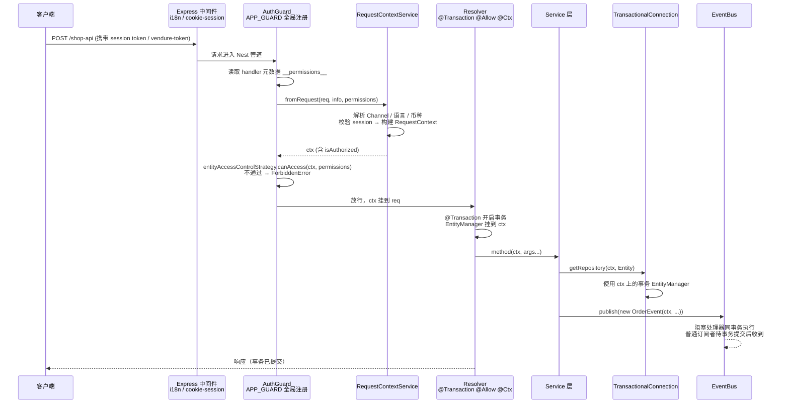

# D2 · Vendure 架构设计与技术栈深度拆解

> 版本基准：Vendure v3.7.1 / master 分支（2026-07 调研时点），仓库 `vendurehq/vendure`
> 阅读前提：你已会用 NestJS（模块、依赖注入、装饰器、Guard/Interceptor），做过实际的后端业务开发。本文不复述 NestJS 基础，而是回答一个更高层的问题：**一个框架（NestJS）如何被一个平台（Vendure）当作地基，支撑起一个可十年演化的电商系统**。
> 版本纪律提示：本文以 v3.7.1 为准；基于 Angular 的旧 Admin UI 已废弃（官方维护至 2026-06），React Dashboard 自 v3.5 起 stable；v3.6 起 elasticsearch/stripe/mollie/braintree/sentry/stellate/pub-sub 等插件已迁至 `@vendure-community/*` scope，API 不变。
> 许可证口径：v3.0 起核心许可为 **GPLv3 + 商业双许可**（GPLv3 社区版 / VCL 商业许可），附插件例外条款——服务端自用不算"分发"，storefront 与私有插件不受 GPL 传染。

---

## 引言：这篇文档要解决什么

多数"会用框架"的开发者，脑海里对一个 Web 系统的图像是：路由 → 控制器 → 服务 → ORM → 数据库。这个图像在 CRUD 项目里足够用，但它解释不了任何一个平台级系统的真实复杂度：为什么 Vendure 的启动要分两步（先装配配置、再创建 Nest 应用）？为什么 worker 和 server 跑同一份代码却是两个进程？为什么一个电商引擎敢把全文搜索、任务队列这些"核心能力"也做成插件？

本文按"全景 → 插件系统 → 事件总线 → 运行时 → 数据层 → API 层 → 部署运维"的顺序拆解 Vendure 的架构。每一节我都会做两件事：一是给出源码级证据（具体类名与文件路径），二是回答"为什么这样选"以及"换作是我做财务系统/业务平台时会怎么选"。你做过制造业财务系统，我会在合适的地方用你熟悉的概念做类比——凭证、账套、月结批处理、辅助核算——这些类比不是修辞，而是两种系统在架构层面的真实同构。

---

## 1. 全景：一个 NestJS 应用如何长成电商平台

### 1.1 四大件：Server / Worker / Dashboard / Storefront

一个标准 Vendure 应用由四个部分组成[^1^]：

- **Server**：NestJS 完整 HTTP 应用，对外暴露两个 GraphQL API——Shop API（面向 storefront，默认 `/shop-api`）与 Admin API（面向管理端，默认 `/admin-api`），内部使用 Apollo Server；同时它把耗时任务写入任务队列。
- **Worker**：与 server **同一份代码库、同一份配置、同一套插件与 DI 容器**，但用另一个入口函数启动，不监听任何业务端口，专职从队列里取任务执行（更新搜索索引、发邮件、重算 Collection 等）。
- **Dashboard**：React 编写的管理界面（v3.5 起 stable），由 `DashboardPlugin` 以静态资源形式托管在 server 的 `/dashboard` 路径下。
- **Storefront**：前端完全自由实现（官方维护一个 Next.js starter），只通过 Shop API 与后端交互——这就是 headless（无头）架构的含义：后端不渲染任何页面，只暴露 API。

```mermaid
graph TB
    subgraph 客户端
        SF[Storefront<br/>Next.js 等任意前端]
        DB_UI[Dashboard<br/>React 管理界面]
    end

    subgraph SG["同一代码库·同一镜像"]
        SRV[Server 进程<br/>bootstrap&#40;&#41;<br/>NestFactory.create&#40;AppModule&#41;]
        WRK[Worker 进程<br/>bootstrapWorker&#40;&#41;<br/>Nest 应用上下文·无 HTTP 业务层]
    end

    subgraph 外置状态
        PG[(SQL 数据库<br/>PostgreSQL / MySQL / SQLite<br/>业务表 + job_record 队列表)]
        RDS[(Redis<br/>BullMQ 队列 / 缓存<br/>可选)]
    end

    SF -->|GraphQL HTTPS<br/>/shop-api| SRV
    DB_UI -->|GraphQL HTTPS<br/>/admin-api| SRV
    SRV -->|读写业务数据<br/>写入 job| PG
    WRK -->|轮询拉取 job<br/>pessimistic_write 行锁抢占| PG
    SRV -. BullMQ 模式 .-> RDS
    WRK -. BullMQ 模式·push 消费 .-> RDS
    WRK -->|任务结果/业务写入| PG
```



这张拓扑图里藏着 Vendure 运行时最重要的两个架构决策。第一，**server 与 worker 之间没有 RPC**：server 只是往数据库的 `job_record` 表（或 Redis）里写一条记录，worker 自己去取。这不是一开始就这样的——v1.0.0-beta 之前，worker 是 NestJS microservice，server 通过 TCP 把 job"发给" worker，结果换来四个问题：部署需要网络连通、worker 难以多实例扩展、TCP 不健壮可能丢 job、插件编写繁琐。v1.0.0-beta 改成"纯任务队列"方案，官方博客的原话是"any job added to a JobQueue will by default run on the worker"，网络层整个消失[^3^]。第二，**状态全部外置**：Node 进程本身不持有任何必须持久化的东西，业务数据在 SQL 库、队列在 SQL 表或 Redis、缓存也在 SQL 或 Redis——这是水平扩展的前提，第 7 章会展开。

**换我会怎么选**：如果你在财务系统里做过月结批处理，一定见过"Web 进程里跑长任务把请求线程拖死"的事故。Vendure 的答案是教科书式的：进程角色分离，但**不分代码库**——用"部署形态差异"替代"代码库分裂"，既获得隔离收益（长任务不阻塞 API、可独立扩缩容与重启），又避免微服务化的分布式复杂度。对中等规模系统，这比一上来就拆微服务务实得多。

### 1.2 技术栈组合及选型逻辑：NestJS + GraphQL + TypeORM + RxJS

先看实测的技术栈版本（`packages/core/package.json`）：NestJS `^11`、 `@nestjs/graphql`/`@nestjs/apollo` `~13.1`、Apollo Server `^4.12`、`graphql` `^16`、TypeScript 全栈[^5^]。数据库官方支持 PostgreSQL、MySQL/MariaDB、SQLite，兼容 Aurora/CockroachDB/PlanetScale[^1^]。为什么是这四样组合，而不是别的？

| 技术 | 在 Vendure 中的角色 | 选型逻辑（为什么是它） |
| --- | --- | --- |
| **NestJS** | 应用骨架：模块化 + DI + 装饰器 + 生命周期 | 插件系统直接站在 Nest Module 之上（第 2 章），DI 容器是 50 个策略槽位的装配机制；企业级组织能力经过验证 |
| **GraphQL（Apollo Server）** | 唯一对外协议：Shop/Admin 双 API | schema 是强类型契约，天然适合 headless；SDL 文件成为插件可声明式合并的"开放扩展点"（第 6 章） |
| **TypeORM** | 数据层：实体、关系、迁移 | 装饰器实体与 TS 类一体，migration 工具链成熟；运行时元数据可被 Vendure 在启动期改写（custom fields 即赖此） |
| **RxJS** | 事件流：EventBus 内核、Job 进度推送 | 事件即 Observable，订阅方可用 filter/debounce/buffer 等操作符自由组合；比 Node 原生 EventEmitter 表达力高一个量级 |

这张表的关键不在"用了什么"，而在**每一项选型都被上游架构决策"二次利用"**：NestJS 不只是 Web 框架，它的模块系统被升格为插件协议（第 2 章）；GraphQL 不只是查询语言，它的 schema 拼装机制成为插件扩展 API 的通道（第 6 章）；TypeORM 不只是 ORM，它的 `metadataArgsStorage` 成为 custom fields 声明式加列的落点（第 2.3 节）；RxJS 不只是响应式库，它的事务感知管道解决了事件驱动最大的坑（第 3 章）。选型的复利效应，是平台级框架与"技术栈拼盘"的分水岭。

**为什么不是 REST？为什么不是 Prisma/TypeGraphQL？** 这是值得停下来想的两个问题。REST 的资源模型难以表达"一次下单操作涉及订单、库存、支付、促销四个聚合"的复合事务，也难以给插件留出"往已有类型上加字段"的声明式口子——而 GraphQL 的 `extend type` 是标准语法。Prisma 的 schema 是它自己的 DSL，启动期动态改实体元数据（custom fields 的根基）无从谈起；TypeGraphQL 这类 code-first 方案则恰恰相反——schema 由 TS 类生成，插件想在启动时往 schema 里"缝"一段 SDL 就没有干净的接缝。Vendure 最终选择了"schema-first 契约 + 装饰器 resolver 实现"的混合体（第 6.1 节），这个决策只有在"要支持第三方插件扩展 API"这个目标下才能被真正理解。

**换我会怎么选**：你的 NestJS 经验在这里全部保值——Guard、Interceptor、装饰器、自定义 provider 在 Vendure 里都是一等扩展机制。需要升级的认知是：在平台型系统里，**框架的每一项能力都要被当作"未来插件也要用"来设计**。如果你做财务平台，凭证引擎的模块拆分、报表引擎的查询契约，同样值得问一句："三年后第三方要在上面长功能，我的接缝在哪里？"

---

## 2. 插件系统：可演化架构的核心

Vendure 官方文档有一句话："The heart of Vendure is its plugin system"。这句话要按字面理解：插件系统不仅是"安装第三方功能的机制"，更是**用户编写自定义业务逻辑的主要方式**，同时也是**核心团队自己构建功能的机制**[^6^]。搜索、任务队列、邮件、管理后台、资产服务——这些"核心能力"全部是插件。理解这一点，就理解了 Vendure 架构的半壁江山。本章是全文重心，我们从装饰器源码一路拆到生态治理。

### 2.1 `@VendurePlugin` = NestJS Module 薄超集 + 6 个元数据键

先看元数据模型（`packages/core/src/plugin/vendure-plugin.ts`）[^7^]：

```ts
export interface VendurePluginMetadata extends ModuleMetadata {
    configuration?: PluginConfigurationFn;            // 启动前修改 VendureConfig
    shopApiExtensions?: APIExtensionDefinition;       // 扩展 Shop GraphQL API
    adminApiExtensions?: APIExtensionDefinition;      // 扩展 Admin GraphQL API
    entities?: Array<Type<any>> | (() => Array<Type<any>>);  // 自定义 TypeORM 实体
    dashboard?: DashboardExtension;                   // React Dashboard 扩展（v3.5+）
    compatibility?: string;                           // semver 兼容声明，如 '^3.0.0'
}
```

注意第一行：`extends ModuleMetadata`。Vendure 插件**继承了 NestJS Module 的全部元数据**——`imports`、`providers`、`controllers`、`exports`——然后只加了 6 个自己的键。所以官方文档敢说：**许多 NestJS Module 实际上就是合法的 Vendure 插件**（原文 "many NestJS modules are actually valid Vendure plugins"）[^6^][^7^]。

再看装饰器的实现，它薄得几乎令人失望（同文件）[^7^]：

```ts
export function VendurePlugin(pluginMetadata: VendurePluginMetadata): ClassDecorator {
    return (target: Function) => {
        // ① 把 6 个 Vendure 专属键用反射挂到插件类上
        for (const metadataProperty of Object.values(PLUGIN_METADATA)) {
            ... Reflect.defineMetadata(property, value, target);
        }
        // ② 提取 Nest 模块元数据，把 providers 自动追加进 exports
        const nestModuleMetadata = pick(pluginMetadata, Object.values(MODULE_METADATA) as any);
        const exportedProviders = (nestModuleMetadata.providers || []).filter(/* 排除 APP_* 全局 token */);
        nestModuleMetadata.exports = [...(nestModuleMetadata.exports || []), ...exportedProviders];
        // ③ 调用 Nest 原生 @Module() 收尾
        Module(nestModuleMetadata)(target);
    };
}
```

三步：挂元数据 → 整理 Nest 元数据 → 透传给原生 `@Module()`。装饰器本身**不执行任何副作用**，没有注册、没有启动逻辑，纯粹是"声明"。第②步里那个"自动把 providers 追加到 exports"的细节值得停一下：插件的 GraphQL resolver 会被 `ApiModule` 用来动态创建新 Module（`createDynamicGraphQlModulesForPlugins`），resolver 依赖的 provider 必须被导出才能注入，所以框架替你做了这件 90% 的人会忘的事；但 `APP_INTERCEPTOR / APP_FILTER / APP_GUARD / APP_PIPE` 这四个全局 token 被特意排除（issue #837），否则每个插件的全局拦截器会被重复注册多次[^7^]。这种注释级别的细节，正是"框架作者替你把坑踩过一遍"的证据。

元数据的**读取**集中在 `packages/core/src/plugin/plugin-metadata.ts`，提供 `getEntitiesFromPlugins()`、`getPluginAPIExtensions()`、`getConfigurationFunction()`、`getCompatibility()` 等函数，且兼容 Nest `DynamicModule` 形式（反射时会先判断 `isDynamicModule` 再取 `.module` 上的元数据）[^8^]。这就是"声明式元数据 + 集中装配"模式：装饰器只负责"说"，bootstrap 流水线（2.2 节）负责"做"。

插件的公共底座是 `PluginCommonModule`（`packages/core/src/plugin/plugin-common.module.ts`）：几乎每个插件都 `imports: [PluginCommonModule]`，它 re-export 了 `EventBusModule`（注入 EventBus）、`ServiceModule`（注入全部核心服务如 `OrderService`、`ProductService`）、`ConfigModule`、`ConnectionModule.forPlugin()`（注入 `TransactionalConnection`）、`JobQueueModule`、`HealthCheckModule`、`CacheModule` 等[^9^]。一个最小插件的骨架长这样（官方 wishlist 教程浓缩）[^6^]：

```ts
@VendurePlugin({
    imports: [PluginCommonModule],
    providers: [WishlistService],
    entities: [WishlistItem],                    // 自定义实体
    shopApiExtensions: {                         // 扩展 Shop API
        schema: shopApiExtensions,               // gql`extend type Mutation { addToWishlist(...) }`
        resolvers: [WishlistShopResolver],
    },
    configuration: config => {                   // 启动期修改全局配置
        config.customFields.Customer.push({ name: 'wishlistItems', type: 'relation', list: true, entity: WishlistItem, internal: true });
        return config;
    },
    compatibility: '^3.0.0',
})
export class WishlistPlugin {}
```

**为什么这样设计？** 这是 Vendure 插件哲学的第一块基石：**不发明新的模块概念，站在宿主框架的模块系统之上**。收益是三重的：学习成本趋零（你已经会 Nest Module 了）；整个 Nest 生态的中间件、模块可以直接用；框架升级时插件机制免费获得 Nest 的改进。对比另一个极端——WordPress 的 hook 体系是完全自造的，插件作者要学一套只在 WordPress 里有用的知识，且框架本身无法从 PHP 生态受益。

**换我会怎么选**：如果你要给自己的财务平台设计插件机制，"增量协议"思路是最小成本的正解——你的团队已会 Nest，未来的插件作者也是 Nest 开发者，那插件 = Nest Module + 你的 6 个键。需要警惕的是另一面：插件机制与宿主框架深度绑定，意味着宿主的大版本升级（Nest 9→10→11）你都躲不掉，Vendure v2 那代依赖大升级（NestJS v8 + TypeORM 0.3）时，TypeORM 0.3 的 API 变化（`findOne` 不再收 id 等）就渗透了全部 service 代码。这是选择"借力"的必然代价。

### 2.2 bootstrap 装配流水线：实体合并 → configuration 钩子 → semver 校验

`@VendurePlugin` 只负责声明，真正的装配发生在启动时。`bootstrap()`（`packages/core/src/bootstrap.ts`）的关键顺序如下[^10^]：

```mermaid
flowchart TD
    A[bootstrap&#40;userConfig&#41;] --> B[setConfig：与默认配置合并]
    B --> C[getAllEntities<br/>coreEntitiesMap 75 实体<br/>+ getEntitiesFromPlugins]
    C -->|实体名冲突| C1[throw error.entity-name-conflict<br/>拒绝启动]
    C --> D[实体写回 dbConnectionOptions<br/>供 TypeORM 使用]
    D --> E[runPluginConfigurations<br/>按 plugins 数组顺序<br/>依次执行各插件 configuration 函数]
    E --> F[setEntityIdStrategy / setMoneyStrategy]
    F --> G[validateCustomFieldsConfig<br/>非法 custom fields 拒绝启动]
    G --> H[registerCustomEntityFields<br/>写入 TypeORM 实体元数据]
    H --> I[runEntityMetadataModifiers<br/>元数据逃生舱]
    I --> J[checkPluginCompatibility<br/>semver 硬校验，不兼容拒绝启动]
    J --> K[NestFactory.create&#40;AppModule&#41;<br/>源码注释：必须在实体确定之后才 import]
    K --> L[app.listen + 发布 BootstrappedEvent]
```



这条流水线里有四个设计点，每一个都值得单独品味：

**其一，装配点集中，所以治理能力集中**。实体合并、custom fields 校验、实体名冲突检测、semver 兼容性检查，集中在启动早期的同一条装配流水线（`preBootstrapConfig()` 及紧随其后的兼容性检查）。因为插件不在定义时执行副作用，框架才有"上帝视角"做这些横切校验。如果插件各自为政地在 `import` 时执行副作用，这些治理能力一个都不可能有——**可演化性来自装配点集中**。

**其二，`configuration` 钩子是"启动前最后的修改窗口"**。它的签名是 `(config: RuntimeVendureConfig) => RuntimeVendureConfig | Promise<RuntimeVendureConfig>`——可以是异步函数；插件**按 `plugins` 数组顺序执行**，后面的插件可以看到并覆盖前面插件的修改，顺序即优先级语义[^10^]。典型用法是注入策略实现，例如 `DefaultJobQueuePlugin` 的 configuration 函数把 `SqlJobQueueStrategy` 写进 `config.jobQueueOptions.jobQueueStrategy`，并注册一个定时清理 job 的 scheduled task[^18^]：

```ts
configuration: config => {
    config.jobQueueOptions.jobQueueStrategy = new SqlJobQueueStrategy({...});
    config.schedulerOptions.tasks.push(cleanJobsTask.configure({...}));
    return config;
}
```

**其三，这是"配置时开放、运行时封闭"的两阶段哲学**。所有插件的 configuration 函数跑完之后，config 即被视为只读（`Readonly<RuntimeVendureConfig>`），运行期不再允许修改[^10^]。这个分野极其重要：它让"可组合"（启动期插件自由改配置）与"运行期确定性"（跑起来的系统配置不再漂移）兼得。用你熟悉的财务系统类比：这等同于**建账期可以设置科目体系、核算方法、凭证字，一旦启用（过账第一笔凭证）即锁定**——设计态与运行态明确分野，是所有参数化平台的共同答案。做低代码/规则引擎时，请把这条原则抄走。

**其四，版本契约是一等功能**。`compatibility: '^3.0.0'` 声明后，`checkPluginCompatibility()` 在 bootstrap 时用 `satisfies(VENDURE_VERSION, compatibility, { loose: true, includePrerelease: true })` 硬校验，**不满足则抛错拒绝启动**[^7^][^10^]；v3.1 起可用 `ignoreCompatibilityErrorsForPlugins` 白名单豁免[^10^]。这把"稳定接口"从文档愿望变成了可执行的承诺——插件市场能成立的前提，就是兼容性问题在启动时爆炸，而不是在生产环境半夜爆炸。

### 2.3 扩展点全景：strategy 槽位、custom fields、自定义实体、schema 扩展

装配流水线解决了"插件怎么进来"的问题，接下来的问题是"插件进来后能改什么"。Vendure 的答案是：**几乎所有"可能因业务而异"的点都有扩展槽位**。我把它们归为五类。

**第一类：strategy 槽位（约 50 个）。** `VendureConfig`（`packages/core/src/config/vendure-config.ts`，千余行接口定义）里几乎每个 `*Strategy` 属性都对应一个默认实现类，可整体替换[^11^]：

| 域 | 代表性策略槽位 |
| --- | --- |
| 订单 | `orderItemPriceCalculationStrategy`、`stockAllocationStrategy`、`mergeStrategy`、`orderCodeStrategy`、`activeOrderStrategy`、`orderSellerStrategy`（marketplace 拆单）、`orderOptions.process`（订单状态机） |
| 定价/税 | `productVariantPriceCalculationStrategy`、`taxZoneStrategy`、`taxLineCalculationStrategy`、`orderTaxCalculationStrategy`（v3.6 新增） |
| 认证/安全 | `shopAuthenticationStrategy[]`、`adminAuthenticationStrategy[]`、`passwordHashingStrategy`、`passwordValidationStrategy`、`sessionCacheStrategy`、`entityAccessControlStrategy`（行级权限，developer preview） |
| 资产/运费/支付/促销 | `assetStorageStrategy`（Local/S3）、`shippingEligibilityCheckers[]`、`shippingCalculators[]`、`paymentMethodHandlers[]`、`promotionConditions[]` / `promotionActions[]` |
| 基础设施 | `jobQueueStrategy`、`jobBufferStorageStrategy`、`schedulerStrategy`、`cacheStrategy`、`healthChecks[]`、`instrumentationStrategy`、`logger` |

策略模式的本质是"核心只依赖接口，默认实现可替换"。Vendure 官方 README 的自我定位是 "Plugin-first……Extend or override any part of the system through stable plugin contracts and service overrides"[^4^]——"no forks required"（无需分叉源码）是这套槽位体系存在的意义。对照你的财务经验：这等同于财务软件把"存货计价方法（先进先出/加权平均）、折旧方法、汇兑损益规则"做成可配置算法而不是写死在代码里——不同的是，Vendure 把几乎所有算法都策略化了，连订单号怎么生成都是一个槽位。

**第二类：custom fields——声明式给核心实体加列。** 在 `config.customFields` 上按实体声明字段（插件经 configuration 函数 push），支持 10 种类型：`string / localeString / text / localeText / int / float / boolean / datetime / struct`（v3.1+ 嵌套结构）`/ relation`[^12^]。定义后自动发生三件事：① TypeORM 修改数据库 schema（需跑 migration）；② 两个 GraphQL API 的类型自动增加字段（含 list 查询的 filter/sort 选项）；③ 管理后台详情页自动出现表单输入[^12^]。支持 custom fields 的核心实体有 50 个（`packages/core/src/entity/custom-entity-fields.ts` 中每个实体一个 `CustomXxxFields` 空类，供 TS 声明合并）[^13^]。字段级还有 `public / readonly / internal / requiresPermission / validate` 等精细开关；特例联动如 `OrderLine` 的 custom fields 会让 Shop API 的 `addItemToOrder` 自动多出第三个 `customFields` 入参（刻字、礼品卡留言等定制商品场景）[^12^]。这相当于财务软件的"自定义档案字段 + 辅助核算项扩展"，但做到了 DB、API、UI 三处自动联动。

**第三类：自定义实体。** 插件实体继承 `VendureEntity`（自带 `id/createdAt/updatedAt`），注册进 `entities` 数组（支持函数形式惰性求值）；与核心实体建关系用标准 TypeORM `@ManyToOne(type => ProductVariant)` 单向引用，核心表结构不动；反向持有则用 `relation` 类型 custom field（会真实改核心表 schema）；可实现 `Translatable`（多语言）、`ChannelAware`（渠道隔离）、`HasCustomFields`（v2.2+，自定义实体也开放 custom fields）接口获得与核心实体一致的能力[^6^]。

**第四类：GraphQL schema 扩展。** 插件用 `shopApiExtensions / adminApiExtensions` 提交 SDL 与 resolver，由 `getFinalVendureSchema()`（`packages/core/src/api/config/get-final-vendure-schema.ts`）在启动时拼装：先 `mergeTypesByPaths` 合并核心 SDL → `buildSchema` → 对每个插件扩展执行 graphql-js `extendSchema`；schema 可以是静态 DocumentNode，也可以是**接收现有 schema 返回扩展 SDL 的函数**（`DefaultSearchPlugin` 用它按配置决定是否注入 `stockStatus` 字段）[^14^][^17^]。

**第五类：逃生舱。** `entityOptions.metadataModifiers` 是一组直接操作 TypeORM `metadataArgsStorage` 的函数，在 bootstrap 时由 `runEntityMetadataModifiers()`（`packages/core/src/entity/run-entity-metadata-modifiers.ts`）执行，可修改任意实体（含核心实体）的 TypeORM 元数据[^15^]。此外，核心服务就是 Nest provider，可用标准自定义 provider 语法 `{ provide: X, useClass: MyX }` 覆盖（service overrides）；插件还可声明 `@Controller()` 提供 REST 端点、用 `APP_GUARD/APP_INTERCEPTOR` token 注册全局横切、经 `apiOptions.middleware` 挂 Express 中间件[^6^]。

五类扩展点按"力度"可排成三档：**custom fields（零代码，声明式）→ 自定义实体 + schema 扩展（完全自治，走标准协议）→ metadataModifiers / service overrides（逃生舱，直接改元数据/换实现）**。用户按需求选力度，而所有涉及 schema 的变更都必须经 `npx vendure migrate` 显式迁移落地——**扩展是"显式迁移"而非"隐式同步"，schema 演化可审计、可回滚**。这是"可演化"与"野蛮生长"的分水岭，你在财务系统里维护账套升级脚本的经验完全同构。

### 2.4 ConfigurableOperationDef：策略 + 运行时参数的统一语言

在 50 个 strategy 槽位中，有一类特殊的策略值得单独成章——`ConfigurableOperationDef`（`packages/core/src/common/configurable-operation.ts`）。它被复用在至少六个地方：`PaymentMethodHandler`（支付）、`PromotionCondition` / `PromotionAction`（促销）、`ShippingCalculator` / `ShippingEligibilityChecker`（运费）、`FulfillmentHandler`（履约）[^16^]。

它解决的问题是：普通 strategy 是"开发者替换实现"，而支付网关、促销规则这类东西的**参数需要运营人员在后台随时调整**——总不能改个满减门槛就发一次版。ConfigurableOperationDef 的模式是：

```ts
const shippingCalculator = new ShippingCalculator({
    code: 'weight-based-shipping',
    args: {                                  // 声明式参数定义
        ratePerKg: { type: 'int', label: '每公斤费率' },
        minWeight: { type: 'int', required: false },
    },
    init(injector: Injector) {               // 生命周期钩子：可注入任意 provider
        this.shippingRatesService = injector.get(ShippingRatesService);
    },
    async calculate(ctx, order, args) { ... }, // args = 管理员在 Dashboard 里填的值
    async destroy() {},
});
```

三段式：**接口（calculate/check 等方法）+ 声明式参数（args，自动生成 Dashboard 表单）+ DI 注入（init(injector) 拿容器里任何 provider）**。管理员创建 PaymentMethod/ShippingMethod/Promotion 时，从下拉框选一个 operation（code），填它的参数（args），存库的是"code + args JSON"，运行时按 code 找到实现、喂入参数执行。

这个抽象为什么重要？因为它是**平台化设计的通用语言**：支付、运费、促销、履约四个看似无关的域，用同一套"策略 + 运行时参数 + 注册表"模式表达，运营人员因此能在不发版的情况下调整支付网关参数、运费规则、促销条件——这正是低代码平台规则引擎的最小内核。对照你的财务系统：凭证模板（"借：应收账款-{客户组} 贷：主营业务收入-{税率档}"）就是同一个东西——规则是代码，参数是配置，模板 = code + args。如果你未来做规则引擎，ConfigurableOperationDef 是一个可以直接抄的最小实现。

### 2.5 dogfooding 防腐：核心功能自己走插件协议

最后一个、也是最能体现架构成熟度的问题：**核心团队自己用不用这套插件协议？** 答案是：全文搜索、SQL 任务队列这两个"核心能力"捆绑在 `@vendure/core` 内部，就是用 `@VendurePlugin` 实现的；管理后台、邮件、资产服务是独立 npm 包插件。

| 核心功能 | 包/位置 | 用到的插件机制 |
| --- | --- | --- |
| `DefaultSearchPlugin`（全文搜索） | `@vendure/core` 内，`packages/core/src/plugin/default-search-plugin/` | providers + 双 API schema/resolver 扩展（schema 是函数，按 init 选项动态决定）+ 自定义实体 `SearchIndexItem` + `static init()` + 订阅 8 类 EventBus 事件增量更新索引；`compatibility: '>0.0.0'`[^17^] |
| `DefaultJobQueuePlugin`（SQL 队列） | `@vendure/core` 内，`packages/core/src/plugin/default-job-queue-plugin/` | `entities` 函数形式按配置返回；`configuration` 注入 `SqlJobQueueStrategy` 并注册清理 task；`compatibility: '>0.0.0'`[^18^] |
| `AdminUiPlugin`（旧管理端） | `@vendure/admin-ui-plugin` | `adminApiExtensions` 加 `metricSummary` 查询；`implements NestModule`，`configure()` 里检查 `processContext.isWorker` 直接返回后挂静态服务；`compatibility: '^3.0.0'`[^19^] |
| `EmailPlugin` | `@vendure/email-plugin` | 事件驱动（`EmailEventListener.on(OrderStateTransitionEvent)`）；邮件经 JobQueue 异步发送；devMode 起本地 mailbox[^20^] |
| `AssetServerPlugin` | `@vendure/asset-server-plugin` | `NestModule.configure()` 挂路由；自身又暴露 `assetStorageStrategy / assetNamingStrategy` 等二级策略槽位[^21^] |

这张表最值得注意的细节是 `compatibility: '>0.0.0'`——捆绑在核心里的插件用这个声明表示"我是核心的一部分，豁免版本校验"。也就是说核心团队连版本契约都不给自己开小灶：**核心与第三方走同一条装配流水线、同一个装饰器、同一份元数据协议**。再横向看每一行用到的机制面：DefaultSearchPlugin 用遍了 providers、双 API schema 扩展（且 schema 是函数形式）、自定义实体、生命周期钩子、EventBus 订阅五件套；DefaultJobQueuePlugin 示范了 `entities` 的惰性函数形式与 configuration 注入策略；AdminUiPlugin 示范了 `ProcessContext` 进程感知。它们合在一起，就是一部"插件机制全功能使用手册"——核心团队用自己的代码证明协议够用。

这就是 dogfooding（吃自己的狗粮）的防腐价值。软件架构里有一种慢性病叫"扩展点腐化"：核心功能走特权内部接口，只有第三方被迫走公开扩展点，于是扩展点长期得不到实战检验，慢慢溃烂成摆设。Vendure 的解法是制度性的——把核心功能做成插件，核心就无法享受特权，扩展点必须设计得通用、稳定、有版本契约。实测证据是 `ElasticsearchPlugin`（现 `@vendure-community/elasticsearch-plugin`）能作为 `DefaultSearchPlugin` 的 **drop-in 替换**（官方文档原话），把 plugins 数组里的默认搜索换掉即可[^24^]——协议健康度由此可证。

生态也随之分层：**捆绑核心（搜索、SQL 队列）→ 官方 monorepo 包（asset-server/email/dashboard/BullMQ/harden/telemetry）→ v3.6 起迁出的 `@vendure-community/*`（elasticsearch/stripe/mollie/braintree/sentry/stellate/pub-sub/punchout，独立版本化，API 不变）→ Vendure Hub 社区市场（约 56 个插件）→ 付费 Vendure Plus**[^22^][^23^][^72^]。配套治理还有：发布插件不应把 `@vendure/*` 列为 dependencies（应列 peerDependencies 防重复安装）；GPLv3 有专门的插件例外许可，允许私有插件任意许可分发[^25^]。

**换我会怎么选**：判断一个平台的扩展机制是否健康，就看核心功能自己是否用它。这是整条洞察里我最建议你带走的一条——未来你设计任何可扩展系统（报表平台、规则引擎、审批流平台），把"核心功能必须走公开扩展点"写进架构红线，比任何代码评审都管用。扩展机制决定"能不能长"，治理机制（版本契约 + 分发渠道 + 许可例外）决定"长得乱不乱"。

---

## 3. EventBus：事务感知的事件驱动

### 3.1 RxJS 总线 + awaitActiveTransactions：订阅者只在事务提交后收到事件

事件驱动在电商系统里是刚需：下单成功要发邮件、加积分、同步 ERP、更新搜索索引——这些副作用不应该堆在订单服务里。但 naive 的事件总线有一个致命坑：**事件发出时，业务数据往往还在未提交的事务里**。订阅者收到"订单已支付"事件后去查数据库，可能读到中间态，甚至因为事务最终回滚而对一笔不存在的订单发了确认邮件。这类 bug 隐蔽、难复现、出现在最不该出错的地方。

Vendure 的 `EventBus`（`packages/core/src/event-bus/event-bus.ts`）用一个 RxJS 管道操作解决了这个问题[^27^]：

```ts
@Injectable()
export class EventBus implements OnModuleDestroy {
    private eventStream = new Subject<VendureEvent>();

    async publish<T extends VendureEvent>(event: T): Promise<void> {
        this.eventStream.next(event);                      // 先推给普通订阅者（异步）
        await this.executeBlockingEventHandlers(event);    // 再同步执行阻塞处理器
    }

    ofType<T extends VendureEvent>(type: Type<T>): Observable<T> {
        return this.eventStream.asObservable().pipe(
            takeUntil(this.destroy$),
            filter(e => e.constructor === type),
            mergeMap(event => this.awaitActiveTransactions(event)),  // ★ 等待事务提交
            filter(notNullOrUndefined),
        );
    }
}
```

关键在 `mergeMap(event => this.awaitActiveTransactions(event))` 这一步：`EventBus` 构造函数注入了 `TransactionSubscriber`（`packages/core/src/connection/transaction-subscriber.ts`），如果事件携带的 `RequestContext` 上有打开的 TypeORM 事务，**订阅者只会在事务提交之后才收到事件**。官方文档的原话："the subscriber will only get called after any active database transactions are complete. This means that the subscriber function can safely access all updated data related to the event."[^26^][^28^] 订阅侧的惯用模式是在插件的 `onModuleInit()` 里订阅，并用 RxJS 操作符自由组合[^26^]：

```ts
this.eventBus.ofType(OrderStateTransitionEvent)
    .pipe(filter(event => event.toState === 'PaymentSettled'))
    .subscribe(event => { /* 发邮件 / 加积分 / 同步 ERP */ });
```

用你的财务直觉来类比：这相当于**凭证必须审核过账之后，才允许触发后续的计提、摊销、报表重算**——未过账的凭证对下游模块不可见。财务软件把这个约束叫"过账控制"，Vendure 把它下沉成了事件总线的基础设施，业务代码想犯错都难。这个设计的教训可以推广：**任何事件机制都必须显式回答"事件与事务的关系"**，纯 fire-and-forget 的事件系统在强一致领域是埋雷。

### 3.2 blocking handler：同事务强一致选项；55+ 内置事件

事务后通知是"弱一致"语义，够用但不是全部。有些场景要求"这个副作用必须和主业务一起成功或一起失败"——比如"同步 ERP 的 job 必须入队成功，否则订单不允许提交"。Vendure 为此提供 `registerBlockingEventHandler()`（v2.2+），形成双轨语义[^26^][^27^]：

| 维度 | 普通订阅者（`ofType().subscribe()`） | 阻塞处理器（`registerBlockingEventHandler()`） |
| --- | --- | --- |
| 执行时机 | 事务提交后、发布代码完成之后 | 发布代码**之中**，同步等待 |
| 错误处理 | 不影响发布方 | **错误传播给发布方 → 主事务回滚** |
| 事务边界 | 与主事务无关（读已提交数据） | 与发布代码**同一事务**内执行 |
| 性能约束 | 无 | 必须快（>100ms 打警告日志） |

多个阻塞处理器可用 `id` + `before` / `after` 声明执行顺序。官方推荐的使用模式值得背下来：**阻塞处理器里只做"往 JobQueue 里加一个 job"这种毫秒级快操作**，把真正的重活（调 ERP 接口、发邮件）交给 worker 异步做——这样既拿到"入队失败则下单失败"的强一致，又不把慢 IO 拖进用户请求的事务里[^26^]。这是"强一致落点最小化"的经典手法：强一致只覆盖"写一条 job 记录"，不覆盖"整个远程调用"。

内置事件的覆盖面是"几乎一切重要动作"：官方 events 文档列出 55+ 种（`packages/core/src/event-bus/events/` 下每事件一个文件），涵盖订单域（`OrderStateTransitionEvent`、`OrderPlacedEvent`、`FulfillmentStateTransitionEvent`、`RefundStateTransitionEvent`、`StockMovementEvent`）、客户账户域（`AccountRegistrationEvent`、`LoginEvent`、`CustomerGroupChangeEvent`）、目录域（`ProductEvent`、`CollectionModificationEvent`、`AssetEvent`）、系统域（`ChannelEvent`、`RoleChangeEvent`、`BootstrappedEvent`）等[^26^]。自定义事件只需 `extends VendureEvent`；实体增删改事件可继承 `VendureEntityEvent<Entity>`（自带 `'created' | 'updated' | 'deleted'` 类型字段）；插件也可以用 `eventBus.publish()` 发布自己的事件——**事件因此成为插件之间的解耦契约**[^26^]。

### 3.3 事件驱动解耦范式

看三个真实用法，理解"事件如何改变代码的组织方式"：

- **EmailPlugin**：订单确认邮件的触发完全由事件驱动——`orderConfirmationHandler = new EmailEventListener('order-confirmation').on(OrderStateTransitionEvent).filter(...)`（`packages/email-plugin/src/handler/default-email-handlers.ts`）。订单服务**不知道邮件的存在**，邮件逻辑也不 import 订单服务[^20^][^29^]。
- **DefaultSearchPlugin**：在 `onApplicationBootstrap()` 中订阅 `ProductEvent / ProductVariantEvent / AssetEvent / ProductChannelEvent / StockMovementEvent / CollectionModificationEvent` 等 8 类事件，把变更聚合成搜索索引更新 job[^17^]。
- **官方文档示例**：订阅 `ProductEvent` 触发 storefront 静态页重建，用 `debounceTime(1000)` 合并频繁变更——RxJS 操作符在这里展示了超越普通 EventEmitter 的表达力[^26^]。

**换我会怎么选**：你在财务系统里做"凭证审核后自动触发后续业务"时，大概率用的是在 service 里顺序调用或在数据库上挂触发器。事件总线是第三种答案，但它的价值不在"异步"，而在**反向依赖**：核心域（订单/凭证）不依赖任何下游模块，下游模块各自订阅自己关心的事件。新增一个下游（比如新增"同步税务系统"）时，核心代码一行不动——开闭原则在集成场景的落地。前提是你要像 Vendure 一样，把"事务后可见"做成总线的默认语义，否则解耦换来的不是灵活性而是对不上的账。

---

## 4. 运行时：双进程与任务队列

### 4.1 `bootstrap()` vs `bootstrapWorker()`：同代码库双入口

1.1 节说过 server 与 worker 是两个进程，现在看机制细节。两个入口函数都在 `packages/core/src/bootstrap.ts` 里[^10^]：

- **Server**：`bootstrap(config)` → `NestFactory.create<NestExpressApplication>(AppModule)` 创建完整 Nest HTTP 应用 → 配置 session cookie 与中间件 → `app.listen(port)` → `setProcessContext('server')`。
- **Worker**：`bootstrapWorker(config)` → `NestFactory.createApplicationContext(WorkerModule)`——即 **NestJS standalone 应用上下文**，加载与 server 几乎完全相同的插件与服务，**但没有任何网络监听层**；启动时 `setProcessContext('worker')` 并执行 `validateDbTablesForWorker()`，返回 `VendureWorker` 实例[^10^][^30^]。

标准安装中的 worker 入口文件 `src/index-worker.ts` 只有几行[^2^]：

```ts
import { bootstrapWorker } from '@vendure/core';
import { config } from './vendure-config';

bootstrapWorker(config)
    .then(worker => worker.startJobQueue())
    .catch(err => { console.log(err); });
```

`VendureWorker`（`packages/core/src/worker/vendure-worker.ts`）只暴露两个方法：`startJobQueue()` 与 `startHealthCheckServer()`[^30^]。代码若需感知进程角色，注入 `ProcessContext`（`processContext.isServer / isWorker`）——`AdminUiPlugin.configure()` 就靠它跳过 worker 进程（管理后台静态服务不该挂在 worker 上）；注意 `NestModule.configure()` 中间件挂载**只在 server 执行**[^2^][^6^]。

为什么要双进程？官方给出的理由很直白：更新数千商品的搜索索引可能要一分钟以上，绝不能阻塞请求-响应周期——server 把任务丢进队列立即返回，worker 在后台慢慢做[^2^]。默认走队列的核心任务有四类：重建搜索索引、Product/ProductVariant/Asset 变更时增量更新搜索索引、更新 Collection 内容（重算 collection filters）、发送事务性邮件[^2^]。

**为什么这样选**：这套"同代码库、双入口"的设计在第 1 章已经做过铺垫，这里补一个你最有体感的类比：它像极了财务软件里"联机事务处理（OLTP）+ 后台批处理"的分工——柜面交易要秒回，月末计提、年结、报表生成丢给批处理窗口。Vendure 的聪明处在于两个角色共享全部领域代码与配置（插件、实体、策略在两边一致），避免了"批处理程序另写一套、业务规则漂移"的经典病。

### 4.2 JobQueue 两种实现：DB 轮询 vs BullMQ/Redis；JobBuffer 聚合

队列的"存储与投递"由 `JobQueueStrategy` 接口抽象，四种实现[^2^][^31^][^34^]：

| 实现 | 插件 | 存储 | 投递模型 | 适用场景 |
| --- | --- | --- | --- | --- |
| In-memory（兜底） | 无（不配置策略时默认） | 进程内存 | — | 仅开发；进程停即丢，且独立 worker 进程取不到 |
| `SqlJobQueueStrategy` | `DefaultJobQueuePlugin`（@vendure/core 内置，标准安装默认启用） | 数据库 `job_record` 表 | **轮询（pull）** | 中小规模；重启不丢 job，零新增基础设施 |
| `BullMQJobQueueStrategy` | `BullMQJobQueuePlugin`（`@vendure/job-queue-plugin`） | Redis | **推送（push）** | 生产/高负载推荐 |
| 自定义 | 自实现接口 | RabbitMQ / SQS / Pub-Sub | — | DB 方案不满足性能时 |

这张表背后是一条精心设计的**平滑升级路径**：小项目用 SQL 表（零新组件、事务一致、重启不丢），流量大了 drop-in 换成 BullMQ，接口语义（add/next/update/fail）不变，业务代码零改动。升级触发点可以量化——SQL 轮询策略默认每队列每 **200ms** 查一次库，典型实例至少 3 个队列（email、collection、search index），单 worker 即产生**恒定 15 QPS**；队列多、worker 多时很容易到 50–100 QPS 的恒定背景负载[^31^][^34^]。把"队列"定义为领域接口而非某个中间件，并给出可量化的迁移触发点，这是值得抄走的工程判断。

**SQL 策略的并发正确性靠存储层的锁，不靠框架魔法**。`SqlJobQueueStrategy.next()`（`packages/core/src/plugin/default-job-queue-plugin/sql-job-queue-strategy.ts`）把"取下一个 job"包在数据库事务里，对选中的 PENDING/RETRYING 行加 **`pessimistic_write` 行级锁**，同事务内把状态改为 RUNNING——多 worker 进程不会抢到同一个 job；SQLite 因不支持并发事务走无锁分支（官方诚实暴露降级）；配置了 backoffStrategy（默认失败后 1000ms）时，未到退避时间的 job 会被跳过并递归找下一个[^32^]。`JobRecord` 实体（同目录 `job-record.entity.ts`）字段包括 `queueName / data / state / progress / result / retries / attempts / startedAt / settledAt`[^33^]；MySQL/MariaDB 的 job data 以 `text` 列存储，有 64KB 硬上限，`constrainDataSize()` 会把 data 中超过 2KB 的字符串截断并告警[^32^]。轮询参数：默认并发 1（每 worker 每队列串行）、优雅停机等待运行中 job 最长 20s[^31^]。v3.3 起插件附带内置定时任务 `cleanJobsTask`，默认每 2 小时清理、保留 1000 条[^31^]。

**BullMQ 策略**（`packages/job-queue-plugin/`）是 drop-in 替换：job 存 Redis、push 模型零轮询；单 worker 默认并发 3；注意所有 Vendure 队列共用一个 BullMQ 队列（`QUEUE_NAME`），按并发值分组 worker，需要严格按队列隔离要用 BullMQ Pro Groups；v3.2 起支持 `setJobOptions(queueName, job) => ({ priority })` 设优先级（解决"订单确认邮件被长时间导入 job 阻塞"类问题）；v2.1 起 completed/failed 集合默认 30 天或 5000 条后清除[^34^]。

**Job 的生命周期管理内置三件套**（`packages/core/src/job-queue/job.ts`）[^35^]：

```text
PENDING → RUNNING → COMPLETED / FAILED / RETRYING / CANCELLED
```

- `fail()` 时若 `retries >= attempts` 置 RETRYING 等待重试，否则 FAILED 终态；
- `setProgress(0–100)` 触发进度事件——`JobQueue.add()` 返回 `SubscribableJob`，`job.updates()` 是 RxJS Observable，每次进度/状态变化都推送，resolver 可以把后台 job 的进度暴露给 API 调用方；
- **取消是协作式的**：取消只把状态标记为 CANCELLED，队列无法强杀正在运行的 `process` 函数——`process` 内部需自行检查 `job.state === JobState.CANCELLED` 并退出（轮询策略按 `pollInterval × 5` 刷新取消状态）[^2^]。

框架杀不了用户代码，就把"可中断性"设计成 API 契约——这个取舍很诚实。进度与结果持久化在 job 记录里，天然获得可观测性和后台任务 UI 的数据源。

**JobBuffer 是容易被忽略的一层**：它位于 `JobQueue.add()` 与实际入队之间，`collect(job)` 返回 true 的 job 被暂存（存储策略可插拔，含 Redis 实现），调用 `flush()` 时经 `reduce(collectedJobs)` **聚合去重**后再真正入队——典型场景是搜索索引更新：一分钟内改了 100 个商品，不需要 100 次重建，合并成一次即可[^36^]。

**RequestContext 跨进程**：`RequestContext` 不能直接序列化进 job data（对象太大，高频 job 会膨胀队列存储，BullMQ 下甚至撑爆 Redis 内存）。官方推荐只传 channelToken/languageCode 等必要字段，在 `process` 里用 `RequestContextService.create()` 重建 ctx[^2^]——"上下文即数据"意味着它进队列就是成本，需要设计最小可重建表示。

### 4.3 Scheduled Tasks（v3.3）与多实例 only-once

v3.3 之前，定时任务只能外部 cron + 独立脚本；v3.3 引入原生 `ScheduledTask` 机制[^37^]：

```ts
new ScheduledTask({
    id: 'my-nightly-job',
    schedule: cron => cron.everyDayAt(0, 0),
    async execute({ injector, params }) {
        const myService = injector.get(MyService);     // 可注入任意 provider
        const ctx = await RequestContextService.create(...);  // 程序化构造上下文
        ...
    },
});
```

任务注册进 `config.schedulerOptions.tasks`（插件可在 configuration 函数里 push），框架侧由 `DefaultSchedulerPlugin` 支撑。它解决了两个核心问题[^37^][^38^]：

1. **只执行一次**：多 server + 多 worker 实例下，同一次调度必须只跑一遍。`SchedulerStrategy` 实现锁机制——默认实现用一张数据库锁表 `scheduled_task_record`（`DefaultSchedulerPlugin` 声明 `entities: [ScheduledTaskRecord]`，首次启用需迁移）。
2. **远离请求路径**：任务**只在 worker 进程执行**，不影响 API 响应。

官方同时明确警告：**不要用 `@nestjs/schedule` 的 `@Cron()`**——它会在所有实例（server + worker 全部副本）上各自执行一遍，这正是内置 ScheduledTask 要解决的问题[^37^]。内置任务有 `cleanSessionsTask`（每天 0 点清理过期 session，批 10,000 条）与 `cleanJobsTask`（每 2 小时）；二者还示范了组合模式：**定时任务只负责投递 job 给队列，耗时工作交给队列**[^37^]。这个"锁表 + 仅 worker"的方案，与你见过的财务系统"月结批处理只能由一个节点执行"的互斥锁设计，是同一个东西。

### 4.4 RequestContext：贯穿全链路的上下文

最后看一根把所有机制串起来的线：`RequestContext`（`packages/core/src/api/common/request-context.ts`）。它保存当前请求的全部横切信息：**当前用户/session、激活的 Channel、语言（languageCode）、币种（currencyCode）、apiType（'admin' | 'shop'）、以及当前打开的数据库事务**[^39^]。

创建链路：`AuthGuard.canActivate()` 内调用 `RequestContextService.fromRequest(req, info, permissions)`（`packages/core/src/service/helpers/request-context/request-context.service.ts`）——从 header（默认 `vendure-token`）或 query 解析 channel token；languageCode 做正则校验防注入；currencyCode 必须在 channel 的 `availableCurrencyCodes` 内；计算 `isAuthorized` 与 `authorizedAsOwnerOnly`——然后挂到 Express `req` 对象上[^40^]。resolver 用 `@Ctx()` 参数装饰器取出，并**作为第一个参数显式传给所有 service 方法**（官方规约 "always use @Ctx()"），service 再传给 `TransactionalConnection.getRepository(ctx, Entity)`——事务上下文由此沿调用链下传，**不需要任何隐式线程本地存储（async_hooks / CLS）**[^39^][^49^]。

它还有几条延伸能力：`serialize()` / `deserialize()` 跨进程传递（注意 4.2 的体积警告）；`RequestContext.empty()` 与 `RequestContextService.create()` 用于 job、scheduled task、脚本等非请求场景；`setReplicationMode()` 控制查询走主库还是只读副本；`userHasPermissions()`（OR）与 v3.6 新增的 `userHasAllPermissions()`（AND）[^39^]。

**为什么这样选**：显式上下文对象 vs 隐式上下文（AsyncLocalStorage）是 Node 圈的长期争论。Vendure 选显式，理由在跨边界传播时显现：ctx 是普通对象，可以序列化进 job、在 worker 端重建；隐式上下文过不了进程边界，也进不了队列。前端视角的类比：这就是后端版的"props drilling vs Context"之争的答案——**横切关注点走上下文对象（用户/渠道/语言/事务），业务参数走显式参数**。财务视角的类比更直接：RequestContext 就是**凭证头**——核算主体（Channel）、币种、会计期间（语言/时区语境）、制单人（session 用户）——每张凭证（每次 DB 操作）都必须带着它。

---

## 5. 数据层与事务

### 5.1 75 个核心实体、STI、snake_case；迁移工作流

Vendure 核心实体集中在 `packages/core/src/entity/`（43 个领域目录），`entities.ts` 里的 `coreEntitiesMap` 注册 **75 个实体类**（含各 Translation 实体与 STI 子类）[^41^]。三个结构性事实：

- **单表继承（STI，Single Table Inheritance）**：多个 TS 类共享一张物理表，用鉴别列区分子类。`Session`（鉴别列 `type`，子类 `AnonymousSession` / `AuthenticatedSession`）、`StockMovement`（子类 `Allocation / Cancellation / Release / Sale / StockAdjustment`）、`AuthenticationMethod`、`HistoryEntry` 都是 STI[^41^]。收益是查询不需要 join、类型演化只加鉴别值；代价是子类特有列必须为 nullable。Vendure 把它用在"同类事物生命周期事件/变体"上，是克制的用法。
- **命名规律**：TypeORM 默认 snake_case——`ProductVariant` → `product_variant`；翻译表后缀 `_translation`（`product_translation`）；custom fields 列加 `customFields` 前缀；`Order` 是 SQL 保留字，迁移 SQL 中始终带引号 `"order"`[^41^][^42^]。
- **物理表数量级**：STI 折叠后实体表约 65 张，加 `migrations`、`job_record`、`scheduled_task_record`、缓存表及 15–20 张多对多 join 表，全量安装约 80–90 张物理表（基于实体清单推算，中等置信度）。

**迁移工作流**是"显式迁移"哲学的落点：`npx vendure migrate` → "Generate a new migration" → 人工检查 `src/migrations/` 下的生成文件 → 启动时自动执行（标准脚手架 `src/index.ts` 中 `runMigrations(config).then(() => bootstrap(config))`）。底层是 `generateMigration / runMigrations / revertLastMigration` 三个包装函数——之所以不能直接用 TypeORM CLI，是因为 custom fields 与插件实体的 schema 信息只有 Vendure 在启动期装配时才知道，包装函数要把这些信息注入迁移生成过程[^42^]。`synchronize: true` 每次启动自动改 schema，**仅限开发，生产严禁**[^42^]。

两个坑必须记住：① TypeORM 会把每个迁移包在事务里执行，但 **MySQL/MariaDB 不支持事务性 DDL**，迁移中途出错可能留下不一致状态——执行前必须备份；② 多副本部署时两个实例同时启动可能竞争同一迁移，含迁移的发布应保持单副本或先单独跑迁移[^42^]。这和你做账套升级脚本时的纪律完全一致：先备份、单点执行、可回滚。

### 5.2 TransactionalConnection / @Transaction 装饰器 / 隔离级别

所有 DB 访问的统一入口是 `TransactionalConnection`（`packages/core/src/connection/transactional-connection.ts`），核心 API 三个[^43^][^44^]：

- **`getRepository(ctx, Entity)`**：传入 ctx 时返回**事务感知**的 repository——如果当前 RequestContext 上有打开的事务，所有读写都走这个事务的 `EntityManager`；v3 起支持 `replicationMode` 选主/从。
- **`withTransaction(ctx?, work)`**：把一组操作包进事务，出错整体回滚（内部委托 `transactionWrapper.executeInTransaction`）。**job 的 process 函数、scheduled task、独立脚本等非请求场景必须用它**保证原子性。
- **`startTransaction / commitOpenTransaction / rollBackTransaction`**：配合 `@Transaction({ mode: 'manual' })` 手动控制，可指定隔离级别。

API 请求内的首选是 **`@Transaction()` 装饰器**（`packages/core/src/api/decorators/transaction.decorator.ts`）：标在 resolver 方法上，由内部的 `TransactionInterceptor` 自动在方法进入时开启事务、正常返回时提交、抛错时回滚。注意它**只有配合 `@Ctx()` 注入的 RequestContext 才生效**——事务的 `EntityManager` 存在 RequestContext 上并随其传入 service 层[^49^]。这就是 4.4 节"事务挂在 ctx 上"的落点：resolver 一行装饰器声明，整个调用链的 DB 操作自动纳入同一事务，service 层完全无感。

这套设计与你在 NestJS 里手搓 TypeORM 事务的体验差异在于：事务边界被提到了**声明层**（装饰器），传播机制被藏进了**上下文对象**（RequestContext）。代价是规则约束——忘了 `@Ctx()` 就丢了事务；收益是业务代码里看不到任何 `queryRunner.startTransaction()` 式的样板。

### 5.3 一致性边界图谱：哪里用了悲观锁、哪里留白

一个系统的一致性设计水平，不看它用了多少锁，而看它**把边界画在哪、破了怎么补偿**。Vendure 的图谱（洞察 5）：

| 资源/场景 | 一致性方案 | 位置/证据 |
| --- | --- | --- |
| 队列 job 抢占 | **悲观行锁**（`pessimistic_write`），同事务置 RUNNING | `sql-job-queue-strategy.ts` `next()`[^32^] |
| 定时任务 only-once | **数据库锁表**互斥 | `scheduled_task_record`[^38^] |
| 订单合并（游客登录后合并购物车） | **悲观锁** | `OrderMerger`（`service/helpers/order-merger/`；经洞察 5，源自 dim02 源码核验） |
| 库存扣减 | **默认无锁**：read-modify-write + 三道软闸门（下单时 constrainQuantityToSaleable、支付后 Allocation、履约前 ensureSufficientStockForFulfillment） | `StockLevelService`；issue #3508 实测并发超卖可能[^45^] |
| Channel/Zone 配置 | **最终一致**：进程内存缓存 30s TTL，多实例短暂不一致可接受 | [^64^] |
| 搜索索引 | **最终一致**：事件 → JobBuffer 聚合 → worker 异步重建 | [^17^][^36^] |
| 会话/权限数据 | 缓存 + DB 双写，登出即删 | [^71^] |

这张表最刺眼也最有教学价值的是库存一行：队列抢占用悲观锁，库存扣减却留白（无锁 read-modify-write，#3508 实测高并发下可能超卖）。这不是疏忽而是**有意识的取舍**——库存扣减在下单链路上，全链路串行化会直接压垮峰值吞吐；高并发商城宁可超卖后补偿（客服介入、退款），不愿牺牲吞吐。而队列抢占选悲观锁，是因为重复执行 job 的代价（发两封确认邮件）远高于锁的开销。

**换我会怎么选**：这就是从"会用框架"到"系统构建者"的分界线——**每条一致性边界都要能回答三个问题：冲突概率多大？破了的代价多大？补偿路径是什么？** 映射到你的财务系统：总账金额更新必须强一致（悲观锁或单线程汇总），因为错了就是对账事故且无法自动补偿；而报表汇总可以最终一致（定时重算），因为读者本来就看"截至某时点"的数据。Vendure 在库存上的留白，换成财务语言就是"库存台账允许暂估，资金账一分不能差"。

---

## 6. API 层与前端

### 6.1 Shop API vs Admin API 双实例隔离；schema 拼装管线

Vendure 是彻底的 headless：所有功能经两个 GraphQL API 暴露——Shop API（`/shop-api`，面向 storefront）与 Admin API（`/admin-api`，面向管理端）[^1^]。双 API 的隔离是**物理级**的，证据链有三层（dim09 源码核验）：

1. **两个独立的 GraphQLModule 实例**：`ApiModule`（`packages/core/src/api/api.module.ts`）两次调用 `configureGraphQLModule()`，分别以 `apiType: 'shop'`（resolver 模块 `ShopApiModule`）与 `apiType: 'admin'`（`AdminApiModule`）注册两个 Apollo Server 实例[^46^]。
2. **schema 源文件物理分离 + 共享 common**：`packages/core/src/api/constants.ts` 定义 `VENDURE_SHOP_API_TYPE_PATHS = ['shop-api', 'common']`、`VENDURE_ADMIN_API_TYPE_PATHS = ['admin-api', 'common']`——`schema/shop-api/` 仅两三个文件定义 Shop 独有根操作，`schema/admin-api/` 约 50 个按域拆分，`schema/common/` 31–32 个共享类型[^47^]。**一个领域模型、两个门面**：共享实体类型，各自拥有根操作集。
3. **认证策略按 apiType 分流**：schema 构建时按 apiType 选择 `shopAuthenticationStrategy` 或 `adminAuthenticationStrategy`，并动态生成各自的 `authenticate` mutation 输入类型[^14^][^53^]。

为什么要物理隔离而不是一个 API 加权限判断？因为**安全边界前置到了 schema 层**：Shop API 的 schema 从结构上就不包含管理字段（成本价、内部备注、他人订单），攻击者拿到 Shop API 也查不出管理数据——这比"resolver 里每个字段做 if 判断"可靠一个数量级。部署上还允许分层暴露：Admin API 只挂内网/网关后，Shop API 才面公网[^60^]。Shop API 是"窄"API（仅 7 个 resolver），Admin API 是"宽"API（33+ resolver），权限默认值也不同：Shop 大量操作是 `Permission.Public` / `Permission.Owner`，Admin 几乎全部要求显式 CRUD 权限[^50^]。

**schema 拼装管线**（`getFinalVendureSchema()`，`packages/core/src/api/config/get-final-vendure-schema.ts`）是插件机制与 API 层的交汇点[^14^]：

1. 核心 SDL 经 `GraphQLTypesLoader.mergeTypesByPaths()` 合并 → graphql-js `buildSchema()`（**schema-first**：SDL 是唯一契约来源）；
2. 遍历插件的 `shopApiExtensions / adminApiExtensions`（按 apiType 过滤），逐段 `extendSchema()` 合并；扩展 schema 可以是接收现有 schema 的函数（v3.4.4 起）；
3. 程序化生成：`generateListOptions()`（filter/sort 输入类型）、`addGraphQLCustomFields()`（custom fields 注入类型）、`generateAuthenticationTypes()`、`generateErrorCodeEnum()`、`generatePermissionEnum()`（含 customPermissions）；
4. 按 apiType 差异化：admin 专属加 `ActiveAdministrator` custom fields，shop 专属生成 ActiveOrder 类型。

resolver 层用 NestJS 装饰器（`@Resolver()`、`@Query()`、`@ResolveField()`）编写，经 `generateResolvers()` 与核心 resolver 合并——**SDL 是契约，resolver 类只是契约的实现者**。Apollo 层配置里有两个"为 DX 让路"的默认值要记牢：`introspection` 默认开启、`csrfPrevention: false`——生产环境要用 HardenPlugin 显式收回（6.4 节）[^48^]。

### 6.2 认证授权链：@Allow → AuthGuard → RequestContext → canAccess

一次 API 请求的完整生命周期，把前面所有机制串成了一条线：



逐环节看源码证据：权限声明是 `@Allow(...permissions)`（`packages/core/src/api/decorators/allow.decorator.ts`），本质是 `SetMetadata('__permissions__', permissions)`，多权限为 OR 逻辑[^51^]；全局守卫 `AuthGuard`（`packages/core/src/api/middleware/auth-guard.ts`，经 `APP_GUARD` 注册）读取该元数据 → 提取 session token → 调 `RequestContextService.fromRequest()` 建 ctx → 调 `entityAccessControlStrategy.canAccess(ctx, permissions)` 判定，不通过抛 `ForbiddenError`[^52^]。三个关键语义：**deny-by-default**——没有 `@Allow()` 的 API 操作默认不可访问[^50^]；字段 resolver 无 `@Allow` 则直接放行（权限主要在根操作上把关）[^52^]；`Permission.Owner` 特殊——无 session 时自动创建匿名 session，让游客也能操作"属于自己的"购物车/订单[^51^]。

权限体系按**域**组织 CRUD（Catalog/Customer/Order/Promotion/Settings/System 各四个权限），加三个特殊权限（`SuperAdmin` 绕过一切、`Owner`、`Public`）；自定义权限用 `new CrudPermissionDefinition('Wishlist')` 自动生成四个权限并注册进 `authOptions.customPermissions`，schema 中的 Permission 枚举由 `generatePermissionEnum()` 动态生成[^50^][^14^]。User 聚合多个 Role，权限并集生效；权限还带 Channel 作用域——一个管理员可以只有某个渠道的 `UpdateOrder` 权限，判定在 `canAccess` 内完成[^50^][^52^]。

认证侧：内置 `NativeAuthenticationStrategy`（邮箱+密码，bcrypt 12 轮）[^53^]；外部认证（Google OIDC、Keycloak SSO 等）通过实现 `AuthenticationStrategy` 接口（`name / init / defineInputType / authenticate`）接入，shop 与 admin 可分别配置——"顾客用 Google 登录，管理员走企业 SSO"是官方建议的典型配置[^53^]。**v3.7 安全强化**：外部身份绑定已有账户必须 email 经 provider 验证，否则抛 `UnverifiedExternalEmailError`（修账户接管漏洞）；生产环境拒绝默认 superadmin 密码启动[^73^]。凭据形态由 `authOptions.tokenMethod` 控制：cookie（默认，需 `cookieOptions.secret` 签名、跨域注意 SameSite）/ bearer（`vendure-auth-token` header）/ 两者 / **api-key**（v3.6 新增，面向 ERP/PIM 等机器对机器集成，校验顺序 cookie → bearer → api-key）[^54^][^55^]。

**为什么这样选**：权限做成**元数据 + 集中执行**（一行装饰器声明 + 全局 Guard 统一拦截 + 默认拒绝），而不是散落在业务代码里的 if——因为散落的权限判断永远会漏。这相当于把前端的"路由守卫"模式下沉到每个 API 操作级别。你做过财务系统就懂：功能权限（谁能过账）和数据权限（哪个账套/渠道）是两层，Vendure 的 Permission + Channel scope 正是这两层的落地。

### 6.3 React Dashboard（v3.5 stable）与 defineDashboardExtension 扩展点

管理前端的演进本身就是一课架构决策史：旧 Admin UI 基于 Angular + Clarity，2025-02 官方宣布弃 Angular 投 React（State of JS 2024：React 采用率 83% vs Angular 20%；与 React 系 storefront 统一栈；Vite HMR 提速约 10 倍），v3.2 alpha → v3.3 beta → **v3.5 stable**；旧 Angular UI 维护至 2026-06，两者可并行运行[^56^]。新 Dashboard 技术栈：React 19 + Vite 6 + Tailwind v4 + shadcn/ui + TanStack 全家桶（Router/Query/Table/Form）+ **gql.tada**（GraphQL 类型推导，无需 codegen 构建步骤）+ Lingui（i18n）[^56^][^58^]。

服务方式：`DashboardPlugin`（`@vendure/dashboard/plugin`）把构建产物以静态服务器托管在 server 的 `/dashboard` 路由；开发时检测到 Vite dev server（5173 端口）则代理过去实现 HMR；也可独立部署到 Netlify/Vercel/S3[^58^]。构建期的关键角色是 `vendureDashboardPlugin`（Vite 插件）：它加载 `vendure-config.ts`、扫描所有插件的 dashboard 扩展、内省 Admin API schema（含 custom fields 与 API 扩展），输出 gql.tada 类型环境文件——**管理前端的类型环境是从服务端配置推导出来的**[^58^]。

对插件作者，扩展 API 收敛为一个声明式函数 `defineDashboardExtension()`（入口文件必须调用）[^57^]：

```ts
export default defineDashboardExtension({
    routes: [articleList, articleDetail],   // TanStack Router 路由 + navMenuItem
    pageBlocks: [...],    // 插入既有页面的块（location: { pageId, column, position }）
    actionBarItems: [...], dataTables: [...], detailForms: [...],
    navSections: [...], widgets: [...], alerts: [...],
    customProviders: [...],   // v3.7 新增：包裹 app 层的 React Provider
});
```

三个配套设计让这套扩展点真正可用：**Dev Mode**（dashboard 内开启后悬停任意块即可看到扩展所需的 `pageId / blockId / itemId`）；**`ListPage` / `DetailPage` 脚手架**（基于 GraphQL schema 自动生成表格与表单，之后可逐步自定义）；**扩展点决策表**（加按钮用 action bar items、加面板用 page blocks 支持 `shouldRender` 条件渲染与 `order: 'replace'` 替换、改列/批量动作用 dataTables——整页替换路由是最后手段）[^57^][^58^][^59^][^75^]。这与服务端插件机制是同一个哲学在 UI 层的落地：**声明式扩展点注册表 > fork 页面**，开闭原则前后端贯通。对前端出身的你，这套"pageId/blockId + 声明式插槽"可以直接搬进任何中后台产品的插件化设计。

### 6.4 生产加固清单：HardenPlugin、introspection、CVE 教训

Vendure 的默认值偏 DX（开发体验），生产安全是**部署时决策**——官方加固清单（`production-configuration` 指南）[^66^]：

1. **安装 HardenPlugin**（`@vendure/harden-plugin`）：基于 `graphql-query-complexity` 限制查询复杂度（默认 `maxQueryComplexity: 1000`；官方示例的"邪恶查询"复杂度高达 2,443,203 分，list 查询省略 `take` 按 1000 倍计）；`apiMode: 'prod'` 时关闭 introspection、关闭 playground、**移除字段名建议**（防试错式 schema 嗅探）[^61^]。核心 `introspection` 默认为 `true`——不装 HardenPlugin，生产 schema 就是可内省的[^48^]。
2. **改 superadmin 默认凭据**（v3.7 起生产环境直接拒绝默认密码启动）[^73^]；敏感配置走环境变量。
3. 考虑 `UuidIdStrategy` 避免自增 ID 泄露业务量；数据库时区设 UTC；反向代理后配 `apiOptions.trustProxy`；`synchronize: false` + migrations[^66^]。
4. **CSRF 与 rate limiting 在框架外**：`csrfPrevention: false`（Apollo 自带防护被显式关闭），cookie 模式靠 SameSite 策略 + 签名 secret，bearer/api-key 天然免疫[^48^][^60^]；核心**无内置 rate limiting**，官方建议在网关/CDN 层实现，可订阅 `AttemptedLoginEvent` 做爆破检测[^60^]。

三条 CVE 教训值得记住（都是"架构级默认值"问题而非手误）：

- **CVE-2024-48914（CVSS 9.1）**：AssetServerPlugin + LocalAssetStorageStrategy 路径穿越任意文件读取——`curl --path-as-is http://host/assets/../package.json` 即可读服务器文件；**上游 nginx 的路径规范化救不了你**（原始 path 会透传到 Vendure）。修复于 3.0.5/2.3.3；缓解：用 S3/MinIO 对象存储替代本地文件服务、中间件拒绝 `/../`、图片变换用 `PresetOnlyStrategy` 白名单预设尺寸[^62^][^21^]。
- **CVE-2026-25050（低危）**：NativeAuthenticationStrategy 时序攻击——用户不存在时立即返回（1–5ms），存在时 bcrypt 校验（200–400ms），时间差可枚举有效邮箱；v3.5.3 修复（所有认证尝试耗时拉齐）[^63^]。
- **v3.6.4 修复 `DefaultAssetImportStrategy` SSRF**：资产导入会抓取任意 URL，现已拒绝内网/私有地址[^74^]。

**换我会怎么选**：框架"顺手托管"的东西（静态文件、playground、introspection）都是攻击面。安全默认值有两派——"默认安全、开发时放开"与"默认开放、生产时收紧"，Vendure 是后者（对框架采用率友好），所以**生产加固清单必须进你的上线 checklist**，最好写成启动时的断言脚本。财务系统的直觉同样适用：上线前检查=投产前参数核对，都是把"人的纪律"变成"机器的检查"。

---

## 7. 部署与运维

### 7.1 状态外置清单与水平扩展；健康检查；OpenTelemetry

水平扩展不是一句"加副本"，而是一份**状态外置清单**——逐项枚举 Node 进程持有的全部隐式状态并处置[^64^]：

| 状态项 | 外置方案 | 说明 |
| --- | --- | --- |
| 任务队列 | `DefaultJobQueuePlugin`（DB 表）或 **`BullMQJobQueuePlugin`（Redis，生产推荐）** | 消除轮询背景负载，push 模型[^34^][^64^] |
| 缓存 | `DefaultCachePlugin`（DB，默认 10,000 条）或 `RedisCachePlugin` | 不配插件时进程内存缓存不跨实例，仅开发用[^70^] |
| 会话缓存 | v3.1 起随 `CacheStrategy` 自动外置 | 此前需自实现 Redis 版 session cache[^71^] |
| cookie secret | 各实例配置一致 | 否则跨实例会话失效[^64^] |
| Channel/Zone 配置 | **刻意保留进程内存**，30s TTL | 几乎每个请求都用，秒级 stale 是可接受的性能-一致性折中[^64^] |

这份清单的读法是：无状态化要**枚举全部隐式状态并逐个处置**，而不是教条地"全部外置"——对高频读取且允许短暂不一致的数据，保留短期内存缓存是务实选择。资源基线：server/worker 空闲各约 200–300MB RAM，小项目每进程 512MB 起步；Node 单线程决定单实例只能用 1 核，**提升吞吐的正解是水平扩实例而非加 CPU**[^65^]。server 与 worker 可**独立**扩缩：扩 server 提 GraphQL 吞吐，扩 worker 提队列并行度；还可用 `activeQueues` 做专职 worker（如只处理视频转码队列）[^64^][^2^]。"多 server 副本 + 单 worker"是可行起点。对照洞察 8：三个进程（server/worker/db）即可承载中型电商——对你自建项目（哪怕单台 VM）是完美的容量模型。

**健康检查**基于 NestJS Terminus：server 暴露 `GET /health`（含 database 检查，可用 `HealthCheckRegistryService` 注册自定义检查）；worker 无业务 HTTP 层，但内置最小健康检查服务器——`worker.startHealthCheckServer({ port: 3020 })` 后供 K8s 探针使用[^67^]。部署形态：同一 Docker 镜像分别以 `start:server` / `start:worker` 起两个容器；K8s 可一个 Deployment 两容器或拆分，配 `/health` 探针；非容器场景可用 PM2 多实例[^67^]。含迁移的发布注意第 5.1 节的竞争问题：先单副本跑迁移[^42^]。

**可观测性**分两层，别混淆：① v3.3 的 `@vendure/telemetry-plugin` 是 **OpenTelemetry 分布式追踪**——项目根 `instrumentation.ts` 用 `getSdkConfiguration()` 配置 NodeSDK，启动时 `--require` 预加载；核心已为所有服务、job-queue、缓存接入 instrumentation，可对接 Jaeger/Datadog 等任何 OTel 后端[^68^]。② v3.6 的匿名使用统计（`@vendure/telemetry`，收集版本/DB 类型/插件名/实体数区间，自定义插件只计数）是产品侧遥测，`VENDURE_DISABLE_TELEMETRY=true` 关闭，CI 自动禁用[^69^]。前者是你的运维工具，后者是官方的 roadmap 数据来源。

---

## 本章自测

1. `@VendurePlugin` 装饰器的函数体只有三步，请说出这三步；并解释：为什么官方说"许多 NestJS Module 实际上就是合法的 Vendure 插件"，这个设计决策换来哪三重收益？
2. bootstrap 装配流水线中，`runPluginConfigurations()` 为什么必须按 `plugins` 数组顺序执行？结合"配置时开放、运行时封闭"哲学，说明插件想替换某个策略（如 `jobQueueStrategy`）应该在哪一步做、为什么不能在运行时做。
3. 你的插件需要在"订单支付成功后同步 ERP"。用普通 `ofType().subscribe()` 和 `registerBlockingEventHandler()` 各如何实现？两者的失败语义有何不同？官方推荐的"阻塞处理器 + JobQueue"组合模式解决了什么矛盾？
4. 一个 Vendure 实例配了 5 个队列、跑 2 个 worker，用 SQL 轮询策略产生的恒定数据库负载大约是多少 QPS？达到什么信号时应切换到 BullMQ？SQL 策略靠哪条 SQL 原语保证两个 worker 不重复执行同一 job？
5. 库存扣减用无锁 read-modify-write（#3508 可超卖），队列抢占却用悲观锁——Vendure 的一致性边界是按什么逻辑画的？如果要你为"订单合并"和"促销使用次数扣减"两个场景各选一个一致性方案，你怎么选、补偿路径是什么？

（参考答案要点：1. 反射挂 6 个元数据键 → 整理 Nest 元数据并自动 export providers（排除 APP_* token）→ 透传 `@Module()`；收益：学习成本、生态复用、框架升级红利。2. 后者覆盖前者=优先级语义；config 在装配后只读，运行期确定性；策略注入只能在 configuration 钩子。3. 普通订阅=事务提交后、失败不影响主流程；阻塞=同事务、失败回滚主流程；组合模式让"入队成功"成为强一致落点、慢 IO 移出请求事务。4. 5 队列 × 5 次/秒 × 2 worker ≈ 50 QPS；行锁 `pessimistic_write`。5. 按"冲突概率 × 破坏代价 × 补偿成本"画边界；合并要防丢行（悲观锁合理），促销次数可最终一致 + 超用审核补偿。）

---

## 参考来源

[^1^]: Vendure Docs — Developer Guide Overview — https://docs.vendure.io/guides/developer-guide/overview/
[^2^]: Vendure Docs — Worker & Job Queue — https://docs.vendure.io/guides/developer-guide/worker-job-queue/
[^3^]: Vendure Blog — Announcing Vendure v1.0.0-beta（worker 去 TCP 化）— https://vendure.io/blog/announcing-vendure-v1-0-0-beta
[^4^]: vendurehq/vendure README（Plugin-first 定位）— https://github.com/vendurehq/vendure
[^5^]: 源码 `packages/core/package.json`（技术栈版本）— https://github.com/vendurehq/vendure/blob/master/packages/core/package.json
[^6^]: Vendure Docs — Plugin Developer Guide — https://docs.vendure.io/guides/developer-guide/plugins/
[^7^]: 源码 `packages/core/src/plugin/vendure-plugin.ts` — https://github.com/vendurehq/vendure/blob/master/packages/core/src/plugin/vendure-plugin.ts
[^8^]: 源码 `packages/core/src/plugin/plugin-metadata.ts` — https://github.com/vendurehq/vendure/blob/master/packages/core/src/plugin/plugin-metadata.ts
[^9^]: 源码 `packages/core/src/plugin/plugin-common.module.ts` — https://github.com/vendurehq/vendure/blob/master/packages/core/src/plugin/plugin-common.module.ts
[^10^]: 源码 `packages/core/src/bootstrap.ts` — https://github.com/vendurehq/vendure/blob/master/packages/core/src/bootstrap.ts
[^11^]: 源码 `packages/core/src/config/vendure-config.ts` — https://github.com/vendurehq/vendure/blob/master/packages/core/src/config/vendure-config.ts
[^12^]: Vendure Docs — Custom Fields — https://docs.vendure.io/guides/developer-guide/custom-fields/
[^13^]: 源码 `packages/core/src/entity/custom-entity-fields.ts` — https://github.com/vendurehq/vendure/blob/master/packages/core/src/entity/custom-entity-fields.ts
[^14^]: 源码 `packages/core/src/api/config/get-final-vendure-schema.ts` — https://github.com/vendurehq/vendure/blob/master/packages/core/src/api/config/get-final-vendure-schema.ts
[^15^]: 源码 `packages/core/src/entity/run-entity-metadata-modifiers.ts` — https://github.com/vendurehq/vendure/blob/master/packages/core/src/entity/run-entity-metadata-modifiers.ts
[^16^]: Vendure Docs — ConfigurableOperationDef — https://docs.vendure.io/reference/typescript-api/configurable-operation-def/
[^17^]: 源码 `packages/core/src/plugin/default-search-plugin/default-search-plugin.ts` — https://github.com/vendurehq/vendure/blob/master/packages/core/src/plugin/default-search-plugin/default-search-plugin.ts
[^18^]: 源码 `packages/core/src/plugin/default-job-queue-plugin/default-job-queue-plugin.ts` — https://github.com/vendurehq/vendure/blob/master/packages/core/src/plugin/default-job-queue-plugin/default-job-queue-plugin.ts
[^19^]: 源码 `packages/admin-ui-plugin/src/plugin.ts` — https://github.com/vendurehq/vendure/blob/master/packages/admin-ui-plugin/src/plugin.ts
[^20^]: 源码 `packages/email-plugin/src/plugin.ts` — https://github.com/vendurehq/vendure/blob/master/packages/email-plugin/src/plugin.ts
[^21^]: Vendure Docs — AssetServerPlugin — https://docs.vendure.io/reference/core-plugins/asset-server-plugin/
[^22^]: GitHub — vendurehq/community-plugins — https://github.com/vendurehq/community-plugins
[^23^]: Vendure Plugin Directory — https://vendure.io/plugins
[^24^]: Vendure Docs — ElasticsearchPlugin（drop-in 替换）— https://docs.vendure.io/reference/core-plugins/elasticsearch-plugin/
[^25^]: Vendure Docs — Publishing a Plugin — https://docs.vendure.io/current/core/how-to/publish-plugin
[^26^]: Vendure Docs — Events — https://docs.vendure.io/guides/developer-guide/events/
[^27^]: 源码 `packages/core/src/event-bus/event-bus.ts` — https://github.com/vendurehq/vendure/blob/master/packages/core/src/event-bus/event-bus.ts
[^28^]: Vendure Docs — EventBus API Reference — https://docs.vendure.io/reference/typescript-api/events/event-bus
[^29^]: 源码 `packages/email-plugin/src/handler/default-email-handlers.ts` — https://github.com/vendurehq/vendure/blob/master/packages/email-plugin/src/handler/default-email-handlers.ts
[^30^]: 源码 `packages/core/src/worker/vendure-worker.ts` — https://github.com/vendurehq/vendure/blob/master/packages/core/src/worker/vendure-worker.ts
[^31^]: Vendure Docs — DefaultJobQueuePlugin — https://docs.vendure.io/current/core/reference/typescript-api/job-queue/default-job-queue-plugin
[^32^]: 源码 `packages/core/src/plugin/default-job-queue-plugin/sql-job-queue-strategy.ts` — https://github.com/vendurehq/vendure/blob/master/packages/core/src/plugin/default-job-queue-plugin/sql-job-queue-strategy.ts
[^33^]: 源码 `packages/core/src/plugin/default-job-queue-plugin/job-record.entity.ts` — https://github.com/vendurehq/vendure/blob/master/packages/core/src/plugin/default-job-queue-plugin/job-record.entity.ts
[^34^]: Vendure Docs — BullMQJobQueuePlugin — https://docs.vendure.io/reference/core-plugins/job-queue-plugin/bull-mqjob-queue-plugin
[^35^]: 源码 `packages/core/src/job-queue/job.ts` — https://github.com/vendurehq/vendure/blob/master/packages/core/src/job-queue/job.ts
[^36^]: Vendure Docs — JobBuffer — https://docs.vendure.io/current/core/reference/typescript-api/job-queue/job-buffer
[^37^]: Vendure Docs — Scheduled Tasks — https://docs.vendure.io/guides/developer-guide/scheduled-tasks/
[^38^]: 源码 `packages/core/src/plugin/default-scheduler-plugin/default-scheduler.plugin.ts` — https://github.com/vendurehq/vendure/blob/master/packages/core/src/plugin/default-scheduler-plugin/default-scheduler.plugin.ts
[^39^]: Vendure Docs — RequestContext — https://docs.vendure.io/reference/typescript-api/request/request-context
[^40^]: 源码 `packages/core/src/service/helpers/request-context/request-context.service.ts` — https://github.com/vendurehq/vendure/blob/master/packages/core/src/service/helpers/request-context/request-context.service.ts
[^41^]: 源码 `packages/core/src/entity/entities.ts` — https://github.com/vendurehq/vendure/blob/master/packages/core/src/entity/entities.ts
[^42^]: Vendure Docs — Migrations — https://docs.vendure.io/guides/developer-guide/migrations/
[^43^]: Vendure Docs — TransactionalConnection — https://docs.vendure.io/current/core/reference/typescript-api/data-access/transactional-connection
[^44^]: 源码 `packages/core/src/connection/transactional-connection.ts` — https://github.com/vendurehq/vendure/blob/master/packages/core/src/connection/transactional-connection.ts
[^45^]: GitHub Issue #3508（并发超卖实测）— https://github.com/vendurehq/vendure/issues/3508
[^46^]: 源码 `packages/core/src/api/api.module.ts` — https://github.com/vendurehq/vendure/blob/master/packages/core/src/api/api.module.ts
[^47^]: 源码 `packages/core/src/api/constants.ts` — https://github.com/vendurehq/vendure/blob/master/packages/core/src/api/constants.ts
[^48^]: 源码 `packages/core/src/api/config/configure-graphql-module.ts` — https://github.com/vendurehq/vendure/blob/master/packages/core/src/api/config/configure-graphql-module.ts
[^49^]: Vendure Docs — The API Layer — https://docs.vendure.io/guides/developer-guide/the-api-layer/
[^50^]: Vendure Docs — Permissions — https://docs.vendure.io/current/core/core-concepts/permissions
[^51^]: 源码 `packages/core/src/api/decorators/allow.decorator.ts` — https://github.com/vendurehq/vendure/blob/master/packages/core/src/api/decorators/allow.decorator.ts
[^52^]: 源码 `packages/core/src/api/middleware/auth-guard.ts` — https://github.com/vendurehq/vendure/blob/master/packages/core/src/api/middleware/auth-guard.ts
[^53^]: Vendure Docs — Auth（core-concepts）— https://docs.vendure.io/current/core/core-concepts/auth
[^54^]: Vendure Docs — AuthOptions — https://docs.vendure.io/current/core/reference/typescript-api/auth/auth-options
[^55^]: Vendure Docs — API Keys — https://docs.vendure.io/current/core/developer-guide/api-keys
[^56^]: Vendure Blog — Announcing our new Admin UI: A Move to React — https://vendure.io/blog/vendure-react-admin-ui
[^57^]: Vendure Docs — defineDashboardExtension — https://docs.vendure.io/current/core/reference/dashboard/extensions-api/define-dashboard-extension
[^58^]: Vendure Docs — Dashboard Getting Started — https://docs.vendure.io/guides/extending-the-dashboard/getting-started/
[^59^]: Vendure Docs — Dashboard Data Fetching — https://docs.vendure.io/guides/extending-the-dashboard/data-fetching/
[^60^]: Vendure Docs — Security（OWASP 自评）— https://docs.vendure.io/guides/developer-guide/security/
[^61^]: Vendure Docs — HardenPlugin — https://docs.vendure.io/current/core/reference/core-plugins/harden-plugin
[^62^]: GitHub Security Advisory GHSA-r9mq-3c9r-fmjq（CVE-2024-48914）— https://github.com/vendurehq/vendure/security/advisories/GHSA-r9mq-3c9r-fmjq
[^63^]: GitHub Security Advisory GHSA-6f65-4fv2-wwch（CVE-2026-25050）— https://github.com/vendurehq/vendure/security/advisories/GHSA-6f65-4fv2-wwch
[^64^]: Vendure Docs — Horizontal Scaling — https://docs.vendure.io/guides/deployment/horizontal-scaling
[^65^]: Vendure Docs — Server Resource Requirements — https://docs.vendure.io/guides/deployment/server-resource-requirements/
[^66^]: Vendure Docs — Production Configuration — https://docs.vendure.io/guides/deployment/production-configuration/
[^67^]: Vendure Docs — Using Docker（含健康检查）— https://docs.vendure.io/guides/deployment/using-docker/
[^68^]: Vendure Docs — TelemetryPlugin（OpenTelemetry）— https://docs.vendure.io/reference/core-plugins/telemetry-plugin/
[^69^]: Vendure Docs — Telemetry（匿名使用统计）— https://docs.vendure.io/current/core/developer-guide/telemetry
[^70^]: Vendure Docs — Cache — https://docs.vendure.io/guides/developer-guide/cache/
[^71^]: Vendure Docs — SessionCacheStrategy — https://docs.vendure.io/current/core/reference/typescript-api/auth/session-cache-strategy
[^72^]: v3.6.0 Release Notes（插件迁出）— https://newreleases.io/project/github/vendurehq/vendure/release/v3.6.0
[^73^]: Vendure Blog — Vendure Core v3.7 Release — https://vendure.io/blog/vendure-core-v3-7-release
[^74^]: GitHub Releases — Vendure v3.6.4（`DefaultAssetImportStrategy` SSRF 修复）— https://github.com/vendurehq/vendure/releases/tag/v3.6.4
[^75^]: Vendure Docs — Customizing Existing Dashboard Pages（扩展点决策表）— https://docs.vendure.io/current/core/extending-the-dashboard/customizing-pages

---

> 本文基于 dim07（插件架构）、dim08（运行时/任务队列/数据层）、dim09（API 层/Admin 前端/安全）、dim10（源码结构）调研简报、vendure_insight.md 跨维度洞察（正文"洞察 N"标注即出自该文件，如洞察 5 的一致性取舍源自 dim02/dim04/dim08）及交叉校验报告撰写；所有源码引用以 master 分支（v3.7.1 时点）为准，后续版本可能漂移。物理表总数、社区规模等推算性数据已在正文标注置信度。
