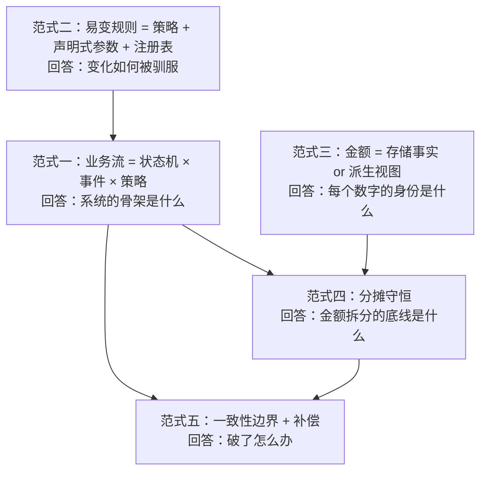

# D3 电商业务心智模型：从业务到技术落地的系统搭建方法论

> 本文不再"讲 Vendure"。Vendure 在本文中只扮演一个角色：**每个方法论论点的"标准答案参照系"**——当你自己面对任何一个交易类系统（电商、供应链、财务、票务、订阅计费）时，本文的五大范式与六步法应该能支撑你独立画出系统蓝图；而 Vendure 的源码（v3.7.x，`vendurehq/vendure`）则是你验证自己答案时可随时翻阅的开卷材料。
>
> 读者预设：前端转全栈开发者，有制造业财务系统（对账模块）开发经验，技术栈 TS/Nest/React。第 4 章会专门把你已有的财务直觉"翻译"成电商设计直觉——这是本文的杀手锏，请带着你的对账经验读。

---

## 1. 心智模型总纲：交易系统的五大范式

所谓心智模型，是你面对陌生业务域时**先于具体技术选型的抽象骨架**。研究了 Vendure 全域（商品、订单、支付、库存、促销、渠道、插件、运行时）之后，可以提炼出一个重要观察：一个 75+ 实体、50+ 策略槽位的电商平台，其复杂度并不来自算法，而是来自**少数几个反复出现的范式在不同业务域的实例化**。掌握范式，就是掌握了"复制能力"——审批流、对账流、开票流、履约流，本质同构。

五大范式之间不是并列清单，而是有依赖层次：

范式一是骨架（业务对象如何活着），范式二是关节（规则如何替换），范式三、四是血液纪律（金额如何不失真），范式五是免疫系统（出事后如何自愈）。图中箭头读作"支撑"：范式二支撑范式一，是因为状态机的迁移时机被外置为策略（§1.1）；范式三支撑范式四，是因为先分清每个金额的身份、分摊口径才有着落；范式一支撑范式四，则是因为分摊守恒只在状态机给出的生命周期时点上才有意义——`ArrangingPayment` 冻结了"要守恒的那个总额"，`Modifying` 与退款守卫决定了"何时按分摊后口径消费"，骨架不先给出这些时点，守恒规则便无处附着。下面逐条按"模式定义 → Vendure 中的实现 → 反例/失败模式 → 迁移检查问题"四段展开。

### 1.1 范式一：业务流 = 状态机 × 事件 × 策略

**模式定义。** 任何有生命周期的业务对象（订单、支付、履约、对账单、发票、审批单），都应该建模为"状态集合 + 合法转移表 + 守卫（guard）+ 钩子（hook）"的状态机，而不是一组布尔标志位或一个被各处代码随意 `update` 的 status 字段。单个状态机之上还有两个乘法因子：**事件**让状态机之间互相感知（A 的迁移触发 B 的重估），**策略**把"何时迁移"的决策点做成可替换件。

**Vendure 中的实现。** 状态机不是订单专属技巧，而是全域统一骨架：订单 13 态（`defaultOrderProcess`，`packages/core/src/config/order/default-order-process.ts`）[^2^]、支付状态流（`defaultPaymentProcess`）[^5^]、履约状态流（`defaultFulfillmentProcess`）[^6^]，全部跑在同一个通用引擎 `FiniteStateMachine`（`packages/core/src/common/finite-state-machine/finite-state-machine.ts`）[^4^] 之上，都遵循"转移表 + `onTransitionStart` 守卫 + `onTransitionEnd` 钩子"三层结构。状态机之间的"感知"靠事件与钩子实现：支付迁移的 `onTransitionEnd` 会调 `orderTotalIsCovered(order, 'Settled')` 判断净额是否覆盖订单总额，达标则把订单推入 `PaymentSettled`[^5^][^10^]；履约转入 `Shipped` 时反向推导订单应为 `Shipped` 还是 `PartiallyShipped`[^6^]。时机决策则外置为策略：预占时点由 `StockAllocationStrategy` 决定[^24^]，"订单何时算已下单"由 `OrderPlacedStrategy` 决定。甚至状态集合本身都不是封闭枚举——通过 TypeScript declaration merging 开放扩展（`order-state.ts`）[^3^]。

**反例/失败模式。** 最经典的失败是"布尔字段组合爆炸"：`isPaid`、`isShipped`、`isRefunded` 三个布尔位理论上允许"未付款但已发货且已退款"这种物理可达、业务非法的状态；其次是"状态旁路"——某个运营后台功能直接 SQL 改 status，绕过全部守卫，从此状态机的所有不变量失效。你在财务系统里见过同构问题：对账单状态如果被手工改库，勾稽关系就再也对不上。

**迁移检查问题。** ① 这个对象的全部状态和**唯一终态**是什么？（Vendure 订单里 `Delivered` 都不是终态，`Cancelled` 才是[^2^]）② 写出转移表后，是否存在"非法但代码物理可达"的组合？③ 状态迁移是否有唯一入口，守卫集中在哪里？④ 这个状态机需要"感知"哪些其他状态机的迁移？⑤ 哪些迁移时点是业务可选项（应策略化），哪些是铁律（应写死在守卫里）？

### 1.2 范式二：易变规则 = 策略 + 声明式参数 + 注册表

**模式定义。** 系统里总有一批规则"必然会变"：支付网关参数、运费规则、促销条件、税率表、编号规则。驯服变化的最小内核是三件套——把每条规则抽象成**策略**（一个带 `code` 的函数对象），给它一份**声明式参数**（`args`，数据而非代码），再把所有策略实例收进一个**注册表**供运行时查找。这就是规则引擎的最小可行形态，再大一步才是 DSL 和低代码。

**Vendure 中的实现。** 这三件套被固化为一个基类 `ConfigurableOperationDef`（`packages/core/src/common/configurable-operation.ts`），并被复用了 6 次以上：`PaymentMethodHandler`、`PromotionCondition`、`PromotionAction`、`ShippingCalculator`、`ShippingEligibilityChecker`、`FulfillmentHandler`、`CollectionFilter` 全是它的子类[^12^][^8^]。参数以 `{code, args}` 的 `ConfigurableOperation` 结构用 `simple-json` 列直接存库——`PaymentMethod.handler`、`Promotion.conditions/actions` 里存的都是"代码引用 + 参数实例"[^13^]，管理员在 Dashboard 改参数即生效，不需要发版。策略若需要依赖注入（如调外部运费费率服务，官方示例 `ShippingRatesService`），实现 `init(injector)` 钩子在启动期注入[^12^]。在此之上，`VendureConfig` 还摆着约 50 个"接口 + 默认实现 + 可替换槽位"的 strategy 位（订单码生成、合单、税区、库存分配、密码校验……），核心只依赖接口，"no forks required"。

**反例/失败模式。** 两个极端都常见：一是规则硬编码——`if (orderTotal > 10000) freeShipping()` 散落在各处，运营每改一次门槛都要排期发版；二是过度设计——第一个促销需求还没落地就先造规则引擎 DSL。Vendure 的尺度感在于：**先统一抽象形状（code+args+注册表），让规则数据化；但绝不发明业务方看不懂的 DSL**。

**迁移检查问题。** ① 这条规则下个季度会变吗？变的概率高就策略化。② 参数由谁改——开发、运营还是客户？非开发改就必须声明式参数 + 配置界面。③ 修改需要运行时生效吗？需要则参数必须存库而非写进配置文件。④ 同类规则未来会有几个实例？≥2 个就值得建注册表。⑤ 这条规则需要访问其他服务吗？需要则预留注入钩子。

### 1.3 范式三：金额字段先问"存储事实 or 派生视图"

**模式定义。** 看到任何一个金额字段，先逼问它的身份：它是**存储事实**（一次发生、不可再算、必须原样持久化的经济事实），还是**派生视图**（可以由其他事实按确定口径重算出来）？存储事实用最小货币单位整数落库；派生视图要么运行时算，要么作为"标明口径的快照"冗余存储。混淆二者是金额 bug 的总根源——你的对账经验对此应该有肌肉记忆：**凭证是存储，报表是计算**；把报表数写回凭证库，账就永远对不平。

**Vendure 中的实现。** 数据库只存"基价"：`ProductVariantPrice` 按 (channel, currency) 二维存最小单位整数，金额列统一 `@Money()` 装饰器，存储/舍入/精度由可替换的 `MoneyStrategy` 控制（bigint 策略、precision=3 支持大宗商品三位小数单价）[^14^][^15^]。展现价、含税价、折后价全部是运行时经价格管线算出来的派生视图：选价 → 数量 → 税 → 促销 → 重算税[^14^][^16^]。GraphQL 层把派生口径显式化成字段对：任何应税价格都成对暴露 `price` / `priceWithTax`[^37^]。OrderLine 上更是一条完整的价格梯度链：`unitPrice`（不含折扣）→ `discountedUnitPrice`（含行内折扣）→ `proratedUnitPrice`（再扣整单分摊，源码注释称其为"the true economic value of the OrderLine"）[^18^]——每一档身份清晰。反方向的教训也在源码里：Refund 实体在 v2.2 把 `items/shipping/adjustment` 三个分解字段全部废弃，只留 `total` 作为唯一权威金额，因为多个"各自可被手工修改的金额字段"必然打架[^9^]。

**反例/失败模式。** 典型事故：订单表同时存 `originalPrice / discountPrice / finalPrice` 三列，由不同代码路径分别维护，某次促销逻辑改版只更新了其中两列——从此订单总额与行合计对不上，月底对账全员加班。另一个隐蔽变种是"引用而非快照"：订单行不存单价、每次展示都现查商品现价，商品一改价，历史订单金额全部漂移。正确姿势是 Vendure 那样：下单即把 `listPrice` 快照进 OrderLine，后续重算只在这条快照链上做加减。

**迁移检查问题。** ① 这个字段能否由其他字段确定性推出？能→派生视图，禁止独立写入口径。② 它是某时刻的快照还是活引用？涉钱、涉税的一律快照。③ 存储单位与精度是什么？浮点存金额直接枪毙。④ 派生口径（税率、分摊规则）未来变了，历史数据需不需要按旧口径重放？需要则口径本身也要存（如 Vendure 把分摊结果存进 adjustment 的 `data.itemDistribution`）[^16^]。⑤ 同一经济量是否存在两个权威字段？存在即是定时炸弹。

### 1.4 范式四：分摊守恒是金额正确的底线

**模式定义。** 任何"总额 → 明细"的拆分（整单优惠摊到行、整行优惠摊到件、总税额摊到行、整票费用摊到 SKU），必须满足三条铁律：Σ明细 ≡ 总额（精确到最小单位）；尾差落点确定（同一输入永远得到同一分配）；**下游一律消费分摊后的口径**（退款、税基、开票、毛利核算）。这是电商引擎里最"财务"的部件，也是你天天在对账系统里做的事。

**Vendure 中的实现。** 整单优惠的分摊在 `OrderCalculator.applyOrderPromotions()`：先按权重策略 `OrderLineDiscountDistributionStrategy.getWeight()`（默认取各行已扣行内折扣的含税行价）算权重，再调 `prorate()`（`packages/core/src/service/helpers/order-calculator/prorate.ts`）——对每份 `Math.floor` 后按误差从大到小逐个 +1，即最大余数法，保证分摊和精确等于总额，尾差确定性地落在误差最大的行[^16^][^17^]。行内再按件做二次分摊，结果持久化进 adjustment 的 `data.itemDistribution`，类型标记为专门的 `DISTRIBUTED_ORDER_PROMOTION`[^16^]。下游消费严格走分摊后口径：税基 = `proratedUnitPrice`（`DefaultTaxLineCalculationStrategy`）[^19^]；按行退款的官方默认换算 = 退款数量 × `proratedUnitPriceWithTax`（`PaymentService.getRefundAmount()`）[^9^]；订单小计 = Σ`proratedLinePrice`（`DefaultOrderTaxCalculationStrategy`）。注意版本语境：v2.2+ 的核心只认 `RefundOrderInput.amount`（传多少退多少），"数量 × `proratedUnitPriceWithTax`"是官方给出的默认换算口径，由调用方（Admin UI / 集成层）据此算出 `amount` 再传入——核心本身不再替你把"行"换算成金额[^9^]。另有负价保护：任何促销组合不能把一行打成负价（`OrderLine.addAdjustment()` 钳制）[^18^]。失败案例同样值得读：默认策略在"取消某行"后会把该行承担的整单折扣**重新分配**给留存行，导致部分退款后订单总额减少得比退款额还多（issue #4811/#3098）——v3.7.0 的解法是把分摊权重抽成可替换策略，需要"分摊对退款不可变"的商家按下单时原始数量自定义权重[^21^][^22^]。

**反例/失败模式。** ① 各行四舍五入再求和，与整单差 1 分钱——财务月底必现的"一分钱差异"。② 退款按原价退：买家买了享受整单满减的商品，退一件却按未分摊价格退，优惠被"薅"回来。③ 分摊结果不持久化、每次现算：口径稍改，历史退款单就再也解释不清当初为什么退这个数。

**迁移检查问题。** ① 分摊后求和是否恒等于总额？写一条性质断言（property test）。② 尾差落点是否确定且可解释？③ 部分退款/部分开票/逐行税基各自消费哪个口径，三者一致吗？④ 分摊结果是否随单持久化、可重放？⑤ 分摊权重在售后（退行、改量）后是否允许变化？允许，就要接受 #4811 式的总额漂移；不允许，就用原始数量权重。

### 1.5 范式五：一致性边界是有意识画出来的，破了要有补偿

**模式定义。** 系统构建者的标志不是"处处加锁"，而是**知道每条一致性边界画在哪、破了之后的补偿是什么**。做法：枚举系统中的资源对（库存×订单、支付×订单、队列×消费者……），逐对判断并发冲突的代价；强一致处用事务/锁，弱一致处显式写下检测手段（对账点）与补偿动作（退款、人工、重试）。

**Vendure 中的实现。** 这套取舍在 Vendure 里是"开了灯"的：任务队列抢占用 `pessimistic_write` 行锁、访客单与登录单合并用悲观锁——因为这些冲突丢了就静默出错；而库存扣减刻意留白，`StockLevelService` 是无锁的 read-modify-write（先 `findOne` 再 `update(id, old+change)`），GitHub issue #3508 实测复现了"库存 1 件、两个并发 checkout 均成功、库存变负"[^25^]。这不是疏忽，是"高并发商城宁可超卖后补偿、不愿全链路串行化"的明确取舍，配套的是三道软闸门（加购时 `constrainQuantityToSaleable`、支付完成时 Allocation 预占、履约时 `ensureSufficientStockForFulfillment` 闸住超卖发货）与兜底工具（`@Transaction` 可指定隔离级别至 SERIALIZABLE）[^23^][^25^]。支付边界更典型：网关网络调用**刻意放在 DB 事务外**，源码注释明确警告"网关扣款成功但 DB 写失败会产生孤儿扣款（orphaned charge），需在更高层对账处理"[^9^]——边界画在事务外，补偿就是对账。事件层面同样给两档语义：默认订阅者在事务提交后才收到事件（`awaitActiveTransactions`，订阅者永远读不到中间态），需要强一致的用 `registerBlockingEventHandler()` 同事务执行、可回滚、可排序[^34^]。

**反例/失败模式。** 一端是全链路 SERIALIZABLE：大促时热点库存行锁死、吞吐崩盘；另一端是"不知道会破"：没有任何锁，也没有对账点，超卖、重复扣款发生了却无人察觉，直到客诉上门。失败模式的核心从来不是"没加锁"，而是"没画边界"——破了一个星期没人知道。

**迁移检查问题。** 对每对资源冲突问五个问题：① 最坏情况是什么（超卖一件？重复收款？）？② 能接受吗？能→最终一致 + 补偿；不能→锁/事务/串行化。③ 破了我能从数据里发现吗——对账点在哪张表、哪个字段？④ 补偿动作是什么，自动还是人工？⑤ 这条边界写在文档/代码注释里了吗（像 Vendure 的 orphaned charge 注释那样），还是只存在于某个老员工的脑子里？

---

## 2. 电商业务域全景：从买家旅程到系统边界

范式是"怎么看"，本章是"看什么"——把电商业务域切成可以逐块落系统的地图。切法有两轴：买家视角的**时间轴**（旅程八环节），与卖家/平台视角的**运营轴**。

### 2.1 买家旅程八环节 → 每个环节的系统职责

| 环节 | 买家动作 | 系统职责（必须回答的问题） | Vendure 参照 |
|---|---|---|---|
| 1. 浏览 | 搜、逛、筛 | 目录组织（分类/多维筛选）、搜索召回与排序 | Collection（规则分组）vs Facet（多维标签）；DefaultSearchPlugin 可换 Elasticsearch[^30^] |
| 2. 加购 | 选 SKU、选数量 | 可售校验、价格快照、购物车归属（匿名/登录） | 无 Cart 实体：购物车 = `AddingItems` 状态的 Order，`ActiveOrderStrategy` 按会话解析[^35^] |
| 3. 下单 | 填地址、选配送、用券 | 下单前置校验（有行/有客户/有配送/有库存）、价格重算 | 进入 `ArrangingPayment` 前 4 道守卫；`OrderCalculator.applyPriceAdjustments()` 全量重算[^2^][^16^] |
| 4. 支付 | 选支付方式、付款 | 授权/结算两阶段、多笔支付覆盖判定、幂等 | `ArrangingPayment` 冻结订单内容；`orderTotalIsCovered()`；Stripe 插件幂等键 `${order.code}_${amountInMinorUnits}`[^7^][^10^][^11^] |
| 5. 履约 | 等发货 | 预占→实扣时点、拆单/多仓、发货单状态 | `Fulfillment` 状态机 + 一单多履约 + `StockLocationStrategy` 选仓[^6^][^23^] |
| 6. 收货 | 签收 | 送达确认、订单推进到终态 | 履约 `Delivered` 反推订单 `Delivered`[^6^] |
| 7. 售后 | 退款、退货、改单 | 改单不毁账（红冲式修改）、退款口径、库存回补 | `Modifying`/`ArrangingAdditionalPayment` 状态 + `OrderModification` 记录 + Refund 挂 Payment[^2^][^9^] |
| 8. 复购 | 再来一单 | 客户资产沉淀（历史、分组、标签）、再营销钩子 | `Customer` + `CustomerGroup`（分组的促销/税/价格钩子全挂在它上面）[^37^][^40^] |

这张表的用法是"逐格问自己：如果我来建这个系统，这一格的职责我打算用哪个模块承担？"。注意第 2 格与第 3 格之间藏着 Vendure 最重要的一个设计决断——**不单独建 Cart 实体**：购物车只是订单状态机的前段状态，加购、改数量、贴券与下单后的改单复用同一套 `OrderService`/`OrderModifier` 逻辑，避免"购物车逻辑写一遍、订单逻辑再写一遍"的双胞胎 bug[^35^]。这张表也天然是分工图：浏览/加购偏读模型与缓存，支付/履约偏写模型与一致性，售后偏账务严谨性——一个八环节旅程，其实已经隐含了后面六步法里所有的决策点。

### 2.2 卖家/运营视角：四条作业线

买家旅程是前台的一条线，卖家侧是并行的四条线：

- **商品运营**：建品、定价、上下架、多语言、多渠道铺货。系统职责是"可卖的物如何建模"（SPU/SKU 分层、价格挂在 SKU 粒度）与"一份商品多处投放"（渠道共享与差异化）。Vendure 的答案是 Product/ProductVariant 四分体 + `ChannelAware` 多对多分配[^27^]。
- **订单运营**：审单、拆合单、代客下单、异常单处理。系统职责是后台操作必须**走同一台状态机**（Vendure 的 `Draft` 状态就是"管理员代客下单"的一等公民入口[^2^]），而不是给运营开 SQL 后门。
- **资金对账**：网关流水 vs 平台收款 vs 退款，日终核对。系统职责是每笔资金有唯一对账键、有明确的授权/结算时点——第 4 章展开。
- **售后**：退款审批、退货入库、补偿。系统职责是"改单不毁账"：一切变更留痕为可审计的修改记录与红冲流水，而非原地涂改。

四条线与买家八环节相交的地方，就是系统边界的"接缝"：商品运营 × 浏览 = 搜索索引同步；订单运营 × 支付 = 手工收款登记（Vendure 的 `createManualPayment()`）[^9^]；资金对账 × 售后 = 退款勾稽；售后 × 履约 = 退货入库的 `Cancellation` StockMovement[^23^]。画系统蓝图时，先画八环节主线，再把四条运营线作为泳道叠上去，模块边界基本就浮出来了。

### 2.3 B2C vs B2B 差异矩阵

同一个交易内核，B2C 与 B2B 的差异集中在六行：

| 维度 | B2C | B2B |
|---|---|---|
| 定价 | 统一标价，促销驱动 | 客户专属价/合同价/阶梯价，价格本身是权限 |
| 支付/账期 | 下单即付（在线支付） | 账期挂账、先货后款、月结（Net-30/60） |
| 审批 | 无（买家即决策者） | 采购审批流（提交人 ≠ 审批人，多级） |
| 发票 | 电子普票、事后补开 | 增值税专票、先票后款/先款后票、价税分离严格 |
| 数量 | 件级零售 | 起订量、批量阶梯、大宗（单价可需 3 位小数） |
| 税 | 含税价展示 | 不含税价展示、客户组差别税率、免税资质 |

分析：这六行差异里，**没有一行需要换交易内核**——它们全是范式二（策略化）与"主体边界"的实例化。Vendure 的落地路径验证了这一点：客户专属价用 `OrderItemPriceCalculationStrategy`（v2.0 起加购价格感知数量，官方定位即批发阶梯价）+ `CustomerGroup` 实现[^38^][^39^]；账期用"支付资格检查器 + 直接结算的支付处理器"组合——社区插件 `payment-extensions` 的 `isCustomerInGroupPaymentChecker` 让"挂账"支付方式仅对协议客户组可见，`settleWithoutPaymentHandler` 直接置 Settled 不实际收款，即 Net-30 的最小实现[^31^]；审批流在开源 Core 用自定义 `OrderProcess` 插入 `AwaitingApproval` 状态自建，商业版 Platform 提供通用审批引擎与报价管理（官方宣称，无开源源码佐证）[^32^]；大宗单价用 `MoneyStrategy.precision = 3`[^15^]；差别税率走 `TaxRate` 绑定 `CustomerGroup` 的原生钩子[^37^]。结论：B2B 不是另一个系统，而是"同一个内核 + 更严格的金额纪律 + 三个策略槽位"。

---

## 3. 从业务到技术的落地方法论：六步法

这是全文重心。给你一个空白需求（"我们要做一个交易平台/供应链系统/对账平台"），六步法是把它落成系统蓝图的固定动作序列：

顺序有讲究：状态图决定骨架（①），金额与库存是两条最硬的业务纪律（②③），主体边界决定数据怎么隔离（④），一致性是穿针引线的横切决策（⑤），扩展槽位是面向未来的保险（⑥）。每步都给出"动作 → 检查清单 → Vendure 参照"三段。

### 3.1 第一步：画业务流状态图（找名词 → 找状态 → 找转移条件）

**动作。** 三个子动作，严格按序：
1. **找名词**：从业务描述里圈出所有"有生命周期的名词"——订单、支付单、发货单、退款单、对账单、发票。注意区分"有状态的名词"（值得状态机）与"纯数据名词"（地址、商品，CRUD 即可）。判据：它有没有"不能做什么"的规则？有→有状态。
2. **找状态**：对每个有状态名词，列出全部语义状态，并标出**唯一终态**。技巧：从钱和货的视角各推一遍——钱的视角：未付→已授权→已结算→已退；货的视角：未发→部分发→全发→送达。两个视角推出来的状态集合往往不一致，不一致处正是 `PartiallyShipped` 这类中间态的来源。
3. **找转移条件**：为每条转移箭头标注触发者（用户动作/系统事件/定时任务/外部回调）与前置守卫。然后做反向练习：对每个状态问"它绝不能直接跳到哪些状态"，非法转移表比合法转移表更能暴露设计漏洞。

**检查清单。** □ 每个有状态名词都有一张转移表；□ 每个状态机有唯一终态；□ 标出了所有"外部系统回调触发"的转移（这是幂等与乱序的高发区）；□ 标出了状态机之间的联动边（谁感知谁）；□ 冻结点明确（哪个状态之后对象内容不可再改）；□ 售后路径走查过（从每个中间态出发能否走到取消/退款）。

**Vendure 参照。** 订单 13 态全转移表定义在 `default-order-process.ts`，`Cancelled` 是唯一终态，`ArrangingPayment` 是冻结点（进入后不允许再改订单内容，保证"发给网关的金额 = 顾客看到的金额"），且进入前有 4 道守卫：有行、有 Customer、有配送方式、库存充足[^2^][^1^]。守卫即代码：`checkPaymentsCoverTotal` 要求对应状态的 Payment 净额覆盖 `totalWithTax` 才允许迁往 `PaymentSettled`[^2^][^10^]。状态机联动边：支付→订单（净额达标推单）、履约→订单（全发反推）[^5^][^6^]。

### 3.2 第二步：定金额模型（单价来源、税口径、优惠分摊规则、退款规则）

**动作。** 金额模型四问，全部写成一页纸的"金额口径文档"：
1. **单价来源**：单价从哪来？基价存哪、按什么维度隔离（渠道/币种/客户组）？有没有运行时动态定价（阶梯价、协议价）？下单时如何快照？
2. **税口径**：标价是含税价还是不含税价（`pricesIncludeTax` 级别的全局口径）？税率由哪几个因素决定（品类 × 地区 × 客户组）？税基是折前价还是折后价？
3. **优惠分摊规则**：整单级优惠按什么权重摊到行？守恒算法是什么（最大余数法）？分摊结果是否持久化？售后（退行/改量）后分摊是否允许重分配？
4. **退款规则**：按哪个口径退（原价/行内折后价/整单分摊后价）？退到哪笔收款（一单多笔支付时）？部分退款怎么算？退款与库存回补解耦吗？

**检查清单。** □ 所有金额以最小单位整数存储，无浮点；□ 每个金额字段标注了"存储事实 / 派生视图"身份；□ 存在一条明确的"价格梯度链"（标价→行内折后→整单分摊后），每档有名字；□ 税基 = 分摊后口径，且"先折后税、促销后重算税"的顺序写死；□ 退款公式 = 数量 × 分摊后含税单价；□ 分摊守恒有性质断言测试；□ 负价保护（任何优惠组合不能打出负价行）。

**Vendure 参照。** 五阶段价格管线（`ProductVariantPrice` 基价 → 选价策略 → `OrderItemPriceCalculationStrategy` 定 `listPrice` → 税 → 促销 → 重算税）[^14^][^16^]；`proratedUnitPrice` 即"真实经济价值"，税、退款、小计全部消费它[^18^][^19^][^9^]；`MoneyStrategy` 统一存储/舍入/精度[^15^]；Refund 只有 `total` 一个权威金额[^9^]；#4811 教你把"分摊是否对退款不可变"作为一个**必须显式回答的业务问题**，而不是实现细节[^21^][^22^]。

### 3.3 第三步：定库存模型（预占时点、实扣时点、回补规则、超卖策略）

**动作。** 库存模型四问：
1. **预占时点**：什么时刻把"已售未发"的量从可售池扣掉？候选：加入购物车即占（票务式，体验硬但占用率高）、下单即占、支付成功才占（Vendure 默认）。
2. **实扣时点**：什么时刻真正减现存量？候选：支付即扣、履约创建时扣、发货确认时扣。预占到实扣之间的窗口期就是"allocated 但未扣减"的中间态，必须有名有姓。
3. **回补规则**：取消未发货的行→释放预占；取消已发货的行→回补现货。两条路径严格分开，回补按每行流水净额分流——部分履约的行被取消时，同一行会合法产生 Release（未履约净额，减预占）+ Cancellation（已履约净额，回补现货）两条流水，但同一单位绝不重复回补。
4. **超卖策略**：允许超卖吗（backorder）？允许的话用什么参数化（如负的可售阈值）？不允许的话防护链有几道、并发下最坏情况是什么？

**检查清单。** □ 可售公式写成一个显式等式（参照 `saleable = onHand − allocated − outOfStockThreshold`）[^23^]；□ 预占/实扣时点各由一个可替换策略决定而非写死；□ 库存变动全部留流水（谁、何时、为何、多少），现存量可由流水重放核对；□ 取消路径区分"已履约/未履约"两种回补；□ 履约侧有最终闸门（钱可以超收后退款，货不能超发）；□ 并发超卖的最坏情况已评估并对齐业务预期。

**Vendure 参照。** 双账结构：`StockLevel`（`stockOnHand` + `stockAllocated`，(variant, location) 唯一）管现值，`StockMovement` 单表继承五子类（`Allocation`/`Sale`/`Release`/`Cancellation`/`StockAdjustment`）管流水[^23^]。预占默认在 `ArrangingPayment → PaymentAuthorized|PaymentSettled`（`DefaultStockAllocationStrategy`，可换成"加购即占"）[^24^]；实扣在 Fulfillment `Created→Pending`（Allocation 转 Sale）[^6^]；回补按每行流水净额决定走 Release 还是 Cancellation（`OrderModifier.cancelOrderByOrderLines()`）[^26^]；backorder = `outOfStockThreshold` 设负数[^23^]；超卖防护是"三道软闸门 + 明知无锁"的取舍（#3508），履约闸门 `ensureSufficientStockForFulfillment` 保证"允许超卖下单，不允许超卖发货"[^25^]。

### 3.4 第四步：定主体边界（渠道/租户/权限三件套）

**动作。** "多主体"是交易系统的成年礼：多渠道、多店铺、多卖家、多法人、多账簿——名字不同，结构同构。落地三件套，一件不能少：
1. **请求入口路由**：请求一进门就确定它属于哪个主体（子域名/token 头/API key），此后全链路隐式携带，业务代码不再到处传参。
2. **实体关系标记**：每个业务实体声明自己与主体的关系——多对多标记（一个商品投放到多个渠道）或单属（一张订单只属于一个渠道）。
3. **查询强制过滤**：所有查询在构造器层强制叠加主体条件，漏写过滤在类型/框架层面就不可能发生，而不是靠每个开发自觉。

**检查清单。** □ 主体上下文在请求入口处一次性解析，之后通过上下文对象传递（参照 `RequestContext` 携带 channel/language/currency/session）[^29^]；□ 每个实体都回答过"它对主体可见性是什么"（含共享基础数据——税、地区通常是全局共享的，不应给租户写权限）[^27^]；□ 查询层有强制过滤机制，无法旁路；□ 权限可以按主体限缩（某角色只在某渠道内有效）；□ 存在一个"全局视图"主体供超管使用（参照 default Channel 永远包含所有实体）[^27^]。

**Vendure 参照。** 入口：`vendure-token` 请求头解析 Channel，`Session.activeChannelId` 绑定会话[^27^][^29^]。标记：13+ 内置实体 `ChannelAware`（Product、ProductVariant、Promotion、PaymentMethod、ShippingMethod、Customer、Role、StockLocation……），多对多中间表物理实现[^27^]。过滤：`ListQueryBuilder.build(..., { channelId: ctx.channelId })` / `TransactionalConnection.findOneInChannel()` 自动按 Channel 过滤；自定义实体实现 `ChannelAware` 接口即接入同一机制[^28^]。权限：Role 本身 ChannelAware，"Seller Product Manager" 只看得到自己的 Channel。制造业类比：多法人/多账簿完全同构——token 路由 ≈ 账套切换，ChannelAware ≈ 凭证上的法人字段，强制过滤 ≈ 报表引擎的账套条件。

### 3.5 第五步：选一致性方案（每对资源冲突画边界 + 写补偿）

**动作。** 产出一张"一致性边界表"，逐行填写：

| 资源对 | 并发冲突场景 | 最坏情况 | 可接受？ | 方案（锁/事务/软闸门/最终一致） | 破了如何发现（对账点） | 补偿动作 |
|---|---|---|---|---|---|---|
| 库存 × 下单 | 两人同时买最后一件 | 超卖一件 | 视业务 | 软闸门 + 预占 | 库存为负的流水监控 | 缺货赔付/砍单退款 |
| 支付 × 订单 | 网关成功、本地写库失败 | 孤儿扣款 | 不可接受但无法避免 | 网关调用放事务外 | 网关流水 vs 本地 Payment 日终对账 | 自动退款/人工销账 |
| 队列 × 多消费者 | 两人抢到同一任务 | 任务执行两次 | 不可接受 | `pessimistic_write` 行锁抢占 | 任务状态审计 | —— |
| 订单 × 合并 | 游客单与登录单并发合并 | 数据错乱 | 不可接受 | 悲观锁 | —— | —— |

分析：锁的位置为什么是"逐对评估"而非全局风格？因为锁不是免费的——它把"数据出错的风险"兑换成"吞吐的税"，而不同资源对的汇率天差地别。队列抢占与订单合并是低频管理面操作，冲突一次就是静默错误，锁的成本几乎为零、换来的是确定性，这笔买卖必做；库存扣减是前台最高频的热点路径，大促时同一 SKU 的库存行是全站最热的数据行，串行化的吞吐税贵到付不起，而其失败形态（超卖一件）恰好有可见信号（负库存流水）与可执行补偿（缺货赔付/砍单退款），所以值得用风险换吞吐。支付 × 订单一行则说明第三种情形：锁根本够不着网关——资源对跨越网络边界时，一致性"边界"只能退化为对账点 + 补偿动作。可见逐对评估的本质是按"冲突概率 × 损失可逆性 × 锁的吞吐税"逐行定价：全局悲观锁是让所有资源对都按最贵的那对交税，全局无锁是让所有资源对都暴露于最脆弱那对的风险，两者都是懒政。

**检查清单。** □ 表中每一行的"破了如何发现"都有具体的数据出处（表、字段、核对频率），而非"应该不会发生"；□ 强一致处用了锁/事务且评估过热 key 风险；□ 弱一致处的补偿动作有 owner（自动 Job 还是人工 SOP）；□ 所有外部网络调用都在 DB 事务外，且两端状态有对账键关联；□ 事件订阅语义明确（提交后投递 or 同事务阻塞），订阅者不会读到中间态。

**Vendure 参照。** 队列抢占与订单合并用悲观锁，库存留白走软闸门——锁的位置是逐对评估的结果，不是全局风格[^25^]。孤儿扣款的源码注释（`PaymentService.createPayment()`）是"边界 + 补偿"写进代码的范例[^9^]。EventBus 双档语义（`awaitActiveTransactions` 提交后投递 / `registerBlockingEventHandler` 同事务可回滚可排序）展示了"同一机制提供强弱两档一致性"的正确姿势[^34^]。

### 3.6 第六步：留扩展槽位（哪里未来一定会变 → 策略化）

**动作。** 做一次"变化预测走查"：对系统每个模块问"这个决策点，三年内会不会出现第二个实现？"会→今天就定义接口 + 默认实现 + 注册槽位；不会→老老实实写死，避免过度抽象。电商域的高频答案清单：支付方式、运费计算、促销条件/动作、税率/税区判定、定价规则、库存分配、选仓、订单编号生成、搜索引擎、资产存储、通知渠道、任务队列实现。

**检查清单。** □ 每个槽位都是"接口 + 默认实现 + 配置注入"，核心代码只依赖接口；□ 运行时要被运营调整的规则升级为"策略 + 声明式参数 + 注册表"三件套（范式二）；□ 核心功能自己也走扩展点（dogfooding）——这是扩展机制健康的自检金标准：如果核心可以走后门，扩展点一定会烂掉；□ 扩展接口有版本契约（参照插件的 `compatibility` semver 声明 + 启动硬校验）；□ 每个槽位写了一句"什么业务变化会用到它"，写不出来的槽位删掉。

**Vendure 参照。** 约 50 个 strategy 槽位覆盖订单码生成、合单、定价、税区、库存分配、密码校验等；核心搜索功能 `DefaultSearchPlugin` 本身就是用同一 `@VendurePlugin` 机制实现的插件，换搜索引擎 = 从 plugins 数组移除它、换上 `ElasticsearchPlugin`——核心没有特权接口，扩展点因此必须通用、稳定、有版本契约[^30^]。判断你自己设计的平台扩展机制是否健康，就看这一条：**核心功能自己用不用它**。

---

## 4. 业财一体：电商四流与财务四表的对接

这一章是专门为你（有对账模块经验）设计的"翻译层"。你在制造业财务系统里天天处理的概念——应收、核销、存货核算、红冲、价税分离——在电商里一个不少，只是换了名字。**学完电商设计的捷径，就是把你已有的财务直觉逐条映射过去。**

### 4.1 四流对接：订单流 → 应收/收入确认，资金流 → 收款流水/核销，库存流 → 存货核算，票据流 → 开票

**订单流 → 应收 / 收入确认。** 订单状态机的支付相关状态，本质就是收入确认时点的业务表达：`ArrangingPayment`（订单金额已冻结 = 合同金额确定）、`PaymentAuthorized`（银行已冻结额度 = 收款权利高概率成立，但**资金尚未划转**——这正是财务上"不满足收入确认条件"的状态）、`PaymentSettled`（资金到账 = 收款完成）。官方对 authorization/settlement 的定义——"授权仅冻结额度不发生划转，结算才真正划转"[^7^]——与"发货确认收入 vs 收款确认收入"的口径之争同构。一单多笔支付时，`totalCoveredByPayments(order, state)` 按"指定状态的 Payment 之和 − 各自已 Settled 退款"计算净覆盖额[^10^]，这就是**应收账款核销公式**的电商版：应收 = `totalWithTax`，已核销 = 净支付额，差额 = 未收余额。B2B 账期场景更直白：`settleWithoutPaymentHandler` 直接把 Payment 置 Settled 而不实际收款[^31^]——这在电商侧叫"先货后款"，在财务侧就是一笔**挂账应收**，后续线下收款后凭流水销账。

**资金流 → 收款流水 / 核销。** 三条规定动作，条条是你的老本行：① 每笔收款流水必须有**唯一对账键**——`Payment.transactionId` 存网关流水号，是与支付网关对账的主键[^9^]；② 退款 = 红冲——`Refund` 挂在具体某一笔 `Payment` 下而非直接挂订单，一张订单多笔收款时退款必须指明"从哪笔收款里退"，这与"红字凭证必须指定冲销哪张蓝字凭证"是完全相同的纪律；③ 退款金额口径必须可解释——v2.2 起 `Refund.total` 是唯一权威金额，核心只认传入的 `amount`；按行退款时官方默认按"数量 × 分摊后含税单价（`proratedUnitPriceWithTax`）"换算出该金额（即 §1.4 的版本语境：换算是 Admin UI / 集成层职责），"整单优惠摊到这一行的那部分折扣，退款时拿不回来"[^9^][^16^]。另外注意资金与库存的解耦：**退款不动库存**，库存回补只跟随订单行取消的 StockMovement 路径[^26^]——红冲凭证也不该顺手改库存账，两条账各走各的，月底在对账点会合。

**库存流 → 存货核算。** Vendure 的库存双账就是存货核算的标准结构：`StockMovement` 是**存货明细账**（每一笔变动留痕：类型、数量、仓库、关联单据），`StockLevel` 是**存货余额表**（现存量 + 已锁定量）[^23^]。五种流水类型对应五种存货业务：`Allocation` = 存货锁定（已售未发，不可再售但未出库）、`Sale` = 出库（数量记负，同时减锁定与现存）、`Release` = 释放锁定（订单取消、货未出库）、`Cancellation` = 退货入库（已出库的货回来了）、`StockAdjustment` = 盘盈盘亏手工调整。"余额表可由明细账重放核对"这一条，就是存货模块月结时"明细账 vs 余额表"核对的数据基础。

**票据流 → 开票。** 电商内核普遍不内置发票（Vendure 核心无发票实体），因为发票是**强本地法规域**，正确做法是外挂票据模块：社区 `pinelab-invoice-plugin` 提供了参考实现——递增发票号、PDF 模板、按渠道开关、`InvoiceCreatedEvent` 事件、可导出到 Xero 等会计系统；其"贷记发票（credit invoice）"机制就是红冲：先开一张负票冲掉原票再重开，绝不涂改原票[^33^]。开票的金额口径直接复用价格梯度链：价税分离 = `proratedLinePrice`（不含税）与 `proratedLinePriceWithTax`（含税）两个字段现成的差值，票面折扣 = 分摊后口径——这就是为什么第 3 章说分摊守恒是"开票正确的上游"。

### 4.2 对账清单：电商侧 vs 财务侧的核对点

| 核对点 | 电商侧数据 | 财务侧数据 | 差异处理 |
|---|---|---|---|
| 支付网关对账 | `Payment`（amount、state、`transactionId`） | 网关结算流水 / 银行回单 | 孤儿扣款（网关有、本地无）→ 退款或补登记；Declined 误扣 → 追网关 |
| 授权未结算 | `Authorized` 状态 Payment 清单 | 信用卡预授权额度报告 | 超期未 capture（Stripe 预授权窗口约 7 天，行业常识）→ 释放或重新授权 |
| 退款勾稽 | `Refund.total` + `RefundLine`（追溯） | 网关退款流水 / 贷记凭证 | 网关成功本地 Failed → 重推 `settleRefund`；金额差 → 查分摊口径 |
| 优惠与税基 | Σ`proratedLinePrice`（分摊后小计） | 应税销售额 / 销项税申报基数 | 差一分钱 → 查最大余数法尾差落点是否两侧一致 |
| 库存与存货 | Σ`StockMovement` 重放 vs `StockLevel` | 存货明细账/余额表月结 | 负库存行（超卖证据）→ 归因到 #3508 式并发窗口，补采购或砍单 |
| 发票与订单 | 开票申请（价税分离金额） | 已开发票台账 | 红冲链路：credit invoice ↔ 退款单 ↔ 订单行取消 三单勾稽 |

分析：这张表的结构就是你在制造业对账模块里见过的"双边核对 + 差异归因"模板，只是左栏换成了电商实体。三个要点值得强调：第一，**每个核对点的电商侧都必须有唯一键和快照口径**（`transactionId`、`Refund.total`、`proratedLinePrice`），这正是六步法第 2、5 步在"破了对账"视角下的验收标准——设计时没留对账键，月底就是人肉 Excel 地狱。第二，**差异几乎都是"边界外事件"造成的**：孤儿扣款生在网关与 DB 之间，超卖生在两个并发事务之间，授权超期生在时间与状态机之间——对账点是给一致性边界"收尾"的机制，这与范式五互为表里。第三，红冲式思维贯穿全表：退款不删支付、贷记发票不改原票、库存取消只补流水不改历史——电商系统与财务系统共享同一条铁律，**账务数据只增不改，纠错用反向凭证**。

### 4.3 经验反向映射：对账直觉 → 电商设计直觉

把你已有的六条财务直觉直接"编译"成电商设计决策：

1. **"每笔流水要有唯一对账键"** → 设计支付集成时，第一件事不是调通支付，而是确定 `transactionId`、幂等键（参照 Stripe 插件的 `${order.code}_${amountInMinorUnits}`[^11^]）与回调验签的位置。
2. **"改单不毁账，红冲再重开"** → 售后改单用修改记录 + 差额收退建模（Vendure 的 `Modifying` 状态 + `OrderModification` + `ArrangingAdditionalPayment` 补款状态），而不是原地 update 订单行[^2^]。
3. **"总额必须等于明细之和"** → 一切分摊走最大余数法守恒，尾差落点确定，且分摊结果随单持久化（范式四）。
4. **"授权不等于结算"** → 状态机里 `Authorized` 与 `Settled` 必须是两个状态而非一个布尔位，因为它们的财务含义（收入确认、对账口径、超期处理）完全不同[^7^]。
5. **"快照口径，不追溯历史活数据"** → 下单即快照价格与税率，历史订单永远按当时口径解释（`listPrice` 快照 + `itemDistribution` 持久化）。
6. **"先审后放，闸在出货口"** → 钱错了可以退款补偿，货出去了追不回——所以履约闸门（`ensureSufficientStockForFulfillment`）是硬校验，而下单侧可以软校验[^25^]。

一句话总结本章：**电商系统是财务系统的"上游事实发生器"**。你在对账模块里养成的每一条洁癖——对账键、快照、守恒、红冲、闸门——都是电商系统设计的一等业务需求。这就是为什么有财务背景的人做交易类系统，起点比纯 CRUD 开发者高半档。

---

## 5. 能力蜕变自检清单

### 5.1 CRUD 开发 vs 系统构建者的 10 条分界线

| # | 维度 | CRUD 功能开发 | 系统构建者 |
|---|---|---|---|
| 1 | 建模起点 | 从字段和表开始想 | 从状态机和业务流开始想 |
| 2 | 金额处理 | 浮点/decimal 随手存，多处更新 | 最小单位整数；先判"存储事实 or 派生视图" |
| 3 | 优惠/分摊 | 展示层四舍五入 | 最大余数法守恒，分摊结果持久化可重放 |
| 4 | 并发 | 没考虑过或"数据库会处理" | 逐对资源画一致性边界，破了有补偿 |
| 5 | 外部调用 | 包在事务里一把梭 | 网络调用放事务外，两端有对账键，考虑孤儿数据 |
| 6 | 规则变化 | 改代码、发版 | 策略 + 声明式参数 + 注册表，运营可配 |
| 7 | 多主体 | 每个需求加一张表/一个字段 | 入口路由 + 实体标记 + 强制过滤三件套 |
| 8 | 售后 | "再写个退款接口" | 红冲式思维：只增不改，反向凭证，三单勾稽 |
| 9 | 幂等与回调 | 假设回调恰好一次、按序到达 | 假设会重复、会乱序、会丢失，键控幂等 |
| 10 | 系统验收 | "功能跑通了" | "月底对账能平、大促不丢单、三年后规则换了不发版" |

分析：十条分界线的共同主题是**时间尺度**。CRUD 思维关注"这次请求对不对"，系统构建者关注"三个月后这笔数据还能不能解释、一百万次并发后还是否成立、业务规则换了三轮之后系统改不改得动"。逐条自看：第 1–3 条是业务建模纪律（对应范式一、三、四），第 4–5 条是一致性工程（范式五），第 6–7 条是可演化性（范式二与主体边界），第 8–9 条是账务与集成的洁癖（第 4 章的全部内容），第 10 条则是把前九条翻译成验收语言。如果你现在的项目自检下来多数落在左列，最快的进步路径不是读更多框架，而是把本项目的对账清单（§4.2 那张表）亲手画出来——对账视角会强迫你把所有"时间维度上的问题"提前到设计阶段。

### 5.2 "是否真懂"自测题 15 道（附答案要点）

1. **为什么 Vendure 不建 Cart 实体？** —— 购物车即 `AddingItems` 状态的 Order；加购与改单复用同一套逻辑，避免双胞胎实现；`ActiveOrderStrategy` 按会话解析当前单。[^35^]
2. **`ArrangingPayment` 状态为什么不允许再改订单内容？** —— 冻结点：保证发给支付网关的金额 = 顾客下单时看到的金额；要改需合法退回 `AddingItems`。[^2^]
3. **订单 13 态里唯一的终态是哪个？为什么 `Delivered` 不是？** —— `Cancelled`；`Delivered → Cancelled` 是合法转移（售后整单取消）。[^2^]
4. **一笔订单的应付金额是如何计算的？一单多笔支付时呢？** —— `totalWithTax − totalCoveredByPayments`；每笔 Payment 覆盖一部分，净额 = Σ支付 − Σ已结算退款。[^10^]
5. **授权（Authorized）与结算（Settled）的区别？为什么必须建模为两个状态？** —— 授权仅冻结额度、无资金划转；结算才划转。财务口径（收入确认/对账/超期释放）不同。[^7^]
6. **退款为什么挂在 Payment 上而不是 Order 上？** —— 一单多笔收款时，退款必须指明从哪笔收款退（红冲指定蓝字凭证）。[^9^]
7. **整单优惠 $10 摊到 3 行，各行摊多少、尾差给谁？** —— 按权重（默认各行折后含税价占比）+ 最大余数法，尾差 +1 给误差最大的行；Σ ≡ $10。[^17^]
8. **退一件享受了整单满减的商品，按什么价格退？** —— 按数量 × `proratedUnitPriceWithTax`（分摊后含税单价）换算，摊到该行的优惠不退；v2.2+ 核心只认 `amount`，此换算是调用方（Admin UI/集成层）职责。[^9^]
9. **`stockOnHand=10, stockAllocated=3, outOfStockThreshold=0`，可售多少？阈值改成 -5 意味着什么？** —— 7；负阈值 = backorder，允许物理无货继续售卖。[^23^]
10. **库存的预占和实扣分别发生在什么时点？取消一单未发货订单和取消已发货订单，库存处理有何不同？** —— 预占：支付授权/结算时（Allocation）；实扣：Fulfillment 转 Pending（Sale）。未发货取消走 Release 释放预占；已发货取消走 Cancellation 回补现货。[^24^][^6^][^26^]
11. **issue #3508 暴露了什么问题？Vendure 为什么"不修"？你的系统该抄哪部分？** —— 无锁 read-modify-write 下并发 checkout 超卖、库存变负；这是正确性 vs 吞吐的取舍，软闸门 + 履约闸门 + 对账补偿兜底；抄的是"画边界 + 写补偿"的方法，不是抄无锁。[^25^]
12. **`ConfigurableOperationDef` 三要素是什么？被哪些机制复用？** —— code + 声明式 args + 注册表（+ `init(injector)` 注入）；支付 handler、促销条件/动作、运费计算/资格、履约 handler、CollectionFilter。[^12^]
13. **设计多店铺系统，三件套是什么？各自防什么错？** —— 入口路由（防业务代码到处传 tenantId）、实体标记（防漏标可见性）、查询强制过滤（防跨租户越权读）。[^27^][^28^]
14. **退款会回补库存吗？为什么这样设计？** —— 不会；资金账与库存账解耦，回补只走订单行取消的 StockMovement 路径——两条账各自闭环，在对账点会合。[^26^]
15. **判断一个平台扩展机制是否健康的金标准是什么？** —— 核心功能自己是否走同一扩展协议（dogfooding）；核心有特权接口，扩展点必烂。[^30^]

**自评参考**：答对 12+ 道，你已经具备独立设计交易类系统的骨架思维，可直接进 D4 的源码精读把答案全部代码化；答对 8–11 道，骨架已有但金额纪律（第 7–9 题）或一致性（第 11 题）需回到第 1、3 章重读对应范式；答对不足 8 道，建议先按第 3 章六步法在一个玩具项目上完整走一遍，再回来重测。

---

## 参考来源

[^1^]: Vendure Docs — Orders (Core Concepts). https://docs.vendure.io/guides/core-concepts/orders/
[^2^]: GitHub — packages/core/src/config/order/default-order-process.ts. https://github.com/vendure-ecommerce/vendure/blob/master/packages/core/src/config/order/default-order-process.ts
[^3^]: GitHub — packages/core/src/service/helpers/order-state-machine/order-state.ts. https://github.com/vendure-ecommerce/vendure/blob/master/packages/core/src/service/helpers/order-state-machine/order-state.ts
[^4^]: GitHub — packages/core/src/common/finite-state-machine/finite-state-machine.ts. https://github.com/vendure-ecommerce/vendure/blob/master/packages/core/src/common/finite-state-machine/finite-state-machine.ts
[^5^]: GitHub — packages/core/src/config/payment/default-payment-process.ts. https://github.com/vendure-ecommerce/vendure/blob/master/packages/core/src/config/payment/default-payment-process.ts
[^6^]: GitHub — packages/core/src/config/fulfillment/default-fulfillment-process.ts. https://github.com/vendure-ecommerce/vendure/blob/master/packages/core/src/config/fulfillment/default-fulfillment-process.ts
[^7^]: Vendure Docs — Core Concepts · Payment. https://docs.vendure.io/guides/core-concepts/payment/
[^8^]: GitHub — packages/core/src/config/payment/payment-method-handler.ts. https://github.com/vendure-ecommerce/vendure/blob/master/packages/core/src/config/payment/payment-method-handler.ts
[^9^]: GitHub — packages/core/src/service/services/payment.service.ts. https://github.com/vendure-ecommerce/vendure/blob/master/packages/core/src/service/services/payment.service.ts
[^10^]: GitHub — packages/core/src/service/helpers/utils/order-utils.ts. https://github.com/vendure-ecommerce/vendure/blob/master/packages/core/src/service/helpers/utils/order-utils.ts
[^11^]: GitHub — packages/payments-plugin/src/stripe/stripe.service.ts @v3.5.3. https://github.com/vendure-ecommerce/vendure/blob/v3.5.3/packages/payments-plugin/src/stripe/stripe.service.ts
[^12^]: Vendure Docs — Strategies & Configurable Operations. https://docs.vendure.io/current/core/developer-guide/strategies-configurable-operations
[^13^]: GitHub — packages/core/src/entity/promotion/promotion.entity.ts. https://github.com/vendure-ecommerce/vendure/blob/master/packages/core/src/entity/promotion/promotion.entity.ts
[^14^]: Vendure Docs — Core Concepts: Pricing. https://docs.vendure.io/current/core/core-concepts/pricing
[^15^]: Vendure Docs — Core Concepts: Money & Currency. https://docs.vendure.io/guides/core-concepts/money/
[^16^]: GitHub — packages/core/src/service/helpers/order-calculator/order-calculator.ts. https://github.com/vendure-ecommerce/vendure/blob/master/packages/core/src/service/helpers/order-calculator/order-calculator.ts
[^17^]: GitHub — packages/core/src/service/helpers/order-calculator/prorate.ts. https://github.com/vendure-ecommerce/vendure/blob/master/packages/core/src/service/helpers/order-calculator/prorate.ts
[^18^]: GitHub — packages/core/src/entity/order-line/order-line.entity.ts. https://github.com/vendure-ecommerce/vendure/blob/master/packages/core/src/entity/order-line/order-line.entity.ts
[^19^]: GitHub — packages/core/src/config/tax/default-tax-line-calculation-strategy.ts. https://github.com/vendure-ecommerce/vendure/blob/master/packages/core/src/config/tax/default-tax-line-calculation-strategy.ts
[^21^]: GitHub — packages/core/src/config/order/default-order-line-discount-distribution-strategy.ts（JSDoc 链接 issue #4811）. https://github.com/vendure-ecommerce/vendure/blob/master/packages/core/src/config/order/default-order-line-discount-distribution-strategy.ts
[^22^]: GitHub — Issue #3098 Discount calculation when modifying line quantity. https://github.com/vendure-ecommerce/vendure/issues/3098
[^23^]: Vendure Docs — Core Concepts: Stock Control. https://docs.vendure.io/current/core/core-concepts/stock-control
[^24^]: GitHub — packages/core/src/config/order/default-stock-allocation-strategy.ts. https://github.com/vendure-ecommerce/vendure/blob/master/packages/core/src/config/order/default-stock-allocation-strategy.ts
[^25^]: GitHub — Issue #3508 Concurrent checkout overselling（实测复现）. https://github.com/vendurehq/vendure/issues/3508
[^26^]: GitHub — packages/core/src/service/helpers/order-modifier/order-modifier.ts. https://github.com/vendure-ecommerce/vendure/blob/master/packages/core/src/service/helpers/order-modifier/order-modifier.ts
[^27^]: Vendure Docs — Core Concepts: Channels. https://docs.vendure.io/guides/core-concepts/channels/
[^28^]: Vendure Docs — Developer Guide: Implementing ChannelAware. https://docs.vendure.io/guides/developer-guide/channel-aware/
[^29^]: Vendure Docs — RequestContext (TypeScript API). https://docs.vendure.io/reference/typescript-api/request/request-context
[^30^]: Vendure Docs — Core Concepts: Search（DefaultSearchPlugin / ElasticsearchPlugin 可替换）. https://docs.vendure.io/current/core/core-concepts/search
[^31^]: Vendure Docs — Payment Extensions 插件（isCustomerInGroupPaymentChecker / settleWithoutPaymentHandler）. https://docs.vendure.io/plugins/payment-extensions
[^32^]: Vendure Platform — Approval Workflows（商业版，官方宣称）. https://vendure.io/product/platform/plugins/approval-workflows
[^33^]: Pinelab — Vendure Invoice Plugin（PDF 发票、贷记发票、会计系统导出）. https://plugins.pinelab.studio/plugin/pinelab-invoice-plugin/
[^34^]: Vendure Docs — EventBus API 参考（awaitActiveTransactions / registerBlockingEventHandler）. https://docs.vendure.io/reference/typescript-api/events/event-bus
[^35^]: Vendure Docs — Core Concepts: Cart & Active Order. https://docs.vendure.io/current/core/core-concepts/cart
[^37^]: Vendure Docs — Core Concepts: Taxes（price/priceWithTax 字段对、TaxRate 三因素）. https://docs.vendure.io/guides/core-concepts/taxes/
[^38^]: Vendure Blog — Announcing Vendure 2（quantity-aware OrderItemPriceCalculationStrategy）. https://vendure.io/blog/announcing-vendure-2
[^39^]: Vendure Docs — OrderItemPriceCalculationStrategy 参考. https://docs.vendure.io/current/core/reference/typescript-api/orders/order-item-price-calculation-strategy
[^40^]: Vendure Docs — Core Concepts: Promotions（内置 customerGroup 条件，可做客户组专享促销）. https://docs.vendure.io/current/core/core-concepts/promotions
