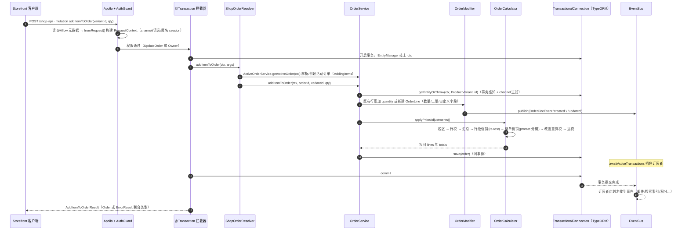
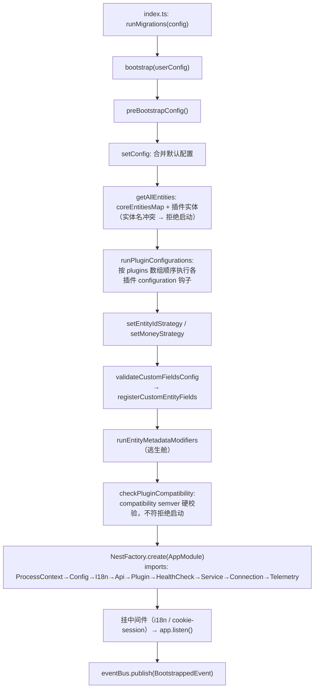

# 开源项目上手方法论：以 Vendure 为范例的源码内化路径

> **版本基准**：Vendure v3.7.1 / master 分支（2026-07 调研时点），仓库 `vendurehq/vendure`（原 `vendure-ecommerce/vendure`，旧链接自动重定向）[^37^]
> **许可提示**：自 v3.0 起核心包采用 **GPLv3 + 商业双许可**（插件有例外条款），学习、自用、内部部署均无碍，商用分发前请阅读第 7.2 节[^14^][^15^]
> **读者画像**：前端转全栈开发者，TS/Nest/React 技术栈，开发环境是一台 VMware Ubuntu 虚拟机（Windows 11 宿主机），没有读大型开源项目源码的经验
> **本文定位**：不是 Vendure 使用教程，而是"如何读一个大型开源项目"的可执行路线图。Vendure 是我们的训练场，方法是可带走的武器

---

## 1. 为什么通读源码注定失败：方法论先行

### 1.1 复杂度集中在"装配"而非"算法"

先建立一个反直觉的认知：Vendure 这类框架的难点不在算法。

`packages/core` 有 757 个 TypeScript 源文件、77 个实体、38 个域服务、100 个领域助手[^37^]。但如果你逐个点开看，会发现几乎没有任何"难算法"——没有红黑树，没有分布式共识，最复杂的数学是促销分摊里的最大余数法取整。真正的复杂度藏在**装配（assembly）**里：一个 HTTP 请求进来，经过 Apollo Server、全局 AuthGuard、`@Transaction()` 拦截器、resolver、注入了 23 个协作者的 `OrderService`、事务感知的 `TransactionalConnection`，最后由 EventBus 在事务提交后把事件推给订阅者[^11^][^12^][^46^]。每一段代码单独看都简单，"谁把它们接在一起、按什么顺序、在什么上下文中执行"才是知识本体。

这个判断决定了阅读策略：**按目录横向通读，你读到的是一堆零件；跟着一次请求纵向打穿，你看到的是整台机器。** 我们从跨维度调研中提炼的第 9 号洞察就是：学习 Vendure 的最短路径是"逆着一次请求走完全栈"——单点跟踪一次 `addItemToOrder` 调用，即可触达权限、请求上下文、状态机、价格管线、事务、事件六大核心机制。本文第 4 章会带你完整走一遍。

"通读派"的失败模式几乎千篇一律：从 `entity/` 开始按字母序读，三周后还在 product 目录里，记住了一堆字段定义却说不清一次下单请求流经了哪些代码。问题不在于毅力，而在于**装配知识不在任何一个文件里**——它分布在装饰器元数据、NestJS 模块 imports 数组、bootstrap 函数的执行顺序里，只有在"一次具体调用"的语境中才会显形。所以请记住本文的第一条军规：**永远不要以"读完某目录"为目标，永远以"回答某个问题"为目标。**

### 1.2 "一次请求的解剖学"方法：纵向打穿 > 横向通读

具体到操作层面，我给你的方法论是四步循环：

1. **先当用户，再当读者。** 官方 README 自己就把两条路分得很清：用 Vendure 建项目跑 `npx @vendure/create`，clone 仓库只为了贡献[^1^]。正确第一步是先用脚手架建一个项目，跑通 Dashboard，用 GraphiQL 手动发一串 Shop API mutation（`addItemToOrder` → `setOrderShippingAddress` → `setOrderShippingMethod` → `transitionOrderToState` → `addPaymentToOrder`——`setOrderShippingMethod` 不可省，ArrangingPayment 守卫 `arrangingPaymentRequiresShipping` 会拒绝未设配送方式的转移），在 API 层面建立"下单闭环"的领域直觉。生成项目里的 `src/vendure-config.ts` 就是你进入源码前的地图——它列出的每个插件、每个配置项，都对应 core 里一个待读的子系统[^33^]。
2. **带着一个问题进源码。** 不要问"order 模块是怎么实现的"，要问"我刚才发的那个 mutation 背后发生了什么"。前者是开放式深渊，后者是一条具体的调用链。
3. **用调试器走，不要只用眼睛读。** 官方仓库自带 VS Code 调试配置直指开发服务器入口[^30^]（详见 4.4 节），一次 F5 单步跟踪建立的心智模型，胜过静态阅读一周。
4. **读完后写一个最小改动来验证理解。** 看懂和改动之间隔着一条鸿沟，第 6 章的三个实验就是为此设计的。

### 1.3 测试即文档：107 个 e2e spec 的用法

Vendure 的测试体系本身就是一份"可执行的规格说明书"，这是大多数开发者忽略的宝藏：

- core 包有 **107 个 e2e spec**（217 个文件），按业务域组织：`packages/core/e2e/order.e2e-spec.ts`、`auth.e2e-spec.ts`、`promotion*.e2e-spec.ts`……每个 spec 覆盖该域的行为契约，含大量边界与错误路径[^2^][^37^]。
- 这些测试不是 mock 出来的假把式。`@vendure/testing` 的 `createTestEnvironment(testConfig)` 会**真实引导整个 Vendure 服务器**，用 GraphQL 客户端发真实 HTTP 请求断言响应——"从 API 到 service 到数据库的整条栈都在被测"[^7^][^31^][^32^]。你甚至可以通过 `server.app.get(ProductService)` 拿到 NestJS 容器里的任意内部服务做白盒断言[^7^]。
- sqljs 模式下首次填充的 SQLite 文件会缓存到 `__data__/`，后续运行直接加载——e2e 因此快得可以日常跑[^7^]。

**用法：想理解某个域的行为，先读对应 e2e spec 的断言，再回实现代码验证机制。** 比如想搞懂"取消订单后库存如何回滚"，先去 `packages/core/e2e/` 搜相关 spec 看它断言什么，再带着结论去读 service 代码。另外，`packages/core/e2e/fixtures/test-plugins/` 里有几十个为测试而写的最小插件，是学插件 API 的最佳范例库；core 的 e2e 目录里甚至有一份 `checklist-of-todos.md`——维护者自己的测试覆盖清单[^37^]。

---

## 2. 环境搭建：两条路径

环境是内化的起点。两条路径不是二选一，而是先后关系：**先用路径一建立"使用者心智"（半天），再用路径二进入源码（长期）**[^1^]。

### 2.1 路径一：`npx @vendure/create` 脚手架（快速体验）

**适用场景**：评估框架、搭建自己的商店后端、在用户视角理解系统。生成的项目本身就是最小的"框架使用范例"[^6^]。

```bash
# 前置：Node.js ^20.19 || >=22.12（v3.7 起自动识别 npm/bun/pnpm/yarn）
npx @vendure/create my-shop
```

交互选项[^6^]：

1. 选 **Quick Start**（推荐）：检测到可用的 Docker 环境会自动创建并配置 Postgres 容器；没有 Docker 则退回 SQLite（better-sqlite3 / sql.js，零外部依赖）。
2. 选 **Manual Configuration** 可自选 MySQL / MariaDB / Postgres / SQLite，并决定是否填充示例商品数据（**建议填充**，否则 Dashboard 里空空如也，不利于建立直觉）。
3. v3.5.2 起可选是否附带官方 Next.js storefront starter；选是则生成 monorepo（`apps/server` + `apps/storefront`）。

```bash
cd my-shop && npm run dev
```

启动后访问三个端点[^6^]：

- Admin API：`http://localhost:3000/admin-api`
- Shop API：`http://localhost:3000/shop-api`
- Dashboard：`http://localhost:3000/dashboard`（superadmin / superadmin）

**这一站的功课**：打开 GraphiQL（v3.3 起由 `@vendure/graphiql-plugin` 提供），手动完成一次下单闭环——`addItemToOrder` → `setOrderShippingAddress` → `setOrderShippingMethod` → `transitionOrderToState(state: "ArrangingPayment")` → `addPaymentToOrder`。然后在 Dashboard 里找到这笔订单。**记住这条链路，它是第 4 章的解剖对象。**

生成项目的源码结构是读懂框架的第一个样本：`src/vendure-config.ts`（全部配置与插件清单）、`src/index.ts`（`runMigrations(config).then(() => bootstrap(config))`）、`src/index-worker.ts`、`src/migrate.ts`[^33^]。想理解生成物，直接读 monorepo 里的模板源文件 `packages/create/templates/*.hbs`。

### 2.2 路径二：clone monorepo + dev-server（精读源码必选）

**适用场景**：精读/调试框架源码、写插件、提 PR。`packages/dev-server` 是一个**不发布到 npm** 的内部包，预装了全部官方插件和一批示例插件——它是"框架开发者的工作台"[^4^]。

完整命令序列（CONTRIBUTING.md 官方流程 + dev-server README 实测）[^2^][^4^]：

```bash
# 0. 前置：Node.js ^20.19 || >=22.12，并安装 Bun
#    注意：仓库内禁止 npm install（供应链安全策略：minimum-release-age 检查 +
#    trustedDependencies 白名单，见 issue #4674），一律用 bun
curl -fsSL https://bun.sh/install | bash     # Ubuntu 安装 Bun

# 1. 建议先在 GitHub 上 fork，然后 clone 自己的 fork
git clone https://github.com/YOUR-USERNAME/vendure.git && cd vendure

# 2. 安装依赖（根目录执行；含文档构建、codegen、lint/test 钩子）
bun install

# 3. 构建全部 16 个包（首次必须，几分钟，耐心等待）
bun run build

# 4. 启动数据库（根 docker-compose.yml 内含 mariadb / mysql_8 / mysql_5.7 /
#    postgres_12 / postgres_16 / elasticsearch / redis，可按需起）
docker compose up -d mariadb          # 默认 DB：不设 DB 环境变量时 dev-server 用 MySQL/MariaDB
docker compose up -d postgres_16      # 想用 Postgres 则起这个

# 5. 填充演示数据（用 Postgres 时：DB=postgres bun run populate，
#    或把 DB=postgres 写进 packages/dev-server/.env 一劳永逸）
cd packages/dev-server
bun run populate

# 6. 启动开发服务器
bun run dev
```

启动后（当前 master 用 **Portless** 提供稳定本地域名）：API 在 `https://vendure.localhost`，Dashboard 在 `https://dashboard.vendure.localhost/dashboard/`。想用旧的固定端口模式就 `bun run dev:direct`（API :3000、Dashboard Vite 开发服务器 :5173）。worker 进程需另开终端 `bun run dev:worker` 单独启动（全仓库一把锁，防止多个 worktree 抢同一个任务队列）[^4^]。

**开发回路**（改 core 源码时）：另开终端跑 `bun run watch:core-common`（同时 watch common 和 core 两个包）；改插件则在对应包目录 `bun run watch`；编译完成后重启 dev-server 生效。新版 `dev` 脚本（`scripts/dev-workflow.mjs`）已能自动监督 watcher 与 Dashboard Vite 服务，编译成功后自动重启相应进程[^4^][^34^]。

**dev-server 即"活的插件使用大全"**：`dev-config.ts` 装配了 AssetServerPlugin、DefaultSearchPlugin、DefaultJobQueuePlugin、DefaultSchedulerPlugin、EmailPlugin（devMode，访问 `/mailbox` 看本地邮箱）、GraphiqlPlugin、DashboardPlugin，以及 `test-plugins/`（ReviewsPlugin 等）和 `example-plugins/`（multivendor、wishlist、product-bundles、digital-products、minimum-order-quantity）[^5^]。**第 6 章写插件时，先抄这些示例。**

### 2.3 两条路径对比与 VMware 虚拟机适配

| 维度 | `@vendure/create` | monorepo + dev-server |
|---|---|---|
| 目的 | 用框架做项目 | 读/改/贡献框架本身 |
| 代码可见性 | node_modules 里的编译产物（.d.ts + js） | 全部 TS 源码，可断点、可改 |
| DB 依赖 | SQLite 可零依赖；Postgres 需 Docker | docker compose 起 DB（默认 MariaDB） |
| 上手耗时 | ~2 分钟 | ~15–30 分钟（含全量 build） |
| 调试 | 只能断到自己代码与编译产物 | 全链路源码断点 |

**分析**：两条路径的差异本质是"使用视角"与"作者视角"的差异。脚手架路径给你的是一个干净的应用外壳——它的价值在于让你先理解框架对外承诺了什么（API 形状、配置面、插件清单），这些问题答案都在 `vendure-config.ts` 这一个文件里。monorepo 路径则把全部内部机制暴露出来：757 个源文件可下断点、可修改、可观察修改后的行为变化。对源码内化这个目标，前者是半天的热身，后者是八周的主战场。特别值得注意的是 dev-server 的示例插件目录——它把"官方认为你应该怎么写插件"以可运行代码的形式固化下来，比任何文档都权威[^4^][^5^]。

**VMware Ubuntu 虚拟机场景的五条注意事项**（这是你的主力开发环境，值得花十分钟配好）：

1. **资源分配**：建议给虚拟机 **4 vCPU / 8 GB 内存 / 60 GB 磁盘**。依据：server 与 worker 进程空闲时各占 200–300 MB 内存，小项目每进程 512 MB 为实用下限[^58^]；真正的资源大头是 `bun run build`（16 个包全量编译）和 Docker 里的数据库。4 GB 内存跑构建会明显吃力，2 GB 基本不可用。
2. **Docker**：在 Ubuntu 里装 Docker Engine 即可（`sudo apt install docker.io docker-compose-v2`，或官方 apt 源），装完把自己加入 `docker` 组（`sudo usermod -aG docker $USER`，重新登录生效）。虚拟机/服务器场景直接装 Docker Engine 即可，无需 Docker Desktop——脚手架检测到可用的 Docker 守护进程就能自动建 Postgres 容器；不装 Docker 则退回 SQLite，零依赖也能跑通[^6^]。
3. **网络**：VMware 默认 NAT 模式下，Windows 宿主机可以直接通过虚拟机 IP（`ip addr` 查看，通常是 `192.168.x.x`）访问虚拟机内的服务。想在宿主机浏览器用固定域名访问，编辑 `C:\Windows\System32\drivers\etc\hosts` 加两行：`<VM-IP> vendure.localhost` 和 `<VM-IP> dashboard.vendure.localhost`。如果 Portless 域名模式在虚拟机里不顺手，用 `bun run dev:direct` 固定端口，然后宿主机浏览器直接访问 `http://<VM-IP>:3000/admin-api`。
4. **SSH 远程开发（强烈推荐）**：虚拟机里 `sudo apt install openssh-server`，Windows 11 宿主机的 VS Code 装 **Remote-SSH** 扩展后连入虚拟机。这样 VS Code 的扩展宿主、终端、调试器全部运行在 Ubuntu 内——第 4 章的 F5 断点调试、launch.json、`bun run watch` 终端都在远程窗口里工作，宿主机只承担显示。Remote-SSH 还会自动转发端口，宿主机浏览器直接访问 `localhost:3000` 也能通。
5. **工作流定位**：把 Windows 宿主机当"瘦客户端"——所有构建、数据库、服务器都在虚拟机里跑，宿主机只跑 VS Code 和浏览器。这正好预演了 Vendure 生产部署的形态（Linux 服务器），你在虚拟机里踩的每个坑都是有效的学习投资。

---

## 3. 仓库结构导航

进一个陌生仓库，第一件事不是读代码，而是建立"地图"。Vendure 的地图有两个维度：包级（16 个包各管什么）和包内（core 的二维组织）。

### 3.1 monorepo 16 个包职责表

Vendure 是 **Lerna 固定版本模式 + Bun 管理**的 monorepo：`packages/` 下 16 个包，全部以同一版本号（当前 v3.7.1）同步发布[^1^][^2^][^34^]。

| 包 | 发布名 | 职责一句话 |
|---|---|---|
| `core` | `@vendure/core` | 框架本体：NestJS 应用、双 GraphQL API、全部业务域 service/entity、事件总线、任务队列、插件系统（757 个 src TS 文件） |
| `common` | `@vendure/common` | 跨包共享：工具函数 + **codegen 生成的 GraphQL 类型**（`generated-types.ts`） |
| `dashboard` | `@vendure/dashboard` | **新管理端**（React 19 + Vite 6 + Tailwind v4 + Shadcn/ui + TanStack，v3.5 起 stable）；内含服务端 `DashboardPlugin`[^27^][^28^] |
| `admin-ui` | `@vendure/admin-ui` | **旧管理端**（Angular），官方支持到 2026 年 6 月，新学者可略过[^17^] |
| `admin-ui-plugin` | ✅ | 把编译后的 Angular admin-ui 以静态文件挂到服务器上的插件 |
| `create` | `@vendure/create` | `npx @vendure/create` 脚手架；`templates/*.hbs` 就是生成物的源文件[^33^] |
| `cli` | `@vendure/cli` | 项目内 CLI：`add`（脚手架）、`migrate`、`schema`、`doctor`，v3.7 新增 `dev/build/start` 生命周期命令[^20^][^29^] |
| `testing` | `@vendure/testing` | e2e 设施：`TestServer`、`createTestEnvironment`、`SimpleGraphQLClient`、DB initializers[^31^][^32^] |
| `asset-server-plugin` | ✅ | 资产服务：本地/S3 存储、Sharp 图像变换、缓存 |
| `email-plugin` | ✅ | 事件驱动的邮件：Handlebars 模板、dev 模式本地邮箱 `/mailbox` |
| `job-queue-plugin` | ✅ | BullMQ（Redis）任务队列策略，替代默认 DB 轮询 |
| `graphiql-plugin` | ✅ | 在服务器上挂 GraphiQL IDE（v3.3 起从 core 拆出）[^18^] |
| `harden-plugin` | ✅ | API 安全加固（查询复杂度/深度限制） |
| `telemetry-plugin` | ✅ | OpenTelemetry tracing 集成（v3.3 新增）[^18^] |
| `ui-devkit` | ✅ | 编译旧 Angular Admin UI 扩展的工具链（随旧 UI 一起淡出） |
| `dev-server` | ❌ private | **不发布**：monorepo 内部开发服务器，含 dev-config、示例插件、k6 压测脚本[^4^][^34^] |

**分析**：这张表要读出三层结构。第一层是"框架"——core 一个包承载全部领域逻辑，common 只为它服务；第二层是"官方插件"——asset-server、email、job-queue、harden 等全是独立 npm 包，它们和第三方插件走完全相同的装配协议（这是 Vendure 最重要的架构承诺：核心不吃小灶，详见 dim07 的 dogfooding 分析[^45^]）；第三层是" tooling"——create/cli/testing/dev-server 这四个包不产生任何业务功能，却是开发者体验的载体。对你这个 React 技术栈的学习者，还有个实用结论：`admin-ui` 和 `ui-devkit` 两个包可以直接跳过（Angular 技术栈且 2026 年 6 月停止支持），把管理端注意力全部放在 `dashboard` 上[^17^]。另外注意 payments-plugin、elasticsearch-plugin 等已在 v3.6 迁出到 `@vendure-community/*` 社区仓库——读老文章时看到 `@vendure/payments-plugin` 不要困惑[^38^]。

### 3.2 core/src 二维组织：技术分层 × 业务分域

`packages/core/src/` 的顶层按**技术角色**分层（这是 NestJS 风格），每层内部再按**业务域**（order、product、customer、promotion、tax、shipping、stock…）并列。实测文件数[^37^]：

| 顶层目录 | 文件数 | 角色 | 你要重点读的 |
|---|---|---|---|
| `api/` | 218 | GraphQL 层：schema（SDL 文件）、resolvers、中间件、装饰器、RequestContext | `schema/shop-api/shop.api.graphql`、`resolvers/shop/`、`decorators/` |
| `config/` | 191 | `VendureConfig` 总接口 + 全部"策略/流程"默认实现（按域分包） | `vendure-config.ts`、`config/order/`、`config/promotion/` |
| `service/` | 142 | 业务层：`services/`（38 个域服务）+ `helpers/`（100 个领域助手） | `services/order.service.ts`、`helpers/order-*` |
| `entity/` | 136 | TypeORM 实体：77 个 `*.entity.ts`，按域分目录 | `entity/order/`、`entity/order-line/` |
| `event-bus/` | 69 | RxJS 事件总线 + 62 个事件类型定义 | `event-bus.ts`、`events/` |
| `plugin/` | 63 | 插件系统（`@VendurePlugin` 元数据、加载、合并） | `vendure-plugin.ts`、`plugin-metadata.ts` |
| `connection/` | 10 | `TransactionalConnection`：TypeORM 的事务化封装 | `transactional-connection.ts`（全文件都值得读） |
| 其余 | — | `job-queue/`(23)、`data-import/`(29)、`telemetry/`(30)、`cache/`(8)、`worker/`(5) 等 | 按周计划轮到再读 |

**分析**：这张二维矩阵是你在 Vendure 源码里不迷路的总钥匙。关键认知是：**"order 相关的代码"不在任何一个单一目录里**——它纵向分布在 api（schema + resolver）、service（service + 5 个 order-* helper：order-modifier / order-calculator / order-state-machine / order-merger / order-splitter）、entity（2 个目录）、config（default-order-process 等 31 个文件）、event-bus（若干事件类）五层里。所以正确的阅读单位不是"目录"而是"**纵切片**"：把同一业务域在各层的文件串成一条线一次读完。第二个要点是层的厚薄：`api` 目录文件最多但很"薄"（resolver 只做权限/参数/转发），真正的规则密度在 `service/helpers/` 那 100 个助手里——`order-modifier`（加减改订单行的全部规则）、`order-calculator`（金额计算）、`order-state-machine`（状态机）是其中规则最密的三个[^12^]。第三个要点：`config/` 目录是全部默认策略的"陈列室"，Vendure 扩展性的根基（约 50 个 strategy 槽位）都在这里有默认实现可查[^42^]。

把"纵切"落到纸面，你的第一个切片（Order 域）应该长这样——七个文件一条线：

1. `api/schema/shop-api/shop.api.graphql` + `api/schema/common/order.type.graphql`：先看 API 契约（也可直接翻仓库根目录的 `schema-shop.json`）；
2. `api/resolvers/shop/shop-order.resolver.ts`：薄层，只做权限/参数/转发；
3. `service/services/order.service.ts`：厚层编排，但方法分区清晰（crud / 行操作 / 状态流转 / 支付 / 结算）；
4. `service/helpers/order-modifier/` → `order-calculator/` → `order-state-machine/`：规则密度最高的三个 helper；
5. `entity/order/order.entity.ts` + `entity/order-line/`：落库结构；
6. `config/order/default-order-process.ts`：默认状态机定义，对照 `common/finite-state-machine/finite-state-machine.ts` 这个 60 行的通用基类——Vendure 全部"流程"（order/payment/fulfillment/refund）都是它的实例[^51^][^53^]；
7. `event-bus/events/` 下所有 order 相关事件：订单生命周期向外辐射的信号。

为什么第一个切片选 Order 而不是 Product？因为 Order 是电商的核心聚合，且串联了 Vendure 几乎所有核心机制（状态机、促销、支付、履约、库存、历史、事件）——把最密的网先打穿，后面每个域都是"温故"。第二个切片再选 Product（可翻译实体 + ListQueryBuilder 的典型用法），你会读得飞快。

### 3.3 命名规律与"猜得到"的文件定位法

大型项目读久了，你会发现自己不再依赖搜索，而是靠命名规律"猜"文件位置。Vendure 的规律高度一致：

1. **服务**：`service/services/<domain>.service.ts`——`order.service.ts`、`product-variant.service.ts`、`payment.service.ts`。复杂服务的规则被拆到 `service/helpers/<domain>-<aspect>/`：`order-modifier`、`order-calculator`、`order-state-machine`、`payment-state-machine`。
2. **resolver**：`api/resolvers/shop/shop-<domain>.resolver.ts` 与 `api/resolvers/admin/<domain>.resolver.ts`。Shop API 只有 7 个 resolver（窄 API），Admin API 有 33 个（宽 API）[^37^]。
3. **schema**：`api/schema/admin-api/<domain>.api.graphql`（按域拆 49 个文件）、`api/schema/common/<domain>.type.graphql`（两 API 共享类型）。Vendure 是 **schema-first**：SDL 是唯一契约来源，resolver 只是实现者——这与很多 NestJS code-first 项目不同，读代码前可以先读 SDL 建立 API 全局观[^47^]。
4. **实体**：`entity/<domain>/<domain>.entity.ts`；TypeORM 默认 snake_case 落表——`ProductVariant` → `product_variant`，翻译表加 `_translation` 后缀，custom fields 列加 `customFields` 前缀。`Order` 是 SQL 保留字，迁移 SQL 里永远带引号 `"order"`。
5. **事件**：`event-bus/events/<domain>-event/` 一类一文件，62 个事件类。
6. **配置/策略**：`config/<domain>/` 下是策略接口 + 默认实现，文件名即类名小写连字符：`default-order-process.ts`、`native-authentication-strategy.ts`。
7. **隐藏福利一**：仓库根目录的 `schema-admin.json` / `schema-shop.json` 是提交进 git 的两份 GraphQL introspection 结果——**不启动服务器就能通读整个 API 形状**[^37^]。
8. **隐藏福利二**：`AGENTS.md` / `CLAUDE.md` / `.claude/rules/` 是仓库自带的 AI 代理规则，本身也是一份"维护者视角的代码导览"[^37^]。
9. **类型穿梭**：GraphQL 层的 TS 类型全部来自 `packages/common/src/generated-*.ts`（`bun run codegen` 由 SDL 生成），所以 resolver 入参类型和 SDL 永远一致——在 IDE 里用 F12（跳转定义）即可在 schema ↔ resolver ↔ service 之间穿梭[^2^]。

**练习**：给自己出道题验证一下——"游客下单时匿名会话存在哪张表？"按规律猜：实体在 `entity/session/`（含 anonymous-session，STI 单表继承），表名 `session`；API 在 `shop-auth.resolver.ts`；创建逻辑在 `service/services/session.service.ts`。然后打开文件验证。猜错不可怕，每次猜错都在校准你的地图。

---

## 4. 打穿主链路：`addItemToOrder` 的完整解剖

本章是全文重心。我们把第 2.1 节你在 GraphiQL 里发过的那个 mutation 解剖到行级粒度：

```graphql
mutation {
  addItemToOrder(productVariantId: 42, quantity: 2) {
    __typename
    ... on Order { id code totalWithTax }
    ... on ErrorResult { errorCode message }
  }
}
```

### 4.1 入口：resolver 层的三个方法装饰器 + 一个参数装饰器

文件：`packages/core/src/api/resolvers/shop/shop-order.resolver.ts`（第 332–353 行）[^11^]：

```ts
@Transaction()
@Mutation()
@Allow(Permission.UpdateOrder, Permission.Owner)
async addItemToOrder(
    @Ctx() ctx: RequestContext,
    @Args() args: MutationAddItemToOrderArgs,
): Promise<AddItemToOrderResult> {
    const order = await this.activeOrderService.getActiveOrder(ctx, undefined);  // ① 解析当前活动订单
    if (order) {
        return this.orderService.addItemToOrder(ctx, order.id, args.productVariantId, args.quantity, args.customFields);
    }
    // ...
}
```

三个方法装饰器（`@Transaction` / `@Mutation` / `@Allow`）与一个参数装饰器（`@Ctx`）各有明确语义，它们是理解整个 API 层的钥匙：

- **`@Allow(Permission.UpdateOrder, Permission.Owner)`**：本质是 `SetMetadata('__permissions__', ...)`，只写元数据不做判断。真正的拦截在全局 `AuthGuard`（经 NestJS `APP_GUARD` 注册，见 `api/middleware/auth-guard.ts`）：读取元数据 → 提取 session token → 调 `RequestContextService.fromRequest()` 构建上下文 → 交给 `entityAccessControlStrategy.canAccess()` 判定，不通过抛 `ForbiddenError`[^55^][^47^]。两个权限是 **OR** 逻辑；`Permission.Owner` 有专门语义——无 session 的游客会自动创建匿名 session，从而"只能操作属于自己的购物车"[^48^]。Vendure 的授权模型是 **deny-by-default**：没有 `@Allow` 的 API 操作一律不可访问。
- **`@Transaction()`**：来自 `api/decorators/transaction.decorator.ts`。它在方法外层包一个 TypeORM 事务，把事务的 `EntityManager` 挂到 RequestContext 上，方法正常返回后自动提交，抛错自动回滚[^49^]。**这一个装饰器就解释了"为什么 service 层代码从不写 commit/rollback"。**
- **`@Ctx()`**：参数装饰器，从 Express `req` 对象上取出 AuthGuard 阶段构建好的 `RequestContext`。这个对象携带当前用户/session、激活的 Channel（来自 `vendure-token` 请求头）、语言、币种、**以及当前打开的数据库事务**——Vendure 官方规约是每个 resolver 都用它，并把 ctx 作为第一个参数显式传给所有 service 方法[^48^]。
- **`@Mutation()`**：普通 `@nestjs/graphql` 装饰器。注意入参类型 `MutationAddItemToOrderArgs` 来自 codegen 生成的 `generated-shop-types.ts`——schema 与代码的类型一致性是生成出来的，不是靠人肉维护[^2^]。

还要理解 ① 号行的分量：`getActiveOrder()` 背后是 `ActiveOrderStrategy`（默认实现基于 Session）——**Vendure 没有独立的 Cart 实体，购物车就是一个处于 `AddingItems` 状态、`active=true` 的 Order**。这个 mutation 不传 orderId，因为"当前会话的活动订单"是可以从上下文解析出来的[^51^]。

### 4.2 中场：OrderService 与它的 23 个协作者

文件：`packages/core/src/service/services/order.service.ts`（`addItemToOrder` 在第 622 行，随即转入 `addItemsToOrder`）[^12^]。

先看构造函数：`OrderService` 注入了 **23 个协作者**——`TransactionalConnection`、`OrderCalculator`、`OrderStateMachine`、`OrderModifier`、`OrderMerger`、`PaymentService`、`FulfillmentService`、`StockLevelService`、`ListQueryBuilder`、`HistoryService`、`PromotionService`、`EventBus`、`TranslatorService`、`RequestContextCacheService`……[^12^] 初学者看到 23 个依赖会本能地觉得"设计失败"，但在 Vendure 的语境下要换个读法：**这个构造函数就是一张"订单域依赖地图"**。订单域天然与支付、履约、库存、促销、历史、事件耦合，Vendure 选择把这种耦合显式声明在构造函数里（可注入、可替换、可测试），而不是藏在静态调用里。2400+ 行的 `OrderService` 本身只做**编排**（orchestration）：校验 → 取数 → 委托 helper → 落库 → 发事件，真正的规则都在 helper 里。

`addItemsToOrder` 的内部流程[^12^]：

1. **校验**：数量为正、订单处于可修改状态、订单行数未超上限；
2. **取商品变体**：`connection.getEntityOrThrow(ctx, ProductVariant, id)`——注意它走 `TransactionalConnection`，自动带上当前事务、channel 过滤与软删除处理[^54^]；
3. **行逻辑委托 `OrderModifier`**：同一 variant 重复加购不累加新行，而是累加既有 OrderLine 的 `quantity`；OrderLine 自定义字段（如刻字内容）也在此合并；
4. **价格重算**：调自身的 `applyPriceAdjustments()`（第 2311 行）——这是价格管线的总入口，见 4.3；
5. **发事件**：事件由 `OrderModifier` 而非 `OrderService` 发布——`getOrCreateOrderLine()` 新建行时发 `OrderLineEvent(ctx, order, orderLine, 'created')`（order-modifier.ts:205），`updateOrderLineQuantity()` 修改行数量时发 `OrderLineEvent(ctx, order, orderLine, 'updated')`（order-modifier.ts:248）；
6. **无历史、无 OrderEvent**：`addItemsToOrder`（order.service.ts:654–766）全程不调 `HistoryService`、不发布 `OrderEvent`——`OrderEvent 'updated'` 只出现在 `modifyOrder`（order-modifier.ts:703）、`setOrderCustomer` 等其他流程；
7. 返回更新后的 Order——若任何一步失败，`@Transaction()` 的回滚保证不留脏数据。

**2400 行文件的正确打开方式**：不要从头读到尾。在 VS Code 里先折叠全部方法（`Ctrl+K Ctrl+0`），只读方法签名扫一遍全貌——`OrderService` 的方法命名高度自描述（`addItemToOrder` / `adjustOrderLine` / `transitionToState` / `addPaymentToOrder` / `settlePayment`），光看目录就能重建订单域的能力清单；然后只展开你跟踪的那条调用链上的方法。读 service 层要时刻提醒自己：**它只做编排，规则在 helper**——看到一个方法超过 50 行，八成是还没点进它调用的 helper。

### 4.3 纵深：状态机 → 价格管线 → 事务 → 事件

现在把四个机制在这一次调用中的角色讲透。

**状态机**：`addItemToOrder` 本身**不发生状态转移**——订单全程处于 `AddingItems`。但状态机决定了这次调用是否合法：只有 `active=true` 且处于可修改状态的订单才能加行；当顾客随后点击"去支付"（`transitionOrderToState(state: "ArrangingPayment")`）时，`OrderStateMachine`（`service/helpers/order-state-machine/`，构建在 60 行的通用基类 `common/finite-state-machine/finite-state-machine.ts` 之上[^53^]）会执行默认流程的守卫：有行、有 Customer、有配送方式、库存充足，四道校验全部通过才放行[^51^]。状态机的实现有个精妙细节：`transitionTo()` 不直接执行 `onTransitionEnd`，而是返回一个 `finalize` 回调——**"状态变更"与"变更后副作用"被拆成两阶段**，副作用（置 `active=false`、记录 `orderPlacedAt`、发布 `OrderPlacedEvent`）延迟到调用方决定的时机执行，从而与事务边界对齐[^53^]。

**价格管线**：`OrderService.applyPriceAdjustments()` → `OrderCalculator.applyPriceAdjustments()`（`service/helpers/order-calculator/order-calculator.ts`）的执行顺序是固定的[^52^]：

```
拉取本 channel 生效促销（priorityScore 升序，剔除用量耗尽者）
→ ProductVariantService.applyChannelPriceAndTax()（channel 价 + 税）
→ orderItemPriceCalculationStrategy.calculateUnitPrice()（定 listPrice，B2B 客户价/阶梯价的扩展点）
→ OrderCalculator：定税区（TaxZoneStrategy）
→ 对更新的行算税（税基 = proratedUnitPrice）
→ calculateOrderTotals
→ 应用促销：先行级（逐行逐促销重新 test），再整单级（test + prorate 最大余数法分摊到行）
→ 若促销改变了 subTotal：全行重算一遍税（折扣作用于税前净价，税按折后价重算）
→ 运费计算与运费促销
→ calculateOrderTotals（Σ proratedLinePrice）
```

对你的财务背景，强调两点：其一，**数据库只存最小货币单位整数的基价，一切折扣/税额都是运行时管线计算的派生值**——存储事实与派生视图的严格分离，和你熟悉的"凭证是存储、报表是计算"同构；其二，整单优惠用**最大余数法**分摊到各行（`order-calculator/prorate.ts`），保证 Σ行 = 整单、尾差确定——这就是对账能对平的算法基础[^52^]。

**事务**：全链路只有一个事务，边界由 resolver 上的 `@Transaction()` 划定。`TransactionalConnection` 是全部 DB 访问的统一入口：service 调 `getRepository(ctx, Entity)` 时，它从 ctx 上取出当前事务的 `EntityManager` 返回事务感知的 repository——事务上下文随 RequestContext 显式下传，不需要任何隐式线程本地存储[^54^][^49^]。方法成功 → 拦截器提交；任一步抛错 → 整体回滚。想在 API 内手动控制事务边界，用 `@Transaction({ mode: 'manual' })` 配合 `connection.startTransaction(ctx)` / `commitOpenTransaction(ctx)` / `rollBackTransaction(ctx)`；在没有请求上下文的场景（如 job 的 process 函数），则用 `connection.withTransaction(ctx, work)` 把一组操作包进事务、保证原子性[^49^]。

**事件**：`OrderEvent` 在事务**内**发布，但订阅者不会立刻收到。`EventBus.ofType()` 的管道里有一环 `mergeMap(event => this.awaitActiveTransactions(event))`（`event-bus/event-bus.ts`）：若事件携带的 RequestContext 上有打开的事务，订阅者只在事务**提交之后**才收到事件——官方文档原话："the subscriber will only get called after any active database transactions are complete"[^46^][^43^]。这解决了事件驱动最大的坑——"订阅者读到未提交的中间态，事务回滚后事件已成谎言"。邮件、搜索索引更新、积分发放都建立在这个保证上。若需要同事务强一致（错误一起回滚），另有 `registerBlockingEventHandler()` 的阻塞式处理器可选[^43^]。

**完整时序图**：



**一次调用触达的六大机制对照表**：

| 机制 | 落点文件 | 本例中的作用 |
|---|---|---|
| 权限 | `api/decorators/allow.decorator.ts` + `api/middleware/auth-guard.ts` | `UpdateOrder` 或 `Owner`（游客匿名 session） |
| 请求上下文 | `api/common/request-context.ts` + `service/helpers/request-context/` | channel/语言/币种/事务的载体，全链路透传 |
| 状态机 | `service/helpers/order-state-machine/` + `common/finite-state-machine/` | 决定订单"可修改"；后续 checkout 时执行守卫 |
| 价格管线 | `service/helpers/order-calculator/` + `config/` 下各策略 | 选价→税→促销→重算税→运费→汇总 |
| 事务 | `api/decorators/transaction.decorator.ts` + `connection/transactional-connection.ts` | 一边界一事务，提交/回滚自动化 |
| 事件 | `event-bus/event-bus.ts` + `event-bus/events/` | 事务提交后广播，副作用与主流程解耦 |

**分析**：这张表就是洞察 9 的实证——Vendure 的核心机制不是六个独立知识点，而是同一次请求里的六个角色。注意它们的依赖方向：权限与事务在请求边界上（装饰器层），上下文是载体，状态机与价格管线是领域规则（helper 层），事件是出口。这个"边界 → 载体 → 规则 → 出口"的结构在 Vendure 的每个 mutation 上重复出现——学会解剖这一个，你就拥有了解剖全部 mutation 的手术刀。也请注意返回类型 `AddItemToOrderResult` 是 `Order | ErrorResult` 的联合类型：Vendure 把业务错误（库存不足、订单不可修改）建模为 schema 内的一等公民而非异常，这是值得你在自己项目里模仿的 API 设计。

### 4.4 断点配置：用调试器"走"一遍

官方自带调试配置，这是维护者明示的入口：

- **`.vscode/launch.json`** 里唯一配置 "Debug Dev Server"：`program` 指向 `packages/dev-server/index.ts`，以 `ts-node --transpile-only` 跑起——**在仓库根目录按 F5，即可在任意 TS 源码下断点**[^30^]。
- dev-server 入口 `packages/dev-server/index.ts` 只做一件事：`runMigrations(devConfig).then(() => bootstrap(devConfig))`[^34^]——与你的脚手架项目 `src/index.ts` 完全同构。
- 调试 e2e 测试时设 `E2E_DEBUG=true`：全局超时从 120s 放宽到 1800s，可以从容单步[^2^][^8^]。
- 想看 SQL：`packages/dev-server/dev-config.ts` 里把 `dbConnectionOptions.logging` 改为 `true`（TypeORM 全量 SQL 日志）[^5^]。

**建议的四个断点**（按调用顺序）：

1. `shop-order.resolver.ts` 的 `addItemToOrder` 方法体第一行——看三个方法装饰器与一个参数装饰器执行完之后 ctx 里有什么（session？channel？事务管理器？）；
2. `order.service.ts` 的 `addItemsToOrder`——step into，看 service 如何编排协作者；
3. `transactional-connection.ts` 的 `getRepository()`——看 EntityManager 如何从 ctx 上取出来；
4. `order-state-machine.ts` 的 `transition()`——这个要在随后发 `transitionOrderToState` mutation 时命中，看守卫与两阶段 finalize。

用 Remote-SSH 连在虚拟机上操作时，直接在远程窗口里 F5 即可——调试器跑在 Ubuntu 内，断点、变量、调用栈与本地体验无差别。走完全程你会发现：三层架构（resolver → service → connection）一次调试全部命中，这比纯读代码快一个数量级。

---

## 5. 分域精读路线：八周计划

打完主链路之后，接下来八周按业务域逐个精读。**节奏假设：工作日每天 1 小时、周末半天。** 每周都有硬性产出物——不写笔记的理解是幻觉，不改代码的读懂是自欺。

### 5.1 八周计划总表

| 周次 | 主题 | 精读文件清单 | 产出物要求 |
|---|---|---|---|
| W1 | 配置与装配 | `packages/create/templates/vendure-config.hbs`；`packages/dev-server/dev-config.ts`；`core/src/config/vendure-config.ts`（约 1900 行，通读）; `core/src/bootstrap.ts`；`app.module.ts`；`api/api.module.ts` | 笔记《Vendure 启动装配流水线》，画出从 `bootstrap()` 到 `listen()` 的完整顺序图；实验：在 dev-config 中打开 SQL logging、改一个 strategy，观察行为变化并记录 |
| W2 | 订单（上）：行操作 | `api/schema/shop-api/shop.api.graphql` + `schema/common/order.type.graphql`；`api/resolvers/shop/shop-order.resolver.ts`；`service/services/order.service.ts` 前半；`service/helpers/order-modifier/`；`entity/order/` + `entity/order-line/` | 笔记《addItemToOrder 全链路》（即第 4 章内容的个人复述版）；实验：完成 4.4 节四断点调试，截屏记录每个断点处 ctx 的内容 |
| W3 | 订单（下）：状态机 | `common/finite-state-machine/finite-state-machine.ts`（60 行）；`service/helpers/order-state-machine/`；`config/order/default-order-process.ts`；`config/order/order-process.ts`；`e2e/order.e2e-spec.ts` 中转移相关用例 | 笔记《订单状态机：13 状态与三层架构》，含状态转移图与两阶段 finalize 分析；实验：自定义一个 `OrderProcess`（如官方 EU 税号校验配方），加一个新状态并用 `transitionOrderToState` 走通 |
| W4 | 支付与退款 | `service/services/payment.service.ts`；`config/payment/`（default-payment-process、payment-method-handler）；`entity/payment/` + `entity/refund/`；`service/helpers/refund-state-machine/`；`e2e/payment*.e2e-spec.ts` | 笔记《授权 vs 结算：两阶段资金语义》，类比你的收入确认时点经验；实验：写一个 dummy `PaymentMethodHandler`，走通 `createPayment` → `settlePayment` → `createRefund` 全流程 |
| W5 | 库存与履约 | `entity/stock-movement/`（STI，7 个文件）；`service/services/stock-level.service.ts`、`stock-movement.service.ts`、`fulfillment.service.ts`；`config/order/` 中 stockAllocationStrategy 相关；`service/helpers/fulfillment-state-machine/` | 笔记《预占 vs 实扣：onHand/allocated 双账设计》；实验：下一单并履约，用 SQL 直接查 `stock_movement` 表，逐行解释每条 Movement 的类型与成因 |
| W6 | 促销与定价 | `service/helpers/order-calculator/`（`order-calculator.ts`、`prorate.ts`）；`config/promotion/`（conditions 5 个 + actions 7 个）；`service/services/promotion.service.ts`；`entity/order-line/order-line.entity.ts` 价格字段；`e2e/promotion*.e2e-spec.ts` | 笔记《价格计算五阶段管线与分摊守恒》；实验：完成第 6.2 节实验二（自定义 PromotionCondition） |
| W7 | 插件与事件 | `plugin/vendure-plugin.ts`、`plugin-metadata.ts`、`plugin-common.module.ts`；`event-bus/event-bus.ts` + `events/`；`dev-server/example-plugins/`（wishlist、multivendor）；`core/e2e/fixtures/test-plugins/` 任选两个 | 笔记《插件装配协议：六个元数据键与集中装配流水线》；实验：搭起第 6.3 节实验三的插件骨架（实体 + 注册 + 能启动） |
| W8 | API 与权限 | `api/config/get-final-vendure-schema.ts`、`configure-graphql-module.ts`；`api/middleware/auth-guard.ts`；`api/decorators/`；`service/helpers/request-context/`；`service/helpers/list-query-builder/` + `entity-hydrator/` | 笔记《双 API 与授权链：schema 拼装、AuthGuard、deny-by-default》；实验：完成实验三，并用 `createTestEnvironment` 为它写一个通过的 e2e 测试 |

**分析**：这份计划的编排逻辑是"同心圆"而非"教科书序"。W1 先看装配——因为它是全框架的"接线图"，看懂 bootstrap 流水线后，后面每读一个域你都知道它是被谁、在何时、按什么顺序装配进来的；W2–W3 给订单整整两周，因为订单是电商的核心聚合，串联了状态机、支付、库存、促销、历史、事件几乎全部机制——把订单读透，W4–W6 的支付/库存/促销其实是"换个角度重看同一张网"，速度会自然加快；W7 的插件放在靠后位置，因为插件协议（`@VendurePlugin` 六个元数据键 + 集中装配）只有在你见过足够多的"被装配物"之后才能理解其必要性[^45^]；W8 收尾于 API 与权限这两个横切面。每周的"笔记 + 实验"双产出是硬约束：笔记迫使你把模糊理解落成文字（写不出来的段落就是没读懂的地方），实验迫使你验证理解（改不动的机制就是没真懂的机制）。如果某周超时，宁可压缩 W5/W6，不要动 W2–W3——订单域是这套系统的"奇点"，密度最高、收益最大。

**W1 的装配流水线参考图**（你的笔记作业要对标这张图）：



这张图的三个要点：`configuration` 钩子按插件声明顺序执行、后者可覆盖前者（顺序即优先级）；AppModule 必须在实体确定之后才加载（源码注释原话 "The AppModule *must* be loaded only after the entities have been set in the config"）；配置函数跑完后 config 即只读——**"配置时开放、运行时封闭"**[^9^][^42^]。

### 5.2 每周产出物的验收标准

- **机制解析笔记**：不少于 800 字，必须包含：一张自己画的图（Mermaid 即可）、至少三个具体文件路径、一个"如果让我设计我会怎么做 + Vendure 为什么没这么做"的段落。最后一项最重要——它强迫你从"读者"切换到"作者"视角。
- **最小改动实验**：必须可运行、可验证、可回滚。验证方式不是"服务没报错"，而是"我观察到了预期的行为差异"（一条 SQL、一个 API 响应、一条事件日志）。
- **卡住怎么办**：先去 `packages/core/e2e/` 搜对应 spec 读断言（1.3 节的方法）；再去 Discord（约 2400 名成员，官方求助主渠道[^21^][^36^]）搜索历史讨论；最后带着最小复现去提问。提问本身也是产出——一个好问题的写作过程往往能自己把答案逼出来。
- **节奏建议**：把每周拆成"三天读、两天写/改"。周一至周三按清单精读（每天结束前在笔记里留三行"今天读到的最重要的事实"），周四写机制笔记初稿，周五到周末做实验并用实验结果修订笔记。笔记不必一次完美——W8 结束时回看 W1 的装配笔记，你一定会想重写它，这正是理解加深的证据，保留修订痕迹比推倒重来更有价值。

---

## 6. 从读到写：三个渐进式练手实验

三个实验难度递进，全部在你的 dev-server 环境里完成。每个实验给出目标、步骤要点、验证方式。

| 实验 | 目标一句话 | 耗时 | 动用的机制 |
|---|---|---|---|
| 一：custom field | 给 Product 加字段并在 GraphQL 查出 | 半天 | customFields 配置、迁移、schema 自动生成 |
| 二：PromotionCondition | 自定义一个促销条件并在下单时生效 | 1 天 | ConfigurableOperationDef、promotionOptions、价格管线 |
| 三：对账导出插件 | 完整插件：实体 + 事件订阅 + Admin API 扩展 + CSV 导出 | 1 周 | 插件协议、自定义实体、EventBus、schema 扩展、JobQueue |

**分析**：三个实验的选择是刻意的，它们覆盖了 Vendure 扩展体系的三档力度。实验一是**声明式扩展**——只改配置不写逻辑，让你体验"定义后自动发生三件事"（改 DB schema、改 GraphQL、改后台表单）的联动设计；实验二是**策略式扩展**——实现一个框架定义好的接口插进槽位，让你理解"约 50 个 strategy 槽位"这一 Vendure 扩展性根基的用法[^42^]；实验三是**全栈式扩展**——自定义实体 + 事件 + API + 异步任务，把前七周读的机制全部用上。完成这三个实验，你就覆盖了官方插件（如 EmailPlugin、DefaultSearchPlugin）用到的几乎全部机制面，之后读任何官方插件源码都会有"我见过这个模式"的亲切感。

### 6.1 实验一：加一个 custom field 并在 GraphQL 里查出来（半天）

**目标**：给 Product 实体增加一个 `manufacturerSku`（制造商货号）字符串字段，通过 Admin API 查询出来。

**步骤要点**：

1. 在 `packages/dev-server/dev-config.ts` 的 `customFields.Product` 数组中追加：`{ name: 'manufacturerSku', type: 'string', label: [{ languageCode: LanguageCode.en, value: 'Manufacturer SKU' }] }`[^44^]；
2. 生成并执行迁移：在 dev-server 目录 `npx vendure migrate` → 选 "Generate a new migration" → 检查生成的 `src/migrations/` 文件 → "Run pending migrations"（生产纪律：`synchronize: true` 仅限开发[^50^]）；
3. 重启 dev-server，打开 GraphiQL 的 Admin API，先 `updateProduct` 写入值，再 `product(id: ...) { customFields { manufacturerSku } }` 查询。

**验证方式**：GraphQL 响应返回你写入的值；数据库 `product` 表出现 `customFieldsManufacturersku` 列；Dashboard 的商品详情页自动出现该字段的输入框。**关键体验**：你没有碰任何 schema 文件、没有写任何 resolver——`registerCustomEntityFields` 在启动期把字段写进 TypeORM 元数据，`addGraphQLCustomFields` 在 schema 拼装时自动生成类型[^9^][^44^]。想明白这两步在哪发生（W1 的装配流水线），这个实验才算做完。

### 6.2 实验二：自定义一个 PromotionCondition（1 天）

**目标**：实现一个"首单客户专享"促销条件——只有历史上没有已完成订单的客户才能享受该促销。

**步骤要点**：

1. 新建 `first-order-condition.ts`：`new PromotionCondition({ code: 'first_order', description: [...], args: {}, async check(ctx, order, args) { ... } })`；在 `check` 里用 `injector` 拿到的 `TransactionalConnection` 统计该 customer 历史订单数，返回 `count === 0`。需要注入 provider 时，用 ConfigurableOperationDef 的 `init(injector)` 生命周期钩子[^56^]；
2. 注册：`dev-config.ts` 的 `promotionOptions.promotionConditions: [...defaultPromotionConditions, firstOrderCondition]`；
3. 重启后在 Dashboard 创建一条使用该条件的 Promotion（搭配一个 percentage discount action）；
4. 用 Shop API 分别以新客（无历史订单）和老客身份走 `addItemToOrder` → checkout 流程。

**验证方式**：新客订单的 `discounts` 出现该促销、`totalWithTax` 减少；老客订单不生效。**关键体验**：促销条件不是写死在引擎里的 if，而是一个带 `code + args` 的声明式对象，管理员可以在 Dashboard 里运行时配置参数——这就是 ConfigurableOperationDef "策略 + 声明式参数 + 注册表"的三要素[^56^]。对照读 `config/promotion/conditions/min-order-amount-condition.ts`（注意它声明了 `priorityValue: 10`，想想为什么金额门槛类条件要排到评估序列尾部）。

### 6.3 实验三：完整插件——订单对账导出（1 周，结合你的财务背景）

**目标**：写一个 `ReconciliationPlugin`：订单进入 `PaymentSettled` 时自动登记一条"结算流水"，提供 Admin API 按日期/渠道查询，并能导出 CSV 供财务系统（或你熟悉的对账模块）核对。这个实验把你在制造业财务系统里的对账直觉搬进电商：**电商侧结算流水 = 应收核销的左方，支付网关账单 = 右方，导出文件就是两方勾稽的输入**。

**步骤要点**：

1. **自定义实体**：`ReconciliationEntry extends VendureEntity`，字段建议：`orderCode`（订单号）、`channelId`（渠道——对应你的"核算主体"）、`paymentAmount`（整数分）、`currencyCode`、`transactionId`（支付流水号）、`settledAt`、`exportedAt`（是否已导出——对账状态标记）。注册进 `@VendurePlugin({ entities: [ReconciliationEntry] })`，跑迁移[^42^]；
2. **事件订阅**：在插件的 `onApplicationBootstrap()` 中注入 `EventBus`，订阅 `OrderStateTransitionEvent`，`filter(e => e.toState === 'PaymentSettled')`，把订单的支付快照落库。体会事务感知语义：事件到达时支付数据一定已提交[^43^][^46^]；
3. **Admin API 扩展**：`adminApiExtensions` 声明 SDL——`extend type Query { reconciliationEntries(options: ReconciliationEntryListOptions): ReconciliationEntryList! }` 与 `extend type Mutation { exportReconciliationEntries(from: DateTime!, to: DateTime!): String! }`；查询用 `ListQueryBuilder` 实现过滤/排序/分页（W8 精读过它），导出 resolver 里用 `JobQueueService.create()` 把 CSV 生成扔给 worker，避免大导出阻塞 API[^57^]；
4. **权限**：用 `authOptions.customPermissions` 注册 `ReadReconciliation` 权限，resolver 上 `@Allow(Permission.ReadReconciliation)`——体验 deny-by-default；
5. **对账逻辑（你的主场）**：CSV 导出时做一层勾稽校验——`Σ(entries.paymentAmount) 按 channel+currency 分组` 应与同期 `Payment` 表 settled 总额一致，不一致的行打标记。这就是你财务系统里"总分核对"的电商版。

**验证方式**：dev-server 里走完整下单流程（第 2.1 节那条链路）到 `PaymentSettled`，Admin API 查到对应流水；导出 CSV 并与 Dashboard 订单列表人工核对三笔；最后写一个 e2e 测试（`createTestEnvironment` + `testConfig()`，参照 `core/e2e/` 任意 spec 的写法[^7^]），断言"订单结算后流水被创建"。**关键体验**：这个插件用到了插件协议的四个面（entities / 事件 / schema 扩展 / 配置），而你的实现路径与官方 EmailPlugin（事件驱动）和 AdminUiPlugin（schema 扩展）完全同构——从此"官方插件"对你而言不再是黑盒，而是"和我写过的东西一样的代码"。

---

## 7. 版本演进史与社区

### 7.1 v1 → v3 关键架构变迁：为什么是现在这样

读源码时遇到的很多"怪异设计"，答案都在版本史里。精读者应该先粗读 `CHANGELOG.md` 的 3.0.0 条目、`CHANGELOG_v2.md` 的 2.0.0 条目和各代发布博客——把"怪异"重新解读为"演进"[^13^][^35^]。

| 版本 | 时间 | 架构级变迁 | 对今天源码的影响 |
|---|---|---|---|
| v1.0.0-beta | 2021-03 | worker 从 NestJS 微服务（TCP）重写为纯任务队列方案 | server/worker 之间无 RPC，只有队列存储间接通信[^25^] |
| v1.0 | 2021-05 | 首个稳定版：NestJS + TypeORM 0.2 + GraphQL + Angular Admin UI，MIT 许可 | 技术栈四元组确立[^22^] |
| v2.0 | 2023-06 | TypeORM 0.3 升级；多库存位重构（#1545）；删除 OrderItem 并入 OrderLine（#1981，大订单 360× 提速）；状态机从 service 中外置为可配置流程 | `entity/stock-movement/`、`config/order/default-order-process.ts` 的由来；找不到 OrderItem 不要困惑[^23^][^24^][^35^] |
| v3.0 | 2024-07 | **功能与 v2.3 完全相同**，唯一变化是许可证 MIT → GPLv3（双许可） | `LICENSE.md` 与 `license/plugin-exception.txt` 的由来[^13^][^14^] |
| v3.1–v3.4 | 2024-12 → 2025-08 | CacheService、OrderInterceptor（v3.1）；Dashboard alpha（v3.2）；telemetry-plugin、graphiql-plugin（v3.3）；Dashboard RC、Settings Store（v3.4） | `cache/` 目录、dashboard 包、SettingsStore 的由来[^16^][^18^][^19^] |
| v3.5 | 2025-10 | **React Dashboard stable**（React 19 + Vite 6 + Tailwind v4 + Shadcn + TanStack）；包管理 npm → Bun | 为什么仓库只准 `bun install`；新学者直接学 Dashboard[^17^][^18^][^27^] |
| v3.6–v3.7 | 2026 | 支付/搜索等插件迁出至 `@vendure-community/*`（v3.6）；CLI 生命周期命令 `vendure dev/build/start` 与 `vendure doctor`（v3.7） | 老文章里的 `@vendure/payments-plugin` 已改名；脚手架命令现代化[^20^][^38^] |

**分析**：版本史是源码的"考古学"，这张表建议打印贴在显示器边上。三类变迁值得分别记住：第一类是**数据模型决断**（v2 的多库存位与 OrderItem 删除），它们解释了今天 entity 目录的形状——当你发现库存不在 `ProductVariant` 上而是独立的 `StockLevel`/`StockMovement` 事件溯源模型时，这不是过度设计，而是多仓支持的历史结果；第二类是**机制外置**（v2 状态机、v3.1 缓存/拦截器），每一次都是"硬编码 → 可配置策略"的演化，印证了 Vendure 扩展性优先的设计哲学；第三类是**工程与治理**（GPL 双许可、Bun 迁移、插件迁出社区仓库），它们不改变代码行为但改变协作方式——读 CONTRIBUTING 时对"为什么只准 bun install"的困惑，答案在供应链安全策略里[^2^]。带着这张表读源码，你会少很多次"这设计好怪"的误判。

### 7.2 许可证注意：学习无碍，商用留心

- **v2.3 及以前是 MIT**；**v3.0（2024-07-17）起核心包改为 GPLv3 + Vendure Commercial License 双许可**[^13^][^14^][^15^]。
- 官方 FAQ 明确：**服务端自用不算"分发"**——你自己或为客户部署一套 Vendure 网店后端，不触发 GPL 传染；storefront 与插件不受 GPL 传染（`license/plugin-exception.txt` 允许私有插件采用任意许可）[^15^][^59^]。
- 对你的影响分三层：**学习、精读、改源码做实验——完全无碍**；用 Vendure 搭自家或客户的电商系统（SaaS 式服务端部署）——官方口径无碍；**把修改过的 Vendure 核心作为产品分发给第三方**——触发 GPLv3 义务，需开源或购买商业许可。真走到第三层，再仔细读双许可条款。
- 你在 npm 上看到的最新发布线即 v3.7.x，Lerna fixed mode 保证 16 个包版本号一致——**混装不同版本号的官方包是典型的自找麻烦**[^2^]。

### 7.3 社区资源地图

- **官方文档**（docs.vendure.io，Docusaurus）：`guides/`（428 个手写指南文件，核心概念 + 开发者手册 + Dashboard 扩展）、`reference/`（744 个文件，**由源码 JSDoc 自动生成**——所以查 API 文档和读源码注释是等价的）、`user-guide/`（面向运营）[^2^][^37^]。文档站还有 MCP 集成（`@vendure/mcp-server`），可让 AI 编辑器直接检索文档[^39^]。
- **Discord**：`vendure.io/community`，约 2400 名成员（2024 年 1800 → 2025 年 2400），官方求助主渠道，另有 Open Source Community Team 做日常答疑与 issue 分诊[^21^][^36^]。
- **GitHub**：`vendurehq/vendure`——约 8.3k stars / 1.4k forks、282 名提交者、7260+ commits；2025 年单年合并 400 个 PR、新增 62 名贡献者；双周 patch 发布节奏[^21^][^26^][^37^]。GitHub Discussions 用于 RFC 与迁移指南。
- **贡献通道**（读完源码后的进阶选项）：fork → `bun install && bun run build` → docker 起 DB → dev-server 跑通；三分支模型 `master`（补丁）/`minor`（特性）/`major`（破坏性）；Conventional Commits（scope = 包名）；CLA 机器人签署；新公共 API 需加 `@since x.y.z` JSDoc 标签[^2^]。第一个 PR 建议从 docs 错别字或 e2e `checklist-of-todos.md` 里的待补测试入手。
- **公司化运营背书**：Vendure GmbH（维也纳）15+ 全职员工，商业产品 Vendure Cloud / Platform 反哺开源——这意味着这个项目的维护可持续性高于纯志愿者项目，你的学习投资不会很快过时[^21^]。

---

## 结语：把方法带走

回顾全文，Vendure 只是我们借来的训练场，真正要内化的方法只有四条：**先当用户再当读者**（用脚手架建立领域直觉，带着具体问题进源码）；**纵向打穿胜过横向通读**（框架的复杂度在装配而非算法，解剖一次请求触达全部核心机制）；**测试即文档**（107 个 e2e spec 是可执行规格，先读断言再读实现）；**读写交替**（每周一个笔记一个实验，三个渐进实验完成从读者到作者的跨越）。八周之后，当你能对着 `bootstrap.ts` 讲出每一步为什么必须在这个位置、对着 `OrderCalculator` 讲出税为什么算两遍、对着 `EventBus` 讲出订阅者为什么读不到中间态——你就不再是"用过 Vendure 的人"，而是"读懂过一个大中型开源框架的人"。这套方法论会跟随你到下一个项目：NestJS 生态的任何框架、任何"插件 + 策略 + 事件"架构的系统，都将在你眼前透明。

---

## 参考来源

**GitHub 仓库与源码**

- [^1^] Vendure README — https://github.com/vendurehq/vendure
- [^2^] CONTRIBUTING.md — https://github.com/vendurehq/vendure/blob/master/CONTRIBUTING.md
- [^4^] packages/dev-server/README.md — https://github.com/vendurehq/vendure/blob/master/packages/dev-server/README.md
- [^5^] packages/dev-server/dev-config.ts — https://github.com/vendurehq/vendure/blob/master/packages/dev-server/dev-config.ts
- [^8^] e2e-common/test-config.ts — https://github.com/vendurehq/vendure/blob/master/e2e-common/test-config.ts
- [^9^] packages/core/src/bootstrap.ts — https://github.com/vendurehq/vendure/blob/master/packages/core/src/bootstrap.ts
- [^11^] packages/core/src/api/resolvers/shop/shop-order.resolver.ts — https://github.com/vendurehq/vendure/blob/master/packages/core/src/api/resolvers/shop/shop-order.resolver.ts
- [^12^] packages/core/src/service/services/order.service.ts — https://github.com/vendurehq/vendure/blob/master/packages/core/src/service/services/order.service.ts
- [^30^] .vscode/launch.json — https://github.com/vendurehq/vendure/blob/master/.vscode/launch.json
- [^31^] packages/testing/src/test-server.ts — https://github.com/vendurehq/vendure/blob/master/packages/testing/src/test-server.ts
- [^32^] packages/testing/src/create-test-environment.ts — https://github.com/vendurehq/vendure/blob/master/packages/testing/src/create-test-environment.ts
- [^33^] packages/create/templates — https://github.com/vendurehq/vendure/tree/master/packages/create/templates
- [^34^] packages/dev-server（package.json & index.ts） — https://github.com/vendurehq/vendure/tree/master/packages/dev-server
- [^37^] GitHub API 实测（repo metadata + 递归 Tree，master @ 461da1a） — https://api.github.com/repos/vendurehq/vendure
- [^45^] packages/core/src/plugin/vendure-plugin.ts — https://github.com/vendurehq/vendure/blob/master/packages/core/src/plugin/vendure-plugin.ts
- [^46^] packages/core/src/event-bus/event-bus.ts — https://github.com/vendurehq/vendure/blob/master/packages/core/src/event-bus/event-bus.ts
- [^51^] packages/core/src/config/order/default-order-process.ts — https://github.com/vendurehq/vendure/blob/master/packages/core/src/config/order/default-order-process.ts
- [^52^] packages/core/src/service/helpers/order-calculator/order-calculator.ts — https://github.com/vendurehq/vendure/blob/master/packages/core/src/service/helpers/order-calculator/order-calculator.ts
- [^53^] packages/core/src/common/finite-state-machine/finite-state-machine.ts — https://github.com/vendurehq/vendure/blob/master/packages/core/src/common/finite-state-machine/finite-state-machine.ts
- [^54^] packages/core/src/connection/transactional-connection.ts — https://github.com/vendurehq/vendure/blob/master/packages/core/src/connection/transactional-connection.ts
- [^55^] packages/core/src/api/middleware/auth-guard.ts — https://github.com/vendurehq/vendure/blob/master/packages/core/src/api/middleware/auth-guard.ts
- [^13^] CHANGELOG.md — https://github.com/vendurehq/vendure/blob/master/CHANGELOG.md
- [^35^] CHANGELOG_v2.md — https://github.com/vendurehq/vendure/blob/master/CHANGELOG_v2.md
- [^18^] Vendure Releases — https://github.com/vendurehq/vendure/releases
- [^38^] @vendure npm 组织（插件迁出社区公告） — https://www.npmjs.com/org/vendure

**官方文档**

- [^6^] Installation — https://docs.vendure.io/guides/getting-started/installation/
- [^7^] Testing — https://docs.vendure.io/guides/developer-guide/testing/
- [^27^] Dashboard Tech Stack — https://docs.vendure.io/current/core/extending-the-dashboard/tech-stack
- [^28^] Getting Started with the Vendure Dashboard — https://docs.vendure.io/guides/extending-the-dashboard/getting-started/
- [^29^] Vendure CLI — https://docs.vendure.io/guides/developer-guide/cli/
- [^42^] Plugin Developer Guide — https://docs.vendure.io/guides/developer-guide/plugins/
- [^43^] Events — https://docs.vendure.io/guides/developer-guide/events/
- [^44^] Custom Fields — https://docs.vendure.io/guides/developer-guide/custom-fields/
- [^47^] The API Layer — https://docs.vendure.io/guides/developer-guide/the-api-layer/
- [^48^] RequestContext — https://docs.vendure.io/reference/typescript-api/request/request-context
- [^49^] TransactionalConnection — https://docs.vendure.io/current/core/reference/typescript-api/data-access/transactional-connection
- [^50^] Migrations — https://docs.vendure.io/guides/developer-guide/migrations/
- [^56^] ConfigurableOperationDef — https://docs.vendure.io/reference/typescript-api/configurable-operation-def/
- [^57^] Worker & Job Queue — https://docs.vendure.io/guides/developer-guide/worker-job-queue/
- [^58^] Server resource requirements — https://docs.vendure.io/guides/deployment/server-resource-requirements/
- [^59^] Publishing a Plugin — https://docs.vendure.io/current/core/how-to/publish-plugin

**官方博客与社区**

- [^14^] Announcing Vendure v2.3 & v3.0 — https://vendure.io/blog/announcing-vendure-v2-3-v3-0
- [^15^] Discover Vendure's New Licensing Models — https://vendure.io/blog/license-change-announcement
- [^16^] Announcing Vendure v3.1 — https://vendure.io/blog/announcing-vendure-v3-1
- [^17^] Announcing our new Admin UI: A Move to React — https://vendure.io/blog/vendure-react-admin-ui
- [^19^] v3.4.0 Release Notes — https://github.com/vendurehq/vendure/releases/tag/v3.4.0
- [^20^] Vendure Core v3.7 发布博客 — https://vendure.io/blog/vendure-core-v3-7-release
- [^21^] Vendure Year in Review 2025 — https://vendure.io/blog/year-in-review-2025
- [^22^] Announcing Vendure v1.0 — https://vendure.io/blog/announcing-vendure-v1-0
- [^23^] Announcing Vendure 2 — https://vendure.io/blog/announcing-vendure-2
- [^24^] Migrating from v1 — Breaking API Changes — https://docs.vendure.io/guides/developer-guide/migrating-from-v1/breaking-api-changes
- [^25^] Announcing Vendure v1.0.0-beta — https://vendure.io/blog/announcing-vendure-v1-0-0-beta
- [^36^] Vendure Open Source Community Team — https://vendure.io/community/osct
- [^39^] Vendure MCP server — https://github.com/vendurehq/mcp
- [^26^] ecosyste.ms commit stats — https://commits.ecosyste.ms/hosts/GitHub/repositories/vendurehq/vendure

---

*本文基于 Vendure v3.7.1 / master（2026-07-19 调研时点）撰写；行号、文件路径以该时点 master 分支为准，后续版本可能漂移。文中 [^N^] 引用编号沿用调研简报 vendure_dim10 的编号体系（[^1^]–[^41^]），来自 dim07/08/09 的补充来源自 [^42^] 起续排，全部 URL 见「参考来源」节。*
