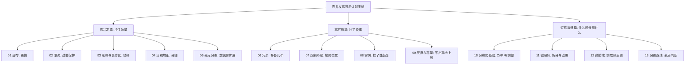

# 00 导论：并发与可用性的本质矛盾

> **优先级档位：第一档（全手册地基篇）｜预计阅读时间：25 分钟**
> **一句话定位：这是全手册的地图和世界观——先搞懂"快"和"稳"为什么天生打架，后面的 13 篇每篇都是在给这对矛盾交一种赎金。**

## TL;DR

- 高并发要解决的指标是吞吐量（QPS/TPS）和响应时间（RT），高可用要解决的指标是可用性（几个 9）和错误率；两套指标经常被同一次事故同时击穿。
- 均值会骗人，看延迟必须看 p95/p99/p999：长尾请求才是用户真实感受到的"卡"。
- 可用性每多一个 9，停机时间降一个数量级，成本和复杂度却涨好几个数量级——99.99% 之后基本靠钱堆。
- "快"和"稳"天然互斥：利用率越高排队越爆炸，冗余越多一致性越难，每个高可用手段都在给系统增加复杂度。
- 高并发三板斧：缓存（更快）、异步化（错峰）、水平扩展（更多）；高可用三板斧：冗余（多备几个）、故障自愈（熔断降级）、容灾（挂了能恢复）。
- 面试估算题的本质是量感：日活 → 高峰集中系数 → 人均请求数，三步出心算 QPS。
- 财务系统 QPS 通常个位数，但数据正确性要求让可用性的权重比流量系统更高——这套认知你迟早用得上。

## 引子

月底最后一天晚上九点，你们公司的财务系统开始"抽风"：200 个会计同时在点"生成月度对账报表"，每张报表背后要扫 400 万行明细。前 30 秒一切正常，然后页面开始转圈，有人刷新了三次——每次刷新都是一次全新的全表扫描。两分钟后，接口全部超时，数据库 CPU 100%，连登录都登不上去了。运维群里的告警刷了屏，老板在问："系统是不是挂了？"

这个场景里其实发生了两件事：一是**并发扛不住**（200 个人同时要的计算量超过了机器的供给），二是**可用性被拖垮**（报表慢了，却把登录这种八竿子打不着的功能也拖死了）。这就是这本手册要解决的两个问题的缩影——它们经常被同一次事故同时引爆，但根源和解法完全不同。

你接下来的 13 篇阅读，本质上就是在学习如何分别回答这两个问题：**"怎么让它更快/扛更多"**，以及**"怎么让它挂了也不出事"**。而导论篇的任务只有一个：先告诉你这两个目标为什么是矛盾的，这样你才不会天真地以为存在银弹。

## 一、指标体系：先学会怎么"量"，再谈怎么"优化"

面试里所有高并发问题的第一步都是"你们的量级是多少"。答不出数字的人，方案说得再漂亮也会被判定为背书。这一节把四个必须脱口而出的指标讲透。

### 1. 吞吐量：QPS、TPS、并发数

- **QPS（Queries Per Second）**：每秒处理的请求数，面向"读/轻操作"的度量，比如一个商品详情页接口。
- **TPS（Transactions Per Second）**：每秒完成的事务数，一个事务可能包含多个请求和多次写库，比如"创建订单"= 扣库存 + 写订单 + 发消息，算 1 个 T 但可能是 5 个 Q。
- **并发数（Concurrency）**：同一时刻系统正在处理的请求数。

三者关系有一条叫 **Little 定律（Little's Law）** 的朴素公式：

> 并发数 = QPS × 平均响应时间（秒）

直觉版理解：收银台每秒接待 10 个顾客（QPS=10），每人结账花 6 秒，那么任何时刻都有大约 60 个顾客正在结账（并发数=60）。这条定律的实战价值在于：**当你想提升 QPS 时，要么加收银台（扩资源），要么缩短单次结账时间（降 RT）**——全手册的"高并发篇"五种手段，没有超出这个框架的。

顺带厘清三个常被混用的词：**性能（Performance）** 是单次请求快不快（RT），**并发（Concurrency）** 是同时能扛多少个（并发数/QPS），**容量（Capacity）** 是指标开始恶化前系统能承载的最大负载。三者相关但不等价——一个接口性能很好（单次 10ms），容量可能很小（只能扛 100 QPS 就雪崩），因为瓶颈在别处：数据库连接池、锁、第三方依赖。

### 2. 响应时间：均值是骗子，长尾才是真相

假设你的接口平均 RT 是 50ms，听起来很健康。但真实分布可能是：90% 的请求 20ms 返回，1% 的请求卡 3 秒——那 1% 落到具体用户头上，就是"这个系统有时候特别卡"的口碑来源。均值把这 3 秒稀释掉了。

所以工程上看 **分位数（Percentile）**：

- **p50（中位数）**：一半请求比它快，代表"典型体验"。
- **p95/p99**：代表"倒霉用户的体验"，是容量规划的核心依据。
- **p999**：接近"最坏情况"，通常被 GC 停顿、锁竞争、慢查询贡献。

一个反直觉但重要的结论：**p99 往往不是 p50 的 2 倍，而是 10 倍起步**（经验之谈，因系统而异）。优化接口时，盯着均值优化等于没优化，盯 p99 才能发现真正的瓶颈（慢 SQL、锁、网络抖动都藏在长尾里）。

### 3. 可用性：几个 9 的换算表（背下来）

可用性（Availability）= 正常服务时间 / 总时间。面试必考的换算：

| 可用性 | 年停机时间 | 月停机时间 | 直观感受 |
|---|---|---|---|
| 99%（两个9） | 约 3.65 天 | 约 7.3 小时 | 个人项目水平 |
| 99.9%（三个9） | 约 8.8 小时 | 约 44 分钟 | 一般企业系统及格线 |
| 99.99%（四个9） | 约 53 分钟 | 约 4.4 分钟 | 主流互联网服务目标 |
| 99.999%（五个9） | 约 5.3 分钟 | 约 26 秒 | 支付/运营商级，极贵 |

注意代价曲线：从 99.9% 到 99.99%，要求你能扛住单点故障（需要冗余+自动切换）；从 99.99% 到 99.999%，要求你能扛住机房级灾难（需要多机房容灾）。**每多一个 9，停机预算缩小 10 倍，系统复杂度翻好几倍**——这就是为什么"可用性目标定多少"是个商业决策而不是技术决策。

相关但容易混淆的三个术语：

- **SLI（Service Level Indicator，服务水平指标）**：你实际测到的数，比如"上月可用性 99.95%"。
- **SLO（Service Level Objective，服务水平目标）**：你对内承诺的目标，比如"p99 延迟 < 200ms"。
- **SLA（Service Level Agreement，服务水平协议）**：对外签合同、违约要赔钱的那一档，通常比 SLO 宽松，留出缓冲。

记忆法：**SLI 是现状，SLO 是目标，SLA 是合同**。

### 4. 错误率与饱和度

- **错误率（Error Rate）**：失败请求占比（HTTP 5xx、超时、业务拒绝）。可用性不是非黑即白——系统"活着"但错误率 20%，对用户就是挂了。
- **饱和度（Saturation）**：资源被用掉了多少（CPU、内存、磁盘 IO、连接池、线程池）。Brendan Gregg 的 **USE 方法（Utilization / Saturation / Errors，出自《Systems Performance》）** 主张排查性能问题时对每种资源看这三个维度，一句话记住即可：**饱和度是事故的先行指标，它涨满之前，QPS 和错误率往往还岁月静好**。

## 二、本质矛盾：为什么"快"和"稳"天然互斥

理解了指标，就能看清这本手册的核心命题。高并发和高可用不是两个并列的技术方向，而是一对**结构性矛盾**，矛盾来自三条无法回避的事实。

### 1. 资源永远有限：利用率越接近 100%，排队时间爆炸

这是排队论（Queueing Theory）最反直觉的结论：系统的等待时间不是随利用率线性增长的，而是在接近满负荷时**指数爆炸**。收银台类比：4 个收银台、平均每分钟来 3.9 个顾客时，队伍已经会越排越长——虽然理论上 4 个台子每分钟能结 4 个人，"够用"。但只要顾客到达有随机波动，利用率一接近 100%，偶发的排队就消不掉，队伍雪崩。

工程翻译：

- CPU 利用率 70% 时 p99 可能还很乖，到 90% 时 p99 可以恶化 5-10 倍（经验之谈，因系统而异）。
- 所以**容量规划必须留水位**：生产系统的健康 CPU 水位通常在 50%-70%，剩下的 30%-50% 不是浪费，是你为突发流量买的保险。
- 这直接解释了"快"和"稳"的第一层冲突：为了扛并发你可以把机器压到极限（快），但那样系统就失去吸收波动的余量（不稳）；为了稳你必须闲置资源（贵）。

### 2. 冗余提高可用性，但多副本引入一致性难题

想让系统"挂了也不出事"，唯一的路是冗余：多部署几份、多存几份数据。但副本一旦变多，新问题来了——**这些副本之间怎么保持一致？**

这里必须接受一个分布式系统的前提：**网络是不可靠的，这不是可选项而是物理现实**。机器之间的消息会丢、会延迟、会乱序，你没法"解决"它，只能"设计着忍受"它。当两个副本因为网络分区（Network Partition）暂时联系不上时，你只能二选一：要么继续对外服务但接受两边数据暂时不一致（保可用性），要么拒绝服务直到同步完成（保一致性）。这就是 CAP 定理（CAP Theorem）的直觉版——详细论证留给第 10 篇，现在只需记住：**冗余把"会不会挂"的问题，换成了"副本不一致怎么办"的问题，而后者没有完美解**。

### 3. 复杂系统是可靠的敌人

第三条事实最容易被初学者忽略：**每引入一个高可用手段，系统就多一个会坏的部件**。

- 加了缓存（第 01 篇）→ 多了缓存穿透/击穿/雪崩、缓存与数据库不一致的问题。
- 加了消息队列做异步化（第 03 篇）→ 多了消息丢失、重复消费、堆积的问题。
- 做了分库分表（第 05 篇）→ 多了跨库事务、分布式 ID、路由改写的问题。
- 做了微服务拆分（第 11 篇）→ 多了一整个分布式世界的故障模式。

这不意味着这些手段不该用，而是意味着**每个手段都是"用复杂度换指标"的交易**。成熟架构师和新手架构师的分水岭，不是知道多少手段，而是能否判断：当前量级下，这笔复杂度花得值不值。第 13 篇演进路线通篇在讲这个判断。

## 三、应对手段全景地图：一页看懂全手册

矛盾讲清了，手段就好归类了。所有高并发高可用技术，本质上是六把斧头的排列组合。

### 高并发三板斧

| 手段 | 原理 | 优点 | 代价 | 适用场景 |
|---|---|---|---|---|
| 缓存（更快） | 把热点数据放到离计算更近、更快的介质里（内存代替磁盘/数据库） | 降 RT、卸数据库压力，性价比最高 | 数据不一致、穿透/击穿/雪崩三种经典事故 | 读多写少、允许短暂不一致，详见第 01 篇 |
| 异步化/削峰（错峰） | 用消息队列把瞬时流量摊到时间轴上慢慢消化，或把慢操作踢出主链路 | 削平峰值、保护下游、提升主链路 RT | 最终一致性、消息可靠性、排障链路变长 | 流量有尖峰、操作可延迟，详见第 03 篇 |
| 水平扩展（更多） | 无状态服务加机器，靠负载均衡分摊；数据层靠分库分表分摊 | 理论上线性扩容，天花板高 | 状态管理复杂、数据分布设计难 | 单机到瓶颈，详见第 04、05 篇 |

还有一道防线单独讲：**限流（Rate Limiting）**——当三板斧都顶不住时，主动拒绝一部分请求，保住大局，详见第 02 篇。它不是扩容手段，而是"过载保护"。

### 高可用三板斧

| 手段 | 原理 | 优点 | 代价 | 适用场景 |
|---|---|---|---|---|
| 冗余（多备几个） | 任何单点都有副本：多实例、主备数据库、多机房 | 消灭单点故障，可用的地基 | 成本翻倍、副本一致性难题 | 一切系统，详见第 06 篇 |
| 故障自愈（熔断降级） | 检测到下游故障时快速失败、摘除故障节点、降级非核心功能 | 防止局部故障蔓延成全站雪崩 | 配置与阈值调优难，降级本身就是"有损服务" | 有外部依赖/微服务调用链，详见第 07 篇 |
| 容灾（挂了还能恢复） | 备份、跨机房/跨地域部署、预案演练 | 扛住机房级灾难，保住数据底线 | 最贵的手段，RTO/RPO 指标要花大钱压低 | 数据不能丢的系统（如财务），详见第 08 篇 |

前端类比帮助记忆：**熔断器（Circuit Breaker）很像 React 的 Error Boundary**——局部组件崩了，圈住它，别让整棵组件树白屏。区别是 Error Boundary 是被动兜底，熔断器会主动探测、自动恢复。

### 手册知识地图

注意这张图的结构：**高并发篇和高可用篇是"手段"，架构演进篇是"判断"**。手段可以背，判断必须练——这是本手册区别于普通八股文的地方。

## 四、数字感训练：面试心算三例

面试里"估算一下你们系统的 QPS"是经典开场。方法固定三步：**日活 → 高峰集中系数 → 人均请求数**。行业经验值：流量通常集中在 20% 的时间里（高峰集中系数约 5 倍于均值），一天 86400 秒 ≈ 8.6 万秒，口算可按 10 万秒。

**例 1：日活 10 万的社区 App，峰值 QPS 大概多少？**

- 日均请求：假设人均产生 50 次接口调用（刷 feed、点赞、加载评论），总请求 = 10万 × 50 = 500 万次/天。
- 平均 QPS = 500万 ÷ 8.6万秒 ≈ 58。
- 峰值 QPS = 均值 × 集中系数（取 5）≈ **300**。结论：这种量级单机+Redis 绰绰有余，谈分库分表属于过度设计。

**例 2：秒杀活动，10 万人抢 5000 件商品，开抢瞬间 QPS？**

- 秒杀的流量不是按"人均请求数"算的，是按"人类手速+刷新行为"算的：10 万人在开抢后 5 秒内集中点击，人均狂点/重试 3-5 次。
- 峰值 QPS ≈ 10万人 × 4次 ÷ 5秒 ≈ **8 万 QPS**。结论：这个量级必须在网关层限流+库存预热到 Redis，数据库直连必死——这正是第 02、03 篇的适用边界。

**例 3：你们财务系统，200 个会计，月结高峰 QPS？**

- 人均操作频率：会计点页面的频率，一分钟撑死 5 次操作，即人均约 0.08 次/秒。
- 峰值 QPS ≈ 200 × 0.08 ≈ **16**。但注意例 3 的要点不在数字小，而在于：**其中可能混着几个"扫 400 万行"的重型查询，一个重型查询顶一千个普通请求**。所以财务系统的容量问题不是 QPS 问题，是"重查询隔离"问题。

心算训练的核心结论：**先估量级，再谈方案**。量级差一个数量级，正确方案可能完全相反。

## 五、面试视角

### 开场题："你怎么理解高并发和高可用？"

考察什么：不是让你背定义，是看你能不能**用指标和矛盾组织知识**。回答骨架（控制在两分钟）：

1. **先给指标**：高并发关心吞吐量和响应时间，高可用关心可用性几个 9 和错误率——"没有数字的高并发都是空谈"。
2. **再点矛盾**：两者天然互斥——资源有限所以利用率越高排队越长；冗余保可用但引入一致性难题；每个可用性手段都在增加复杂度。
3. **然后亮地图**：高并发三板斧（缓存/异步/扩展），高可用三板斧（冗余/自愈/容灾），各报一句本质。
4. **收尾到判断**：用什么手段取决于量级和业务容忍度，"架构是 trade-off 的艺术"。

### 经典追问连招

- **追问 1："你们系统 QPS 多少？p99 多少？"** → 考察你有没有真实数字感。答不出真实数字就用第四节的估算法现场推一个，并说明假设。
- **追问 2："为什么看 p99 不看平均？"** → 考察是否理解长尾。回答：均值会被大量快请求稀释，用户感知的"卡"来自长尾；p99 里藏着慢查询、GC、锁竞争。
- **追问 3："可用性 99.99% 怎么做到？"** → 考察你是否知道代价曲线。回答骨架：先算它只有约 53 分钟/年的停机预算 → 单点必须全部冗余 → 故障切换必须自动化（人工响应来不及）→ 再往上就要多机房。
- **追问 4："CAP 你选 CP 还是 AP？"** → 这是陷阱题。正确姿势：先指出 CAP 只在发生网络分区时才有选择，平时一致性和可用性可以都要；然后说业务：支付/库存选 CP（宁可不可用不可错），社交 feed 选 AP（宁可旧一点不能刷不出来）。
- **追问 5："如果让你把我们财务系统设计到扛 1000 QPS，你怎么做？"** → 先反问"为什么要扛 1000？"——能指出"先验证量级真实性"的人，比直接上微服务的人高一个段位。

## 六、常见误区

- **以为 QPS 高就是高并发，其实并发是结构问题不是数字问题**：1 万 QPS 的纯静态请求可能毫无挑战，100 QPS 的分布式事务可能天天出事。难度看请求之间的耦合和资源竞争，不看裸数字。
- **以为可用性越高越好，其实每多一个 9 都是真金白银**：四个 9 之后，成本曲线陡到大多数业务不该追。该问的是"我的业务停机一小时损失多少钱"，而不是"怎么做到五个 9"。
- **以为缓存/消息队列是标配，其实它们都是负债型资产**：每个组件都自带一整个故障模式清单。量级不到，引入它们是用确定的复杂度换不确定的收益。
- **以为高可用是运维的事，其实高可用从写第一行代码就开始了**：超时设置、重试策略、降级开关，全是代码层决策。等上了生产再谈高可用，地基已经浇死了。
- **以为背完八股就懂了高并发，其实面试官只信数字**：能说出"我们 p99 从 800ms 优化到 200ms，手段是 XX"的人，秒杀背出十种方案的人。

## 七、与我的财务系统的关联

先给结论，不硬凑：**你的财务系统大概率永远不需要扛例 2 那种秒杀流量，但这套认知对你有三层真实价值。**

**第一层：量级定位。** 企业财务系统的典型画像是：用户几百人（内部会计/财务），日常 QPS 个位数，但**月末/季末/年末出现规律峰值**——结账、批量开票、报表导出的重型查询集中爆发。你的容量问题不是"流量太大"，而是"重查询挤死轻请求"：一个扫 400 万行的报表查询能把数据库连接池占满，让登录、查发票这种毫秒级操作集体超时。对应的解法是手册里的具体招式：**慢查询优化和读写分离（第 05 篇的影子）、报表预计算与异步导出（第 03 篇削峰思想的低配版）、给导出接口加限流和队列（第 02 篇）**——不需要上分布式，但需要分布式的思维。

**第二层：可用性权重倒挂。** 流量系统丢一条 feed 无伤大雅，财务系统**错一分钱就是事故**。所以财务系统的优先级排序是反的：数据正确性 > 可用性 > 性能。这决定了：幂等设计（重复提交不能重复记账）比 RT 重要，数据库备份与恢复演练（第 08 篇容灾的核心动作）比缓存重要，对账模块本身就是"用冗余对冗余"的高可用思想在业务层的落地。面试时被问"你们系统的高可用怎么做的"，答对账+幂等+备份演练，比硬背熔断器真诚得多。

**第三层：跳槽的通用语言。** 你的目标是中厂全栈岗，面试官一定会用这套体系探你："QPS 多少""可用性怎么保证""流量涨 10 倍怎么办"。财务系统的真实数字（几百用户、个位数 QPS）不丢人，丢人的是**说不出数字、也不知道数字意味着什么**。本手册给你的是：把手上的系统放进行业标准坐标系的能力——"我知道我的系统在哪个量级，知道这个量级该用什么手段，也知道再涨两个数量级该怎么演进"（第 13 篇）。这个回答结构，比任何八股都值钱。

## 小结

这一篇没教你任何具体技术，教了三件更底层的东西：一是**指标**——QPS/TPS/RT/p99/几个9，它们是所有讨论的共同语言；二是**矛盾**——资源有限、网络不可靠、复杂度有害，这三条事实决定了"快"和"稳"永远在拔河，所有手段都是在给矛盾交赎金；三是**地图**——六把斧头、13 篇正文，各自解决矛盾的一个侧面。带着"这手段在给哪条矛盾交什么赎金"的问题去读后面的每一篇，你学到的就是架构判断，而不是名词解释。

## 延伸阅读

- 《Google SRE 工作手册》（Site Reliability Workbook）：SLI/SLO/SLA 与错误预算的源头读物
- 《Designing Data-Intensive Applications》（数据密集型应用系统设计，Martin Kleppmann）：分布式系统前提——网络不可靠、副本一致性——的经典论述
- 《Release It!》（发布！软件的设计与部署，Michael Nygard）：稳定性模式（熔断、超时、舱壁）的思想源头
- Little 定律与排队论的入门材料：搜索"Little's Law queueing"任一大学运筹学讲义即可
- Google SRE Book 第四章 "Service Level Objectives"（官网 sre.google 免费公开）
