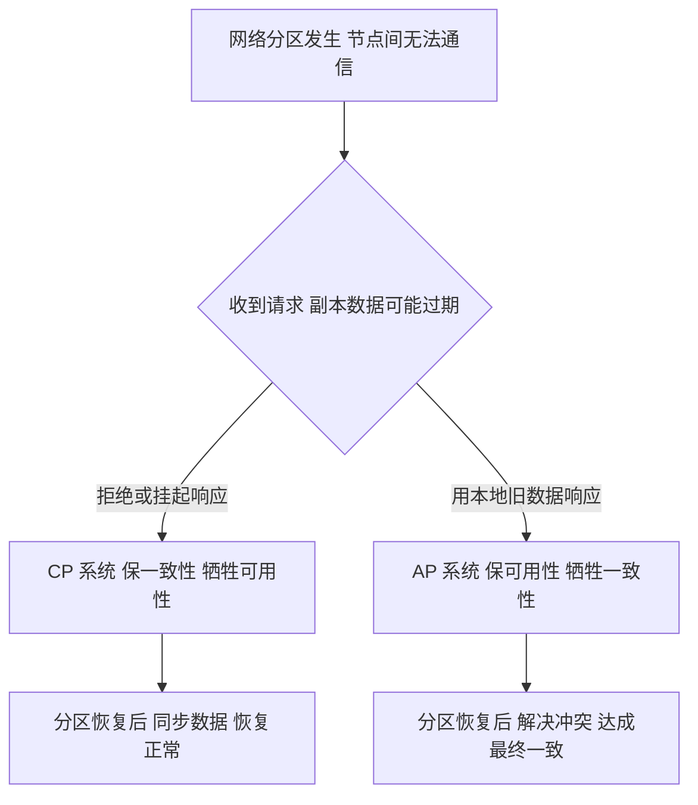
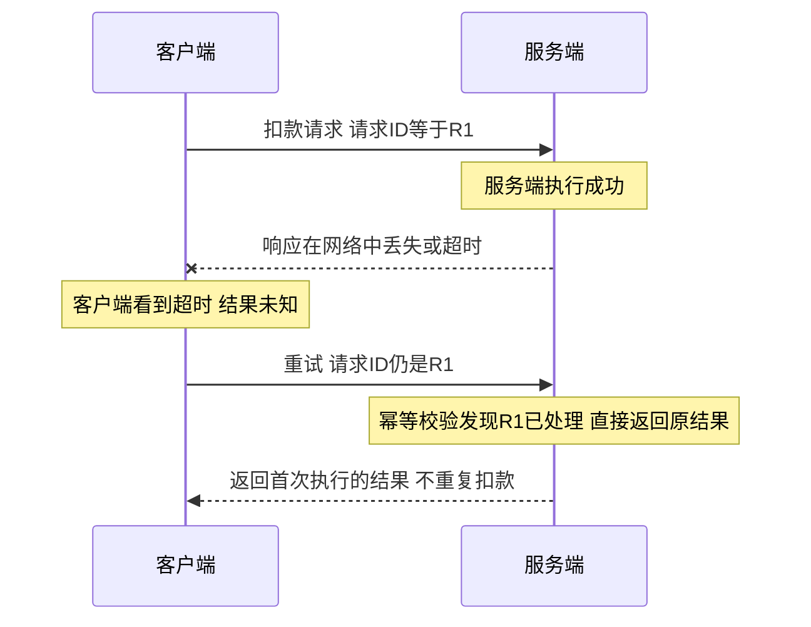

# 10 分布式架构基础：CAP、分布式锁、分布式 ID 与事务地图

> **优先级档位**：第一档（CAP/分布式锁/分布式 ID 是八股核心，也是后续事务专题的理论地基）
> **预计阅读时间**：约 40 分钟
> **一句话定位**：从单机走向多机的那一刻起，你交易出去的是简单性，换回来的是容量与可用性——本篇讲清这笔交易里的核心名词、核心两难和核心工具箱。

## TL;DR

- 分布式的本质是：**用网络换容量和可用性**，同时引入部分失败、时钟不可靠、脑裂等一系列单机不存在的新问题。
- CAP 不是"三选二"：P（分区容错）不可放弃，真实选择只在分区发生时的 C（线性一致性）与 A（可用性）之间；平时 CA 可以兼得。
- 注册中心该选 AP：分区时宁可服务发现数据短暂不一致，也不能让整个调用链路停摆。
- BASE 是 AP 路线的工程化包装：基本可用 + 软状态 + 最终一致性；你的对账系统就是最终一致性的业务版实现。
- 调用超时有三种结果：成功、失败、**不知道**——"部分失败"是分布式一切复杂性（重试、幂等、事务）的源头。
- 分布式锁选型口诀：大多数场景 Redis 锁（SET NX PX + 唯一标识 + 续期）够用；涉及钱的强互斥，DB 乐观锁/状态机兜底。
- Redlock 不是银弹：Martin Kleppmann 与 antirez 之争的核心是时钟假设，工程共识是"高效但非绝对安全"，关键写场景加 fencing token。
- 分布式 ID 主流是雪花算法（Snowflake）：时间戳 + 机器 ID + 序列号；注意时钟回拨；业务单据号不要纯随机——要可读、防爬、带业务含义。

## 引子：一台机器不够用了

想象你公司的财务系统跑在一台 32 核 128G 的服务器上。某天老板宣布业务扩张：日均开票量从 5 万张涨到 50 万张，月末对账要在 400 万条明细和银行流水之间跑批，管理驾驶舱的多维报表要保证 9 点到 10 点的查询高峰不超时。

你很快会撞上四面墙：

- **CPU**：月末跑批把 32 核打到 100%，报表查询开始排队，前端同事的图表转圈 30 秒；
- **内存**：为了加速查询堆的缓存把内存吃满，OOM Killer 开始随机"处决"进程；
- **磁盘 IO**：明细表+索引过 TB 后，一次全表扫描就能把 IO 打满；
- **连接数**：单机 Nginx 默认几万个文件句柄，连接数涨上去后新请求直接被拒。

更扎心的是另一件事：哪怕容量够，**这台机器挂了，整个公司就开不了票**。单机可用性按"几个 9"换算，一台无冗余的机器做到 99.9%（年停机约 8.7 小时）已经很吃力，而老板要的可能是 99.99%（年停机约 52 分钟）。

于是答案只有一个：**加机器**。但这笔交易的条款你必须读清楚——分布式的本质是：**用网络换容量和可用性，同时引入了一堆单机时代根本不存在的新问题**。本篇就是带你把这份"交易条款"逐条读懂。

## 一、分布式为什么"不得不"，又为什么"很痛"

### 1.1 不得不的三条理由

1. **容量天花板**：单机 CPU、内存、磁盘、连接数都有硬上限，纵向扩容（Scale Up）的钱是指数级增长，横向扩容（Scale Out）是线性增长。
2. **可用性要求**：单点必然有单点故障。消除单点的唯一办法是冗余，冗余意味着多机，多机意味着分布式。
3. **物理距离**：用户在全国，机房就一个，跨省 100ms 的网络延迟是物理定律，只能在用户附近部署节点。

### 1.2 很痛的根本原因

单机世界里，一次函数调用的结果只有两种：返回了，或者抛异常了。分布式世界里，调用要过网络，而网络会丢包、会延迟、会分区；多台机器的时钟各走各的；一部分机器挂了另一部分还活着。这些"新物理定律"会在第四节展开，这里先立住基调：

> 分布式不是"把单机程序复制几份"，而是一种**全新的故障模型**。你写的每一行跨机器代码，都要回答单机时代不用回答的问题：如果对方没回话，我该怎么办？

### 1.3 反向判断：什么时候不该急着上分布式

只讲"不得不"不讲"不必"，是片面的。判断维度给清楚：

- **数据量在单机舒适区内**（百万级明细、单表几千万行以内、QPS 几百）→ 不要分布式。一台像样的云主机加合理索引能扛的量，拆成微服务+分库分表是用复杂度给自己上刑。你的财务系统目前 400 万明细，正处于"单机优化远未榨干"的区间，正确的演进姿势是先把索引、慢查询、读写分离做透。
- **团队没有分布式运维能力**（没有监控告警、没有链路追踪、没人半夜能排查跨机器问题）→ 多一台机器多十倍故障面，可用性反而下降。
- **真正的信号出现时再动**：单机资源利用率长期打满且优化无效、单点故障已实际造成业务损失、或者监管/合规明确要求多活——这三条任一成立，才是分布式的入场券。

微服务、分库分表、多机房，每一种都是"先付复杂度首付，再分期付运维按揭"。记住：**分布式是止痛药，不是保健品。**

## 二、CAP 真义：被误读最深的定理

CAP 是面试出现频率最高的分布式概念，也是被背错最多的。先把定义钉死，再谈取舍。

### 2.1 三个字母的准确定义

- **一致性（Consistency）**：指的是**线性一致性（Linearizability）**——所有客户端看到的数据视图如同只有一份副本，写操作一旦成功，之后任何读都能读到这个值。**注意：这不是 ACID 里的 C**。ACID 的 C 是"事务前后数据满足业务约束"，CAP 的 C 是"多副本对外表现像单副本"，两个 C 撞名是历史遗留的坑。
- **可用性（Availability）**：**每次请求都能收到非错误的响应**（不保证读到最新值）。注意是"每个节点、每次请求"都要响应，不是"大部分请求成功"——那 99.9% 的 SLA 不是 CAP 语境的 A。
- **分区容错（Partition Tolerance）**：网络分区（Partition，节点间消息丢失或延迟到不可用）发生时，系统**仍能继续运行**，而不是整个停摆。

### 2.2 关键洞察：P 不可选，选择只在 C 与 A 之间，且只在分区那一刻

这是纠正常见误读的核心。网络分区不是"会不会发生"的问题，而是"什么时候发生"的问题——光纤被挖断、交换机故障、网卡抖动、云上可用区之间丢包，都是分区。**所以 P 是分布式系统的必选项，不是可选项。**

真正的选择题只在分区发生的那一瞬间出现：

- 两个节点 A、B 之间网络断了，客户端同时连着两边。一个写请求打到 A，这个数据无法同步到 B。此时一个读请求打到 B，B 只有两条路：
  - **拒绝响应（或返回错误）** → 保住了 C，牺牲了 A，你是 CP 系统；
  - **用手上的旧数据响应** → 保住了 A，牺牲了 C，你是 AP 系统。

而在没有分区的 99.99% 的时间里，CA 是兼得的——系统既一致又可用。所以说"CAP 三选二"是彻头彻尾的误读：**不是系统设计时三选二，而是分区发生时二选一**。



### 2.3 CP 与 AP 的真实取舍案例

**CP 代表：ZooKeeper、etcd。** 它们用 Zab/Raft 共识协议，写入必须过半节点确认。分区时少数派节点直接拒绝服务。它们为什么敢选 CP？因为它们管的是**元数据和协调状态**（配置、选主、服务注册的关键版本），数据量小、写入低频，但错一次代价巨大——两份"谁是主节点"的答案会导致脑裂。

**AP 代表：Eureka、Cassandra。** Eureka 作为服务注册中心，节点之间异步复制注册表，分区时每个节点照常提供服务发现，哪怕数据是几分钟前的。

**为什么注册中心该选 AP？** 这是经典面试分析题，推理链条是：

1. 注册中心的职责是告诉调用方"服务在哪几台机器上"；
2. 分区发生时，注册表数据短暂的旧（某台已下线的机器还在列表里）并不致命——调用方有超时、重试、熔断兜底，打到死节点大不了换一个；
3. 但如果注册中心选 CP，分区时注册中心自己不可用，**所有服务都无法发现彼此，整个调用链全面瘫痪**——这比"拿到一份略旧的地址簿"严重一个数量级。

结论：注册中心的数据"错了能自愈"，服务发现本身"挂了无法工作"，所以选 AP。这个推理过程比背结论值钱得多。

### 2.4 PACELC：把 CAP 没说全的另一半补上

CAP 只讲了"分区时（P）"的选择。PACELC 定理补上了另一半：**如果发生分区（P），在可用性（A）和一致性（C）之间选；否则（Else），在延迟（Latency）和一致性（C）之间选。**

后半句才是日常：没有分区时，强一致要求写操作同步复制到多个副本，延迟必然更高；要快就异步复制，接受短暂不一致。MySQL 主从的半同步 vs 异步复制，就是 ELC 这条腿的活例子。

## 三、BASE 理论：AP 路线的工程化包装

CAP 告诉你分区时只能保 A 就得放 C，但没告诉你"放掉 C 之后系统该怎么活"。BASE 理论就是答案，三个词：

- **基本可用（Basically Available）**：分区或故障时，允许损失部分可用性——响应时间变长、功能降级（如秒杀时关掉评论），但核心链路不死。
- **软状态（Soft State）**：允许系统存在中间状态，即不同副本的数据可以暂时不一致，这个"中间态"是合法存在的，不是 bug。
- **最终一致性（Eventual Consistency）**：软状态不是永久的，系统保证在**没有新写入**的前提下，经过一段时间后所有副本收敛到一致。注意它只承诺"最终"，不承诺"多快"。

BASE 不是推翻 ACID，而是承认一个工程现实：**跨机器、跨系统的强一致代价高到不可接受时，用"暂时不一致 + 事后收敛"换取系统的生存。**

### 3.1 最终一致性的常见实现手法

- **异步复制**：写主库即返回，后台同步到从库（MySQL 主从、Redis 主从）。读从库可能读到旧值，几秒后收敛。
- **消息驱动**：A 系统完成本地事务后发消息，B 系统消费消息更新自己的数据。消息可能延迟、重复（所以需要幂等），但最终会送达。
- **对账补偿**：事后定时比对双方数据，发现不一致就生成差异单，人工或自动修复。

### 3.2 关键洞察：你的对账系统就是最终一致性的业务版

这一点值得展开，因为它能把抽象理论焊进你的业务直觉里。

财务系统和银行、支付渠道之间，天然是分布式系统：你在你的库里记"这笔 3000 元已收"，银行在银行的库里记"这笔 3000 元已扣"。两个系统之间**没有任何分布式事务**能把这个操作做成原子的——银行不可能让你锁它的库。

所以行业实践完全是 BASE 的剧本：

1. **软状态**：支付回调到达前，订单状态是"支付中"——这就是一个合法的中间状态，两边暂时不一致；
2. **消息驱动收敛**：支付成功回调到达，订单改成"已支付"——大多数情况下两边很快一致；
3. **对账补偿兜底**：回调丢了、重复了、金额对不上怎么办？T+1 拉银行对账文件，逐笔勾对，差异进入差错处理流程——这是"最终一致性"的**业务级实现**，用天级的时间窗口换绝对的正确性。

下次面试官问你"举一个最终一致性的例子"，别再说缓存和数据库了，说对账。这是能把背八股的人区分开的答案。

## 四、分布式八大难题：一份认知清单

这一节是后续所有专题的目录页。每条给一句话本质 + 一个例子，其中"部分失败"重点展开。

| 难题 | 一句话本质 | 一个例子 |
| --- | --- | --- |
| 网络不可靠 | 消息可能丢、可能慢、可能乱序，没有"一定送达" | 跨机房调用偶发超时，重试后成功 |
| 时钟不可靠 | 各机器的物理时钟会漂移，"先后"无法靠时间戳判定 | 日志里 A 事件时间戳晚于 B，实际 B 先发生 |
| 部分失败 | 调用的结果不是两态而是三态：成功/失败/**不知道** | 扣款请求超时，你不知道钱扣没扣 |
| 拜占庭问题 | 节点不仅可能宕机，还可能"说谎"（作恶或数据损坏） | 区块链要防恶意节点；普通企业内网一般假设节点不撒谎，只需防宕机 |
| 脑裂（Split-Brain） | 分区导致两个节点都以为自己是主，同时接写 | 数据库主从切换时旧主未死透，双主各写各的 |
| 数据一致性 | 多副本 + 并发写 = 收敛难题 | 缓存与 DB 双写，先删缓存还是先写库 |
| 分布式事务 | 跨机器的一组操作无法靠单机事务保证原子性 | 下单要同时扣库存、创建订单、扣余额 |
| 可观测性 | 一次请求横跨几十个服务，出问题找不到现场 | 报表查询慢，慢在网关、应用还是 SQL？需要 Trace 串起来 |

### 4.1 重点展开：部分失败——超时三态困境

单机调用，要么返回要么抛异常。分布式调用，第三种结果来了：**超时**。而超时意味着"不知道"：

```text
客户端 → 请求 → 服务端
            ↘ 响应在路上丢了/慢了 → 客户端超时
```

超时有三种可能的真相：①服务端根本没收到（没执行）；②服务端执行成功了，响应丢了；③服务端正在执行，马上成功。客户端无法区分——**你看到的只是"没回信"，而不是"没发生"**。

这个"不知道"是一连串复杂性的源头：

- **要不要重试？** 不重试，可能丢了一笔该成功的操作；重试，可能把"已扣款"再扣一次。所以重试必须配**幂等**——同一个请求来两次，效果和一次相同（这正是你的事务/幂等专题要深挖的）。
- **状态怎么写？** 不能只有"成功/失败"两态，必须有"处理中"这样的中间态（呼应 BASE 的软状态），用后续查询或回调收敛。
- **怎么排查？** 客户端日志说失败，服务端日志说成功，两边都是真话——排查部分失败必须有全局唯一的请求 ID 贯穿链路。



记住这句话：**分布式系统里，超时不是错误，是一种"结果未知"的合法状态。** 所有重试、幂等、事务补偿机制，本质上都是在为这三态困境擦屁股。

顺带说"脑裂"为什么可怕：脑裂（Split-Brain）发生时，两个节点都认为自己是唯一的主，各自接受写入。分区期间两拨客户写进了两份分叉的数据，分区恢复后**没有任何算法能自动判断哪份是对的**——这不是技术故障，是CAP里选A的系统必须支付的代价。解法只有两类：事前用共识协议保证"同时最多一个合法主"（选C），或事后用冲突合并/人工对账来收拾（选A，又回到你的对账直觉）。

## 五、分布式锁：谱系、坑与选型

单机用 `synchronized` / `lock` 就能互斥；多机部署后 JVM 锁只锁得住本机进程，对账任务被调度到两台机器上同时跑，就会重复核销、重复开票——这就是分布式锁存在的理由：**在多个进程/机器之间互斥地访问一份共享资源**。

### 5.1 方案对比表

| 方案 | 原理 | 优点 | 代价 | 适用场景 |
| --- | --- | --- | --- | --- |
| DB 唯一索引 | 抢锁 = 插入一行唯一键记录，插入成功者持锁 | 实现最简单，无新组件 | 性能差（每次抢锁一次写库），无自动过期要自己做清理 | 并发低、已有 DB 不想引中间件的小系统 |
| DB 悲观锁 | `SELECT ... FOR UPDATE` 行锁，事务内互斥 | 语义最严谨，锁随事务释放 | 长事务占连接，高并发下连接池被打爆 | 强互斥、低频、且操作本身就是一条 SQL 的场景 |
| Redis 锁 | `SET key value NX PX ttl` 原子抢锁 | 性能好（单节点 10 万级 QPS），实现成熟 | 有锁误删、续期、主从切换丢锁等一串坑（下文详述） | 绝大多数业务的默认选择 |
| Redlock | 向 N 个独立 Redis 节点抢锁，过半成功才算持锁 | 不依赖单点，抗主从切换 | 性能下降，且安全性有学术争议（下文详述） | 对可靠性有更高要求、又能接受争议的写场景 |
| ZK / etcd 锁 | 临时顺序节点 + Watch 前驱节点 | 可靠性最高：会话断即锁自动释放，无过期时间两难 | 吞吐低（写要过共识协议），运维成本高 | 低频、强一致、宁可慢不可错的协调场景 |

### 5.2 Redis 锁的三连坑

**坑一：加锁必须原子。** 正确姿势是一条命令搞定：

```text
SET lock:recon task-uuid-123 NX PX 30000
-- NX：key 不存在才设置（互斥）
-- PX 30000：30 秒自动过期（防持锁者宕机后死锁）
```

如果用"先 SETNX 再 EXPIRE"两条命令，中间客户端宕机，锁就永不过期——这是 2020 年前无数生产事故的来源，现在面试还在考。

**坑二：过期时间怎么定，是个两难。** 设短了：业务还没跑完锁就过期，别人进来互斥失效；设长了：持锁者宕机后，其他人傻等。工程解法有两个方向：

- **把锁时间设得远大于 P99 业务耗时**，接受宕机后的等待（简单够用）；
- **看门狗续期（Watchdog）**：Redisson 的思路——持锁后后台线程每 10 秒检查一次"我还活着且还在干活吗"，是就把锁续到 30 秒。客户端真宕机了，续期停止，锁自然过期。注意续期也有边界：客户端 GC 停顿或网络分区时，续期线程可能续上了锁但业务线程已经"假死"，互斥依然可能短暂失效。

**坑三：锁误删。** 经典剧本：A 持锁执行中，锁过期，B 抢到锁，A 执行完顺手 `DEL`，把 B 的锁删了，C 又进来——互斥彻底失效。解法：**value 存唯一标识（UUID），删除前校验是不是自己的锁**，且"校验 + 删除"要用 Lua 脚本原子执行：

```text
-- 伪代码：只有自己才能解锁
if GET(key) == my_token then DEL(key)
```

**坑四（进阶）：主从切换丢锁。** Redis 主从复制是异步的。A 在 master 抢到锁，锁还没同步到 slave，master 宕机，slave 升主——锁丢了，B 在新 master 上又抢到同一把锁。这正是 Redlock 想解决的问题。

### 5.3 Redlock 之争：高效但非绝对安全

Redlock 是 Redis 作者 antirez 提出的多节点锁：向 5 个**独立** Redis 实例顺序抢锁，超过半数（3 个）成功、且总耗时小于锁有效期，才算持锁。它不依赖主从复制，理论上解决了坑四。

但分布式系统领域最有名的一场论战由此爆发——《Designing Data-Intensive Applications》（DDIA）作者 Martin Kleppmann 公开反对 Redlock，antirez 撰文回击。分歧的核心是**时钟假设**：

- Martin 的论点：Redlock 的安全性依赖"各节点时钟走得差不多快、网络延迟有界、进程不会长时间停顿"。但现实中 GC 停顿、虚拟机挂起、时钟跳变都会打破这些假设——客户端拿着锁被 GC 卡了几十秒，醒来时锁已过期，它还以为自己持有，照样写共享资源，互斥被打破。
- antirez 的反驳：这是所有锁系统的通病而非 Redlock 独有，工程上可以通过设计缓解。
- **Martin 的终极武器是 fencing token（栅栏令牌）**：锁服务每次授予锁时附带一个单调递增的序号（如 33、34）。被 GC 卡住的客户端拿旧序号 33 去写存储层，存储层见过 34，直接拒绝 33 的写入。**这样即使锁的互斥被打破，数据也不会被脏写**——把安全性从"依赖时钟"转移到"依赖序号"。

给你的清醒认知（也是面试加分项）：

1. Redlock 用于**效率场景**（避免重复干活，如防止对账任务双跑）是合格的；
2. 用于**正确性场景**（错了就亏钱）不能单独依赖，必须配 fencing token 或存储层的兜底校验；
3. ZK/etcd 的锁天然带 fencing 语义（zxid/修订号单调递增），可靠性更高，但吞吐低一个量级。

### 5.4 选型判断：视哪些情况、各自怎么选

不给"视情况而定"的废话，给判断树：

- **目标是防止重复执行（幂等型互斥）**，如定时对账任务防双跑、防消息重复消费 → **Redis 单机锁 + 唯一标识 + 合理过期/续期**，足够。重复一次的代价是重做一遍，业务幂等兜得住。
- **目标是保证钱不错（正确性型互斥）**，如同一张发票不能被核销两次、同一账户余额不能被并发扣 → **锁只做第一道防线，DB 层必须有兜底**：乐观锁（version 字段 / `UPDATE ... WHERE status='未核销'` 状态机条件更新）。锁失效的极端情况下，数据库约束是最后一道闸门。
- **锁的是元数据/选主（协调场景）**，低频但错不起 → **ZK/etcd**，用吞吐换正确性。
- **完全没有中间件、并发又低** → DB 唯一索引，别过度设计。

## 六、分布式 ID：让每条数据都有全局唯一的名字

分库分表之后，单机自增 ID 立刻失效——两张表的自增序列各自从 1 开始，撞号。分布式 ID 的需求通常有四条：**全局唯一、趋势递增（利于 B+ 树索引插入性能）、高可用（生成服务不能是单点）、有时还要可读/带业务含义**。

### 6.1 方案对比表

| 方案 | 原理 | 优点 | 代价 | 适用场景 |
| --- | --- | --- | --- | --- |
| UUID | 128 位随机数，本地生成 | 无中心、零依赖、绝对唯一 | 太长（36 字符）、无序（当主键导致 B+ 树页分裂、插入性能差）、不可读 | 不作数据库主键的场景：请求 TraceID、临时 token、文件名 |
| DB 自增 + 步长 | N 台库各自自增，步长=N，起始值错开 | 简单、递增 | 扩容要重设步长，节点数写死 | 分库数量固定的小规模分表 |
| 号段模式（Leaf-segment） | ID 服务批量从 DB 领一段号（如 1-1000）发完再领 | DB 压力小（一次领一千），递增，性能好 | 号段用完瞬间依赖 DB 可用（可用双 buffer 缓解），重启浪费号段 | 订单号、单据号等要趋势递增的场景，中厂主流 |
| 雪花算法（Snowflake） | 64 位 = 时间戳 + 机器 ID + 序列号，本地生成 | 无中心、性能极高、趋势递增 | 依赖机器时钟，时钟回拨会重复；机器 ID 分配要管理 | 高并发日志、消息、内部主键，互联网大厂主流 |

先解释表里反复出现的"趋势递增利于索引"：InnoDB 主键是聚簇索引，数据物理上按主键顺序存放。ID 单调递增时，新行永远追加到 B+ 树最右端，插入是顺序写；ID 随机（如 UUID）时，新行随机插进树中间的某个页，触发页分裂、产生碎片、缓存命中率下降——同样一张表，随机主键的插入吞吐和表体积都会显著恶化。这是分布式 ID 方案要过"递增"这一关的根本原因。

### 6.2 雪花算法：结构与时钟回拨

Twitter 开源的 Snowflake 是事实标准，64 位长整型这样切分：

```text
0 | 0000000000 0000000000 0000000000 0000000000 0 | 00000 00000 | 0000 0000 0000
符号位 |        41 位毫秒时间戳（约 69 年）          | 10 位机器 ID | 12 位序列号
```

- **41 位时间戳**：相对某个自定义纪元（如系统上线日）的毫秒数，可用约 69 年。ID 的高位是时间，所以**天然趋势递增**。
- **10 位机器 ID**：最多 1024 个节点，通常拆成 5 位机房 + 5 位机器。部署时怎么保证每台机器拿到不同 ID，是个运维问题（可用 ZK/etcd 注册分配，或容器环境用实例序号）。
- **12 位序列号**：同一毫秒同一机器最多生成 4096 个 ID，即单机毫秒级 4096、秒级 400 万+，性能绰绰有余。

**时钟回拨问题**：雪花依赖本地时钟，若机器时钟因为 NTP 校时而回退，"当前毫秒"可能小于"上次发号的毫秒"，同时间戳+同序列号就会生成重复 ID。常见解法：

1. **回拨时间短（如 < 5ms）：等待**，时钟追上来再继续发号；
2. **回拨时间长：拒绝服务/报警**，宁可短暂不可用也不发重复号（CAP 里选 C 的现场教学）；
3. **持久化机器 ID 与启动校验**：Leaf-snowflake 用 ZK 分配机器 ID 并持久化最大时间戳做启动校验，发现回拨直接换机器 ID 重启发号器；UidGenerator 由 DB 分配 workerId、用 RingBuffer 预生成提速。

提一句生态：美团 **Leaf** 同时提供号段（segment）和雪花（snowflake）两种模式；百度 **UidGenerator** 是雪花变体，把时间戳位数压缩、用 RingBuffer 预生成提速。面试官问"还知道哪些"时各带一句即可。

### 6.3 财务单据号为什么不能纯随机

发票号、对账单号如果直接用 UUID 或裸雪花，会在业务上翻车：

- **不可读、不可核对**：财务打电话对账，让对方念一个 36 位 UUID 试试；
- **无法带业务含义**：合规上发票号码往往有编码规则（年份、类型、批次）；
- **暴露业务量**：纯连续自增会被竞争对手通过"月初月末各开一张票"推算出你的月开票量；纯随机则无法排序、无法分库路由。

工程实践是**结构化单号：业务前缀 + 日期 + 序列**，例如 `INV20260315000891`：

- 前缀标识单据类型（INV 发票、RCN 对账单），日志里一眼可辨；
- 日期段天然带分库分表路由信息（按日/按月分表直接命中）；
- 尾段序列由号段模式或雪花低位生成，保证唯一，且不必全局连续——"不连续"恰好掩盖业务量，"段内递增"又保证索引友好。

## 七、分布式事务：只给地图，不深挖

跨服务的一组写操作（下单 = 扣库存 + 建订单 + 扣余额）如何保证"要么都成、要么都不成"？这是分布式最难的课题之一，本篇只画地图，每种方案两句话，深入拆解留给你的幂等与事务一致性专题。

| 方案 | 是什么 | 何时用 |
| --- | --- | --- |
| 2PC（两阶段提交） | 协调者先问所有参与者"能提交吗"（prepare），全票通过再统一 commit | 强一致、低频、同构数据库环境；协调者单点 + prepare 阶段参与者持锁阻塞，互联网高并发基本弃用 |
| 3PC（三阶段提交） | 在 2PC 中间加一轮预提交，并用超时机制减少阻塞 | 理论上缓解阻塞，但实现复杂且无法解决分区下的不一致，现实中几乎只见于面试题 |
| TCC（Try-Confirm-Cancel） | 业务自己实现三个接口：Try 预留资源、Confirm 确认、Cancel 释放，框架负责推进 | 资金类强一致场景（如余额冻结后扣减）；业务侵入大，每个操作都要写三套逻辑 |
| Saga | 把大事务拆成一串本地事务，每步配一个补偿动作，失败就反向补偿 | 长流程业务（出差审批 = 订机票+订酒店+请假）；补偿是"业务语义回滚"，不是真回滚，中间态对外可见 |
| 本地消息表 | 本地事务里顺手写一张消息表，后台轮询把消息投递出去，消费方幂等消费 | 异步解耦 + 最终一致的最朴素实现，无新中间件，中厂遗留系统常见 |
| 事务消息 | 消息中间件保证"本地事务成功，消息才可见"（RocketMQ 的半消息 + 回查机制） | 本地消息表的工业化版，主流 MQ 方案，你的系统如果上了 RocketMQ 优先用它 |

一句话收束：**强一致（2PC/TCC）花钱买确定性，最终一致（Saga/消息）用时间换吞吐**。选哪条路，回到 CAP 的框架里判断。本篇到此为止，不展开。

## 面试视角

### Q1：讲讲 CAP？

**考察点**：是真理解还是背八股。面试官用追问识别背书者。

**回答骨架（三步走）**：

1. **先纠定义**：C 是线性一致性，不是 ACID 的 C；A 是"每次请求都有非错误响应"，不是 SLA 的可用率；P 是分区时系统继续运行。
2. **再讲取舍**：P 不可避免所以必选，真实选择只在分区发生时的 C 与 A 之间，平时 CA 兼得——主动说出"三选二是误读"，直接和背八股的拉开差距。
3. **举系统例子**：ZK/etcd 是 CP（元数据错不起，宁可拒服务）；Eureka 是 AP（注册中心数据旧点没关系，挂了才是灾难），并把注册中心选 AP 的推理链讲出来。

**经典追问连招**：

- "为什么不能三者兼得？" → 分区下写一个副本，另一副本必然旧，要么拒读（弃 A）要么读旧（弃 C），物理上无解。
- "有没有 CA 系统？" → 单机/单点系统（如单机 MySQL）在不分区的前提下是 CA，但它放弃了 P，也就不是分布式系统了。
- "分区恢复后 AP 系统怎么处理冲突？" → 回到最终一致性：版本向量、last-write-win、业务层对账补偿。
- "PACELC 知道吗？" → 补上 E（Else）分支：正常时在延迟和一致性之间权衡，举 MySQL 半同步复制的例子。
- "BASE 和 ACID 矛盾吗？" → 不矛盾，是不同层级的选择：单库内部仍用 ACID 事务保护本地数据，跨库跨系统之间用 BASE 收敛。你的对账流程就是 BASE 的业务化实现——能把这个例子讲出细节，就证明了不是背的。

### Q2：分布式锁三连

**考察点**：从"会用"到"知道边界"的深度阶梯。

**连招与应答**：

1. "Redis 分布式锁怎么实现？有什么问题？" → `SET NX PX` 原子加锁；三个问题逐个说：过期时间两难（答续期方案）、锁误删（答唯一标识 + Lua 原子删除）、主从切换丢锁（引出下问）。
2. "主从切换丢锁怎么解决？Redlock 了解吗？" → 过半节点抢锁原理 + **主动提 Martin Kleppmann 之争**：时钟假设不可靠、GC 停顿打破互斥、正确性场景要 fencing token。提到 DDIA 作者之争，基本就满分了。
3. "那你们项目里怎么选？" → 幂等型互斥用 Redis 锁够用；钱的场景锁只做第一层，DB 乐观锁/状态机条件更新兜底——能落到自己的业务上说，绝杀。

### Q3：雪花算法时钟回拨怎么办？

**考察点**：是否知道 ID 生成器的真实生产风险。

**回答骨架**：先画 64 位结构（时间戳 41 + 机器 10 + 序列 12），说明时钟依赖 → 回拨导致重复 ID → 分档处理：短回拨等待、长回拨拒绝服务报警、生产级方案（Leaf-snowflake 用 ZK 校验启动时钟）。追问"机器 ID 怎么分配" → 手动配置 / ZK 注册 / 容器实例序号。

## 常见误区

- **以为 CAP 是三选二**。其实：P 不可放弃，真实选择只在分区发生时的 C 与 A 之间；"三选二"是流传最广的技术 meme 级误读，说出这句话的面试者会被当场标记。
- **以为 Redis 分布式锁绝对安全**。其实：过期时间、锁误删、GC 停顿、主从切换都能打破互斥。锁是性能优化，正确性要 DB 约束兜底——涉及钱的场景尤其如此。
- **以为 UUID 就能当订单号**。其实：UUID 无序，当主键会导致 B+ 树频繁页分裂、插入性能劣化；且不可读、无业务含义、长度膨胀索引。单据号要用结构化编码，主键用趋势递增的雪花/号段。
- **以为最终一致性是"数据将就能用"的妥协说法**。其实：它是经过设计的收敛机制，有明确的收敛路径（复制/消息/对账）和时间预期；你的对账流程就是它最严肃的业务形态。
- **以为超时等于失败**。其实：超时是三态中的"不知道"，直接当失败处理（比如直接提示用户"支付失败"）会造成资损投诉；必须先查单/等回调收敛。

## 与我的财务系统的关联

这篇几乎每一节都能直接落到你的项目上：

1. **发票号生成：号段 + 雪花混合**。单据号按"业务前缀 + 日期 + 序列"结构化，序列段用号段模式从 DB 批量领取（发票号并发不高，号段足够且简单）；内部明细表的主键用雪花算法，趋势递增保护 B+ 树。切忌 UUID 当主键。
2. **对账任务防并发执行：Redis 分布式锁**。月末跑批/定时对账被调度到多台机器时，用 `SET NX PX` + 唯一标识 + Lua 解锁抢"执行权"。这属于幂等型互斥——锁万一失效、任务跑了两次，对账本身是可重入的（对完还是对出同样的差异），代价可接受。无需上 ZK。
3. **发票核销的强互斥：锁之外必须 DB 兜底**。同一张发票不能被两个并发请求重复核销——Redis 锁做第一道，UPDATE 时加状态条件（`WHERE status='未核销'`）做第二道，乐观锁思想落地。钱的路径上，永远假设锁会失效。
4. **跨系统数据一致性：对账补偿 = 最终一致性**。你的系统与银行/支付渠道之间没有也不可能有 2PC，靠回调消息（软状态收敛）+ T+1 对账文件（补偿兜底）实现最终一致。这是 BASE 理论的完整业务映射，也是你面试时最该讲的案例。
5. **分布式事务先用最轻的方案**。你的体量（400 万明细、单库未分）大概率用不上 TCC/Saga；跨系统写一致优先用"本地事务 + 状态机 + 对账补偿"，引入 RocketMQ 事务消息是下一步演进选项。现在不上，是对的，不是落后的。

## 小结

分布式是一笔交易：你交出单机的简单与确定，换来容量与可用性。CAP 告诉你这笔交易里最硬的一条物理定律——分区必然发生，届时只能在一致与可用之间二选一；BASE 告诉你选了可用之后如何体面地收敛——软状态合法、最终一致可达，而对账就是它的业务化身；部分失败的三态困境则解释了为什么后面要有重试、幂等、事务补偿这一整片知识版图。分布式锁和分布式 ID 是这个新世界里的两件基础工具：锁要记住"性能层工具、正确性靠 DB 兜底"，ID 要记住"趋势递增护索引、业务单号结构化"。掌握本篇，你的心智地图上已经有了分布式版图的全部大陆轮廓，接下来的幂等、事务、一致性专题，只是往大陆里填城市。

## 延伸阅读

- 《Designing Data-Intensive Applications》（Martin Kleppmann，中文译名《数据密集型应用系统设计》，DDIA）——分布式系统第一书，第 8、9 章就是本篇 2-5 节的完整深度版
- 《How to do distributed locking》（Martin Kleppmann 博客文章）与 antirez 的回应《Is Redlock safe?》——Redlock 之争的原始文献
- CAP 定理原始阐述：Eric Brewer 的 PODC 2000 演讲及后续《CAP Twelve Years Later》
- 美团技术团队博客：Leaf 分布式 ID 生成服务的设计与实践
- Redis 官方文档：Distributed Locks 章节
- Google Chubby 论文与 Raft 共识算法论文（《In Search of an Understandable Consensus Algorithm》）——CP 系统的理论源头
