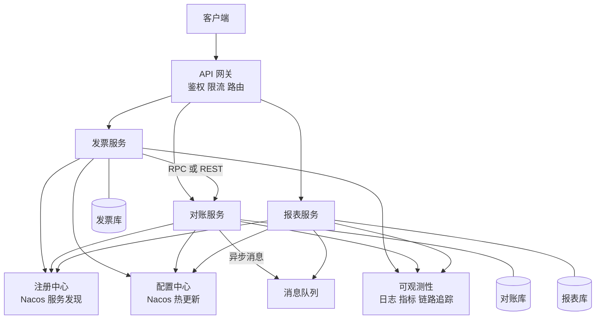

# 11 微服务架构：解决的是组织问题，不是技术问题

> 优先级：第三档（杂志级泛读）｜预计阅读时间：18 分钟
> 一句话定位：微服务的本质是用技术架构换取组织交付效率，读懂"什么时候该拆、怎么拆、拆了要交多少税"，比会搭 Spring Cloud 重要十倍。

## TL;DR

- 微服务（Microservices）解决的核心问题是**组织问题**：代码腐化互相踩踏、交付互相阻塞、技术栈锁死——单体三大病。
- 拆分边界用 DDD 的限界上下文（Bounded Context）：同一套语言与模型的一致边界，就是一个服务的候选边界。
- 共享数据库的微服务 = 披着微服务皮的分布式单体，数据私有（Database per Service）是底线。
- 拆分粒度宁粗勿细：拆细了再合并的代价，远高于粗了再拆。
- 治理全家桶（注册中心、配置中心、网关、链路追踪、熔断限流）不是选修，是微服务的入场税。
- 微服务税清单：分布式事务、运维复杂度、契约测试、网络不确定性、版本依赖地狱——团队 <10 人、边界不稳定、无专职运维，别拆。
- 2026 年的理性回调：模块化单体（Modular Monolith）回潮，微服务不是终点，是手段。

## 引子

你的财务系统现在是一个 NestJS 单体：发票、对账、报表三个模块，一个代码库、一个数据库、一条流水线。团队 4 个人，每周发一次版，相安无事。

半年后业务扩张，团队涨到 15 人、三个小组。开始出现熟悉的症状：对账组改了公共的金额计算工具函数，发票模块的舍入逻辑跟着变了，上线当天 400 万条明细的汇总金额全错；报表组想引入 ClickHouse 做分析，但升级依赖会影响所有人，吵了两个月没动；每次发版要三组协调排期，"你的功能等我测完"成了口头禅。

代码本身没有变得更难写，但**交付变得不可能**。这就是微服务要上场解决的问题——注意，问题里没有一条是"系统扛不住流量"。

## 一、拆分动因：单体三大病

单体架构（Monolith）本身没有原罪，它病在**随组织规模放大**：

1. **代码腐化，互相踩踏**：模块边界靠自觉维持，时间一长到处是跨模块直接 import、直接 join 别人的表。改 A 模块碰坏 B 模块成为日常，回归测试范围无限大。
2. **交付互相阻塞**：所有人共用一条 CI/CD 流水线和同一个发布窗口。任何一个模块的 bug 都会卡住整次发布，发布频率被最慢的团队拖死。
3. **技术栈锁死**：全系统共用一个框架版本、一套依赖。想给报表换 OLAP 引擎、想升级 Node 大版本，都要全系统陪葬式迁移，最终没人敢动。

微服务把这三个问题换成：**每个服务独立代码库、独立部署、独立技术选型**，团队围绕服务组织。对账组改自己的代码、发自己的版本、升级自己的依赖，不再需要和发票组排队协调——这才是微服务真正买到的东西。这里埋一个伏笔：康威定律（Conway's Law）说"系统的架构会长成组织的沟通结构"——所以微服务拆分本质上是在设计组织，详见第 13 篇。

**关键认知：微服务不是性能方案。** 单体做水平扩展（多实例 + 负载均衡）通常比拆微服务更能扛量。拆微服务换来的是**交付速度和组织扩展性**，而代价马上就会看到。

## 二、拆分原则（面试核心）

### 1. 用限界上下文划边界

领域驱动设计（DDD, Domain-Driven Design）里最适合拿来拆服务的概念是限界上下文（Bounded Context）：**同一套语言、同一套模型在其内部保持一致的边界**。

财务系统是最好的例子："发票"这个词，在开票域里是"一张待开具/已开具的单据，关心抬头、税号、明细行"；在税务域里是"一个申报抵扣凭证，关心税率、税额、认证状态"。同一个词、两套模型、互不相关的一致性要求——这就是两个限界上下文，未来就是两个服务。如果硬塞进一个服务，"发票"模型会被两套诉求反复拉扯，最后长成谁都不敢改的大泥球（Big Ball of Mud）。

### 2. 数据私有是底线

Database per Service：每个服务独占自己的数据库，其他服务只能通过 API 访问它的数据，**禁止跨库 join、禁止直连别人的表**。

这条必须立住：共享数据库意味着任何服务都可以绕过契约直接摸对方的内部结构，一张表被三个服务读写时，改一个字段就要三个团队开会对齐排期，服务之间的"独立部署"沦为空话——这就是**披着微服务皮的分布式单体（Distributed Monolith）**，集合了单体和微服务两者的全部缺点。判断一个微服务架构是不是假的，就看数据库：一个库 = 没拆。

### 3. 粒度：宁粗勿细

行业里有"两披萨团队"（Two-Pizza Team）的说法：一个服务的负责团队，两张披萨能喂饱（大约 6-10 人）——这是团队粒度的认知锚点，不是服务大小的硬标准。

实操判断：**宁可拆粗，不要拆细**。粗了以后再拆，是在一个边界清晰、团队自有的服务内部做切分，风险可控；拆细了想合并，要处理跨库数据合并、调用方迁移、流量切换，代价高一个数量级。新手最常见的错误就是按"一张表一个服务"拆出几十个纳米服务（Nanoservice），每个服务的维护成本超过它带来的收益。

## 三、治理组件全家桶

拆完服务，立刻需要一整套基础设施让它们能协作。下图是典型微服务架构全景：

每个组件一句话，各自详情见对应篇章：

| 组件 | 代表方案 | 解决什么问题（一句话） |
|------|----------|------------------------|
| 注册中心（Service Discovery） | Nacos（CP+AP 双模）、Eureka（AP） | 服务实例动态上下线，调用方如何找到活着的对端——选 AP，宁要旧地址不要全挂（第 10 篇） |
| 配置中心（Config Center） | Nacos、Apollo | 配置与代码解耦，支持热更新和按环境/灰度下发，改配置不用重新发版 |
| API 网关（Gateway） | Kong、APISIX、Spring Cloud Gateway | 统一入口做鉴权、限流、路由，内部服务不各自重复造（第 02 篇） |
| 远程通信 | REST/OpenFeign、RPC（Dubbo/gRPC）、消息队列 | 同步调用选型看性能与契约强度，异步解耦用消息（第 03 篇） |
| 可观测性三支柱 | ELK（日志）、Prometheus（指标）、SkyWalking/OpenTelemetry（链路） | 一次请求横跨多个服务，没有 TraceID 透传就无从排查 |
| 服务治理 | Sentinel、Resilience4j | 限流、熔断、降级在微服务语境下从选修变必修（第 02/07 篇） |

展开说两条最重要的：

**通信怎么选**：REST + OpenFeign 胜在简单通用、人类可读、调试方便，适合对外接口和低频内部调用；RPC（Dubbo/gRPC）胜在二进制序列化体积小、性能强、有强接口契约（IDL 文件即文档），适合内部高频调用，代价是调试门槛和跨语言约束；消息队列负责异步解耦和削峰填谷，代价是放弃即时结果、接受最终一致（第 03 篇详述）。判断维度就四个：调用频率、延迟要求、是否需要强契约、业务上是否允许异步。

**链路追踪（Tracing）是救命索**：单体里排查问题看一个堆栈；微服务里一次"开票"请求可能穿过网关 → 发票 → 对账 → 消息队列，出问题时你面对五个服务各自的日志。链路追踪的原理一句话：入口生成全局唯一的 TraceID，随每次调用向下透传，所有日志和 Span 都带上它，事后把同一次请求的完整路径拼出来。**没有 TraceID 透传的微服务系统等于裸奔。**

## 四、微服务税：代价清单（面试反向题核心）

微服务不是免费的升级，下面这些是新缴的税：

1. **分布式事务**：单体里一个 `@Transactional` 解决的事，拆开后变成跨服务的 Saga、TCC、最终一致性消息——复杂度高一个量级（第 10 篇详述）。
2. **运维复杂度乘 N**：10 个服务 = 10 条 CI/CD 流水线、10 套监控告警、10 份容量规划。没有成熟的 DevOps 基建，运维会先被拖死。
3. **测试复杂度**：单体里跑个集成测试起一个进程；微服务里全链路联调环境昂贵又脆弱（任何一个服务挂了全链路红），行业解法是契约测试（Consumer-Driven Contract，消费方驱动契约）：消费方声明"我需要提供方返回什么字段"，提供方的流水线持续验证不破坏这份契约，双方不需要同时在线就能各自独立测试、独立发布。
4. **网络不确定性成为日常**：超时、重试、乱序、部分失败，分布式系统八大谬误（Fallacies of Distributed Computing）每一条都会真实地咬你——第 10 篇的「分布式八大难题」清单与之同源，可对照阅读。单体里调用一个方法是纳秒级且必然成功（除非进程崩溃），网络调用是毫秒级且随时可能失败、还可能"成功了但响应丢了"——这不是量变，是两种东西，所有代码都要按"对端可能不回答"来写。
5. **版本兼容与依赖地狱**：接口升级要考虑新旧消费方并存，字段只能加不能轻易删改，一次"简单"的变更可能需要多服务协调发布顺序；客户端 SDK 版本不一致还会埋下序列化的坑。

**明确判断框架——以下三条命中任意一条，别拆：**

- 团队 < 10 人：一个服务都养不好，拆成五个只会五倍痛苦；
- 业务边界还在剧烈变动：边界没定型就拆，拆错边界的合并代价极高；
- 没有专职运维 / 没有容器化与监控基建：微服务对基建的要求是硬性的。

## 五、2026 视角：理性回调

行业对微服务的狂热已经退潮，2026 年的主流叙事是**理性回调**：

- **模块化单体（Modular Monolith）回潮**：在一个进程、一个代码库内，用强制的模块边界（独立包、显式接口、禁止跨模块引用内部实现）拿到微服务 80% 的边界收益，同时不交分布式那套税。Shopify 等大厂公开分享过这条路线。
- **"宏服务"讨论**：社区反思过度拆分，主张服务粒度向"一个业务能力一个服务"回归，而非越细越好。
- **经典案例**：亚马逊 Prime Video 的一个团队曾公开分享，将其音视频监控服务从 Step Functions/Lambda 的 serverless 分布式组件合并为单进程服务，成本降约 90%、扩展性反而更好——常被引用来提醒：微服务有真实且昂贵的运行成本。

记住收束句：**微服务不是架构的终点，是组织交付遇到瓶颈时才动用的手段。**

## 面试视角

**Q1：什么时候该拆微服务？**
考察点：是否理解微服务解决组织问题而非性能问题。
骨架：先说单体三大病（腐化/阻塞/锁死）→ 给拆的触发信号（团队规模、发布互相阻塞、边界已稳定）→ 给不拆的判断框架（<10 人、边界不稳、无运维基建）→ 补一句"能用模块化单体解决就先不拆"。

**Q2：怎么拆？**
考察点：DDD 落地能力。
骨架：限界上下文划边界 → 同一词语在不同域含义不同就是边界信号（举发票的例子）→ 数据私有是底线 → 粒度宁粗勿细 → 拆分时优先拆"变化频率不同、团队归属不同"的模块。
追问连招：
- "共享数据库行不行？" → 不行，那是分布式单体；过渡期可以共库但 Schema 按域隔离，长期必须物理分离。
- "拆细了怎么办？" → 合并代价远大于再拆，所以起步粒度偏粗。

**Q3：微服务带来哪些问题？**
考察点：是否缴过/知道要缴微服务税。
骨架：分布式事务 → 运维与测试复杂度（契约测试）→ 网络不确定性 → 版本兼容 → 每条配一个解法关键词（Saga、CDC 测试、链路追踪、接口版本化）。

**Q4：服务之间怎么通信？**
考察点：同步/异步选型 trade-off。
骨架：同步里 REST/OpenFeign（通用简单）vs RPC（性能+强契约）→ 异步用消息队列（解耦、削峰，接受最终一致）→ 选型维度：频率、延迟、契约强度、是否可异步。

## 常见误区

- **以为微服务是性能方案**。它是组织与交付方案。单体的性能问题靠水平扩展和缓存解决，拆微服务反而引入网络开销，单次请求通常更慢。
- **以为拆了就更稳定**。恰恰相反：故障域变多，任何一次跨服务调用都可能超时或失败，没有熔断降级和链路追踪的 microservice 系统比单体更脆。稳定性是治理组件换来的，不是拆分送的。
- **以为共享数据库无所谓**。共享库意味着隐式耦合和 Schema 变更的全局影响，"独立部署"名存实亡——这是分布式单体，所有代价照付、收益全无。
- **以为服务拆得越细越"微"越先进**。粒度匹配团队与业务能力才是正解，纳米服务是反模式。
- **以为上了 Spring Cloud / Dubbo 就是微服务**。框架只是工具，边界划分、数据私有、团队组织才是本体。

## 与我的财务系统的关联

直接说结论：**你现在的系统应该保持模块化单体，并且这正是你面试里最好的架构演进故事线。**

落地点：

1. **NestJS 的 Module 天然是模块边界**：发票、对账、报表三个 Module，强制它们只能通过各自导出的 Service 交互，禁止跨模块 import 内部实现——这就是模块化单体的纪律，也是未来三个服务的候选边界。
2. **现在共库没关系，但表设计按域隔离**：发票的表、对账的表、报表的表各自独立 Schema/前缀，不跨域 join（报表需要跨域数据就走对账模块的接口或离线同步）。这一步几乎零成本，却把"未来拆库"的代价从几个月降到几天。
3. **现在的判断**：团队 4 人、业务边界还在演化、无专职运维——三条"别拆"全中。400 万明细的性能压力，用索引、分区、读写分离、缓存解决，和拆服务无关。
4. **面试故事线**：当面试官问"你怎么考虑架构演进"，你的回答是——"我先按 DDD 限界上下文把模块边界和数据隔离做好，跑模块化单体；等团队规模上来、交付开始互相阻塞、边界稳定之后，再沿既有边界把模块提升为服务。"这句话同时覆盖第 11 篇和第 13 篇，比任何"我会搭 Spring Cloud"都值钱。

## 小结

微服务的本质是用分布式的技术复杂度，换取组织的交付效率：拆分的依据是 DDD 限界上下文，底线是数据私有，粒度宁粗勿细；拆完必须缴一整套治理税——注册中心、配置中心、网关、链路追踪、契约测试，缺一不可。2026 年的理性共识是：能用模块化单体解决的组织问题，不要急着付分布式的账单；微服务是手段，不是勋章。

## 延伸阅读

- 《Building Microservices》（Sam Newman，《微服务设计》）
- 《Monolith First》（Martin Fowler 博客文章）
- 《Domain-Driven Design》（Eric Evans，DDD 蓝皮书）
- 《Microservices Patterns》（Chris Richardson）
- 亚马逊 Prime Video 团队的官方技术博客文章《Scaling up the Prime Video audio/video monitoring service and reducing costs by 90%》
