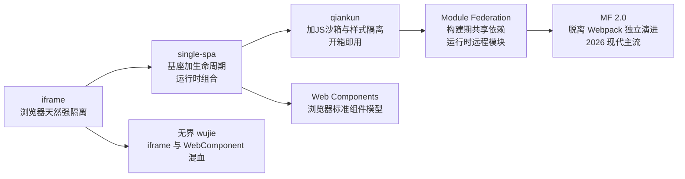
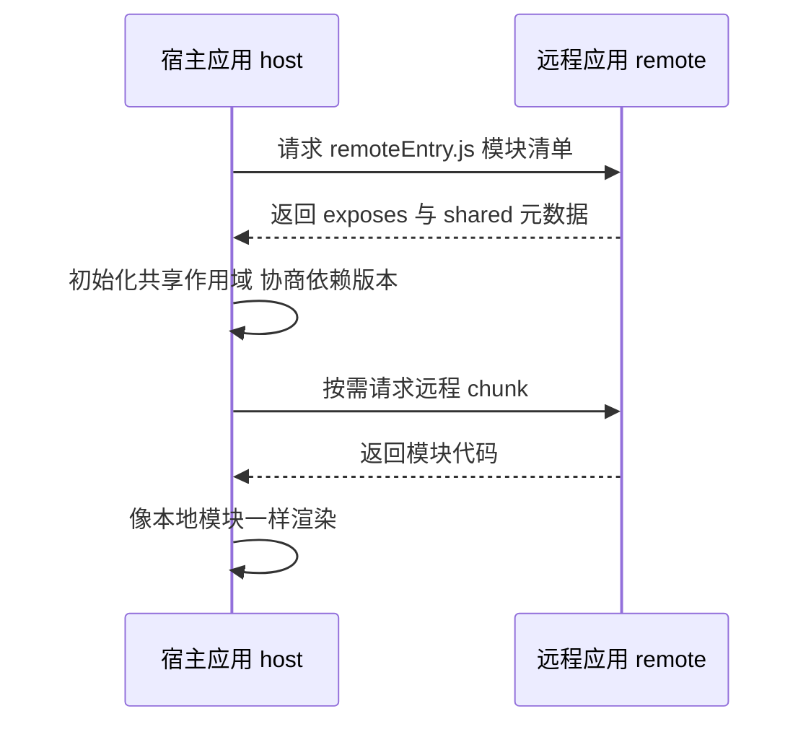

# 12 微前端：把"独立开发、独立部署"搬进浏览器

> **优先级档位**：第二档（全手册唯一的前端主场篇。你的财务项目用不上它，但中厂中后台岗面试常问——qiankun 存量系统遍地都是，能讲清原理就是差异化竞争力）
> **预计阅读时间**：约 30 分钟
> **一句话定位**：微前端（Micro Frontends）解决的不是性能问题，而是"多个团队在同一坨前端代码上互不踩踏"的组织与工程问题——看懂它，你就看懂了巨石中后台的拆分解法，也看懂了 2026 年为什么新项目都选模块联邦。

## TL;DR

- 微前端的本质：把微服务"独立开发、独立部署"的思想搬到前端，一个页面由多个团队的子应用在运行时或构建时拼装而成。
- 它的主战场只有一个：**多团队维护的巨石前端（Monolith Frontend）**——互相阻塞发布、技术栈绑架、构建变慢。单人小项目上微前端是纯负资产。
- 方案谱系从老到新：iframe → single-spa（运行时组合）→ qiankun（single-spa 加沙箱）→ Module Federation（构建期共享加运行时远程模块，2026 年现代主流）；Web Components 是标准派，无界（wujie）是 iframe 混血。
- qiankun 已进入维护期、不再主动演进，但存量巨大；面试要讲的是它的沙箱原理，不是 API 用法。
- 三大技术难题：JS 隔离（快照沙箱 vs 代理沙箱）、样式隔离（Shadow DOM 最彻底但有弹窗穿透问题）、应用间通信（越少越好，通信密集说明拆错了）。
- 公共依赖治理是事故高发区：React 必须共享为单例，shared 配置不当会让 hooks 直接抛 Invalid hook call。
- 微前端 vs 微服务：前端拆的是**构建与团队边界**，后端拆的是**数据与可用性边界**——两者是独立决策，谁也不依赖谁。
- 2026 选型标准答案：新项目 Module Federation 2.0，存量 qiankun 继续维护，强隔离场景（支付、三方嵌入）iframe 依然是正解。

## 引子：八个团队，一个仓库，每周四的发布地狱

想象你跳槽进了一家保险集团的中台部门，接手一个运营了八年的中后台系统：React 16 主体、角落里嵌着一块没人敢动的 AngularJS 老模块、40 多个菜单、8 个业务团队共用同一个 git 仓库和同一套 CI。

然后你体验到这个系统的三大日常：

- **发布互相阻塞**：每周四是唯一发布窗口，8 个团队的 PR 全挤在这一天合并。周三晚上发现保费计算模块有个 bug，修复完重新排队，整个发布列车（Release Train）等它到凌晨——你一个改文案的需求，陪跑了一次全量回归。
- **技术栈绑架**：那块 AngularJS 模块承载着核保核心流程，原作者早离职了。团队想整体升级 React 18？先要回答"核保模块怎么办"，答案是"没人敢动，动了没人能测"。于是全站被最老的那块代码钉死在旧版本上。
- **构建越来越慢**：代码量逼近 200 万行，冷启动 dev server 要两分钟，CI 一次完整构建加测试跑 40 分钟，热更新经常卡死。你改一行样式，等待的每一秒都在烧钱。

注意：这三个病里没有一个是"页面慢"。**巨石前端的病是组织病和工程病，不是运行时性能病**——这是理解微前端的第一把钥匙。微前端（Micro Frontends，ThoughtWorks 于 2016 年技术雷达提出）就是给这个病开的药方：把巨石拆成若干独立开发、独立部署、独立运行的子应用，浏览器里再拼装成一个整体。

先立判断，免得你学完到处乱用：**微前端的适用主战场是多团队、多业务域、历史包袱重的巨石中后台**。判断维度就三条：同一前端仓库上是否有 3 个以上团队并行开发？发布是否频繁互相阻塞？是否存在技术栈异构或不敢动的遗留模块？三条中两条以上才值得考虑。三条全不中的项目（比如你的财务系统）上微前端，是把解药当补品吃——付出基座、契约、沙箱的全套复杂度，换来的团队解耦收益为零。

## 一、方案谱系：从 iframe 到模块联邦

微前端不是某一个框架，而是一条演进二十年的方案谱系。先看全景，再逐个拆。

### 1.1 iframe：最古老，也最坚挺

iframe 是最早的"微前端"：每个子系统一个页面，门户用 iframe 嵌进来就完事。它的隔离能力是浏览器白送的——独立的文档、独立的 window、独立的样式作用域，JS 互不可见，想污染都污染不了。

但体验硬伤同样出名：

- **弹窗与遮罩穿透**：子应用里的 Modal 只能在 iframe 自己的矩形里居中，遮罩盖不住整个页面，对话框永远"缺一角"；
- **路由不同步**：iframe 里的跳转不进浏览器历史，刷新回首页、前进后退错乱，深链接（deeplink）基本残废；
- **通信繁琐**：跨上下文只能靠 postMessage 异步消息，没有类型、没有 Promise 语义，写起来像跨进程调用；
- **性能开销**：每个 iframe 是一份完整文档和 JS 运行时，内存与首屏都贵。

那它为什么 2026 年还活着？因为**强隔离本身就是刚需**：支付收银台要满足合规对第三方脚本的隔离要求，Stripe、微信支付的收银台至今是 iframe；客服 widget、统计 SDK 这类第三方嵌入，你不能信任对方代码，也不敢让对方信任你——iframe 是唯一"物理隔离"的选项。结论：iframe 没过时，它只是退守到"不信任、不集成、只嵌入"的场景里做正解。

### 1.2 single-spa：基座加生命周期，运行时组合的起点

single-spa 定义了现代微前端的基本范式：**基座应用（Shell/主应用）**负责路由分发和布局，**子应用（Micro App）**暴露三个生命周期函数——bootstrap（初始化一次）、mount（挂载渲染）、unmount（卸载清理）。路由匹配到哪个前缀，基座就挂载哪个子应用，离开就卸载。

这是**运行时组合**：子应用独立打包成 JS 产物（通常是 UMD），部署在各自的 CDN，基座在浏览器里动态拉取、执行、挂载。每个子应用可以用不同框架，发布互不影响——巨石前端"发布阻塞"的病到这一步就治好了。

single-spa 本身刻意做薄：它只管挂载，不管隔离。JS 全局污染、样式冲突、依赖重复，都要你自己想办法。这个"留白"直接催生了 qiankun。

### 1.3 qiankun：single-spa 的工程化封装，存量之王

qiankun（乾坤）是蚂蚁集团在 single-spa 之上封装的微前端框架，补上了三块短板：**JS 沙箱**（子应用全局副作用隔离）、**样式隔离**、**HTML Entry 加载器**（import-html-entry，直接以 HTML 为入口解析子应用资源，不用改造成 UMD 库）。加上中文文档和"注册即用"的 API，它成了 2019 年后国内中后台微前端改造的事实标准，阿里系和无数中厂中后台都是存量用户。

**2026 年现状必须说准**：qiankun 已进入维护期，官方不再主动演进新特性，只做缺陷修复。但这不代表它死了——存量系统巨大，你跳槽遇到的巨石中后台，很大概率跑在 qiankun 上。所以面试考察的重点不是"你会不会 registerMicroApps"，而是"你能不能说清它的沙箱是怎么实现的"（详见第二节）。

### 1.4 Module Federation：构建工具原生能力，2026 的现代主流

模块联邦（Module Federation，MF）是 Webpack 5（2020 年）引入的原生能力，思路完全不同：**不做运行时基座，而是让构建产物之间互相引用**。每个应用构建时产出一个 remoteEntry.js（远程入口清单），声明"我对外暴露哪些模块（exposes）"和"我需要哪些共享依赖（shared）"；宿主应用（host）在运行时先拉取远程的 remoteEntry.js，再按需加载对应的 chunk，把远程模块像本地 import 一样用。

它有两个颠覆性特征：

- **去中心化**：没有基座概念，任何应用可以同时是宿主和远程，应用互为积木。导航壳、订单页、报表页可以两两互相引用，不必套一个"主应用"的外壳；
- **构建期共享依赖**：shared 机制在构建和运行时协商依赖版本，react、antd 这类库只加载一份，从机制上解决"每个子应用打包一份 React"的浪费。

MF 2.0 由 Module Federation 团队独立演进，已脱离 Webpack 绑定——Rspack 原生内置，Vite 有社区插件，还补上了运行时类型提示、调试工具链。2026 年，**新项目中后台的微前端默认答案就是 MF 2.0**，这也是本篇允许你打满前端功力的主场：它的全部魔法都发生在构建机制层面。

把 MF 的运行时拆开看，就是你熟悉的 chunk 加载机制的延伸：

关键在第三步：宿主启动时先建立**共享作用域（Shared Scope）**，把自己已有的 react、antd 版本注册进去；每个 remoteEntry 加载时也会声明"我能提供什么、我需要什么"。MF 的运行时按 semver 范围做协商——已有版本能满足就不重复加载，满足不了才拉远程自带的兜底副本。远程 chunk 走的还是 Webpack 标准的 `__webpack_chunk_load__` 那套 JSONP/运行时管道，只是 chunk 的 URL 指向了另一个应用的 CDN 域名。所以你可以精确地向面试官描述：**MF 没有引入新的"框架运行时"，它是把多个构建产物的模块图（Module Graph）在浏览器里拼接成一张图**。

### 1.5 Web Components 与无界：标准派和混血派

**Web Components** 是浏览器原生的组件模型：Custom Elements 自定义标签加 Shadow DOM 样式隔离，任何框架都能渲染一个 `<report-widget>`。它是标准派——不依赖任何框架和构建工具，理论上最长寿。代价是生态薄、封装单元偏小（组件级而非应用级），用它拆整个应用等于自己造框架，所以更适合"微件化"：跨团队共享的独立小组件。

**无界（wujie）**是腾讯出品的混血方案：用 iframe 做 JS 隔离（白嫖浏览器最强的沙箱），用 WebComponent 承载 DOM 渲染（绕开 iframe 的弹窗和路由硬伤），通信做了代理封装。一句话记住它的定位：想要 iframe 的隔离又不想要 iframe 的体验。

### 1.6 方案对比总表

| 方案 | 原理 | 优点 | 代价 | 适用场景 |
| --- | --- | --- | --- | --- |
| iframe | 浏览器文档级隔离，postMessage 通信 | 隔离最彻底、零改造成本、技术栈完全自由 | 弹窗遮罩穿透难、路由不同步、通信繁琐、内存开销大 | 支付收银台、第三方嵌入、只嵌不改的遗留系统 |
| single-spa | 基座按路由分发，管理子应用生命周期 | 框架无关、运行时组合、生态标准、概念清晰 | 只管挂载不管隔离，沙箱样式依赖治理要自己补 | 想掌控底层机制的团队；理解 qiankun 的必经之路 |
| qiankun | single-spa 封装加 JS 沙箱加样式隔离 | 开箱即用、中文生态、异构技术栈友好、存量巨大 | 已进入维护期、沙箱有性能损耗、存在沙箱逃逸边角 | 存量巨石中后台改造、多团队多技术栈并存 |
| Module Federation | 构建期声明 exposes/shared，运行时加载 remoteEntry 与远程 chunk | 去中心化、依赖共享精细、构建工具原生集成、无基座开销 | 要求统一构建体系、shared 配置复杂、样式隔离弱 | 新项目、React 系同构技术栈、monorepo 工程体系 |
| Web Components | Custom Elements 加 Shadow DOM 浏览器标准 | 标准不过时、框架完全无关、Shadow 样式隔离原生 | 生态薄、应用级拆分要自己造轮子、弹窗外溢问题 | 微件化小组件、跨技术栈组件库 |
| 无界 wujie | iframe 隔离 JS 加 WebComponent 承载 DOM | 隔离强且体验好于 iframe、接入成本低 | 相对小众、原理复杂带来调试成本 | 想要 iframe 级隔离的业务中后台 |

## 二、三大核心技术难题：沙箱、样式、通信

微前端框架的复杂度 80% 集中在这三件事上，也是面试深挖的主战场。逐个讲清原理与取舍。

### 2.1 JS 隔离：沙箱（Sandbox）的两代演进

问题本身很简单：子应用 A 在 window 上挂了全局变量、改写了 Array.prototype、注册了一堆事件监听，卸载之后这些副作用还留在页面上，子应用 B 一运行就踩雷。沙箱的目标就是：**子应用的全局副作用，挂载时生效、卸载时还原，且多个子应用互不串扰**。qiankun 的两代沙箱正好展示了思路演进：

**快照沙箱（Snapshot Sandbox）**：mount 时遍历整个 window 拍一张"快照"，unmount 时再遍历一遍做 diff，把子应用改过的属性还原回去、新增的属性删掉。优点是兼容性好（不依赖 Proxy，IE 都能跑）；缺点是**全量遍历 window 性能差**，而且同一时刻只能有一个子应用激活——因为快照的对象就是真 window，两个应用同时跑必然互相覆盖。单实例沙箱。

**代理沙箱（Proxy Sandbox）**：不再碰真 window，而是用 ES6 Proxy 给每个子应用造一个 fakeWindow：子应用读全局时，先查自己的假 window 再兜底查真 window；写全局时，只写进自己的假 window。天然多实例——每个应用一个代理，互不干扰；也不用全量遍历，性能更好。代价是 Proxy 无法 polyfill，老浏览器直接出局。

qiankun 的实际演进路径是从快照沙箱起步，到以代理沙箱（LegacySandbox 打补丁、ProxySandbox 多实例）为主——**演进逻辑就是"从兼容优先到隔离正确性优先"**。这句话在面试里很值钱。

最后提一句边角：沙箱不是安全边界。`new Function`、逃逸出的原生 DOM 事件、document 上的全局副作用都可能穿透沙箱；沙箱防的是"无意的工程污染"，防不了"有意的恶意代码"——恶意代码隔离请回到 iframe。

### 2.2 样式隔离：从约定到 Shadow DOM

CSS 没有模块系统，类名是全局的，两个团队都写 `.container` 就互相污染。方案从轻到重排一排：

| 方案 | 原理 | 优点 | 代价 | 适用场景 |
| --- | --- | --- | --- | --- |
| BEM 命名约定 | 人工前缀，如 inv__table--active | 零工具成本 | 防君子不防小人，三方库管不住 | 单团队、纪律好的小项目 |
| CSS Modules | 构建期把类名 hash 化 | 彻底防冲突、工程化成熟 | 只管自己的代码，管不住子应用全局样式 | 应用内部样式（你现在就该用的） |
| Scoped CSS | 编译期给选择器加属性作用域（Vue 风格） | 无侵入、开发体验好 | 深度选择器、三方库穿透仍是坑 | Vue 体系应用内部 |
| 动态样式表卸载 | 子应用 mount 时插入 style 标签，unmount 时拔除（qiankun 做法） | 防"卸载后残留"，实现简单 | 只能防冲突，运行期并存时仍可能互相覆盖 | qiankun 默认能力，多应用交替挂载场景 |
| Shadow DOM | 浏览器原生样式边界，内外选择器互不可达 | 隔离最彻底 | **第三方库弹窗问题**：antd Modal 默认挂到 body 上，逃出 Shadow 边界后丢样式；事件 retarget 也会让部分库失灵 | 自研组件、样式洁癖场景（qiankun strictStyleIsolation 即此） |

经验判断：**应用内部用 CSS Modules 打底，应用之间靠动态样式表卸载兜底，Shadow DOM 只在确认第三方库兼容后再开**。qiankun 的 experimentalStyleIsolation（自动加属性前缀）是中间档，隔离强度不如 Shadow DOM 但兼容性更好。

### 2.3 应用间通信：越少越好

隔离做好了，通信就是下一个问题。手段从轻到重：

1. **props 下发**：基座挂载子应用时传初始化数据（用户信息、主题、权限），最简单，单向、可预测，能用 props 就别用别的；
2. **CustomEvent**：浏览器原生自定义事件，跨框架零依赖，适合低频通知（" token 过期了，各应用自己跳登录"）；
3. **全局状态总线**：发布订阅模式的全局 store（qiankun 的 initGlobalState、MF 里共享一个 zustand/redux 实例），适合真正需要跨应用同步的状态（当前租户、全局筛选条件）。

记住一条原则，它既是工程经验也是面试加分句：**通信越少越好；如果两个子应用之间需要大量通信，说明拆分边界画错了——它们本来就是一个应用。**这和微服务里"分布式单体"的诊断一模一样：拆分的收益是解耦，通信密集就是还没解开。

## 三、公共依赖治理：微前端的事故高发区

巨石拆成 N 个应用，如果每个都打包一份 React、一份 antd、一份 dayjs，首屏加载量直接翻 N 倍——拆了个寂寞。公共依赖治理就是解决"共享一份"的问题，而它的坑足以写一本事故集。

**共享机制三条路**：一是 externals 加 CDN，各应用构建时把 react 标记为外部依赖，运行时从公共 CDN 取同一个文件；二是 qiankun 里基座持有公共依赖、子应用外部化；三是 MF 的 shared 机制——最精细，构建时声明共享包及版本范围，运行时宿主与各远程在共享作用域（Shared Scope）里协商：谁的版本满足所有人的语义化版本（semver）范围就用谁的，只加载一份，不满足的再各自加载自己的兜底副本。

**版本冲突的经典事故**（面试可以直接讲这两个）：

- **React 双实例**：MF 里 react 没配 `singleton: true`，宿主和远程各加载一份 React，子应用一渲染就抛 Invalid hook call——因为 hooks 依赖"当前渲染器"这个模块级单例，两份 React 就是两个世界。解法：react、react-dom 永远 singleton，版本不一致就强制对齐；
- **dayjs/lodash 双份**：不是单例问题而是 instanceof 与缓存问题——A 应用 new 的 dayjs 对象传给 B 应用，B 的插件不认；两边各自打的 locale、plugin 互不生效。解法：纳入 shared 并收窄版本范围。

一句话总结判断维度：**有模块级状态、有 hooks/上下文语义的库（react、react-dom、react-router、状态库）必须 singleton；纯工具库可以放宽版本协商；UI 组件库看主题一致性要求决定是否 singleton**。

## 四、工程化配套：框架之外的隐性成本

微前端 20% 是框架，80% 是工程配套。上之前先过这份清单：

- **仓库结构**：独立仓库（解耦最彻底，但跨仓库联调痛苦）vs monorepo（pnpm workspace 加 MF 是 2026 年常见组合，共享配置和联调体验好）。判断维度：团队间代码协作频率高选 monorepo，组织上本来就各自为政选独立仓库；
- **独立 CI/CD**：微前端的核心理由就是子应用独立发布——基座不重发、别的子应用不受影响。做不到独立部署，微前端就只剩复杂度没有收益；
- **基座与子应用的契约**：生命周期函数名、路由前缀划分（哪个前缀归哪个应用）、权限与菜单的下发协议、埋点与监控约定——这些是"组织接口"，比代码接口更容易出乱子；
- **公共组件库**：UI 组件走 npm 包版本化分发，而不是运行时共享——这正好呼应你的组件库经验：组件库是构建期依赖，语义化版本加 changelog 治理，别塞进 shared 里搞运行时共享，否则一次有问题的发布全站UI同时崩。

## 五、微前端 vs 微服务：两种"拆"的对照

面试必问题"微前端和微服务什么关系"，一张表说清：

| 维度 | 微前端 | 微服务 |
| --- | --- | --- |
| 拆的对象 | 构建产物与团队边界 | 数据与可用性边界 |
| 独立部署的收益 | 团队互不阻塞发布 | 故障隔离、独立扩容、独立技术选型 |
| 隔离什么 | JS 运行时、样式、路由 | 进程、数据库、网络 |
| 通信方式 | props/事件/共享状态，进程内调用 | RPC/消息队列，跨网络、有失败语义 |
| 失败的影响面 | 一个子应用白屏或报错，页面缺一块 | 一个服务不可用，引发熔断、降级、数据一致性问题 |
| 治理重点 | 依赖共享、样式冲突、契约与发布协议 | 服务发现、熔断限流、分布式事务、可观测性 |

两行收束：**前端拆的是构建与团队边界，后端拆的是数据与可用性边界**。微前端的收益几乎全是组织效率，微服务的收益里才有真正的可用性——这就是为什么微前端出现在《高并发高可用手册》里却排在第二档：它是"架构演进"的认知一环，不是可用性手段。两者也是独立决策：单体后端完全可以支撑微前端，反过来，巨石前端后面也可以是微服务集群，中间的连接点是 BFF 层。

## 面试视角

**Q1：你们为什么用微前端？**

考察点：你是不是把微前端当技术时髦。错误答案是"技术先进""大公司都用"。正确骨架：

- 先答组织动因：N 个团队共用一个巨石仓库，发布互相阻塞、构建 40 分钟，拆成独立子应用后各自发布；
- 再答历史包袱：存在 AngularJS 遗留模块没人敢动，用微前端把它包起来隔离运行，新模块用新栈；
- 最后给边界判断：小团队、单技术栈、发布不打架的项目不上，上了是负资产。

**Q2：qiankun 的沙箱原理？**

考察点：用没用过不重要，懂不懂原理才重要。回答骨架：

- 问题定义：隔离子应用对 window 的读写副作用，卸载可还原、多应用不串扰；
- 快照沙箱：遍历 window 打快照，diff 还原，兼容好但性能差、单实例；
- 代理沙箱：Proxy 代理 window 造 fakeWindow，读写分流，多实例、性能好，不兼容无 Proxy 的老浏览器；
- 补一句演进逻辑：从"兼容优先"到"隔离正确性优先"；再补一句沙箱非安全边界，恶意代码要用 iframe。

**Q3：Module Federation 和 qiankun 怎么选？（2026 标准答案）**

- 新项目：MF 2.0——构建工具原生、去中心化、依赖共享精细、活跃演进；前提是全站能统一构建体系（Rspack/Webpack/Vite）和技术栈（React 系）；
- 存量 qiankun 系统：继续维护，不折腾重写——qiankun 虽在维护期但稳定，异构技术栈（AngularJS 加 React 加 Vue）场景 MF 反而使不上力；
- 判断维度一句话：**技术栈是否同构、构建体系能否统一、是新建还是改造**。

**Q4：样式隔离有哪些方案？**

按第二节 2.2 的表从轻到重背一遍，重点讲 Shadow DOM 的第三方库弹窗外溢问题，以及 qiankun 动态样式表卸载"防残留不防并存冲突"的边界。

**经典追问连招**：微前端解决了什么 → 那为什么不直接用 iframe（体验三硬伤）→ qiankun 怎么隔离 JS（两代沙箱）→ Proxy 沙箱具体怎么分流读写（fakeWindow）→ MF 怎么避免 React 重复加载（shared 加 singleton 加 semver 协商）→ singleton 配错了会怎样（Invalid hook call，双 React 实例）→ 微前端和微服务什么关系（拆的边界不同，独立决策）。

## 常见误区

- **以为微前端是性能优化手段**。恰恰相反：基座加载协议、沙箱开销、依赖协商都可能让首屏更慢。它是组织与工程手段，性能优化要找的是代码分割、懒加载、缓存——这些单体前端照样能做。
- **以为拆得越细越好**。每多一个子应用就多一套仓库、流水线、契约和运行时开销，应用间通信成本指数上升。拆分粒度跟着"团队边界"走，不跟着"页面数量"走。
- **以为 iframe 过时了**。支付收银台、第三方嵌入、不可信代码隔离——强隔离场景 iframe 至今是正解，无界的走红恰恰说明 iframe 的隔离能力仍是稀缺资源。
- **以为微前端必须搭配微服务后端**。两者是独立决策：微前端管构建与团队边界，微服务管数据与可用性边界，单体后端加微前端是完全合理的组合。
- **以为上了 MF 就自动共享依赖**。shared 不配 singleton、版本范围不收窄，React 双实例、dayjs 双份的坑一个都躲不掉——MF 给的是机制，治理还是人来做。

## 与我的财务系统的关联

先说结论：**你的财务中后台是单人全栈新项目，微前端对你现阶段是负资产，正确解是模块化单体前端（Modular Monolith）**。

对照第一节的三条判断维度逐条验证：同一仓库上的团队数是 1（你全栈），发布阻塞不存在；技术栈是统一的 React 加 TypeScript，没有遗留模块；构建速度有 Vite/Rsbuild 加按需编译，200 个路由以内完全撑得住。三条全不中。此时上微前端，你得到的是：多维护一个基座应用、多 N 个仓库和流水线、多一套沙箱与契约治理——换来的团队解耦收益是零。

你该做的是把"拆分思想"用在构建期而不是运行时：

- **按业务域分目录**：`modules/invoice`、`modules/reconciliation`、`modules/report` 各自内聚页面、组件、hooks、api 层，跨域引用走显式的公共层——这就是"模块边界"，只是不拆运行时；
- **路由级懒加载**：React.lazy 加 Suspense 按业务域切 chunk，报表域的 echarts 只在进报表时加载，首屏只背登录加发票；
- **组件库沉淀**：发票表格、金额格式化、对账差异高亮这些跨域组件抽成内部组件库——这是你的工程资产，也是面试能讲的"公共依赖治理"的前哨站。

但别把这页撕掉，它有两个真实用途：

**用途一：面试谈资武器**。你跳槽的目标是中厂全栈偏前端岗，而中厂中后台（保险、银行、大集团 ERP）恰恰是 qiankun 存量系统的重灾区。面试官抛"微前端"题时，你能从组织动因讲到两代沙箱再讲到 MF 的 shared scope 协商——这对一个"3 年经验"候选人来说是超档表现。

**用途二：入职存量系统的快速上手指南**。如果你入职发现接手的是 qiankun 存量巨石中后台，第一周按这个顺序看懂它：

1. 找基座的 `registerMicroApps` 配置：子应用清单、activeRule 路由前缀、entry 指向哪——一张图画出全站应用拓扑；
2. 看子应用打包配置：output 的 library/umd 格式、publicPath 动态注入方式，搞清"子应用的 JS 是怎么被基座加载的"；
3. 摸清沙箱与样式隔离开关：sandbox 配的是 proxy 还是 snapshot、strictStyleIsolation/experimentalStyleIsolation 开没开——决定了样式冲突的历史债有多少；
4. 画出通信拓扑：谁在调 initGlobalState、props 下发了什么、有没有野生的 window 全局变量传值——通信密集的地方就是拆分画错的地方，也是未来重构的候选；
5. 跑通一次子应用独立发布全流程：从提 PR 到 CDN 上线，搞清基座是否需要重发——这决定了你在这个团队的真实开发节奏。

## 小结

微前端是微服务思想在前端的投影，但投影的不是"高可用"，而是"组织解耦"：它把巨石前端拆成独立开发、独立部署的子应用，治好的是多团队互相阻塞、技术栈绑架、构建变慢这三样组织病。方案谱系上，iframe 退守强隔离场景，qiankun 守着巨大存量进入维护期，Module Federation 2.0 凭构建期共享与去中心化成为 2026 年新项目的默认答案；技术上，JS 沙箱、样式隔离、通信治理、依赖共享是它的四座山头，也是面试的四个深挖点。对你个人：财务系统继续走模块化单体，把懒加载和组件库做好；把微前端装进认知武器库，留给面试和未来的巨石中后台。

## 延伸阅读

- Cam Jackson，《Micro Frontends》（martinfowler.com 长文，概念定义之源）
- ThoughtWorks 技术雷达（Technology Radar）"Micro frontends"条目历年评级变化
- single-spa 官方文档（生命周期与基座范式）
- qiankun 官方文档及源码（沙箱实现部分）
- Module Federation 官方文档（module-federation.io，MF 2.0 与 shared 机制）
- Michael Geers，《Micro Frontends in Action》
- Webpack 官方文档 Module Federation 章节（remoteEntry 与共享作用域机制）
