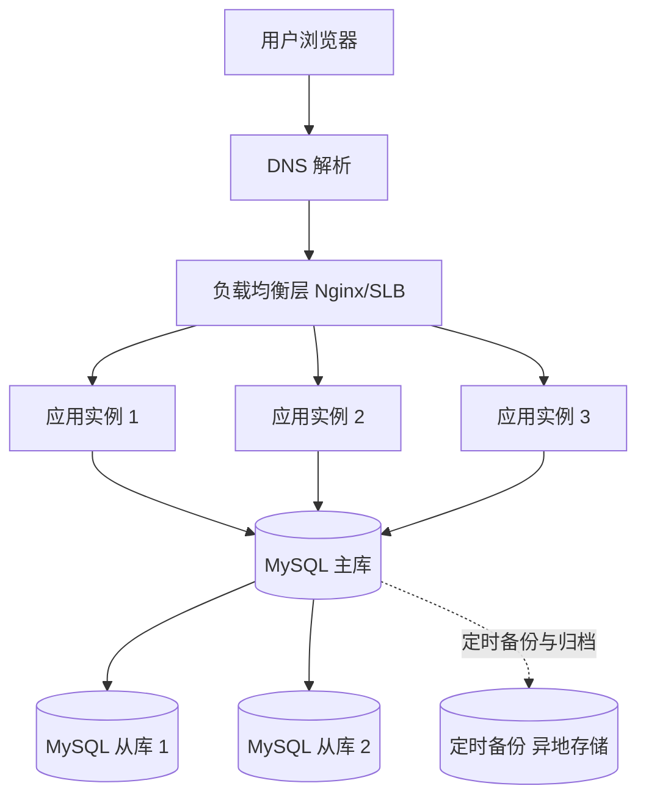
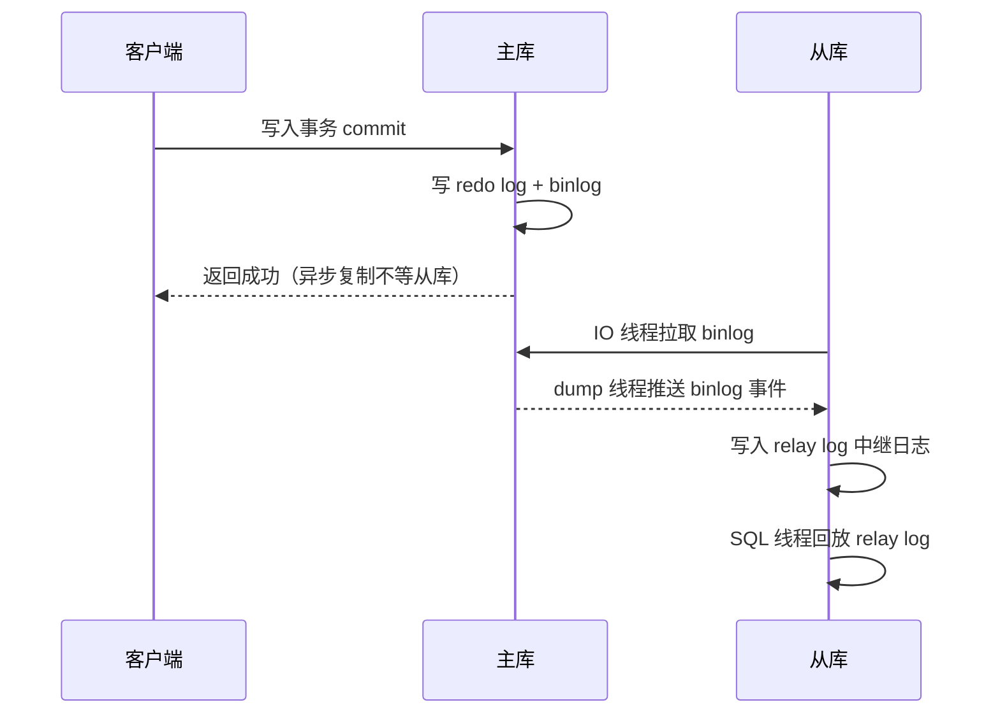
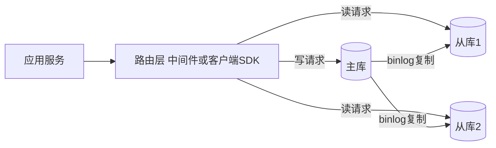
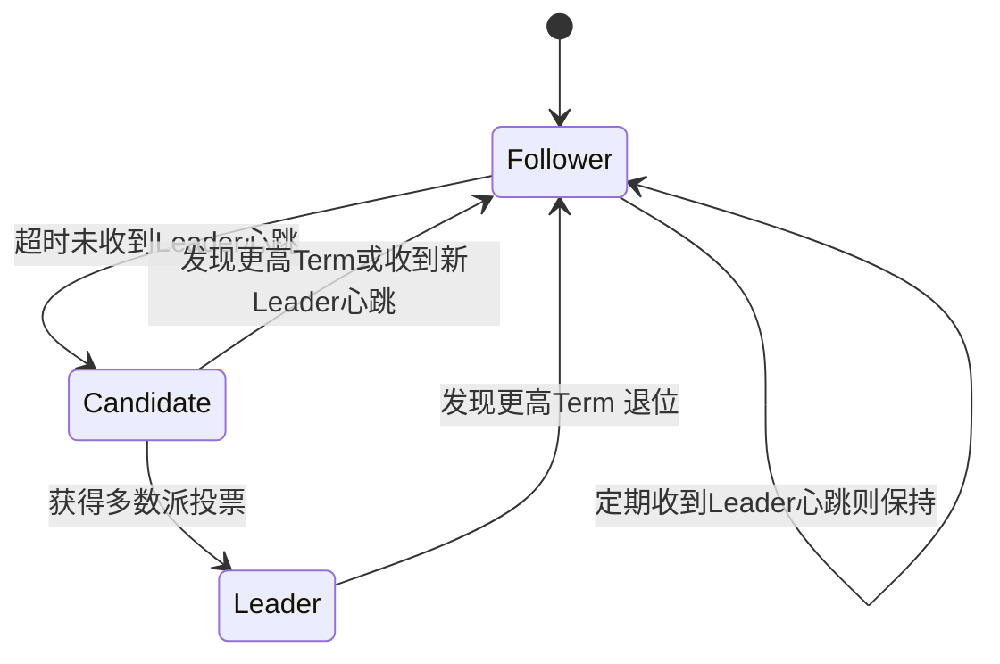

# 06 冗余设计：没有单点，才有高可用

> 优先级：第二档（主从/读写分离讲清延迟坑即可）｜预计阅读：18 分钟
> 一句话定位：高可用的一切手段都是冗余的排列组合——看懂主从复制，就看懂了高可用的半壁江山。

## TL;DR

- 高可用（High Availability）的第一性原理只有一句话：**消除单点故障（Single Point of Failure, SPOF）**。方法不是背方案，而是沿请求链路逐层"狩猎"单点。
- 冗余只有两种形态：**无状态服务做同构多副本**（配合负载均衡），**有状态存储做主从复制**（Replication）。本篇的重点是后者。
- MySQL 复制的本质是 **binlog 的搬运与回放**。复制方式分三档：异步（默认，快但有丢数据窗口）、半同步（Semi-sync，至少一个从库确认）、组复制 MGR（Paxos 系，强一致但贵）。选哪档取决于你能容忍多大的 RPO。
- 读写分离不是免费的午餐：**复制延迟（Replication Lag）**会导致"写完立刻读不到"。四种解法——强制读主、半同步、GTID 等待、延迟监控降级——按业务关键路径分级使用，而不是全站一刀切。
- 自动故障切换的两代方案：Redis 哨兵（Sentinel）管"主从 + 自动切换"，Redis Cluster 管"分片 + 自动切换"；切换最大的坑是**脑裂（Split-Brain）**，解法是 fencing 与多数派。
- 共识算法（Consensus）不用怕：Raft 只需记住三要素——Leader 唯一写入口、Term 防过期 Leader、Quorum 多数派提交即安全。etcd、ZooKeeper（ZAB）、TiKV 都是这一系。
- 有从库 ≠ 高可用。异步复制下主库宕机，**没同步完的那部分数据就是丢了**，财务系统里这意味着丢凭证。

## 引子

你的财务系统上线半年，一切平静。某个周二上午 10 点，RDS 主库所在物理机故障，数据库瞬间不可用。运维手忙脚乱做主从切换，12 分钟后服务恢复。

上午的对账结果出来了：**12 分钟里写入的 47 张凭证，有 9 张丢了**。原因很朴素——切换时从库还没追平主库，那 9 张凭证的 binlog 永远留在了那台死掉的机器上。财务同事只能翻业务系统的单据重新补录，忙了一整天。

事后复盘，老板只问了一个问题："我们不是有从库吗？"

这个问题就是本篇要回答的：**有从库只是有了冗余，冗余怎么用、复制怎么追、切换怎么切，才决定你到底高不高可用。** 高可用不是买一份保险，而是一套从链路到数据、从复制到切换的完整设计。

## 一、第一性原理：没有单点

高可用的一切技术手段——多副本、主从、集群、容灾——本质上都是在回答同一个问题：**这个组件挂了，谁来顶上？**

### 单点狩猎（SPOF Hunting）方法论

不要背"高可用方案清单"，那是死记硬背。正确的方法是**画链路图，逐层拷问**。把用户请求从浏览器到落库的每一跳画出来，对每一层问一句："这台挂了会怎样？"

逐层狩猎：

| 层级 | 挂一台会怎样 | 解法 | 本篇还是后续篇 |
|---|---|---|---|
| DNS/接入层 | 全站不可达 | 多线接入、云厂商 Anycast | 基础设施，认知即可 |
| 负载均衡层 | 流量进不来 | LB 本身做主备（Keepalived + VIP 漂移） | 第 04 篇已讲 |
| 应用层 | 容量下降，但不中断 | 无状态多实例，LB 健康检查自动摘除 | 第 04 篇 |
| 数据库层 | **写中断，读降级** | 主从复制 + 自动切换 | **本篇核心** |
| 机房层 | 整个可用区都没了 | 跨机房/异地容灾 | 第 08 篇预告 |
| 数据本身 | 误删、损坏、勒索 | 备份 + 恢复演练 | 第 08 篇 |

注意这个顺序有一个隐含的规律：**越往下层走，单点越难消灭，代价越大。** 应用层加一台实例是分钟级的事；数据库做主从要处理数据一致性；跨机房容灾则是工程量和成本的跃迁。所以高可用设计永远是"从下往上兜底、从上往下性价比递减"。

## 二、冗余的两种形态

狩猎完单点，消灭它们的手段其实只有两种：

**形态一：同构多副本（Homogeneous Replicas）——用于无状态服务。**

每个实例完全一样，不存任何会话和本地状态（session 放 Redis，文件放对象存储）。挂了任何一台，LB 把流量切给剩下的即可。这是第 04 篇负载均衡的内容，对前端同学来说很好理解：就像你部署了三个完全相同的静态站点到不同 CDN 节点，任何一个节点挂了对用户无感。

**形态二：主从复制（Replication）——用于有状态存储。**

数据库、消息队列这类组件带着状态，不能简单克隆。做法是选一个**主库（Primary/Master）**承接所有写入，把数据变更**复制**到一个或多个**从库（Replica/Slave）**。主库挂了，从库顶上。

为什么有状态服务不能"多活同构"？因为两个节点同时接受写，就会产生冲突——两个库同时把同一张凭证改成不同的金额，听谁的？这就是分布式系统里著名的写入冲突问题，解法要么是共识算法（后面讲 Raft），要么干脆放弃多写。**业界 90% 的系统选择了最朴素的方案：单主写入 + 主从复制。** 这也是本篇的主线。

## 三、主从复制原理：binlog 的搬运与回放

### 先厘清三种日志的分工

你有数据库基础，这里只给一张认知地图，不展开：

- **redo log（重做日志）**：InnoDB 引擎层，保证崩溃恢复（crash-safe），"写到一半断电了数据不丢"靠它。
- **undo log（回滚日志）**：支撑事务回滚和 MVCC 多版本读。
- **binlog（二进制日志）**：Server 层，记录所有数据变更，**主从复制和时间点恢复（PITR）都靠它**。本篇只关心它。

binlog 有三种格式，一句话区分：**statement** 记录原始 SQL（省空间，但有函数/触发器时可能主从不一致）；**row** 记录每一行变更后的值（体积大，但绝对精确，是现在的生产默认）；**mixed** 让 MySQL 自动二选一。记住结论：**生产用 row**。

### 复制的三个线程

MySQL 主从复制的机制用一句话概括：**主库写 binlog → 从库拉 binlog → 从库回放。**

三个关键角色：从库的 **IO 线程**负责去主库拉 binlog 并落到本地的 **relay log（中继日志）**；从库的 **SQL 线程**负责回放 relay log，把数据变更真正应用到自己身上。理解这条流水线，后面所有的延迟问题都是这条流水线上某一环堵了。

### 复制方式三选一：RPO 与延迟的取舍

"主库返回成功"和"数据到了从库"之间有一个时间差，这个时间差就是**数据丢失窗口**。行业用 **RPO（Recovery Point Objective，恢复点目标）**衡量：故障发生时最多丢多少时间的数据。三种复制方式就是三档 RPO：

| 复制方式 | 原理 | 优点 | 代价 | 适用场景 |
|---|---|---|---|---|
| 异步复制（Async，默认） | 主库写完 binlog 就返回，不等从库 | 写入延迟最低，主库无负担 | 主库宕机丢失未同步数据，RPO 可达秒级 | 绝大多数业务，丢几秒可接受或可补录 |
| 半同步复制（Semi-sync） | 主库至少等一个从库确认收到 binlog（入了 relay log）才返回 | RPO 趋近于 0，主从不丢数据 | 每次写入多一次网络往返（同机房约 1ms 级）；超时自动降级为异步 | 金融、财务、订单等写不能丢的核心链路 |
| 组复制（MGR，MySQL Group Replication） | Paxos 系共识协议，多数派确认才算提交 | 强一致，自动选主，多节点可写（有冲突检测） | 写入延迟最高，对网络质量敏感，运维复杂 | 对一致性和自动切换要求极高的核心系统 |

判断维度就两个：**这个写入丢了会怎样？跨机房网络延迟多少？** 凭证、支付流水这种"丢了要人工补录甚至出资金事故"的，上半同步起步；浏览量、行为日志这种丢几秒无所谓的，异步足够。MGR 是 5.7 引入、8.0 成熟的能力，但除非你有专职 DBA 团队，否则不要轻易上——它的价值在强一致 + 自动选主一体，代价是排障复杂度上一个台阶。

Redis 的复制可以一句话类比：**全量同步靠 RDB 快照搬运，之后靠增量命令传播（master 把写命令流式发给 replica）**。机制不同，模型一样：都是"快照打底 + 增量追平"。

## 四、读写分离与延迟坑（面试核心）

### 读写分离架构

主从搭好之后，最自然的想法是：写都走主库，读分摊到从库，主库压力瞬间小一半。这就是**读写分离（Read/Write Splitting）**。

路由层有两种实现：客户端侧（ShardingSphere-JDBC 这类 SDK 嵌进应用）和服务端侧（ProxySQL、MyCat 这类独立中间件代理）。前者无额外网络跳数、性能好，但多语言支持差；后者对应用透明、统一管控，但多一跳、自身也要做高可用。**中小团队从客户端路由起步，中间件是有 DBA 之后的事。**

### 复制延迟从哪来

读写分离的蜜月期很短，很快你就会遇到**复制延迟（Replication Lag）**。回到那条流水线，延迟无非三个成因：

1. **大事务**：主库一个大事务（比如一次月结跑批更新 50 万行）可以并行提交，但从库回放是串行执行整个事务，一个大事务能让从库卡住几十秒。
2. **从库回放慢**：MySQL 5.6 之前从库 SQL 线程是单线程的，主库并发写、从库串行回放，必然积压。5.6 引入库级并行、5.7 引入基于组提交的逻辑时钟并行复制（LOGICAL_CLOCK），8.0 进一步完善——现在并行复制已大幅缓解，但大事务依然是天坑。
3. **从库读压力太大**：报表查询、备份任务都压在从库上，IO 和 CPU 被打满，回放线程抢不到资源。你的 400 万明细多维报表如果在从库上裸跑，就是典型场景。

### 经典事故：写完立刻读不到

用户场景：运营在后台改了一张发票的备注，点保存（写主库，成功），页面立刻刷新（读从库，binlog 还没追过来），**备注还是旧的**。用户第一反应是"系统 bug，我改的东西没了"，再刷新一次又有了。这种"幽灵数据"是读写分离系统的标志性事故。

四种解法，各有明确的适用边界：

| 解法 | 原理 | 优点 | 代价 | 适用场景 |
|---|---|---|---|---|
| 强制读主 | 关键读请求路由到主库 | 实现最简单，绝对一致 | 主库压力回升，分离打了折扣 | 写后立刻要读的**关键路径**：用户改完资料的回显、凭证保存后的详情页 |
| 半同步复制 | 从库确认收到 binlog 主库才返回 | 把丢失窗口压到接近 0，切换不丢数据 | 每次写多一次网络往返；注意它保证的是"不丢"，不保证"已回放"，仍可能有毫秒级读延迟 | 写不能丢的核心链路，与强制读主搭配使用 |
| GTID 等待 | 写入后拿到 GTID/位点，读从库前等待从库追平该位点（如 MySQL 8.0 的 WAIT_FOR_EXECUTED_GTID_SET） | 读仍走从库，理论上两全 | 实现复杂，等待本身有延迟；等待超时要降级 | 读多写少且一致性要求高的场景，工程成熟度高的团队 |
| 延迟监控降级 | 监控从库 Seconds_Behind_Master，超过阈值就把读流量切回主库 | 全局兜底，自动恢复 | 只能应对系统性延迟，管不了单次"写后立刻读" | 所有读写分离系统都应配备的**兜底机制** |

实战中的标准答案不是四选一，而是**组合拳**：默认读写分离扛流量 → 关键路径强制读主 → 半同步保证不丢 → 延迟监控做全局降级。面试里能说出这个分层，就把 90% 只会背"强制读主"的候选人甩开了。

## 五、高可用切换：哨兵、Cluster 与脑裂

主从复制解决了"有备胎"，但备胎不会自动上岗。主库挂了，谁发现？谁决定切换？谁来改客户端的连接指向？这就是**故障检测与自动切换（Failover）**。

### Redis 的两代方案

Redis 的两个高可用时代，定位完全不同，面试常考：

| 维度 | 哨兵模式（Sentinel） | Cluster 模式 |
|---|---|---|
| 解决什么 | 主从复制的**自动故障切换**：哨兵集群监控主库，挂了自动选从库升主、通知客户端新地址 | 数据量超出单机后的**分片**（16384 个 slot 分散到多主），每个分片再带从库，自带故障切换 |
| 数据分布 | 全量数据在每个节点（主从同一份） | 数据按 slot 切片，每个主节点只存一部分 |
| 节点发现 | 哨兵之间互相监控，客户端通过哨兵拿主库地址 | 节点间用 Gossip 协议交换集群拓扑，客户端缓存 slot 映射 |
| 容量上限 | 单机内存上限（从库不扩容读之外的容量） | 水平扩展，加节点迁 slot 即可 |
| 复杂度 | 低，中小团队首选 | 高：跨 slot 的多 key 操作、事务、Lua 都受限 |

一句话记法：**哨兵管"主挂了谁顶上"，Cluster 管"数据放不下了怎么办"**。容量没超单机、只要高可用，用哨兵；容量超了或者要水平扩展，用 Cluster。很多团队数据量不大却一上来就上 Cluster，属于用大炮打蚊子，还继承了 Cluster 的所有功能限制。

MySQL 侧对应的角色一句话带过：**MHA（Master High Availability）**和 **Orchestrator** 都是主库故障检测 + 自动切换 + 拓扑管理的工具，云 RDS 时代这些能力大多被云厂商内化，你买的是服务而不是工具。

### 切换的代价：脑裂

自动切换最大的坑是**脑裂（Split-Brain）**：主库其实没死，只是网络抖动让哨兵/切换工具"以为"它死了，于是把从库升成新主。此刻旧主还活着继续接写——系统出现两个主库，各自接受写入，数据彻底分叉。财务系统里脑裂意味着同一笔凭证在两个库里被改成不同的状态，合并时无人生还。

解法的核心概念是 **fencing（隔离/栅栏）**：确认旧主"死透"才允许新主上位——比如切换前强制把旧主踢出网络（关机、断网、STONITH），或者让客户端路由层拒绝再连旧主。另一个根基是**多数派（Quorum）**：哨兵集群也要多数同意才发起切换，避免单个哨兵误判。这两个概念会自然引出下面的共识算法。

## 六、共识算法认知：Raft 三要素

为什么需要**共识（Consensus）**？因为多副本要**对外表现为一个整体**：客户端不管你后面是 3 台还是 5 台机器，它要求"我写的值，任何时刻读回来都是对的，哪怕中间挂了一台"。网络会分区、机器会宕机、消息会乱序，在这种恶劣环境下让多个节点对"数据的当前状态"达成一致，就是共识问题。

Paxos 是这个问题的理论答案，但论文艰深、工程落地极难（Google 的工程师都吐槽过）。**Raft 是 2014 年提出的"工程友好版 Paxos"**——正确性等价，但拆解成了能独立理解的模块。你不需要会推导，面试和工程认知只需三个直觉：

**1. 领导者（Leader）是唯一写入口。** 任何时刻集群最多一个合法 Leader，所有写请求都发给它，由它把日志复制给 Follower。这和主从复制的"单主写入"是同一个哲学——先消灭并发写冲突这个最大的麻烦。

**2. 任期（Term）是逻辑时钟，专杀过期 Leader。** 每次选举产生新 Leader，Term 递增 1。旧 Leader 网络恢复后回来发号施令，大家一看它的 Term 落后了，直接拒绝。脑裂问题在协议层面被堵住——不需要靠人肉 fencing 赌运气。

**3. 多数派（Quorum）提交即安全。** 一条日志被复制到**超过半数**节点才算提交（committed）。数学保证：任意两个多数派必有交集，所以新选出的 Leader 一定见过已提交的数据，已提交的数据永不丢。这也是"为什么 Raft 集群要部署奇数台"的答案：3 台容忍挂 1 台，5 台容忍挂 2 台，4 台的容错能力和 3 台一样却多一台成本。

记住这三个直觉，再看这些名字就都顺了：**etcd、TiKV、Consul 用 Raft；ZooKeeper 用的 ZAB 协议是 Raft 的亲戚（思想同源）**。Kubernetes 的集群状态存在 etcd 里，TiDB 的数据存在 TiKV 里——现代基础设施的地基都是 Raft 系。面试被问"你们系统怎么保证一致性"，答到"存储层用了 Raft 系的 etcd/TiKV，靠 Leader 单写 + 多数派提交"就足够。

## 七、持久化兜底：RDB 与 AOF

复制解决的是"机器挂了有备胎"，但备胎的前提是数据本身能存得住。第 01 篇留了钩子，这里补上 Redis 的两种持久化：

| 维度 | RDB（快照） | AOF（追加日志） |
|---|---|---|
| 原理 | 定时把内存全量数据 dump 成二进制快照 | 把每条写命令追加到日志文件，重启时重放 |
| 数据丢失窗口 | 上次快照至今的全部写入（分钟级） | 取决于刷盘策略：everysec 模式最多丢 1 秒 |
| 文件体积与恢复速度 | 紧凑、恢复极快 | 体积大、重放慢（有 AOF 重写压缩机制） |
| 对性能影响 | fork 子进程时可能抖动（大内存实例明显） | 刷盘带来持续 IO 开销 |
| 典型用法 | 备份、主从全量同步的载体 | 数据安全性要求高的场景 |

生产标准答案是 **RDB + AOF 混合开启**：AOF 保证丢失窗口最小，RDB 用于快速恢复和全量同步（呼应前面"全量 RDB + 增量命令传播"的复制机制）。MySQL 侧的对应物是 binlog + 全量备份，时间点恢复、备份策略与演练属于第 08 篇容灾设计的内容，这里只记住一句话：**备份的价值只在恢复演练成功的那一刻才被证明。**

## 面试视角

**Q1：主从复制延迟怎么解决？（最高频）**

考察点：是否知道延迟的成因分层，以及解法不是银弹而是组合拳。

回答骨架：先讲成因（大事务、从库回放瓶颈、从库读压力大）→ 再按场景给方案：关键路径强制读主、写不能丢的链路上半同步、一致性要求高的读用 GTID 等待、全局配延迟监控降级 → 收尾提一句工程预防：避免大事务、报表查询走独立从库或分析库。

追问连招：
- "半同步就能保证读到最新吗？"——不能。半同步保证从库**收到** binlog（落 relay log），不保证已回放，仍有毫秒级读延迟。它解决的是"主库宕机不丢数据"，不是"读写一致"。
- "你们怎么监控延迟？"——Seconds_Behind_Master（注意它在从库无复制流量时可能失真，更准的是对比 GTID 位点或心跳表）。
- "大事务怎么治？"——拆事务、跑批限速、DDL 用在线变更工具。

**Q2：Redis 哨兵和 Cluster 的区别？**

考察点：是否理解两者的**定位差异**而非功能罗列。

回答骨架：一句话定调——哨兵解决主从架构的自动故障切换，Cluster 解决数据分片 + 水平扩展，切换只是 Cluster 的附带能力。然后展开：数据分布（全量 vs slot 分片）、节点发现（哨兵集群 vs Gossip）、功能限制（Cluster 跨 slot 多 key 受限）、选型判断（容量没超单机选哨兵，超了选 Cluster）。

追问："Cluster 怎么选主？"——从库发现主库失联后发起选举，需获得**过半数主节点**投票（注意是主节点投票，不是全部节点），本质也是 Quorum。

**Q3：Raft 怎么选主？**

考察点：对共识有没有直觉级理解，而不是背论文。

回答骨架：三角色（Follower/Candidate/Leader）→ Follower 超时收不到心跳就自增 Term 转 Candidate 发起投票 → 拿到多数派选票成为 Leader → Leader 周期发心跳维持权威 → 发现更高 Term 立即退位。补一句"任意两个多数派有交集，所以新 Leader 一定包含已提交日志"，面试官就知道你是真懂。被深问日志复制细节答不上来不丢人，诚实说"工程上我只到认知层，etcd/TiKV 替我做这件事"。

## 常见误区

- **以为有了从库就是高可用。** 其实异步复制下主从之间有数据窗口，主库宕机时没同步完的写入就是丢了。从库只是"有一份近期副本"，自动切换、丢数据兜底、脑裂防护一个都不能少，配齐了才叫高可用。
- **以为读写分离可以无脑全站开启。** 其实它引入了复制延迟这个新故障源，"写完读不到"会批量制造客诉。正确姿势是默认分离 + 关键路径强制读主 + 全局延迟降级，而不是把所有读流量一刀切到从库。
- **以为半同步复制 = 读写一致。** 其实半同步只承诺"binlog 到了从库"，不承诺"从库已回放"。切换时不丢数据 ≠ 平时读不到旧数据，这是两个独立的问题。
- **以为 Raft 高深到不敢聊。** 其实面试只考直觉：Leader 单写、Term 防过期、Quorum 保安全，三句话讲完再举 etcd/TiKV 的例子，比支支吾吾回避强得多。共识算法在现代工程里已经是"买的服务"，会用认知比会推导重要。
- **以为 4 台 Raft 节点比 3 台更可靠。** 其实 4 台和 3 台一样只能容忍 1 台故障（多数派分别是 3 和 2），却多付出一台的写入复制成本。奇数台部署不是玄学，是 Quorum 算术。

## 与我的财务系统的关联

先给判断，再给行动。

**判断：你们公司的财务系统大概率就是"一主一从 + 定期备份"的标准配置，这套架构能扛什么、不能扛什么，要心里有数：**

- 能扛：从库分担报表/对账的读压力；主库宕机后手动或工具切换到从库，分钟级恢复服务。
- 不能扛：**切换窗口内的数据丢失**——如果用的是默认异步复制，主库宕机瞬间未同步的 binlog 直接消失，对应到业务就是丢凭证、丢流水。引子里那 9 张凭证就是这么没的。如果你们的凭证写入链路没有上半同步复制，这个风险现在就存在，只是还没炸。
- 也扛不了：机房级故障（备份是否异地？恢复演练做过吗？）、误删数据（binlog 时间点恢复能力有没有验证过？）——这些是第 08 篇容灾要回答的问题。

**一个立即可做的架构检查**：问运维或 DBA 三个问题——复制是异步还是半同步？读写分离的关键路径有没有强制读主？备份的最近一次恢复演练是什么时候？这三个问题的答案，比任何监控大盘都更能说明你们系统的高可用水位。

**个人项目建议**：用 Docker 起一个 MySQL 主从，是性价比最高的高可用实操，半天搞定：

1. 两个容器分别配置 `server-id` 和 `log-bin`，主库建复制账号；
2. 从库 `CHANGE REPLICATION SOURCE TO` 指向主库，启动复制；
3. 主库写数据，从库查，肉眼验证复制；
4. 主库跑一个 `UPDATE` 大事务，从库上观察 `Seconds_Behind_Master` 飙升——亲手制造一次复制延迟；
5. 把主库容器停掉，从库 `SHOW REPLICA STATUS` 看复制中断，体验"切换"瞬间。

这套实验做完，主从复制、binlog、复制延迟这三个面试高频词对你来说就不再是八股，而是亲手见过的现象。NestJS 侧用 Prisma 配读写分离（`$extends` 或按路由切换 datasource）可以作为进阶练习，但优先级低于先把 MySQL 侧的现象看明白。

## 小结

高可用不是一堆名词的堆砌，而是一条清晰的推理链：用单点狩猎找到链路上的每一个 SPOF → 无状态层用多副本 + LB 消灭 → 有状态层用主从复制兜底，并用异步/半同步/MGR 三档选择你的 RPO → 读写分离时正视复制延迟，用组合拳而不是一刀切 → 自动切换时敬畏脑裂 → 需要更强保证时，理解 Raft 的三要素直觉，把共识交给 etcd/TiKV 这些成熟基建。下一篇讲链路雪崩是怎么发生的，以及超时、重试、舱壁、熔断、降级五道防线；而单点狩猎图上最后一格——机房挂了怎么办——留给第 08 篇容灾设计。

## 延伸阅读

- MySQL 官方文档：Replication 章节（binlog 格式、半同步、组复制的权威定义）
- 《MySQL 实战 45 讲》（丁奇，极客时间）：主从复制与读写分离延迟专题
- Raft 论文：《In Search of an Understandable Consensus Algorithm》（Ongaro & Ousterhout）——号称"可理解"，确实可理解，配合理工学院出品的 Raft 可视化动画食用更佳
- Redis 官方文档：Replication、Sentinel、Cluster 三节
- 《数据密集型应用系统设计》（Martin Kleppmann）：第五章"复制"，把单主/多主/无主复制的 trade-off 讲到了极致
