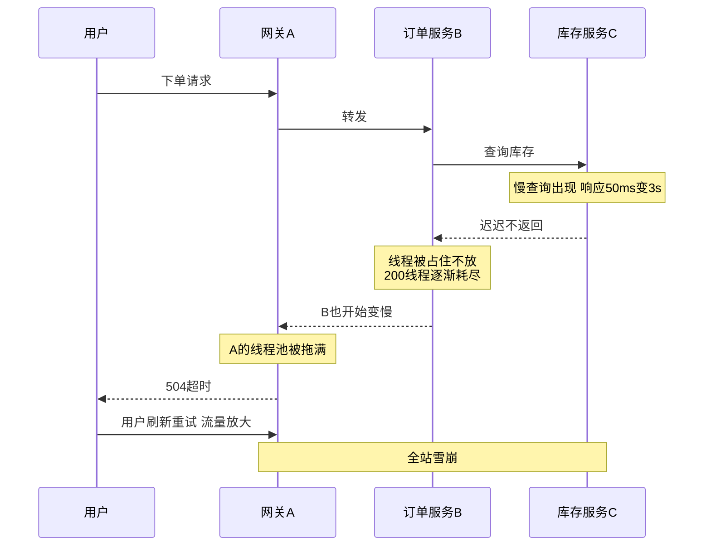
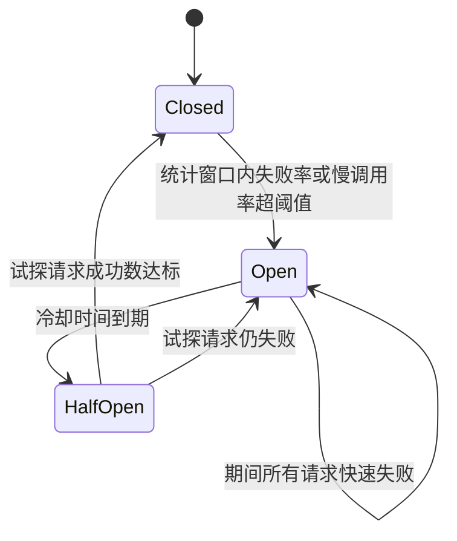
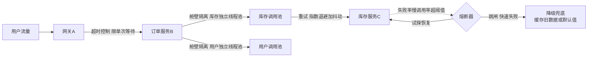

# 07 熔断降级与超时控制

> 优先级：第二档（面试常问但重概念轻实操，读懂状态机就够）｜预计阅读时间：约 25 分钟
> 一句话定位：链路雪崩是怎么发生的，以及超时、重试、舱壁、熔断、降级这五道防线各自挡住雪崩的哪一环。

## TL;DR

- 雪崩的本质不是"出错"，而是"变慢"：下游慢了，上游线程/连接被占住不放，一层拖死一层，全站陪葬。
- 第一道闸永远是超时：所有远程调用必须显式设超时，客户端默认值（无超时或 30s+）是陷阱。
- 超时怎么定：下游 p99 延迟 + 余量；连接超时给小的固定值，读超时按业务定。
- 重试是双刃剑：非幂等接口禁止自动重试；4 层链路、每层 1 次原始 + 3 次重试共 4 次尝试 = 底层承受 4³ = 64 倍流量放大，重试风暴能把濒死的下游直接打死。
- 正确重试姿势：指数退避（Exponential Backoff）+ 抖动（Jitter）+ 重试预算，三者缺一不可。
- 熔断器（Circuit Breaker）保护的是**调用方自己**，不是下游——这是和限流最关键的分工：限流保护自己不被流量压垮，熔断保护自己不被下游拖死。
- 熔断三态状态机：Closed → Open → Half-Open；触发条件不只看异常率，慢调用比例同样要熔断。
- 降级三板斧：返回默认值/静态页、返回缓存旧数据、关闭非核心功能；配合 P0/P1 预案分级与开关文化。
- 舱壁隔离（Bulkhead）是雪崩的物理防火墙：线程池/连接池不到位，前面四道防线全白搭。

## 引子：一次链路雪崩的完整推演

大促晚上 20:00，某电商的调用链长这样：网关 A → 订单服务 B → 库存服务 C。一切正常时，C 的 p99 延迟是 50ms。

20:03，库存服务 C 的数据库出现慢查询，C 的响应时间从 50ms 缓慢爬到 3 秒。注意：**C 没有报错，只是变慢了**。

接下来发生的事情，每一步都"合情合理"：

1. C 变慢 → B 调用 C 的线程平均要等 3 秒才能释放。B 的 Tomcat 工作线程池 200 个线程，在每秒几百单的流量下，几分钟内全部被"等 C 返回"的请求占满。
2. B 的线程池耗尽 → 新请求在 B 排队。B 对上游 A 来说也"变慢"了。B 自己其实健康，但它已经不能正常响应任何请求——包括那些**根本不需要查库存**的接口。
3. A 调用 B 也卡住 → A 的线程池被拖满 → 网关开始大量 504 → 用户疯狂刷新重试 → 流量翻倍 → 更多线程被占住。
4. 最终：一个库存库的慢查询，把整个站点拖死了。全站崩的时候，C 的 CPU 可能还很空闲——它不是累死的，是把别人等死的。

这个推演里藏着一个关键认知：**雪崩的燃料是"等待中的资源占用"，不是错误本身**。如果每一步都报错，系统反而死得干脆；正因为是"慢"，每一层的资源都被无声地占住，直到耗尽。

理解了这一点，本篇的五个防护手段就有了统一坐标——它们分别负责在雪崩链条的不同环节"剪断"它：

- **超时**：限制单次等待的最长时间（第一道闸）
- **重试**：处理瞬时抖动，但控制不好会变成放大器（双刃）
- **舱壁隔离**：把资源切成隔间，一个隔间失火不烧全船（物理通道）
- **熔断**：下游持续异常时主动断开，不再浪费资源去等（自动开关）
- **降级**：断开之后给用户一个"没那么好但能用"的答复（兜底体验）

下面逐个展开。

## 超时控制：第一道闸

### 哲学：所有远程调用必须设超时

一句话原则：**任何一次跨进程、跨网络的调用，都必须有显式超时。没有例外。**

为什么强调"显式"？因为默认值是陷阱。很多 HTTP 客户端、RPC 框架的默认超时是无限制或者长达 30 秒甚至几分钟——在引子的推演里，如果 B 调用 C 用的是"默认无超时"，B 的线程就会无限期等下去。30 秒的默认超时和没有超时，在高并发下几乎没有区别：每秒 500 个请求进来，每个占线程 30 秒，线程池一样是秒光。

前端同学可以类比：浏览器里 `fetch` 默认也是没有超时的（这就是 `AbortController` 存在的原因）。后端世界没有浏览器兜底，超时不设就是裸奔。

### 超时怎么定

两个数字要分开设，含义完全不同：

| 超时类型 | 含义 | 建议定法 |
| --- | --- | --- |
| 连接超时（Connect Timeout） | TCP 建连能等多久 | 给小的固定值，几百毫秒到 2 秒。连不上多半是网络/对端挂了，等再久也没用 |
| 读超时（Read Timeout） | 建连后等响应能等多久 | 基于下游 p99 延迟 + 余量，按业务定 |

读超时的经验公式：**下游接口的 p99 延迟 × 1.5~2 倍**。比如库存服务 p99 是 200ms，读超时设 300~500ms 是合理的；设 50ms 会大量误杀正常请求，设 5 秒等于没设。这要求你有下游的延迟监控数据——没有监控就拍脑袋，拍脑袋就拍 2~3 秒这种"不算离谱但也不救命"的值，然后尽快补上监控。

还有一个链路级的问题：A→B→C 三层调用，超时应该谁大谁小？直觉是"上层 ≥ 下层之和"，否则下层还没超时上层先断了，下层的重试都白做了。但完全照这个原则，上层超时会膨胀到不可接受。工程上的解法是 **deadline 传播**（gRPC 的 deadline、Dubbo 的超时透传）：入口定一个总预算（比如 2 秒），随调用链往下传，每一层用"剩余预算"作为自己的超时，预算耗尽就直接快速失败，不再发起下游调用。一句话记住概念即可，2026 年的主流 RPC 框架和服务网格都已内置。

## 重试：一把双刃剑

### 前提：幂等

重试的第一个问题不是"怎么重试"，而是"**能不能重试**"。

只有幂等（Idempotent）接口才允许自动重试。查询天然幂等；扣款、扣库存、创建订单天然不幂等——重试一次可能就多扣一笔钱。（幂等怎么做：唯一请求号 + 去重表/状态机，详见第 03 篇。）**非幂等接口要么不做自动重试，要么先补幂等设计，没有第三条路。**

### 重试风暴：乘法放大器

来看一笔账。假设链路 A→B→C→D 四层，每一层都配置了"失败后重试 3 次"（共 4 次尝试）：

- D 层收到 1 次失败，C 会尝试 4 次
- C 的每次尝试，B 又各自尝试 4 次 → B 对 C 发起 16 次
- A 对 B 再放大 4 倍 → **D 最终承受 4³ = 64 次调用，64 倍放大**（4 次尝试已含首次，不存在再加一层"首次"）

下游 D 本来可能只是抖了一下，结果在 64 倍流量冲击下被直接打死——这和引子里"用户疯狂刷新"是同一个机制，只不过这次是系统自己打自己。**重试不加控制，等于给雪崩装了一个乘法放大器。**

### 正确姿势：三件套

1. **指数退避（Exponential Backoff）**：第 1 次失败后等 100ms 再试，第 2 次等 200ms，第 3 次等 400ms……给下游留出恢复窗口，而不是立刻再踹一脚。
2. **抖动（Jitter）**：退避时间上加随机扰动（如 ±50%）。没有抖动的后果是"惊群"：同一时刻失败的一批请求，会在同一时刻一起重试，形成一波波同步冲击。抖动把重试打散到时间轴上。
3. **重试预算（Retry Budget）**：限制重试流量占总流量的比例（比如不超过 10%~20%）。下游已经大面积失败时，预算耗尽就不再重试，直接失败——重试只配用于"偶发抖动"，不配用于"系统性故障"。

还有一个隐性问题：**重试和超时会叠加**。读超时 1 秒、重试 3 次，最坏情况一次调用占用线程 3 秒以上。算线程池容量、算链路预算时，必须按"超时 × (1+重试次数)"来算，而不是按单次超时算。这一点面试常考，下面常见误区里还会再敲一次。

## 熔断器：核心防线

### 先摆正位置：熔断保护谁

家用保险丝烧断，保护的是屋里的电路和电器，不是发电厂。同理，**熔断器（Circuit Breaker）保护的是调用方自己**——下游已经病了，我继续把线程和连接往它身上砸，除了把自己拖死没有任何意义。熔断的逻辑是"止损"：我不再调用你，把资源省下来服务其他请求。

和第 02 篇限流（Rate Limiting）的分工再强调一次，这是面试最高频的混淆点：

| 机制 | 部署位置 | 保护对象 | 触发依据 |
| --- | --- | --- | --- |
| 限流 | 服务提供方入口 | 保护自己不被流量压垮 | 请求速率超过自身容量 |
| 熔断 | 服务调用方出口 | 保护自己不被下游拖死 | 下游失败率/慢调用率超阈值 |

一句话：**限流是"别来了我忙不过来"，熔断是"你病了我先不找你了"。** 顺带一提，熔断客观上也让下游少受点冲击，有"保护下游"的副作用，但设计动机和考察点是保护调用方。

### 三态状态机

熔断器是一个状态机，这是第二档文章里唯一需要"背到能画"的东西：

- **Closed（闭合）**：正常放行。熔断器在后台持续统计调用结果。
- **Open（断开）**：失败率/慢调用率越过阈值（如 60 秒内失败率 > 50%），熔断器跳闸。此后所有调用**不发出真实请求**，直接快速失败（Fail Fast）走兜底。跳闸后开始一段冷却时间（如 30 秒），给下游恢复的机会。
- **Half-Open（半开）**：冷却结束，放少量试探请求（如 5 个）过去。试探成功数达标 → 认为下游恢复，回到 Closed；仍失败 → 回到 Open，重新冷却。

这个状态机精妙的地方在于 **Half-Open**：全自动地解决"下游到底好没好"的探测问题，不用人肉盯盘，也不会一恢复就被全量流量瞬间冲垮。

### 统计窗口：数什么、怎么数

跳闸判断依赖一个统计窗口，两种主流实现：

| 窗口类型 | 原理 | 优点 | 代价 | 适用场景 |
| --- | --- | --- | --- | --- |
| 滑动时间窗 | 统计最近 N 秒内的调用结果 | 对突发流量敏感、直观 | 实现稍复杂（分桶聚合） | 流量较稳定的服务 |
| 滑动计数窗 | 统计最近 N 次调用的结果 | 实现简单、内存固定 | 低流量时窗口拉得很长，反应迟钝 | 中低流量、追求简单 |

注意一个共同的坑：**窗口内请求量太少时统计没有意义**。10 个请求失败 6 个可能只是抖动，所以实现里通常还有"最小请求数"门槛（如窗口内至少 20 个请求才开始评估），防止低流量时段误熔断。

### 慢调用比例熔断：雪崩的本质是慢

传统熔断只看异常率，但回到引子：库存服务 C 从头到尾**没有报错，只是慢**。只看异常率的熔断器在这种情况下永远不会跳闸，眼睁睁看着 B 被拖死。

所以现代熔断器（Resilience4j、Sentinel 都支持）必须有第二个触发条件：**慢调用比例熔断**——响应时间超过阈值（如 1 秒）的调用占比超过设定值（如 50%）时，同样跳闸。这一条直接呼应全篇主线：**熔断防的不只是"错"，更是"慢"。**

### 熔断之后：快速失败 + 兜底

跳闸后的请求去哪？两个去处：

- **快速失败（Fail Fast）**：直接抛异常/返回错误码。省资源，但用户看到报错。
- **兜底逻辑（Fallback）**：返回一个"降级答案"——缓存的旧数据、默认值、静态内容。用户无感或轻微受损。

选哪个取决于业务容忍度，这就自然引出了下一节：降级。

## 降级：三板斧

降级（Degradation）回答的问题是：当下游不可用、熔断跳闸、或者系统整体过载时，**给用户一个什么样的"次优答案"**。三板斧按体验损失从小到大排：

1. **返回默认值/静态页**：推荐位返回运营配好的兜底榜单，个性化模块返回静态内容。用户几乎无感。
2. **返回缓存旧数据**：数据可能是 10 分钟前的，但比报错强。这正是第 01 篇讲的缓存兜底——缓存不只是加速，更是降级的弹药库。
3. **功能阉割**：直接关闭非核心功能——大促期间关掉评论、关掉发票导出、关掉推荐服务，把资源全部让给交易主链路。用户明确地"少了点什么"，但核心流程保住了。

### 开关与预案分级

工程上降级靠**开关**落地：配置中心里一组布尔值，一键关闭某个功能。配套的是**预案分级**文化：

- 事先把功能列成清单分级：P0 是动不得的核心链路（下单、支付），P1 是可降级的（推荐、评论、导出、积分动画），P2 是随时可关的。
- 大促前把"P1 降级预案"演练一遍：谁在什么指标恶化到什么水位时，关掉哪些开关，多久能恢复——这在大厂是标准的大促保障动作，不是玄学。

**自动降级 vs 手动开关**：自动降级（由熔断器的 Fallback 触发，实时、无人值守）处理毫秒级的下游故障；手动开关处理分钟级到小时级的系统性过载，以及那些"机器不敢替你决定"的业务取舍（比如关掉导出影响客户做账）。成熟体系两者都要：自动兜底保底线，手动开关做业务决策。

## 舱壁隔离：雪崩的物理通道

轮船的船舱之间有水密隔舱（Bulkhead），一个舱进水不沉全船。**舱壁隔离（Bulkhead）**就是把这套思想搬进服务：把资源按调用目标切分成隔离的池子，一个下游出问题最多烧掉它自己的池子，不波及其他。

其实你已经天天在用舱壁：**连接池、线程池本质上都是资源舱壁**。问题只在于你切得够不够细。B 服务用一个 200 线程的大池子同时调用"库存"和"用户"两个下游，库存慢了照样拖垮对用户的调用——隔离粒度不够。两种主流隔离方式对比：

| 方案 | 原理 | 优点 | 代价 | 适用场景 |
| --- | --- | --- | --- | --- |
| 线程池隔离 | 每个下游分配独立线程池，调用在池内线程执行 | 隔离彻底，超时控制可靠，可排队 | 线程上下文切换开销，内存占用高 | 耗时较长、失败影响大的下游调用 |
| 信号量隔离 | 只按下游限制并发数，调用仍在调用方线程执行 | 开销极小，轻量 | 无法主动中断等待中的调用，超时依赖客户端自身 | 高频轻量调用、对开销敏感的场景 |

经验判断：**绝大多数业务 RPC 调用用线程池隔离，值得那点开销**；只有极高 QPS、单次调用极轻的场景才考虑信号量。没有舱壁的后果在引子里已经演过：B 的全局线程池就是那条"没有水密门的大舱"，C 失火，全船沉没。所以记住这条因果链——**舱壁不到位，超时、熔断、降级都是纸面防线**，因为资源在熔断器反应过来之前就已经被占光了。

## 工程实现地图（2026 视角）

- **Hystrix**：Netflix 出品，熔断器概念的普及者，2018 年起停止主动演进。它的历史地位在于定义了三态状态机这套词汇，面试提它是为了聊思想，生产上别再新引入。
- **Resilience4j**：Java 生态现役轻量首选，函数式 API，熔断/限流/重试/舱壁模块化组合，Spring Boot 项目标配。
- **Sentinel**：阿里出品，熔断 + 流量控制 + 系统自适应保护一体，中文文档友好，国内面试提及率极高。
- **Envoy outlier detection**：服务网格层的"熔断"，在 Sidecar 里做异常点剔除，业务代码零侵入。思路相同，位置不同——网格化之后，很多熔断逻辑下沉到了基础设施层。
- **前端对应物**：React 的 Error Boundary 本质就是 UI 层的熔断降级思维——子树崩溃不拖垮整个页面，降级成兜底 UI。面试时用这个类比收尾，能体现你真的理解而不是背八股。

## 雪崩防护组合拳：五道防线各守一环

回到引子的推演，把五道防线贴上去，每一环剪断一次雪崩：

对照推演：C 变慢 → 超时让 B 的等待有上限 → 舱壁保证只有库存池被占满、用户池无恙 → 重试有预算不会放大 64 倍 → 慢调用比例熔断在库存池耗尽前跳闸 → Fallback 返回缓存的旧库存快照 → A 全程无感，全站不崩。**没有任何一道防线是万能的，但组合起来每一环都有剪断雪崩的机会。**

## 面试视角

**Q1：熔断和降级有什么区别？**（最高频，也最易混）
考察点：是否理解二者是"触发机制"与"应对策略"的关系。
回答骨架：熔断是**调用方的自动保护机制**——检测下游健康度，异常超阈值就断开调用，是"因"；降级是**对业务的兜底策略**——返回默认值/旧数据/关功能，是"果"。熔断跳闸后通常触发降级逻辑，但降级也可以因限流、因人工开关、因大促预案触发，不一定经过熔断。一句话：熔断是电闸，降级是停电后的蜡烛。

**Q2：讲讲熔断器的工作原理。**
考察点：状态机 + 统计口径。
回答骨架：三态状态机 Closed/Open/Half-Open → 统计窗口（时间窗/计数窗 + 最小请求数门槛）→ 触发条件两个维度：失败率 + **慢调用比例**（主动提这句，说明你理解雪崩本质是慢不是错）→ Half-Open 试探恢复的意义。

**Q3：重试风暴怎么避免？**
考察点：是否算过放大的账。
回答骨架：先算账（4 层链路、每层 1 次原始 + 3 次重试共 4 次尝试 ≈ 底层 4³ = 64 倍放大）→ 三件套：指数退避 + 抖动 + 重试预算 → 前提：幂等才允许重试 → 进阶：deadline 传播避免跨层重试叠加。

**Q4：超时时间怎么设置？**
考察点：有没有工程感觉，而不是背"要设超时"。
回答骨架：连接超时给小的固定值；读超时 = 下游 p99 × 1.5~2 → 链路级用 deadline 传播控制总预算 → 强调"默认无超时是陷阱" → 补一句：超时和重试叠加，最坏占用 = 超时 × (1+重试次数)。

**经典追问连招**：熔断保护谁？（调用方，不是下游）→ 那下游过载怎么办？（那是限流的活，部署位置不同）→ 熔断跳闸了请求去哪？（Fail Fast 或 Fallback）→ 怎么知道下游恢复了？（Half-Open 试探）。

## 常见误区

- **以为熔断是保护下游的**：其实熔断器装在调用方，设计动机是"别让下游把我拖死"。保护下游只是副作用，那是限流的职责。这个搞反，Q1 连招直接出局。
- **以为重试越多越好**：重试只治瞬时抖动，治不了系统性故障。无预算的重试在下游濒死时就是 DDoS 它自己。
- **以为设了超时就万事大吉**：超时 × 重试次数才是真实占用。超时 1 秒 + 重试 3 次，单个请求最坏占线程 3 秒多，线程池容量照 1 秒算的，照样被打穿。
- **以为熔断只看异常率**：下游变慢但不报错时，纯异常率熔断永远不会跳闸。不配慢调用比例熔断，等于防"错"不防"慢"，而雪崩恰恰是"慢"。
- **以为降级就是"报错页友好一点"**：降级是有预案的功能取舍——默认值、旧缓存、关非核心，配开关和分级清单，是设计出来的，不是出了事现想的。

## 与我的财务系统的关联

你的系统现在没有几十个微服务互相调用，但"下游变慢拖死上游"的剧本你一点都不陌生——**慢 SQL 就是数据库版的"下游变慢"**。

1. **报表大查询 = 库存服务 C**。多维报表跑 400 万明细的聚合，一次查询 30 秒，期间占着数据库连接不放。连接池一共 50 个连接，20 个人同时点开报表页，连接池耗尽，发票录入、对账这些本来毫秒级的操作全部排队——这就是你系统里的 A→B→C 雪崩，只不过 C 是 MySQL。对应的防线完全是同一套：
   - **超时**：给报表查询显式设语句级超时（`MAX_EXECUTION_TIME` 或应用层超时），宁可让用户看到"查询超时请缩小范围"，也不让一个报表占死连接池。这就是"慢 SQL 熔断"的朴素版。
   - **舱壁**：报表走独立的只读数据源/独立连接池，与交易库的连接池物理隔离——报表再慢，只烧报表自己的池子。
   - **降级**：报表超时后返回"上一次成功结果的缓存快照"，这就是第 01 篇缓存兜底在你项目里的落点。
2. **对账调三方接口 = 标准的熔断重试场景**。银企直连、税局接口是典型的"别人的系统"：会抖动、会限流、会半夜维护。这套组合应该写成你的标准叙事：**超时（连接 2s + 读 10s，银行接口本来就慢）→ 有限重试（前提是对账请求带唯一流水号保证幂等，指数退避 + 抖动，最多 3 次）→ 熔断（连续失败超阈值断开 5 分钟，期间不再无谓冲击对方）→ 兜底（熔断期间对账任务标记为"待补偿"，进入延迟重跑队列，第二天差异清单里体现）**。注意最后一环：财务业务的兜底不是"给用户看个静态页"，而是**补偿机制保证最终一致**——这是财务系统降级和电商降级的本质差异。
3. **导出功能 = 天然的可降级项（P1）**。月末高峰期，"导出全年发票明细"这种扫百万行的大导出就是该被第一个关掉的开关：高峰期限制导出时间范围/排队异步化/甚至临时关闭入口，把资源让给开票主链路。写进你的 P0/P1 清单：P0 开票、对账；P1 大导出、历史数据归档查询。

一句话：你不缺用得上这套思想的地方，缺的是把它们从"大促神话"翻译成"慢 SQL + 三方接口 + 导出开关"的自觉。

## 小结

链路雪崩的燃料是"等待中的资源占用"，而慢比错更危险。五道防线对应雪崩链条的五个环节：超时给单次等待封顶，重试（幂等 + 退避 + 抖动 + 预算）处理抖动但绝不放大，舱壁隔离切断资源层面的传染通道，熔断器用三态状态机自动止损并试探恢复（记得防慢不只要防错），降级用预案化的次优答案保住核心体验。背状态机只能过面试，想清楚"每道防线剪断哪一环、剪不断时谁兜底"，才算真正建立了高可用的心智模型。

## 延伸阅读

- Resilience4j 官方文档（CircuitBreaker / Retry / Bulkhead 章节）
- 阿里巴巴 Sentinel 官方文档（熔断降级与流量控制）
- Netflix 技术博客：Hystrix 原始设计文章（历史价值）
- 《Release It!》第二版（Michael Nygard，稳定性模式与反模式的经典）
- gRPC 官方文档：Deadline 传播机制
