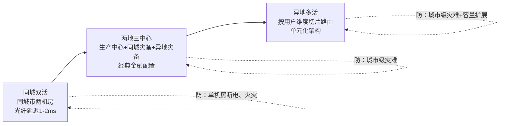

# 08 容灾与备份恢复：机房烧了、库被误删了，你的系统还能活吗

> 优先级档位：第三档（杂志级泛读）｜预计阅读时间：18 分钟
> 一句话定位：冗余防的是"组件挂"，容灾防的是"整个机房没了"——这篇讲清楚 RPO/RTO 两个必背指标、备份的正确打开方式，以及从同城双活到异地多活的容灾演进谱系。

## TL;DR

- 冗余（上一篇）防组件级故障：机器宕机、进程崩溃；容灾（Disaster Recovery，DR）防灾难级故障：火灾、光缆挖断、误删库、勒索软件。层级不同，手段不同。
- 容灾方案只看两个指标：RPO 决定"能丢多少数据"，RTO 决定"能停多久"。指标由业务定，不是技术定——财务系统 RPO 趋近于 0，行为日志丢一天没人疼。
- 备份不练恢复等于没备份。备份是生产资料，恢复演练才是容灾本体。
- 全量备份 + binlog 时点恢复（PITR）可以把数据回放到误删前一秒，这是"误删库自救"的标准原理，也是面试高频实操题。
- 备份遵循 3-2-1 原则：3 份副本、2 种介质、1 份异地。勒索软件时代还要加一条：至少一份离线或不可变。
- 多机房容灾谱系：同城双活 → 两地三中心 → 异地多活。多数公司止步两地三中心，异地多活是巨头的游戏。
- 容灾切换真正的难题不是"怎么切"，而是"什么时候敢切"——脑裂恐惧和切完的数据回补，才是切换的深水区。

## 引子

周五晚上九点，你的财务系统里，一个同事执行了一条没带 WHERE 的 `DELETE`，发票明细表 400 万行数据瞬间清空。更巧的是，同一个月，机房所在的园区施工挖断了光缆，备用机房在隔壁楼的机柜——可惜备份文件也放在同一栋楼里。

这两个场景共同指向一个问题：上一篇讲的冗余（多台机器、多副本、主从切换）防的是**组件挂掉**，而误删、火灾、光缆挖断这类**灾难级事件**，冗余防不住——因为误删的数据会忠实地同步到每一个副本，大火会同时烧掉主备两台机器。

这就是容灾要解决的问题：当"整个机房/整个城市/一次人为失误"级别的灾难发生时，数据还在不在、系统多久能回来。

## 一、冗余与容灾：先把层级立住

| 层级 | 防什么 | 典型手段 | 粒度 |
|---|---|---|---|
| 冗余（第06篇） | 单点故障：机器宕机、进程崩溃、磁盘坏 | 多实例、主从复制、负载均衡摘除 | 秒级-分钟级自动切换 |
| 容灾（本篇） | 灾难事件：机房火灾、光缆挖断、城市断电、误删库、勒索软件 | 备份与恢复、跨机房/跨城市灾备、多活架构 | 分钟级-小时级人工/半自动切换 |

一句话区分：**冗余让故障"用户无感"，容灾让灾难"数据不亡"**。冗余是日常运转的一部分，容灾是你希望一辈子用不上、但必须每年演练的保险。

## 二、两个核心指标：RPO 与 RTO

容灾方案的全部讨论，最终都收敛到两个指标上，这也是面试必背：

- **RPO（Recovery Point Objective，恢复点目标）**：灾难发生后，最多允许丢失多长时间的数据。它回答的是"数据回到哪个时间点"。RPO = 5 分钟，意味着最坏情况丢最近 5 分钟的写入。
- **RTO（Recovery Time Objective，恢复时间目标）**：灾难发生后，系统必须在多长时间内恢复服务。它回答的是"用户要等多久"。RTO = 1 小时，意味着一小时内必须对外提供服务。

换算直觉表：

| RPO 目标 | 技术上意味着什么 | 成本直觉 |
|---|---|---|
| RPO = 1 天 | 每天一次全量/增量备份即可 | 几乎零成本 |
| RPO = 1 小时 | 每小时备份，或日志持续归档 | 低 |
| RPO = 5 分钟 | binlog/WAL 实时传输到异地 | 中 |
| RPO ≈ 0 | 同步复制（写必须等备库/异地确认才返回成功） | 高：每次写入都背上跨机房网络延迟 |

RPO = 0 的代价要单独强调：它意味着每一笔写入都要等异地副本确认。同城机房光纤延迟约 1-2ms，可接受；跨城市（如北京—上海）延迟 30ms 起步，直接写进每笔事务，吞吐和延迟都会显著恶化。所以"RPO = 0 还跨城市"通常只能牺牲一致性或用共识协议（如 Paxos/Raft 多副本），成本和复杂度都上了一个数量级。

**关键认知：RPO/RTO 由业务定，不由技术定。** 判断维度：

- 数据丢了能不能补回来？发票、对账流水丢了无法重新生成 → RPO ≈ 0；用户行为日志丢了重新埋点采集即可 → RPO = 1 天也无所谓。
- 停机的钱怎么算？支付系统停机 1 小时损失按交易量计 → RTO 分钟级；内部报表系统停一天只影响体验 → RTO 天级。
- 合规怎么要求？金融、财务数据往往有监管留档年限和可恢复性要求，这不是技术选项。

先让业务方在"丢数据"和"停机"之间签字画押，再谈技术方案。反过来由工程师拍脑袋定指标，要么过度建设浪费钱，要么灾难来了兜不住。

## 三、备份策略：容灾的地基

### 3.1 全量 / 增量 / 差异

| 方案 | 原理 | 优点 | 代价 | 适用场景 |
|---|---|---|---|---|
| 全量备份（Full） | 每次完整复制全部数据 | 恢复最简单，一份就够 | 占空间、耗时长、备份窗口大 | 数据量小，或作为周期基线 |
| 增量备份（Incremental） | 只备份上次备份（任意类型）以来的变化 | 最快最省空间 | 恢复要"全量 + 链上所有增量"，链长易断 | 备份频率高、数据变化率低 |
| 差异备份（Differential） | 备份上次全量以来的全部变化 | 恢复只需"全量 + 最新一份差异" | 越往后差异越大 | 想要恢复简单又不想每天全量 |

经典组合：**每周全量 + 每天增量（或差异）+ binlog 持续归档**，兼顾存储成本与恢复粒度。

### 3.2 冷备 / 温备 / 热备

| 方案 | 原理 | RTO 直觉 | 成本 | 适用场景 |
|---|---|---|---|---|
| 冷备（Cold Standby） | 备份数据躺着，灾难时从零搭建环境再恢复 | 小时-天级 | 最低（只花存储钱） | 非核心系统、预算有限 |
| 温备（Warm Standby） | 备用环境已部署，数据异步同步，切换需拉起服务和验证 | 十分钟-小时级 | 中 | 多数企业核心系统的现实选择 |
| 热备（Hot Standby） | 备用系统实时同步、随时可接管，甚至平时就分担流量 | 秒-分钟级 | 最高（资源翻倍） | 支付、交易等停不起的系统 |

成本与 RTO 基本线性：想快就得让备用系统时刻"活着"，活着就要花机器的钱。

### 3.3 binlog 的容灾价值：时点恢复（PITR）

MySQL 的 binlog（二进制日志）记录了每一次数据变更。它和全量备份组合，可以实现**时点恢复（PITR，Point-in-Time Recovery）**——把数据精确回放到任意一秒。

误删库的自救原理：

1. 找到最近一次全量备份（比如凌晨 2 点的），恢复到一个临时实例；
2. 从备份结束点对应的 binlog 位点开始回放，一路回放到 `DELETE` 语句执行**前一秒**；
3. 跳过那条事故 SQL（或按 GTID 精确剔除），继续回放其后的正常变更；
4. 把找回的表数据导回线上，或校验后整体切换。

这就是为什么 DBA 圈子里说"全量备份是骨架，binlog 是血肉"：只有全量，你只能回到凌晨 2 点，白天的数据全丢；有了 binlog 连续归档，你能回到误删前一秒，RPO 从"一天"压到"秒级"。

### 3.4 3-2-1 原则与不可变备份

**3-2-1 原则**：至少 3 份数据副本、存放在 2 种不同介质（或存储系统）上、其中 1 份在异地。它防的正是引子里的场景——备份和生产放在同一栋楼，楼出事备份跟着陪葬。

勒索软件时代还要补一条：**至少一份备份是离线或不可变（immutable）的**。勒索软件会加密它能摸到的一切——包括挂在线上可写的备份目录。对象存储的 WORM（Write Once Read Many）策略、离线磁带、或独立隔离的备份账号，都是让备份"黑客碰不到"的手段。

### 3.5 关键认知：备份 ≠ 可恢复

这是本篇最重要的一句话：**没做过恢复演练的备份，约等于没有备份。**

备份任务每天绿色跑完，只证明"文件生成了"，不证明文件完整、不证明 binlog 位点能对上、不证明你知道恢复要敲哪些命令、更不证明恢复耗时在 RTO 之内。真实事故里翻车的从来不是"没有备份"，而是"恢复时发现备份损坏/不全/没人会操作"。所以业内的共识是：**恢复演练（Recovery Drill）才是容灾的本体，备份只是原材料。** 至少每季度真刀真枪恢复一次，掐表记录耗时，这就是演练的全部要义。

## 四、多机房容灾谱系

备份解决"数据还在"，多机房解决"服务不停"。按能力从低到高，演进谱系如下：

**第一层：同城双活。** 同一城市两个机房，相距几十公里，专线光纤延迟 1-2ms，可以做强同步（写双方确认），实现真正的 RPO ≈ 0。两机房同时对外服务，一个挂了另一个分钟级接管。防的是"单机房断电、火灾、空调故障"，防不了城市级灾难（地震、洪水、全市电网故障）。切换代价低，是多数中大型公司的标配。

**第二层：两地三中心。** 经典金融配置：一个生产中心 + 一个同城灾备中心（强同步，RPO ≈ 0）+ 一个异地灾备中心（异步复制，RPO 分钟级）。同城中心防机房级灾难，异地中心防城市级灾难。平时异地中心只做数据同步不承载流量（温备），真出事时人工决策切换，RTO 在十分钟到小时级。**绝大多数公司止步于此**——它覆盖了 99% 的灾难场景，而成本还算可控。

**第三层：异地多活。** 多个城市的机房同时承载真实流量，按用户维度切片路由（单元化/SET 化）：比如按用户 ID 分片，用户 A 的全部请求永远路由到杭州单元，用户 B 永远到上海单元。任一城市整体失联，只影响该单元用户，把他们切到其他单元即可。蚂蚁的 LDC（Logical Data Center）架构就是这个思路。代价是架构复杂度爆炸：数据跨城同步的冲突处理、单元间数据冗余、路由调度系统，每一块都是大工程。**这是巨头的游戏**，业务规模没到"一个城市装不下、且停机按亿计损失"之前，碰它都是过度设计。

每层一句话总结：同城双活用低延迟换强一致，两地三中心用闲置资源换城市级保命，异地多活用架构复杂度换"永不停机"的叙事。

## 五、容灾切换的本质难题：不是怎么切，是敢不敢切

切换本身在工程上已经很成熟：DNS 或入口流量层（负载均衡/网关）把域名解析或流量指向灾备中心，几分钟就能完成。真正难的是两件事：

**第一，脑裂恐惧：原中心可能没死透。** 监控系统发现生产中心"联系不上"，但联系不上 ≠ 死了——可能只是网络分区，原中心还活着还在写数据。这时候如果贸然把流量切到灾备中心，两边同时对外写，数据产生无法合并的冲突，这就是脑裂（Split-Brain）。所以切换决策通常需要多重确认：多链路探测、机房值班电话确认、甚至合同约定的人工审批。**宁可多停十分钟，不可脑裂一次**——数据冲突的代价远大于停机。这也是为什么 RTO 很难压到全自动秒级：判断"是不是真的死了"本身就需要时间。

**第二，切完怎么回来。** 灾难解除后，灾备中心这段时间产生的新数据要回补（failback）到原中心，期间如果原中心的旧数据被修复上线，两边数据又是一笔糊涂账。数据回补、一致性校验、灰度切回，每一步都比"切过去"更磨人。

对前端同学打个短类比：这就像 React 的 Error Boundary——兜住错误不难（componentDidCatch 一写就行），难的是兜住之后界面恢复成什么状态、用户没提交的数据怎么办。切换动作是一行配置，切换前后的状态治理才是工程本体。

## 面试视角

**面试官怎么问 / 考察什么 / 回答骨架：**

1. **"RPO 和 RTO 有什么区别？"**——考察概念是否扎实。
   骨架：RPO 是时间点，衡量丢多少数据（数据维度）；RTO 是时间长度，衡量停多久服务（时间维度）。RPO 靠备份频率和同步方式保障，RTO 靠备用系统的就绪程度（冷/温/热）保障。指标由业务定：举财务系统 RPO≈0、日志系统 RPO=1 天的对比例子加分。

2. **"线上误删了一张表，怎么恢复？"**——考察有没有真实容灾思维，这是本篇最值得背熟的操作链路：
   骨架：① 立即止损：锁库/禁写防止二次伤害，保留事故现场；② 评估影响：确认删除时间点、影响范围；③ 找最近的全量备份恢复到临时实例；④ 用 binlog 从备份位点回放到误删前一秒（PITR），跳过事故语句；⑤ 校验数据完整性（行数、关键字段抽检）；⑥ 业务低峰期导回线上；⑦ 复盘：为什么没有 WHERE 保护、备份演练多久做一次。追问连招："binlog 也删了呢？"——答：主从场景从库可能有延迟副本可救命，异地还有一份归档；这正说明 3-2-1 原则的价值。

3. **"两地三中心是什么？你们公司需要吗？"**——考察对容灾谱系的全局认知。
   骨架：生产中心 + 同城灾备（强同步，RPO≈0）+ 异地灾备（异步，RPO 分钟级）；同城防机房级灾难，异地防城市级灾难；平时异地不承载流量，切换需人工决策防脑裂。然后说判断：多数公司止步于此，异地多活（单元化）是业务量和损失规模到一定程度才值得的巨头方案。能主动补一句"切换的难点在脑裂恐惧和数据回补"会明显超出背八股的候选人。

## 常见误区

- **以为做了备份就有容灾。** 其实没有异地副本，备份和生产同归于尽；没有恢复演练，备份能不能用是开盲盒。备份+异地+演练三件套齐了，才勉强算有容灾。
- **以为云厂商多副本万事大吉。** 其实多副本防的是硬件故障——磁盘坏了副本顶上。但误删、程序 bug 写脏数据这类**逻辑错误会忠实地同步到所有副本**，三个副本一起变脏。副本防硬件灾难，不防人为错误；防人为错误的只有备份（尤其是离线/不可变的那份）。
- **以为 RPO = 0 是免费的。** 其实它意味着每次写入都要等远端确认，跨城市场景下延迟和吞吐代价显著，往往需要共识协议兜底，架构复杂度直接跳档。
- **以为容灾切换可以全自动秒级完成。** 其实"对端是不是真死了"无法纯靠机器快速判断，脑裂的代价远大于多停十分钟，所以核心系统的切换普遍保留人工决策环节。
- **以为备份越频繁越好。** 其实全量备份有窗口期和存储成本，正确姿势是"低频全量 + 高频增量/binlog 连续归档"的组合，用 PITR 拿细粒度而不是堆全量次数。

## 与我的财务系统的关联

你的财务系统恰好是 RPO 约束最硬的业务之一，这篇内容对你不是泛读，是贴身：

**为什么财务数据特殊：**
- 发票、对账流水属于**不可再生数据**——用户行为日志丢了可以重新埋点，发票丢了没法让用户重新开一次。RPO 必须趋近于 0，这不是技术选型，是底线。
- 审计合规要求财务数据长期留档：凭证、账簿类保管期限 30 年（《会计档案管理办法》），年度财务报告更是永久保管，属于合规刚需。备份的"长期归档"属性比互联网业务重得多，3-2-1 里那份异地副本是合规刚需而非锦上添花。
- 误操作风险真实存在：对账模块的多维报表查询如果权限设计不严谨，一条写 SQL 打进生产库就是引子里的事故。

**可落地清单（按优先级）：**
1. **做一次 PITR 实操演练**（强烈推荐，本篇最值钱的一条）：在你的 Docker 环境里起一个 MySQL，灌入一批发票测试数据 → mysqldump 做一次全量备份 → 继续写入若干数据 → 故意执行一次误删 → 用"全量恢复 + binlog 回放到误删前一秒"把数据找回来。整个过程两三个小时，但这个"我真的把误删的数据救回来过"的实操经历，在面试里比背十遍概念都有说服力。
2. 确认 binlog 开启且设置合理保留期，理解 `log_bin`、`binlog_format=ROW` 的含义（ROW 格式记录行级变化，是 PITR 和主从复制的基础）。
3. 给备份脚本加一步"恢复冒烟测试"：每周自动把最新备份恢复到一个临时库，校验关键表行数，失败报警——这就是最小成本的恢复演练。

**明确现阶段用不上的：** 两地三中心、异地多活对你当前的系统是纯面试知识——你的部署规模连同城双机房都谈不上，真实落地的天花板是"云厂商跨可用区 + 自建异地备份"。但面试时能把"同城双活→两地三中心→异地多活每层防什么、代价是什么、我们公司为什么止步于哪层"讲清楚，就已经覆盖了 90% 的容灾考问。

## 小结

容灾的认知主线就一条：**先让业务方回答 RPO 和 RTO 两个问题，再用备份（3-2-1 + 不可变 + 演练）守住"数据不亡"的底线，用多机房谱系（同城双活→两地三中心→异地多活）按灾难等级逐级抬升"服务不停"的上限。** 冗余与容灾的分工、副本不防逻辑错误、备份不演练等于没有、切换难在敢不敢切——记住这四句话，容灾这一章你就建立起了完整的认知地图，剩下的细节都可以在这张地图上挂出来。

## 延伸阅读

- 《MySQL 实战 45 讲》（丁奇，极客时间）：binlog、主从复制与数据恢复相关章节
- MySQL 官方文档：Point-in-Time Recovery 章节
- 《Site Reliability Engineering》（Google SRE 之书）：Disaster Recovery 相关章节
- 阿里云/腾讯云官方容灾白皮书：两地三中心、单元化架构的工业界实践描述
- 《数据密集型应用系统设计》（DDIA）：复制与分区章节（理解同步复制代价的理论根基）
