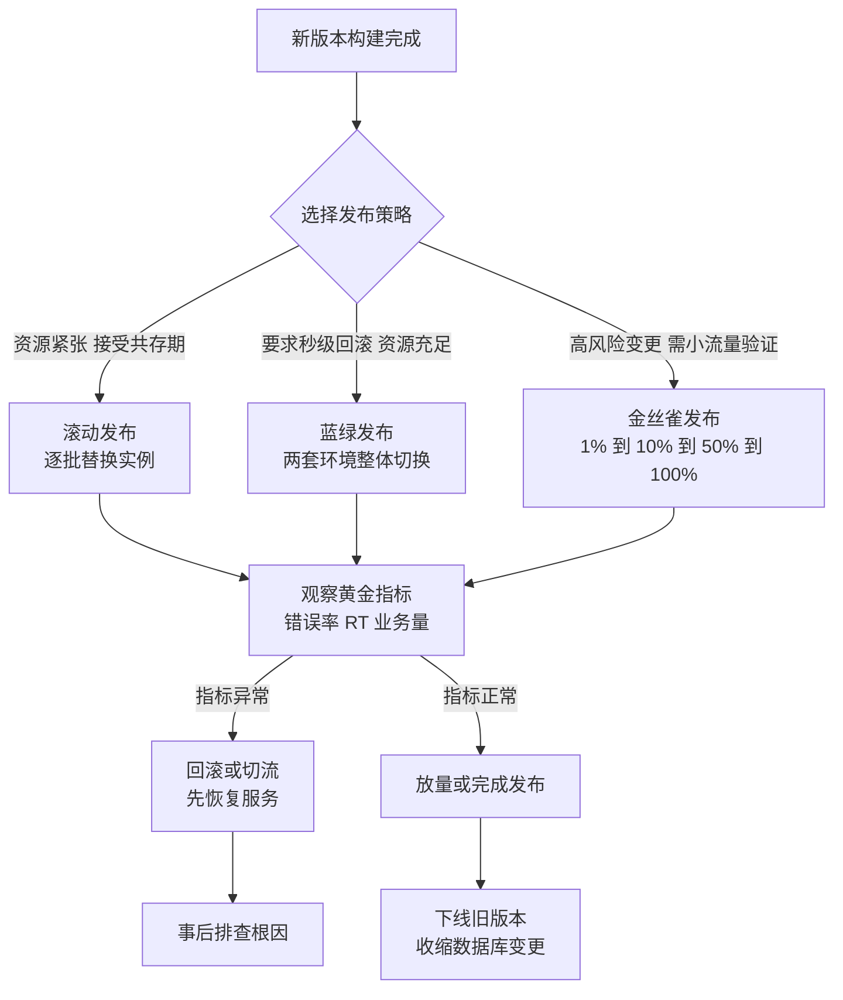

# 09 灰度发布与容量规划

> **优先级档位**：第三档（杂志级泛读）｜**预计阅读时间**：25 分钟
> **一句话定位**：发布是最高危的日常操作——这篇讲清楚怎么控制爆炸半径，以及怎么知道你的系统到底能扛多少流量。

## TL;DR

- 相当比例的生产事故由变更引发：发布不是"把代码推上去"，而是一次受控的风险操作。
- 所有发布策略的本质都是**爆炸半径（Blast Radius）控制**：出问题时装死多少用户、多少机器。
- 滚动发布省资源但新旧版本共存，数据库和 API 必须前后兼容；蓝绿发布秒级回滚但资源翻倍；金丝雀用小流量换信心，代价是发布周期长、需要监控体系支撑。
- 选策略看三个维度：资源成本、回滚速度、风险控制粒度。没有银弹，只有匹配。
- 可回滚是发布的前提，回滚方案必须在发布**之前**就存在；出了事先回滚再排查，恢复服务永远优先于定位根因。
- 容量规划的闭环是：压测出单机极限 → 日常水位控制在极限的 30%~50% → 用公式反推机器数 → 压测结果同时决定限流阈值。
- 压测打得不是接口而是"真实"：数据分布和缓存命中率不对，压测结论就是废纸。

## 引子

你们财务系统每月 1 号到 5 号是月结窗口：400 万条发票明细要跑对账批处理，财务同事开着多维报表页面刷数据，老板等着看上月经营数字。

4 月 2 号上午 10 点，你推了一个"优化报表查询"的发布。三分钟后，报表接口 RT 从 200ms 涨到 8 秒，对账任务排队堵死，财务群里开始刷屏。你手忙脚乱回滚，但回滚完发现：新版顺手改了一个表结构，把某个字段从 `DECIMAL(10,2)` 改成了 `DECIMAL(12,4)`，旧代码读写开始报错——回滚了，又没完全回滚。

这次事故的每一环都有标准答案：为什么要在月结窗口发版？为什么数据库变更不可逆？为什么没有先放 1% 流量试试？这篇就把这些答案讲透。

## 为什么发布本身就是高危操作

行业里流传多年的统计直觉：**大约七成的生产事故由变更引发**（Google SRE 体系的数据口径大致如此，各家数字略有出入，但"变更是事故第一来源"是共识）。这很反直觉——代码评审过了、测试跑过了，怎么上线还出事？

因为测试环境验证的是"代码对不对"，而生产环境考验的是"新旧世界能不能共存"：

- 发布过程中，新旧版本实例**同时在线**，同一张表被两版代码读写；
- 用户请求被负载均衡随机打到不同版本，会话状态、缓存格式、API 契约稍有变化就炸；
- 数据库 schema 变更通常是单向的——加列容易回滚，删列、改类型基本回不去。

所以发布策略的本质不是"怎么把新版本放上去"，而是**爆炸半径控制（Blast Radius）**：万一新版是坏的，它最多能影响多少用户、多少机器、多长时间？三种主流策略的区别，就是对这个问题的不同回答。

## 三种发布策略

### 滚动发布（Rolling Update）：逐批替换，省资源的默认选项

滚动发布把实例分成若干批，每批摘掉、换新版、挂回，循环直到全部替换完。Kubernetes 的默认更新策略就是它（`RollingUpdate`）。

优点很实在：不需要额外机器，一台一台换，资源零浪费。代价藏在一个词里：**共存期**。整个发布过程中新旧版本同时对外服务，可能持续几十分钟。这几十分钟里：

- API 必须前后兼容：新版不能删掉旧版还在用的字段，不能改参数语义；
- 数据库 schema 必须同时被新旧两版代码兼容。业界标准做法是**扩展-收缩模式（Expand-Contract）**：变更拆两步走，先"扩展"（加新列、新表，新旧代码都能活），等所有实例升级完、确认稳定后，再发第二个版本"收缩"（删掉旧列、旧逻辑）。一句话记住：**先加不删，删是下一次发布的事**。

对前端同学来说，这很像组件库的渐进式迁移：新 API 先加进去标 `@deprecated` 旧的，等调用方全迁完再删。

### 蓝绿发布（Blue-Green）：整体切换，秒级回滚

蓝绿发布维护两套完整环境：蓝色跑旧版，绿色部署新版。绿色部署测试完成后，把负载均衡的流量**整体**从蓝色切到绿色。出问题？切回去，一秒钟的事。

回滚体验是所有策略里最好的，因为旧环境根本没动过。代价有两个：

1. **资源翻倍**：两套环境要同时存在，机器成本直接 ×2（至少发布窗口内如此）；
2. **数据库是共享的**：两套环境连的是同一个库，所以"秒级回滚"只覆盖应用层——schema 如果做了不兼容变更，切回蓝色照样报错。蓝绿没有消除数据库兼容性问题，只是把应用层回滚做到了极致。

### 金丝雀发布（Canary）：小流量试点，用监控换信心

名字来自煤矿里的金丝雀——矿工带金丝雀下井，鸟死了人快跑。金丝雀发布先让极少数真实用户当"金丝雀"：切 1% 流量到新版本，盯指标，没问题再逐步放量。

一个典型的放量节奏：

| 阶段 | 流量比例 | 观察时长 | 观察什么 |
|------|---------|---------|---------|
| 试点 | 1% | 30 分钟 | 错误率、RT 是否有异动；日志有无新异常 |
| 小量 | 10% | 1~2 小时 | 业务指标是否偏移（下单转化率、对账成功率） |
| 中量 | 50% | 数小时~跨业务高峰 | 资源水位、慢查询、缓存命中率 |
| 全量 | 100% | — | 确认后下线旧版 |

金丝雀的本质是**"监控驱动的渐进式蓝绿"**——每次放量都是一次小蓝绿切换，决策依据是黄金指标而不是拍脑袋。所以它有个隐性门槛：没有像样的监控告警体系，金丝雀就是盲飞。这也是它和功能开关（Feature Flag）的配合点：放量到 50% 发现报表转化率掉了 3%，直接关开关，比回滚部署更快。

### 三种策略对比

| 方案 | 原理 | 优点 | 代价 | 适用场景 |
|------|------|------|------|---------|
| 滚动发布 | 逐批替换实例，新旧共存 | 零额外资源，编排简单（K8s 原生） | 共存期长，API/DB 必须前后兼容；回滚=再滚一遍，慢 | 无状态服务、兼容变更、资源紧张的团队（默认选项） |
| 蓝绿发布 | 两套完整环境，LB 整体切流 | 回滚秒级，发布瞬间完成，无新旧共存 | 资源翻倍；数据库共享，schema 兼容问题一个不少 | 对回滚速度敏感的支付/交易核心、有闲置资源的团队 |
| 金丝雀发布 | 小流量试点，监控驱动逐步放量 | 爆炸半径最小，真实流量验证，可中途叫停 | 发布周期长（小时级）；依赖完善监控；需要流量染色能力 | 高风险变更、大厂标配、有 A/B 测试需求的场景 |

**选择的判断维度就三个**：资源成本（有没有余粮）、回滚速度（事故后多久能止血）、风险控制粒度（能不能只牺牲 1% 用户）。小团队无状态服务用滚动+K8s 自带就绪探针，够用；核心链路变更叠加金丝雀；等你有了独立环境预算再谈蓝绿。

## 灰度的维度：给谁先看新世界

金丝雀解决的是"多少流量"，灰度解决的是"哪些流量"。灰度维度从粗到细大致是：

1. **用户白名单/内部账号**：新员工功能先让内部人踩坑，成本最低的灰度；
2. **百分比随机**：按用户 ID 哈希取模切流量，金丝雀的标准做法；
3. **用户标签**：按地区、VIP 等级、设备类型灰度——"先给华东用户开""只对新注册用户生效"；
4. **租户维度**：SaaS 系统按租户（公司）灰度，财务软件特别常见——新报表引擎先给两个"好说话"的客户用，跑顺了再推广。租户间数据天然隔离，爆炸半径天然可控。

灰度路由的实现位置一般在**网关层**：网关读取请求头/Cookie 里的灰度标签（或按规则现场打标），把带标请求路由到灰度实例组，其余走稳定组。一句话：**打标在入口，路由在网关**。

再往上一层是**全链路灰度**：微服务场景下，一个请求要穿过 A→B→C 三个服务，如果只有 A 按灰度路由、B 和 C 随机打，灰度环境就被污染了。全链路灰度要求灰度标签（通常放在请求头里）沿调用链**透传**，每一跳都优先路由到灰度实例，灰度实例不存在时才降级到稳定实例。概念上就是"灰度请求全程走灰度车道"。这能力很美，但实现依赖服务网格或框架级埋点，小团队知道概念即可。

## 发布纪律：比策略更重要的东西

策略选错顶多低效，纪律缺失直接事故。四条铁律：

**1. 可回滚是发布的前提。** 回滚方案必须在发布**之前**就写好并验证过：旧版本镜像还在不在？数据库变更能不能逆向？配置改动有没有快照？如果答案是"出了事再想办法"，那就不要发。尤其数据库变更——这是回滚链条上最脆的一环，expand-contract 模式存在的全部意义就是让应用层永远可以安全回退。

**2. 先回滚，再排查。** 事故现场的优先级永远是"恢复服务 > 定位根因"。很多新手的第一反应是登录服务器看日志、找 bug，结果多贡献了 40 分钟 downtime。正确姿势：回滚/切流止血 → 保留现场（dump 日志、摘一台问题实例）→ 再从容排查。前端同学可以理解为：线上白屏了先回退 CDN 上的旧 bundle，别在事故群里开代码评审会。

**3. 观察期与黄金指标。** 每次放量（或每批滚动）之后必须有观察期，盯三个东西：**错误率**（5xx 比例、业务异常）、**RT**（均值容易骗人，看 P95/P99）、**业务量**（订单量/对账成功率突然掉了，可能比错误率更早暴露问题——有些 bug 不报错，只让用户默默流失）。

**4. 避开高峰与业务敏感窗口。** 电商不在大促当天发版，支付不在结算窗口变更，财务系统不在月结期间动报表。每个系统都有自己的"封网期"，把它写进发布日历，靠制度而不是靠记性。

## 容量规划：你的系统到底能扛多少

发布解决"变更不炸"，容量规划解决"流量来了不炸"。它回答三个问题：单机极限是多少？日常该跑在多少水位？峰值需要几台机器？

### 压测：先知道极限在哪

压测（Stress Testing）分两个层次：

- **单接口压测**：用工具对着一个接口灌流量，测出极限 QPS 和 RT 拐点。工具层面知道名字即可：JMeter（老牌重型）、wrk（轻量高并发）、云厂商的压测服务（分布式发压，模拟真实地域）。单接口压测便宜快速，但结论有限——真实流量是几十种接口混合的。
- **全链路压测**：在真实链路上模拟大促流量，能暴露"单接口都快、串起来就崩"的问题（连接池打满、下游服务拖垮上游）。难点在**隔离**：压测流量不能污染真实数据，业界做法是流量打标 + 影子库——压测请求带上特殊标识，存储层把写入路由到与真实库结构一致的影子库，缓存 key 加前缀隔离。这套体系投入巨大，是大厂大促的标配，中小团队了解概念即可。

压测最大的坑不是工具而是**真实性**：拿 100 条测试数据压发票查询接口，所有数据都在缓存里，压出 5 万 QPS 毫无意义；生产上 400 万条数据、缓存命中率 60%，结论可能差一个数量级。**数据分布和缓存命中率决定压测结论的有效性**——这是面试官爱追的点。

### 水位评估：30%~50% 的经验线

从压测拿到单机极限 QPS（比如拐点出现在 2000 QPS），下一步不是"按 2000 配容量"，而是留足余量。经验法则：**日常水位控制在极限的 30%~50%**。理由有三：

- 流量有突发：日常均值 600 QPS 的系统，分钟级尖峰冲到 1500 很正常（定时任务齐发、上游重试风暴、爬虫）；
- 单机极限是"理想压测值"：生产上 GC 抖动、网络抖动、邻居容器抢资源，实际可用极限打折扣；
- 长尾请求：压测看均值，线上 P99 才是用户体验，水位越高长尾越难看。

容量公式的直觉形式：

> **所需机器数 = 预估峰值 QPS ÷（单机极限 QPS × 安全系数）**

安全系数通常取 0.3~0.5（就是上面的水位线），另外常按 **N+1 或 N+2** 冗余——挂一台机器时剩余机器不超载。举例：预估月结早高峰 4000 QPS，单机压测极限 2000，安全系数取 0.4，则单机可用 800 QPS，需要 4000÷800=5 台，再 +1 冗余，配 6 台。

### 扩容与弹性

扩容的标准流程一句话：**监控告警发现水位逼近阈值 → 触发预案 → 执行扩容（加机器/加实例）→ 观察水位回落与指标恢复**。关键是"预案"要在平时写好，别在告警响了的凌晨三点现场研究怎么扩。

弹性伸缩（Auto Scaling）是让机器按指标（CPU、QPS、队列长度）自动增减，云厂商和 K8s HPA 都提供。认知上记住两点：它适合**流量有明显潮汐**的业务（外卖午晚高峰），以及它只对无状态服务友好——数据库可不会自己弹。

### 与限流的闭环

这里回扣第 02 篇的一个判断：**限流阈值不是拍脑袋定的，是压测压出来的**。但要分清两层口径：日常水位控制在单机极限的 30-50%（如极限 2000，日常压到 600-1000）；网关限流阈值设在极限的 70-80%（1400-1600）——高于水位、低于拐点，作为最后闸门。水位值管日常扩容决策，阈值管流量兜底，两个数字同根同源但各管一段，机器数也跟着这套账走，这就是"压测→容量→限流"的闭环。哪天业务涨了，重新压一遍，这套数字一起调。

## 面试视角

**面试官怎么问：**
- "你们项目怎么发布的？线上出问题怎么办？"——考察你有没有真实发布意识，还是只会 `git push`。
- "蓝绿和金丝雀有什么区别？"——考察概念精度。
- "发布时数据库要加字段/改字段，怎么保证兼容？"——这是最高频追问，考 expand-contract。
- "系统容量怎么评估？给你个新系统怎么定机器数量？"——考压测+水位+公式整条链。

**回答骨架：**

1. 蓝绿 vs 金丝雀：一句话版——"蓝绿是**空间**换安全：两套环境整体切换，回滚秒级，但不验证真实流量下的表现；金丝雀是**时间**换信心：一套环境里小流量渐进放量，用监控指标驱动决策，爆炸半径小但周期长。"再补一刀区分点：蓝绿是"全或无"的切换，金丝雀是比例的渐变；金丝雀可以中途叫停，蓝绿只能切来切去。

2. 数据库兼容："核心原则是 schema 变更必须兼容新旧两版代码，用扩展-收缩模式：加字段分两次发布，第一次加新列、双写或兼容读写，全量稳定后第二次清理旧列。绝不删列、不改类型、不改语义——这三件事一旦发生，回滚就失效了。"

3. 容量评估："先压测出单机极限 QPS，日常水位控制在极限的 30%~50% 应对突发和长尾，所需机器数=峰值 QPS÷（单机极限×安全系数），再按 N+1 加冗余。限流阈值也从同一个压测数据推导，保证限流、水位、容量是一套数字。"

**经典追问连招：**
- "压测数据怎么保证真实？"→ 答数据量级对齐生产、缓存命中率要还原、读写比例模拟真实流量构成，最好引流/录流量回放。
- "金丝雀放到 50% 发现指标异常怎么办？"→ 答立即切回/关闭功能开关止血，保留现场再排查，强调"恢复优先于定位"。
- "回滚是不是把旧代码重新部署一遍？"→ 进入下面的误区题。

## 常见误区

- **以为回滚 = 重新部署旧代码。** 其实回滚的前提是"旧代码还能在新的世界里工作"。数据库删了列、改了类型、消息格式升级了，旧代码部署回去照样崩。真正的回滚能力 = 应用可回退 + 数据可兼容 + 配置可还原，三者齐备才算"可回滚"。
- **以为压测就是拿工具打接口。** 其实压测的价值完全取决于仿真度：100 条全缓存的数据压出 5 万 QPS，和 400 万条真实数据、60% 缓存命中率压出的 3000 QPS，前者是废纸。压测方案里数据构造比工具选择重要得多。
- **以为上了金丝雀就高枕无忧。** 金丝雀的决策依据是监控指标，监控覆盖不到的 bug（比如某个低频租户的数据算错、三天后才跑的对账任务出错）放量过程中根本不会暴露。金丝雀降低风险，不等于消除风险，回滚预案一个不能少。
- **以为弹性伸缩能解决一切容量问题。** Auto Scaling 只对无状态、可快速启动的服务有效；冷启动要 2 分钟的应用，流量尖峰 30 秒就把你打穿了。而且数据库、连接池、下游依赖不会跟着弹，应用扩了 10 倍，数据库先死给你看。
- **以为发布策略越高级越好。** 小团队硬上全链路灰度和全链路压测，维护成本远超收益。策略要匹配团队监控能力，滚动发布+发布纪律做好，已能防住八成事故。

## 与我的财务系统的关联

**最实的落地点：发版窗口。** 你们系统的"业务敏感窗口"非常明确——每月 1~5 号月结 + 对账，加上每季度报税期。把这几个窗口标进发布日历，窗口内只发紧急修复，常规迭代一律排开。这一条零成本，防掉的却是最疼的事故类型：在财务最忙的时候把报表搞挂。

**小团队的简易蓝绿。** 你们是 Docker Compose 部署，没有 K8s，但蓝绿的思想照样能用：跑两个应用容器（blue/green），Nginx `upstream` 指向当前活跃容器；发版时启动新容器、健康检查通过后改 upstream 指向、reload Nginx，出问题改回来 reload，秒级回滚。代价只是多占一份内存——单台机器承受得起，这是资源与安全的划算交换。

**数据库变更铁律：expand-contract。** 发票表要加字段？发布分两步：先发"加列+兼容读写"的版本，全量稳定后再发"清理旧逻辑"的版本。绝不写"发布时顺便把旧列删了"的 migration——那是把回滚的门焊死。这条纪律不需要任何基础设施，今天就能执行。

**容量规划的迷你版。** 你们不需要全链路压测，但可以用 wrk 对报表重接口做一次单接口压测：构造 400 万行真实量级的测试数据（脱敏复制或程序生成），关掉缓存各压一次，得出"有缓存/无缓存"两个极限值。月结高峰的 QPS 估算出来，套公式算水位——结论可能是"单机绰绰有余"，那这个判断就有了依据。

**明确用不上的。** 全链路压测（影子库、流量打标）：你们的并发量级和团队规模撑不起这套体系的维护成本，知道它存在、面试能讲即可。自动伸缩：业务量没有潮汐特征，财务系统的流量曲线是"月初高、月中平"，固定机器+窗口期手动关注足够。全链路灰度同理——单体应用没有调用链，网关层按租户白名单灰度（新报表先给内部账套开）就是你们的"灰度天花板"。

## 小结

发布是高可用体系里"人味"最重的环节：技术方案（滚动/蓝绿/金丝雀）解决的是爆炸半径的几何问题，而发布纪律（可回滚、先恢复后排查、观察期、避开敏感窗口）解决的是人在压力下不犯错的问题，两者缺一不可。容量规划则是另一条腿：压测出极限，水位留余量，公式定机器，限流阈值与容量同根。记住一句话：**所有关于"上多少流量"的自信，都应该来自数据，而不是来自勇气。**

## 延伸阅读

- 《Site Reliability Engineering》（Google SRE 之书）发布工程与容量规划相关章节
- 《Release It!》（Michael Nygard）——生产环境稳定性经典，容量与部署模式讲得很透
- Kubernetes 官方文档：Deployment 更新策略与 HPA
- Martin Fowler 的博客：Blue-Green Deployment、Canary Release、Expand-Contract（Parallel Change）等词条
- Google Cloud 架构中心：容量规划与压测最佳实践
