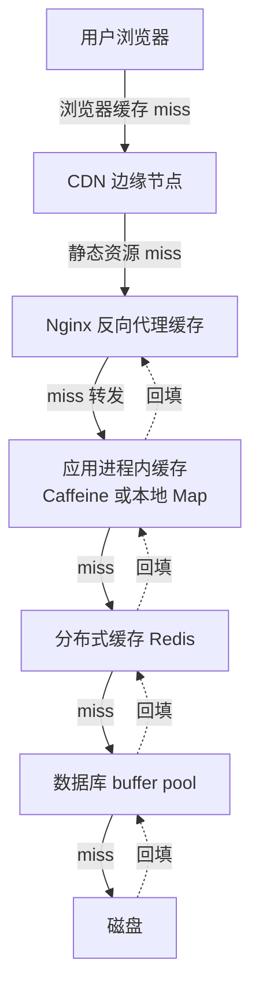
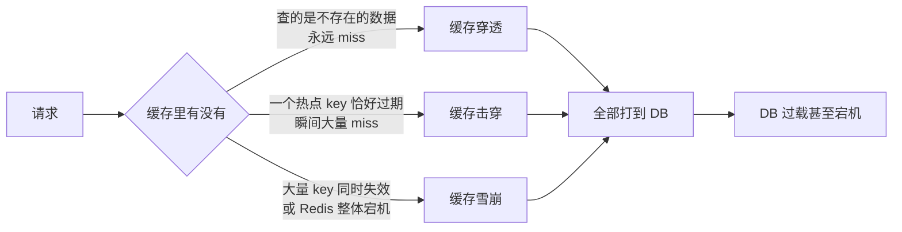
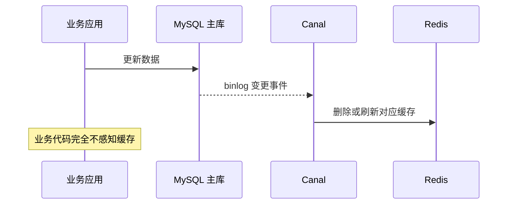

# 01 缓存体系：高并发系统的第一板斧

> **优先级档位**：第一档（面试出现率最高的后端题，几乎场场必问）
> **预计阅读时间**：约 25 分钟
> **一句话定位**：缓存不是"加个 Redis"这么简单，它是一套贯穿存储金字塔的取舍体系——这篇建立你的全景心智模型。

## TL;DR

- 缓存存在的根本原因：存储介质之间存在 5-6 个数量级的速度鸿沟，内存访问比磁盘快约十万倍，比跨机房网络快约百万倍。
- 缓存是一条链路而不是一个点：浏览器 → CDN → Nginx → 进程内缓存 → Redis → DB，离用户越近越快但越难管，越近 DB 越准确但越慢。
- 读写策略的事实标准是 Cache Aside（旁路缓存）：读时 miss 回填，写时"先更新数据库，再删缓存"。
- 三大经典问题的口诀：穿透=查不存在的数据，击穿=一个热点 key 过期瞬间，雪崩=一大片 key 同时失效。解法分别对应布隆过滤器、互斥锁/逻辑过期、随机 TTL+兜底。
- "删缓存"而不是"更新缓存"，是为了避免并发写交错导致脏数据，以及避免缓存被高成本计算结果污染。
- 缓存一致性没有银弹：工程上只承诺最终一致，追求强一致的字段（如金额）就不要走缓存路径。
- 热点 key 靠本地缓存承接和 key 拆分，大 key 靠拆分和异步删除；这两个问题是上线后真正烧起来的地方。
- Redis 快的本质是内存 + 单线程事件循环 + IO 多路复用；6.x 之后引入 IO 线程，但命令执行仍是单线程。

## 引子

想象你的财务系统上线半年，报表模块跑得好好的。某月最后一天，财务部门 200 人同时打开"本月应收汇总"——这个页面背后是一条聚合 SQL，扫 400 万条明细，按客户、按税率分组汇总，单次执行 8 秒。

8 秒是什么概念？假设数据库每秒只能并行扛住十几个这样的查询，200 人同时刷新，数据库连接池瞬间打满，慢查询互相锁竞争，整个库开始抖动——然后发票模块、对账模块一起变慢，因为它们共用同一个库。

这就是高并发世界的入门课：**大多数"并发问题"的本质，是大量请求重复做同一件昂贵的事。** 而缓存要解决的就是这一件事：把算过一次的答案记下来，下一次直接给。

200 人查同一份月度汇总，真正需要执行的聚合只有 1 次，剩下 199 次应该直接拿到结果。这就是缓存的第一性原理。

## 一、为什么缓存是第一板斧

### 1.1 存储介质速度金字塔

一切缓存设计的地基，是这张数量级表（行业公认的近似值，不同代硬件有出入，记住数量级即可）：

| 存储介质 | 典型访问延迟 | 相对内存 |
|---|---|---|
| CPU L1/L2 缓存 | ~1 ns | 1/100 |
| 内存（DRAM） | ~100 ns | 1 |
| SSD 随机读 | ~100 μs | 1,000 倍 |
| 机械磁盘随机读 | ~10 ms | 100,000 倍 |
| 同机房网络往返（RTT） | ~0.1-0.5 ms | 1,000 倍 |
| 跨地域网络往返 | ~30-100 ms | 百万倍级 |

三条由这张表推出的工程直觉：

1. **磁盘随机 I/O 是系统里最容易成为瓶颈的资源。** 数据库慢，八成慢在这里。
2. **内存是最贵的快介质，所以缓存容量永远是稀缺资源**，必须有淘汰策略（LRU/LFU），不可能"什么都往里放"。
3. **网络本身也是一层"慢存储"**——这就是为什么 CDN、浏览器缓存存在：把数据搬到离用户物理更近的地方，消灭的是网络延迟而不是磁盘延迟。

金字塔还有一层隐含信息：**越往上越快，也越贵、越小、越易失。** CPU 缓存以 KB/MB 计，内存以 GB 计，磁盘以 TB 计——所以"全量数据放内存"从来不是选项，缓存设计的核心命题恰恰是：在有限的内存里，放哪些数据、留多久、怎么踢掉旧的，才能让命中率最大化。淘汰策略（LRU 最近最少使用、LFU 最不经常使用）本质上就是在回答"谁不配留在金字塔上层"。

顺带把单位感建立起来：1 秒 = 1,000 毫秒（ms）= 100 万微秒（μs）= 10 亿纳秒（ns）。面试里说"内存比 SSD 快一千倍"，你要能立刻反应出这是 100 ns 对 100 μs 的差距，而不是背一个孤立数字。

### 1.2 "缓存思维"的前端对应物

你其实早就写过缓存了，只是没这么叫它：

- `React.memo` / `useMemo`：输入（props/deps）没变，就不重新计算（渲染）——这就是缓存命中。
- React Query / SWR：服务端状态缓存，`staleTime` 是 TTL，`invalidateQueries` 是主动失效，重验证就是回源。
- 浏览器 HTTP 缓存：`Cache-Control: max-age` 是 TTL，ETag 是回源时的版本号协商。

后端缓存的所有核心概念——TTL、命中/未命中、主动失效、回源、一致性窗口——在前端都有精确对应。学这篇时，把 Redis 当成"服务端版的 React Query"，心智负担会小很多。但注意一个关键差异：前端缓存出问题最多 UI 旧一秒，后端缓存出问题可能是整个系统雪崩——所以后端对"失效"和"并发"的讲究要深得多，这正是本篇的主体。

## 二、多级缓存全景

一个真实的线上系统，缓存不是一层，而是一条链。请求像过关一样一层层打下来，任何一层命中就直接返回，不再往下走。



| 层级 | 容量量级 | 延迟量级 | 定位 | 适合放什么 |
|---|---|---|---|---|
| 浏览器缓存 | 每用户 MB 级 | 0 ms | 消灭请求本身 | 静态资源、不常变的公共数据 |
| CDN | 全网 PB 级 | ~10-50 ms | 消灭跨地域网络 | 图片、JS/CSS、整页静态化内容 |
| Nginx 缓存 | GB 级 | ~1 ms | 应用前的闸门 | 高频读、更新不敏感的接口响应 |
| 进程内缓存（Caffeine/本地 Map） | MB-GB 级 | ~100 ns-1 μs | 消灭网络跳数 | 极热点、容忍节点间短暂不一致的数据 |
| Redis | GB-TB 级 | ~0.5-1 ms | 共享的内存层 | 绝大多数业务缓存 |
| DB buffer pool | 内存的几分之一 | ~10 μs | 数据库的自救 | 热数据页、索引页（DBA 层面的事） |

取舍的核心规律：**离用户越近，越快、越省服务端资源，但数据越难失效；离 DB 越近，越准确、越易管理，但越扛不住流量尖峰。**

两个高频追问点：

- **为什么有了 Redis 还要进程内缓存？** 因为 Redis 再快也要一次网络往返（约 0.5-1 ms）+ 序列化开销。一个 QPS 十万级的超级热点 key，全打到 Redis 单机也会把它打爆。进程内缓存把热点直接消化在应用内存里，代价是多实例之间数据可能短暂不一致，且实例重启即丢——所以只适合"旧一点没关系"的数据。
- **每层都要有吗？** 不。中小系统通常只有"浏览器 + CDN + Redis + buffer pool"四层。进程内缓存和 Nginx 缓存是流量大到一定程度才加的优化，加了它们系统复杂度上一个台阶（失效链路变长）。判断维度：该层能否消灭一个真实存在的瓶颈？消灭不了就别加。

**什么数据该放哪层？三个问题做分流：** 一问"改了之后多久必须被看到"——分钟级容忍度放 Redis，秒级容忍度才能上进程内缓存，完全不能旧的不进缓存；二问"单个实例读还是全系统读"——只服务于单实例自身状态的数据放本地，跨实例共享的状态必须放 Redis；三问"miss 一次的成本有多高"——回源要扫 400 万行的聚合必须尽量在上层拦下来，回源只是一次主键查询的数据，放不放缓存先算投入产出。这三个问题答完，层级选择基本唯一确定。

## 三、缓存读写策略：面试的主战场

### 3.1 Cache Aside（旁路缓存）：事实标准

这是 95% 的业务系统在用的模式，也是面试的默认语境。流程必须能闭眼画出：

**读流程：**
1. 先查缓存，命中 → 直接返回。
2. 未命中（miss）→ 查数据库。
3. 把查到的结果写回缓存（回填，带 TTL），返回。

**写流程：**
1. 先更新数据库。
2. 再删除缓存（注意：是删，不是更新）。

```text
读：get(key) -> hit? return : db -> set(key, value, ttl)
写：updateDB(...) -> del(key)
```

为什么是"删缓存"而不是"更新缓存"？三个理由，层层递进：

1. **懒加载效率**：更新后的值如果短时间没人读，这次更新缓存就是白算。删除让下一次读自然回填，只对真实发生的读付出计算成本——这叫 lazy evaluation，和前端的按需加载一个道理。
2. **缓存值可能是计算结果而非原始数据**：如果缓存的是 join 三张表再聚合的结果，"更新缓存"意味着写方也要会算这个结果，职责就脏了。删缓存把"怎么算"的知识只留在读路径一处。
3. **并发写交错会留下永久脏数据**：两个写请求 A、B 并发更新同一个 key，若都是"更新缓存"，网络延迟可能让 A 的旧值后于 B 的新值落到缓存里，且因为没有下一次写来纠正，这个脏值会活到 TTL 到期。删除操作是幂等的、无顺序敏感的——无论 A 删 B 删谁先谁后，最终缓存里都是空的，下次读回填的一定是新值。

### 3.2 经典追问：先删缓存还是先更新数据库？

这是缓存面试的第一连招。把两个方案都推演一遍，你就明白为什么标准答案是"先更新库，再删缓存"：

**方案一：先删缓存，再更新数据库**
```text
时刻1：线程A 删除缓存 key
时刻2：线程B 读请求，缓存 miss，查库（还是旧值 v1）
时刻3：线程B 回填缓存 = v1
时刻4：线程A 更新数据库 = v2
结果：数据库是 v2，缓存是 v1，脏数据活到天荒地老（TTL 到期前）
```
这个时序很容易发生，因为"查库+回填"通常比"删缓存"慢半拍。

**方案二：先更新数据库，再删缓存（标准答案）**
```text
时刻1：线程A 更新数据库 = v2
时刻2：线程B 读请求，缓存命中旧值 v1，返回（此刻不一致，但窗口极短）
时刻3：线程A 删除缓存
时刻4：线程C 读请求，miss，查库拿 v2，回填
结果：短暂不一致窗口后恢复一致
```
方案二的不一致窗口只在"更新库"到"删缓存"之间的毫秒级时间，而且要求恰好此刻有读命中旧值——概率远低于方案一的时序。这不是完美，而是**在工程成本下概率最优的选择**。

还有第三个变体"先删缓存 → 更新库 → 延迟再删一次缓存"（延迟双删），见第六节。

### 3.3 其他三种策略的定位

- **Read Through（读穿透）**：读逻辑下沉到缓存组件内部——应用只问缓存要数据，miss 时由缓存自己去查库回填。本质是 Cache Aside 的读侧被封装进基础设施（如 Spring Cache 的某些实现、CDN 的回源逻辑）。代价：缓存层和 DB 耦合，灵活性下降。
- **Write Through（写穿透）**：写请求先写缓存，缓存同步写 DB，都成功才返回。优点：缓存永远和 DB 一致（缓存即真相）；代价：每次写多一跳延迟，且会缓存大量从不被读的数据（违背懒加载原则）。
- **Write Behind（写回/异步写）**：写只写缓存，缓存异步批量刷回 DB。优点：写性能极致，还能合并多次写；代价：**宕机丢数据**，异步刷盘的窗口内数据只在内存里。适用场景：可丢失的高频写——点赞计数、浏览量、统计埋点。财务系统严禁用于任何金额数据。

### 3.4 四种策略对比表

| 方案 | 原理 | 优点 | 代价 | 适用场景 |
|---|---|---|---|---|
| Cache Aside | 应用自己管：读 miss 回填，写后删缓存 | 懒加载高效、逻辑简单、缓存层与 DB 解耦 | 存在短暂不一致窗口；miss 逻辑散落在应用代码里 | 绝大多数业务系统的默认选择 |
| Read Through | 缓存组件代管回源 | 应用代码干净，回源逻辑集中 | 缓存层与 DB 耦合，需基础设施支持 | 有成熟缓存中间件的团队、CDN 回源 |
| Write Through | 写先落缓存再同步落库 | 缓存与库强一致 | 写延迟叠加；缓存非懒加载、浪费容量 | 写少读多且对一致性敏感的窄场景 |
| Write Behind | 写只落缓存，异步批量刷库 | 写吞吐极高、可合并写 | 宕机丢数据；实现复杂 | 计数器、统计类可丢失数据 |

## 四、三大经典问题：穿透、击穿、雪崩

面试必考三连，也是线上事故三连。三者名字相近但成因、流量特征、解法完全不同，混淆它们等于告诉面试官你没分清问题——先建立区分的心智模型，再逐个推演：



### 4.1 缓存穿透（Cache Penetration）：查询不存在的数据

**成因推演**：攻击者（或写错的前端代码）用随机 ID 批量查询：`/invoice/000001`、`/invoice/000002`……这些 ID 在数据库里根本不存在。缓存的机制决定了：查不到就无法回填（没有结果可存），于是每个请求都穿透缓存直达数据库。缓存形同虚设，DB 被打满。

**方案一：空值缓存（Cache Null）**。查库返回空，也把"空"写进缓存，TTL 设短一点（如 30-60 秒）。下一次同样的 key 直接命中空值返回。
- 优点：实现一行代码。
- 代价：攻击者每次换不同的 key 就失效（缓存了十万个不同的空值，白白占用内存，甚至把好数据挤出去）；且空值缓存期内，如果这条数据真的被创建了，会出现短暂不一致。

**方案二：布隆过滤器（Bloom Filter）**。请求进 DB 之前先过一道"存在性预判"。原理必须能讲清：

- 本质是一个很长的**位数组（bit array）+ k 个哈希函数**。
- 加入一个元素：用 k 个哈希函数算出 k 个位置，全部置 1。
- 查询一个元素：算出 k 个位置，**只要有任何一位是 0，这个元素一定不存在**（直接拦截）；**如果全是 1，元素"可能存在"**——因为那些 1 可能是别的元素凑出来的。

由此推出布隆过滤器的三个特性（每个都是面试考点）：
1. **有误判率（false positive），但绝不漏判**：说存在的不一定真存在（放行去查库，查个空也无妨），说不存在的一定不存在（可以放心拦截）。
2. **不支持删除**：把某位清 0 可能误伤共用这一位的其他元素。变体方案一句话：Counting Bloom Filter 把 bit 换成计数器从而支持删除（空间换功能）；Cuckoo Filter 用指纹+踢出机制支持删除且误判率可控，是近年更常用的替代。
3. **空间效率极高**：存一亿个 ID，误判率 1% 时大约只需一百多 MB 内存。

参数直觉（面试可能追问"怎么调"）：位数组越大、哈希函数个数 k 越合适，误判率越低；经验值是误判率 1% 时每元素约需 9.6 bit，k 取 7 左右。不用背公式，记住权衡方向：**内存和误判率互换，预算内选一个业务能接受的上限**。工程上不需要自己实现——RedisBloom 模块（8.x 已内建）或 Guava 的 BloomFilter 都是现成方案。
- 代价：需要维护过滤器与 DB 的同步（新数据要写进过滤器）；误判的请求会放行进 DB（可接受，因为比例极低）；实现比空值缓存复杂。

**怎么选**：误判可容忍、key 集合可枚举（如合法的 ID 段）→ 布隆过滤器；key 无法预估、偶发查询 → 空值缓存。实战里两者常叠加：布隆过滤器挡恶意扫描，空值缓存兜住漏网的重复查询。

### 4.2 缓存击穿（Cache Breakdown）：热点 key 过期瞬间

**成因推演**：某个 key 承载了全站 30% 的读流量——比如首页的"本月汇率表"，或者秒杀活动页。它的 TTL 到期那一瞬间，1 万个并发请求同时 miss，同时去查库、同时回填。DB 被同一个查询并发执行一万次，CPU 打满。注意与穿透的区别：穿透是"查不存在的"，击穿是"查存在但恰好过期"。

**方案一：互斥锁重建（Mutex Rebuild）**。miss 时不直接查库，先抢一把锁（Redis `SET key value NX PX` 原子加锁或本地锁）：抢到的线程去查库回填，其余线程自旋等待/短暂休眠后重读缓存。两个实现细节：拿到锁后要**再查一次缓存**（双重检查，防止排队期间别人已回填，白白再查一次库）；锁必须带超时时间，防止持锁线程宕机造成死锁。
- 优点：DB 只被执行一次回源，结果绝对正确。
- 代价：热点期间大量请求被阻塞等待，接口 P99 延迟飙升；分布式锁本身有死锁风险（要设锁超时）；实现复杂。

**方案二：逻辑过期（Logical Expiration）**。不给 key 设物理 TTL，把过期时间塞进 value 里。读请求发现逻辑上已过期，不等待——**直接返回旧数据**，同时异步起一个线程去回源刷新。
- 优点：永远零阻塞，延迟平滑。
- 代价：过期窗口内返回的是旧数据（牺牲一致性换可用性）；异步刷新要控制并发（否则退化成没锁）；key 永不物理过期，内存只增不减，需要配合淘汰策略或定期清理。

**怎么选**：判断维度是"这个 key 的旧值能不能用"。能容忍秒级旧值（排行榜、汇率展示、配置）→ 逻辑过期；必须精确（库存余量、价格）→ 互斥锁。这条判断链本身就是面试加分项。

### 4.3 缓存雪崩（Cache Avalanche）：大面积同时失效

**成因推演**，两种触发方式：
1. **大量 key 同时过期**：常见于系统启动时批量预热缓存，所有 key 设了同样的 TTL（比如都是 3600 秒），一小时后整片森林同时倒下。
2. **Redis 实例宕机**：整个缓存层消失，全量流量倾泻到 DB。

**方案：**

- **随机 TTL**：基础 TTL 上加随机抖动，如 `3600 + random(0, 600)` 秒。成本为零，是过期类雪崩的标准解法，必须做。
- **错峰过期**：预热时刻意按业务分批设置不同 TTL，让失效曲线摊平。

**缓存预热（Cache Warmup）**是雪崩话题的另一半：系统上线或缓存清空后，缓存是空的，开闸瞬间所有请求全部 miss 打到 DB——这叫"冷启动冲击"。正确姿势是开流量前先把可预知的热点数据（首页配置、字典表、当月报表）批量灌入缓存，且灌入时就带随机 TTL，避免这批数据日后同时到期。不可预知的长尾数据不预热，靠自然 miss 回填即可。判断维度：读流量是否集中在可枚举的 key 集合上——是则预热，否则不值得。
- **多级缓存兜底**：进程内缓存扛住 Redis 抖动的那几秒；Redis 真挂了，本地缓存还能返回旧数据。
- **熔断降级**：Redis 不可用时，对非核心接口直接返回降级内容（默认值/静态页），保护 DB 不被打穿——这是第 07 篇的主题，这里只记住一句：**缓存挂了要有 Plan B，Plan B 叫降级，不叫硬扛。**
- **Redis 高可用**：主从+哨兵/集群，把"Redis 宕机"本身的概率压下去（详见第 06 篇）。

**三者辨析口诀**：穿透是"key 不存在"，击穿是"一个 key 太烫"，雪崩是"一片 key 一起死"。解法上，穿透用过滤器/空值，击穿用锁/逻辑过期，雪崩用 TTL 打散/兜底/高可用。

## 五、热点 key 与大 key：上线后真正烧起来的地方

三大问题是"过期语义"的问题，热点和大 key 是"数据分布"的问题，面试里常以"你们线上缓存出过什么事故"的形式出现。

### 5.1 热点 key（Hot Key）

**怎么发现**：靠监控而不是猜。手段有三层——Redis 4.0+ 的 `hotkeys` 命令（需 LFU 淘汰策略）、代理层（如 Twemproxy/自研 proxy）统计 key 维度 QPS、客户端埋点采样上报。量级认知：单 key QPS 超过几万、或单 key 带宽超过百 MB/s，就到了要处理的程度。

**怎么处理**：
1. **本地缓存承接**：最热的一小撮 key 在应用进程内再缓存一份（Caffeine，TTL 几秒），把绝大部分读流量消化在本地，Redis 只承担回源。代价是多实例间秒级不一致。
2. **key 拆分读写**：把 `hotkey` 拆成 `hotkey:1` 到 `hotkey:N`，读时随机路由到一个副本，写时更新全部副本。用 N 倍存储换 N 倍读吞吐。适合"读巨多、写少"的场景。
3. 两者常叠加：本地缓存消化 90%，副本分摊剩下的。

### 5.2 大 key（Big Key）

**危害**（每条都对应一种真实事故）：
- **阻塞**：Redis 命令执行是单线程，对一个 100MB 的 hash 做 `HGETALL`，或 `DEL` 一个大 key，会把整个实例卡住几十到几百毫秒——期间所有请求排队。
- **网络**：一个 10MB 的 value 被高频读，能把网卡打满。
- **内存倾斜**：集群模式下大 key 落在哪个分片，哪个分片就内存吃紧，负载均衡失效。

**处理思路**：预防大于治疗——value 设上限（如 string 超 10KB、集合类元素超 5000 个就告警）；业务上拆分，大 hash 按字段拆成多个小 hash，大 list 按时间分片；删除用 `UNLINK`（异步删，4.0+）代替 `DEL`；发现靠 `bigkeys` 扫描加监控告警。

线上排查的通用动线也值得记住：Redis 响应变慢 → 先看监控里慢查询日志（slowlog）锁定命令 → 判断是否大 key 操作（`HGETALL`、`KEYS`、`SMEMBERS` 大集合是三大惯犯）→ 再查内存分布是否倾斜 → 最后落到拆分或删除方案。`KEYS *` 要单独点名：它是全库扫描，生产环境等于自杀，排查用 `SCAN` 分批迭代。

## 六、一致性取舍：缓存放下的，就别想捡回来

这是本篇最该建立的一条世界观：**引入缓存的那一刻，你就已经放弃了强一致。** 后面所有技巧，都只是在控制"不一致窗口的大小"和"出事的概率"。

### 6.1 延迟双删及其局限

针对 3.2 节的并发时序，有人提出补丁：先删缓存 → 更新数据库 → **延迟几百毫秒再删一次缓存**。第二次删除是为了清掉"更新 DB 期间被并发读回填的旧值"。

它有效，但局限必须说清楚：
- 延迟多久是拍脑袋的——设短了兜不住慢查询回填，设长了窗口依旧存在。
- 第二次删除本身可能失败（网络抖动），需要重试机制，复杂度继续上升。
- 主从架构下，读请求可能从还没同步完的从库读到旧值回填，延迟时间还得覆盖主从延迟。

结论：延迟双删把不一致概率从"低"压到"更低"，但**数学上无法归零**。它值得用在重要数据上，不值得迷信。

### 6.2 binlog 订阅：异步失效的工程化形态

更系统的做法是：业务代码只管写数据库，由独立的中间件（阿里开源的 Canal 是事实标准）伪装成 MySQL 从库订阅 binlog（二进制日志），解析出数据变更后投递消息，消费者负责删缓存/刷新缓存。



优点：缓存失效逻辑从业务代码彻底剥离，不再有"忘了删缓存"的人为疏漏；binlog 是有序可靠的，失败可以重投递。代价：引入一套中间件，运维成本和链路复杂度上升；异步链路带来毫秒到秒级的失效延迟；消息乱序、重复消费要处理。判断维度：缓存失效点散落在几十个写接口里、人工维护已经出错 → 上 binlog 订阅；写路径只有两三个 → Cache Aside 手动删缓存就够了。

### 6.3 工程现实：最终一致，以及什么时候干脆别用缓存

所有方案收敛到同一个结论：**缓存系统承诺的是最终一致性（Eventual Consistency）**，窗口从毫秒到 TTL 不等。那么判断"某个数据能不能用缓存"的维度就清晰了：

- 不一致窗口内读到旧值，业务后果是什么？展示旧了一秒的报表 → 无所谓，缓存。多收/少收了钱 → 不可接受，不缓存。
- 强一致诉求的正确姿势不是"把缓存做得更一致"，而是**这条链路不走缓存**，直接读库（必要时读主库），用索引和 SQL 优化扛性能。你的财务系统里，金额、余额、发票状态机正是这种数据——见第十节。

## 七、Redis 认知层：为什么快、怎么选型

### 7.1 为什么 Redis 快

面试标准答案三件套，要理解而不是背：

1. **纯内存操作**：数据全在内存，没有磁盘 I/O 的路径，这是快的根本（对照第一节金字塔）。
2. **单线程事件循环 + IO 多路复用**：一个线程通过 epoll/kqueue 同时监听成千上万个连接，哪个连接有数据就处理哪个，没有线程切换和锁竞争的开销。单线程对 CPU 密集是劣势，但 Redis 的操作都是 O(1)/O(log n) 的内存操作，瓶颈在网络和内存带宽，不在 CPU——所以单线程反而是最优解。这个模型你其实很熟：它就是服务端版的 Node.js 事件循环——单线程跑事件队列，IO 交给操作系统通知，不阻塞等待。
3. **高效的数据结构**：SDS、跳表、压缩列表、quicklist 等为内存场景专门设计（面试点到为止，不展开）。

2026 视角补一句：**Redis 6.0（2020）起引入 IO 线程**，把网络读写和协议解析分摊给多线程，命令执行仍是单线程——这个设计沿用至今（现行稳定版 7.2+/8.x），所以"Redis 是单线程"这句话要会纠正为"命令执行单线程，网络 IO 多线程"。8.x 进一步整合了模块生态（查询引擎、JSON、向量检索内建），但缓存用法没变。

### 7.2 数据结构选型速查表

| 结构 | 一句话特征 | 典型场景 |
|---|---|---|
| String | 万能基础类型 | 缓存对象（JSON 序列化）、计数器（INCR）、分布式锁（SET NX PX） |
| Hash | 字段级读写的对象 | 用户信息、字典表——比整个 JSON 存 String 省内存、支持改单字段 |
| List | 有序双端队列 | 简单消息队列、最新 N 条动态（LPUSH + LTRIM） |
| Set | 去重集合 | 标签、共同好友、抽奖去重 |
| ZSet（Sorted Set） | 带分数的有序集合 | 排行榜、延迟队列（score 存时间戳）、按权重调度 |
| Bitmap | 位图（String 的位操作） | 签到打卡、在线状态、日活统计——一亿用户签到一年只占几十 MB |
| HyperLogLog | 基数估算，误差约 0.81% | UV 统计，12KB 估算任意大的集合 |
| Stream | 持久化消息流 | 轻量级消息队列，比 List 多了消费者组 |

选型心法一句话：**先想清楚你对这个数据做什么操作，再选天然支持该操作的结构**——用 String 存整个 JSON 再整体改写，通常是用错结构的信号。

### 7.3 持久化一句话

Redis 是内存数据库，断电即失，所以提供 RDB（定时全量快照，恢复快但可能丢最近数据）和 AOF（追加写日志，丢得少但文件大、恢复慢），生产通常混用。高可用靠主从复制+哨兵/集群。**细节全部留给第 06 篇**，本篇只需知道：Redis 可以落盘，但缓存用法不该依赖它的持久化——缓存的备份是数据库本身。

## 八、面试视角

**面试官怎么考**：缓存题几乎从不孤立出现，标准连招是"项目里哪用了缓存 → 为什么这么用 → 出过什么问题 → 并发下怎么办"。考察的不是名词，而是**推演能力**——给你时序你能不能推出脏数据，给你场景你能不能选对策略。

**问题一：缓存穿透、击穿、雪崩的区别和解决方案（出现率最高）**

回答骨架：
1. 先给定义区分（不存在/单点热点过期/大面积失效），展示你理解的是流量模式而非背名词。
2. 逐个给方案+代价：穿透→布隆过滤器（讲位数组+多哈希、有误判不漏判、不可删除）+空值缓存；击穿→互斥锁（强一致但阻塞）与逻辑过期（零阻塞但返回旧值），点明取舍维度是"旧值能否容忍"；雪崩→随机 TTL+错峰+多级兜底+熔断降级+Redis 高可用。
3. 收尾加分：提一句这三者最终都会压向 DB，所以兜底思路一致——**保护 DB 是缓存设计的最高纲领**。

**问题二：为什么删缓存不更新缓存？先删缓存还是先更新库？**

回答骨架：
1. 删不更新：懒加载效率、缓存值可能是计算结果、并发写交错产生永久脏数据，三条递进。
2. 顺序推演：先给"先删缓存"的失败时序（读请求在删与写之间回填旧值），再给"先更新库再删缓存"的短窗口，承认不完美但概率最优。
3. 追问应对：延迟双删（说清楚延迟时间的拍脑袋本质）、Canal 订阅 binlog（工程化解法）、最终一致性是理论上限——面试官要的就是你主动说出"无法强一致"。

**问题三：如果让你设计一个缓存系统，你会考虑哪些点？（开放题）**

回答骨架（分层铺开，展示体系感）：
1. 读写策略选型（默认 Cache Aside）。
2. 容量与淘汰：LRU/LFU、TTL 设计（加随机抖动）。
3. 三大问题的预案。
4. 热点 key/大 key 的监控与处理。
5. 一致性承诺级别：向业务方明确"最终一致+窗口大小"，强一致数据不走缓存。
6. 可观测：命中率、miss 原因、回源耗时的监控——**没有命中率数据的缓存系统是盲飞**。

**问题四：Redis 为什么快？常用数据结构怎么选？（基础题，答错直接挂）**

回答骨架：
1. 快的三点：纯内存、单线程事件循环+IO 多路复用（补一句"6.0 后网络 IO 多线程、命令执行仍单线程"，展示信息时效性）、高效数据结构。
2. 选型按操作选结构：计数/锁→String，对象字段级读写→Hash，排行榜/延迟队列→ZSet，签到/在线状态→Bitmap，UV 估算→HyperLogLog。点一句心法：先想操作再选结构。
3. 主动补一个反面例子："用 String 存大 JSON 整体改写"是常见误用，说明你有真实使用手感。

**经典追问连招**：你们的命中率是多少（没有数 = 没做过）→ miss 时回源会不会打爆 DB（答互斥锁/回源限流）→ Redis 挂了怎么办（降级+多级缓存）→ 怎么保证 DB 和缓存一致（按问题二推演）→ 热点 key 怎么处理（本地缓存+拆分）→ 布隆过滤器为什么不可删除（位共享，变体 Counting BF/Cuckoo Filter）。

## 九、常见误区

1. **以为缓存加得越多系统越快。** 缓存的价值由命中率决定，不由数量决定。命中率 30% 的缓存层，带来的是双倍复杂度和微弱收益。正确思维是先算"这个数据的读频率 × 单次计算成本"，乘积不高就不值得缓存。
2. **以为"先更新库再删缓存"就一致了。** 它只是概率最优，不一致窗口和失败时序依然存在；双删、Canal 都是降压不是消除。对一致性有强诉求的数据，答案是不走缓存，而不是更复杂的缓存。
3. **以为布隆过滤器能精确判断存在。** 它只会说"一定不存在"和"可能存在"——误判率是设计参数，不是 bug；且标准实现不可删除，数据频繁失效的场景要考虑 Cuckoo Filter 或干脆空值缓存。
4. **以为给所有 key 设一样的 TTL 是规范管理。** 这恰恰是雪崩的温床。TTL 必须带随机抖动，这是少数"零成本必做"的优化。
5. **以为 Redis 挂了系统只是"慢一点"。** 没有降级预案时，缓存层消失等于全量流量砸向 DB，结局是 DB 宕机、系统全崩——缓存的可用性设计本质是"缓存没了系统怎么活"。

## 十、与我的财务系统的关联

结合你的三个模块，给明确的落地判断：

**报表模块——缓存的最佳战场。** 多维报表（按客户/税率/月份的应收汇总）是天然的"读多写少+允许分钟级旧数据"场景。落地姿势：**缓存预聚合结果而不是明细**——key 由查询条件哈希构成（如 `report:receivable:2025-12:customer_all`），value 是聚合结果，TTL 设 5-30 分钟并加随机抖动；配合主动失效（月底关账、凭证过账后删除相关 key）。400 万明细的聚合查询从秒级降到毫秒级，这就是引子里 200 人同时刷新场景的解法。同时警惕击穿：月底高并发刷新时，用逻辑过期（先返回上次的报表+后台异步重算）比互斥锁更顺滑，因为报表旧一分钟完全可接受。

**数据字典/税率/科目表——进程内缓存的完美候选。** 这类数据全系统高频读取、几个月才改一次，放 Redis 都嫌浪费网络跳数：直接 Caffeine 进程内缓存，TTL 一小时，改了重启或广播失效即可。税率表变更这种低频事件，用一次人工清缓存解决，不值得上 binlog 订阅。

**对账状态查询——Redis 标准缓存场景。** 对账批次的状态（处理中/已完成/差异 N 条）被用户反复刷新查看，状态机推进由后台任务驱动——适合 Cache Aside：状态变更时删缓存，查询 miss 回填。这里可以直接用上先更新库再删缓存的标准模式。

**落地工具一句话**：你在学的 NestJS 生态里，`@nestjs/cache-manager` 是官方缓存抽象，默认内存 store，换 Redis 只需替换 store 配置——抽象理念正是 Cache Aside 的框架化。但读完本篇你应该明白：框架只帮你写了"读 miss 回填"那一半，"写后删缓存""TTL 抖动""热点保护"这些真正要命的部分，框架管不了，得自己设计。

**明确的禁区**：金额、余额、税额计算结果**不缓存**。原因有二：其一，金额是强一致数据，缓存的一致性窗口在财务语义里不可接受（用户改了发票再刷新，看到旧金额就是事故）；其二，金额计算本身不贵（内存里的算术），缓存它收益为零。**记住这句话：缓存的是查询结果，不是业务事实。** 报表缓存的是"某个条件下的统计快照"，快照允许旧；而每一笔发票金额是事实本身，永远从库里读、从规则里算。

## 小结

缓存的本质是用内存的空间和一致性的妥协，去换存储金字塔上 5-6 个数量级的速度差。学这篇的正确姿势不是背"三大问题四种策略"，而是建立三条主线：**速度金字塔决定缓存为什么存在，Cache Aside 的并发推演决定缓存怎么用，最终一致性决定缓存的边界在哪。** 三大问题、热点大 key、布隆过滤器，都只是这三条主线上的具体补丁。面试时能把"保护 DB"和"一致性窗口"这两个纲领挂在嘴上，就已经超越了背八股的竞争者。下一篇我们看缓存扛不住之后怎么办：限流——系统主动说"不"的能力。

## 延伸阅读

- 《Redis 设计与实现》（黄健宏）——数据结构章节是选型速查表的完整版
- Redis 官方文档（redis.io）的 eviction、bigkeys、Bloom filter 条目
- 《Designing Data-Intensive Applications》（Martin Kleppmann）——缓存一致性与派生数据的世界观源头
- 阿里 Canal 项目文档——binlog 订阅失效的工程实现
- 美团技术团队博客的缓存系列文章——热点 key、多级缓存的一线实践
- Caffeine 官方 Wiki（Ben Manes）——进程内缓存的设计哲学与淘汰算法（W-TinyLFU）
