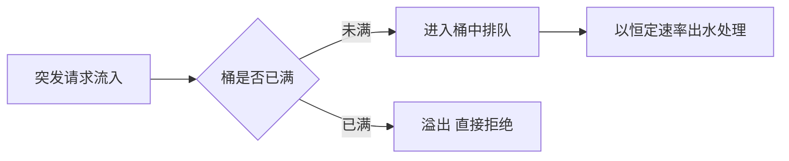
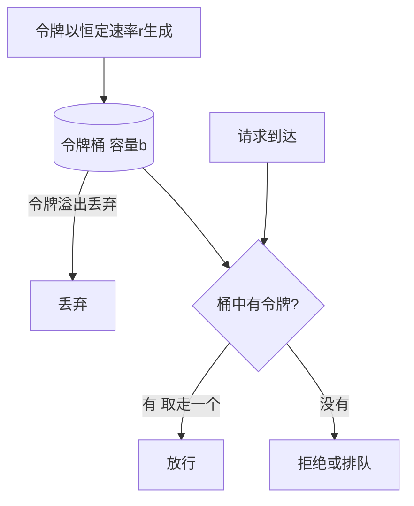

# 02 限流：系统的第一道防线

> **优先级档位**：第一档（常与缓存、熔断组合出题）
> **预计阅读时间**：25 分钟
> **一句话定位**：限流是系统面对过量请求时的"主动拒止"能力——宁可拒绝一部分，也不能全部被打垮。

## TL;DR

- 限流（Rate Limiting）保护的是**自己**：请求太多，超出容量水位，主动拒绝多余的部分，保住剩余请求的服务质量。
- 限流和熔断方向相反：限流是服务端防"入口被打爆"，熔断是调用方防"下游拖垮自己"，两者组合使用。
- 四种经典算法按工程地位排序：令牌桶（Token Bucket）是主流，允许可控突发；漏桶（Leaky Bucket）强制匀速；滑动窗口精度高但成本高；固定窗口最简单但有边界 2 倍突刺。
- 单机限流在集群下会失效：N 台机器 × 单机阈值 ≠ 全局限值，全局限流要用 Redis + Lua 做原子计数。
- 限流要分层：网关层挡流量型攻击和粗粒度总量，应用层做精细业务限流，服务层防内部雪崩，各管一段。
- 被限流后怎么办和怎么限流同样重要：直接拒绝（429）、排队等待、降级兜底、预热（Warmup）四种拒止策略按场景选择。
- 阈值不是拍脑袋：从压测水位反推（第 09 篇容量规划展开），先进系统支持动态/自适应限流。
- 并发数限流和 QPS 限流是两回事：QPS 低但单请求耗时长时，并发数先把你打垮。

## 引子

大促当晚，你的对账系统出了一个奇怪的事故：白天一切正常，晚上 21:00 一到，接口耗时从 200ms 一路飙到 8s，然后整台服务器无响应，所有请求——包括那些本来很轻量的查询——全部超时。

排查下来原因很"朴素"：运营在 21:00 给全量商户推送了一条"点击下载本月对账单"的消息。几千个商户在同一分钟点开了导出按钮，每个导出请求要扫描 400 万行明细、聚合生成 Excel。服务器线程池瞬间被导出请求占满，DB 连接池耗尽，CPU 打满，于是连"查询发票状态"这种本来 50ms 的接口也一起死了。

这个事故里没有任何代码 bug，系统死于**没有说"不"的能力**。如果当时导出口子有一个简单的限流——比如"导出接口全系统最多同时 5 个在跑，超出的排队或稍后重试"——那么 95% 的接口会完全无感。

这就是限流要解决的核心问题：**当请求量超过系统容量时，主动拒绝一部分请求，保住系统不垮、保住被放行的请求的服务质量。** 它的哲学是"舍小保大"——拒绝是不可避免的损失，崩溃才是不可接受的损失。

换个角度看，限流其实是在管理系统的**超载经济学**：任何系统的容量都是有上限的（CPU、线程池、连接池、内存、下游带宽），当需求超过供给，你必须选择一种"超额请求的处置方式"。不限流的系统不是没有处置方式，而是把处置权交给了最糟糕的那种——**被动崩溃**：所有请求一起变慢、一起超时、一起失败，包括那些本来完全能服务好的请求。限流把这个被动、无差别、不可控的崩溃，换成主动、有选择、可预期的拒绝。它保护的从来不只是服务器，更是"已放行请求的用户体验"和"系统恢复的速度"——过载崩溃的系统恢复要分钟级（连接池重建、缓存重热），而被限流保护的系统流量回落后秒级恢复。

## 限流 vs 熔断：先分清这对易混概念

面试里限流和熔断经常捆绑出现，因为它们都是"高可用三板斧"（限流、熔断、降级）的成员，但保护的方向完全相反：

| 维度 | 限流（Rate Limiting） | 熔断（Circuit Breaker，第 07 篇） |
|---|---|---|
| 保护谁 | **自己（服务端）** | **自己（调用方）** |
| 防什么 | 入口流量太大，把自己打垮 | 下游依赖故障/变慢，把自己拖垮 |
| 触发条件 | 请求速率/并发超过阈值 | 下游错误率/慢调用比例超过阈值 |
| 动作发生点 | 请求**进入时**（入口闸门） | 请求**发出前**（出口闸门） |
| 类比 | 商场限流：人满了先别进 | 你家跳闸：电路有故障先断电 |
| 恢复方式 | 流量回落自然恢复 | 半开探测，确认下游恢复后闭合 |

一句话记忆：**限流管入口，熔断管出口。** 你的服务既是别人的下游（被上游限流保护着），也是别人的上游（调别人时要熔断）。一个健壮的系统，两个闸门都要有。

## 四种限流算法：从计数器到令牌桶

这是本篇的核心，也是面试的高频深挖区。四种算法按"演进顺序"讲，每一代都在解决上一代的问题。

### 固定窗口计数器（Fixed Window Counter）

**原理**：把 timeline 切成固定长度的窗口（比如 1 分钟一个窗口），每个窗口一个计数器，请求来了 +1，超过阈值就拒绝，窗口切换时计数器清零。

**直觉类比**：地铁闸机的"每分钟过闸人数统计"，每到整分钟清零重数。

```text
窗口 [00:00, 01:00)：counter = min(counter + 1, 阈值)
窗口切换 → counter = 0
```

**致命缺陷：临界突刺（Boundary Burst）**。假设限值是每分钟 100 个请求。攻击者在 00:59 这一秒打 100 个（占满旧窗口），01:00 窗口清零，01:00 这一秒再打 100 个——**两秒钟内系统承受了 200 个请求，是限值的 2 倍**。流量恰好骑在窗口边界上时，固定窗口形同虚设。

**优点**：实现最简单（一个 key 一个过期时间，Redis INCR + EXPIRE 十行代码搞定）、内存开销极小。
**适用场景**：对精度不敏感的粗粒度限流，比如"每个 IP 每天调用短信接口不超过 10 次"——没人会在乎第 10 次和第 11 次之间是否跨了窗口边界。

### 滑动窗口（Sliding Window）

**原理**：不再用固定边界切窗口，而是让窗口"跟着当前时间滑动"。看任意时刻往前 1 分钟内的请求数是否超限。有两种实现：

- **滑动日志（Sliding Window Log）**：存下每个请求的时间戳（Redis 用 Sorted Set，score 是时间戳），每次请求先剔除窗口外的时间戳，再数剩下的个数。**精确，但内存随请求量线性增长**——限值 1000 就要存 1000 个时间戳。
- **滑动窗口计数器（Sliding Window Counter）**：把 1 分钟切成 N 个小格子（比如 6 个 10 秒格），每格一个计数器，当前窗口的总量 = 当前格 + 前面若干格的加权和。格子越细越精确，**用可控的存储换近似的精度**。

**直觉类比**：滑动日志像查"过去一小时的真实流水"，一笔一笔数；滑动计数器像"看最近 6 根 10 分钟 K 线估算一小时成交量"。

**优点**：没有边界突刺问题，任意时间点都满足限值。
**代价**：日志版内存贵；计数器版实现复杂、是近似值（格子边界处仍有小误差，格子越细误差越小）。
**适用场景**：对公平性/精确性要求高的场景，如 API 开放平台对第三方调用方的配额扣费——你按次数收钱，就不能让突刺多扣或少扣。

值得记住的一句工程结论：**固定窗口和滑动窗口管"计数"，漏桶和令牌桶管"整形"。** 前两者只回答"超没超"，超了就拒；后两者还能决定"超了的请求是排队、等待还是平滑放行"，具备流量整形能力。所以前两者常出现在配额场景（每日次数、每月额度），后两者常出现在实时流控场景（入口 QPS 保护）。Sentinel 的滑动窗口、Nginx 的 limit_req、Guava 的令牌桶——所有工业实现的源头都在这四张图里。

### 漏桶（Leaky Bucket）

**原理**：请求像水一样流入一个固定容量的桶，桶以**恒定速率**往外漏水（处理请求）。桶满了，新来的水直接溢出（拒绝）。不管进水多猛，出水永远是匀速的。

**直觉类比**：带龙头的漏斗——上面灌水多急都行，下面永远匀速滴。



**特点**：**强制匀速出水，彻底削平突发**。下游看到的是一个完美平滑的流量曲线。
**代价**：突发流量在桶里排队，**延迟升高**；而且它对"合理的突发"也一视同仁地削平——秒杀开抢那一秒的流量洪峰，在漏桶看来和攻击没有区别，全给你排队。
**适用场景**：下游对速率极度敏感的场景，比如向第三方银行接口发起代付，对方合同写明"每秒最多 50 笔"，你就需要一个漏桶把自己这侧的出口流量整形成严格匀速。

### 令牌桶（Token Bucket）

**原理**：系统以**恒定速率往桶里放令牌**，桶有容量上限，放满了就丢弃多余令牌。每个请求来时先取一个令牌，取到就放行，取不到就拒绝。

**两个参数的物理意义**（面试必答）：

- **令牌生成速率 r**：系统的**长期平均放行速率**，即稳态 QPS 上限。r = 100/s 意味着长期看每秒最多过 100 个请求。
- **桶容量 b**：系统**能容忍的最大突发量**。如果前 10 秒没流量，桶里攒了 1000 个令牌，那么下一秒可以一次性放行 1000 个请求——这叫"攒信用"。

**直觉类比**：游乐场项目发放快速通行证，工作人员匀速发牌，牌可以攒着，攒够一波人就能一波全进。



**为什么它是工程主流**：它同时具备了两种看似矛盾的能力——**长期限速**（速率 r 兜底）+ **短期突发容忍**（容量 b 缓冲）。真实业务流量天然是脉冲式的（整点推送、用户午休集中操作），令牌桶允许系统用平时攒下的"信用"去吸收合理突发，而不是像漏桶那样一刀切排队。

### 漏桶 vs 令牌桶：经典辨析题的实质

这道题的考点不是背定义，而是理解两种**流量整形哲学**：

| 维度 | 漏桶 | 令牌桶 |
|---|---|---|
| 本质 | **匀速强制**：出口速率恒定，突发被排队抹平 | **突发容忍**：平均速率恒定，突发被令牌吸收 |
| 突发流量 | 排队（延迟上升）或溢出（拒绝） | 有存量令牌就立即放行 |
| 控制对象 | 整形**出口流量**曲线 | 控制**准入**，不强制出口形态 |
| 延迟表现 | 突发时排队延迟明显 | 突发时延迟低（只要桶里有货） |
| 典型实现 | 消息队列 + 匀速消费 | Guava RateLimiter、Sentinel（Nginx limit_req 默认漏桶，nodelay 后近似令牌桶） |

判断句：**下游承受不了任何超速、必须严格匀速 → 漏桶；下游有弹性、希望流量快速通过、只要长期平均不超标 → 令牌桶。** 现实中令牌桶用得远多于漏桶，因为大多数下游（DB、缓存、对端服务）都有一定弹性，它们怕的是"持续超载"而不是"瞬时冲高"。

### 四种算法大对比

| 方案 | 原理 | 优点 | 代价 | 适用场景 |
|---|---|---|---|---|
| 固定窗口计数器 | 固定时间段计数，过界清零 | 实现最简、内存最省 | 边界 2 倍突刺 | 粗粒度配额，如每日次数限制 |
| 滑动窗口日志 | 记录每个请求时间戳，实时统计窗口内总数 | 精确无突刺 | 内存随限值线性增长 | 精确计费/配额场景 |
| 滑动窗口计数器 | 细分小格加权统计 | 较精确、内存可控 | 实现复杂、近似值 | 精度与成本需平衡时 |
| 漏桶 | 恒定速率出水，桶满溢出 | 严格匀速、削平一切突发 | 突发排队延迟高、不区分合理突发 | 下游强制匀速，如对接银行通道 |
| 令牌桶 | 匀速产令牌，取令牌放行，可攒令牌 | 限速+容忍可控突发 | 需调两个参数、突发瞬间仍有冲击 | **通用首选**，绝大多数入口限流 |

## 单机限流 vs 分布式限流

### 单机限流：每台机器管好自己的闸门

单机限流在应用进程内完成，典型工具：

- **Guava RateLimiter**（Java 生态教科书级实现）：基于令牌桶，支持 `acquire()` 阻塞等令牌和 `tryAcquire()` 非阻塞立即拒绝两种模式，还内置了 Warmup 模式（下文拒止策略展开）。
- **信号量（Semaphore）限流**：限制的不是速率而是**并发数**——"同时最多 20 个请求在执行"，第 21 个排队或拒绝。这是和 QPS 限流互补的另一维度，下面误区部分详述。

单机限流零网络开销、零外部依赖、纳秒级判断，非常香。但它有一个结构性盲区：

### 为什么集群下单机限流会失效

你的服务部署了 10 台机器，前置负载均衡轮询分发。你设置了"单机限流 100 QPS"，直觉上觉得全局限到了 1000 QPS。两个漏洞：

1. **N × 单机阈值 ≠ 全局限值**。负载均衡不可能绝对均匀（长连接、会话保持、机器性能差异都会打破均匀性），实际总量可能在 700～1300 之间漂移。
2. **维度限流直接失灵**。"每个用户每秒 10 次"这种规则，同一用户的请求被散到 10 台机器上，每台都觉得自己没超限，实际这个用户打了 100 次/秒。

判断句：**只需要保住单台机器不宕（保护性兜底）→ 单机限流够用；需要全局精确配额（计费、防刷、保护共享下游）→ 必须分布式限流。**

### 分布式限流：Redis + Lua 原子令牌桶

思路：把令牌桶的状态（剩余令牌数、上次填充时间）从单机内存搬到**所有实例共享的 Redis** 里，每台机器请求前都去 Redis 取令牌。

核心难点是**原子性**：取令牌不是一次读写，而是"读取上次状态 → 计算这段时间该补充多少令牌 → 判断够不够 → 扣减并写回"四步。如果拆成多条 Redis 命令，高并发下两台机器会读到同一个旧状态，各自扣减，令牌就被"超发"了（典型的 check-then-act 竞态）。**Lua 脚本的价值在于：Redis 执行 Lua 是原子的，这四步被打包成一个不可中断的整体**，期间没有其他命令能插进来，竞态消失。

```lua
-- 概念伪代码：实际生产脚本还要处理时钟、过期等
local tokens = redis.call('get', key) or capacity
local now = ...
tokens = math.min(capacity, tokens + rate * (now - last_time))
if tokens >= 1 then
  redis.call('set', key, tokens - 1)
  return 1  -- 放行
else
  return 0  -- 拒绝
end
```

（面试不需要背脚本，但"为什么要 Lua——把多步计算打包成原子操作消除竞态"这句话必须脱口而出。）

顺带说两个 Lua 令牌桶的工程细节，被追问时能用上：一是**令牌采用惰性计算（lazy refill）**——不跑后台线程定时放令牌，而是每次请求到来时根据"距上次访问的时间差 × 速率"算出该补多少令牌，省掉了每 key 一个定时器的开销；二是**时间源要用 Redis 服务器的 TIME**，不能用各应用服务器的本地时钟，否则机器间时钟漂移会让令牌补给忽多忽少。这两个细节也是 Guava RateLimiter 单机版的设计精髓，思路同源。

另一条路线是**中心化令牌服务**：专门部署一个发放令牌的服务，所有实例向它申请。更灵活（可做全局调度），但引入了单点和强依赖，工程上不如 Redis 方案普及。

**分布式限流的代价要认账**：每次限流判断多一次 Redis 往返（约 0.5~1ms），对极限性能场景是可见开销；Redis 抖动时限流短暂失准。工程上常用折中——**两级限流：本地单机限流做粗筛兜底 + Redis 做精确配额**，或者用"批量取令牌"（一次取 10 个放本地慢慢用）摊薄网络开销。

## 限流放在哪一层：网关 / 应用 / 服务各管什么

请求进入系统要经过多道关卡，限流可以在每一层做，职责不同：

| 层级 | 典型组件 | 管什么 | 特点 |
|---|---|---|---|
| 接入/网关层 | Nginx `limit_req`/`limit_conn`、API 网关（Kong、云网关） | 粗粒度总量控制、IP 维度的防刷、突发削峰 | 离流量最近，挡在最前面，挡掉的成本最低；但不懂业务 |
| 应用层 | 业务代码 + Sentinel/Resilience4j | 按用户、租户、接口的精细业务限流 | 理解业务语义，能做差异化策略；挡掉的请求已消耗了网关到应用的链路 |
| 服务层 | 微服务框架内置（如 Sentinel 集群流控） | 内部服务间调用的自我保护，防单个下游服务被打爆 | 防内部雪崩的最后一道闸门 |

一个健康的系统是**分层叠加**的：网关把"每秒 10 万的恶意流量"在门口按 IP 掐掉，正常流量进来后应用层再按"每个租户每秒 100 次"精细控制，服务层兜底防内部调用风暴。指望单层解决所有问题，要么太粗（网关不懂"这个接口特别贵"），要么太晚（流量都打到了应用才拒，链路资源已浪费）。

Nginx 的 `limit_req` 值得一提：它本质上就是**漏桶**实现——rate 是出水速率，burst 是桶容量，超出 burst 的请求直接 503（可配置 `nodelay` 让它行为更像令牌桶）。理解了四种算法，看各组件的限流配置会觉得"全是老朋友"。

## 限流维度：对谁限、限多狠

限流规则 = **维度（who/what）× 阈值（how much）**。常见维度：

- **IP**：防刷、防爬虫的第一道。缺点：NAT 出口下多个真实用户共享一个 IP，容易误伤；动态 IP 也让攻击者容易绕过。适合粗粒度兜底，不适合精确配额。
- **用户 ID / 账号**：登录态业务的标配。公平性好，但对未登录流量无能为力，且"养一批小号"即可绕过——所以常和 IP 维度**组合**使用。
- **接口**：按接口的资源消耗差异化限流。导出报表（扫百万行）限 5 并发，查询单条发票（走索引）限 500 QPS——**贵的口子限得狠，便宜的口子放得宽**，这是最体现业务理解的一维。
- **租户（Tenant）**：SaaS 系统的刚需。既要防单个租户打爆共享资源（noisy neighbor 问题），也可以按套餐差异化（付费版 1000 QPS，免费版 10 QPS）——限流在这里直接变成了商业模式的一部分。
- **全局总闸**：不管谁来的，整个系统/接口的绝对上限，保护数据库连接池、线程池等共享资源。即使前面所有维度都没触发，总闸保证总量不越线。

**多维度组合策略**：生产上常见"IP 粗限 + 用户精限 + 接口差异化 + 全局兜底"四层规则同时生效，任一触发即拒绝。注意规则间的**优先级与短路顺序**（一般从最粗到最细判断，减少存储访问次数）。

**黑白名单与限流的关系**：它们是限流规则的特例。黑名单 = 阈值 0；白名单 = 跳过限流（或给无限阈值）。内部压测账号、监控系统、合作伙伴回调通常进白名单，否则大促时你自己的健康检查探针会先被限死——这是个真实的坑。

## 拒止策略：被限流之后怎么办

这是限流里常被忽略的一半。算法决定"拒绝谁"，拒止策略决定"拒绝了之后给请求什么归宿"。四种：

### 直接拒绝（Fail Fast）

超限立即返回 **HTTP 429 Too Many Requests**（带上 `Retry-After` 头是礼貌的做法），让调用方稍后重试。

- 优点：实现零成本，系统开销最小，请求不占用任何资源。
- 适用：**绝大多数入口限流的默认选择**，特别是面向 C 端/第三方调用方——快失败把压力决策权交还给上游。

### 排队等待（Queue & Wait）

超限请求不拒绝，排队等令牌，等到了就执行。但必须带**超时放弃**：排队超过 N 毫秒还没等到令牌，转为拒绝。

- 关键问题是**超时时间怎么定**。直觉公式：排队等待是有代价的（占用线程/连接），只有当"等待后成功"的收益 > "等待占资源"的成本时才值得排。经验值：用户交互类接口排队容忍几百毫秒（用户已经在转了，多等 300ms 无感）；内部同步调用几乎不该排队（会放大雪崩，不如快速失败让上游熔断）；异步任务可以排很久甚至进消息队列无限期等。
- 适用：秒杀下单这类"请求必须尽量吃掉"的场景——宁可让用户多等一秒，也不要告诉他"没抢到"（虽然他最后可能还是没抢到）。

### 降级返回兜底值（Degradation）

不拒绝也不排队，返回一个"够用但不完整"的响应：实时算报表超限 → 返回 10 分钟前的缓存快照；推荐流超限 → 返回编辑预置的通用榜单。

- 适用：读多写少、容忍轻微陈旧的场景。它和熔断降级（第 07、08 篇）共用"兜底数据"的基础设施。
- 顺带理清一个面试易混点：**降级可以由限流触发，也可以由熔断触发，两者殊途同归。** 限流降级是"人太多，给你简版"；熔断降级是"下游坏了，给不了完整版"。对外表现一样（返回兜底），对内原因不同。

### 预热（Warmup）

严格说它不是"拒止"而是"缓慢放行"：系统冷启动（刚发布、刚从缩容中拉起）时，缓存是冷的、JIT 没预热、连接池没建立，此时能承受的安全流量远低于稳态。Warmup 模式让限流阈值**随时间从低点线性爬升到正常值**（Guava RateLimiter 和 Sentinel 均内置）。

- 适用：大促前扩容的机器分批放量、Java 服务发布后的保护期。没有这个，"扩容"本身可能成为一次事故——新机器一上线瞬间被打满然后宕掉，如此往复。

| 拒止策略 | 请求归宿 | 系统开销 | 用户体验 | 适用场景 |
|---|---|---|---|---|
| 直接拒绝 429 | 立即失败，上游重试 | 最小 | 明确报错，可重试 | 入口默认、C 端/第三方 |
| 排队等待+超时 | 等令牌，超时才拒 | 占用连接/线程 | 延迟升高但可能成功 | 必须吃流量的写操作，如秒杀下单 |
| 降级兜底 | 返回近似/陈旧结果 | 中等（需兜底数据） | 无感或轻微降级 | 读场景、容忍陈旧 |
| 预热 Warmup | 阈值从低爬升，缓释放行 | 低 | 发布期部分请求被拒 | 冷启动、扩容、大促 |

## 弹性思维：限流阈值不是拍脑袋

"这个接口限 500 QPS 吧"——500 哪来的？这是区分"用过限流"和"理解限流"的分水岭。

**正确来源：压测水位。** 流程是：对系统做容量压测，找到性能拐点（响应时间开始恶化、错误率开始抬头的那个 QPS，比如 800），然后按两层口径留余量：**日常水位控制在单机极限的 30-50%（留给突发和长尾）；限流阈值设在极限的 70-80%——高于水位、低于拐点，作为最后闸门**（比如 800 × 75% = 600）。限流阈值的本质是**把压测结论固化为运行时保护**。没有压测数据的限流阈值就是装饰品——定高了等于没限，定低了天天误伤正常流量。容量规划的完整方法论在第 09 篇展开。

**安全余量留多少，是有判断维度的，不是统一折扣：** 下游是纯 CPU 计算（无状态服务），余量可以小（拐点的 80~90%）；下游是数据库、磁盘 IO 这类"超载后性能悬崖式下跌"的资源，余量要留大（60~70%），因为这类系统一旦越过拐点不是变慢而是雪崩；流量波动剧烈的业务（整点推送型）余量也要比平稳业务留得大。一句话：**越脆的下游、越抖的流量，折扣打得越狠。**

**更进一步：动态/自适应限流。** 静态阈值有个问题：系统容量不是恒定的——同一份代码，数据量涨了三倍、下游变慢了、机器被混部邻居抢了 CPU，拐点都会移动。自适应限流让系统**根据实时负载信号自动调整阈值**：

- **BBR 思路**：借鉴 TCP BBR 拥塞控制，持续探测"当前系统的最佳吞吐量点"——不断微调放行速率，涨速直到延迟恶化就回退，像 TCP 探测带宽一样探测系统容量。Netflix 的 concurrency-limits 库是这条路的代表。
- **Sentinel 系统规则**：一句话版本——根据系统级指标（Load、CPU、平均 RT、并发线程数、入口 QPS）动态压闸，系统负载高时自动收紧入口流量，类似 BBR 的保守实现。认知层面知道"有这么一层自适应兜底"即可。

判断句：中小系统**静态阈值 + 压测校准**完全够，别为上动态而上动态；自适应限流的价值在"容量频繁漂移"的大规模系统（阿里级），它的复杂度本身也是一种风险。

## 工程实现地图（2026 视角）

认知层面建立坐标系即可，实操另说：

- **Sentinel（阿里开源）**：Java 生态的流控/熔断/降级一体化框架，流量控制、熔断降级、系统自适应保护、热点参数限流（对"某个特定参数值"单独限流，如某个爆款商品 ID）全包，配控制台可视化。微服务体系里的主流选择。
- **Resilience4j**：轻量级容错库（Hystrix 停更后的继任者之一），RateLimiter、CircuitBreaker、Bulkhead 模块化按需取用，和 Spring Boot 生态集成好，适合不想要控制台、只要代码级保护的中小项目。
- **网关/云厂商限流**：Kong、APISIX、各家云 API 网关都内置限流插件（本质都是令牌桶/漏桶变体），配置即用，适合在入口处做统一粗粒度控制。
- **Nginx 自带**：`limit_req`（速率）+ `limit_conn`（并发数），零成本的第一道闸。

选型直觉：**有微服务体系 → Sentinel；单体/小项目要代码级控制 → Resilience4j（Java）或语言对应库；只想在门口挡一挡 → 网关/Nginx，别自己造。**

## 面试视角

### 考察什么

限流题考察的是**防御体系的层次感**：你能不能说出"在哪一层、用什么算法、对谁限、限完怎么办、阈值怎么来"这五个问题的完整答案链。只会背四种算法的是背书型候选人，能把算法和分层、维度、拒止策略串成体系的才是要的人。

### 经典连招："接口被刷了怎么办"（完整应答链）

这道题的标准答法是一条**从远到近的防线链**，越靠前成本越低、粒度越粗：

1. **识别与止血**：先通过监控（QPS 突增、单一 IP/UA 占比异常）确认是恶意流量还是业务洪峰——这决定后面是"封"还是"扛"。
2. **CDN / WAF 层**：静态资源走 CDN 卸载；WAF 做规则拦截（异常 UA、攻击特征）、人机验证（验证码）、IP 信誉封禁。恶意流量在离源站最远的地方被消化。
3. **网关层限流**：Nginx/API 网关按 IP 粗粒度限流 + 全局总闸，把超量请求在门口 429 掉。
4. **应用层限流**：按用户/接口精细限流，贵接口单独收紧；配合黑白名单。
5. **熔断降级**：若下游（DB、第三方）已出现劣化，熔断保护调用链，读接口降级返回缓存快照。
6. **队列削峰**：必须吃掉的写流量（订单、支付回调）进消息队列缓冲，后端匀速消费——限流拒不掉的合法洪峰，用 MQ 把"脉冲"摊平成"匀速"。

回答骨架一句话版："**先分清敌我（监控识别），能封的在 WAF 封，封不掉的分层限（网关粗限、应用精限），限完还扛不住的降级熔断，必须吃下的进队列削峰。**"

追问与接招：

- **"令牌桶和漏桶的区别？"** → 实质是两种哲学：漏桶强制匀速出水、削平一切突发（对接银行通道这类硬匀速要求）；令牌桶只控平均速率、用桶容量容忍可控突发（通用入口首选）。补一句"Nginx limit_req 是漏桶，加 nodelay 后行为更像令牌桶"会加分。
- **"集群下怎么做全局限流？"** → 先指出单机限流的两个漏洞（N×单机阈值漂移、用户维度失灵），再给方案：状态集中到 Redis，**用 Lua 脚本把"读状态-补令牌-判断-扣减"打包成原子操作消除 check-then-act 竞态**；提一句两级限流（本地粗筛+Redis精确）摊薄网络开销，显工程成熟度。
- **"限流阈值怎么定？"** → 压测找拐点 → 打折留余量 → 上线后按监控回归校准；高级答案补动态/自适应限流的存在与适用边界。
- **"滑动窗口怎么实现？"** → Redis Sorted Set 存时间戳（ZREMRANGEBYSCORE 清窗口外 + ZCARD 计数 + ZADD 记录），说出这个组合拳即可；被追内存问题就引到滑动计数器的格子加权近似。
- **"限流、熔断、降级三个概念什么关系？"** → 三板斧分工：限流防"太多"（入口流量超容量），熔断防"太坏"（下游依赖故障），降级是两者的**共同善后手段**（拒绝或返回兜底）。一个完整案例收尾："大促时入口令牌桶限流（防多），调库存服务挂了触发熔断（防坏），两者都把请求导向'返回缓存库存快照'的降级逻辑。"
- **"分布式限流下 Redis 挂了怎么办？"** → 这是一道工程成熟度题。两种哲学：**Fail Open**（限流失效、放行全部，保住可用性，赌容量扛得住）vs **Fail Close**（限流服务不可用即拒绝，保住系统不被打垮，牺牲可用性）。金融/支付类倾向 Fail Close，内容/资讯类倾向 Fail Open；更稳的做法是降级为本地单机限流兜底——这正是两级限流架构的另一个理由。

### 回答避坑

- 别把限流说成"防攻击专用"——它首先是**容量管理**手段，防刷只是应用之一。
- 说"用 Redis 做分布式限流"必须带"Lua 保证原子性"，否则等于没答。
- 被问 QPS 限流时主动补一句"还有并发数限流这个维度"，大概率引出下文误区三的话题，主动权在你。

## 常见误区

- **以为限流阈值是拍脑袋定的。** 其实阈值 = 压测拐点 × 安全系数，是从容量数据反推出来的。没有压测支撑的阈值，定高了是摆设，定低了是事故。面试里说"我们定了 1000 QPS"却答不出依据，是减分项。
- **以为单机限流就够了。** 其实集群部署后，"单机 100 QPS × 10 台"既不等于"全局 1000"（负载不均导致漂移），更挡不住"同一用户"维度的刷量（请求被分散到各机，单机视角都没超限）。需要全局语义的限流必须状态集中化。
- **以为限流只管 QPS，不管并发数。** 其实两者正交：QPS 限的是"单位时间进入多少"，并发数（Concurrency/Bulkhead）限的是"同时在执行多少"。一个接口 QPS 只有 20，但每个请求要跑 10 秒（大报表查询），并发数照样堆到 200 个把线程池打满——**慢的接口死于并发，快的接口死于 QPS**。生产上两个维度都要设。
- **以为限流就是返回 429。** 其实 429 只是拒止策略的一种，排队等待、降级兜底、预热放量都是合法选项。"限流后请求去哪了"答不上来，说明只学了一半。
- **以为限流规则越多越好。** 其实每条规则都有判断成本和维护成本，规则之间还会互相干扰（用户以为自己被接口限流了，其实是 IP 维度误伤）。够用、分层、可观测，比多而杂重要。
- **以为限流只防外部攻击。** 其实内部调用方同样会"刷"你：上游重试风暴（超时后指数级重试）、定时任务整点齐发、失控的循环脚本，都是典型的内部流量洪峰。对内限流（服务层）和对外限流（网关层）缺一不可，而且内部调用往往更需要排队/熔断配合，而不是简单 429。

## 与我的财务系统的关联

你的财务系统现在流量不大，但有几个**不需要高并发也值得做**的限流落地点：

1. **报表导出/大查询接口：并发数限流，防 OOM。** 这是和你现状最贴的一条。导出接口要聚合百万级明细生成 Excel，单个请求内存占用大、耗时长。哪怕只有 50 个商户同时点导出，也可能把 JVM 堆和 DB 连接池打爆（引子的事故就是这个）。做法很简单：给导出接口加一个**并发数为 3~5 的信号量限流** + 超出排队（带超时）或提示"系统繁忙请稍后"。这是并发数限流价值大于 QPS 限流的典型场景，成本一下午，收益是睡个好觉。更彻底的方案是导出改异步（提交任务→后台生成→通知下载），但那是架构升级，限流是你今天就能加的保险丝。
2. **对账批处理窗口的令牌控制。** 你的对账 Job 在夜间批量调用银行/支付通道接口拉流水，第三方通道普遍有速率限制（"每秒最多 N 笔"是合同条款级别的约束）。在批处理客户端加一个令牌桶（速率按对方合同设），既是技术保护也是商务合规——超了对方限流，轻则被拒，重则被封 IP 影响第二天对账。这里是**漏桶/令牌桶的真实用武之地**。
3. **防用户狂点提交按钮：两层防线都要。** 前端防抖（debounce）+ 按钮置灰解决的是**用户体验层**——正常人手滑双击。但它防不住任何绕过前端的请求（Postman、脚本、抓包重放），**服务端限流才是系统保护层**：按用户 ID 对"创建发票""提交报销"这类写接口限"每秒 1~2 次"，配合唯一约束/幂等（详见第 03 篇幂等三落法）兜底。面试被问"防重复提交"，能把"前端防抖是体验优化、服务端限流+幂等是安全保障"这条边界讲清，就是分层思维的体现。
4. **现阶段用不上的部分，明确说：** Redis+Lua 分布式限流、Sentinel 自适应规则，对单机/小集群、日活商户几千的系统是过度设计。但**单机令牌桶 + 关键接口并发数限流**这两件事，成本极低、受益明确，建议直接做。认知手册的意义也在于此：知道工具箱里有什么，等流量真来了不慌张。

## 小结

限流的本质是系统说"不"的能力：在容量边界上主动拒绝一部分请求，换取整体不垮和已放行请求的服务质量。四种算法里令牌桶因"限速+容忍可控突发"成为工程主流；集群环境要用 Redis+Lua 把状态集中并保证原子性；限流要分层（网关粗、应用精、服务兜底）、分维度（IP/用户/接口/租户/总闸）、配好拒止策略（拒绝/排队/降级/预热）。阈值来自压测而非直觉，并发数和 QPS 是两个正交维度。把"在哪层、对谁、用什么算法、限完怎么办、阈值哪来"五问答成一条链，限流这道题就稳了。

## 延伸阅读

- 《高并发系统设计 40 问》（唐扬，极客时间专栏）——限流章节的工程视角很扎实
- Alibaba Sentinel 官方文档——流量控制、系统自适应保护、热点参数限流的设计思想
- Guava RateLimiter 官方文档与源码注释——令牌桶与 SmoothBursty/SmoothWarmingUp 两种模式的经典实现
- Netflix concurrency-limits 项目文档——自适应限流（TCP 拥塞控制思路）的代表作
- Nginx 官方文档 ngx_http_limit_req_module / ngx_http_limit_conn_module——网关层限流的源头配置语义
- TCP BBR 论文（Cardwell 等，Google）——理解"探测式自适应"思想的源头，面试加分项
