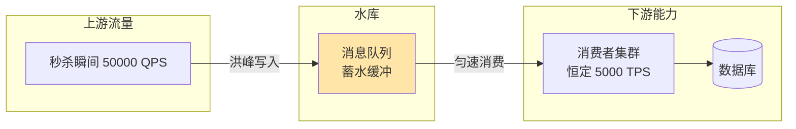
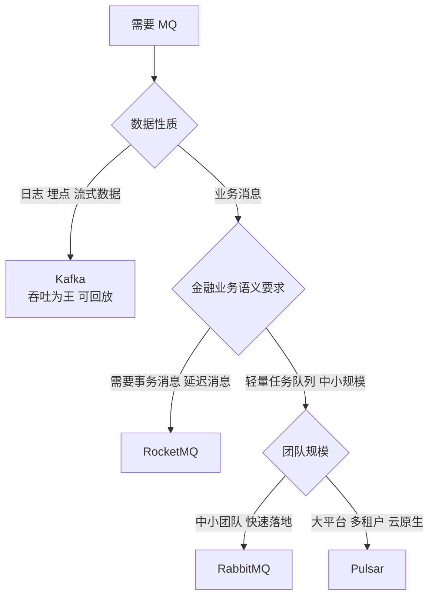
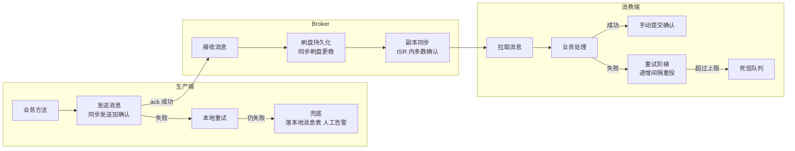
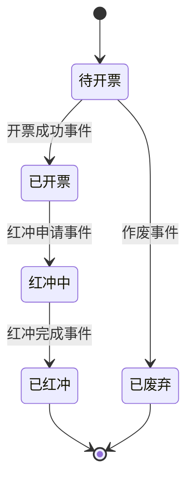
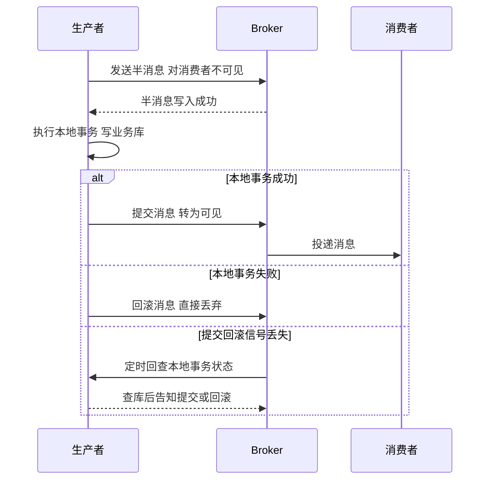

# 03 削峰与异步化：消息队列是分水岭

> 优先级：第一档｜预计阅读时间：35-40 分钟｜一句话定位：消息队列（Message Queue，MQ）是"会写 CRUD"与"懂系统设计"之间的分水岭，本篇给你的是可靠性、幂等、顺序、堆积这四大面试主线的完整心智地图。

## TL;DR

- MQ 只有三大职责：异步化、削峰填谷、解耦。一切 MQ 话题都是这三条的展开，背八股前先想清楚你的场景要用哪一条。
- 异步化的"快"不是系统变快了，而是把不需要立即知道结果的事挪出了同步链路，用户感知的 RT（Response Time）变短，总耗时反而可能变长。
- 削峰填谷的本质是水库：上游洪峰先存进队列，下游按自己的恒定处理能力匀速消费。代价是下游处理延迟，以及你必须回答"水要是漫过库容怎么办"。
- "消息不丢"是三段闭环：生产端确认 + Broker 持久化与副本 + 消费端手动确认。任何一段缺失，前面做的都白费。
- at-least-once（至少一次投递）是工程现实，exactly-once 是有限定边界的能力而非银弹。结论只有一个：消费端必须写幂等。
- 全局顺序是伪需求，分区/队列内有序就够。为了全局顺序牺牲并发度，是典型亏本买卖。
- 消息堆积不可怕，可怕的是没有积压监控——发现堆积的时刻不该是业务方打电话骂你的时候。
- 上 MQ 不是免费午餐：链路变长、排查变难、运维成本实打实。流量不大的系统硬上 MQ，是把简单问题复杂化。

## 引子

想象你在做的财务系统上线了"电子发票即开即推"功能：用户在支付成功页点一下"开具发票"，后端要做这些事——校验开票资质、调用税务通道开票、把发票 PDF 存对象存储、写发票明细表、给用户发短信和邮件、刷新报表模块的当日开票统计。

如果全部同步做，这条链路上有 6 个环节。假设每个环节平均 200ms，光税务通道抖动一下就 2 秒起步，用户看到的是转圈 4-5 秒的白屏。更糟的是大促日：支付峰值冲到每秒 3000 单，税务通道的配额只有每秒 500 次，同步调用等于拿自己的应用服务器去给第三方限流陪葬——线程池打满、连接池耗尽、支付主流程跟着挂。

换个做法：支付成功后，系统只做两件必须立刻做的事（更新订单状态、发一条"支付成功"消息到 MQ），150ms 内返回。开票、通知、报表刷新全部由下游消费者按自己的节奏慢慢做。洪峰来了，消息在队列里排队；半夜流量低谷，队列慢慢排空。

这就是 MQ 的全部价值：**用"排队"换"稳定"，用"稍后处理"换"立刻响应"**。接下来的问题是：这个"稍后"有多可靠？消息会不会丢？会不会重复？顺序乱不乱？堆住了怎么办？这正是面试真正考的东西。

## 一、MQ 的三大职责：逐个拆

### 1.1 异步化（Asynchrony）：把不需要立即知道结果的事挪走

**解决什么问题**：同步调用链每多一个环节，总 RT 就是各环节 RT 的叠加，而且任何一个下游抖动都会直接传导给用户。引用一个经验数字：一个调用链上每多一个远程节点，P99 延迟不是相加而是被尾部延迟放大——10 个 P99 为 100ms 的服务串联，链路 P99 会逼近 1 秒（示意，非严格推导——串联链路 P99 并非简单相加）。

**带来什么**：用户感知的响应时间只包含"必须同步完成"的部分。开票场景里，同步部分从 4-5 秒缩到 150ms，剩下的 6 件事异步做。

**代价是什么**——三条，一条都不能少：

1. **总耗时变长而非变短**。消息要经过"发送 → 网络 → Broker 落盘 → 推送/拉取 → 消费"至少两跳网络，异步部分的整体完成时间一定比同步直调长。异步化优化的是用户感知延迟，不是系统吞吐量本身。
2. **结果不可立即获知**。用户点完开票，页面只能显示"开票中"。你必须设计结果通知机制：轮询、WebSocket 推送，或者干脆邮件送达。这是产品交互层面的成本，不只是技术成本。
3. **一致性窗口被拉大**。支付成功了但发票还没开，这中间的秒级甚至分钟级窗口里，数据是"不一致"的。业务必须能接受最终一致性（Eventual Consistency），不能接受就别异步。

**什么时候用 / 不用**：判断维度就一条——这件事的结果，是不是当前请求的响应所必需的？发短信、写统计、刷新报表，不需要；扣库存、校验额度、写入支付单，需要。前端类比：异步化像 React 18 的 `startTransition`——非紧急更新让出主线程，紧急交互先响应，但总工作量没变少。

### 1.2 削峰填谷（Peak Shaving）：队列是水库

**解决什么问题**：流量曲线是尖峰状的，系统处理能力是近似恒定的。秒杀开抢瞬间流量可能是平时的 50 倍，你不可能为了一天 10 分钟的峰值把集群扩 50 倍——成本上不成立。

**带来什么**：上游按峰值写入队列，下游按恒定速率消费。队列充当水库：洪峰期蓄水，平峰期放水。下游系统（尤其是数据库和第三方接口）看到的永远是平滑的负载。



**代价是什么**：

1. **峰值期的处理延迟**。秒杀下单成功的确认可能要等几秒甚至几十秒。水库逻辑的前提是"总水量迟早能排完"，如果峰值流量持续超过消费能力，队列只涨不消，那就是堆积事故（见第七章）。
2. **队列自身的容量与可靠性成为新瓶颈**。水库存的是你的核心数据（订单、支付指令），它本身必须足够可靠——这就是第三章可靠性全链路存在的原因。
3. **库存类场景的语义变化**。削峰后"抢到"只代表"排队成功"，不代表"库存扣减成功"。前端要给用户"排队中/已抢到/已售罄"三态，这是业务设计问题，MQ 不替你解决。

**什么时候用 / 不用**：流量曲线有明显峰谷差（秒杀、大促、整点结算）才谈削峰；流量平稳的内部系统用 MQ 削峰，收益为零、成本照付。判断维度：峰值/均值比超过 5 倍且峰值持续时间短，值得；长期平稳负载，不值得。

### 1.3 解耦（Decoupling）：生产者不知道消费者是谁

**解决什么问题**：同步架构里，支付服务要开票就得依赖开票服务的接口定义、地址、可用性。新增一个"积分服务也要监听支付成功"，就得改支付服务的代码。调用方和被调用方在代码、部署、发布时间三层上绑死。

**带来什么**：生产者只管发"支付成功"事件，谁关心谁来订阅。新增下游零改动，上下游独立发布、独立伸缩、独立故障隔离。这是事件驱动架构（Event-Driven Architecture）的地基。

**代价是什么**——这是最容易被八股忽略的部分：

1. **链路不可见，排查变难**。同步调用一个 APM trace 看全链路；异步之后，"支付成功但积分没到账"要跨两套系统、翻消息轨迹才能定位。没有消息轨迹和 trace 串联（消息体里带 traceId），MQ 链路就是黑盒。
2. **契约从编译期变成运行期**。接口调用有类型签名约束，消息只有 schema 约定。生产者改了消息字段，编译不报错，消费者到线上才炸。需要消息 schema 管理和兼容性规范来兜底。
3. **数据所有权模糊**。"谁该消费这条消息、消费失败后谁负责"在多订阅方场景下容易扯皮，需要明确的消息治理规则。

前端类比：MQ 解耦像从 props 逐层传递换成事件总线——灵活了，但"谁在监听这个事件"要全局搜索才知道，类型安全也要自己想办法。

**什么时候用 / 不用**：下游数量多且会增长（事件广播）、跨团队系统边界，解耦收益大；两个内部服务之间一对一调用，同步 RPC 反而更简单可靠。判断维度：订阅方数量 ≥ 2 且有增长预期，用 MQ；一对一且强依赖返回值，用 RPC。

### 三大职责小结对比

| 职责 | 解决什么 | 带来什么 | 代价 | 适用场景 |
|---|---|---|---|---|
| 异步化 | 同步链 RT 叠加、下游抖动传导 | 用户感知延迟骤降、主流程瘦身 | 总耗时变长、结果需异步通知、一致性窗口 | 链路中非关键环节多（通知、统计） |
| 削峰填谷 | 峰值流量 vs 恒定处理能力 | 下游负载平滑、省下峰值扩容成本 | 峰值期处理延迟、队列成新瓶颈 | 峰谷比大、峰值持续短（秒杀/大促） |
| 解耦 | 调用方与被调用方三层绑死 | 新增下游零改动、故障隔离 | 链路黑盒化、契约运行期才校验、治理成本 | 事件广播、多订阅方、跨团队边界 |

## 二、主流 MQ 选型：看基因，不看参数

2026 年的 MQ 版图已经稳定：Kafka、RocketMQ、RabbitMQ、Pulsar 四分天下。参数党喜欢比吞吐数字，但选型的正确姿势是**看定位基因**——每个 MQ 出生时为了什么问题而造，决定了它后来在功能上的取舍。

| 维度 | Kafka | RocketMQ | RabbitMQ | Pulsar |
|---|---|---|---|---|
| 定位基因 | 日志/大数据流管道，流处理平台 | 金融业务消息（阿里交易场景） | 轻量通用任务队列（AMQP 老牌） | 云原生、存算分离、多租户 |
| 吞吐量级 | 单机百万级/秒（官方基准值，业务消息场景通常低 1-2 个数量级），批量聚合型 | 十万级/秒 | 万级/秒 | 十万到百万级/秒 |
| 延迟 | 毫秒~秒级（批量换取吞吐） | 毫秒级 | 毫秒级 | 毫秒级 |
| 延迟消息 | 原生不支持（需自造轮子） | 原生支持，粒度灵活 | 需 TTL+死信绕行或插件 | 原生支持 |
| 事务消息 | 事务用于流处理 EOS，非业务事务消息 | 原生事务消息（半消息+回查） | 轻量事务/确认机制 | 支持事务 |
| 消息回溯/重放 | 极强（日志本质，按 offset 重放） | 支持按时间回溯 | 弱（消费即删模型） | 强（分层存储） |
| 运维复杂度 | 中高（KRaft 模式已去 ZooKeeper，仍偏平台化） | 中（NameServer + Broker 概念清晰） | 低（单机能跑，Erlang 小众） | 高（Broker/BookKeeper/Proxy 多层） |
| 典型场景 | 日志采集、埋点、CDC、实时数仓 | 订单、支付、交易类业务消息 | 中小团队异步任务、RPC 式消息 | 超大规模、多租户、云原生平台 |

**选型判断树**：



**判断逻辑（比结论重要）**：

- 消息丢了能不能接受、需不需要重放？日志数据可以接受极小概率丢失但要求极致吞吐和回放 → Kafka。钱相关的业务消息一条都不能丢、还要事务和延迟语义 → RocketMQ。
- 团队有没有人运维？RabbitMQ 开箱即用，中小团队首选；Pulsar 架构先进但组件多，没有平台团队别碰。
- 别拿参数表选型。Kafka 也能调参做业务消息，RocketMQ 也能扛日志，但那是逆着基因用工具，后期的坑（Kafka 没有延迟消息、业务消息语义要自己拼）会一个个还回来。

国内中厂面试语境下，RocketMQ 和 Kafka 是绝对高频，本篇后续机制举例也以这两者为主。

## 三、消息可靠性全链路：三段闭环，缺一不可

面试官问"MQ 怎么保证消息不丢"，标准答案是一个三段链路图。消息的一生要经过**生产端 → Broker → 消费端**三站，每一站都有丢失窗口，每一站都要有对应的兜底机制。只说一段，就是挂一漏万。



### 3.1 生产端：确认 + 重试 + 兜底

**丢失窗口**：网络抖动导致消息根本没到 Broker，或者到了但 ack（确认回执）在路上丢了。

**机制**：

- **同步发送 + 确认机制**：Producer 发送后等 Broker 返回 ack 才算成功。Kafka 的 `acks=all`（等 ISR 内全部副本确认）、RocketMQ 的同步发送返回 `SEND_OK` 都是这一层。异步发送吞吐高但要在回调里处理失败，别发完就当成功。
- **本地重试**：发送失败自动重试，但要注意重试本身就是重复消息的来源之一——ack 丢了重发，Broker 其实收到了。
- **最终兜底**：重试仍失败（比如 Broker 集群故障），消息不能扔——写入本地消息表或降级日志，由定时任务补偿重发，同时告警。金融场景这一步不可省。

**取舍**：同步发送 + acks=all 最安全，吞吐打折；异步 + 回调适合日志类可容忍丢失的场景。判断维度：消息的业务价值——订单消息用最高确认级别，埋点日志随意。

### 3.2 Broker 端：持久化 + 副本

**丢失窗口**：消息到了 Broker 但只在内存，机器宕机消息蒸发；或者刷盘了但单机磁盘损坏。

**机制**：

- **持久化（Persistence）**：消息写入磁盘而非只驻留内存。刷盘策略分同步刷盘（写完盘才返回 ack，安全但慢）和异步刷盘（先返回再批量刷盘，快但有小窗口丢失风险）。
- **副本机制（Replication）**：消息复制到多个节点。Kafka 的 ISR（In-Sync Replicas，与 Leader 保持同步的副本集合）一句话讲清：只有 ISR 里的副本都确认写入，消息才算提交；ISR 掉队的副本会被踢出，保证"提交过的消息不丢"。RocketMQ 有同步复制/异步复制之分，与刷盘策略组合出可靠性与性能的四象限。

**取舍**：同步刷盘 + 同步复制是"钱相关"配置，性能可能掉一半以上；异步刷盘 + 异步复制是"日志相关"配置。金融业务通常选"异步刷盘 + 同步复制"这种折中：机器掉电丢一小窗，但单机宕机不丢。

### 3.3 消费端：手动确认 + 重试阶梯

**丢失窗口**：消费者拉到消息、业务还没处理完就宕机——如果已经自动提交了 offset/ack，Broker 认为消息消费成功，这条就永远丢了。

**机制**：

- **手动确认（Manual Ack）**：先处理业务，业务成功后再提交消费位点。顺序绝不能反。Kafka 关闭自动提交 offset、RabbitMQ 用 manual ack、RocketMQ 返回 `CONSUME_SUCCESS`，都是同一思想。
- **消费失败重试与重试阶梯**：业务处理失败不确认，消息会被重投。重试间隔要递增（如 10s、30s、1min、5min……），避免故障期间风暴式重投把下游打崩。RocketMQ 的重试阶梯是内置特性，Kafka 需要自造（重试 topic 分层）。
- **重试有上限**：超过最大重试次数（RocketMQ 默认 16 次），消息进死信队列，转入人工处理（见 5.3）。

**闭环结论**："消息不丢"不是 MQ 产品自带的属性，是你在三段各自做了正确配置之后涌现出来的系统属性。面试里把这张图讲完整，比背任何参数都有说服力。

### 3.4 补一个底层概念：消费者是推（Push）还是拉（Pull）

消息从 Broker 到消费者有两种模型：**推模式**是 Broker 主动把消息推给消费者，实时性好但消费者被动，容易被打爆；**拉模式**是消费者按自己的节奏主动拉取，吞吐可控但有空轮询开销。认知上只需记住两点：一是 RabbitMQ 是真推模式（所以它有 prefetch 预取数限制来保护消费者），二是 Kafka 和 RocketMQ 名义上是拉，但 RocketMQ 的 PushConsumer 本质是"长轮询包装的拉"——Broker hold 住请求等新消息，兼顾实时与可控。这个细节面试被追问"RocketMQ 的 Push 是真推吗"时能直接区分你是否看过原理。消费速率的控制权在谁手里，也直接决定了第七章堆积治理的手段空间：拉模式下消费者可以"故意慢拉"自我保护，推模式下只能靠预取数和拒绝确认。

## 四、重复消费与幂等：本篇最重点

### 4.1 为什么消息必然重复

投递语义（Delivery Semantics）有三档：

- **at-most-once（至多一次）**：发出去就不管，可能丢，绝不重。适合 metrics 采集，不适合业务。
- **at-least-once（至少一次）**：不确认就重投，绝不丢，但可能重复。这是主流 MQ 的默认现实。
- **exactly-once（恰好一次）**：听起来完美，实质是**有限定边界的工程能力，不是语义魔法**。Kafka 的 EOS（Exactly-Once Semantics）精确适用范围是"Kafka 流处理内部"——从 Kafka 读、在流处理中计算、写回 Kafka 这个闭环内，靠事务和幂等 Producer 保证不重不丢。一旦你的消费者要把结果写到外部系统（MySQL、ES、调第三方接口），EOS 管不到外部世界，重复依然可能发生。

重复的现实来源至少有四个：生产端 ack 丢失后重发、Broker 重平衡（rebalance）导致消息被重新分配、消费端处理完但提交位点失败、人为重放历史消息。你堵不死所有源头。

**结论只有一条：不要试图让消息不重复，要让重复的消息不造成伤害。这就是幂等（Idempotency）。**

### 4.2 消费端幂等的三种落法

幂等的定义：同一操作执行一次和执行 N 次，业务效果相同。三种主流落法，按通用性排序：

**落法一：唯一约束 / 去重表（最通用）**

用消息的唯一标识（messageId 或业务单号）建去重表，消费时先插入去重表，利用数据库唯一约束拦截重复：

```text
-- 伪代码
begin transaction;
insert into msg_dedup(msg_id) values('pay-event-20260115-001');
-- 插入成功 = 首次消费，继续业务
update invoice set status='ISSUED' where ...;
commit;
-- 插入冲突 = 重复消费，直接返回成功，跳过业务
```

关键点：**去重表插入和业务写必须在同一个本地事务里**，否则会出现"去重记录写了但业务没写"的中间态。这是整套方案里最容易被忽略的一步，也是面试加分点。

**落法二：状态机校验（最贴合业务）**

业务实体如果有明确的状态流转，用"状态不可逆"天然挡重复：处理前先查当前状态，只有处于期望的前置状态才执行流转。

```text
-- 伪代码：只有待开票状态才能开票
update invoice set status='ISSUED'
where invoice_no='INV-001' and status='PENDING';
-- affected rows = 0 说明要么不存在、要么已经开过/废弃了，视为重复或非法，跳过
```

**落法三：业务版本号 / 递增序号**

实体带一个版本号或递增序号，消费时只接受"序号 > 当前已处理序号"的消息，顺便还解决了乱序问题。适合账户流水、库存变更这类对顺序也敏感的场景。缺点是每条消息都要带全局递增标识，改造成本高。

三种落法的取舍：去重表通用但要额外存储和清理策略；状态机零额外成本但要求业务本身有状态模型；版本号连乱序一起治但侵入性最强。实际系统里经常混用：状态机兜底 + 去重表防"无状态消息"。

### 4.3 财务视角：发票状态流转是状态机幂等的天然教材

你的发票模块里，一张发票的生命周期是：



这套状态机天然免疫三类异常：

- **重复消费**："开票成功"事件来两次？第二次执行流转时状态已是"已开票"，不满足前置条件"待开票"，直接跳过。幂等白送。
- **乱序消费**："红冲完成"先于"红冲申请"到达？前置状态不满足，拒绝执行并进入重试/告警，而不是把状态写乱。
- **非法流转**："已废弃"的发票收到开票事件？状态机里根本没有这条边，拒绝并告警——这往往意味着上游数据有问题，值得人工看一眼。

落地建议：状态流转统一走 `UPDATE ... WHERE status = 前置状态` 的条件更新（乐观锁思想），不要先 SELECT 再 UPDATE（并发下两步之间有窗口）。这条原则在财务系统里价值极高——钱的流向绝不能因并发或重试写错。

## 五、顺序、延迟与死信：消息的三种特殊形态

### 5.1 顺序消息（Ordered Message）：全局顺序是伪需求

先破除一个执念：**"所有消息全局有序"在分布式系统里基本等于"单线程处理"，吞吐直接崩盘，而业务几乎从不需要它**。

真实的顺序需求永远是"同一业务实体的消息有序"：同一个订单的创建、支付、关闭要有序；不同订单之间无所谓。解法因此一致——**把同一实体的消息路由到同一个分区/队列，保证队列内有序**：

- Kafka：按 key（如 orderId）做哈希，同 key 落同一 partition，partition 内天然有序。
- RocketMQ：顺序消息 + MessageQueueSelector，发送方按 orderId 选择队列，消费方按队列串行消费。

代价要说清：为顺序付出的并发度。某队列的消费者串行消费，如果这个 key 的消息消费慢（比如某大户订单刷屏），会拖累该队列整体进度（队头阻塞）。另外 Broker 宕机切换分区后，顺序保证可能出现短暂破口——强顺序场景要有对账兜底。判断维度：实体级有序 → 分区有序方案；真需要全局有序 → 先质疑需求，再考虑单分区（并接受性能代价）。

### 5.2 延迟消息（Delayed Message）：定时任务的分布式升级

应用场景两个最典型：**超时关单**（下单 30 分钟未支付自动关闭）和**重试阶梯**（对账任务失败后 5 分钟、30 分钟、2 小时逐级重试）。

原理一句话：延迟消息不是"到点才发"，而是先投递到延迟队列/特定存储，由 Broker 按到期时间转投真实 topic。RocketMQ 原生支持（开源版固定 18 个延迟级别，商业版任意秒级；5.x 已支持任意时间精度），Kafka 原生不支持（社区方案多是"延迟 topic + 时间轮转发"的自造轮子），RabbitMQ 靠 TTL + 死信队列绕行或延迟插件。

替代方案要知道：量级小（万级以下）时，数据库轮询定时任务（`WHERE expire_time < now() AND status='UNPAID'`）更简单可靠；量级大到每分钟百万级定时事件，才需要 MQ 延迟消息或专门的时间轮组件。别为用特性而用特性。

### 5.3 死信队列（Dead Letter Queue，DLQ）：消息的最终归宿

一条消息重试了 16 次还是失败，说明问题不是抖动，是消息本身有毒（数据格式错、业务数据缺失、代码 bug）——继续重投只会毒死整个消费者。DLQ 是这类"毒消息（Poison Message）"的隔离区：重试耗尽后自动转入死信 topic，不再干扰正常流量。

DLQ 的正确姿势是一个闭环，不是一个垃圾桶：

1. 消息进 DLQ 即触发告警（这是异常事件，不是日常）。
2. 提供死信查询界面/工具，人工或脚本定位失败原因。
3. 修复后支持重新投递（resend）回正常队列，或确认废弃。
4. 定期复盘 DLQ 消息的根因分布——它们是你系统缺陷的免费报告。

面试里能讲出"DLQ 需要告警 + 人工介入 + 重投机制"这个闭环，就说明你真把它当过生产问题，而不是背过一个名词。

## 六、事务消息与最终一致性：只给地图，不深挖

前面埋了一个问题：生产端"先写库后发消息"或"先发消息再写库"，两步之间宕机都会出现数据不一致（库里有了消息没发出去，或消息发出去了库里没有）。这就是经典的**本地事务与消息发送的原子性问题**。主流方案地图如下：

| 方案 | 原理 | 优点 | 代价 | 适用场景 |
|---|---|---|---|---|
| 本地消息表 | 业务数据和消息记录在同一本地事务写入，定时任务扫描未发送记录补发 | 不依赖 MQ 特殊能力，任何 MQ 可用 | 业务库多一张表，需要补发任务和状态清理 | 中小规模、强通用性需求 |
| Outbox 模式 | 本地消息表的思想 + CDC（Change Data Capture）监听 binlog 转发到 MQ | 业务代码零侵入，无轮询 | 引入 CDC 组件（Debezium 等），链路变长 | 已有 CDC 基础设施的团队 |
| RocketMQ 事务消息 | 半消息 + 本地事务执行 + 提交/回滚 + Broker 主动回查 | MQ 原生支持，语义标准 | 绑定 RocketMQ，本地事务接口要实现回查逻辑 | 用 RocketMQ 的金融业务 |
| Saga 模式 | 长事务拆成一串本地事务 + 每步配补偿动作，失败时逆向补偿 | 适合跨服务长流程 | 补偿逻辑编写成本极高 | 多服务长链路（本篇不展开） |

RocketMQ 事务消息的回查机制值得展开一层，因为它是面试高频且设计思想漂亮：



核心洞察：**半消息解决了"消息先于事务发出"的问题，回查解决了"事务结果信号丢失"的问题**。Producer 必须实现回查接口——Broker 来问"那笔本地事务到底成没成"时，你要能查库回答。这个机制的本质是把最终一致性的责任从 MQ 转移到业务方能回答的状态查询上。

本篇按手册定位只给地图和选型直觉：国内金融/交易业务选 RocketMQ 事务消息或本地消息表；基础设施成熟选 Outbox；跨服务长流程才考虑 Saga。分布式事务（2PC/3PC/TCC/Saga/Seata）的深入拆解，留给你自修的"幂等与事务一致性专题"——那是另一篇的量。

## 七、消息堆积：必然会发生的事故预案

堆积不是"会不会发生"，而是"发生时你有没有预案"。

**三大成因**：

1. **消费慢**：消费逻辑里有慢 SQL、同步调第三方、单条处理耗时异常。最常见，也最值得先查。
2. **流量突增**：上游大促/异常风暴，写入速率持续超过消费速率。
3. **消费者宕机/卡住**：消费者实例宕机、rebalance 风暴、消费线程死锁——消费速率直接归零，堆积曲线垂直上涨。

**应急处置三板斧**（按优先序）：

1. **扩容消费者**：增加消费者实例，但注意上限是分区/队列数——Kafka 里消费者超过 partition 数，多出来的干瞪眼。必要时先扩分区。
2. **批量消费 + 提效**：把逐条消费改批量拉取批量处理，同时排查消费逻辑里的慢点（慢 SQL、串行远程调用）。
3. **降级跳过**：极端情况下对非关键消息（如埋点、统计）直接消费后丢弃快速清积压，保核心消息（订单、支付）——这是有损操作，要有明确的消息分级前提。

**比处置更重要的是监控意识**：积压量（lag）是 MQ 的第一指标，必须有监控和告警阈值（如积压超过 10 万条或消费延迟超过 5 分钟告警）。发现堆积的正确路径是监控系统报警，绝不是业务方来问"为什么我的订单两小时还没处理"。这个意识本身就是面试答案。

**事后复盘的固定动作**：每次堆积事故后回答三个问题——消费速率的瓶颈是 CPU、IO 还是外部依赖（决定下次扩容有没有用）？流量模型有没有永久性变化（一次性大促 vs 业务量上了台阶，前者靠预案、后者要重新规划分区数和消费组规模）？监控阈值是不是该收紧（这次告警是不是已经太晚了）？堆积治理的本质不是救火技术，而是容量规划能力——而容量规划的前提，是你清楚自己消费者单实例的真实吞吐水位，这个数字只能靠日常压测和监控基线积累，临时抱佛脚抱不出来。

## 面试视角

**问法一：为什么用 MQ？（本质题，淘汰背书的）**

考察点：是否理解取舍，而非背诵"削峰解耦异步"六字真言。

回答骨架：① 先讲场景——"我们支付成功链路有 6 个下游动作，同步做 RT 叠加到 4 秒，大促峰值还会打崩税务通道"；② 讲选了哪个职责——"主要是异步化 + 削峰，把非关键环节挪出同步链路，用队列缓冲突发流量"；③ 主动讲代价——"代价是链路变长、要处理消息可靠性和幂等、排查需要消息轨迹，我们为此做了 XXX"。能讲到③就赢了 80% 的候选人。

**问法二：MQ 怎么保证消息不丢？**

回答骨架：三段闭环——生产端（同步发送 + ack 确认 + 失败重试 + 本地消息表兜底）→ Broker（刷盘策略 + 副本机制，ISR 一句话带过）→ 消费端（先处理业务后手动提交位点 + 失败重投）。收尾补一句："任何一段不做都前功尽弃，所以这是系统级配置而非 MQ 产品属性。"

**问法三：怎么保证消息顺序？**

回答骨架：先拆需求——"全局有序是伪需求，实体级有序才是真的"；方案——"按业务 key 哈希到固定 partition/队列，保证队列内有序，Kafka 和 RocketMQ 都这个思路"；代价——"牺牲并发度，队头阻塞风险，宕机切换有短暂破口"；收尾——"消费端幂等和状态机校验做兜底，即使乱序也不出错"。

**问法四：重复消费怎么处理？**

回答骨架：先讲必然性——"at-least-once 是工程现实，重复来源有 ack 丢失重发、rebalance、位点提交失败"；再讲幂等三落法——"去重表（强调与业务同事务）、状态机条件更新、业务版本号"；有状态机业务的补一句"我们发票状态流转天然幂等"。

**问法五：消息积压怎么办？**

回答骨架：先定因——"先查监控判断是消费慢、流量突增还是消费者宕机"；再处置——"扩消费者（注意分区数上限）、批量消费提效、非关键消息降级跳过"；升华——"更重要的是事前：积压监控告警必须有，事后要复盘扩容预案"。

**经典追问连招**（连环夺命版）：

- "不丢"追问：acks=all 是什么？刷盘和复制怎么选？→ 见第三章折中策略。
- "幂等"追问：去重表和业务写怎么保证原子性？→ 同一本地事务。
- "顺序"追问：Kafka rebalance 时顺序会怎样？→ 有破口，幂等兜底。
- "事务"追问：RocketMQ 半消息和回查讲一遍？→ 第六章时序图。
- 终极追问："你们系统的 MQ 出过大故障吗，怎么处理的？"→ 提前准备一个真实/可信的堆积或重复消费故事，哪怕规模小。
- 反向追问："如果让你重新选型，还会用现在的 MQ 吗？"→ 用第二章的"看基因不看参数"思路回答，讲清楚当初场景匹配什么基因、后来业务变化是否让基因失配，比维护现有选择更显架构思维。

## 常见误区

- **以为 MQ 一定提升性能**。其实它只优化用户感知延迟和资源利用曲线，总链路反而多了至少两跳网络。单次操作耗时变长、系统复杂度变高，"性能提升"只有在大流量削峰场景下才成立。
- **以为开了 Kafka EOS 就不用写幂等**。其实 EOS 只管 Kafka 内部闭环，你的消费结果一旦写到 MySQL 或调外部接口，重复照样发生。幂等代码永远是必选项。
- **以为上 MQ 解耦就是好事**。其实解耦换来的是链路黑盒化：没有消息轨迹和 trace 串联，"消息去哪了"会成为半夜的噩梦。小系统、一对一调用硬上 MQ，是典型的过度设计。
- **以为消息不丢是 MQ 产品自带的**。其实三段链路任何一段配置不对都会丢：自动提交位点、异步刷盘、发出去不等 ack，每一个都是真实的丢消息现场。
- **以为死信队列设了就完事**。其实没有告警和人工介入机制的 DLQ 是数据坟场——毒消息静默堆积，业务错误被永久掩盖。

## 与我的财务系统的关联

你的系统当前规模（400 万明细、内部财务场景）不需要秒杀级 MQ 架构，但有三个**天然契合点**，每一个都能变成面试素材：

1. **对账模块是教科书级的 MQ 场景**。上游交易流水到达（可能来自多个渠道：支付网关、银行回单、第三方支付），异步触发对账任务——这正是"事件驱动 + 削峰"：月底/大促后流水洪峰到达时，队列缓冲，对账消费者匀速跑，数据库不被打穿。对账差异发现后，发一条"差异事件"消息，由下游消费者生成差异工单并通知财务人员——这就是解耦：对账引擎不需要知道差异通知给谁。
2. **发票状态变更事件驱动报表刷新**。发票从"待开票"到"已开票"的状态流转发生时，发一条状态变更事件，报表模块消费后增量刷新当日开票统计——替代报表模块定时全量扫表。配合第四章的状态机幂等，这套"状态流转 + 事件广播 + 幂等消费"的组合，是你简历上从 CRUD 到系统设计的最短路径。
3. **"定时任务 + 队列"的批处理模式**。对账重试、超时关单这类场景：定时任务扫描出待处理集合，批量投到队列，由消费者并行处理——把单线程跑批变成分布式消费，400 万级明细的全量对账从小时级压到分钟级。延迟消息则天然适合对账失败的重试阶梯（5 分钟、30 分钟、2 小时）。

**明确判断现阶段用不上的**：Kafka 流处理生态（你们没有日志/埋点大数据场景）、Pulsar 多租户（单团队单系统）、Saga（服务还没拆到那个粒度）。RocketMQ 事务消息属于"知道有这回事，真到支付/开票强一致场景再引入"——本地消息表在你的体量下可能性价比更高。

## 小结

MQ 的全部复杂性来自一个简单事实：**它把一次函数调用变成了一次跨进程、跨时间的承诺**。三大职责（异步化、削峰、解耦）回答"为什么引入"，可靠性三段闭环回答"承诺怎么兑现"，幂等回答"承诺重复兑现了怎么办"，顺序/延迟/死信回答"承诺的特殊条款"，堆积治理回答"承诺积压了怎么救"。把这条主线串起来，MQ 面试不是背参数，而是讲一个关于"承诺"的完整工程故事。

## 延伸阅读

- 《RocketMQ 技术内幕》（丁威等）—— RocketMQ 源码级机制，事务消息与延迟消息章节尤佳
- Kafka 官方文档与 KIP 提案（KRaft、EOS 相关）—— 理解设计决策的原始语境
- 《Kafka 权威指南》（Neha Narkhede 等）—— 流平台思维的经典
- RabbitMQ 官方文档的 Reliability 章节 —— 确认机制讲得最清楚的官方材料
- 《企业集成模式》（Enterprise Integration Patterns）—— 消息系统模式的开山之作，DLQ、幂等接收器等概念源头
- RocketMQ 官方 GitHub 文档 —— 延迟消息、事务消息的最新特性演进
