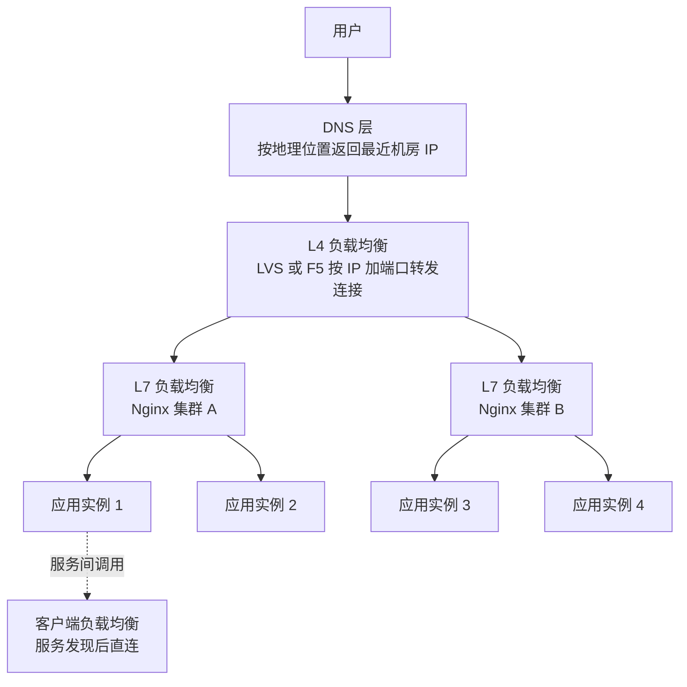

# 04 负载均衡与水平扩展：无状态化是一切的前提

> 优先级：第三档｜预计阅读时间：25-30 分钟｜一句话定位：水平扩展（Horizontal Scaling）是高并发的第一性解法，而负载均衡（Load Balancing）是它的配套基础设施；本篇建立分层全景与算法速查，真正的坑在 Session 和健康检查。

## TL;DR

- 单机性能有物理天花板，垂直扩展（Vertical Scaling）是花钱买时间，水平扩展才是应对流量增长的长期答案——但水平扩展有一个硬性前提：应用无状态化（Stateless）。
- 负载均衡不是"一个组件"，而是一个分层体系：DNS 层管地理位置，L4 层管连接转发，L7 层管内容路由，客户端模式管服务间直连。现代实践中最常见的组合是 DNS + L7。
- 负载均衡算法里，真正值得深挖的只有一致性哈希（Consistent Hashing）：它解决的是"节点增减时大规模 key 重新映射"的问题，缓存分片、分库分表都在用它。
- Session 是水平扩展的最大绊脚石。四种解法中，中后台系统默认选 Redis 集中式存储；JWT 适合跨端、开放 API 场景，但"无法主动失效"是它的原罪。
- 负载均衡算法不是核心，健康检查与故障摘除才是生产事故高发区：探测不准、摘除抖动、恢复过猛，每一条都能把集群打挂。
- 你的财务系统部署量小，大概率用不上 LVS 和 DNS 调度，但必须理解"为什么网关后面能挂多台应用"——这是从单机思维到集群思维的认知跃迁。

## 引子

继续用你的财务系统。月初是对账高峰期：400 万行流水明细要跑批量对账，财务同事同时在线刷多维报表，报表接口平均要扫几十万行聚合。某天早上你收到告警：应用服务器的 CPU 常年 90%，报表接口 P99 从 800ms 涨到 6 秒。

第一反应是"升级配置"：8 核 16G 换成 16 核 32G。确实缓解了两周，然后数据量又涨了，又开始卡。再升？32 核 64G 的机器价格不是翻倍而是翻几倍，而且单机的内存带宽、网卡、磁盘 IO 总有顶。更要命的是：这台机器一挂，全公司财务停摆——垂直扩展不但贵，还把鸡蛋全放进了一个篮子。

另一条路：买三台普通的 8 核机器，前面架一个 Nginx，请求轮着发。理论上容量翻三倍，任何一台挂了其他两台还能顶。但真这么做，你立刻会撞上三个问题：用户登录态存在单机内存里，换台机器就"被登出"；定时任务在三台机器上各跑一遍，对账单生成了三份；一台机器假死（还在响应但慢得要命），流量照样往里灌。

这三个问题的答案，就是本篇的主线：**水平扩展 = 无状态化的应用 + 负载均衡 + 健康检查**。算法和组件都是配角，这三个才是骨架。

## 一、水平扩展 vs 垂直扩展：本质取舍

**垂直扩展（Scale Up）**：给单机加 CPU、内存、换 SSD。优点是零改造成本——应用不用改一行代码，所有状态天然共享。代价有三个：硬件性价比随配置指数级恶化（高端服务器的价格增长远快于性能增长）；存在物理天花板（单机内存能到 TB 级，但无法无限）；单点故障无解。

**水平扩展（Scale Out）**：加机器，用数量换容量。优点是容量近乎线性增长、机器便宜、天然有冗余。代价只有一个，但足够致命：**应用必须无状态**——任何一台机器都不能"私有"任何请求需要的数据。session、本地缓存、内存队列、写死的本地文件、单机定时任务，这些在单机时代理所当然的东西，到了集群里全是地雷。

判断维度很清晰：如果系统处于早期、流量可预期、团队小，垂直扩展用金钱换时间完全合理——改代码做无状态化的成本可能比硬件贵。当出现以下任一信号就该转水平扩展：单机配置升无可升或性价比崩溃；可用性要求不允许单点（财务系统月末停摆一天是不可接受的）；流量有明显波峰波谷，需要弹性伸缩。2026 年的现实是：云原生环境下水平扩展几乎是默认姿势，垂直扩展退化为"数据库这类有状态组件的续命手段"。

前端类比：垂直扩展像给浏览器换个更强的电脑跑页面，水平扩展像把渲染任务拆给 Web Worker 池——但前提是任务之间不能共享可变状态，这和 React 推崇不可变数据（Immutability）是同一个哲学。

## 二、负载均衡分层全景

"负载均衡"在面试里被问倒的人，多半是脑子里只有一个 Nginx。实际上它是一个分层体系，每一层解决的问题、看到的信息、付出的代价完全不同：

**DNS 层**：用户输入域名时，DNS 按地理位置（GeoDNS）把不同地区的用户解析到不同机房的 IP，也可以配置多个 IP 做轮询。优点是它工作在"流量入口之前"，是唯一能跨机房调度的手段。代价是 DNS 有 TTL 缓存——你把某机房从解析里摘掉，全球各地的本地 DNS 缓存要等 TTL 过期才生效，分钟到小时级；而且 DNS 完全不感知后端健康，机器挂了照样把用户解析过去。

**L4 层（传输层）**：代表是 LVS（Linux Virtual Server）和硬件 F5。它只看 IP 和端口，像接线员一样转发 TCP 连接，不解析任何应用层内容。因为不解包，性能极高——LVS 的 DR 模式（Direct Routing）下，回包不经过负载均衡器直接发给客户端，单机扛百万级并发连接。代价是"瞎"：它不知道请求是登录还是下单，无法按 URL 路由。

**L7 层（应用层）**：代表是 Nginx、APISIX、Envoy。它完整解析 HTTP，能按 URL 路径、Header、Cookie 做路由（比如 `/api/report/*` 走报表服务集群，`/api/invoice/*` 走发票服务），还能做限流、鉴权、灰度。代价是必须 terminate（终止）连接、解析协议，性能比 L4 低一个数量级，自身也变成需要集群化的组件——所以才有"L4 挡在 L7 前面"的经典结构。

**客户端负载均衡**：微服务场景下，服务调用方（如 Ribbon——已进入维护期，继任者为 Spring Cloud LoadBalancer——以及 gRPC 内置策略）从注册中心拿到服务实例列表，自己挑一个直连，不经过中心化代理。好处是少一跳、无中心瓶颈；代价是每个客户端都要集成发现与均衡逻辑，策略升级要全量发版。

| 方案 | 原理 | 优点 | 代价 | 适用场景 |
| --- | --- | --- | --- | --- |
| DNS 轮询/GeoDNS | 域名解析返回多个或就近 IP | 工作在流量入口之前，唯一能跨机房调度 | TTL 生效慢，不感知后端健康 | 多机房/多地域容灾的第一道 |
| L4（LVS/F5） | 按 IP+端口转发连接，不解析内容 | 性能极高，百万级连接 | 看不见内容，无法按业务路由 | 超大流量入口，给 L7 集群做前置 |
| L7（Nginx/APISIX/Envoy） | 解析 HTTP 按内容路由 | 路由灵活，可做限流鉴权灰度 | 性能低于 L4，自身需集群化 | 绝大多数系统的入口网关 |
| 客户端均衡（Ribbon/Spring Cloud LoadBalancer/gRPC） | 从注册中心拿列表，客户端自选直连 | 少一跳，无中心瓶颈 | 逻辑散落各客户端，升级难 | 微服务内部服务间调用 |

现代实践结论：**中小公司最常见的组合是 DNS + L7**——云厂商的 SLB（本质封装了 L4+L7）加一层自建 Nginx/网关，足够覆盖绝大多数场景。LVS 只在流量大到 L7 集群自身成为瓶颈时才需要，那是日活千万级公司的烦恼。

## 三、负载均衡算法速查

| 算法 | 原理 | 优点 | 代价 | 适用场景 |
| --- | --- | --- | --- | --- |
| 轮询（Round Robin） | 依次分发到每台机器 | 最简单，绝对均匀 | 无视机器负载差异 | 实例同构、请求耗时均匀的场景 |
| 加权轮询（Weighted RR） | 按权重分配比例 | 能利用异构机器 | 权重靠人肉拍，仍不感知实时负载 | 新旧机器混跑、灰度引流 |
| 最少连接（Least Connections） | 发给当前连接数最少的机器 | 感知实时负载，长请求不再堆积 | 实现略复杂，连接数不等于真实负载 | 请求耗时差异大，如报表类慢查询 |
| 源地址哈希（IP Hash） | 同一客户端 IP 固定到同一机器 | 天然会话亲和 | 节点增减时映射大乱，负载易倾斜 | 临时救急的会话黏滞方案 |
| 一致性哈希（Consistent Hashing） | key 与节点同映射到一个哈希环，key 归顺时针最近节点 | 节点增减只影响相邻一小段 key | 实现复杂，需虚拟节点防倾斜 | 缓存分片、分库分表、有状态路由 |

前四种一句话就够，面试真正的考点是**一致性哈希**，值得展开。

**它解决什么问题**：回忆第 01 篇的缓存集群——N 个 Redis 节点，用 `hash(key) % N` 决定 key 放哪台。问题来了：加一台机器，N 变成 N+1，几乎全部 key 的取模结果都变了，缓存大规模 miss，流量瞬间打穿到数据库。这在取模语义下无解。

**环形哈希的直觉**：把 0 到 2^32 的哈希值首尾相接想象成一个环。每个节点根据机器标识哈希到环上某个位置；每个 key 也哈希到环上，顺时针走，遇到的第一个节点就是它的归属。加一台新节点时，它落在环上某处，只"抢走"它逆时针方向相邻节点的一小段弧——其他节点的 key 完全不动。miss 率从"几乎全部"降到 1/(N+1) 量级。

**虚拟节点解决倾斜**：节点太少时，哈希落点不均匀，环上弧长差距大，负载倾斜严重。解法是每台物理机生成一百多个虚拟节点（VNode）散在环上——弧长被统计平均，负载就均匀了；同时虚拟节点还能带权重，好机器多分几个。

**什么时候不用**：普通无状态 Web 应用后面挂应用实例，轮询或最少连接就够，上一致性哈希是过度设计。它的主场是"请求与存储位置强绑定"的场景——缓存分片、本地磁盘缓存、需要会话亲和又不想用外部存储时。

## 四、无状态化与会话（Session）难题

水平扩展最大的绊脚石是登录态。单机时代 session 存在应用内存里天经地义；集群时代，第一个请求落到 A 机登录成功，第二个请求被负载均衡发到 B 机，B 机内存里没有这个 session——用户被登出。四种解法：

| 方案 | 原理 | 优点 | 代价 | 适用场景 |
| --- | --- | --- | --- | --- |
| Session 黏滞（Sticky Session） | LB 按 IP 哈希或插 Cookie，固定发同一台 | 零改造，应用无感知 | 机器宕机会话全丢；负载不均；违背无状态 | 临时过渡，不推荐长期使用 |
| Session 复制（Session Replication） | 节点间互相同步 session | 应用无感知，任意机器可服务 | 广播风暴，节点多时网络爆炸；同步有延迟 | 节点少于 5 台的小集群，Tomcat 老系统 |
| 集中式存储（Redis Session） | session 全部外置到 Redis，应用只存 sessionId | 真正无状态，可随意扩缩容和滚动发布 | 多一次 Redis 网络往返；Redis 要高可用 | 中后台系统的默认答案 |
| 无状态令牌（JWT） | 用户信息签名后塞进 Token，服务端不存任何东西 | 服务端零状态，天然支持跨域跨端 | 无法主动失效；payload 膨胀；续签麻烦 | 开放 API、移动端、跨服务鉴权 |

**JWT 的三个坑，面试必问**：

1. **无法主动失效**。Token 签发后靠签名验证，服务端不查库，所以"踢人下线""改密码后旧 Token 作废"这类需求天然做不到。补救手段是黑名单（把要作废的 jti 存 Redis）或缩短过期时间配 refresh token——但黑名单一查库，JWT"无状态"的核心优势就丢了一半。
2. **payload 膨胀**。JWT 是 Base64 编码的 JSON，放在每个请求的 Header 里走全程。塞的字段越多，每个请求的带宽浪费越大。原则是只放身份标识和少量不可变的声明（claims），权限角色这种会变的细数据别往里塞。
3. **续签设计**。access token 短（如 2 小时）+ refresh token 长（如 7 天）是标准姿势，但 refresh token 的存储和轮换本身又是状态——绕了一圈状态又回来了，只是从"每个请求都查"变成"两小时查一次"。

**明确建议**：你的财务系统这类中后台，默认选 **Redis 集中式 session**。理由：登录态管理需求重（踢人、单点登录、权限变更立即生效），JWT 的失效短板正中要害；系统内部调用为主，享受不到 JWT 跨端的好处；多一次 Redis 往返的毫秒级成本对中后台完全无感。JWT 留给对外开放 API 或未来接移动端时再考虑。

## 五、健康检查与故障摘除

负载均衡器怎么知道后面哪台机器活着？两种机制：

**主动探测（Active Health Check）**：LB 定时向后端发探测请求（如每 2 秒 GET 一次 `/health`），连续 N 次失败就摘除，恢复后连续 M 次成功再加回。优点是发现快、口径统一；代价是探测本身消耗资源，且"探测通过"不等于"业务正常"——应用能返回 200，但数据库连接池可能已耗尽。所以健康检查接口要检查关键依赖，又不能太重，这是个权衡。

**被动统计（Passive Health Check）**：LB 观察真实流量的成败（连续多少个 502/超时），被动判定节点不健康。零额外开销、反映真实业务；代价是有滞后——要等真实用户先替你踩雷。

生产上的经典事故模式是**摘除抖动（反复横跳）**：一台机器 GC 卡顿 3 秒被摘除，流量涌向剩余机器，剩余机器负载升高也开始超时，又被摘除——雪崩式连环摘除，最后集群里一台不剩，LB 只能把流量全放回去，刚恢复的机器又被瞬间打挂。防御手段：

- **摘除与恢复不对称**：摘除可以快（2-3 次失败），恢复必须慢（连续 10 次以上成功，或观察期），防止病还没好利索就被塞满流量。
- **最少存活比例保护**：集群里健康节点低于某个比例（如 50%）时，停止继续摘除——宁可让病机凑合服务，也不能让流量全压到少数机器上。Nginx Plus、Envoy 等商用/现代 LB 都有这类 panic threshold 机制。

记住一句话：**负载均衡算法决定的是"晴天怎么分"，健康检查决定的是"雨天死不死"。**生产事故九成出在后者。

## 面试视角

**开场问法**："你们的系统怎么做负载均衡的？""session 共享怎么做？""说说 L4 和 L7 的区别。"

**考察什么**：面试官要的不是背组件名，而是你脑子里有没有"分层"这张图，以及是否踩过 session 和健康检查的坑——这两个坑是区分"用过"和"背过"的试金石。

**回答骨架（session 共享）**：

1. 先点破问题本质：水平扩展后应用无状态化，session 不能存单机内存。
2. 列举四种方案各一句话：黏滞、复制、Redis 集中、JWT。
3. 给出自己的选择和理由："我们中后台选 Redis 集中式，因为要支持踢人下线；如果做开放 API 会选 JWT。"
4. 主动提坑：JWT 无法主动失效、Redis 方案要处理 Redis 自身高可用。

**经典追问连招**：

- 追问 1："JWT 既然无状态，怎么实现强制下线？"——答：黑名单 + jti 存 Redis，或者短 access token + refresh token；并补一句"这某种程度上把状态又请回来了，是 trade-off"。
- 追问 2："缓存集群加节点，数据怎么迁移？"——这就是一致性哈希的引子。答：普通取模会导致大规模重映射，一致性哈希把 key 和节点映射到同一个环上，节点增减只影响相邻弧段；节点太少会倾斜，用虚拟节点解决。
- 追问 3："L4 和 L7 什么区别？为什么有的架构两层都要？"——答：L4 看 IP+端口不解包、性能极高但不懂业务；L7 解析 HTTP 能按内容路由但性能低。大流量场景 L4 在前扛连接、L7 在后做路由，中小系统一层 L7 就够。
- 追问 4："一台机器假死，负载均衡器怎么办？"——答：主动探测连续失败摘除，但要说清楚摘除抖动和最少存活比例，这是加分项。

## 常见误区

- **以为负载均衡算法是核心**。其实轮询和加权轮询能解决 90% 的场景，算法选择影响的是"分得多匀"；真正出事故的是健康检查不准、摘除抖动、session 丢失。面试把一致性哈希讲得天花乱坠，却答不上"机器假死怎么办"，立刻露馅。
- **以为 JWT 万能、session 是上古遗物**。JWT 的"无状态"是把双刃剑：换来的是无法主动失效、登出形同虚设、权限变更要等过期。中后台系统对登录态管控要求恰恰最高，盲目上 JWT 是拿短板撞需求。
- **以为上了负载均衡就等于高可用**。LB 只是把流量分出去，它自己也可能挂（所以要 LB 集群、Keepalived 主备）；而且 LB 解决的是"应用层"冗余，数据库单点、Redis 单点照样能把你打回原形。
- **以为无状态化就是把 session 挪到 Redis**。本地缓存、内存里的排行榜、写本地磁盘的导出文件、`@Scheduled` 定时任务——这些全是状态。无状态化是一次全面审计，不是挪一个 session 就完事。
- **以为 DNS 切换能当容灾用**。TTL 缓存在全球各地生效时间不可控，DNS 切换是"小时级"手段，只能做机房级长期调度，指望它做分钟级故障转移会死得很惨。

## 与我的财务系统的关联

先说结论：**你的系统大概率只有"两台应用 + 一层 Nginx"的规模，这篇的大部分组件你用不上，但这篇的心智模型你必须有。**

你刚学完 Nginx，现在可以把它在版图里的位置摆正了：它在你手里是 L7 负载均衡器 + 静态资源服务器 + 反向代理三合一。财务系统前后端分离部署时，Nginx 一边把 `/api/*` 反代给 NestJS 应用（可以配 upstream 挂多个实例，这就是你亲手实现的最小规模水平扩展），一边直接吐前端打包产物。理解它"能看 HTTP 内容所以能按 URL 路由"，就知道为什么发票服务 `/api/invoice` 和报表服务 `/api/report` 未来拆成两个服务时，入口不用变。

真正和你相关的两个落地点：

1. **理解"网关后面为什么能挂多台应用"**。公司网关后面你的服务可能有 4 个实例，你写的每一行代码都被 4 份进程同时执行——本地内存缓存会各自为政、`setInterval` 类的定时逻辑会跑 4 遍、文件写本地磁盘其他实例看不见。这是你作为前端转后端最容易踩的思维盲区。
2. **session 集中存储**。如果系统将来从单实例扩到多实例，登录态放 Redis 是唯一顺滑的迁移路径；这也是为什么 NestJS 生态里 session 方案清一色配 Redis store。

明确现阶段用不上的：**DNS 调度**（你没有多机房，那是公司基础设施层的事）和 **LVS**（你的流量远够不到 Nginx 的性能天花板）。知道它们存在、解决什么问题即可，面试问到能讲清分层定位就是达标。

## 小结

水平扩展是高并发唯一没有天花板的解法，但它用"无状态化"这道门槛过滤掉了所有侥幸心理；负载均衡是分层体系而非单个组件，DNS 管地理、L4 管连接、L7 管内容，中小系统 DNS+L7 足矣；算法层面只有一致性哈希值得深挖，其余皆速查；而真正的工程深水区在 session 方案选择与健康检查的故障语义里——记住，负载均衡算法决定晴天怎么分，健康检查决定雨天死不死。

## 延伸阅读

- Nginx 官方文档：Module ngx_http_upstream_module
- 论文：Consistent Hashing and Random Trees（Karger 等，1997，一致性哈希原始论文）
- 书籍：《大型网站技术架构：核心原理与案例分析》（李智慧）
- 官方文档：Envoy Proxy 的 Load Balancing 与 Health Checking 章节
- 官方文档：LVS（Linux Virtual Server）项目文档
