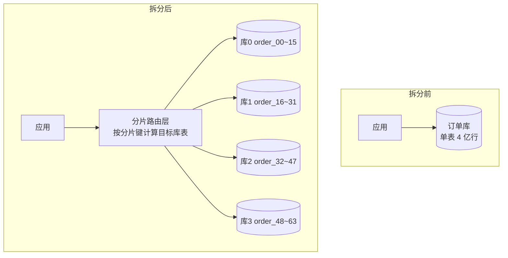

# 05 分库分表与热点问题

> **优先级档位**：第二档（读懂 + 能讲 trade-off）｜**预计阅读时间**：25 分钟
> **一句话定位**：你的 400 万数据远没到分表的程度，但"什么时候该分、分了有什么后遗症"是面试必答题——会讲这两件事，你就赢过大多数背八股的人。

## TL;DR

- 分库分表是**最后手段**，不是性能优化的起点：索引、读写分离、缓存、归档能解决的，都不要拆。
- 拆分的驱动力只有三个：存储容量、连接数、写 QPS。读压力首选读写分离和缓存，不是拆分。
- 垂直拆分按业务域拆库、按冷热拆字段；水平拆分（Sharding）才是真正的"分片"，也是面试主战场。
- 分片键（Sharding Key）选错等于灾难，三原则：高基数、查询高频携带、分布均匀。
- 拆完不是结束而是开始：分布式事务、跨分片聚合、全局 ID、深分页、扩容迁移、运维爆炸，六大后遗症每个都要付出代价。
- 热点的本质是"流量/数据分布不均"：时间分片有尾部热点，哈希分片有热 Key 打穿，缓解靠加盐和二次拆分。
- 2026 年的新系统选型，先问"要不要直接上分布式数据库（TiDB/OceanBase）"，再考虑中间件方案——取决于团队运维能力和生态。
- 对你的财务系统：400 万明细是热身量，**月分区 + 冷热归档**才是你的实战主线，分库分表是认知储备。

## 引子

假设你的财务系统跑了五年，发票明细表从 400 万涨到了 4 亿行。某天你要执行一个 `ALTER TABLE` 加一个字段，执行了三小时还没完，期间整表锁死，写入全部阻塞，对账任务排队超时，客服电话被打爆。

这不是假设，这是无数团队的真实事故。MySQL 单表到几千万行以后，DDL 成本、备份成本、慢查询概率都在非线性上升。这时候有人会拍板："拆！分库分表！"

但另一个团队的故事是反面的：他们在 2000 万行时就急着拆了 8 个库 64 张表，结果两年里被跨库事务、跨分片分页、扩容迁移反复折磨，开发效率腰斩——而他们单表的数据量，其实优化好索引根本不用拆。

**分库分表最大的认知陷阱，不是"不会拆"，而是"不该拆的时候拆了，该拆的时候没预案"。** 本篇就解决这两件事。

## 一、拆分的驱动力：先立判断框架

单机数据库头顶有三座大山：

1. **存储容量**：单实例磁盘有上限。更关键的是，表越大，索引层数越深、DDL 越慢、备份恢复越难。一个 2TB 的单表，做一次备份恢复可能要一天，故障 RTO（恢复时间目标）直接不可接受。
2. **连接数**：MySQL 单实例能稳定承载的连接数有限（几千量级）。微服务多了以后，每个服务都要连库，连接数先被打满——服务扩容十倍，数据库连接就成了瓶颈。
3. **写 QPS**：读可以靠缓存、从库、搜索引擎分流，**写只有一个主库能扛**。单机 MySQL 的写 TPS 上限大概在几千到几万（看硬件和写入模式），秒杀、物联网、日志类场景会撞到这个天花板。

关键判断框架：**三座大山对应的解法是不同的，拆分只对"写 QPS"和"存储容量"是根治方案。**

| 症状 | 第一选择 | 第二选择 | 最后手段 |
| --- | --- | --- | --- |
| 读慢、查询超时 | 索引优化、覆盖索引 | 缓存、读写分离、ES | 拆分 |
| 表太大、归档需求强 | 冷热归档到历史库 | 分区表（Partition） | 拆分 |
| 连接数不够 | 连接池治理、按服务拆库（垂直） | 代理中间件 | 拆分 |
| 写 QPS 超限 | 业务层削峰、批量写 | —— | **必须拆分** |

一句话：**能用索引、读写分离、归档解决的，就别拆。分库分表是外科手术，不是保健品。**

## 二、垂直拆分：先纵后横

垂直拆分是拆分的"轻症方案"，复杂度低，应该先做。

### 垂直分库：按业务域拆

把用户表、订单表、财务表从一个大库拆成用户库、订单库、财务库。**本质是微服务拆分的 DB 版本**——服务边界定了，数据边界跟着定。

它解决的核心问题不是性能，而是**耦合和爆炸半径**：订单库的慢查询不会再拖垮用户登录；每个业务域可以独立扩容、独立发布。代价是跨库 join 没了，原本一条 SQL 的关联查询变成多次 RPC + 内存组装，跨库事务也没了（这是第 10 篇的主战场）。

判断要不要垂直分库的信号很朴素：**团队和组织是否已经按业务域拆开了**。康威定律在这里同样生效——如果订单团队和财务团队已经是两组人、两套发布节奏，共用一个库就是埋雷；反之如果全公司就你一个后端，拆库只会让你一个人运维 N 个库。

### 垂直分表：宽表冷热分离

把一张 50 个字段的宽表，拆成"高频小表 + 低频扩展表"：核心字段（发票号、金额、状态、日期）留在主表，大字段（PDF 快照、XML 原文、备注富文本）挪到扩展表，一对一关联。

收益很实在：主表行变窄，一页 16KB 的 InnoDB 数据页能装更多行，缓冲池（Buffer Pool）命中率上升，查询主表时不再拖着几 KB 的大字段做 IO。**对你的发票表来说，这是零架构成本就能做的优化。**

什么时候不做垂直分表？两个信号：一是大字段本来就被高频访问（拆了反而多一次 join）；二是表本身行数不大、瓶颈在索引设计——这时候拆字段是隔靴搔痒。垂直拆分的统一原则是：**拆的是"访问频率和爆炸半径"，不是"字段数量"。**

## 三、水平拆分（Sharding）：面试主战场

水平拆分是把同一张表的数据按规则切到多个库/多张表：`order_00` 到 `order_63`，每张表结构完全一样，各存一部分行。单表变小了，索引变矮了，DDL 变快了——但所有跨分片的问题都来了。

### 分片键选择：三原则，选错即灾难

分片键（Sharding Key）是决定一行数据落在哪个分片的字段。三原则：

1. **高基数**：取值要足够分散。用"性别"做分片键只有两个分片有意义，用"用户 ID"才能均匀打散。
2. **查询高频携带**：绝大多数 SQL 的 WHERE 条件里要带它。不带分片键的查询会退化成"广播"——把请求发到所有分片再归并，分片越多越灾难。
3. **分布均匀**：避免某几个值集中了大部分数据（比如用"商户 ID"分片，但一个大商户占了 60% 订单）。

**选错分片键是返工成本最高的决策**：换分片键等于全量数据重分布 + 所有查询改写，基本等于重做一遍系统。

### 路由策略对比

| 方案 | 原理 | 优点 | 代价 | 适用场景 |
| --- | --- | --- | --- | --- |
| 范围分片 | 按 ID 区间/时间分段，0~1000万进分片0 | 扩容只需加新分片，范围查询高效 | 写入集中在最新分片（尾部热点），旧分片闲置 | 时间序数据：日志、流水、凭证 |
| 哈希取模 | `hash(key) % N` | 分布均匀，无热点 | 扩容 N→2N 时约一半数据要迁移 | 用户维度数据，写入随机 |
| 一致性哈希 | 分片和数据映射到哈希环，只影响相邻节点 | 扩容迁移量降到 1/N | 实现复杂，负载均衡不如取模直观 | 缓存分片（Redis 集群思想同源） |
| 基因法 | 把用户 ID 的"分片基因"嵌入订单 ID | 一个键兼容两种查询维度 | 写入时要定制 ID 生成逻辑 | 双高频维度查询（见下文） |

**基因法值得展开讲**，因为它是面试加分项。业务常常有两个高频查询维度：按用户查"我的订单"，按订单号查详情。如果你按用户 ID 分片，那"按订单号查"就成了广播。

基因法的解法很巧妙：生成订单 ID 时，**从用户 ID 中提取决定分片的那几位（"基因"，比如用户 ID 哈希的后 4 bit），拼接进订单 ID 的指定位段**。这样订单 ID 天然携带用户 ID 的分片信息——按用户查，用用户 ID 路由；按订单号查，从订单 ID 里解析出同样的基因路由。两个维度都能精准命中单个分片，代价是 ID 生成器要定制（与第 10 篇的分布式 ID 方案强相关）。

## 四、拆分后的六大后遗症

这是本篇最重要的一节。面试里"分库分表有什么问题"是必考题，而且每一条都可能被追问"那你怎么解决"。

### 1. 分布式事务

拆分前，`扣库存 + 写订单 + 记流水` 是一个本地事务，ACID 全有。拆分后三个操作落在三个库，本地事务管不了跨库。**为什么痛**：任何一个环节失败都要考虑其他库怎么回滚，否则数据不一致。缓解方案是放弃强一致、走最终一致：Seata AT、本地消息表、Saga、TCC——完整方案地图见第 10 篇，这里只需要知道"本地事务免费，分布式事务每种都要付开发成本和性能成本"。更优先的思路是在分片设计期就用分片键把强关联的数据聚到同一片（比如同一用户的订单和流水同片路由），让大部分事务退化成单库事务——能用设计消灭的分布式事务，就不要用框架去硬扛。

### 2. 跨分片查询与聚合

`SELECT status, SUM(amount) FROM invoice GROUP BY status` 在单库是一条 SQL，拆分后要发到每个分片各算一遍，再在中间层做二次归并。分页、去重、排序同理。**广播表（Broadcast Table）**是这里的一个实用技巧：字典表、税率表、科目表这类"小且几乎不变"的表，在每个分片库里冗余一份全量，这样分片内的 join 就不需要跨库——用存储冗余换查询本地化。

### 3. 全局唯一 ID

单库自增 ID 拆完就废了：两个分片会生成相同的 ID。所有数据要全局唯一标识，就需要分布式 ID 方案（雪花算法 Snowflake、号段模式、UUID 等），同样见第 10 篇。注意它和基因法联动：ID 生成器往往是分片体系的一部分。

### 4. 分页排序难题：为什么"查第 100 万页"很恐怖

单库深分页已经慢（`LIMIT 1000000, 20` 要扫过 100 万行），跨分片深分页是灾难升级版。假设 8 个分片，要取全局第 100 万页之后的 20 条：**每个分片都必须各自排序后取出前 100 万+20 条**，汇总 800 万行到中间层做归并排序，再截取 20 条。分片越多，放大倍数越高。

缓解思路（给面试用）：

- **禁止任意跳页**：业务上只允许"上一页/下一页"游标式翻页（keyset pagination），用 `WHERE id > 上一页末尾ID LIMIT 20` 代替 OFFSET，各分片只需各取 20 条。
- **二次查询法**：先各分片取 `OFFSET+LIMIT` 条找全局边界，再用边界值二次精准查询——原理是把归并量从"每片 100 万条"压到常数级。
- **查询走副本**：报表类复杂分页查询不打分片库，同步到 ES/ClickHouse 查。

### 5. 扩容与数据迁移

哈希取模从 4 库扩到 8 库，理论上约一半数据要搬家。标准姿势一句话版：**翻倍扩容（迁移量最小化）+ 新库先全量同步 + 增量双写追平 + 校验一致后切读 + 观察期后停旧写**。整个过程要在线完成，不能停服——这就是为什么大家能预分片就预分片（上来就分 64 个逻辑分片，物理库少时多片共库），把"扩库"退化成"挪分片文件"。

展开看双写切换的三个关键控制点：第一，**双写要开关化**，由配置中心统一下发，能秒级回滚；第二，**追平校验要自动化**，按主键抽样的同时比对行数和关键字段哈希，抽样不一致率必须归零才敢切读；第三，**观察期宁可长不要短**，切读后旧库数据保留至少一个对账周期（财务系统的经验值是一个月），发现漏写能立刻切回。这套流程和蓝绿发布是同一个思想：任何不可逆操作前，先保证退路可用。

### 6. 运维复杂度爆炸

1 个库变 64 张表 × 8 个库：加一个字段要逐库逐表执行 DDL 并保证不遗漏；监控、慢查询分析、备份策略、容量水位全部 ×N；一次发布要验证所有分片路由正确。**拆分本质上是把"数据库内部的复杂度"转移成了"基础设施和运维的复杂度"**，没有 DBA 或成熟中间件团队的小公司，拆完可能死得更快。

## 五、热点问题：分布不均的两种形态

拆分的前提假设是"均匀"，现实往往不均匀。热点分两种：

- **数据热点**：某个分片的数据量远超其他分片。例：按商户 ID 分片，头部大客户的分片膨胀成其他分片的 100 倍——这个分片又变回了"大表"。
- **访问热点**：数据量均匀，但流量集中打在某分片/某行。例：秒杀商品的库存行，几万个请求打同一行记录，单行锁竞争把 CPU 打满，其他分片却在闲着。这就是"热 Key 打穿单分片"。

**时间分片的尾部热点**是最经典的案例：按月分片凭证表，所有写入都落在"当月"分片，历史月份分片纯读。写入瓶颈并没有被拆分解决——你只是把 12 个月的数据分开存了，写压力还是集中在一个分片上。

缓解手段：

- **分片键加盐（Salting）**：给热点 Key 加随机后缀拆成 N 个逻辑分片（`hotkey_0` ~ `hotkey_9`），写时随机落片，读时发散到 N 片再合并——用读放大换写分散。
- **二次拆分**：热点分片单独再拆一层，或把热点行（如秒杀库存）拆成多行（库存桶），请求路由到不同桶扣减。
- **业务层消化**：访问热点优先在缓存和队列层削峰，别让热流量直接打到分片库。

热点问题的面试加分视角是：**热点不是拆分能根治的，它只是把热点从"单机"挪到了"单分片"**。真正根治热点的是上游——缓存扛住读热点，消息队列削掉写峰值，库存类极端热点用桶化拆解。分片体系负责"均匀承载常态流量"，不负责"消化突发尖峰"，这两件事的职责边界要在设计期就划清楚。

## 六、工程方案地图（2026 视角）

| 方案 | 原理 | 优点 | 代价 | 适用场景 |
| --- | --- | --- | --- | --- |
| 客户端分片（ShardingSphere-JDBC） | 分片逻辑在应用进程内的 JDBC 层，SQL 改写+路由+归并 | 无额外部署、无代理层性能损耗、性能好 | 与语言绑定（Java 生态）、每个服务都带分片逻辑、升级要全员发版 | Java 技术栈、团队有中间件经验 |
| 代理中间件（ShardingSphere-Proxy、MyCAT） | 独立部署的"假数据库"，对应用透明 | 语言无关、DBA 可统一管理 | 多一跳网络 RT、代理层自身要高可用、归并消耗代理资源 | 多语言栈、集中式治理 |
| 云原生分布式数据库（TiDB、OceanBase） | 存储计算分离，自动分片（Region/Partition）、分布式事务原生支持 | 对应用像单机 MySQL，扩缩容自动，无分片键心智负担 | 跨节点网络 RT 使延迟略高、运维门槛高、生态绑定、成本门槛 | 新系统、有专职 DBA/云平台团队 |
| 分区表（Partition） | MySQL 原生，单库内按规则把表切成多个物理分区 | 应用完全透明、按月删分区等于秒级归档 | 不分担单机连接和写 QPS，只是"单库内的轻量拆分" | 时间序数据的单库优化（凭证按月分区非常合适） |

**"中间件 vs NewSQL"的代际之争**，给一句可操作的判断：

- 新系统、团队有运维能力或云上托管：**优先评估分布式数据库（TiDB/OceanBase）**。它把分片、扩容、分布式事务收进数据库内核，业务代码基本无感。代价是延迟略增、运维和成本门槛高，小团队自建容易翻车。
- 存量 MySQL 体系、Java 栈、有中间件经验：**ShardingSphere 系仍是务实选择**。生态成熟、不绑定云厂商，但要自己扛分片键设计和六大后遗症。
- 两者都不够格的团队：**说明你的数据量大概率还没到要拆的时候**，回到第一节的判断框架。

## 面试视角

**Q1：什么时候该分库分表？**
考察点：是否有判断框架，而不是上来就背方案。
回答骨架：先讲三座大山（容量/连接/写QPS）→ 强调拆分是最后手段，先走索引/缓存/读写分离/归档 → 给量化判断线（单表数千万行级、写 QPS 撞单机天花板、DDL 小时级锁表影响业务）→ 补一句"垂直拆分先行，水平拆分殿后"。

**Q2：分片键怎么选？**
考察点：是否理解"选错=灾难"。
回答骨架：三原则（高基数、高频携带、分布均匀）→ 举例：订单系统按用户 ID 分片 → 追问"那按订单号查怎么办" → 引出基因法 → 再追问"换分片键怎么办" → 答"等于全量重分布+查询改写，所以设计期要穷尽查询场景"。

**Q3：跨分片分页怎么做？查第 100 万页呢？**
考察点：是否真正理解归并放大效应。
回答骨架：讲清"每片都要排序取前 OFFSET+LIMIT 条再归并"的放大机制 → 缓解：游标式翻页/禁止跳页/二次查询法/报表走 ES 副本。能主动给数字例子（8 片 × 100 万条）的是加分项。

**Q4：拆分后事务怎么办？**
考察点：能否从"本地事务失效"讲到"最终一致方案族"。
回答骨架：承认强一致跨库不可兼得（CAP 直觉）→ 方案梯度：Seata AT（侵入低但性能有损）→ 本地消息表（最终一致、可靠）→ Saga/TCC（长事务、可补偿）→ 强调"能用业务设计避免跨库事务就先避免"。

**Q5：哈希取模扩容为什么痛？你们怎么做的？**
考察点：是否知道迁移量数学和在线迁移流程。
回答骨架：N→M 时 key 重新取模，绝大多数 key 的分片归属变化 → 翻倍扩容把迁移比例压到约一半 → 在线迁移四步：全量同步、增量双写追平、校验切读、观察期停旧写 → 进阶答案：预分片（逻辑分片数远大于物理库数）+ 一致性哈希把迁移量降到 1/N。

**经典连招**："你们系统拆了吗？"→"为什么拆/为什么不拆？"——后者是陷阱题，能讲"我们 400 万数据用索引+分区+归档就够了，拆分的运维成本大于收益"反而显段位。再接"那什么时候会拆？"就回到 Q1 的判断线，形成闭环。

## 常见误区

- **以为数据量大就要分**：其实看的是查询模式和写入压力。5000 万行但查询全走索引、写入平稳的表，不分也活得很好；500 万行但频繁全表扫描、DDL 频繁的表，先该做的是改 SQL 和加索引。
- **以为分完就完事**：拆分当天才是痛苦的开始。六大后遗症（事务、聚合、ID、分页、扩容、运维）每一个都是持续性成本，团队会被长期收税。
- **以为 NewSQL 万能**：分布式数据库把分片透明化了，但跨节点网络 RT 让单行延迟略升，复杂运维（Region 调度、热点打散、升级）门槛不低，且对小团队是成本黑洞——它消灭的是"分片键心智"，不是"分布式系统的本质复杂度"。
- **以为取模扩容很简单**：N→2N 的翻倍扩容仍有约半数数据要迁移，双写切换窗口期出问题就是数据不一致事故——能预分片就预分片。
- **以为垂直分库只是性能手段**：它首先是边界治理手段（解耦、隔离爆炸半径），性能是附带收益。

## 与我的财务系统的关联

先给明确判断：**400 万级明细数据，在 MySQL 里只是热身量。** 单表千万级以内，配合正确的索引（覆盖索引、联合索引顺序）、合理的 SQL 写法，性能完全能打。你现在讨论分库分表，和"刚学 React 就研究 fiber 源码调度"一样——值得懂，但不该用。

你现阶段该做的替代方案清单，按优先级：

1. **索引优化**：对账、报表的高频查询全部走覆盖索引；用 `EXPLAIN` 把 Top 10 慢查询逐个消灭。这是 ROI 最高的动作。
2. **读写分离**：报表/多维分析这类重查询路由到从库，保护主库的写入（开票、凭证生成）。
3. **分区表（Partition）**：凭证表、发票明细表**按月做 RANGE 分区**非常合适——查询天然带时间范围（本月/本季对账），分区裁剪自动生效；删除 3 年前的月份分区是秒级操作，代替 `DELETE` 扫表。
4. **冷热归档**：3 年前的凭证、已核销的历史流水归档到历史库（甚至冷存储），主表保持"近 1-2 年热数据"的苗条身材。

**结论：你的财务系统更可能先撞上"归档"问题，而不是"分片"问题。** "月分区 + 归档策略"就是你的实战主线，分库分表是认知储备和面试弹药。

还有一个容易被忽略的现实约束：**财务数据有审计和留痕要求，"分库"不等于"可以删"**。即使数据量涨上来，你的第一冲动也应该是"把冷数据挪到便宜的存储并保持可查"，而不是水平拆分重写路由逻辑。对账场景里跨年度、跨租户的对照查询并不少见，分区裁剪 + 归档库 + 报表走列存副本（ClickHouse 类）这套组合，能覆盖你可见未来三到五年的全部性能诉求——而且每一步都可逆，不像分片那样一拆难回头。

同时记住真该分的判断线（面试直接可用）：

- 单表逼近 5000 万行且持续增长，索引优化已榨干；
- 写 QPS 撞上单机天花板（业务削峰后仍扛不住）；
- DDL 要小时级、锁表已经影响正常业务；
- 备份恢复时间突破可接受的 RTO。

到那一天，你的迁移路径也很清晰：先垂直按业务域拆库（财务域独立成库）→ 再对超大型流水表按时间+租户做水平拆分。

## 小结

分库分表是拿架构复杂度换存储和写入天花板的外科手术：先立判断框架，读懂垂直与水平的分工；垂直拆分治耦合，水平拆分治容量和写 QPS，分片键是最不可回头的决策，六大后遗症是拆完之后要长期缴的税。对你而言，真正的智慧是知道"400 万数据离这把手术刀还很远"，先把索引、分区、归档三板斧练好——能讲清"什么时候不该分"，比背一百条拆分方案更显功力。

## 延伸阅读

- 《High Performance MySQL》（第 4 版，Silvia Botros、Jeremy Tinley）——分区表与扩展性章节
- Apache ShardingSphere 官方文档
- TiDB / OceanBase 官方文档中的"与分库分表中间件对比"章节
- 《数据密集型应用系统设计》（Martin Kleppmann）——第 6 章"分区"
- 美团技术团队博客：《数据库分库分表实践》系列（Leaf 分布式 ID、分片扩容经验）
- MySQL 官方文档：Partitioning 章节（RANGE 分区与分区裁剪）
